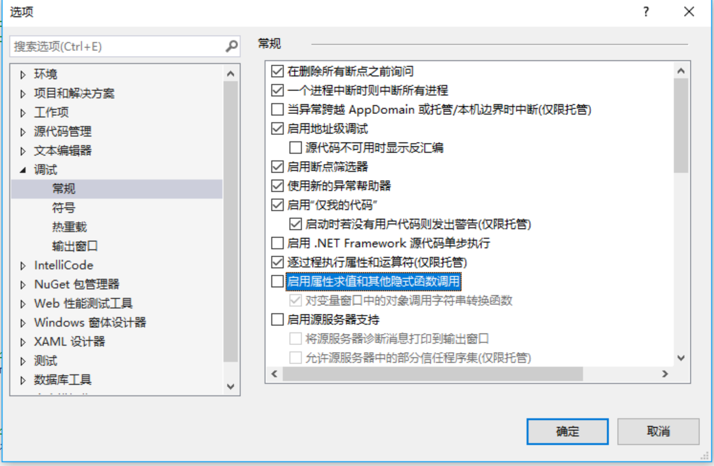

# 第 10 章 属性

本章内容：

* <a href="#10_1">无参属性</a>
* <a href="#10_2">有参属性</a>
* <a href="#10_3">调用属性访问器方法时的性能</a>
* <a href="#10_4">属性访问器的可访问性</a>
* <a href="#10_5">泛型属性访问器方法</a>

本章讨论`属性`，它允许源代码用简化语法来调用方法。CLR 支持两种属性；`无参属性`，平时说的属性就是指它；`有参属性`，它在不同的编程语言中有不同的称呼。例如，C# 将有参属性称为`索引器`，Microsoft Visual Basic 将有参属性称为`默认属性`。还要讨论如何使用“对象和集合初始化器”来初始化属性，以及如何用 C# 的匿名类型和 `System.Tuple` 类型将多个属性打包到一起。

## <a name="10_1">10.1 无参属性</a>

许多类型都定义了能被获取或更改的状态信息。这种状态信息一般作为类型的字段成员实现。例如，以下类型定义包含两个字段：

```C#
public sealed class Employee {
    public String Name;         // 员工姓名
    public Int32 Age;           // 员工年龄
}
```

创建该类型的实例后，可以使用以下形式的代码轻松获取(get)或设置(set)它的状态信息：

```C#
Employee e = new Employee();
e.Name = "Jeffrey Richter";    // 设置员工姓名
e.Age = 45;                    // 设置员工年龄

Console.WriteLine(e.Name);     // 显示 "Jeffrey Richter"
```

这种查询和设置对象状态信息的做法十分常见。但我必须争辩的是，永远都不应该像这样实现。面向对象设计和编程的重要原则之一就是`数据封装`，意味着类型的字段永远不应该公开，否则很容易因为不恰当使用字段而破坏对象的状态。例如，以下代码可以很容易地破坏一个`Employee` 对象：

```C#
    e.Age = -5;     // 怎么可能有人是 -5 岁呢？
```

还有其他原因促使我们封装对类型中的数据字段的访问。其一，你可能希望访问字段来执行一些副作用<sup>①</sup>、缓存某些值或者推迟创建一些内部对象<sup>②</sup>。其二，你可能希望以线程安全的方式访问字段。其三，字段可能是一个逻辑字段，它的值不由内存中的字节表示，而是通过某个算法来计算获得。
> ① 即 side effect；在计算机编程中，如果一个函数或表达式除了生成一个值，还会造成状态的改变，就说它会造成副作用；或者说会执行一个副作用。——译注
> ② 推迟创建对象是指在对象第一次需要时才真正创建它。——译注

基于上述原因，强烈建议将所有字段都设为 `private`。要允许用户或类型获取或设置状态信息，就公开一个针对该用途的方法。封装了字段访问的方法通常称为`访问器(accessor)`方法。访问器方法可选择对数据的合理性进行检查，确保对象的状态永远不被破坏。例如，我将上一个类重写为以下形式：

```C#
public sealed class Employee {
    private String m_Name;   // 字段现在是私有的
    private Int32 m_Age;     // 字段现在是私有的

    public String GetName() {
        return (m_Name);
    }

    public void SetName(String value) {
        m_Name = value;
    }

    public Int32 GetAge() {
        return (m_Age);
    }

    public void  SetAge(Int32 value) {
        if (value < 0)
            throw new ArgumentOutOfRangeException("value", value.ToString(), 
                            "The value must be greater than or equal to 0");
        m_Age = value;
    }
}
```

虽然这只是一个简单的例子，但还是可以看出数据字段封装带来的巨大好处。另外可以看出，实现只读属性或只写属性是多么简单！只需选择不实现一个访问器即可。另外，将 `SetXxx` 方法标记为 `protected`，就可以只允许派生类型修改值。

但是，像这样进行数据封装有两个缺点。首先，因为不得不实现额外的方法，所以必须写更多的代码；其次，类型的用户必须调用方法，而不能直接引用字段名。

```C#
e.SetName("Jeffrey Richter");       // 更新员工姓名
String EmployeeName = e.GetName();  // 获取员工姓名
e.SetAge(41);                       // 更新员工年龄
e.SetAge(-5);                       // 抛出 ArgumentOutOfRangeException 异常
Int32 EmployeeAge = e.GetAge();     // 获取员工年龄
```

我个人认为这些缺点微不足道。不过，编程语言和 CLR 还是提供了一个称为**属性(property)**的机制。它缓解了第一个缺点所造成的影响，同时完全消除了第二个缺点。

```C#
public sealed class Employee {
    private String m_Name;
    private Int32 m_Age;

    public String Name {
        get { return (m_Name); }
        set { m_Name = value; }       // 关键字 value 总是代表新值
    }

    public Int32 Age {
        get { return (m_Age); }
        set {
            if (value < 0)           // 关键字 value 总是代表新值 
                throw new ArgumentOutOfRangeException("value", value.ToString(), 
                            "The value must be greater than or equal to 0");
            m_Age = value;
        }
    }
}
```

如你所见，属性使类型的定义稍微复杂了一些，但由于属性允许采用以下形式来写代码，所以额外的付出还是值得的：

```C#
e.Name = "Jeffrey Richter";         // set 员工姓名
String EmployeeName = e.Name;       // get 员工姓名
e.Age = 41;                         // set 员工年龄
e.Age = -5;                         // 抛出 ArgumentOutOfRangeException 异常
Int32 EmployeeAge = e.Age;          // get 员工年龄
```

可将属性想象成`智能字段`，即背后有额外逻辑的字段。CLR 支持静态、实例、抽象和虚属性。另外，属性可用任意“可访问性”修饰符来标记(详情参见第 6.3 节“成员的可访问性”)，而且可以在接口中定义(详情参见第 13 章“接口”)。

每个属性都有名称和类型(类型不能是 `void`)。属性不能重载，即不能定义名称相同、类型不同的两个属性。定义属性时通常同时指定 `get` 和 `set`两个方法。

经常利用属性的 `get` 和 `set` 方法操纵类型中定义的私有字段。私有字段通常称为**支持字段**(backing field)。但 `get` 和 `set` 方法并非一定要访问支持字段。例如，`System.Threading.Thread`类型提供了  `Priority` 属性来直接和操作系统通信。`Thread` 对象内部没有一个关于线程优先级的字段。没有支持字段的另一种典型的属性是在运行时计算的只读属性。例如，以 0 结束的一个数组的长度或者已知高度和宽度的一个矩形的面积。

定义属性时，取决于属性的定义，编译器在最后的托管程序集中生成以下两项或三项。

* 代表属性 `get` 访问器的方法。仅在属性定义了 `get` 访问器方法时生成。
* 代表属性 `set` 访问器的方法。仅在属性定义了 `set` 访问器方法时生成。
* 托管程序集元数据中的属性定义。这一项必然生成。

以前面的`Employee`类型为例。编译器编译该类型时发现其中的`Name`和`Age`属性。由于两者都有`get`和`set`访问器方法，所以编译器在`Employee`类型中生成 4 个方法定义，这造成原始代码似乎是像下面这样写的：

```C#
public sealed class Employee {
    private String m_Name;
    private Int32 m_Age;

    public String get_Name() {
        return m_Name;
    }

    public void set_Name (String value) {
        m_Name = value;         // 实参 value 总是代表新设的值
    }

    public Int32 get_Age() {
        return m_Age;
    }

    public void set_Age(Int32 value) {
        if (value < 0)  // value 总是代表新值
            throw new ArgumentOutOfRangeException("value", value.ToString(), 
                            "The value must be greater than or equal to 0");
        m_Age = value;
    }
}
```

编译器在你指定的属性名之前自动附加 `get_` 或 `set_` 前缀来生成方法名。C# 内建了对属性的支持。C# 编译器发现代码试图获取或设置属性时，实际会生成对上述某个方法的调用。即使编程语言不直接支持属性，也可调用需要的访问器方法来访问属性。效果一样，只是代码看起来没那么优雅。

除了生成访问器方法，针对源代码中定义的每一个属性，编译器还会在托管程序集的元数据中生成一个属性定义项。在这个记录项中，包含了一些标志(falgs)以及属性的类型。另外，它还引用了`get`和`set`访问器方法。这些信息唯一的作用就是在“属性”这种抽象概念与它的访问器方法之间建立起一个联系。编译器和其他工具可利用这种元数据信息(使用`System.Reflection.PropertyInfo` 类来获得)。CLR 不使用这种元数据信息，在运行时只需要访问器方法。

### 10.1.1 自动实现的属性

如果只是为了封装一个支持字段而创建属性，C#还提供了一种更简洁的语法，称为**自动实现的属性**(Automatically Implemented Property，后文简称为 AIP)，例如下面的 `Name` 属性：

```C#
public sealed class Employee {
    // 自动实现的属性
    public String Name { get; set; }

    private Int32 m_Age;

    public Int32 Age {
        get { return(m_Age); }
        set {
            if(value < 0)    // value 关键字总是代表新值
                throw new ArgumentOutOfRangeException("value", value.ToString(), 
                "The value must be greater than or equal to 0"); 

            m_Age = value;
        }
    }
}
```

声明属性而不提供 `get/set` 方法的实现，C# 会自动为你声明一个私有字段。在本例中，字段的类型是 `String`，也就是属性的类型。另外，编译器会自动实现`get_Name`和`set_Name`方法，分别返回和设置字段中的值。

和直接声明名为`Name`的`public String`字段相比，AIP 的优势在哪里？事实上，两者存在一处重要的区别。使用 AIP，意味着你已经创建了一个属性。访问该属性的任何代码实际都会调用`get`和`set`方法。如果以后决定自己实现`get`和/或`set`方法，而不是接受编译器的默认实现，访问属性的任何代码都不必重新编译。然而，如果将 `Name` 声明为字段，以后又想把它更改为属性，那么访问字段的所有代码都必须重新编译才能访问属性方法。

* 我个人不喜欢编译器的 AIP 功能，所以一般会避免使用它。理由是：字段声明语法可能包含初始化部分，所以要在一行代码中声明并初始化字段。但没有简单的语法初始化 AIP。所以，必须在每个构造器方法中显式初始化每个 AIP。

* 运行时序列化引擎将字段名持久存储到序列化的流中。AIP 的支持字段名称由编译器决定，每次重新编译代码都可能更改这个名称。因此，任何类型只要含有一个 AIP，就没办法对该类型的实例进行反序列化。在任何想要序列化或反序列化的类型中，都不要使用 AIP 功能。

* 调试时不能在 AIP 的`get`或`set`方法上添加断点，所以不好检测应用程序在什么时候获取或设置这个属性。相反，手动实现的属性可设置断点，查错更方便。

还要注意，如果使用 AIP，属性必然是可读和可写的。换言之，编译器肯定同时生成 `get`和`set`方法。这个设计的道理在于，只写字段的支持字段到底是什么名字，所以代码只能用属性名访问属性。另外，任何访问器方法(`get`或`set`)要显式实现，两个访问器方法都必须显式实现，就不能使用 AIP 功能了。换言之， AIP 是作用于整个属性的；要么都用，要么都不用。不能显式实现一个访问器方法，而让另一个自动实现。

### 10.1.2 合理定义属性

我个人不喜欢属性，我还希望 Microsoft .NET Framework 及其编程语言不要提供对属性的支持。理由是属性看起来和字段相似，单本质是方法。这造成了大量误解。程序员在看到貌似访问字段的代码时，会做出一些对属性来说不成立的假定，具体如下所示。

* 属性可以只读或只写，而字段访问总是可读和可写的(一个例外是`readonly`字段仅在构造器中可写)。如果定义属性，最好同时为它提供 `get` 和 `set`访问器方法。

* 属性方法可能抛出异常；字段访问永远不会。

* 属性不能作为 `out` 或 `ref` 参数传给方法，而字段可以。例如以下代码是编译不了的：

```C#
using System;

public sealed class SomeType {
    private static String Name {
        get { return null; }
        set { }
    }

    static void MethodWithOutParam(out String n） { n = null; }

    public static void Main() {
        // 对于下一代代码，C#编译器将报告一下错误消息：
        // errot CS0206：属性或所引器不得作为 out 或 ref 参数传递
        MethodWithOutParam(out Name);
    }
}
```

* 属性方法可能比较长时间执行，字段访问则总是立即完成。许多人使用属性是为了线程同步，这就可能造成线程永远终止。所以，要线程同步就不要使用属性，而要使用方法。此外，如果你的类可以被远程访问(例如从 `System.MashalByRefObject` 派生)，调用属性方法会非常慢。在这种情况下应该优先使用方法而不是属性。我个人认为从 `MashalByRefObject` 派生的类永远都不应该使用属性。

* 连续多次调用，属性方法每次都可能返回不同的值，字段则每次都返回相同的值。`System.DateTime` 类的只读属性 `Now` 返回当前日期和时间。每次查询这个属性都返回不同的值。这是一个错误，Microsoft 现在很想修正这个错误，将 `Now` 改成方法而不是属性。`Environment`的`TickCount`属性是Microsoft犯错的另一个例子。

* 属性方法可能造成明显的副作用<sup>①</sup>，字段访问则永远不会。类型的使用者应该能按照他/她选择的任何顺序设置类型定义的各个属性，而不会造成类型中(因为设置顺序的不同)出现不同的行为。
> ① 这里的副作用(side effect)是指，访问属性时，除了单纯设置或获取属性，还会造成对象状态的改变。如果存在多个副作用，程序的行为就要依赖于历史；或者说要依赖于求值顺序。如果以不同的顺序设置属性，类型每一次的行为都不同，那么显然是不合理的。——译注

* 属性方法可能需要额外的内存，或者返回的引用并非指向对象状态一部分，造成对返回对象的修改作用不到原始对象身上。而查询字段返回的引用总是指向原始对象状态的一部分。使用会返回一个拷贝的属性很容易引起混淆，文档也经常没有专门说明。<sup>②</sup>

> 指开发人员在文档中没有清楚地指明这是属性，而且返回的是一个 copy，造成别人在使用这个类时产生混淆。 —— 译注

> 属性和 Visual Studio 调试器  
>  Microsoft Visual Studio 允许在调试器的监视窗口中输入一个对象的属性。这样一来，每次遇到一个断点，调试器都会调用属性的 `get` 访问器方法，并显示返回值。这个技术在查错时很有用，但也有可能造成 bug，并损害调试性能。例如，假定为网络共享中的文件创建了一个 `FileStream`，然后将 `FileStream` 的 `Length` 属性添加到调试器的监视窗口中。现在，每次遇到一个端点，调试器都会调用 `Length` 的 `get` 访问器方法，该方法内部向服务器发出一个网络请求来获取文件的当前长度！  
> 类似地，如果属性的`get`访问器方法有一个 side effect，那么每次抵达断点，都会执行这个 side effect。例如，假定属性的 `get` 访问器方法每次调用时都递增一个计数器，这个计数器每次抵达断点时也会递增。考虑到可能有这些问题，Visual Studio 允许为监视窗口中显示的属性关闭属性求值。要在 Visual Studio 中关闭属性求值，请选择 "工具" | "选项" | "调试" | “常规”。然后，在如果 10-1 所示的列表框中，清除勾选“启用属性求值和其他隐式函数调用”。注意，即使清除了这个选项，仍可将属性添加到监视窗口，然后手动强制 Visual Studio 对它进行求值。为此，单击监视窗口“值”列中的强制求值圆圈即可。  
  
图 10-1 Visual Studio 的常规调试设置  

我发现现在的人对属性的依赖有过之而无不及，经常是不管有没有必要都使用属性。仔细研究一下上面这个属性和字段差别列表，你会发现只有在极个别的情况下，定义属性才真正有用，同时不会造成开发人员的混淆。属性唯一的好处就是提供了简化的语法。和调用普通方法(非属性中的方法)相比，属性不仅不会提升代码的性能，还会妨碍对代码的理解。要是我参与.NET Framework 以及编译器的设计，根本就不会提供属性；相反，我会让程序员老老实实地实现 `GetXxx` 和 `SetXxx` 方法。然后，编译器可以提供一些特殊的、简化的语法来调用这些方法。但是，我希望编译器使用有别于字段访问的语法，使程序员能正真理解他们正在做什么——是在调用一个方法！

### 10.1.3 对象和集合初始化器

经常要构造一个对象并设置对象的一些公共属性(或字段)。为了简化这个常见的编程模式，C# 语言支持一种特殊的对象初始化语法。下面是一个例子：

```C#
Employee e = new Employee() { Name = "Jeff", Age = 45; }
```

这个语句做了好几件事情，包括构造一个 `Employee` 对象，调用它的无参数构造器，将它的公共 `Name` 属性设为 "Jeff"，并将公共 `Age` 属性设为 `45`。事实上，这一行代码等价于以下几行代码。可以检查两者的 IL 代码来加以验证。

```C#
Employee e = new Employee();
e.Name = "Jeff";
e.Age = 45;
```

对象初始化器语法真正的好处在于，它允许在表达式的上下文(相当于语句的上下文)中编码，允许组合多个函数，进而增强了代码的可读性。例如，现在可以写这样的代码：

```C#
String s = new Employee() { Name = "Jeff", Age = 45 }.ToString().ToUpper();
```

这个语句做的事情更多，首先还是构造一个 `Employee` 对象，调用它的构造器，再初始化两个公共属性。然后，在结果表达式上，先调用 `ToString`，再调用 `ToUpper`。要深入了解函数的组合使用，请参见 8.6 节“扩展方法”。

作为一个小的补充，如果想调用的本来就是一个无参构造器，C# 还允许省略起始大括号之前的圆括号。下面这行代码生成与上一行相同的IL：

```C#
String s = new Employee { Name = "Jeff", Age = 45 }.ToString().ToUpper();
```

如果属性的类型实现了 `IEnumerable` 或 `IEnumerable<T>` 接口，属性就被认为是集合，而集合的初始化是一种相加(additive)操作，而非替换(replacement)操作。例如，假定有下面这个类定义：

```C#
public sealed class Classroom {
    private List<String>  m_students = new List<String>();
    public List<String> Students { get { return m_students; } }

    public Classroom() { }
}
```

现在可以写代码来构造一个 `Classroom` 对象，并像下面这样初始化 `Students` 集合：

```C#
public static void M() {
    Classroom classroom = new Classroom {
        Students = { "Jeff", "Kristin", "Aidan", "Grant" }
    };

    // 显示教室中的 4 个学生
    foreach (var student in classroom.Students)
        Console.WriteLine(student);
}
```

编译上述代码时，编译器发生 `Students` 属性的类型是 `List<String>`，而且这个类型实现了 `IEnumerable<String>` 接口。现在，编译器假定`List<String>`类型提供了一个名为`Add`的方法(因为大多数集合类都提供了 `Add` 方法将数据项添加到集合)。然后，编译器生成代码来调用集合的`Add`方法。所以，上述代码会被编译器转换成这样：

```C#
public static void M() {
    Classroom classroom = new Classroom();
    classroom.Student.Add("Jeff");
    classroom.Student.Add("Kristin");
    classroom.Student.Add("Aidan");
    classroom.Student.Add("Grant");

    // 显示教室中的 4 个学生
    foreach (var student in classroom.Students)
        Console.WriteLine(student);
}
```

如果属性的类型实现了 `IEnumerable` 或 `IEnumerable<T>`，但未提供 `Add` 方法，编译器就不允许使用集合初始化语法向集合中添加数据项；相反，编译器报告以下消息：`error CS0117:"System.Collections.Generic.IEnumerable<string>"不包含"Add"的定义`。

有的集合的`Add`方法要获取多个实参，比如 `Dictionary` 的 `Add` 方法：

```C#
public void Add(TKey key, TValue value);
```

通过在集合初始化器中嵌套大括号的方式，可向 `Add` 方法传递多个实参，如下所示：

```C#
var table = new Dictionary<String, Int32> (
    { "Jeffrey" , 1 }, { "Kristin", 2 }, { "Aidan", 3 }, { "Grant", 4 }
);
```

它等价于以下代码：

```C#
var table = new Dictionary<String, Int32>();
table.Add("Jeffrey", 1);
table.Add("Kristin", 2);
table.Add("Aidan", 3);

table.Add("Grant", 4);
```

### 10.1.4 匿名类型

利用 C# 的匿名类型功能，可以用很简洁的语法来自动声明不可变(immutable)的元组类型。元组<sup>①</sup>类型是含有一组属性的类型，这些属性通常以某种方式相互关联。在以下代码的第一行中，我定义了含有两个属性(`String` 类型 `Name` 和 `Int32` 类型的 `Year`)的类，构造了该类型的实例，将 `Name` 属性设为 `"Jeff"`，将 `Year` 属性设为 `1964`。
> ①  元组(tuple)一次来源于对顺序的抽象：`single`，`double`，`triple`，`quadruple`，`quintuple`，`n-tuple`。
```C#
// 定义类型，构造实例，并初始化属性
var o1 = new { Name = "Jeff", Year = 1964 };

// 在控制台上显示属性： Name=Jeff, Year=1964
Console.WriteLine("Name={0}, Year={1}", o1.Name, ol.Year);
```

第一行代码创建了匿名类型，我没有在 `new` 关键字后制定类型名称，所以编译器会自动创建类型名称，而且不会告诉我这个名称具体是什么(这正是匿名的含义)。这行代码使用上一节讨论的“对象初始化器”语法来声明属性，同时初始化这些属性。另外，由于我(开发人员)不知道编译时的类型名称，也就不知道变量`o1` 声明为什么类型。但这不是问题，因为可以像第 9 章讨论过的那样使用 C# 的“隐式类型局部变量”功能(`var`)。它的作用是告诉编译器根据赋值操作符(=)右侧的表达式推断类型。

```C#
var o = new { property1 = expression1, ..., propertyN = expressionN };
```

编译器会推断每个表达式的类型，创建推断类型的私有字段，为每个字段创建公共只读属性，并创建一个构造器来接受所有这些表达式。在构造器的代码中，会用传给它的表达式的求值结果来初始化私有只读字段。除此之外，编译器还会重写 `Object` 的 `Equals`，`GetHashCode`和`ToString`方法，并生成所有这些方法中的代码。最终，编译器生成的类看起来像这样：

```C#
[CompilerGenerated]
internal sealed class <>f__AnonymousType0<...>: Object {
    private readonly t1 f1;
    public t1 p1 { get { return f1; } }

    ...

    private readonly tn fn;
    public tn pn { get { return fn; } }

    public <>f__AnonymousType0<...>(t1 a1, ..., tn an) {
        f1 = a1; ...; fn = an;           // 设置所有字段
    }

    public override Boolean Equals(Object value) {
        // 任何字段不匹配就返回 false，否则返回 true
    }

    public override Int32 GetHashCode() {
        // 返回根据每个字段的哈希码生成的一个哈希码
    }

    public override String ToString() {
        // 返回“属性名=值”对的以逗号分隔的列表
    }
}
```

编译器会生成 `Equals` 和 `GetHashCode` 方法，因此匿名类型的实例能放到哈希表集合中。属性是只读的，而非可读可写，目的是防止对象的哈希码会造成再也找不到它。编译器会生成`ToString`方法来帮助进行调试。在 Visual Studio 调试器中，可将鼠标指针放在引用了匿名类型实例的一个变量上方。随后， Visual Studio 会调用`ToString`方法，并在一个提示窗口中显示结果字符串。顺便说一句，在编辑器中写代码时， Visual Studio 的“智能感知”功能会提示属性名，这是非常好用的一个功能。

编译器支持用另外两种语法声明匿名类型中的属性，能根据变量推断属性名和类型：

```C#
String Name = "Grant";
DateTime dt = DateTime.Now;

// 有两个属性的一个匿名类型
// 1. String Name 属性设为"Grant"
// 2. Int32 Year 属性设为 dt 中的年份
var o2 = new { Name, dt.Year };
```

在这个例子中，编译器判断第一个属性应该叫 `Name`。由于 `Name` 是局部变量的名称，所以编译器将属性类型设为与局部变量相同的类型：`String`。对于第二个属性，编译器使用字段/属性的名称：`Year`。`Year`是`DateTime`类的一个`Int32`属性，所以匿名类型中的`Year`属性也是一个`Int32`。箱现在，当编译器构造这个匿名类型的一个实例时，会将实例的`Name`属性设为`Name`局部变量中的值，使`Name`属性引用同一个“Grant”字符串。编译器还要将实例的`Year`属性设为与`dt`的`Year`属性返回的值相同。

编译器在定义匿名类型时是非常“善解人意”的。如果它看到你在源代码中定义了多个匿名类型，而且这些类型具有相同的结构，那么它只会创建一个匿名类型定义，但创建该类型的多个实例。所谓“相同的结构”，是指在这些匿名类型中，每个属性都有相同的类型和名称，而且这些属性的指定顺序相同。在前面的几个例子中，变量`o1` 和 `o2` 就是同类型的，因为在定义匿名类型的两行代码中，都是先一个`String`类型的`Name`属性，再一个`Int32`类型的`Year`属性。

由于两个变量(`o1` 和 `o2`)的类型相同，所以可以做一些非常“酷”的事情，比如检查两个对象是否包含相等的值，并将对一个对象的引用赋给正在指向另一个对象的变量，如下所示：

```C#
// 一个类型允许相等测试和赋值操作
Console.WriteLine("Objects are equal: " + o1.Equals(o2));
o1 = o2;  // 赋值
```

另外，由于这种类型的同一性，所以可以创建一个隐式类型的数组(详情参见 16.1 节“初始化数组元素”)，在其中包含一组匿名类型的对象。

```C#
// 之所以能这样写，是因为所有对象都是相同的匿名类型
var people = new []{
    o1,         // o1 的定义参见本节开头
    new { Name = "Kristin", Year = 1970 },
    new { Name = "Aidan", Year = 2003 },
    new { Name = "Grant", Year = 2008 }
};

// 下面展示如何遍历匿名类型的对象构成的数组(var 是必须的)
foreach (var person in people) 
    Console.WriteLine("Person={0}, Year={1}", person.Name, person.Year);
```

匿名类型经常与 LINQ(Language Intergrated Query，语言集成查询)配合使用。可用 LINQ 执行查询，从而生成由一组对象构成的集合，这些对象都是相同的匿名类型。然后，可以对结果集合中对象进行处理。所有这些都是在同一个方法中发生的。下例展示了如何如何返回“我的文档”文件夹中过去7天修改过的所有文件：

```C#
String myDocuments = Environment.GetFolderPath(Environment.SpecialFolder.MyDocuments);
var query = from pathname in Directory.GetFiles(myDocuments)
            let LastWriteTime = File.GetLastWriteTime(pathname)
            where LastWriteTime > (DateTime.Now - TimeSpan.FromDays(7))
            orderby LastWriteTime
            select new { Path = pathname, LastWriteTime };      // 匿名类型的对象构成的集合

foreach (var file in query)
    Console.WriteLine("LastWriteTime={0}, Path={1}", file.LastWriteTime, file.Path);
```

匿名类型的实例不能泄露到方法外部。方法原型不能接受匿名类型的参数，因为无法指定匿名类型。类似地，方法也不能返回对匿名类型的引用。虽然可以将匿名类型的实例视为一个`Object`(所有匿名类型都从`Object`派生)，但没办法将`Object`类型的变量转型回匿名类型，因为不知道在匿名类型在编译时的名称，要传递元组，应考虑使用下一节讨论的 `System.Tuple` 类型。

### 10.1.5 `System.Tuple`类型

在 `System` 命名空间，Microsoft 定义了几个泛型 `Tuple` 类型，它们全部从 `Object` 派生，区别只在于元数<sup>①</sup>(泛型参数的个数)。下面演示了最简单和最复杂的 `Tuple` 类型：
> ① 元数的英文是 arity。在计算机编程中，一个函数或运算(操作)的元数是指函数获取的实参或操作数的个数。它源于像`unary(arity=1)、binary(arity=2)、ternary(arity=3)`这样的单词。——译注

```C#
// 这是最简单：
[Serializable]
public class Tuple<T1> {
    private T1 m_Item1;
    public Tuple(T1 item1) { m_Item1 = item1; }
    public T1 Item1 { get { return m_Item1; } }
}

// 这是最复杂的：
[Serializable]
public class Tuple<T1, T2, T3, T4, T5, T6, T7, TRest> {
    private T1 m_Item1; private T2 m_Item2; private T3 m_Item3; private T4 m_Item4;
    private T5 m_Item5; private T6 m_Item6; private T7 m_Item7; private TRest m_Rest;
    public Tuple(T1 item1, T2 item2, T3 item3, T4 item4, T5 item5, T6 item6, T7 item7, TRest rest) {
        m_Item1 = item1; m_Item2 = item2; m_Item3 = item3; m_Item4 = item4; 
        m_Item5 = item5; m_Item6 = item6; m_Item7 = item7; m_Rest = rest;
    }

    public T1 Item1 { get { return m_Item1; } }
    public T2 Item2 { get { return m_Item2; } }
    public T3 Item3 { get { return m_Item3; } }
    public T4 Item4 { get { return m_Item4; } }
    public T5 Item5 { get { return m_Item5; } }
    public T6 Item6 { get { return m_Item6; } }
    public T7 Item7 { get { return m_Item7; } }
    public TRest Rest { get { return m_Rest; } }
}
```

和匿名
