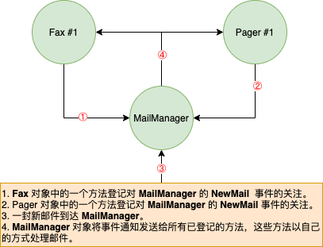

# 第 11 章 事  件

本章内容：
* <a href="#11_1">设计公开事件的类型</a>
* <a href="#11_2">编译器如何实现事件</a>
* <a href="#11_3">设计侦听事件的类型</a>
* <a href="#11_4">显式实现事件</a>

本章讨论可以在类型中定义的最后一种成员：事件。定义了事件成员的类型允许类型(或类型的实例)通知其他对象发生了特定的事情。例如，`Button` 类提供了 `Click` 事件。应用程序中的一个或多个对象可接收关于该事件的通知，以便在`Button`被单击之后采用特定操作。我们用事件这种类型成员来实现这种类型成员来实现这种交互。具体地说，定义了事件成员成员的类型能提供以下功能。

* 方法能登记它对事件的关注。
* 方法能注销它对事件的关注。
* 事件发生时，登记了的方法将收到通知。

类型之所以能提供事件通知功能，是因为类型维护了一个已登记方法的列表。事件发生后，类型将通知列表中所有已登记的方法。

CLR 事件模型以**委托**为基础。委托是调用<sup>①</sup>回调方法的一种类型安全的方式。对象凭借回调方法接收它们订阅的通知。本章会开始使用委托，但委托的完整细节是在第 17 章"委托"中讲述的。
> 这个“调用”(invoke)理解为“唤出”更恰当。它和普通的“调用”(call)稍有不同。在英语的语境中，invoke 和 call 的区别在于，在执行一个所有信息都已知的方法时，用 call 比较恰当。这些信息包括要引用的类型、方法的签名以及方法名。但是，在需要先“唤出”某个东西来帮你调用一个信息不明的方法时，用 invoke 就比较恰当。但是，由于两者均翻译为“调用”不会对读者的理解造成太大的困扰，所以本书仍然采用约定俗成的方式来进行翻译，只是在必要的时候附加英文原文提醒你区分。 —— 译注

为了帮你完整地理解事件在 CLR 中的工作机制，先来描述事件很有用的一个场景。假定要设计一个电子邮件应用程序。电子邮件到达时，用户可能希望将该邮件转发给传真机或寻呼机。先设计名为 `MailManager` 的类型来接收传入的电子邮件，它公开 `NewMail` 事件。

其他类型(如 `Fax` 和 `Pager`)的对象登记对于该事件的关注。`MailManager` 收到新电子邮件会引发该事件，造成邮件分发给每一个已登记的对象。每个对象都用它们自己的方式处理邮件。

应用程序初始化时只实例化一个 `MailManager` 实例，然后可以实例化任意数量的 `Fax` 和 `Pager`
对象。图 11-1 展示了应用程序如何初始化，以及新电子邮件到达时发生的事情。

  
图 11-1 设计使用了事件的应用程序 

图 11-1 的应用程序首先构造 `MailManager` 的一个实例。 `MailManager` 提供了 `NewMail` 事件。构造 `Fax` 和 `Pager` 对象时，它们向 `MailManager` 的 `NewMail` 事件登记自己的一个实例方法。这样当新邮件到达时， `MailManager` 就知道通知 `Fax` 和 `Pager` 对象。`MailManager` 将来收到新邮件时会引发 `NewMail` 事件，使自己登记的方法都有机会以自己的方式处理邮件。

## <a name="11_1">11.1 设计要公开事件的类型</a>

开发人员通过连续几个步骤定义公开了一个或多个事件成员的类型。本节详细描述了每个必要的步骤。`MailManager` 示例应用程序(可从 *http://wintellect.com* 下载)展示了 `MailManager` 类型、`Fax` 类型和 `Pager` 类型的所有源代码。注意，`Pager`类型和`Fax`类型几乎完全性相同。

### 11.1.1 第一步：定义类型来容纳所有需要发送给事件通知接收者的附加信息

事件引发时，引发事件的对象可能希望向接收事件通知的对象传递一些附件信息。这些附加信息需要封装到它自己的类中，该类通常包含一组私有字段，以及一些用于公开这些字段的只读公共属性。根据约定，这种类应该从 `System.EventArgs` 派生，而且类名以 `EventArgs` 结束。本例将该类命名为 `NewMailEventArgs` 类，它的各个字段分别标识了发件人(`m_from`)、收件人(`m_to`)和主题(`m_subject`)。

```C#
// 第一步：定义一个类型来容纳所有应该发送给事件通知接受者的附加信息
internal class NewMailEventArgs : EventArgs {
    private readonly String m_from, m_to, m_subject;

    public NewMailEventArgs(String from, String to, String subject) {
        m_from = from; m_to = to; m_subject = subject;
    }

    public String From { get { return m_from; } }
    public String To { get { return m_to; } }
    public String Subject { get { return m_subject; } }
}
```

> 注意 `EventArgs` 类在 Microsoft .NET Framework 类库(FCL)中定义，其实现如下：

```C#
[ComVisible(true), Serializable]
public class EventArgs {
	public static readonly EventArgs Empty = new EventArgs();
	public EventArgs() { }
}
```

> 可以看出，该类型的实现非常简单，就是一个让其他类型继承的基类型。许多事件都没有附加信息需要传递。例如，当一个 `Button` 向已登记的接收者通知自己被单击时，调用回调方法就可以了。定义不需要传递附加数据的事件时，可直接使用 `EventArgs.Empty`，不用构造新的 `EventArgs` 对象。

### 11.1.2 第二步：定义事件成员

事件成员使用 C# 关键字 `event` 定义。每个事件成员都要指定以下内容：可访问性标识符(几乎肯定是 `pulbic`，这样其他代码才能访问该事件成员)；委托类型，指出要调用的方法的原型；以及名称(可以是任何有效的标识符)。以下是我们的 `MailManager` 类中的事件成员：

```C#
internal class MailManager {

    // 第二部：定义事件成员
    public event EventHandler<NewMailEventArgs> NewMail;
    ...
}
```

`NewMail` 是事件名称。事件成员的类型是 `EventHandler<NewMailEventArgs>`，意味着“事件通知”的所有接收者都必须提供一个原型和 `EventHandler<NewMailEventArgs>`委托类型匹配的回调方法。由于泛型 `System.EventHandler` 委托类型的定义如下：

```C#
public delegate void EventHandler<TEventArgs>(Object sender, TEventArgs e);
```

所以方法原型必须具有以下形式：

```C#
void MethodName(Object sender, NewMailEventArgs e);
```

> 注意 许多人奇怪事件模式为什么要求 `sender` 参数是 `Object` 类型。毕竟，只有 `MailManager` 才会引发传递了 `NewMailEventArgs` 对象的事件，所以回调方法更合适的原型似乎是下面这个：  
`void MethodName(MailManager sender, NewMailEventArgs e);`  
要求 `sender` 是 `Object` 主要是因为继承。例如，假定`MailManager` 成为`SmtpMailManager`的基类，那么回调方法的 `sender` 参数应该是 `SmtpMailManager` 类型而不是`MailManager`类型。但这不可能发生，因为`SmtpMailManager` 继承了 `NewMail` 事件。所以，如果代码需要由`SmtpMailManager` 引发事件，还是要将`sender` 实参转型为`SmtpMailManager`。反正都要进行类型转换，这和将`sender`定为`Object`类型没什么两样。  
将`sender`参数的类型定为`Object`的另一个原因是灵活性。它使委托能由多个类型使用，只要类型提供了一个会传递 `NewMailEventArgs`对象的事件。例如，即使 `PopMailManager` 类不是从 `MailManager`类派生的，也能使用这个委托。
此外，事件模式要求委托定义和回调方法将派生自`EventArgs` 的参数命名为 `e`。这个要求唯一的作用就是加强事件模式的一致性，使开发人员更容易学习和实现这个模式。注意，能自动生成源代码的工具(比如 Microsoft Visual Studio)也知道将参数命名为`e`。  
最后，事件模式要求所有事件处理程序<sup>①</sup>的返回都是`void`。这很有必要，因为引发事件后可能要调用好几个回调方法，但没办法获得所有方法的返回值。将返回类型定为`void`，就不允许回调(方法)返回值。遗憾的是，FCL中的一些事件处理程序(比如`ResolveEventHandler`)没有遵循 Microsoft 自定的模式。例如， `ResolveEventHandler` 事件处理程序会返回 `Assembly` 类型的对象。

> ①本书按约定俗成的译法将 event handler 翻译成“事件处理程序”，但请把它理解成“事件处理方法”(在 VB 中，则理解成“事件处理 Sub 过程”)。——译注

### 11.1.3 第三步：定义负责引发事件的方法来通知事件的登记对象

按照约定，类要定义一个受保护的虚方法。引发事件时，类及其派生类中的代码会调用该方法。方法只获取一个参数，即一个 `NewMailEventArgs` 对象，其中包含了传给接收通知的对象的信息。方法的默认实现知识检查一下是否有对象登记了对事件的关注。如果有，就引发事件来通知事件的登记对象。该方法在 `MailManager` 类中看起来像下面这样：

```C#
internal class MailManager {
    ...
    // 第三步 ： 定义负责引发事件的方法来通知已登记的对象。
    // 如果类是密封的，该方法要声明为私有和非虚
    protected virtual void OnNewMail(NewMailEventArgs e) {
        // 出于线程安全的考虑，现在将对委托字段的引用复制到一个临时变量中
        EventHandler<NewMailEventArgs> temp = Volatile.Read(ref NewMail);

        // 任何方法登记了对事件的关注，就通知它们
        if (temp != null) temp(this, e);
    }
}
```

> 以线程安全的方式引发事件  
> .NET Framework 刚发布时建议开发者用以下方式引发事件：

```C#
// 版本 1 
protected virtual void OnNewMail(NewMailEventArgs e) {
    if (NewNmil != null) NewMail(this, e);
}
```

> `OnNewMail` 方法的问题在于，虽然线程检查出 `NewMail` 不为 `null`，但就在调用 `NewMail` 之前，另一个线程可能从委托链中移除一个委托，使 `NewMail` 成了 `null`。这会抛出`NullReferenceException`异常。为了修正这个竞态问题，许多开发者都像下面这样写 `OnNewMail` 方法

```C#
// 版本 2
protected virtual void OnNewMail (NewMailEventArgs e) {
    EventHandler<NewMailEventArgs> temp = NewMail;
    if (temp != null)  temp(this, e);
}
```

>它的思路是，将对`NewMail`的引用复制到临时变量`temp`中，后者引用赋值发生时的委托链。然后，方法比较`temp`和`null`，并调用(invoke)`temp`；所以，向`temp`赋值后，即使另一个线程更改了`NewMail`也没有关系。委托是不可变的(immutable)，所以这个技术理论上行的通。但许多多开发者没有意识到的是，编译器可能“擅作主张”，通过完全移除局部变量`temp`的方式对上述代码进行优化。如果发生这种情况，版本2就和版本1就没有任何区别。所以，人有可能抛出`NullReferenceException`异常。  
> 要想整个修正这个问题，应该像下面这样重写`OnNewMail`：

```C#
// 版本 3
protected virtual void OnNewMail(NewMailEventArgs e) {
    EventHandler<NewMailEventArgs> temp = Volatile.Read(ref NewMail);
    if (temp != null) temp(this, e);
}
```

> 对`Volatile.Read`的调用强迫`NewMail`在这个调用发生时读取，引用真的必须复制到`temp`变量中(编译器别想走捷径)。然后，`temp` 变量只有在不为`null`时才会被调用(invoke)。第29章“基元线程同步构造”将详细讨论`Volatile.Read`方法。  
> 虽然最后一个版本很完美，是技术正确的版本，但版本2实际也是可以使用的，因为JIT编译器理解这个模式，知道自己不该将局部变量`temp`“优化”掉。具体地说，MIcrosoft 的所有 JIT 编译器都“尊重”那些不会造成对堆内存的新的读取动作的不变量(invariant)。所以，在局部变量中缓存一个引用，可确保堆引用只被访问一次。这一点并未在文档中反映，理论上说将来可能改变，这正是为什么应该使用最后一个版本的原因。但实际上，Microsoft 的 JIT 编译器永远没有可能真的进行修改来破坏这个模式，否则太多的应用程序都会“遭殃”<sup>①</sup>。此外，事件主要在单线程的情形(WPF和Windows Store 应用)中使用，所以线程安全不是问题。  
> 还要注意，考虑到线程竞态条件<sup>②</sup>，方法有可能在从事件的委托链中移除之后得到调用。

> ① 这是 Microsoft 的 JIT 编译器团队的人告诉我的。
> ② 文档翻译成“争用状态”或“争用条件”。——译注

为方便起见，可定义扩展方法(参见第8章“方法”)来封装这个线程安全逻辑。如下所示;

```C#
public static class EventArgsExtensions {
    public statci void Raise<TEventArgs>(this TEventArgs e, Object sender, ref EventHandler<TEventArgs> eventDelegate) {
        
        // 出于线程安全的考虑，现在将对委托字段的引用复制到临时
        EventHandler<TEventArgs> temp = Volatile.Read(ref eventDelegate);

        // 任何方法登记了对事件的关注就通知它们
        if (temp != null) temp(sender, e);
    }
}
```

现在可以像下面这样重写 `OnNewMail` 方法：

```C#
protected virtual void OnNewMail(NewMailEventArgs e) {
    e.Raise(this, ref m_NewMail);
}
```

以`MailManager`作为基类的类可自由重写`OnNewMail`方法。这使派生类能控制事件的引发，以自己的方式处理新邮件。一般情况下，派生类会调用基类的`OnNewMail`方法，使登记的方法能收到通知。但是，派生类也可以不允许事件转发。

### 11.1.4 第四步：定义方法将输入转化为期望事件

类还必须有一个方法获取输入并转化为事件的引发。在 `MailManager` 的例子中，是调用`SimulateNewMail`方法来指出一封新的电子邮件已到达`MailManager`:

```C#
internal class MailManager {

    // 第四步：定义方法将输入转化为期望事件
    public void SimulateNewNail(String from, String to, String subject) {

        // 构造一个对象来容纳想传给通知接收者的信息
        NewMailEventArgs e = new NewMailEventArgs(from, to, subject);

        // 调用虚方法通知对象事件已发生，
        // 如果没有类型重写该方法，我们的对象将通知事件的所有登记对象
        OnNewMail(e);
    }
}
```

`SimualteNewMail`接收关于邮件的信息并构造`NewMailEventArgs`对象，将邮件信息传给它的构造器。然后调用`MailManager`自己的虚方法`OnNewMail`来正式通知`MailManager`对象收到了新的电子邮件。这通常会导致事件的引发，从而通知所有已登记的方法。(如前所述，以`MailManager`为基类的类可能重写这个行为。)

## <a name="11_2">11.2 编译器如何实现事件</a>

知道如何定义提供了事件成员的类之后，接着研究一下事件是什么，以及它是如何工作的。`MailManager`类用一行代码定义了事件成员本身：  
`public event EventHandler<NewMailEventArgs> NewMail;`  

C# 编译器编译时把它转换为以下 3 个构造：

```C#
// 1. 一个初始化为 null 的私有委托字段
private EventHandler<NewMailEventArgs> NewMail = null;

// 2. 一个公共 add_Xxx 方法(其中 XXX 是事件名)
// 允许方法登记对事件的关注
public void add_NewMail(EventHandler<NewMailEventArgs> value) {
    // 通过循环和对 CompareExchange 的调用，可以
    // 以一种线程安全的方式向事件添加委托
    EventHandler<NewMailEventArgs> preHandler;
    EventHandler<NewMailEventArgs> newMail = this.NewMail;
    do {
        preHandler = newMail;
        EventHandler<NewMailEventArgs> newMail = (EventHandler<NewMailEventArgs>) Delegate.Combine(preHandler, value);
        newMail = Interlocked.CompareExchange<EventHandler<NewMailEventArgs>>(ref this.NewMail, newHandler, preHandler);
    } while (newMail != preHandler);
}

// 3. 一个公共 remove_Xxx 方法(其中Xxx是事件名)
// 允许方法注销对事件的关注
public void remove_NewMail(EventHandler<NewMailEventArgs> value) {
    // 通过循环和对 CompareExchange 的调用，可以
    // 以一种线程安全的方式从事件中移除一个委托
    EventHandler<NewMailEventArgs> preHandler;
    EventHandler<NewMailEventArgs> newMail = this.NewMail;
    do {
        preHandler = newMail;
        EventHandler<NewMailEventArgs> newHandler = (EventHandler<NewMailEventArgs>) Delegate.Remove(preHandler, value);
        newMail = Interlocked.CompareExchange<EventHandler<NewMailEventArgs>>(ref this.NewMail, newHandler, preHandler);
    } while (newMail != preHandler);
}
```

第一个构造是具有恰当委托类型的字段。该字段是对一个委托列表的头部的引用。事件发生时会通知这个列表中的委托。字段初始化为`null`，表明无侦听者(listener)登记对该事件的关注。一个方法登记对事件的关注时，该字段会引用 `EventHandler<NewMailEventArgs>`委托的实例，后者可能引用更多的`EventHandler<NewMailEventArgs>`委托。侦听者登记对事件的关注时，只需将委托类型的一个实例添加到列表中。显然，注销(对事件的关注)意味着从列表中移除委托。

注意，即使原始代码行将事件定义为`public`，委托字段(本例是`NewMail`)也始终是`private`。将委托字段定义为`private`，目的是防止类外部的代码不正确地操纵它。如果字段是`public`，任何代码都能更改字段中的值，并可能删除已登记了对事件的关注的委托。

C#编译器生成的第二个构造是一个方法，允许其他对象登记对事件的关注。C#编译器在事件名(`NewMail`)之前附加`add_`前缀，从而自动命名该方法。C#编译器还自动为方法生成代码。生成的代码总是调用`System.Delegate`的静态`Combine`方法，它将委托实例添加到委托列表中，返回新的列表中，返回新的列表头(地址)，并将这个地址存回字段。

C#编译器生成的第三个构造是一个方法，允许对象注销对事件的关注。同样地，C#编译器在事件名(`NewMail`)之前附加`remove_`前缀，从而自动命名该方法。方法中的代码总是调用`Delegate`的静态`Remove`方法，将委托实例从委托列表中删除，返回新的列表头(地址)，并将这个地址存回字段。

> 警告 试图删除从未添加过的方法，`Delegate`的`Remove`方法在内部不做任何事情。也就是说，不会抛出任何异常，也不会显示任何警告；事件的方法集合保持不变。

> 注意 `add`和`remove`方法以线程安全的一种模式更新值。该模式的详情将在29.3.4节“Interlocked Anything模式”讨论。

在本例中，`add`和`remove`方法的可访问性都是`public`。这是因为源代码将事件声明为`public`。如果事件声明为`protected`，编译器生成的`add`和`remove`方法也会被声明为`protected`。因此，在类型中定义事件时，事件的可访问性决定了什么代码能登记和注销对事件的关注。但无论如何，只有类型本身才能直接访问委托字段。事件成员也可声明为`static`或`virtual`。在这种情况下，编译器生成的`add`和`remove` 方法分别标记为 `static` 或 `virtual`。

除了生成上述3个构造，编译器还会在托管程序集的元数据中生成一个事件定义记录项。这个记录项包含了一些标志(flag)和基础委托类型(underlying delegate type)，还引用了`add`和`remove`访问器方法。这些信息的作用很简单，就是建立“事件”的抽象概念和它的访问器方法之间的联系。编译器和其他工具可利用这些元数据信息，并可通过`System.Reflection.EventInfo`类获取这些信息。但是，CLR本身并不使用这些元数据信息，它在运行时只需要访问器方法。

## <a name="11_3">11.3 设计侦听事件的类型</a>

最难的部分已经完成了，接下来是一些较为简单的事情。本节将演示如何定义一个类型来使用另一个类型提供的事件。先来看看`Fax`类型的代码：

```C#
internal sealed class Fax {
    // 将 MailManager 对象传给构造器
    public Fax(MailManager mm) {

        // 构造 EventHandler<NewMailEventArgs> 委托的一个实例，
        // 使它引用我们的 FaxMsg 回调方法
        // 向 MailManager 的 NewMail 事件登记我们的回调方法
        mm.NewMail += FaxMsg;
    }

    // 新电子邮件到达时， MailManager 将调用这个方法
    private void FaxMsg(Object sender, NewMailEventArgs e) {

        // 'sender' 表示 MailManager 将调用这个方法

        // 'e' 表示 MailManager 对象想传给我们的附加事件信息
        // 这里的代码正常情况下应该传真电子邮件，
        // 但这个测试性的实现只是在控制台上显示邮件
        Console.WriteLine("Faxing mail message:");
        Console.WriteLine(" From={0}, To={1}, Subject={2}", e.From, e.To, e.Subject);
    }

    // 执行这个方法，Fax对象将向 NewMail 事件注销自己对它的关注，
    // 以后不再接受通知
    public void Unregister(MailManager mm) {

        // 向 MailManager 的 NewMail 事件注销自己对这个事件的关注
        mm.NewMail -= FaxMsg;
    }
}
```

电子邮件应用程序初始化时首先构造`MailManager`对象，并将对该对象的引用保存到变量中。然后构造`Fax`对象，并将`MailManager`对象引用作为实参传递。在`Fax`构造器中，`Fax`对象使用C#的`+=`操作符登记它对`MailManager`的`NewMail`事件的关注： 
`mm.NewMail += FaxMsg;`  
C# 编译器内建了对事件的支持，会将`+=`操作符翻译成以下代码来添加对象对事件的关注：  
`mm.add_NewMail(new EventHandler<NewMailEventArgs>(this.FaxMsg));`  
C#编译器生成的代码构造一个`EventHandler<NewMailEventArgs>`委托对象，其中包装了`Fax`类的`FaxMsg`方法。接着，C#编译器调用`MailManager`类的`add_NewMail`方法，向它传递新的委托对象。为了对此进行验证，可编译代码并用 ILDasm.exe这样的工具查看IL代码。

即使使用的编程语言不直接支持事件，也可显式调用`add`访问器方法向事件登记委托。两者效果一样，只是后者的源代码看起来没那么优雅。两者最终都是用`add`访问器将委托添加到事件的委托列表中，从而完成委托向事件的登记。

`MailManager`对象引发事件时，`Fax`对象的`FaxMsg`方法会被调用。调用这个方法时，会传递`MailManager`对象引用作为它的第一个参数，即`sender`。该参数大多数时候会被忽略。但如果`Fax`对象希望在响应事件时访问`MailManager`对象的成员，它就派上用场了。第二个参数是`NewMailEventArgs`对象引用。对象中包含`MailManager`和`NewMailEventArgs`的设计者认为对事件接收者来说有用的附加信息。

对象不再希望接收事件通知时，应注销对事件的关注。例如，如果不再希望将电子邮件转发到一台传真机，`Fax`对象就应该注销它对`NewMail`事件的关注。对象只要向事件登记了它的一个方法，便不能被垃圾回收。所以，如果你的类型要实现`IDisposable`的`Dispose`方法，就应该在实现中注销对所有事件的关注。`IDisposable`的详情参见第21章“托管堆和垃圾回收”。

`Fax`的`Unregister`方法示范了如何注销对事件的关注。该方法和`Fax`构造器中的代码十分相似。唯一区别是使用`-=`而不是`+=`。C#编译器看到代码使用`-=`操作符向事件注销委托时，会生成对事件的`remove`方法的调用：  
`mm.remove_NewMail(new EventHandler<NewMailEventArgs>(FaxMsg));`  

和`+=`操作符一样，即使编程语言不直接支持事件，也可显式调用`remove`访问器方法向事件注销委托。`remove`方法为了向事件注销委托，需要扫描委托列表来寻找一个恰当的委托(其中包装的方法和传递的方法相同)。找到匹配，现有委托会从事件的委托列表中删除。没有找到也不会报错，列表不发生任何变动。

顺便说一下，C#要求代码使用`+=`和`-=`操作符在列表中增删委托。如果显式调用`add`金额`remove`方法，C#编译器会报告以下错误消息：`CS0571:无法显式调用运算符或访问器`。

## <a name="11_4">11.4 显式实现事件</a>

`System.Windows.Forms.Control` 类型定义了大约 70 个事件。假如 `Control` 类型在实现事件时，允许编译器隐式生成 `add` 和 `remove`访问器方法以及委托字段，那么每个`Control`对象仅为事件就要准备 70 个委托字段！由于大多数程序员只关心少数几个事件，所以每个从`Control`派生类型创建的对象都要浪费大量内存。顺便说一下，ASP.NET的`System.Web.UI.Control`类型和WPF的`System.Windows.UIElement`类型也提供了大多数程序员都用不上的大量事件。

本节将讨论C#编译器如何允许类的开发人员显式实现一个事件，使开发人员能够控制`add`和`remove`方法处理回调委托的方式。我要演示如何通过显式实现事件来高效率地实现提供了大量事件的类，但肯定还有其他情形也需要显式实现事件。

为了高效率存储事件委托，公开了事件的每个对象都要维护一个集合(通常是字典)。集合将某种形式的事件标识符作为键(key)，将委托列表作为值(value)。新对象构造时，这个集合是空白的。登记对一个事件的关注时，会在集合中查找事件的标识符。如果事件标识符已在其中，新委托就和这个事件的委托列表合并。如果事件标识符不在集合中，就添加事件标识符和委托。

对象需要引发事件时，会在集合中查找事件标识符。如果集合中没有找到事件标识符，表明还没有任何对象登记对这个事件的关注，所以没有任何委托需要回调。如果事件标识符在集合中，就调用与它关联的委托列表。具体怎么实现这个设计模式，是定义事件的那个类型的开发人员的责任：使用类型的开发人员不知道事件在内部如何实现。

下例展示了如何完成这个模式。首先实现一个`EventSet`类，它代表一个集合，其中包含事件以及每个事件的委托列表。

```C#
using System;
using System.Collections.Generic;
using System.Threading;

// 这个类的目的是在使用 EventSet 时，提供
// 多一点的类型安全性和代码可维护性
public sealed class EventKey { }

public sealed class EventSet {
    // 该私有字典用于维护 EventKey -> Delegate 映射
    private readonly Dictionary<EventKey, Delegate> m_events = new Dictionary<EventKey, Delegate>();

    // 添加 EventKey -> Delegate 映射(如果 EventKey 不存在)，
    // 或者将委托和现有的 EventKey 合并
    public void Add(EventKey eventKey, Delegate handler) {
        Monitor.Enter(m_events);
        Delegate d;
        m_events.TryGetValue(eventKey, out d);
        m_events[eventKey] = Delegate.Combine(d, handler);
        Monitor.Exit(m_events);
    }

    // 从 EventKey(如果它存在)删除委托，并且
    // 在删除最后一个委托时删除 EventKey -> Delegate 映射
    public void Remove(EventKey eventKey, Delegate handler) {
        Monitor.Enter(m_events);
        // 调用 TryGetValue，确保在尝试从集合中删除不存在的 EventKey 时不会抛出异常
        Delegate d;
        if(m_events.TryGetValue(eventKey, out d)) {
            d = Delegate.Remove(d, handler);

            // 如果还有委托，就设置新的头部(地址)，否则删除 EventKey
            if (d != null) m_events[eventKey] = d;
            else m_events.Remove(eventKey);
        }
        Monitor.Exit(m_events);
    }

    // 为指定的 EventKey 引发事件
    public void Raise(EventKey eventKey, Object sender, EventArgs e) {
        // 如果 EventKey 不在集合中，不抛出异常
        Delegate d;
        Monitor.Enter(m_events);
        m_events.TryGetValue(eventKey, out d);
        Monitor.Exit(m_events);

        if (d != null) {
            // 由于字典可能包含几个不同的委托类型，
            // 所以无法在编译时构造一个类型安全的委托调用
            // 因此，我调用 System.Delegate 类型的 DynamicInvoke
            // 方法，以一个对象数组的形式向它传递回调方法的参数
            // 在内部，DynamicInvoke 会向调用的回调方法查证参数的
            // 类型安全性，并调用方法
            // 如果存在类型不匹配的情况，DynamicInvoke 会抛出异常
            d.DynamicInvoke(new Object[] { sender, e });
        }
    }
}
```

接着定义一个类来使用`EventSet`类。在这个类中，一个字段引用了一个`EventSet`对象，而且这个类的每个事件都是显式实现的，使每个事件都是显式实现的，使每个事件的`add`方法都将指定的回调委托存储到`EventSet`对象中，而且每个事件的`remove`方法都删除指定的回调委托(如果找得到的话)。

```C#
using System;

// 为这个事件定义从 EventArgs 派生的类型
public class FooEventArgs : EventArgs { }

public class TypeWithLotsOfEvents{

    // 定义私有实例字段来引用集合
    // 集合用于管理一组“事件/委托”对
    // 注意：EventSet 类型不是 FCL 的一部分，它是我自己的类型
    private readonly EventSet m_eventSet = new EventSet();

    // 受保护的属性使派生类型能访问集合
    protected EventSet EventSet { get { return m_eventSet; } }

    #region 用于支持 Foo 事件的代码(为附加的事件重复这个模式)
    // 定义 Foo 事件必要的成员
    // 2a. 构造一个静态只读对象来标识这个事件.
    // 每个对象都有自己的哈希码，以便在对象的集合中查找这个事件的委托链表
    protected static readonly EventKey s_fooEventKey = new EventKey();

    // 2b. 定义事件的访问器方法，用于在集合中增删委托
    public event EventHandler<FooEventArgs> Foo {
        add { m_eventSet.Add(s_fooEventKey, value); }
        remove { m_eventSet.Remove(s_fooEventKey, value); }
    }

    // 2c. 为这个事件定义受保护的虚方法 OnFoo
    protected virtual void OnFoo(FooEventArgs e) {
        m_eventSet.Raise(s_fooEventKey, this, e);
    }

    // 2d. 定义将输入转换成这个事件的方法
    public void SimulateFoo() { OnFoo(new FooEventArgs()); }
    #endregion
}
```

使用`TypeWithLotsOfEvents` 类型的代码不知道事件是由编译器隐式实现，还是由开发人员显式实现。它们只需用标准的语法向事件登记即可。以下代码进行了演示：

```C#
public sealed class Program {
    public static void Main() {
        TypeWithLotsOfEvents twle = new TypeWithLotsOfEvents();

        // 添加一个回调
        twle.Foo += HandleFooEvent;

        // 证明确实可行
        twle.SimulateFoo();
    }

    private static void HandleFooEvent(object sender, FooEventArgs e) {
        Console.WriteLine("Handling Foo Event here...");
    }
}
```
