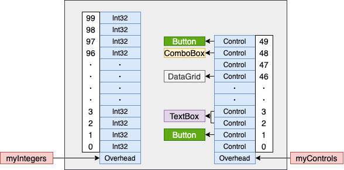

 # 第 16 章 数组

 本章内容

* <a href="#16_1">初始化数组元素</a>
* <a href="#16_2">数组转型</a>
* <a href="#16_3">所有数组都隐式派生自 `System.Array`</a>
* <a href="#16_4">所有数组都隐式实现 `IEnumerable`、`ICollection` 和 `IList`</a>
* <a href="#16_5">数组的传递和返回</a>
* <a href="#16_6">创建下限非零的数组</a>
* <a href="#16_7">数组的内部工作原理</a>
* <a href="#16_8">不安全的数组访问和固定大小的数组</a>

数组是允许将多个数据项作为集合来处理的机制。CLR 支持一维、多维和交错数组(即数组构成的数组)。所有数组类型都隐式地从 `System.Array` 抽象类派生，后者又派生自 `System.Object`。这意味着数组始终是引用类型，是在托管堆上分配的。在应用程序的变量或字段中，包含的是对数组的引用，而不是包含数组本身的元素。下面的代码更清楚地说明了这一点：

```C#
Int32[] myIntegers;                 // 声明一个数组引用
myIntegers = new Int32[100];        // 创建含有 100 个 Int32 的数组
```

第一行代码声明 `myIntegers` 变量，它能指向包含 `Int32` 值的一维数组。`myIntegers` 刚开始设为 `null`，因为当时还没有分配数组。第二行代码分配了含有 100 个 `Int32` 值的数组，所有 `Int32` 都被初始化为 0。由于数组是引用类型，所以会在托管堆上分配容纳 100 个未装箱`Int32`所需的内存块。实际上，除了数组元素，数组对象占据的内存块还包含一个类型对象指针、一个同步块索引和一些额外的成员<sup>①<sup>。该数组的内存块地址被返回并保存到`myIntegers`变量中。

> ① 这些额外的成员称为 overhead 字段或者说“开销字段”。 —— 译注

还可创建引用类型的数组：

```C#
Control[] myControls;               // 声明一个数组引用
myControls = new Control[50];       // 创建含有 50 个 Control 引用的数组
```

第一行代码声明`myControls` 变量，它能指向包含 `Control` 引用的一维数组。`myControls` 刚开始被设为 `null`，因为当时还没有分配数组。第二行代码分配了含有 50 个 `Control` 引用的数组，这些引用全被初始化为`null`。由于 `Control` 是引用类型，所以创建数组只是创建了一组引用，此时没有创建实际的对象。这个内存块的地址被返回并保存到 `myControls` 变量中。

图 16-1 展示了值类型的数组和引用类型的数组在托管堆中的情况。

  

图 16-1 值类型和引用类型的数组在托管堆中的情况

图 16—1 中，`Control` 数组显示了执行以下各行代码之后的结果：

```C#
myControls[1] = new Button();
myControls[2] = new TextBox();
myControls[3] = myControls[2];
myControls[46] = new DataGrid();
myControls[48] = new ComboBox();
myControls[49] = new Button();
```

为了符合“公共语言规范”(Common Language Specification， CLS)的要求，所有数组都必须是 0 基数组(即最小索引为 0)。这样就可以用 C# 的方法创建数组，并将该数组的引用传给用其他语言(比如 Microsoft Visual Basic .NET)写的代码。此外，由于 0 基数组是最常用的数组(至少就目前而言)，所以 Microsoft 花了很大力气优化性能。不过， CLR 确实支持非 0 基数组，只是不提倡使用。对于不介意稍许性能下降或者跨语言移植问题的读者，本章后文要介绍如何创建和使用非 0 基数组。

注意在图 16-1 中，每个数组都关联了一些额外的开销信息。这些信息包括数组的秩<sup>①</sup>、数组每一维的下限(几乎总是 0)和每一维的长度。开销信息还包含数组的元素类型。本章后文将介绍查询这种开销信息的方法。

> ① 即 rank，或称数组的维数。 ——译注

前面已通过几个例子演示了如何创建一维数组。应尽可能使用一维 0 基数组，有时也将这种数组称为 SZ<sup>②</sup>数组或向量(vector)。向量的性能是最佳的，因为可以使用一些特殊的 IL 指令(比如 `newarr`，`ldelem`，`ldelema`，`ldlen` 和 `stelem`)来处理。不过，必要时也可使用多维数组。下面展示了几个多维数组的例子：

```C#
// 创建一个二维数组，由 Double 值构成
Double[,] myDoubles = new Double[10, 20];

// 创建一个三维数组，由 String 引用构成
String[,,] myStrings = new String[5, 3, 10];
```

> ② SZ 是 single-dimension, zero-based(一维 0 基)的简称。 ——译注

CLR 还支持交错数组(jagged array)，即数组构成的数组。0 基一维交错数组的性能和普通向量一样好。不过，访问交错数组的元素意味着必须进行两次或更多次数组访问。下例演示了如何创建一个多边形数组，每个多边形都由一个包含 `Point` 实例的数组构成：

```C#
// 创建由多个 Point 数组构成的一维数组
Point[][] myPolygons = new Point[3][];

// myPolygons[0] 引用一个含有 10 个 Point 实例的数组
myPolygons[0] = new Point[10];

// myPolygons[1] 引用一个含有 20 个 Point 实例的数组
myPolygons[1] = new Point[20];

// myPolygons[2] 引用一个含有 30 个 Point 实例的数组
myPolygons[2] = new Point[30];

// 显示第一个多边形中的 Point
for (Int32 x = 0; x < myPolygons[0].Length; x++)
    Console.WriteLine(myPolygons[0][x]);
```

> 注意 CLR 会验证数组索引的有效性。换句话说，不能创建含有 100 个元素的数组(索引编号 0 到 99)，然后试图访问索引为 -5 或 100 的元素。这样做会导致 `System.IndexOutOfRangeException` 异常。允许访问数组范围之外的内存会破坏类型安全性，而且会造成潜在的安全漏洞，所以 CLR 不允许可验证的代码这么做。通常，索引范围检查对性能的影响微乎其微，因为 JIT 编译器通常只在循环开始之前检查一次数组边界，而不是每次循环迭代都检查<sup>①</sup>。不过，如果仍然担心 CLR 索引检查造成的性能损失，可以在 C# 中使用 unsafe 代码来访问数组。16.7 节“数组的内部工作原理”将演示具体做法。

> ① 不要混淆“循环”和“循环迭代”。例如以下代码：
  ```C#
  Int32[] myArray = new Int32[100];
  for (Int32 i = 0; i < myArray.Length; i++) myArray[i] = i;
  ```
> “`for`循环”总共要“循环迭代100次”，有时也简单地说“迭代100次”。 —— 译注

## <a name="16_1">16.1 初始化数组元素</a>

前面展示了如何创建数组对象，如何初始化数组中的元素。C# 允许用一个语句做这两件事情。例如：

`String[] names = new String[] { "Aidan", "Grant" };`

大括号中的以逗号分隔的数据的数据项称为**数组初始化器**(array initializer)。每个数据项都可以是一个任意复杂度的表达式；在多维数组的情况下，则可以是一个嵌套的数组初始化器。上例只使用了两个简单的`String`表达式。

在方法中声明局部变量来引用初始化好的数组时，可利用 C# 的“隐式类型的局部变量”功能来简化一下代码：

```C#
// 利用 C# 的隐式类型的局部变量功能：
var names = new String[] { "Aidan", "Grant" };
```

编译器推断局部变量 `names` 是 `String[]` 类型，因为那是赋值操作符(`=`)右侧的表达式的类型。

可利用 C# 的隐式类型的数组功能让编译器推断数组元素的类型。注意，下面这行代码没有在 `new` 和 `[]`之间指定类型。

```C#
// 利用 C#的隐式类型的局部变量和隐式类型的数组功能:
var names = new[] { "Aidan", "Grant", null }；
```

在上一行中，编译器检查数组中用于初始化数组元素的表达式的类型，并选择所有元素最接近的共同基类来作为数组的类型。在本例中，编译器发现两个 `String` 和一个 `null`。由于 `null` 可隐式转型为任意引用类型(包括 `String`)，所以编译器推断应该创建和初始化一个由 `String` 引用构成的数组。但假如写以下代码：

```C#
// 使用 C# 的隐式类型的局部变量和隐式类型的数组功能：(错误)
var names = new[] { "Aidan", "Grant", 123 }；
```

编译器就会报错：`error Cs0826:找不到隐式类型数组的最佳类型`。这是由于两个 `String` 和一个 `Int32` 的共同基类是 `Object`，意味着编译器不得不创建 `Object`引用的一个数组，然后对 `123` 进行装箱，并让最后一个数组元素引用已装箱的、值为 `123` 的一个 `Int32`。C# 团队认为，隐式对数组元素进行装箱是一个代价高昂的操作，所以要在编译时报错。

作为初始化数组时的一个额外的语法奖励，还可以像下面这样写：

`String[] names = { "Aidan", "Grant" };`

注意，赋值操作符(`=`)右侧只给出了一个初始化器，没有 `new`，没有类型，没有 `[]`。这个语法可读性很好，但遗憾的是，C#编译器不允许在这种语法中使用隐式类型的局部变量：

```C#
// 试图使用隐式类型的局部变量(错误)
var names = { "Aidan", "Grant" };
```

试图编译上面这行代码，编译器会报告以下两条消息。

* error CS0820：无法用数组初始值设定项初始化隐式类型的局部变量。

* error CS0622；只能使用数组初始值设定项表达式为数组类型赋值，请尝试改用 new 表达式。

虽然理论上可以通过编译，但 C#团队认为编译器在这里会为你做太多的工作。它要推断数组类型，新建数组对象那个，初始化数组，还要推断局部变量的类型。

最后讲一下“隐式类型的数组”如何与“匿名类型”和“隐式类型的局部变量”组合使用。10.1.4 “匿名类型”已讨论了匿名类型以及如何保证类型同一性。下面来看看以下代码：

```C#
// 使用 C# 的隐式类型的局部变量、隐式类型的数组和匿名类型功能：
var kids = new[] { new { Name="Aidan" }, new { Name="Grant" }};

// 示例用法(用了另一个隐式类型的局部变量)：
foreach (var kid in kids)
    Console.WriteLine(kid.Name);
```

这个例子在一个数组初始化器中添加了两个用于定义数组元素的表达式。每个表达式都代表一个匿名类型(因为 `new` 操作符后没有提供类型名称)。由于连个匿名类型具有一致的结构(有一个 `String` 类型的 `Name` 字段)，所以编译器知道这两个对象具有相同的类型(类型的同一性)。然后，我使用了 C#的“隐式类型的数组”功能(在 `new` 和 `[]` 之间不指定类型)，让编译器推断数组本身的类型，构造这个数组对象，并初始化它内部的两个引用，指向匿名类型的两个实例。最后，将对这个数组对象的引用赋给 `kids` 局部变量，该变量的类型通过C# 的“隐式类型的局部变量”功能来推断。

第二行代码用 `foreach` 循环演示如何使用刚才创建的、用两个匿名类型实例初始化的数组。注意必须为循环使用隐式类型的局部变量(`kid`)。运行这段代码将得到以下输出：

```cmd
Aidan
Grant
```

## <a name="16_2">16.2 数组转型</a>

对于元素为引用类型的数组，CLR 允许将数组元素从一种类型转型另一种。成功转型要求数组维数相同，而且必须存在从元素源类型到目标类型的隐式或显式转换。CLR 不允许将值类型元素的数组转型为其他任何类型。(不过，可用 `Array.Copy`方法创建新数组并在其中填充元素来模拟这种效果。)<sup>①</sup>以下代码演示了数组转型：

```C#
// 创建二维 FileStream 数组
FileStream[,] fs2dim = new FileStream[5, 10];

// 隐式转型为二维 Object 数组
Object[,] o2dim = fs2dim;

// 二维数组不能转型为一维数组，编译器报错：
// error CS00303: 无法将类型“object[*,*]”转换为“System.IO.Stream[]”
Stream[] sldim = (Stream[]) o2dim;

// 显示转型为二维 Stream 数组
Stream[,] s2dim = (Stream[,]) o2dim;

// 显式转型为二维 String 数组
// 能通过编译，但在运行时抛出 InvalidCastException 异常
String[,] st2dim = (String[,]) o2dim;

// 创建一维 Int32 数组(元素是值类型)
Int32[] ildim = new Int32[5];

// 不能将值类型的数组转型为其他任何类型，编译器报错：
// error CS0030：无法将类型 "int[]" 转换为 "Object[]"
Object[] oldim = (Object[]) ildim;

// 创建一个新数组，使用 Array.Copy 将源数组中的每个元素
// 转型为目标数组中的元素类型，并把它们复制过去。
// 下面的代码创建元素为引用类型的数组，
// 每个元素都是对已装箱 Int32 的引用
Object[] obldim = new Object[ildim.Length];
Array.Copy(ildim, obldim, ildim.Length);
```

`Array.Copy` 的作用不仅仅是将元素从一个数组复制到另一个。`Copy`方法还能正确处理内存的重叠区域，就像 C 的 `memmove` 函数一样。有趣的是， C 的 `memcpy` 函数反而不能正确处理处理重叠的内存区域。`Copy`方法还能在复制每个数组元素时进行必要的类型转换，具体如下所述：

* 将值类型的元素装箱为引用类型的元素，比如将一个 `Int32[]` 复制到一个 `Object[]` 中。

* 将引用类型的元素拆箱为值类型的元素，比如将一个 `Object[]` 复制到一个 `Int32[]` 中。

* 加宽 CLR 基元值类型，比如将一个 `Int32[]` 的元素复制到一个 `Double[]` 中。

* 在两个数组之间复制时，如果仅从数组类型证明不了两者的兼容性，比如从 `Object[]` 转型为 `IFormattable[]`，就根据需要对元素进行向下类型转换。如果`Object[]`中的每个对象都实现了`IFormattable`，`Copy`方法就能成功执行。

下面演示了 `Copy` 方法的另一种用法：

```C#
// 定义实现了一个接口的值类型
internal struct MyValueType : IComparable {
    public Int32 CompareTo(Object obj){
        ...
    }
}

public static class Program {
    public static void Main() {
        // 创建含有 100 个值类型的数组
        MyValueType[] src = new MyValueType[100];

        // 创建 IComparable 引用数组
        IComparable[] dest = new IComparable[src.Length];

        // 初始化 IComparable 数组中的元素，
        // 使它们引用源数组元素的已装箱版本
        Array.Copy(src, dest, src.Length);
    }
}
```

地球人都能猜得到，FCL 频繁运用了 `Array` 的 `Copy` 方法。

有时确实需要将数组从一种类型转换为另一种类型。这种功能称为**数组协变性**(array covariance)。但在利用它时要清楚由此而来的性能损失。假设有以下代码：

```C#
String[] sa = new String[100];
Object[] oa = sa;           // oa 引用一个 String 数组
oa[5] = "Jeff";             // 性能损失：CLR 检查 oa 的元素类型是不是 String；检查通过
oa[3] = 5;                  // 性能损失：CLR 检查 oa 的元素类型是不是 Int32；发现有错，
                            // 抛出 ArrayTypeMismatchException 异常
```

在上述代码中，`oa` 变量被定义为 `Object[]` 类型，但实际引用的是一个 `String[]`。编译器允许代码将 5 放到数组元素中，因为 5 是 `Int32`,而 `Int32` 派生自 `Object`。虽然编译能通过，但 CLR 必须保证类型安全。对数组元素赋值时，它必须保证赋值的合法性。所以，CLR 必须在运行时检查数组包含的是不是 `Int32` 元素。在本例中，在本例中，答案是否定的，所有不允许赋值；CLR 抛出 `ArrayTypeMismatchException` 异常。

> 注意 如果只是需要将数组的某些元素复制到另一个数组，可选择`System.Buffer` 的 `BlockCopy` 方法，它比 `Array` 的 `Copy`方法快。但`Buffer` 的 `BlockCopy` 方法只支持基于类型，不提供像`Array`的`Copy`方法那样的转型能力。方法的`Int32`参数代表的是数组中的字节偏移量，而非元素索引。设计`BlockCopy`的目的实际是将按位兼容(bitwise-compatible)<sup>①</sup>的数据从一个数组类型复制到另一个按位兼容的数据类型，比如将包含 Unicode 字符的一个 `Byte[]`(按字节的正确顺序)复制到一个 `Char[]` 中，该方法一定程度上弥补了不能将数组当作任意类型的内存块来处理的不足。

> 要将一个数组的元素可靠地复制到另一个数组，应该使用`System.Array`的`ConstrainedCopy`方法。该方法要么完成复制，要么抛出异常，总之不会破坏目标数组中的数据。这就允许`ConstrainedCopy`在约束执行区域(Constrained Execution Region, CER)中执行。为了提供这种保证，`ConstrainedCopy` 要求源数组的元素类型要么与目标数组的元素类型相同，要么派生自目标数组的元素类型。另外，它不执行任何装箱、拆箱或向下类型转型。

>> ① “按位兼容”因为英文原文是 bitwise-compatible，所以人们发明了 blittable 一词来表示这种类型。这种类型在托管和非托管内存中具有相同的表示。一部分基元类型是 blittable 类型。如果一维数组包含的是 blittable 类型。另外，格式化的值类型如果包含 blittable 类型，该值类型也是 blittable 类型。欲知详情，请在 MSDN 文档中搜索“可直接复制到本机结构中的类型和非直接复制到本机结构中的类型”这一主题。——译注

## <a name="16_3">16.3 所有数组都隐式派生自 `System.Array`</a>

像下面这样声明数组变量：

`FileStream[] fsArray;`  

CLR 会自动为 AppDomain 创建一个 `FileStream[]` 类型。该类型隐式派生自 `System.Array`类型；因此，`System.Array`类型定义的所有实例方法和属性都将由 `FileStream[]` 继承，使这些方法和属性能通过 `fsArray` 变量调用。这极大方便了数组处理，因为`System.Array`定义了许多有用的实例方法和属性，比如 `Clone`，`CopyTo`，`GetLength`，`GetLongLength`，`GetLowerBound`，`GetUpperBound`，`Length`，`Rank`等。

`System.Array`类型还公开了很多有用的、用于数组处理的静态方法。这些方法均获取一个数组引用作用作为参数。一些有用的静态方法包括：`AsReadOnly`，`BinarySearch`，`Clear`，`ConstrainedCopy`，`ConvertAll`，`Copy`，`Exists`，`Find`，`FindAll`，`FindIndex`，`FindLast`，`FindLastIndex`，`Foreach`，`IndexOf`，`LastIndexOf`，`Resize`，`Sort`和`TrueForAll`。这些方法中，每个都有多个重载版本，能保障编译时的类型安全性和良好的性能。鼓励大家查阅文档，体会这些方法究竟多么有用和强大！

## <a name="16_4">16.4 所有数组都隐式实现 `IEnumerable`，`ICollection`和`IList`</a>

许多方法都能操纵各种各样的集合对象，因为它们声明为允许获取`IEnumerable`，`ICollection`和`IList`等参数。可将数组传给这些方法，因为`System.Array`也实现了这三个接口。`System.Array`之所以实现这些非泛型接口，是因为这些接口将所有元素都视为`System.Object`。然后，最后是让`System.Array`实现这些接口的泛型形式，提供更好的编译时类型安全性和更好的性能。

不过，由于涉及多维数组和非 0 基数组的问题，CLR 团队不希望 `System.Array` 实现`IEnumerable<T>`，`ICollection<T>`和`IList<T>`。若在`System.Array`上定义这些接口，就会为所有数组类型启用这些接口。所以，CLR没有那么做，而是耍了一个小花招；创建一维 0 基数组类型时，CLR 自动使数组类型实现`IEnumerable<T>`，`ICollection<T>`和`IList<T>`(`T`是数组元素的类型)。同时，还为数组类型实现这三个接口，只要它们是引用类型。以下层次结构图对此进行了澄清：

```C#
Object
    Array (非泛型 IEnumerable, ICollection, IList)
        Object[]            (IEnumerable, ICollection, IList of Object)
          String[]          (IEnumerable, ICollection, IList of String)
          Stream[]          (IEnumerable, ICollection, IList of Stream)
            FileStream[]    (IEnumerable, ICollection, IList of FileStream)
         .
         .      (其他引用类型的数组)
         .
```

所以，如果执行以下代码：

`FileStream[] fsArray;`

那么当 CLR 创建`FileStream[]`类型时，会自动为这个类型实现 `IEnumerable<FileStream>`，`ICollection<FileStream>`和`IList<FileStream>`接口。此外，`FileStream[]`类型还会为基类型实现接口：`IEnumerable<Stream>`，`IEnumerable<Object>`，`ICollection<Stream>`，`ICollection<Object>`，`IList<Stream>`和`IList<Object>`。由于所有这些接口都由 CLR 自动实现，所以在存在这些接口任何地方都可以使用 `fsArray` 变量。例如，可将 `fsArray` 变量传给具有以下任何一种原型的方法：

```C#
void M1(IList<FileStream> fsList) { ... }
void M2(ICollection<Stream> sCollection) { ... }
void M3(IEnumerable<Object> oEnumerable) { ... }
```

注意，如果数组包含值类型的元素，数组类型不会为元素的基类型实现接口。例如，如果执行以下代码：

`DateTime[] dtArray;        // 一个值类型的数组`

那么 `DateTime[]` 类型只会实现 `IEnumerable<DateTime>`，`ICollection<DateTime>`和`IList<DateTime>`接口，不会为`DateTime`的基类型(包括`System.ValueType`和`System.Object`)实现这些泛型接口。这意味着`dtArray`变量不能作为实参传给前面的`M3`方法。这是因为值类型的数组在内存中的布局与引用类型的数组不同。数组内存的布局请参见本章前面的描述。

## <a name="16_5">16.5 数组的传递和返回</a>

数组作为实参传给方法时，实际传递的是对该数组的引用。因此，被调用的方法能修改数组中的元素。如果不想被修改，必须生成数组的拷贝并将拷贝传给方法。注意，`Array.Copy` 方法执行的是浅拷贝。换言之，如果数组元素是引用类型，新数组将引用现有的对象。

类似地，有的方法会返回对数组的引用。如果方法构造并初始化数组，返回数组引用是没有问题的。但假如方法返回的是对字段所维护的一个内部数组的引用，就必须决定是否想让该方法的调用者直接访问这个数组及其元素。如果是，就可以返回数组引用。但更常见的情况是，你并不希望方法的调用者获得这个访问权限。所以，方法应该构造一个新数组，并调用`Array.Copy`返回对新数组的引用。再次提醒，`Array.Copy`执行的是对原始数组的浅拷贝。

如果定义返回数组引用的方法，而且数组中不包含元素，那么方法既可以返回`null`，也可以返回对包含零个元素的一个数组的引用。实现这种方法时，Microsoft 强烈建议让它返回后者，因为这样能简化调用该方法时需要写的代码<sup>①</sup>。例如，以下代码很容易理解。而且即使没有可供遍历的约会(即 `appointments` 数组中没有元素)，也能正确运行：

```C#
// 这段代码更容易写，更容易理解
Appointment[] appointments = GetAppointmentsForToday();
for (Int32 a = 0; a < appointments.Length; a++) {
    // 对 appointments[a]执行操作
}
```

> ① 因为不需要执行 `null` 值检测。 —— 译注

以下代码也能在没有约会的前提下正确运行，但写起来麻烦一些，而且不好理解：

```C#
// 这段代码写起来麻烦一些，而且不好理解
Appointment[] appointments = GetAppointmentsForToday();
if (appointments != null) {
    for (Int32 a = 0; a < appointments.Length; a++) {
        // 对 appointments[a] 执行操作
    }
}
```

将方法设计为返回对含有 0 个元素的一个数组的引用，而不是返回 `null`，该方法的迪用者就能更轻松地使用该方法。顺便提一句，对字段也应如此。如果类型中有一个字段是数组引用，应考虑让这个字段始终引用数组，即使数组中不包含任何元素。

## <a name="16_6">16.6 创建下限非零的数组</a>

前面提到过，能创建和操作下限非 0 的数组。可以调用数组的静态 `CreatInstance` 方法来动态创建自己的数组。该方法有若干个重载版本，允许指定数组元素的类型、数组的维数、每一维的下限和每一维的元素数目。`CreateInstance` 为数组分配内存，将参数信息保存到数组的内存块的开销(overhead)部分，然后返回对该数组的引用。如果数组维数是2 或 2 以上，就可以把 `CreateInstance` 返回的引用转型为一个 `ElementType[]` 变量(`ElementType`要替换为类型名称)，以简化对数组中的元素的访问。如果只有一维，C# 要求必须使用该 `Array` 的 `GetValue` 和 `SetValue`方法访问数组元素。

以下代码演示了如何动态创建由 `System.Decimal` 值构成的二维数组。第一维代表 2005 到 2009(含)年份，第二维 1 到 4(含)季度。代码遍历动态数组中的所有元素。我本来可以将数组的上下限硬编码到代码中，这样能获取更好的性能。但我最后决定使用`System.Array`的`GetLowerBound`和`GetUpperBound`方法来演示它们的用法：

```C#
using System;

public sealed class DynamicArrays {
    public static void Main() {
        // 我想创建一个二维数组 [2005..2009][1..4]
        Int32[] lowerBounds = { 2005, 1 };
        Int32[] lengths     = {    5, 4 };
        Decimal[,] quarterlyRevenue = (Decimal[,]) 
            Array.CreateInstance(typeof(Decimal), lengths, lowerBounds);

        Console.WriteLine("{0,4} {1,9} {2,9} {3,9} {4,9}", "Year", "Q1", "Q2", "Q3", "Q4");
        Int32 firstYear    = quarterlyRevenue.GetLowerBound(0);
        Int32 lastYear     = quarterlyRevenue.GetUpperBound(0);
        Int32 firstQuarter = quarterlyRevenue.GetLowerBound(1);
        Int32 lastQuarter  = quarterlyRevenue.GetUpperBound(1);

        for (Int32 year = firstYear; year <= lastYear; year++) {
            Console.Write(year + " ");
            for (Int32 quarter = firstQuarter; quarter <= lastQuarter; quarter++) {
                Console.Write("{0,9:C} ", quarterlyRevenue[year, quarter]);
            }
            Console.WriteLine();
        }
    }
}
```

编译并运行这段代码将得到以下输出：

```cmd
Year     Q1        Q2        Q3        Q4
2005     $0.00     $0.00     $0.00     $0.00 
2006     $0.00     $0.00     $0.00     $0.00 
2007     $0.00     $0.00     $0.00     $0.00 
2008     $0.00     $0.00     $0.00     $0.00 
2009     $0.00     $0.00     $0.00     $0.00 
```

## <a name="16_7">16.7 数组的内部工作原理</a>

CLR 内部实际支持两种不同的数组。

* 下限为 0 的一维数组。这些数组有时称为 SZ(single-dimensional,zero-based, 一维 0 基)数组或向量(vector)。

* 下限未知的一维或多维数组。

可执行以下代码来实际地查看不同种类的数组(注释显示了输出)

```C#
using System;

public sealed class DynamicArrays {
    public static void Main() {
        Array a;

        // 创建一维的 0 基数组，不包含任何元素
        a = new String[0];
        Console.WriteLine(a.GetType());     // "System.String[]"

        // 创建一维 0 基数组，不包含任何元素
        a = Array.CreateInstance(typeof(String), new Int32[] { 0 }, new Int32[] { 0 });
        Console.WriteLine(a.GetType());     // "System.String[]"

        // 创建一维 1 基数组，其中不包含任何元素
        a = Array.CreateInstance(typeof(String), new Int32[] { 0 }, new Int32[] { 1 });
        Console.WriteLine(a.GetType());     // "System.String[*]"  <-- 这个显示很奇怪，不是吗？

        Console.WriteLine();

        // 创建二维 0 基数组，其中不包含任何元素
        a = new String[0, 0];
        Console.WriteLine(a.GetType());     // "System.String[,]"

        // 创建二维 0 基数组，其中不包含任何元素
        a = Array.CreateInstance(typeof(String), new Int32[] { 0, 0 }, new Int32[] { 0, 0 });
        Console.WriteLine(a.GetType());    // "System.String[,]"

        //
        a = Array.CreateInstance(typeof(String), new Int32[] { 0, 0 }, new Int32[] { 0, 0 });
        Console.WriteLine(a.GetType());    // "System.String[,]"
    }
}
```

每个 `Console.WriteLine` 语句后都有一条指出其输出的注释。对于一维数组，0 基数组显示的类型名称是 `System.String[]`，但 1 基数组显示的是 `System.String[*]`。`*` 符号表明 CLR 知道该数组不是 0 基的。注意，C# 不允许声明 `String[*]` 类型的变量，因此不能使用 C# 语法来访问一维非 0 基数组。尽管可以调用 `Array` 的 `GetValue` 和 `SetValue` 方法来访问这种数组的元素，但速度会比较慢，因为有方法调用的开销。

对于多维数组，0 基和 1 基数组会显示同样的类型名称：`System.String[,]`。在运行时，CLR 将所有多维数组都视为非 0 基数组。这自然会让人觉得类型名称应该显示为`System.String[*,*]`。但是，对于多维数组，CLR 决定不使用`*`符号。这是由于假如使用`*`，那么它们始终都会存在，而大量的`*`会使开发人员产生混淆。

访问一维 0 基数组的元素比访问非 0 基一维或多维数组的元素稍快。这是多方面的原因造成的。首先，有一些特殊 IL 指令，比如 `newarr`，`ldelem`，`ldelema`，`ldlen`和`stelem`，用于处理一维 0 基数组，这些特殊 IL 指令会导致 JIT 编译器生成优化代码。例如，JIT 编译器生成的代码假定数组时 0 基的，所以在访问元素时不需要从指定索引中减去一个偏移量。其次，一般情况下，JIT 编译器能将索引范围检查代码从循环中拿出，导致它只执行一次。以下面这段常见的代码为例：

```C#
using System;

public static class Program {
    public static void Main() {
        Int32[] a = new Int32[5];
        for (Int32 index = 0; index < a.Length; index++) {
            // 对 a[index] 执行操作
        }
    }
}
```

对于以上代码，首先注意在 `for` 循环的测试表达式中对数组的 `Length` 属性的调用。由于 `Length` 是属性，所以查询长度实际是方法调用。但 JIT 编译器知道 `Length` 是 `Array` 类的属性，所以在生成的代码中，实际只调用该属性一次，结果存储到一个临时表变量中。每次循环迭代检查的都是这个临时变量中。每次循环迭代检查的都是这个临时变量。这就加快了 JIT 编译的代码的速度。但有的开发人员低估了 JIT 编译器的“本事”，试图自己写一些“高明”的代码来“帮助”JIT编译器。任何自作聪明的尝试几乎肯定会对性能造成负面影响，还会使代码更难阅读，妨碍可维护性。在上述代码中，最好保持对数组`Length`属性的调用，而不要自己用什么局部变量来缓存它的值。

其次要注意，JIT 编译器知道 `for` 循环要访问 `0` 到 `Length - 1`的数组元素。所以，JIT 编译器会生成代码，在运行时测试所有数组元素的访问都在数组有效范围内。具体地说，JIT 编译器会生成代码来检查是否`(0 >= a.GetLowerBound(0)) && ((Length - 1)) <= a.GetUpperBound(0))`。这个检查在循环之前发生。如果在数组有效范围内，JIT 编译器不会在循环内部生成代码验证每一次数组访问都在有效范围内。这样一来，循环内部的数组访问变得非常快。

遗憾的是，正如前文所述，访问“非 0 基一维数组” 或 “多维数组” 的速度比不上一维 0 基数组。对于这些数组类型，JIT 编译器不会将索引检查从循环中拿出来，所以每次数组访问都要验证指定的索引。此外，JIT 编译器还要添加代码从指定索引中减去数组下限，这进一步影响了代码执行速度，即使此时使用的多维数组碰巧是 0 基数组。所以，如果很关心性能，考虑用由数组构成的数组(即交错数组)代替矩形数组。

C# 和 CLR 还允许使用 `unsafe`(不可验证)代码访问数组。这种技术实际能在访问数组时关闭索引上下限检查。这种不安全的数组访问技术适合以下元素类型的数组：`SByte`、`Byte`、`Int16`、`UInt16`、`Int32`、`UInt32`、`Int64`、`UInt64`、`Char`、`Single`、`Double`、`Decimal`、`Boolean`、枚举类型或者字段为上述任何类型的值类型结构。

这个功能很强大，但使用须谨慎，因为它允许直接内存访问。访问越界(超出数组上下限)不会抛出异常，但会损失内存中的数据，破坏类型安全性，并可能造成安全漏洞！有鉴于此，包含 `unsafe` 代码的程序集必须被授予完全信任，或至少启用“跳过验证”安全权限。

以下 C# 代码演示了访问二维数组的三种方式(安全、交错和不安全)：

```C#
using System;
using System.Diagnostics;

public static class Program {
    private const Int32 c_numElements = 10000;
     
    public static void Main() {
        // 声明二维数组
        Int32[,] a2Dim = new Int32[c_numElements, c_numElements];

        // 将二维数组声明为交错数组(向量构成的向量)
        Int32[][] aJagged = new Int32[c_numElements][];
        for (Int32 x = 0; x < c_numElements; x++)
            aJagged[x] = new Int32[c_numElements];

        // 1：用普通的安全技术访问数组中的所有元素
        Safe2DimArrayAccess(a2Dim);

        // 2：用交错数组技术访问数组中的所有元素
        SafeJaggedArrayAccess(aJagged);

        // 3：用 unsafe 技术访问数值中的所有元素
        Unsafe2DimArrayAccess(a2Dim);
    }

    private static Int32 Safe2DimArrayAccess(Int32[,] a) {
        Int32 sum = 0;
        for (Int32 x = 0; x < c_numElements; x++) {
            for (Int32 y = 0; y < c_numElements; y++) {
                sum += a[x, y];
            }
        }
        return sum;
    }

    private static Int32 SafeJaggedArrayAccess(Int32[][] a) {
        Int32 sum = 0;
        for (Int32 x = 0; x < c_numElements; x++) {
            for (Int32 y = 0; y < c_numElements; y++) {
                sum += a[x][y];
            }
        }
        return sum;
    }

    private static unsafe Int32 Unsafe2DimArrayAccess(Int32[,] a) {
        Int32 sum = 0;
        fixed (Int32* pi = a) {
            for (Int32 x = 0; x < c_numElements; x++) {
                Int32 baseOfDim = x * c_numElements;
                for (Int32 y = 0; y < c_numElements; y++) {
                    sum += pi[baseOfDim + y];
                }
            }
        }
        return sum;       
    }
}
```

`Unsafe2DimArrayAccess` 方法标记了 `unsafe` 修饰符，这是使用 C# 的 `fixed` 语句所必须的。编译这段代码要求在运行 C# 编译器时指定 `/unsafe` 开关，或者在 Microsoft Visual Studio 的项目属性页的“生成”选项卡中勾选“允许不安全代码”。

写代码时，不安全数据访问技术有时或许是你的最佳选择，但要注意该技术的三处不足。

* 相较于其他技术，处理数组元素的代码更复杂，不容易读和写，因为要使用 C# `fixed` 语句，要执行内存地址计算。

* 计算过程中出错，可能访问到不属于数组的内存。这会造成计算错误，损坏内存数据，破坏类型安全性，并可能造成安全漏洞。

* 因为这些潜在的问题，CLR 禁止在降低了安全级别的环境(如 Microsoft Silverlight)中运行不安全代码。

## <a name="16_8">16.8 不安全的数组访问和固定大小的数组</a>

不安全的数组访问非常强大，因为它允许访问以下元素。

* 堆上的托管数组对象中的元素(上一节对此进行了演示)。

* 非托管堆上的数组中的元素。第 14 章的 SecureString 示例演示了如何调用 `System.Runtime.InteropServices.Marshal` 类的 `SecureStringToCoTaskMemUnicode` 方法来返回一个数组，并对这个数组进行不安全的数组访问。

* 线程栈上的数组中的元素。

如果性能是首要目标，请避免在堆上分配托管的数组对象。相反，在线程栈上分配数组。这是通过 C# 的 `stackalloc` 语句来完成的(它在很大程度上类似于 C 的 `alloca` 函数)。`stackalloc`语句只能创建一维 0 基、由值类型元素构成的数组，而且值类型绝对不能包含任何引用类型的字段。实际上，应该把它的作用看成是分配一个内存块，这个内存块可以使用不安全的指针来操纵。所以，不能将这个内存缓冲区的地址传给大部分 FCL 语法。当然，栈上分配的内存(数组)会在方法返回时自动释放；这对增强性能起了一定作用。使用这个功能要求为 C# 编译器指定`/unsafe`开关。

以下代码中的`StackallocDemo`方法演示如何使用C# `stackalloc`语句：

```C#
using System;

public static class Program {
    public static void Main() {
        StackallocDemo();
        InlineArrayDemo();
    }

    private static void StackallocDemo() {
        unsafe {
            const Int32 width = 20;
            Char* pc = stackalloc Char[width];      // 在栈上分配数组 

            String s = "Jeffrey Richter";           // 15个字符

            for (Int32 index = 0; index < width; index++) {
                pc[width - index - 1] = (index < s.Length) ? s[index] : '.';
            }

            // 下面这行代码显示“.....rethciR yerffeJ”
            Console.WriteLine(new String(pc, 0, width));
        }
    }

    private static void InlineArrayDemo() {
        unsafe {
            CharArray ca;           // 在栈上分配数组
            Int32 widthInBytes = sizeof(CharArray);
            Int32 width = widthInBytes / 2;

            String s = "Jeffrey Richter";       // 15 个字符

            for (Int32 index = 0; index < width; index++) {
                ca.Characters[width - index - 1] = (index < s.Length) ? s[index] : '.';
            }

            // 下面这行代码显示 “.....rethciR yerffeJ”
            Console.WriteLine(new String(ca.Characters, 0, width));
        }
    }
}

internal unsafe struct CharArray {
    // 这个数组内联(嵌入)到结构中
    public fixed Char Characters[20];
}
```

通常，由于数组是引用类型，所以结构中定义的数组字段实际只是指向数组的指针或引用；数组本身在结构的外部。不过，也可像上述代码中的`CharArray`结构那样，直接将数组嵌入结构。在结构中嵌入数组需满足以下几个条件。

* 类型必须是结构(值类型)；不能在类(引用类型)中嵌入数组。

* 字段或其定义结构必须用`unsafe`关键字标记。

* 数组字段必须用 `fixed` 关键字标记。

* 数组必须是一维 0 基数组。

* 数组的元素类型必须是以下类型之一：`Boolean`，`Char`，`SByte`，`Byte`，`Int16`，`Int32`，`UInt16`，`UInt32`，`Int64`，`Single`或`Double`。

要和非托管代码进行互操作，而且非托管数据结构也有一个内联数组，就特别适合使用内联的数组。但内联数组也能用于其他地方。上述代码中的 `InlineArrayDemo` 方法提供了如何使用内联数组的一个例子。它执行和 `StackallocDemo` 方法一样的功能，只是用了不一样的方式。
 