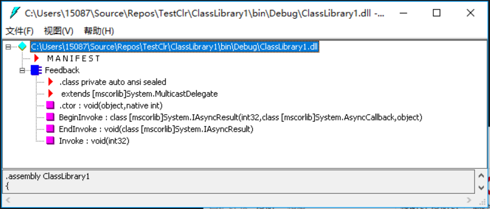
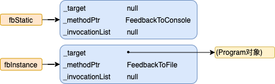
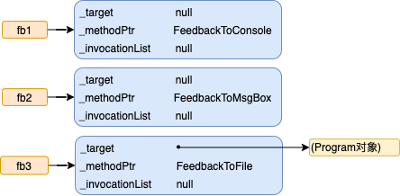
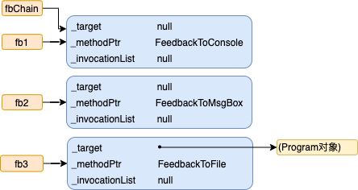
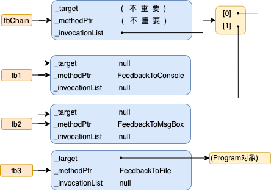
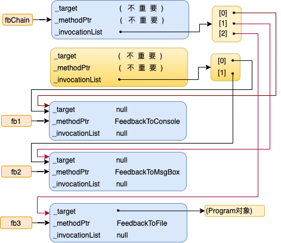

# 第 17 章 委托

本章内容：

* <a href="#17_1">初始委托</a>
* <a href="#17_2">用委托回调静态方法</a>
* <a href="#17_3">用委托回调实例方法</a>
* <a href="#17_4">委托揭秘</a>
* <a href="#17_5">用委托回调许多方法(委托链)</a>
* <a href="#17_6">委托定义不要太多(泛型委托)</a>
* <a href="#17_7">C# 为委托提供的简化语法</a>
* <a href="#17_8">委托和反射</a>

本章要讨论回调函数。回调函数式一种非常有用的编程机制，它的存在已经有很多年了。Microsoft .NET Framework 通过 `委托`来提供回调函数机制。不同于其他平台(比如非托管C++)的回调机制，委托的功能要多得多。例如，委托确保回调方法是类型安全的(这是 CLR 最重要的目标之一)。委托还允许顺序调用多个方法，并支持调用静态方法和实例方法。

## <a name="17_1">17.1 初始委托</a>

C “运行时”的 `qsort` 函数获取指向一个回调函数的指针，以便对数组中的元素进行排序。在 Microsoft Windows 中，窗口过程、钩子过程和异步过程调用等都需要回调函数。在 .NET Framework 中，回调方法的应用更是广泛。例如，可以登记回调方法来获得各种各样的通知，例如未处理的异常、窗口状态变化、菜单项选择、文件系统变化、窗体控件事件和异步操作已完成等。

在非托管 C/C++ 中，非成员函数的地址只是一个内存地址。这个地址不携带任何额外的信息，比如函数期望收到的参数个数、参数类型、函数返回值类型以及函数的调用协定。简单地说，非托管 C/C++ 回调函数不是类型安全的(不过它们确实是一种非常轻量级的机制)。

.NET Framework 的回调函数和非托管 Windows 编程环境的回调函数一样有用，一样普遍。但是，.NET Framework 提供了称为**委托**的类型安全机制。为了理解委托，先来看看如何使用它。以下代码<sup>①</sup>演示了如何声明、创建和使用委托：

> ① 这个程序最好不要通过在 Visual Studio 中新建 “Windows 窗体应用程序”项目来生成。用文本编辑器输入代码，另存为 *name.cs*。启动“VS2013 开发人员命令提示”，输入 `csc name.cs` 生成，输入 `name` 执行。这样可同时看到控制台和消息框的输出。 —— 译注

```C#
using System;
using System.Windows.Forms;
using System.IO;

// 声明一个委托类型，它的实例引用一个方法，
// 该方法获取一个 Int32 参数，返回 void
internal delegate void Feedback(Int32 value);
public sealed class Program {
    public static void Main() {
        StaticDelegateDemo();
        InstanceDelegateDemo();
        ChainDelegateDemo1(new Program());
        ChainDelegateDemo2(new Program());
    }

    private static void StaticDelegateDemo() {
        Console.WriteLine("----- Static Delegate Demo -----");
        Counter(1, 3, null);
        Counter(1, 3, new Feedback(Program.FeedbackToConsole));
        Counter(1, 3, new Feedback(FeedbackToMsgBox));          // 前缀 "Program." 可选
        Console.WriteLine();
    }

    private static void InstanceDelegateDemo() {
        Console.WriteLine("----- Instance Delegate Demo -----");
        Program p = new Program();
        Counter(1, 3, new Feedback(p.FeedbackToFile));
        Console.WriteLine();
    }

    private static void ChainDelegateDemo1(Program p) {
        Console.WriteLine("----- Chain Delegate Demo 1 -----");
        Feedback fb1 = new Feedback(FeedbackToConsole);
        Feedback fb2 = new Feedback(FeedbackToMsgBox);
        Feedback fb3 = new Feedback(p.FeedbackToFile);

        Feedback fbChain = null;
        fbChain = (Feedback) Delegate.Combine(fbChain, fb1);
        fbChain = (Feedback) Delegate.Combine(fbChain, fb2);
        fbChain = (Feedback) Delegate.Combine(fbChain, fb3);
        Counter(1, 2, fbChain);

        Console.WriteLine();
        fbChain = (Feedback)
            Delegate.Remove(fbChain, new Feedback(FeedbackToMsgBox));
        Counter(1, 2, fbChain);
    }

    private static void ChainDelegateDemo2(Program p) {
        Console.WriteLine("----- Chain Delegate Demo 2 -----");
        Feedback fb1 = new Feedback(FeedbackToConsole);
        Feedback fb2 = new Feedback(FeedbackToMsgBox);
        Feedback fb3 = new Feedback(p.FeedbackToFile);

        Feedback fbChain = null;
        fbChain += fb1;
        fbChain += fb2;
        fbChain += fb3;
        Counter(1, 2, fbChain);

        Console.WriteLine();
        fbChain -= new Feedback(FeedbackToMsgBox);
        Counter(1, 2, fbChain);
    }

    private static void Counter(Int32 from, Int32 to, Feedback fb) {
        for (Int32 val = from; val <= to; val++) {
            // 如果指定了任何回调，就调用它们
            if (fb != null)
                fb(val);
        }
    }

    private static void FeedbackToConsole(Int32 value) {
        Console.WriteLine("Item=" + value);
    }

    private static void FeedbackToMsgBox(Int32 value) {
        MessageBox.Show("Item=" + value);
    }

    private void FeedbackToFile(Int32 value) {
        using (StreamWriter sw = new StreamWriter("Status", true)) {
            sw.WriteLine("Item=" + value);
        }
    }
}
```

下面来看看代码做的事情。在顶部，注意看`internal`委托`Feedback`的声明。委托要指定一个回调方法签名。在本例中，`Feedback`委托指定的方法要获取一个`Int32`参数，返回`void`。在某种程度上，委托和非托管 C/C++ 中代表函数地址的`typedef`很相似。

`Program`类定义了私有静态方法`Counter`，它从整数`from`计数到整数`to`。方法的`fb`参数代表`Feedback`委托对象引用。方法遍历所有整数。对于每个整数，如果`fb`变量不为`null`，就调用由`fb`变量指定的回调方法。传入这个回调方法的是正在处理的那个数据项的值，也就是数据项的编号。设计和实现回调方法时，可选择任何恰当的方式处理数据项。

## <a name="17_2">17.2 用委托回调静态方法</a>

理解`Counter`方法的设计及其工作方式之后，再来看看如何利用委托回调静态方法。本节重点是上一节示例代码中的`StaticDelegateDemo`方法。

在`StaticDelegateDemo`方法中第一次调用`Counter`方法时，为第三个参数(对应于 `Counter` 的 `fb`参数)传递的是`null`。由于`Counter`的`fb`参数收到的是`null`，所以处理每个数据项时都不调用回调方法。

`StaticDelegateDemo`方法再次调用`Counter`，为第三个参数传递新构成的`Feedback`委托对象。委托对象是方法的包装器(wrapper)，使方法能通过包装器来间接回调。在本例中，静态方法的完整名称`Program.FeedbackToConsole` 被传给 `Feedback` 委托类型的构造器，这就是要包装的方法。`new`操作符返回的引用作为`Counter`的第三个参数来传递。现在，当`Counter`执行时，会为序列中的每个数据项调用`Program`类型的静态方法`FeedbackToConsole`。`FeedbackToConsole`方法本身的作用很简单，就是向控制台写一个字符串，显示正在进行处理的数据项。

> 注意 `FeedbackToConsole`方法被定义成`Program`类型内部的私有方法，但`Counter`方法能调用 `Program` 的私有方法，这明显没有问题，因为`Counter`和`FeedbackToConsole`在同一个类型中定义。但即使`Counter`方法在另一个类型中定义，也不会出问题！简单地说，在一个类型中通过委托来调用另一个类型的私有成员，只要委托对象是由具有足够安全性/可访问性的代码创建的，便没有问题。

在 `StaticDelegateDemo` 方法中，对 `Counter` 方法的第三个调用和第二个调用几乎完全一致。唯一的区别在于 `Feedback` 委托对象包装的是静态方法 `Program.FeedbackToMsgBox`。`FeedbackToMsgBox`构造一个字符串来指出正在处理的数据项，然后在消息框中显示该字符串。

这个例子中的所有操作都是都是类型安全的。例如，在构造`Feedback`委托对象时，编译器确保`Program`的 `FeedbackToConsole` 和`FeedbackToMsgBox`方法的签名兼容于`Feedback`委托定义的签名。具体地说，两个方法都要获取一个参数(一个`Int32`)，而且两者都要有相同的返回类型(`void`)。将`FeedbackToConsole`的定义改为下面这样：

```C#
private static Boolean FeedbackToConsole(String value) {
    ...
}
```

C#编译器将不会编译以上代码，并报告以下错误：`error CS0123:"FeedbackToConsole"的重载均与委托Feedback"不匹配`。

将方法绑定到委托时，C# 和 CLR 都允许引用类型的**协变性**(covariance)和**逆变性**(contravariance)。协变性是指方法能返回从委托的返回类型派生的一个类型。逆变性是指方法获取的参数可以是委托的参数类型的基类。例如下面这个委托：

`delegate Object MyCallback(FileStream s);`

完全可以构造该委托类型的一个实例并绑定具有以下原型的方法：

`String SomeMethod(Stream s);`

在这里，`SomeMethod` 的返回类型(`String`)派生自委托的返回类型(`Object`)；这种协变性是允许的。`SomeMethod`的参数类型(`Stream`)是委托的参数类型(`FileStream`)的基类；这种逆变性是允许的。

注意，只有引用类型才支持协变性与逆变性，值类型或`void`不支持。所以，不能把下面的方法绑定到`MyCallback`委托：

`Int32 SomeOtherMethod(Stream s);`

虽然`SomeOtherMethod` 的返回类型(`Int32`)派生自(`MyCallback`)的返回类型(`Object`)，但这种形式的协变性是不允许的，因为`Int32`是值类型。显然，值类型和 `void` 之所以不支持，是因为它们的存储结构是变化的，而引用类型的存储结构始终是一个指针。幸好，视图执行不支持的操作，C#编译器会报错。

## <a name="17_3">17.3 用委托回调实例方法</a>

委托除了能调用静态方法，还能为具体的对象调用实例方法。为了理解如何回调实例方法，先来看看 17.1 节的示例代码中的 `InstanceDelegateDemo` 方法。

注意`InstanceDelegateDemo`方法构造了名为`p`的`Program`对象。这个`Program`对象没有定义任何实例字段或属性；创建它纯粹是为了演示。在`Counter`方法调用中构造新的`Feedack`委托对象时，向`Feedback` 委托类型的构造函数传递的是`p.FeedbackToFile`。这导致委托包装对`FeedbackToFile`方法的引用，这是一个实例方法(而不是静态方法)。当`Counter`调用由其`fb`实参标识的回调方法时，会调用`FeedbackToFile`实例方法，新构造的对象`p`的地址作为隐式的 `this`参数传给这个实例方法。

`FeedbackToFile`方法的工作方法类似于`FeedbackToConsole`和`FeedbackToMsgBox`，不同的是它会打开一个文件，并将字符串附加到文件末尾。(方法创建的 Status 文件可在与可执行程序相同的目录中找到。)

再次声明，本例旨在演示委托可以包装对实例方法和静态方法的调用。如果是实例方法，委托要知道方法操作的是具体哪个对象实例。包装实例方法很有用，因为对象内部的代码可以访问对象的实例成员。这意味着对象可以维护一些状态，并在回调方法执行期间利用这些状态信息。

## <a name="17_4">17.4 委托揭秘</a>

从表面看，委托似乎很容易使用：用 C#的`delegate`关键字定义，用熟悉的`new`操作符构造委托实例，用熟悉的方法调用语法来调用回调函数(用引用了委托对象的变量替代方法名)。

但实际情况比前几个例子演示的要复杂一些。编译器和 CLR 在幕后做了大量工作来隐藏复杂性。本节要解释编译器和 CLR 如何协同工作来实现委托。掌握这些知识有助于加深对委托的理解，并学会如何更高效地使用。另外，还要介绍通过委托来实现的一些附加功能。

首先重新审视这一行代码：

`internal delegate void Feedback(Int32 value);`

看到这行代码后，编译器实际会像下面这样定义一个完整的类：

```C#
internal class Feedback : System.MulticastDelegate {
    // 构造器
    public Feedback(Object @object, IntPtr method);

    // 这个方法的原型和源代码指定的一样
    public virtual void Invoke(Int32 value);

    // 以下方法实现对回调方法的异步问题
    public virtual IAsyncResult BeginInvoke(Int32 value, AsyncCallback callback, Object @object);
    public virtual void EndInvoke(IAsyncResult result);
}
```

编译器定义的类有 4 个方法：一个构造器、`Invoke`、`BeginInvoke`和`EndInvoke`。本章重点解释构造器和`Invoke`。`BeginInvoke`和`EndInvoke`方法将留到第 27 章讨论。

事实上，可用 ILDasm.exe 查看生成的程序集，验证编译器真的会自动生成这个类，如果 17-1 所示。

  

图 17-1 ILDasm.exe 显示了编译器为委托生成的元数据

在本例中，编译器定义了 `Feedback` 类，它派生自 FCL 定义的`System.MulticastDelegate` 类型(所有委托类型都派生自`MulticastDelegate`)。

> 重要提示 `System.MulticastDelegate`派生自`System.Delegate`，后者又派生自 `System.Object`。是历史原因造成有两个委托类。这实在是令人遗憾———— FCL 本该只有一个委托类。没有办法，我们对这两个类都要有所了解。即使创建的所有委托类型都将`MulticastDelegate`作为基类，个别情况下仍会使用 `Delegate` 类(而非`MulticastDelegate`类)定义的方法处理自己的委托类型。例如，`Delegate`类的两个静态方法`Combine`和`Remove`(后文将解释其用途)的签名都指出要获取`Delegate`参数。由于你创建的委托类型派生自`MulticastDelegate`，后者又派生自`Delegate`，所以你的委托类型的实例是可以传给这两个方法的。

这个类的可访问性是`private`，因为委托在源代码中声明为`internal`。如果源代码改成使用`public`可见性，编译器生成的`Feedback`类也会变成公共类。要注意的是，委托类既可嵌套在一个类型中定义，也可在全局范围中定义。简单地说，由于委托是类，所以凡是能够定义类的地方，都能定义委托。

由于所有委托类型都派生自`MulticastDelegate`，所以它们继承了`MulticastDelegate`的字段、属性和方法。在所有这些成员中，有三个非公共字段是最重要的。表 17-1 总结了这些重要字段。

表 17-1 `MulticastDelegate` 的三个重要的非公共字段  
|字段|类型|说明|
|:---:|:---:|:---:|
|`_target`|`System.Object`|当委托对象包装一个静态方法时，这个字段为`null`。当委托对象包装一个实例方法时，这个字段引用的是回调方法要操作的对象。换言之，这个字段指出要传给实例方法的隐式参数 `this` 的值|
|`_methodPtr`|`System.IntPtr`|一个内部的整数值，CLR用它标识要回调的方法|
|`_invocationList`|`System.Object`|该字段通常为 `null`。构造委托链时它引用一个委托数组(详情参见下一节)|  

注意，所有委托都有一个构造器，它获取两个参数：一个是对象引用，另一个是引用了回调方法的整数。但如果仔细查看前面的源代码，会发现传递的是`Program.FeedbackToConsole`或`p.FeedbackToFile`这样的值。根据迄今为止学到的编程知识，似乎没有可能通过编译！

然而，C# 编译器知道要构造的是委托，所以会分析源代码来确定引用的是哪个对象和方法。对象引用被传给构造器的 `object` 参数，标识了方法的一个特殊 `IntPtr` 值(从 `MethodDef` 或 `MemberRef` 元数据 token 获得)被传给构造器的 `method` 参数。对于静态方法，会为 `object` 参数传递 `null` 值。在构造器内部，这两个实参分别保存在 `_target` 和 `_methodPtr` 私有字段中。除此以外，构造器还将 `_invocationList` 字段设为`null`，对这个字段的讨论将推迟到 17.5 节 “用委托回调多个方法(委托链)”进行。

所以，每个委托对象实际都是一个包装器，其中包装了一个方法和调用该方法时要操作的对象。例如，在执行以下两行代码之后：

```C#
Feedback fbStatic = new Feedback(Program.FeedbackToConsole);
Feedback fbInstance = new Feedback(new Program().FeedbackToFile);
```

`fbStatic` 和 `fbInstance` 变量将引用两个独立的、初始化好的 `Feedback` 委托对象，，如图 17-2 所示。

  

图 17-2 在两个变量引用的委托中，一个包装静态方法，另一个包装实例方法

知道委托对象如何构造并了解其内部结构之后，再来看看回调方法时如何调用的。为方便讨论，下面重复了 `Counter` 方法的定义：

```C#
private static void Counter(Int32 from, Int32 to, Feedback fb) {
    for (Int32 val = from; val <= to; val++) {
        // 如果指定了任何回调，就调用它们
        if (fb != null)
            fb(val);
    }
}
```

注意`if`语句首先检查`fb`是否为`null`。不为`null`就调用<sup>①</sup>回调方法。`null`检查必不可少，因为`fb`只是*可能*引用了`Feedback`委托对象的变量；它也可能为`null`。这段代码看上去像是调用了一个名为`fb`的函数，并向它传递一个参数(`val`)。但事实上，这里没有名为 `fb` 的函数。再次提醒你注意注意，因为编译器知道 `fb` 是引用了委托对象的变量，所以会生成代码调用该委托对象的`Invoke` 方法。也就是说，编译器在看到以下代码时：

> ① 这里的“调用”是 `invoke`，参考 8.6.2 节的译注对 `invoke` 和 `call` 的解释。 ———— 译注

`fb(val);`

它将生成以下代码，好像源代码本来就是这么写的一样：

`fb.Invoke(val);`

为了验证编译器生成代码来调用委托类型的 `Invoke` 方法，可利用 ILDasm.exe 检查为 `Counter` 方法创建的 IL 代码。下面列出了 `Counter` 方法的 IL 代码。IL_0009 处的指令就是对 `Feedback` 的 `Invoke` 方法的调用。

```C#
.method private hidebysig static void Counter( int32 from,
                                               int32 'to',
                                               class Feedback fb) cil managed
{
    // Code size 23 (0x17)
    .maxstack 2
    .locals init (int32 val)
    IL_0000: ldarg.0
    IL_0001: stloc.0
    IL_0002: br.s IL_0012
    IL_0004: ldarg.2
    IL_0005: brfalse.s IL_000e
    IL_0007: ldarg.2
    IL_0008: ldloc.0
    IL_0009: callvirt instance void Feedback::Invoke(int32)
    IL_000e: ldloc.0
    IL_000f: ldc.i4.1
    IL_0010: add
    IL_0011: stloc.0
    IL_0012: ldloc.0
    IL_0013: ldarg.1
    IL_0014: ble.s IL_0004
    IL_0016: ret
} // end of method Program::Counter
```

其实，完全可以修改 `Counter` 方法来显式调用 `Invoke` 方法，如下所示：

```C#
private static void Counter(Int32 from, Int32 to, Feedback fb) {
    for (Int32 val = from; val <= to; val++){
        // 如果指定了任何回调，就调用它们
        if (fb != null)
            fb.Invoke(val);
    }
}
```

前面说过，编译器是在定义 `Feedback` 类的时候定义 `Invoke` 的。在 `Invoke` 被调用时，它使用私有字段 `_target` 和 `_methodPtr` 在指定对象上调用包装好的回调方法。注意，`Invoke`方法的签名和委托的签名匹配。由于`Feedback`委托要获取一个`Int32`参数并返回`void`，所以编译器生成的`Invoke`方法也要获取一个`Int32`并返回`void`。

## <a name="17_5">17.5 用委托回调多个方法(委托连)</a>

委托本身就很有用，再加上对委托链的支持，用处就更大了！委托链是委托对象的集合。可利用委托链调用集合中的委托所代表的全部方法。为了理解这一点，请参考 17.1 节的实例代码中的 `ChainDelegateDemo1` 方法。在 `Console.WriteLine` 语句之后，我构造了三个委托对象并让变量 `fb1`，`fb2` 和 `fb3` 分别引用每个对象，如图 17-3 所示。

  
图 17-3 fb1，fb2 和 fb3 变量引用的委托对象的初始状态

指向`Feedback`委托对象的引用变量`fbChain`旨在引用委托链(或者说委托对象集合)，这些对象包装了可回调的方法。`fbChain`初始化为`null`，表明目前没有要回调的方法。使用`Delegate`类的公共静态方法`Combine`将委托添加到链中：

`fbChain = (Feedback) Delegate.Combine(fbChain, fb1);`

执行这行代码时，`Combine` 方法发现试图合并的是`null`和`fb1`。在内部，`Combine`直接返回`fb1`中的值，所以`fbChain`变量现在引用`fb1`变量所引用的委托对象，如果 17-4 所示。

  
图 17-4 在委托链中插入第一个委托后委托对象的状态  

再次调用 `Combine` 方法在链中添加第二个委托：

`fbChain = (Feedback) Delegate.Combine(fbChain, fb2);`

在内部，`Combine`方法发现`fbChain` 已引用了一个委托对象，所以 `Combine` 会构造一个新的委托对象。新委托对象对它的私有字段 `_target` 和 `_methodPtr` 进行初始化，具体的值对于目前的讨论来说并不重要。重要的是，`_invocationList`字段被初始化为引用一个委托对象数组。数组的第一个元素(索引0)被初始化引用包装了 `FeedbackToConsole` 方法的委托(也就是 `fbChain` 目前引用的委托)。数组的第二个元素(索引 1)被初始化为引用包装了`FeedbackToMsgBox`方法的委托(也就是 `fb2` 引用的委托)。最后，`fbChain`被设为引用新建的委托对象，如果 17-5 所示。

  
图 17-5 在委托链中插入第二个委托之后委托对象的状态

为了在链中添加第三个委托，我再次调用 `Combine` 方法。

`fbChain = (Feedback) Delegate.Combine(fbChain, fb3);`

同样地，`Combine`方法发现`fbChain`已引用了一个委托对象，因而又构造一个新的委托对象，如果 17-6 所示。和前面一样，新委托对象对私有字段 `_target`和`_methodPtr`进行初始化，具体的值就目前来说并不重要。`_invocationList`字段被初始化为引用一个委托对象数组。该数组的第一个元素和第二个元素(索引 0 和 1)被初始化为引用 `fb1` 和 `fb2` 所引用的委托。数组的第三个元素(索引 2)被初始化为引用包装了`FeedbackToFile`方法的委托(这是`fb3`所引用的委托)。最后，`fbChain`被设为引用这个新建的委托对象。注意，之前新建的委托及其`_invocationList`字段引用的数组现在可以进行垃圾回收。

在`ChainDelegateDemo1`方法中，用于设置委托链的所有代码执行完毕之后，我将`fbChain`变量传给 `Counter` 方法：

`Counter(1, 2, fbChain);`

`Counter`方法内部的代码会在`Feedback`委托对象上隐式调用`Invoke`方法，具体已在前面讲述过了。在 `fbChain`引用的委托上调用`Invoke`时，该委托发现私有字段`_invocationList`不为`null`，所以会执行一个循环来遍历数组中的所有元素，并依次调用每个委托包装的方法。在本例中，`FeedbackToConsole`首先被调用，随后是`FeedbackToMsgBox`，最后是`FeedbackToFile`。

  

图 17-6 委托链完成后委托对象的最终状态

以伪代码的形式，`Feedback` 的 `Invoke` 方法基本上是像下面这样实现的：

```C#
public void Invoke(Int32 value) {
    Delegate[] delegateSet = _invocationList as Delegate[];
    if (delegateSet != null ) {
        // 这个委托数组指定了应该调用的委托
        foreach (Feedback d in delegates)
            d(value);   // 调用每个委托
    } else {  // 否则就不是委托链
        // 该委托标识了要回调的单个方法，
        // 在指定的目标对象上调用这个回调方法
        _methodPtr.Invoke(_target, value);
        // 上面这行代码接近实际的代码，
        // 实际发生的事情用 C# 是表示不出来的
    }
}
```

注意，还可调用 `Delegate` 的公共静态方法 `Remove` 从链中删除委托。`ChainDelegateDemo1` 方法在结尾处对此进行了演示。

`fbChain = (Feedback) Delegate.Remove(fbChain, new Feedback(FeedbackToMsgBox));`

`Remove` 方法被调用时，它扫描第一个实参(本例是`fbChain`)所引用的那个委托对象内部维护的委托数组(从末尾向索引 0 扫描)。`Remove`查找的是其`_target` 和 `_methodPtr` 字段与第二个实参(本例是新建的`Feedback`委托)中的字段匹配的委托。如果找到匹配的委托，并且(在删除之后)数组中只剩余一个数据项，就返回那个数据项。如果找到匹配的委托，并且(在删除之后)数组中只剩余一个数据项，就返回那个数据项。如果找到匹配的委托，并且数组中还剩余多个数据项，就新建一个委托对象————其中创建并初始化的 `_invocationList` 数组中还剩余多个数据项，当然被删除的数据项除外————并返回对这个新建委托对象的引用。如果从链中删除了仅有的一个元素，`Remove`会返回`null`。注意，每次 `Remove` 方法调用只能从链中删除一个委托，它不会删除有匹配的`_target` 和 `_methodPtr` 字段的所有委托。

前面展示的例子中，委托类型 `Feedback` 的返回值都是 `void`。但完全可以像下面这样定义 `Feedback` 委托：

`public delegate Int32 Feedback(Int32 value);`

如果是这样定义的，那么该委托的 `Invoke` 方法就应该像下面这样(又是伪代码形式)：

```C#
public Int32 Invoke(Int32 value) {
    Int32 result;
    Delegate[] delegateSet = _invocationList as Delegate[];

    if(delegateSet != null) {
        // 这个委托数组指定了应该调用的委托
        foreach (Feedback d in delegateSet)
            result = d(value);      // 调用每个委托
    } else {  // 否则就不是委托链
        // 该委托标识了要回调的单个方法，
        // 在指定的目标对象上调用这个回调方法
        result = _methodPtr.Invoke(_target, value);
        // 上面这行代码接近实际的代码
        // 实际发生的事情用 C# 是表示不出来的
    }
    return result;
}
```

数组中的每个委托被调用时，其返回值被保存到 `result` 变量中。循环完成后，`result` 变量只包含调用的最后一个委托的结果(前面的返回值会被丢弃)，该值返回给调用 `Invoke` 的代码。

### 17.5.1 C# 对委托链的支持

为方便 C# 开发人员，C# 编译器自动为委托类型的实例重载了 `+=` 和 `-=`操作符。这些操作符分别调用 `Delegate.Combine` 和 `Delegate.Remove`。可用这些操作符简化委托链的构造。在 17.1 节的示例代码中，`ChainDelegateDemo1` 和 `ChainDelegateDemo2` 方法生成的 IL 代码完全一样。唯一的区别是 `ChainDelegateDemo2` 方法利用 C# 的`+=`和`-=`操作符简化了源代码。

要想证明两个方法生成的 IL 代码一样，可利用 ILDasm.exe 查看生成的 IL 代码。会看到 C#编译器用 `Delegate` 类型的 `Combine` 和 `Remove` 公共静态方法调用分别替换了 `+=` 和 `-=` 操作符。

### 17.5.2 取得对委托链调用的更多控制

此时，想必你以已理解了如何创建委托对象链，以及如何调用链中的所有对象。链中的所有项都会被调用，因为委托类型的`Invoke`方法包含了对数组中的所有项进行遍历的代码。这是一个很简单的算法。尽管这个简单的算法足以应付很多情形，但也有它的局限性。例如，除了最后一个返回值，其他所有回调方法的返回值都会被丢弃。但局限并不止于此。如果被调用的委托中有一个抛出了异常或阻塞了相当长一段时间，会出现什么情况呢？由于这个简单的算法是顺序调用链中的每一个委托，所以一个委托对象出现问题，链中后续的所有对象都调用不了。显然，这个算法还不够健壮。<sup>①</sup>

> ① 健壮性(鲁棒性)和可靠性是有区别的，两者对应的英文单词分别是 robustness 和 reliability。 健壮性主要描述一个系统对于参数变化的不敏感性，而可靠性主要描述一个系统的正确性，也就是在你固定提供一个参数时，它应该产生稳定的、能预测的输出。例如一个程序，它的设计目标是获取一个参数并输出一个值。假如它能正确完成这个设计目标，就说它是可靠的。但在这个程序执行完毕后，假如没有正确释放内存，或者说系统没有自动帮它释放占用的资源，就认为这个程序及其“运行时”不具备健壮性或者鲁棒性。————译注

由于这个算法有的时候不胜其任，所以 `MulticastDelegate` 类提供了一个实例方法 `GetInvocationList`，用于显式调用链中的每一个委托，并允许你使用需要的任何算法：

```C#
public abstract class MulticastDelegate : Delegate {
    // 创建一个委托数组，其中每个元素都引用链中的一个委托
    public sealed override Delegate[] GetInvocationList();
}
```

`GetInvocationList` 方法操作从 `MulticastDelegate` 派生的对象，返回包含 `Delegate` 引用的一个数组，其中每个引用都指向链中的一个委托对象。在内部，`GetInvocationList` 构造并初始化一个数组，让它的每个元素都引用链中的一个委托，然后返回对该数组的引用。如果`_invaocationList`字段为`null`，返回的数组就只有一个元素，该元素引用链中唯一的委托，即委托实例本身。

可以很容易地写一个算法来显式调用数组中每个对象。以下代码进行了演示：

```C#
using System;
using System.Reflection;
using System.Text;

// 定义一个 Light(灯) 组件
internal sealed class Light {
    // 该方法返回灯的状态
    public String SwitchPosition() {
        return "The light is off";
    }
}

// 定义一个 Fan(风扇)组件
internal sealed class Fan {
    // 该方法返回风扇的状态
    public String Speed() {
        throw new InvalidOperationException("The fan broke due to overheating");
    }
}

// 定义一个 Speaker(扬声器)组件
internal sealed class Speaker {
    // 该方法返回扬声器的状态
    public String Volume() {
        return "The volume is loud";
    }
}

public sealed class Program {

    // 定义委托来查询一个组件的状态
    private delegate String GetStatus();

    public static void Main() {
        // 声明空委托链
        GetStatus getStatus = null;

        // 构造 3 个组件，将它们的状态方法添加到委托链中
        getStatus += new GetStatus(new Light().SwitchPosition);
        getStatus += new GetStatus(new Fan().Speed);
        getStatus += new GetStatus(new Speaker().Volume);

        // 显示整理好的状态报告，反映这 3 个组件的状态
        Console.WriteLine(GetComponentStatusReport(getStatus));
    }

    // 该方法查询几个组件并返回状态报告
    private static String GetComponentStatusReport(GetStatus status) {

        // 如果委托链为空，就不进行任何操作
        if (status == null) return null;

        // 用下面的变量来创建状态报告
        StringBuilder report = new StringBuilder();

        // 获得一个数组，其中每个元素都是链中的委托
        Delegate[] arrayOfDelegates = status.GetInvocationList();

        // 遍历数组中的每一个委托
        foreach (GetStatus getStatus in arrayOfDelegates) {

            try {
                // 获得一个组件的状态字符串，把它附加到报告中
                report.AppendFormat("{0}{1}{1}", getStatus(), Environment.NewLine);
            }
            catch (InvalidOperationException e) {
                // 在状态报告为该组件生成一个错误记录
                Object component = getStatus.Target;
                report.AppendFormat("Failed to get status from {1}{2}{0}  Error: {3}{0}{0}", Environment.NewLine,
                    ((component == null) ? "" : component.GetType() + "."),
                    getStatus.Method.Name,
                    e.Message);
            }
        }

        // 把整理好的报告返回给调用者
        return report.ToString();
    }
}
```

```cmd
The light is off

Failed to get status from Fan.Speed
  Error: The fan broke due to overheating

The volume is loud
```

## <a name="17_6">17.6 委托定义不要太多(泛型委托)</a>

许多年前，Microsoft 在刚开始开发 .NET Framework 的时候引入了委托类型。随着时间的推移，他们定义了许多委托。事实上，现在仅仅在 MSCorLib.dll 中，就有接近 50 个委托类型。下面只列出其中少数几个：

```C#
public delegate void TryCode(Object userData);
public delegate void WaitCallback(Object state);
public delegate void TimerCallback(Object state);
public delegate void ContextCallback(Object state);
public delegate void SendOrPostCallback(Object state);
public delegate void ParameterizedThreadStart(Object obj);
```

发现这几个委托的共同点了吗？它们其实都是一样的：这些委托类型的变量所引用的方法都是获取一个 `Object`，并返回 `void`。没理由定义这么多委托类型，留一个就可以了！

事实上， .NET Framework 现在支持泛型，所以实际只需几个泛型委托(在 `System` 命名空间中定义)就能表示需要获取多达 16 个参数的方法：

```C#
public delegate void Action();   // OK，这个不是泛型
public delegate void Action<T>(T obj);
public delegate void Action<T1, T2>(T1 arg1, T2 arg2);
public delegate void Action<T1, T2, T3>(T1 arg1, T2 arg2, T3 arg3);
...
public delegate void Action<T1, ..., T16>(T1 arg1, ..., T16 arg16);
```

所以，.NET Framework 现在提供了 17 个 `Action` 委托，它们从无参数到最多 16 个参数。如需获取 16 个以上的参数，就必须定义自己的委托类型，但这种情况极其罕见。除了 `Action` 委托，.NET Framework 还提供了 17 个 `Func` 函数，允许回调方法返回值：

```C#
public delegate TResult Func<TResult>();
public delegate TResult Func<T, TResult>(T1 arg1, T2 arg2);
public delegate TResult Func<T1, T2, TResult>(T1 arg1, T2 arg2, T3 arg3);
public delegate TResult Func<T1, T2, T3, TResult>(T1 arg1, T2 arg2, T3 arg3);
...
public delegate TResult Func<T1,..., T16, TResult>(T1 arg1, ..., T16 arg16);
```

建议尽量使用这些委托类型，而不是在代码中定义更多的委托类型。这样可减少系统中的类型数量，同时简化编码。然而，如需使用`ref`或`out`关键字以传引用的方式传递参数，就可能不得不定义自己的委托：

`delegate void Bar(ref Int32 z);`

如果委托要通过 C#的 `params` 关键字获取数量可变的参数，要为委托的任何参数指定默认值，或者要对委托的泛型类型参数进行约束，也必须定义自己的委托类型。

获取泛型实参并返回值的委托支持逆变和协变，而且建议总是利用这些功能，因为它们没有副作用，而且使你的委托适用于更多情形。欲知逆变和协变的详情，请参见 12.5 节“委托和接口的逆变和协变泛型类型实参”。

## <a name="17_7">17.7 C#为委托提供的简化语法</a>

许多程序员因为语法奇怪而对委托有抗拒感。例如下面这行代码：

`button1.Cilck += new EventHandler(button1_Click);`

其中的`button1_CLick`是方法，看起来像下面这样：

```C#
void button1_Click(Object sender, EventArgs e) {
    // 按钮单击后要做的事情...
}
```

第一行代码的思路是向按钮控件登记 `button1_Click` 方法的地址，以便在按钮被单击时调用方法。许多程序员认为，仅仅为了指定 `button1_Click` 方法的地址，就构造一个`EventHandler` 委托对象，这显得有点儿不可思议。然而，构造 `EventHandler` 委托对象是 CLR 要求的，因为这个对象提供了一个包装器，可确保(被包装的)方法只能以类型安全的方式调用。这个包装器还支持调用实例方法和委托链。遗憾的是，很多程序员并不想仔细研究这些细节。程序员更喜欢像下面这样写代码：

`button1.Click += button1_Click;`

幸好，Microsoft C# 编译器确实为程序员提供了用于处理委托的一些简化语法。本节将讨论所有这些简化语法。本节将讨论所有这些简化语法。但开始之前我要声明一点，后文描述的基本上只是 C# 的 **语法糖**<sup>①</sup>，这些简化语法为程序员提供了一种更简单的方式生成 CLR 和其他编程语言处理委托时所必须的 IL 代码。这些简化语法是 C# 特有的，其他编译器可能还没有提供额外的委托简化语法。

> ① 一般而言，越是高级的语言，提供的简化语法越多，以方便写程序，这就是所谓的 “语法糖”。————译注

### 17.7.1 简化语法 1： 不需要构造委托对象

如前所述，C# 允许指定回调方法的名称，不必构造委托对象包装器。例如：

```C#
internal sealed class AClass {
    public static void CallbackWithoutNewingADelegateObject() {
        ThreadPool.QueueUserWorkItem(SomeAsyncTask, 5);
    }

    private static void SomeAsyncTask(Object o) {
        Console.WriteLine(o);
    }
}
```

`ThreadPool`类的静态`QueueUserWorkItem`方法期待一个`WaitCallback`委托对象引用，委托对象中包装的是对`SomeAsyncTask`方法的引用。由于 C#编译器能自己进行推断，所以可以省略构造`WaitCallback`委托对象的代码，使代码的可读性更佳，也更容易理解。当然，当代码编译时，C# 编译器还是会生成 IL 代码来新建 `WaitCallback` 委托对象———— 只是语法得到了简化而已。

### 17.7.2 简化语法2：不需要定义回调方法(lambda 表达式)

在前面的代码中，回调方法名称 `SomeAsyncTask` 传给 `ThreadPool` 的 `QueueUserWorkItem` 方法。C# 允许以内联(直接嵌入)的方式写回调方法的代码，不必在它自己的方法中写。例如，前面的代码可以这样重写：

```C#
internal sealed class AClass {
    public static void CallbackWithoutNewingADelegateObject() {
        ThreadPool.QueueUserWorkItem( obj => Console.WriteLine(obj), 5);
    }
}
```

注意，传给 `QueueUserWorkItem` 方法的第一个实参是代码(我把它倾斜显示了)！更正式地说，这是一个 C# lambada 表达式，可通过 C# lambda 表达式操作符 => 来轻松识别。lambda 表达式可在编译器语句会看到一个委托的地方使用。编译器看到这个 lambda 表达式之后，会在类(本例是 `AClass`)中自定义一个新的私有方法。这个新方法称为**匿名函数**，因为方法名称由编译器自动创建，而且你一般不知道这个名称。<sup>①</sup>但可利用 ILDasm.exe 这样的工具检查编译器生成的代码。写完前面的代码并编译之后，我通过 ILDasm.exe 看到 C# 编译器将该方法命名为 `<CallbackWithoutNewingADelegateObject>b__0`，它获取一个 `Object`，返回`void`。

> ① 作者在这里故意区分了匿名函数和匿名方法。一般情况下，两者可以互换着使用。如果非要区分，那么编译器生成的全都是“匿名函数”，这是最开始的叫法。从 C# 2.0 开始引入了“匿名方法”功能，它的作用就是简化生成匿名函数而需要写的代码。在新的 C#版本中(3.0 和以后)，更是建议用 lambda 表达式来进一步简化语法，不再推荐使用 C# 2.0 引入的“匿名方法”。但归根结底，所有这些语法糖都会为了更简单地生成匿名函数。————译注

编译器选择的方法名以下`<`符号开头，这是因为在 C# 中，标识符是不能包含`<`符号的；这就确保了你不会碰巧定义一个编译器自动选择的名称。顺便说一句，虽然 C# 禁止标识符包含`<`符号，但 CLR 允许，这是为什么不会出错的原因。还要注意，虽然可将方法名作为字符串来传递，通过反射来访问方法，但 C#语言规范指出，编译器生成名称的方法是没有任何保证的。例如，每次编译代码，编译器都可能为方法生成一个不同的名称。

注意C# 编译器向方法应用了 `System.Runtime.CompilerServices.CompilerGeneratedAttribute`特性，指出该方法由编译器生成，而非程序员写的。`=>`操作符右侧的代码被放入编译器生成的方法中。

> 注意 写 lambda 表达式时没有办法向编译器生成的方法应用定制特性。此外，不能向方法应用任何方法修饰符(比如 `unsafe`)。但这一般不会有什么问题，因为编译器生成的匿名函数总是私有方法，而且方法要么是静态的，要么是非静态的，具体取决于方法是否访问了任何实例成员。所以，没必要向方法应用`public`，`protected`，`internal`，`virtual`，`sealed`，`override`或`abstract`之类的修饰符。

最后，如果写前面的代码并编译，C# 编译器会将这些代码改写为下面这样(注释是我自己添加的)：

```C#
internal sealed class AClass {
    // 创建该私有字段是为了缓存委托对象
    // 优点：CallbackWithoutNewingADelegateObject 不会每次调用都新建一个对象
    // 缺点：缓存的对象永远不会被垃圾回收
    [CompilerGenerated]
    private static WaitCallback <>9__CachedAnonymousMethodDelegate1;

    public static void CallbackWithoutNewingADelegateObject() {
        if (<>9__CachedAnonymousMethodDelegate1 == null) {
            // 第一次调用时，创建委托对象，并缓存它
            <>9__CachedAnonymousMethodDelegate1 = 
                new WaitCallback(<CallbackWithoutNewingADelegateObject>b__0);
        }
        ThreadPool.QueueUserWorkItem(<>9__CachedAnonymousMethodDelegate1, 5);
    }

    [CompilerGenerated]
    private static void <CallbackWithoutNewingADelegateObject>b__0(Object obj) {
        Console.WriteLine(obj);
    }
}
```

lambda 表达式必须匹配 `WaitCallback` 委托：获取一个 `Object` 并返回 `void`。但在指定参数名称时，我简单地将`obj`放在`=>`操作符的左侧。在`=>`操作符右侧，`Console.WriteLine` 碰巧本来就返回 `void`。然而，如果在这里放一个返回值不为`void`的表达式，编译器生成的代码会直接忽略返回值，因为编译器生成的方法必须用 `void` 返回类型来满足 `WaitCallback` 委托。

另外还要注意，匿名函数被标记为 `private`，禁止非类型内定义的代码(尽管反射能揭示出方法确实存在)。另外，匿名函数被标记为`static`，因为代码没有访问任何实例成员(也不能访问，因为 `CallbackWithoutNewingADelegateObject` 本身是静态方法)。不过，代码可引用类中定义的任何静态字段或静态方法。下面是一个例子：

```C#
internal sealed class AClass {
    private static String sm_name;  // 一个静态字段

    public static void CallbackWithoutNewingADelegateObject() {
        ThreadPool.QueueUserWorkItem(
            // 回调代码可引用静态成员
            obj => Console.WriteLine(sm_name + ": " + obj), 5);
    }
}
```

如果 `CallbackWithoutNewingADelegateObject` 方法不是静态的，匿名函数的代码就可以包含对实例成员的引用。不包含实例成员引用，编译器仍会生成静态匿名函数，因为它的效率比实例方法高。之所以更高效，是因为不需要额外的`this`参数。但是，如果匿名函数的代码确实引用了实例成员，编译器就会生成非静态匿名函数：

```C#
internal sealed class AClass {
    private String m_name;      // 一个实例字段

    // 一个实例方法
    public void CallbackWithoutNewingADelegateObject() {
        ThreadPool.QueueUserWorkItem(
            // 回调代码可以引用实例成员
            obj => Console.WriteLine(m_name + ": " + obj), 5);
        )
    }
}
```

`=>`操作符左侧供指定传给 lambda 表达式的参数的名称。下例总结了一些规则：

```C#
// 如果委托不获取任何参数，就使用 ()
Func<String> f = () => "Jeff";

// 如果委托获取 1 个或更多参数，编译器可推断类型
Func<Int32, String> f2 = (Int32 n) => n.ToString();
Func<Int32, Int32, String> f3 = (Int32 n1, Int32 n2) => (n1 + n2).ToString();

// 如果委托获取 1 个或更多参数，编译器可推断类型
Func<Int32, String> f4 = (n) => n.ToString();
Func<Int32, Int32, String> f5 = (n1, n2) => (n1 + n2).ToString();

// 如果委托获取 1 个参数，可省略(和)
Func<Int32, String> f6 = n => n.ToString();

// 如果委托有 ref/out 参数，必须显式指定 ref/out 和类型
Bar b = (out Int32 n) => n = 5;
```

对于最后一个例子，假定 `Bar` 的定义如下：

`delegate void Bar(out Int32 z);`

`=>`操作符右侧供指定匿名函数主体。通常，主体包含要么简单、要么复杂的表达式，并最终返回非`void`值。刚才的代码为所有 `Func` 委托变量赋值的都会返回`String`的 lambda 表达式。匿名函数主体还经常只由一个语句构成。调用 `ThreadPool.QueueUserWorkItem` 时就是这种情况，我向它传递了调用 `Console.WriteLine`(返回 `void`)的一个 lambda 表达式。

如果主体由两个或多个语句构成，必须用大括号将语句封闭。在用了大括号的情况下，如果委托期待返回值，还必须在主体中添加 `return` 语句，例如：

`Func<Int32, Int32, String> f7 = (n1, n2) => { Int32 sum = n1 + n2; return sum.ToString(); };`

> 重要提示 lambda 表达式的主要优势在于，它从你的源代码中移除了一个“间接层”(a level of indirection)，或者说避免了迂回。正常情况下，必须写一个单独的方法，命名该方法，再在需要委托的地方传递这个方法名。方法名提供了引用代码主体的一种方式，如果要在多个地方引用同一个代码主体，单独写一个方法并命名确实是理想的方案。但如果只需在代码中引用这个主体一次，那么 lambda 表达式允许直接内联那些代码，不必为它分配名称，从而提高了编程效率。

> 注意 C# 2.0 问世时引入了一个称为匿名方法的功能。和 C# 3.0 引入的 lambda 表达式相似，匿名方法描述的也是创建匿名函数的语法。新规范(C#语言规范 7.14 节)建议开发人员使用新的 lambda 表达式语法，而不是使用旧的匿名方法语法，因为 lambda 表达式语法更简洁，代码更容易写、读和维护。当然，Microsoft C# 编译器仍然支持用这两种语法创建匿名函数，以兼容当年为 C# 2.0 写的代码。在本书中，我只解释并使用 lambda 表达式语法。

### 17.7.3 简化语法 3：局部变量不需要手动包装到类中即可传给回调方法

前面展示了回调代码如何引用类中定义的其他成员。但有时还希望回调代码引用存在于定义方法中的局部参数或变量。下面是一个有趣的例子：

```C#
internal sealed class AClass {
    public static void UsingLocalVariablesInTheCallbackCode(Int32 numToDo) {
        // 一些局部变量
        Int32[] squares = new Int32[numToDo];
        AutoRestEvent done = new AutoRestEvent(false);

        // 在其他线程上执行一系列任务
        for (Int32 n = 0; n < squares.Length; n++) {
            ThreadPool.QueueUserWorkItem(
                obj => {
                    Int32 num = (Int32)obj;

                    // 该任务通常更耗时
                    squares[num] = num * num;

                    // 如果是最后一个任务，就让主线程继续运行
                    if (Interlocked.Decrement(ref numToDo) == 0)
                        done.Set();                        
                }, n);
        }

        // 等待其他所有线程结束运行
        done.WaitOne();

        // 显示结果
        for (Int32 n = 0; n < squares.Length; n++) {
            Console.WriteLine("Index {0}, Square={1}", n , squares[n]);
        }
    }
}
```

这个例子生成地演示了 C# 如何简单地实现一个非常复杂的任务。方法定义了一个参数 `numToDo` 和两个局部变量 `squares` 和 `done`。而且 lambda 表达式的主体引用了这些变量。

现在，想象 lambda 表达式主体中的代码在一个单独的方法中(确实如此，这是 CLR 要求的)。变量的值如何传给这个单独的方法？唯一的办法是定义一个新的辅助类，这个类要为打算传给回调代码的每个值都定义一个字段。此外，回调代码还必须定义成辅助类中的实例方法。然后， `UsingLocalVariablesInTheCallbackCode` 方法必须构造辅助类的实例，用方法定义的局部变量的值来初始化该实例中的字段。然后，构造绑定到辅助对象/实例方法的委托对象。

> 注意 当 lambda 表达式造成编译器生成一个类，而且参数/局部变量被转变成该类的字段后，变量引用的对象的生存期被延长了。正常情况下，在方法找中最后一次使用/局部变量之后，这个参数/局部变量就会“离开作用域”，结束其生命期。但是，将变量转变成字段后，只要包含字段的那个对象不“死”，字段引用的对象也不会“死”。这在大多数应用程序中不是大问题，但有时要注意一下。

这项工作非常单调乏味，而且容易出错。但理所当然地，它们全部由 C# 自动完成。写前面的代码时，C# 编译器实际是像下面这样重写了代码(注释是我添加的):

```C#
internal sealed class AClass {
    public static void UsingLocalVariablesInTheCallbackCode(Int32 numToDo) {

        // 一些局部变量
        WaitCallback callback1 = null;

        // 构造辅助类的实例
        <>c__DisplayClass2 class1 = new <>c__DisplayClass2();

        // 初始化辅助类的字段
        class1.numToDo = numToDo;
        class1.squares = new Int32[class1.numToDo];
        class1.done = new AutoResetEvent(false);

        // 在其他线程上执行一系列任务
        for (Int32 n = 0; n < class1.squares.Length; n++) {
            if (callback1 == null) {
                // 新建的委托对象绑定到辅助对象及其匿名实例方法
                callback1 = new WaitCallback(
                    class1.<UsingLocalVariablesInTheCallbackCode>b__0);
            }

            ThreadPool.QueueUserWorkItem(callback, n);
        }

        // 等待其他所有线程结束运行
        class1.done.WaitOne();

        // 显示结果
        for (Int32 n = 0; n < class1.squares.Length; n++) 
            Console.WriteLine("Index {0}, Square={1}", n, class1.squares[n]);
    }

    // 为避免冲突，辅助类被指定了一个奇怪的名称，
    // 而且被指定为私有的，禁止从 AClass 类外部访问
    [CompilerGenerated]
    private sealed class <>c__DisplayClass2 : Object {

        // 回调代码要使用的每个局部变量都有一个对应的公共字段
        public Int32[] squares;
        public Int32 numToDo;
        public AutoResetEvent done;

        // 公共无参构造器
        public <>c__DisplayClass2 { }

        // 包含回调代码的公共实例方法
        public void <UsingLocalVariablesInTheCallbackCode>b__0(Object obj) {
            Int32 num = (Int32) obj;
            squares[num] = num * num;
            if (Interlocked.Decrement(ref numToDo) == 0)
                done.Set();
        }
    }
}
```

> 重要提示 毫无疑问，C# 的 lambda 表达式功能很容易被程序员滥用。我开始使用 lambda 表达式时，绝对是花了一些时间来熟悉它的。毕竟，你在一个方法中写的代码实际不在这个方法中。除了有违直觉，还使调试和单步执行变得比较有挑战性。但事实上，Visual Studio 调试器还是非常不错的。我对自己源代码中的 lambda 表达式进行单步测试时，它处理得相当好。

> 我为自己设定了一个规则：如果需要在回到方法中包含 3 行以上的代码，就不使用 lambda 表达式。相反，我会手动写一个方法，并为其分配自己的名称。但如果使用得当，匿名方法确实能显著提高开发人员的效率和代码的可维护性。在以下代码中，使用 lambda 表达式感觉非常自然。没有它们，这样的代码会很难写、读和维护。

```C#
// 创建并初始化一个 String 数组
String[] names = { "Jeff", "Kristin", "Aidan", "Grant" };

// 只获取含有小写字母 'a' 的名字
Char charToFind = 'a';
names = Array.FindAll(names, name => name.IndexOf(charToFind) >= 0);

// 将每个字符串的字符转换为大写
names = Array.ConvertAll(names, name => name.ToUpper());

// 显示结果
Array.ForEach(names, Console.WriteLine);
```

## <a name="17_8">17.8 委托和反射</a>

本章到目前为止，使用委托都要求开发人员事先知道回调方法的原型。例如，假如 `fb` 是引用了一个 `Feedback` 委托的变量(参见本章 17.1 节的示例程序)，那么为了调用这个委托，代码应该像下面这样写：

`fb(item);      // item 被定义 Int32`

可以看出，编码时必须知道回调方法需要多少个参数，以及参数的具体类型。还好，开发人员几乎总是知道这些信息，所以像前面那样写代码是没有问题的。

不过在个别情况下，这些信息在编译时并不知道。第 11 章“事件”讨论 `EventSet` 类型时曾展示了一个例子。这个例子用字典来维护一组不同的委托类型。在运行时，为了引发事件，要在字典中查找并调用一个委托。但编译时不可能准确地知道要调用哪个委托，哪些参数必须传给委托的回调方法。

幸好 `System.Delegate.MethodInfo` 提供了一个 `CreateDelegate` 方法，允许在编译时不知道委托的所有必要信息的前提下创建委托。下面是 `MethodInfo` 为该方法定义的重载：

```C#
public abstract class MethodInfo : MethodBase {
    // 构造包装了一个静态方法的委托
    public virtual Delegate CreateDelegate(Type delegateType);

    // 构造包装了一个实例方法的委托： target 引用 “this” 实参
    public virtual Delegate CreateDelegate(Type delegateType, Object target);
}
```

创建好委托后，用 `Delegate` 的 `DynamicInvoke` 方法调用它，如下所示：

```C#
public abstract class Delegate {
    // 调用委托并传递参数
    public Object DynamicInvoke(params Object[] args);
}
```

使用反射 API(参见第 23 章 “程序集加载和反射”)，首先必须获取引用了回调方法的一个 `MethodInfo`对象。然后，调用`CreateDelegate`方法来构造由第一个参数`delegateType`所标识的`Delegate`派生类型的对象。如果委托包装了实例方法，还要向`CreateDelegate`传递一个`target`参数，指定作为`this`参数传给实例方法的对象。

`System.Delegate`的`DynamicInvoke`方法允许调用委托对象的回调方法，传递一组在运行时确定的参数。调用 `DynamicInvoke`时，它会在内部保证传递的参数与回调方法期望的参数兼容。如果兼容，就调用回调方法：否则抛出`ArgumentException`异常。`DynamicInvoke`返回回调方法所返回的对象。

以下代码演示了如何使用`CreateDelegate`方法和`DynamicInvoke`方法：

```C#

using System;
using System.Reflection;
using System.IO;
using System.Linq;

// 下面是一些不同的委托定义
internal delegate Object TwoInt32s(Int32 n1, Int32 n2);
internal delegate Object OneString(String s1);

public static class DelegateReflection {
    public static void Main(String[] args) {
        if (args.Length < 2) {
            String usage =
                @"Usage:" +
                "{0} delType methodName [Arg1] [Arg2]" +
                "{0}    where delType must be TwoInt32s or OneString" +
                "{0}    if delType is TwoInt32s, methodName must be Add or Subtracr" +
                "{0}    if delType is OneString, methodName must be NumChars or Reverse" +
                "{0}" +
                "{0}Examples:" +
                "{0}    {1} TwoInt32s Add 123 321" +
                "{0}    {1} TwoInt32s Subtract 123 321" +
                "{0}    {1} OneString NumChars \"Hello there\"" +
                "{0}    {1} OneString Reverse \"Hello there\"";
            Console.WriteLine(usage, Environment.NewLine);
            return;
        }

        // 将 delType 实参转换为委托类型
        Type delType = Type.GetType(args[0]);
        if (delType == null) {
            Console.WriteLine("Invalid delType argument: " + args[0]);
            return;
        }

        Delegate d;
        try {
            // 将 Arg1 实参转换为方法
            MethodInfo mi = typeof(DelegateReflection).GetTypeInfo().GetDeclaredMethod(args[1]);

            // 创建包装了静态方法的委托对象
            d = mi.CreateDelegate(delType);
        }
        catch (ArgumentException) {
            Console.WriteLine("Invalid methodName argument: " + args[1]);
            return;
        }

        // 创建一个数组，其中只包含要通过委托对象传给方法的参数
        Object[] callbackArgs = new Object[args.Length - 2];

        if (d.GetType() == typeof(TwoInt32s)) {
            try {
                // 将 String 类型的参数转换为 Int32 类型的参数
                for (Int32 a = 0; a < args.Length; a++)
                    callbackArgs[a - 2] = Int32.Parse(args[a]);
            }
            catch (FormatException) {
                Console.WriteLine("Parameters must be integers.");
                return;
            }
        }

        if (d.GetType() == typeof(OneString)) {
            // 只复制 String 参数
            Array.Copy(args, 2, callbackArgs, 0, callbackArgs.Length);
        }

        try {
            // 调用委托并显示结果
            Object result = d.DynamicInvoke(callbackArgs);
            Console.WriteLine("Result = " + result);
        }
        catch (TargetParameterCountException) {
            Console.WriteLine("Incorrect number of parameters specified.");
        }
    }

    // 这个回调方法获取 2 个 Int32 参数
    private static Object Add(Int32 n1, Int32 n2) {
        return n1 + n2;
    }

    // 这个回调方法获取 2 个 Int32 参数
    private static Object Subtract(Int32 n1, Int32 n2) {
        return n1 - n2;
    }

    // 这个回调方法获取 1 个 String 参数
    private static Object NumChars(String s1) {
        return s1.Length;
    }

    // 这个回调方法获取 1 个 String 参数
    private static Object Reverse(String s1) {
        return new String(s1.Reverse().ToArray());
    }
}
```