# 第 20 章 异常和状态管理

本章内容

* <a href="#20_1">定义“异常”</a>
* <a href="#20_2">异常处理机制</a>
* <a href="#20_3">`System.Exception` 类</a>
* <a href="#20_4">FCL 定义的异常类</a>
* <a href="#20_5">抛出异常</a>
* <a href="#20_6">定义自己的异常类</a>
* <a href="#20_7">用可靠性换取开发效率</a>
* <a href="#20_8">设计规范和最佳实践</a>
* <a href="#20_9">未处理的异常</a>
* <a href="#20_10">对异常进行调试</a>
* <a href="#20_11">异常处理的性能问题</a>
* <a href="#20_12">约束执行区域(CER)</a>
* <a href="#20_13">代码协定</a>

本章重点在于错误处理，但并非仅限与此。错误处理要分几个部分。首先要定义到底什么是错误。然后要讨论如何判断正在经历一个错误，以及如何从错误中恢复。这个时候，状态就成为一个要考虑的问题，因为错误常常在不恰当的时候发生。代码可能在状态改变的中途发生错误。这时需要将一些状态还原为改变之前的样子。当然，还要讨论代码如何通知调用者有错误发生。

在我看来，异常处理是 CLR 最薄弱的一个环节，造成开发人员在写托管代码时遇到许多问题。经过多年的发展，Microsoft 确实进行了一系列显著的改进来帮助开发人员处理错误。但我认为在获得一个真正良好、可靠的系统之前， Microsoft 仍有大量工作要做。针对未处理的异常、约束执行区域(constraind execution region, CER)、代码协定、运行时包装的异常以及未捕捉的异常，本章要讨论处理它们时的改进。

## <a name="20_1">20.1 定义"异常"</a>

设计类型时要想好各种使用情况。类型名称通常是名词，例如 `FileStream` 或者 `StringBuilder`。 然后要为类型定义属性、方法、事件等。这些成员的定义方式(属性的数据类型、方法的参数、返回值等)就是类型的编程接口。这些成员代表本身或者类型实例能执行的行动。行动成员通常用动词表示，例如 `Read`，`Write`，`Flush`，`Append`，`Insert` 和 `Remove`等。当行动成员不能完成任务时，就应抛出异常。

> 重要提示 异常时指成员没有完成它的名称所宣称的行动。

例如以下类定义：

```C#
internal class Account {
    public static void Transfer(Account from, Account to, Decimal amount) {
        from -= amount;
        to += amount;
    }
}
```

`Transfer` 方法接受两个 `Account` 对象和一个代表账号之间转账金额的 `Decimal` 值。显然，`Transfer` 方法的作用是从一个账户扣除钱，把钱添加到另一个账户中。`Transfer` 方法可能因为多种原因而失败。例如，`from`或`to`实参可能为`null`; `from` 或 `to` 实参引用的可能不是活动账户；`from` 账户可能没有足够的资金；`to`账户的资金可能过多，以至于增加资金时导致账户溢出；`amount` 实参为 `0`、负数或者小数超过两位。

`Transfer` 方法在调用时，它的代码应检查前面描述的种种可能。检测到其中任何一种可能都不能转账，应抛出异常来通知调用者它不能完成任务。事实上，`Transfer` 方法的返回类型为 `void`。 这是由于 `Transfer` 方法没有什么有意义的值需要返回。这一点很容易想得通：方法正常返回<sup>①</sup>表明转账成功，失败就抛出一个有意义转账成功，失败就抛出一个有意义的异常。

> ① 指返回到调用位置，而不是返回一个值。————译注

面向对象编程极大提高了开发人员的开发效率，因为可以写这样的代码：

`Boolean f = "Jeff".Substring(1, 1).ToUpper().EndWith("E");    // true`

这行代码将多个操作链接到一起<sup>②</sup>。我很容易写这行代码，其他人也很容易阅读和维护，因为它的意图很明显：获取字符串，取出一部分，全部大写那个部分，然后检查那个部分是否”E“结尾。出发点不错，但有一个重要的前提：没有操作失败，中途不出错。但错误总是可能发生的，所以需要以一种方式处理错误。事实上，许多面向对象的构造——构造器、获取和设置属性、添加和删除事件、调用操作符重载和调用转换操作符等———都没办法返回错误代码，但它们仍然需要报告错误。Microsoft .NET Framework 和所有编程语言通过**异常处理**来解决这个问题。

> ② 事实上，利用 C# 的”扩展方法“，可以将更多本来不能链接的方法链接到一起。

> 重要提示 许多开发人员都错误地认为异常和某件事件的发生频率有关。例如，一个设计文件 `Read` 方法的开发人员可能会这样想：”读取文件最终会抵达文件尾。由于抵达文件尾部是会发生，所以我设计这个`Read`方法返回一个特殊值来报告抵达了文件尾；我不让它抛出异常。“
问题在于，这是设计 `Read` 方法的开发人员的想法，而非调用 `Read` 方法的开发人员的想法。

> 设计 `Read` 方法的开发人员不可能知道这个方法的所有调用情形。所以，开发人员不可能知道 `Read` 的调用者是不是每次都会一路读取到文件尾。事实上，由于大多数文件包含的都是结构化数据，所以一路读取直至文件尾的情况是很少发生的。

## <a name="20_2">20.2 异常处理机制</a>

本节介绍异常处理机制，以及进行异常处理所需的 C# 构造，但不打算罗列过多的细节。本章旨在提供何时以及如何使用异常处理的设计规范。要更多地了解异常处理机制和相关的 C# 语言结构，请参考文件和 C# 语言规范。另外， .NET Framework 异常处理机制是用 Microsoft Windows 提供的结构化异常处理(Structured Exception Handling, SEH)机制构建的。对 SEH 的讨论有很多，包括我自己的 《Windows 核心编程(第 5 版)》 一书，其中有 3 章内容专门讨论 SEH。

以下 C# 代码展示了异常处理机制的标准用法，可通过它对异常处理代码块及其用途产生初步认识。代码后面的各小节将正式描述 `try`、`catch` 和 `finally` 块及其用途，并提供关于它们的一些注意事项。

```C#
private void SomeMethod() {

    try {
        // 需要得体地进行恢复和/或清理的代码放在这里
    }
    catch (InvalidOperationException) {
        // 从 InvalidOperationException 恢复的代码放在这里
    }
    catch (IOException) {
        // 从 IOException 恢复的代码放在这里
    }
    catch {
        // 从除了上述异常之外的其他所有异常恢复的代码放在这里
        ...
        // 如果什么异常都捕捉，通常要重新抛出异常。本章稍后将详细解释
        throw；
    }
    finally {
        // 这里的代码对始于 try 块的任何操作进行清理
        // 这里的代码总是执行，不管是不是抛出了异常
    }
    // 如果 try 块没有抛出异常，或者某个 catch 块捕捉到异常，但没有抛出或
    // 重新抛出异常，就执行下面的代码
    ...
}
```

这段代码只是使用各种异常处理块的一种可能的方式。不要被这些代码吓到————大多数方法都只有一个 `try` 块和一个匹配 `finally` 块，或者一个 `try` 块和一个匹配 `finally` 块，或者一个 `try` 块和一个匹配的 `catch` 块。像本例那样有这么多 `catch` 块是很少见的，这里列出它们仅仅是为了演示。

### 20.2.1 `try`块

如果代码需要执行一般性的资源清理操作，需要从异常中恢复，或者两者都需要，就可以放到 `try` 块中。负责清理的代码应放到一个 `finally` 块中。 `try` 块还可包含也许会抛出异常的代码。负责异常恢复的代码应放到一个或多个 `catch`块中。针对应用程序能从中安全恢复的每一种异常，都应该创建一个 `catch` 块。一个 `try` 块至少要有一个关联的 `catch` 块或 `finally` 块，单独一个 `try` 块没有意义， C# 也不允许。

> 重要提示 开发人员有时不知道应该在一个 `try` 块中放入多少代码。这据图取决于状态管理。如果在一个 `try` 块中执行多个可能抛出同一个异常类型的操作，但不同的操作有不同的异常恢复措施，就应该将每个操作都放到它自己的 `try`块中，这样才能正确地恢复状态。

### 20.2.2 `catch`块

`catch`块包含的是响应一个异常需要执行的代码。一个 `try` 块可以关联 0 个或多个 `catch`块。如果 `try` 块中的代码没有造成异常的抛出，CLR 永远不会执行它的任何 `catch` 块。线程将跳过所有 `catch`块，直接执行 `finally` 块(如果有的话)。`finally` 块执行完毕后，从 `finally` 块后面的语句继续执行。

`catch` 关键字后的圆括号中的表达式称为**捕捉类型**。C# 要求捕捉类型必须是`System.Exception`或者它的派生类型。例如，上述代码包含用于处理`InvalidOperationException`异常(或者从它派生的任何异常)和`IOException`异常(后者从它派生的任何异常)的`catch`块。最后一个`catch`块没有指定捕捉类型，能处理除了前面的`catch`块指定的之外的其他所有异常；这相当于捕捉`System.Exception`(只是 `catch` 块大括号中的代码访问不了异常信息)。

> 注意 用 Microsoft Visual Studio 调试 `catch` 块时，可在监视窗口中添加特殊变量名称 `$Exception` 来查看当前抛出的异常对象。

CLR 自上而下搜索匹配的 `catch` 块，所以应该将具体的异常放在顶部。也就是说，首先出现的是派生程度最大的异常类型，接着是它们的基类型(如果有的话)，最后是 `System.Exception`(或者没有指定任何捕捉类型的 `catch`块)。事实上，如果弄反了这个顺序，将较具体的 `catch` 块放在靠近底部的位置，C# 编译器会报错，因为这样的 `catch` 块是不可达的。

在 `try` 块的代码(或者从 `try` 块调用的任何方法)中抛出异常，CLR将搜索捕捉类型与抛出的异常相同(或者是它的基类)的 `catch` 块。如果没有任何捕捉类型与抛出异常匹配，CLR 会去调用栈<sup>①</sup>更高的一层搜索与异常匹配的捕捉类型。如果都到了调用栈的顶部，还是没有找到匹配的 `catch` 块，就会发生未处理的异常。本章后面将更深入地探讨未处理的异常。

> ① 文档翻译成“调用堆栈”。 —— 译注

一旦 CLR 找到匹配的 `catch` 块，就会执行内层所有 `finally` 块中的代码。所谓 “内存`finally`块”是指从抛出异常的`try`块开始，到匹配异常的`catch`块之间的所有`finally`块。<sup>②</sup>注意，匹配异常的那个 `catch` 块所关联的 `finally`块尚未执行，该`finally`块中的代码一直要等到这个`catch` 块中的代码执行完毕才会执行。

> ② 前面说过，异常处理设涉及调用栈的知识，内层没有找到合适的 `catch`，就跑去上一层。以此类推，直至栈顶。不要产生“`finally`块怎么跑到 `try` 和 `catch` 之间”的误解。请用”立体“思维来看待寻找合适 `catch` 的过程。 ———译注

所有内层 `finally` 块执行完毕之后，匹配异常的那个 `catch` 块中的代码才开始执行。`catch` 块中的代码通常执行一些对异常进行处理的操作。在 `catch` 块的末尾，我们有以下三个选择。

* 重新抛出相同的异常，向调用栈高一层的代码通知该异常的发生。

* 抛出一个不同的异常，向调用栈高一层的代码提供更丰富的异常信息。

* 让线程从 `catch` 块的底部退出<sup>③</sup>。

> ③ 次退出(fall out of the bottom of the catch block)非彼退出。不是说要终止线程，而是说执行正常地“贯穿” `catch` 块的底部，并执行匹配的 `finally`块。 ——— 译注

本章稍后将针对每一种技术的使用时机提供一些指导方针。选择前两种技术将抛出异常，CLR 的行为和之前说的一样：回溯调用栈，查找捕捉类型与抛出的异常的类型匹配的`catch`块。

选择最后一种技术，当线程从 `catch` 块的底部退出后，它将立即执行包含在 `finally` 块<sup>④</sup>(如果有的话)中的代码。`finally`块的所有代码执行完毕后，线程退出 `finally` 块，执行紧跟在 `finally` 块之后的语句。如果不存在 `finally` 块，线程将从最后一个 `catch` 块之后的语句开始执行。

> ④ 这个才是与 `catch` 关联的 `finally` 块，也就是常说的 `try-catch-finally` 中的 `finally`。

C# 允许在捕捉类型后指定一个变量。捕捉到异常时，该变量将引用抛出的 `System.Exception` 派生对象。`catch` 块的代码可通过引用该变量来访问异常的具体信息(例如异常发生时的堆栈跟踪<sup>⑤</sup>)。虽然这个对象可以修改，但最好不要这么做，而应把它当成是只读的。本章稍后将解释 `Exception` 类型以及可以在该类型上进行哪些操作，

> ⑤ 对方法调用的跟踪称为堆栈跟踪(stack trace)。堆栈跟踪列表提供了一种循着调用序列跟踪到异常发生处的手段。另外要注意，虽然本书大多数时候会将 `stack` 翻译成 ”栈“而不是”堆栈“，但为了保持和文档及习惯说法的一致，偶尔还是不得不将一些 `stack` 翻译成“堆栈”。——译注

> 注意 你的代码可向 `AppDomain` 的 `FirstChanceException` 事件登记，这样只要 AppDomain 中发生异常，就会收到通知。这个通知是在 CLR 开始搜索任何 `catch` 块之前发生的。欲知该事件的详情，请参见第 22 章 ”CLR 寄宿和 AppDomain”。

### 20.2.3 `finally`块

`finally`块包含的是保证会执行的代码<sup>①</sup>。一般在 `finally` 块中执行`try`块的行动所要求的资源清理操作。

> 终止线程或卸载 AppDomain 会造成 CLR 抛出一个 `ThreadAbortException`，使 `finally` 块能够执行。如果直接用 Win32 函数 `TerminateThread` 杀死线程，或者用 Win32 函数 `TerminateProcess` 或 `System.Environment` 的 `FailFast` 方法杀死进程，`finally` 块不会执行。当然，进程终止后， Windows 会清理该进程使用的所有资源。

例如，在 `try` 块中打开了文件，就应该将关闭文件的代码放到`finally`块中。

```C#
private void ReadData(String pathname) {
    FileStream fs = null;
    try {
        fs = new FileStream(pathname, FileMode.Open);
        // 处理文件中的数据 ...
    }
    catch (IOException) {
        // 在此添加 IOException 恢复的代码
    }
    finally {
        // 确保文件被关闭
        if (fs != null) fs.Close();
    }
}
```

在上述代码中，如果`try`块中的代码没有抛出异常，文件保证会被关闭。如果`try`块中的代码抛出异常，文件也保证会被关闭，无论该异常是否被捕捉到。将关闭文件的语句放在`finally` 块之后是不正确的，因为假若异常抛出但未捕捉到，该语句就执行不到，造成文件一直保持打开状态(直到下一次垃圾回收)。

`try` 块并不一定要关联 `finally` 块。 `try` 块的代码有时并不需要任何清理工作。但是，只要有 `finally` 块，它就必须出现在所有 `catch` 块之后，而且一个 `try` 块最多只能够关联一个 `finally` 块。

线程执行完 `finally` 块中的代码后，会执行紧跟在 `finally` 块之后的语句。记住，`finally` 块中的代码是清理代码，这些代码只需对 `try` 块中发起的操作进行清理。`catch` 和 `finally` 块中的代码应该非常短(通常只有一两行)，而且要有非常高的成功率，避免自己又抛出异常。

当然，(`catch`中的)异常恢复代码或(`finally` 中的)清理代码总是有可能失败并抛出异常的。但这个可能性不大。而且如果真的发生，通常意味着某个地方出了很严重的问题。很可能是某些状态在一个地方发生了损坏。即使`catch`或`finally`块内部抛出了异常也不是世界末日———— CLR 的异常机制仍会正常运转，好像异常是在`finally`块之后抛出的第一个异常，关于第一个异常的所有信息(例如堆栈跟踪)都将丢失
。这个新异常可能(而且极有可能)不会由你的代码处理，最终变成一个未处理的异常。在这种情况下，CLR 会终止你的进程。这是件好事情，因为损坏的所有状态现在都会被销毁。相较于让应用程序继续运行，造成不可预知的结果以及可能的安全漏洞，这样处理要好得多！

我个人认为，C# 团队应该为异常处理机制选择一套不同的语言关键字。程序员想做的是尝试(`try`)执行一些代码。如果发生错误，要么处理(`handle`)错误，以便从错误中恢复并继续；要么进行补偿(`compensate`)来撤消一些状态更改，并向调用者上报错误。程序员还希望确保清楚操作(`cleanup`)无论如何都会发生。左边的代码是目前 C# 编译器所支持的方法，右边的是我推荐的可读性更佳的方式：

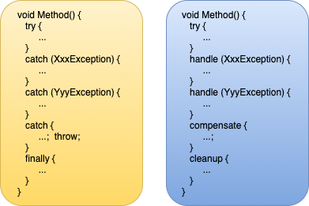  

> CLS 和非 CLS异常  
> 所有面向 CLR 的编程语言都必须支持抛出从 `Exception` 派生的对象，因为公共语言规范(Common Language Specification, CLS)对此进行了硬性规定。但是，CLR 实际允许抛出任何类型的实例，而且有些编程语言允许代码抛出非 CLS 相容的异常对象，比如一个 `String`，`Int32` 和 `DateTime` 等。C# 编译器只允许代码抛出从 `Exception` 派生的对象，而用其他一些语言写的代码不仅允许抛出 `Exception`派生对象，还允许抛出非 `Exception` 派生对象。

> 许多程序员没有意识到 CLR 允许抛出任何对象来报告异常。大多数开发人员以为只有派生自 `Exception` 的对象才能抛出。在 CLR 的 2.0 版本之前，程序员写 `catch` 块来捕捉异常时，只能捕捉 CLS 相容的异常。如果一个 C# 方法调用了用另一种编程语言写的方法，而且那个方法抛出一个非 CLS 相容的异常，那么 C# 代码根本不能捕捉这个异常，从而造成一些安全隐患。

> 在 CLR 的 2.0 版本中，Microsoft 引入了新的 `RuntimeWrappedException` 类(在命名空间 `System.Runtime.CompilerServices` 中定义)。该类派生自 `Exception`，所以它是一个 CLS 相容的异常类型。`RuntimeWrappedException` 类含有一个 `Object` 类型的一个 CLS 相容的异常类型。`RuntimeWrappedException` 类含有一个 `Object` 类型的私有字段(可通过 `RuntimeWrappedException` 类的只读属性 `WrappedException` 来访问)。在 CLR 2.0 中，非 CLS 相容的一个异常被抛出时，CLR 会自动构造 `RuntimeWrappedException` 类的实例，并初始化该实例的私有字段，使之引用实际抛出的对象。这样 CLR 就将非 CLS 相容的异常转变成了 CLS 相容的异常。所以，任何能捕捉 `Exception` 类型的代码，现在都能捕捉非 CLS 相容的异常，从而消除了潜在的安全隐患。

> 虽然 C# 编译器只允许开发人员抛出派生自 `Exception` 的对象，但在 C#的 2.0 版本之前，C# 编译器确实允许开发人员使用以下形式的代码捕捉非 CLS 相容的异常：

```C#
private void SomeMethod() {
    try {
        // 需要得体地进行恢复和/或清理的代码放在这里
    }
    catch (Exception e) {
        // C# 2.0 以前，这个块只能捕捉 CLS 相容的异常：
        // 而现在，这个块能捕捉 CLS 相容和不相容的异常
        throw;   // 重新抛出捕捉到的任何东西
    }
    catch {
        // 在所有版本的 C# 中，这个块可以捕捉 CLS 相容和不相容的异常
        throw;  // 重新抛出捕捉到的任何东西
    }
}
```

> 现在，一些开发人员注意到 CLR 同时支持相容和不相容于 CLS 的异常，他们可能像上面展示的那样写两个 `catch` 块来捕捉这两种异常。为 CLR 2.0 或更高版本重新编译上述代码，第二个 `catch` 块永远执行不到，C#编译器显示以下警告消息：

> CS1058: 上一个 catch 子句已捕获所有异常。引发的所有非异常<sup>①</sup>均被包装在 `System.Runtime.CompilerServices.RuntimeWrappedException`中。

>> ① “非异常”其实就是“非`System.Excepion`派生的异常”。 ————译注

> 开发人员有两个办法迁移 .NET Framework 2.0 之前的代码。首先，两个 `catch` 块中的代码可以合并到一个 `catch` 块中，并删除其中的一个 `catch` 块中，并删除其中的一个 `catch` 块。这是推荐的办法。另外，还可以向 CLR 说明程序集中的代码想按照旧的规则行事。也就是说，告诉 CLR 你的 `catch(Exception)` 块不应捕捉新的 `RuntimeWrappedException` 类的一个实例。在这种情况下，CLR 不会将非 CLS 相容的对象包装到一个 `RuntimeWrappedException` 实例中，而且只有在你提供了一个没有指定任何类型的 `catch` 块时才调用你的代码。为了告诉 CLR 需要旧的行为，可向你的程序集应用 `RuntimeCompatibilityAttribute` 类的实例：

```C#
using System.Runtime.CompilerServices;
[assembly:RuntimeCompatibility(WrapNonExceptionThrows = false)]
```

> 注意，该特性影响的是整个程序集。在同一个程序集中，包装和不包装异常这两种处理方式不能同时存在。向包含旧代码的程序集(假如 CLR 不支持在其中包装异常)添加新代码(希望CLR 包装异常)时要特别小心。

## <a name="20_3">20.3 `System.Exception` 类</a>

CLR 允许异常抛出任何类型的实例 ———— 从 `Int32` 到 `String` 都可以。但是，Microsoft 决定不强迫所有编程语言都抛出和捕捉任意类型的异常。因此，他们定义了 `System.Exception` 类型，并规定所有 CLS 相容的编程语言都必须能抛出和捕捉派生自该类型的异常。派生自 `System.Exception` 的异常类型被认为是 CLS 相容的。C# 和其他许多语言的编译器都只允许抛出 CLS 相容的异常。

`System.Exception` 是一个很简单的类型，表 20-1 描述了它包含的属性。但一般不要写任何代码以任何方式查询或访问这些属性。相反，当应用程序因为未处理的异常而终止时，可以在调试器中查看这些属性，或者在 Windows 应用程序事件日志或崩溃转储(crash dump)中查看。

表 20-1 `System.Exception` 类型的公共属性
|属性名称|访问|类型|说明|
|:---:|:---:|:---:|:---:|
|`Message`|只读|`String`|包含辅助性文字说明，指出抛出异常的原因。如果抛出的异常未处理，该消息通常被写入日志。由于最终用户一般不看这种消息，所以消息应提供尽可能多的技术细节，方便开发人员在生成新版本程序集时，利用消息所提供的信息来修正代码|
|`Data`|只读|`IDictionary`|引用一个“键/值对”集合。通常，代码在抛出异常前在该集合中添加记录项；捕捉异常的代码可在异常恢复过程中查询记录项；捕捉异常的代码可在异常恢复过程中查询记录项并利用其中的信息|
|`Source`|读/写|`String`|包含生成异常的程序集的名称|
|`StackTrace`|只读|`String`|包含抛出异常之前调用过的所有方法的名称和签名，该属性对调试很有用|
|`TargetSite`|只读|`MethodBase`|包含抛出异常的方法|
|`HelpLink`|只读|`String`|包含帮助用户理解异常的一个文档的 URL(例如 file://C:\MyApp\Help.htm#MyExceptionHelp)。但要注意，健全的编程和安全实践阻止用户查看原始的未处理的异常。因此，除非希望将信息传达给其他程序员，否则不要使用该属性|
|`InnerException`|只读|`Exception`|如果当前异常是在处理一个异常时抛出的，该属性就指出上一个异常是什么。这个只读属性通常为 `null`。`Exception`类型还提供了公共方法`GetBaseException`来遍历由内层异常构成的链表，并返回最初抛出的异常|
|`HResult`|读/写|`Int32`|跨越托管和本机代码边界时使用的一个 32 位值。例如，当 COM API 返回代表失败的 `HRESULT` 值时，CLR 抛出一个 `Exception` 派生对象，并通过该属性来维护 `HRESULT` 值|

这里有必要讲一下 `System.Exception` 类型提供的只读 `StackTrace` 属性。`catch` 块可读取该属性来获取一个堆栈跟踪(stack trace)，它描述了异常发生前调用了哪些方法。检查异常原因并改正代码时，这些信息是很有用的。访问该属性实际会调用 CLR 中的代码；该属性并不是简单地返回一个字符串。构造 `Exception` 派生类型的新对象时，`StackTrace` 属性被初始化为 `null`。如果此时读取该属性，得到的不是堆栈跟踪，而是一个 `null`。

一个异常抛出时，CLR 在内部记录 `throw` 指令的位置(抛出位置)。一个 `catch` 块捕捉到该异常时，CLR 记录捕捉位置。在 `catch` 块内访问被抛出的异常对象的 `StackTrace` 属性，负责实现该属性的代码会调用 CLR 内部的代码，后者创建一个字符串来指出从异常抛出位置到异常捕捉位置的所有方法。

> 重要提示 抛出异常时，CLR 会重置异常起点；也就是说，CLR 只记录最新的异常对象的抛出位置。

以下代码抛出它捕捉到的相同的异常对象，导致 CLR 重置该异常的起点：

```C#
private void SomeMethod() {
    try { ... }
    catch (Exception e) {
        ...
        throw e;        // CLR 认为这是异常的起点， FxCop 报错
    }
}
```

但如果仅仅使用 `throw` 关键字本身(删除后面的 `e`)来重新抛出异常对象，CLR 就不会重置堆栈的起点。以下代码重新抛出它捕捉到的异常，但不会导致 CLR 重置起点：

```C#
private void SomeMethod() {
    try { ... }
    catch (Exception e) {
        ...
        throw;    // 不影响 CLR 对异常起点的认知。 FxCop 不再报错
    }
}
```

实际上，两段代码唯一的区别就是 CLR 对于异常起始抛出位置的认知。遗憾的是，不管抛出还是重新抛出异常，Windows 都会重置栈的起点。因此，如果一个异常成为未处理的异常，那么向 Windows Error Reporting 报告的栈位置就是最后一次抛出或重新抛出的位置(即使 CLR 知道异常的原始抛出位置)。之所以遗憾，是因为假如应用程序在字段那里失败，会使调试工作变得异常困难。有些开发人员无法忍受这一点，于是选择以一种不同的方式实现代码，确保堆栈跟踪能真正反映异常的原始抛出位置：

```C#
private void SomeMethod() {
    Boolean trySucceeds = false;

    try {
        ...
        trySucceeds = true;
    }
    finally {
        if (!trySucceeds) { /*捕捉代码放到这里*/ }
    }
}
```

`StackTrace` 属性返回的字符串不包含调用栈中比较受异常对象的那个 `catch` 块高的任何方法<sup>①</sup>。要获得从线程起始处到异常处理程序(`catch` 块)之间的完整堆栈跟踪，需要使用 `System.Diagnostics.StackTrace` 类型。该类型定义了一些属性和方法，允许开发人员程序化地处理堆栈跟踪以及构成堆栈跟踪的栈桢<sup>②</sup>。

> ① 栈顶移动即“升高”，向栈底移动即“降低”。 —— 译注

> ② 栈桢(stack frame)代表当前线程的调用栈中的一个方法调用。执行线程的过程中进行的每个方法调用都会在调用栈中创建并压入一个 `StackFrame`。 ——译注

可用几个不同的构造器来构造一个 `StackTrace` 对象。一些构造器构造从线程起始处到 `StackTrace` 对象的构造位置的栈桢。另一些使用作为参数传递的一个 `Exception` 派生对象来初始化栈桢。

如果 CLR 能找到你的程序集的调试符号(存储在.pdb 文件中)，那么在`System.Exception`的 `StackTrace` 属性或者 `System.Diagnostics.StackTrace` 的 `ToString` 方法返回的字符串中，将包括源代码文件路径和代码行号，这些信息对于调试是很有用的。

获得堆栈跟踪后，可能发现实际调用栈中的一些方法没有出现在堆栈跟踪字符串中。这可能有两方面的原因。首先，调用栈记录的是线程的返回位置(而非来源位置)。其次， JIT 编译器可能进行了优化，将一些方法内联(inline)，以避免调用单独的方法并从中返回的开销。许多编译器(包括 C#编译器)都支持`/debug`命令行开关。使用这个开关，编译器会在生成的程序集中嵌入信息，告诉 JIT 编译器不要内联程序集的任何方法，确保调试人员获得更完整、更有意义的堆栈跟踪。

> 注意 JIT 编译器会检查应用于程序集的 `System.Diagnostics.Debuggabletrribute` 定制特性。C# 编译器会自动应用该特性。如果该特性指定了 `DisableOptimizations` 标志，JIT 编译器就不会对程序集的方法进行内联。使用 C# 编译器的 `/debug` 开关就会设置这个标志。另外，向方法应用定制特性 `System.Runtime.CompilerServices.MethodImplAttribute` 将禁止 JIT 编译器在调试和发布生成(debug and release build)时对该方法进行内联处理，以下方法定义示范了如何禁止方法内联：

```C#
using System;
using System.Runtime.CompilerServices;

internal sealed class SomeType {
    
    [MethodImpl(MethodImplOptions.NoInlining)]
    public void SomeMethod() {
        ...
    }
}
```

## <a name="20_4">20.4 FCL 定义的异常类</a>

FCL 定义了许多异常类型(它们最终都从 `System.Exception` 类型派生)。以下层次结构展示了 MSCorLib.dll 程序集中定义的异常类型；其他程序集还定义的异常类型。用于获得这个层次结构的应用程序请参见 23.3.3 节“构建`Exception`派生类型的层次结构”。

```C#
System.Exception
 System.AggregateException
 System.ApplicationException
 System.Reflection.InvalidFilterCriteriaException
 System.Reflection.TargetException
 System.Reflection.TargetInvocationException
 System.Reflection.TargetParameterCountException
 System.Threading.WaitHandleCannotBeOpenedException
 System.Diagnostics.Tracing.EventSourceException
 System.InvalidTimeZoneException
 System.IO.IsolatedStorage.IsolatedStorageException
 System.Threading.LockRecursionException
 System.Runtime.CompilerServices.RuntimeWrappedException
 System.SystemException
 System.Threading.AbandonedMutexException
 System.AccessViolationException
 System.Reflection.AmbiguousMatchException
 System.AppDomainUnloadedException
 System.ArgumentException
 System.ArgumentNullException
 System.ArgumentOutOfRangeException
 System.Globalization.CultureNotFoundException
 System.Text.DecoderFallbackException
 System.DuplicateWaitObjectException
 System.Text.EncoderFallbackException
 System.ArithmeticException
 System.DivideByZeroException
 System.NotFiniteNumberException
 System.OverflowException
 System.ArrayTypeMismatchException
 System.BadImageFormatException
 System.CannotUnloadAppDomainException
 System.ContextMarshalException
 System.Security.Cryptography.CryptographicException
 System.Security.Cryptography.CryptographicUnexpectedOperationException
 System.DataMisalignedException
 System.ExecutionEngineException
 System.Runtime.InteropServices.ExternalException
 System.Runtime.InteropServices.COMException
 System.Runtime.InteropServices.SEHException
 System.FormatException
 System.Reflection.CustomAttributeFormatException
 System.Security.HostProtectionException
 System.Security.Principal.IdentityNotMappedException
 System.IndexOutOfRangeException 
 System.InsufficientExecutionStackException
 System.InvalidCastException
 System.Runtime.InteropServices.InvalidComObjectException
 System.Runtime.InteropServices.InvalidOleVariantTypeException
 System.InvalidOperationException
 System.ObjectDisposedException
 System.InvalidProgramException
 System.IO.IOException
 System.IO.DirectoryNotFoundException
 System.IO.DriveNotFoundException
 System.IO.EndOfStreamException
 System.IO.FileLoadException
 System.IO.FileNotFoundException
 System.IO.PathTooLongException
 System.Collections.Generic.KeyNotFoundException
 System.Runtime.InteropServices.MarshalDirectiveException
 System.MemberAccessException
 System.FieldAccessException
 System.MethodAccessException
 System.MissingMemberException
 System.MissingFieldException
 System.MissingMethodException
 System.Resources.MissingManifestResourceException
 System.Resources.MissingSatelliteAssemblyException
 System.MulticastNotSupportedException
 System.NotImplementedException
 System.NotSupportedException
 System.PlatformNotSupportedException
 System.NullReferenceException
 System.OperationCanceledException
 System.Threading.Tasks.TaskCanceledException
 System.OutOfMemoryException
 System.InsufficientMemoryException
 System.Security.Policy.PolicyException
 System.RankException
 System.Reflection.ReflectionTypeLoadException
 System.Runtime.Remoting.RemotingException
 System.Runtime.Remoting.RemotingTimeoutException
 System.Runtime.InteropServices.SafeArrayRankMismatchException
 System.Runtime.InteropServices.SafeArrayTypeMismatchException
 System.Security.SecurityException
 System.Threading.SemaphoreFullException
 System.Runtime.Serialization.SerializationException
 System.Runtime.Remoting.ServerException
 System.StackOverflowException
 System.Threading.SynchronizationLockException
 System.Threading.ThreadAbortException
 System.Threading.ThreadInterruptedException
 System.Threading.ThreadStartException
 System.Threading.ThreadStateException
 System.TimeoutException
 System.TypeInitializationException
 System.TypeLoadException
 System.DllNotFoundException
 System.EntryPointNotFoundException
 System.TypeAccessException
 System.TypeUnloadedException
 System.UnauthorizedAccessException
 System.Security.AccessControl.PrivilegeNotHeldException
 System.Security.VerificationException
 System.Security.XmlSyntaxException
 System.Threading.Tasks.TaskSchedulerException
 System.TimeZoneNotFoundException
```

Microsoft 本来是打算将 `System.Exception` 类型作为所有异常的基类型，而另外两个类型 `System.SystemException` 和 `System.ApplicationException` 是唯一直接从 `Exception` 派生的类型。另外，CLR 抛出的所有异常都从 `SystemException`派生，应用程序抛出的所有异常都从 `ApplicationException` 派生。这样就可以写一个 `catch` 块来捕捉 CLR 抛出的所有异常或者应用程序抛出的所有异常。

但是，正如你看到的那样，规则没有得到严格遵守。有的异常类型直接从 `Exception` 派生(`IsolatedStorageException`)；CLR 抛出的一些异常从 `ApplicationException` 派生 (`TargetInvocationException`)；而应用程序抛出的一些异常从 `SystemException` 派生(`FormatException`)。这根本就是一团糟。结果是 `SystemException` 类型和 `ApplicationException` 类型根本没什么特殊含义。Microsoft 本该及时将它们从异常类的层次结果中移除，但现在已经不能那样做了，因为会破坏现有的代码对这两个类型的引用。

## <a name="20_5">20.5 抛出异常</a>

实现自己的方法时，如果方法无法完成方法名所指明的任务，就应抛出一个异常。抛出异常时要考虑两个问题。

第一个问题是抛出什么 `Exception` 派生类型。应选择一个有意义的类型。要考虑调用栈中位于高处的代码，要知道那些代码如何判断一个方法失败从而执行得体的恢复代码。可直接使用 FCL 定义好的类型，但在 FCL 中也许找不到和你想表达的意思完全匹配的类型。所以可能需要定义自己的类型，只要它最终从 `System.Exception` 派生就好。

强烈建议定义浅而宽的异常类型层次结构<sup>①</sup>，以创建尽量少的基类。原因是基类的主要作用就是将大量错误当作一个错误，而这通常是危险的。基于同样的考虑，永远都不要抛出一个`System.Exception` 对象<sup>②</sup>，抛出其他任何基类异常类型时也要特别谨慎。

> ① = 浅而宽； = 深而窄。 ——— 译注

> ② 事实上，Microsoft 本来就应该将 `System.Exception` 类标记为 `abstract`，在编译时就禁止代码试图抛出它(的实例)。

> 重要提示 还要考虑版本问题。如果定义从现有异常类型派生的一个新异常类型，捕捉现有基类型的所有代码也能捕捉新类型。这有时可能正好是你期望的，但有时也可能不是，具体取决于捕捉基类的代码以什么样的方式响应异常类型及其派生类型。从未预料到会有新异常的代码现在可能出现非预期的行为，并可能留下安全隐患。而定义新异常类型的人一般不知道基异常的所有捕捉位置以及具体处理方式。所以这里事实不可能做出面面俱到的决定。

第二个问题是向异常类型的构造器传递什么字符串消息。抛出异常时应包含一条字符串消息，详细说明方法为什么无法完成任务。如果异常被捕捉到并进行了处理，用户就看不到该字符串消息。但是，如果成为未处理的异常，消息通常会被写入日志。未处理的异常意味着应用程序存在真正的bug，开发人员必须修复该 bug。最终用户没有源代码或能力去修复 bug 并重新编译程序。事实上，这个字符串消息根本不应该向最终用户显示，所以，字符串消息可以包含非常详细的技术细节，以帮助开发人员修正代码。

另外，由于所有开发人员都不得不讲英语(至少要会一点，因为编程语言和 FCL 类/方法都使用英语)，所以通常不必本地化异常字符串消息。但如果要构建由非英语开发人员使用的类库，就可能需要本地化字符串消息。Microsoft 已本地化了 FCL 抛出的异常消息，因为全世界的开发人员都要用这个类库。

## <a name="20_6">20.6 定义自己的异常类</a>

遗憾的是，设计自己的异常不仅繁琐，还容易出错。主要原因是从  `Exception` 派生的所有类型都应该是可序列化的(serializable)，使它们能穿越 AppDomain 边界或者写入日志/数据库。序列化涉及许多问题，详情将在第24章“运行时序列化”讲述。所以，为了简化编码，我写了一个自己的泛型 `Exception<TExceptionArgs>`类，它像下面这样定义：

```C#
[Serializable]
public sealed class Exception<TExceptionArgs> : Exception, ISerializable where TExceptionArgs : ExceptionArgs {

    private const String c_args = "Args";       // 用于(反)序列化
    private readonly TExceptionArgs m_args;

    public TExceptionArgs Args { get { return m_args; } }

    public Exception(String message = null, Exception innerException = null) 
        : this(null, message, innerException) { }

    public Exception(TExceptionArgs args, String message = null, 
      Exception innerException = null) : base(message, innerException) {
        m_args = args;
    }

    // 这个构造器用于反序列化：由于类是密封的，所以构造器是私有的.
    // 如果这个类不是密封的，这个构造器就应该是受保护的.
    [SecurityPermission(SecurityAction.LinkDemand, Flags = SecurityPermissionFlag.SerializationFormatter)]
    private Exception(SerializationInfo info, StreamingContext context) : base(info, context) {
        m_args = (TExceptionArgs)info.GetValue(c_args, typeof(TExceptionArgs));
    }

    // 这个方法用于序列化：由于 ISerializable 接口，所以它是公共的
    [SecurityPermission(SecurityAction.LinkDemand, Flags = SecurityPermissionFlag.SerializationFormatter)]
    public override void GetObjectData(SerializationInfo info, StreamingContext context) {
        info.AddValue(c_args, m_args);
        base.GetObjectData(info, context);
    }

    public override string Message {
        get  {
            String baseMsg = base.Message;
            return (m_args == null) ? baseMsg : baseMsg + " (" + m_args.Message + ")";
        }
    }

    public override Boolean Equals(Object obj) {
        Exception<TExceptionArgs> other = obj as Exception<TExceptionArgs>;
        if (other == null) return false;
        return Object.Equals(m_args, other.m_args) && base.Equals(obj);
    }
    public override int GetHashCode() { return base.GetHashCode(); }
}
```

`TExceptionArgs`约束为的`ExceptionArgs`基类非常简单，它看起来像下面这样：

```C#
[Serializable]
public abstract class ExceptionArgs {
    public virtual String Message { get { return String.Empty; } }
}
```

定义好这两个类之后，定义其他异常类就是小事一桩。要定义代表磁盘满的异常类，可以像下面这样写：

```C#
[Serializable]
public sealed class DiskFullExceptionArgs : ExceptionArgs {
    private readonly String m_diskpath;     // 在构造时设置的私有字段

    public DiskFullExceptionArgs(String diskpath) { m_diskpath = diskpath; }

    // 返回字段的公共只读属性
    public String DiskPath { get { return m_diskpath; } }

    // 重写 Message 属性来包含我们的字段(如果设置了的话)
    public override String Message {
        get {
            return (m_diskpath == null) ? base.Message : "DiskPath=" + m_diskpath;
        }
    }
}
```

另外如果没有额外的数据要包含到类中，可以简单地写成：

```C#
[Serializable]
public sealed class DiskFullExceptionArgs : ExceptionArgs { }
```

现在，可以像下面这样写来抛出并捕捉这样的一个异常：

```C#
public static void TestException() {
    try {
        throw new Exception<DiskFullExceptionArgs>(new DiskFullExceptionArgs(@"C:\"), "The disk is full");
    }
    catch (Exception<DiskFullExceptionArgs> e) {
        Console.WriteLine(e.Message);
    }
}
```

> 注意 我的 `Exception<TExceptionArgs>` 类有两个问题需要注意。第一个问题是，用它定义的任何异常类型都总是派生自 `System.Exception`。这在大多数时候都不是问题，而且浅而宽的异常类型层次结构还是一件好事。第二个问题是，Visual Studio 的未处理异常对话框不会显示 `Exception<T>`类型的泛型类型参数，如下图所示。

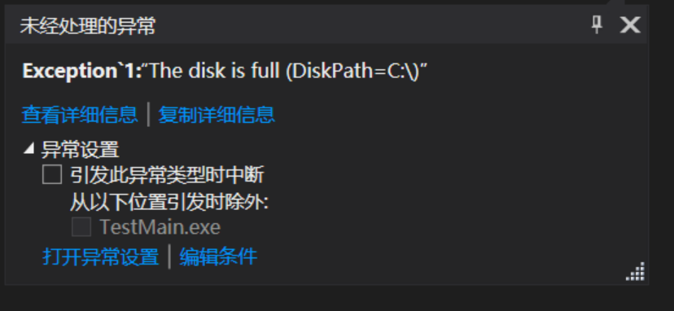  

## <a name="20_7">20.7 用可靠性换取开发效率</a>

我从 1975 年开始写软件。首先是进行大量 BASIC 编程。随着我对硬件的兴趣日增，又转向汇编语言。随着时间的推移，我开始转向 C 语言，因为它允许我从更高的抽象层访问硬件，使编程变得更容易。我的资历是写操作系统代码和平台/库代码，所以我总是努力使自己的代码尽量小而快。应用程序写得再好，也不会强过它们赖以生存的操作系统和库吧?

除了创建小而快的代码，我还总是关注错误恢复。分配内存时(使用 C++ 的 `new` 操作符或调用 `malloc`，`HeapAlloc`，`VirtualAlloc` 等)，我总是检查返回值，确保我请求的内存真的给了我。另外，如果内存请求失败，我总是提供一个备选的代码路径，确保剩余的程序状态不会受影响。而且让我的所有调用者都知道我失败了，使调用代码也能采取正确的补救措施。

出于某些我不好解释的原因，为 .NET Framework 写代码时，我没有做到这种对细节的关注。“内存耗尽”总是可能发生的，但我几乎没看到过任何代码包含从 `OutOfMemoryException` 恢复的 `catch` 块。事实上，甚至有的开发人员告诉我 CLR 不让程序捕捉 `OutOfMemoryException`。我在此要郑重声明，绝对不是这样的；你可以捕捉这个异常。事实上，执行托管代码时，有太多的错误都可能发生，但我很少看到开发人员写代码尝试从这些潜在的错误中恢复。本节要指出其中的一些潜在的错误，并解释为什么可以合理地忽略它们。我还要指出忽略了这些错误之后，可能造成什么重大的问题，并推荐了有助于缓解这些问题的一些方式。

面向对象编程极大提升了开发人员的开发效率。开发效率的提升有很大一部分来自可组合性(composability)，它使代码很容易编写、阅读和维护。例如下面这行代码：

`Boolean f = "Jeff".Substring(1, 1).ToUpper().EndsWith("E");`

但上述代码有一个很重要的前提：没有错误发生。而错误总是可能发生的。所以，我们需要一种方式处理错误。这正是异常处理构造<sup>①</sup>和机制的目的，我们不能像 Win32 和 COM 函数那样返回 `true/false` 或者一个 `HRESULT` 来指出成功/失败。

> ① `try-catch-finally` 就是 C# 的异常处理 ”构造“。 ——译注

除了代码的可组合性，开发效率的提升还来自编译器提供的各种好用的功能。例如，编译器能隐式地做下面这些事情。

* 调用方法时插入可选参数。

* 对值类型的实例进行装箱。

* 构造/初始化参数数组。

* 绑定到 `dynamic` 变量/表达式的成员。

* 绑定到扩展方法。

* 绑定/调用重载的操作符(方法)。

* 构造委托对象。

* 在调用泛型方法、声明局部变量和使用 lambda 表达式时推断类型。

* 为 lambda 表达式和迭代器定义/构造闭包类<sup>①</sup>。

> ① 闭包(closure)是由编译器生成的数据结构(一个 C# 类)，其中包含一个表达式以及对表达式进行求值所需的变量(C# 的公共字段)。变量允许在不改变表达式签名的前提下，将数据从表达式的一次调用传递到下一次调用。————译注

* 定义/构造/初始化匿名类型及其实例。

* 重写代码来支持 LINQ 查询表达式和表达式树。

另外，CLR 本身也会提供大量辅助来进一步简化编程。例如，CLR 会隐式做下面这些事情。

* 调用虚方法和接口方法。

* 加载程序集并对方法进行 JIT 编译，可能抛出以下异常：`FileLoadException`，`BadImageFormatException`，`InvalidProgramException`，`FieldAccessException`，`MethodAccessException`，`MissingFieldException`，`MissingMethodException` 和 `VerificationException`。

* 访问 `MarshalByRefObject` 派生类型的对象时穿越 AppDomain 边界(可能抛出 `AppDomainUnloadedException`)。

* 穿越 AppDomain 边界时序列化和反序列化对象。

* 调用 `Thread.Abort` 或 `AppDomain.Unload` 时造成线程抛出 `ThreadAbortException`。

* 垃圾回收之后，在回收对象的内存之前调用 `Finalize` 方法。

* 使用泛型类型时，在 Loader 堆中创建类型对象<sup>②</sup>。

> ② 每个 AppDomain 都有一个自己的托管堆，这个托管堆内部又按照功能进行了不同的划分，其中最重要的就是 GC 堆和 Loader 堆，前者存储引用类型的实例，也就是会被垃圾回收机制”照顾“到的东西。而 Loader 堆负责存储类型的元数据，也就是所谓的“类型对象”。在每个“类型对象”的末尾，都含有一个“方法表”。详情参见 22.2 节和图 22-1。 ———— 译注

* 调用类型的静态构造器<sup>③</sup>(可能抛出 `TypeInitializationException`)。

> ③ 也称为类型构造器，详情参见 8.3 节 “类型构造器”。 ————译注

* 抛出各种异常，包括 `OutOfMemoryException`，`DivideByZeroException`，`NullReferenceException`，`RuntimeWrappedException`，`TargetInvocationException`，`OverflowException`，`NotFiniteNumberException`，`ArrayTypeMismatchException`，`DataMisalignedException`，`IndexOutOfRangeException`，`InvalidCastException`，`RankException`，`SecurityException`等。

另外，理所当然地，.NET Framework 配套提供了一个包罗万象的类库，其中有无数的类型，每个类型都封装了常用的、可重用的功能。可利用这些类型构建 Web 窗体应用程序、 Web 服务和富 GUI 应用程序，可以处理安全性、图像和语音识别等。所有这些代码都可能抛出代表某个地方出错的异常。另外，未来的版本可能引入从现有异常类型派生的新异常类型，而你的 `catch` 块能捕捉未来才会出现的异常类型。

所有这一切————面向对象编程、编译器功能、CLR 功能以及庞大的类库 ——— 使 .NET Framework 成为颇具吸引力的软件开发平台<sup>①</sup>。但我的观点是，所有这些东西都会在代码中引入你没什么控制权的“错误点”(point of failure)。如果所有东西都正确无误地运行，那么一切都很好：可以方便地编写代码，写出来的代码也很容易阅读和维护。但一旦某样东西出了问题，就几乎不可能完全理解哪里出错和为什么出错。下面这个例子可以证明我的观点：

```C#
private static Object OneStatment(Stream stream, Char charToFind) {
    return (charToFind + ": " + stream.GetType() + String.Empty + (strram.Position + 512M)).Where(c=>c == charToFind).ToArray();
}
```

> ① 应该补充的是，Visual Studio 的编辑器、智能感知支持、代码段(code snippet)支持、模板、可扩展系统、调试系统以及其他多种工具也增大了平台对于开发人员的吸引力。但之所以把这些放在讨论主线以外，是因为它们对代码运行时的行为没有任影响。

这个不太自然的方法只包含一个 C#语句，但该语句做了大量工作。下面是 C#编译器为这个方法生成的 IL 代码(一些行加粗并倾斜；由于一些隐式的操作，它们成了潜在的 “错误点”)：

```C#
.method private hidebysig static object OneStatement(
 class [mscorlib]System.IO.Stream stream, char charToFind) cil managed {
 .maxstack 4
 .locals init (
 [0] class Program/<>c__DisplayClass1 V_0,
 [1] object[] V_1)
 L_0000: newobj instance void Program/<>c__DisplayClass1::.ctor()
 L_0005: stloc.0
 L_0006: ldloc.0
 L_0007: ldarg.1
 L_0008: stfld char Program/<>c__DisplayClass1::charToFind
 L_000d: ldc.i4.5
 L_000e: newarr [mscorlib]System.Object
 L_0013: stloc.1
 L_0014: ldloc.1
 L_0015: ldc.i4.0
 L_0016: ldloc.0
 L_0017: ldfld char Program/<>c__DisplayClass1::charToFind
 L_001c: box [mscorlib]System.Char
 L_0021: stelem.ref 
 L_0022: ldloc.1
 L_0023: ldc.i4.1
 L_0024: ldstr ": "
 L_0029: stelem.ref
 L_002a: ldloc.1
 L_002b: ldc.i4.2
 L_002c: ldarg.0
 L_002d: callvirt instance class [mscorlib]System.Type [mscorlib]System.Object::GetType()
 L_0032: stelem.ref
 L_0033: ldloc.1
 L_0034: ldc.i4.3
 L_0035: ldsfld string [mscorlib]System.String::Empty
 L_003a: stelem.ref
 L_003b: ldloc.1
 L_003c: ldc.i4.4
 L_003d: ldc.i4 0x200
 L_0042: newobj instance void [mscorlib]System.Decimal::.ctor(int32)
 L_0047: ldarg.0
 L_0048: callvirt instance int64 [mscorlib]System.IO.Stream::get_Position()
 L_004d: call valuetype [mscorlib]System.Decimal
         [mscorlib]System.Decimal::op_Implicit(int64)
 L_0052: call valuetype [mscorlib]System.Decimal [mscorlib]System.Decimal::op_Addition
         (valuetype [mscorlib]System.Decimal, valuetype [mscorlib]System.Decimal)
 L_0057: box [mscorlib]System.Decimal
 L_005c: stelem.ref
 L_005d: ldloc.1
 L_005e: call string [mscorlib]System.String::Concat(object[])
 L_0063: ldloc.0
 L_0064: ldftn instance bool Program/<>c__DisplayClass1::<OneStatement>b__0(char)
 L_006a: newobj instance
         void [mscorlib]System.Func`2<char, bool>::.ctor(object, native int)
 L_006f: call class [mscorlib]System.Collections.Generic.IEnumerable`1<!!0>
         [System.Core]System.Linq.Enumerable::Where<char>(
         class [mscorlib]System.Collections.Generic.IEnumerable`1<!!0>,
         class [mscorlib]System.Func`2<!!0, bool>)
 L_0074: call !!0[] [System.Core]System.Linq.Enumerable::ToArray<char>
         (class [mscorlib]System.Collections.Generic.IEnumerable`1<!!0>)
 L_0079: ret
} 
```

由此可见，构造`<>c__DisplayClass1`类(编译器生成的类型)、`Object[]`数组和`Func`委托，以及对`char`和`Decimal`进行装箱时，可能抛出一个`OutOfMemoryException`。调用`Concat`，`Where` 和 `ToArray`时，也会在内部分配内存。构造 `Decimal` 实例时，可能造成它的类型构造器被调用，并抛出一个 `TypeInitializationException`<sup>①</sup>。还存在对 `Decimal` 的 `op_Implicit` 操作符和 `op_Addition` 操作符方法的隐式调用，这些方法可能抛出一个 `OverflowException`。

> ① 顺便说一句，`System.Char`，`System.String`，`System.Type` 和 `System.IO.Stream` 都定义了类构造器，它们全部都有可能造成在这个应用程序的某个位置抛出一个 `TypeInitializationException`

`Stream` 的 `Position` 属性比较有趣。首先，它是一个虚属性，所以我的 `OneStatement` 方法无法知道实际执行的代码，可能抛出任何异常。其次，`Stream` 从 `MarshalByRefObject` 派生，所以 `stream` 实参可能引用一个代理对象，后者又引用另一个 AppDomain 中的对象。而另一个 AppDomain 可能已经卸载，造成一个 `AppDomainUnloadedException`。

当然，调用的所有方法都是我个人无法控制的，它们都由 Microsoft 创建。Microsoft 将来还可能更改它们的实现，抛出我写 `OneStatement` 方法时不可能预料到的新异常类型。所以，我怎么可能写这个 `OneStatement` 方法来获得完全的“健壮性”来防范所有可能的错误呢？顺便说一句，反过来也存在问题：`catch` 块可捕捉指定异常类型的派生类型，所以是在为一种不同的错误执行恢复代码。

对所有可能的错误有了一个基本认识之后，就能理解为何不去追求完全健壮和可靠的代码了：因为不切实际(更极端的说法是根本不可能)。不去追求完全的健壮性和可靠性，另一个原因是错误不经常发生。由于错误(比如`OutOfMemoryException`)极其罕见，所以开发人员决定不去追求完全可靠的代码，牺牲一定的可靠性来换取程序员开发效率的提升。

异常的好处在于，未处理的异常会造成应用程序终止。之所以是好事，是因为可在测试期间提早发现问题。利用由未处理异常提供的信息(错误消息和堆栈跟踪)，通常足以完成对代码的修正。当然，许多公司不希望应用程序在测试和部署之后还发生意外终止的情况，所以会插入代码来捕捉 `System.Exception`，也就是所有异常类型的基类。但如果捕捉 `System.Exception` 并允许应用程序继续运行，一个很大的问题是状态可能遭受破坏。

本章早些时候展示了一个 `Account` 类，它定义了一个 `Transfer` 方法，用于将钱从一个账户转移到另一个。这个 `Transfer` 方法调用时，如果成功将钱从 `from` 账户扣除，但在将钱添加到 `to` 账户之前抛出异常，那么会发生什么？如果调用代码(调用这个方法的代码)捕捉 `System.Exception` 并继续进行，应用程序的状态的破坏：`from` 和 `to` 账户的钱都会错误地变少。由于涉及到金钱，所以这种对状态的破坏不能被视为简单 bug，而应被看成是一个安全性 bug。应用程序继续进行，会尝试对大量账户执行更多的转账操作，造成状态破坏大量蔓延。

一些人会说，`Transfer` 方法本身应该捕捉 `System.Exception` 并将钱还给 `from` 账户。如果 `Transfer` 方法很简单，这个方案确实可行。但如果 `Transfer` 方法还要确实可行。但如果 `Transfer` 方法还要生成关于取钱的审计记录，或者其他线程要同时操作同一个账户，那么撤销(undo)操作本身就可能失败，造成抛出其他异常。现在，状态破坏将变得更糟而非更好。

> 注意 有人或许会说，知道哪里出错，比知道出了什么错更有用。例如，更有用的是知道从一个账户转账失败，而不是知道 `Transfer` 由于 `SecurityException` 或 `OutOfMemoryException` 而失败。事实上， Win32 错误模型就是这么设计的，方法是返回 `true/false` 来指明成功/失败，使你知道哪个方法失败。然后，如果程序关心失败的原因，可调用 Win32 函数 `GetLastError`。 `System.Exception` 确实有一个`Source`属性可以告诉你失败的方法。但这个属性是一个你必须进行解析的 `String`，而且假如两个方法在内部调用同一个方法，那么单凭 `Source` 属性是看不出哪个方法失败的。相反，必须解析从 `Exception` 的 `StackTrace` 属性返回的 `String` 来获取这个信息。这实在是太难了，我从未见过任何人真的写代码这样做。

为了缓解对状态的破坏，可以做下面几件事情。

* 执行 `catch` 或 `finally` 块中的代码时，CLR 不允许线程终止。所以，可以像下面这样使 `Transfer` 方法变得更健壮：

```C#
public static void Transfer(Account from, Account to, Decimal amount) {
    try {  /* 这里什么都不做 */ }
    finally {
        from -= amount;
        // 现在，这里不可能因为 Thread.Abort / AppDomain.Unload 而发生线程终止
        to += amount;
    }
}
```

但绝对不建议将所有代码都放到 `finally` 块中！这个技术只适合修改极其敏感的状态。

* 可以用 `System.Diagnostics.Contrancts.Contract` 类向方法应用代码协定。通过代码协定，在用实参和其他变量对状态进行修改之前，可以先对这些实参/变量进行验证。如果实参/变量遵守协定，状态被破坏的可能性将大幅降低(但不能完全消除)。如果不遵守协定，那么异常会在任何状态被修改之前抛出。本章稍后将讨论代码协定。

* 可以使用约束执行区域(Constrained Execution Region，CER)，它能消除 CLR 的某些不确定性。例如，可让 CLR 在进入 `try` 块之前加载与这个 `try` 块关联的任何 `catch` 和 `finally` 块需要的程序集。此外，CLR 会编译 `catch` 和 `finally` 块中的所有代码，包括从这些块中调用的所有方法。这样在尝试执行 `catch` 块中的错误恢复代码或者 `finally` 块中的(资源)清理代码时，就可以消除众多潜在的异常(包括 `FileLoadException`，`BadImageFormatException`，`InvalidProgramException`，`FieldAccessException`，`MethodAccessException`，`MissingFieldException`，`MissingMethodException`)。它还降低了发生 `OutOfMemoryException` 和其他一些异常的机率。本章稍后会讨论 CER。

* 取决于状态存在于何处，可利用事务(transaction)来确保状态要么都修改，要么都不修改。例如，如果数据在数据库中，事务能很好地工作。Windows 现在还支持事务式的注册表和文件操作(仅限 NTFS 卷)，所以也许能利用它。但是，.NET Framework 目前没有直接公开这个功能。必须 `P/Invoke`<sup>①</sup>本机代码才行。请参见 `System.Transactions.TransactionScope` 类了解细节。

> 平台调用。 ——译注

* 将自己的方法设计得更明确。例如，一般像下面这样使用 `Monitor`类来获取/释放线程同步锁：

```C#
public static class SomeType {
    private static Object s_myLockObject = new Object();

    public static void SomeMethod() {
        Monitor.Enter(s_myLockObject);      // 如果抛出异常，是否获取了锁 ？
                                            // 如果已经获取了锁，它就得不到释放！
        try {
            // 在这里执行线程安全的操作...
        }
        finally {
            Monitor.Exit(s_myLockObject);
        }
    }
    // ...
}
```

由于存在前面展示的问题，所以这个重载的 `Monitor` 的 `Enter` 方法已经不再鼓励使用。建议下面这样重写以上代码：

```C#
public static class SomeType {
    private static Object s_myLockObject = new Object();

    public static void SomeMethod() {
        Boolean lockTaken = false;      // 假定没有获取锁
        try {
            // 无论是否抛出异常，以下代码都能正常工作!
            Monitor.Enter(s_myLockObject, ref lockTaken);

            // 在这里执行线程安全的操作...
        }
        finally {
            // 如果已获取锁，就释放它
            if (lockTaken) Monitor.Exit(s_myLockObject);
        }
    }
    // ...
}
```

虽然以上代码使方法变得更明确，但在线程同步锁的情况下，现在的建议是根本不要随同异常处理使用它们。详情参见第 30 章“混合线程同步构造”。

在你的代码中，如果确定状态已损坏到无法修复的程度，就应销毁所有损坏的状态，防止它造成更多的伤害。然后，重新启动应用程序，将状态初始化到良好状态，并寄希望于状态不再损坏。由于托管的状态泄露不到 AppDomain 的外部，所以为了销毁 AppDomain 中所有损坏的状态，可调用 `AppDomain` 的 `Unload` 方法来卸载整个 AppDomain，详情参见第 22 章 “CLR 寄宿和 AppDomain”。

如果觉得状态过于糟糕，以至于整个进程都应该终止，那么应该调用 `Environment` 的静态 `FailFast`方法：

```C#
public static void FailFast(String message);
public static void FailFast(String message, Exception exception);
```

这个方法在终止进程时，不会运行任何活动的 `try/finally` 块或者 `Finalize` 方法。之所以这样做，是因为在状态已损坏的前提下执行更多的代码，很容易使局面变得更坏。不过，`FailFast` 为从 `CriticalFinalizerObject` 派生的任何对象(参见第 21 章 “托管堆和垃圾回收”)提供了进行清理的机会，因为它们一般只是关闭本机资源；而即使 CLR 或者你的应用程序的状态发生损坏，Windows 状态也可能是好的。`FailFast`方法将消息字符串和可选的异常(通常是 `catch` 块中捕捉的异常)写入 Windows Application 事件日志，生成 Windows 错误报告，创建应用程序的内存转储(dump)，然后终止当前进程。

> 重要提示 发生意料之外的异常时，Microsoft 的大多数 FCL 代码都不保证状态保持良好。如果你的代码捕捉从 FCL 代码那里“漏”过来的异常并继续使用 FCL 的对象，这些对象的行为有可能变得无法预测。令人难堪的是，现在越来越多的 FCL 对象在面对非预期的异常时不能更好地维护状态或者在状态无法恢复时调用`FailFast`。

以上讨论主要是为了让你意识到 CLR 异常处理机制存在的一些问题。大多数应用程序都不能容忍状态受损而继续运行，因为这可能造成不正确的数据，设置可能造成安全漏洞。如果应用程序不方便终止(比如操作系统或数据库引擎)，托管代码就不是一个好的技术。尽管 Microsoft Exchange Server 有很大一部分是用托管代码写的，但它还是要用一个本机(native)数据库存储电子邮件。这个本机数据库称为 Extensible Storage Engine，它是随同 Windows 提供的，路径一般是 `C:\Windows\System32\EseNT.dll`。如果喜欢，你的应用程序也能使用这个引擎。欲知详情，请在 MSDN 中搜索 “Extensible Storage Engine”。

如果应用程序“在状态可能损坏时终止”不会造成严重后果，就适合用托管代码来写。有许多应用程序都满足这个要求。此外，需要多得多的资源和技能，才能写出健壮的本机(native)类库或应用程序。对于许多应用程序，托管代码是更好的选择，因为它极大提升了开发效率。

## <a name="20_8">20.8 设计规范和最佳实践</a>

理解异常机制固然重要，但同等重要的是理解如何正确使用异常。我经常发现类库开发人员捕捉所有类型的异常，造成应用程序开发人员对问题不知情。本节将就异常的使用提供一些设计规范。

> 重要提示 如果你是类库开发人员，要设计供其他开发人员使用的类型，那么一定要严格按照这些规范行事，你的责任很重大，要精心设计类库中的类型，那么一定要更严格按照这些规范行事。你的责任很重大，要精心设计类库中的类型，使之适用于各种各样的应用程序。记住，你无法做到对要回调的代码(通过委托、虚方法或接口方法)了如指掌，也不知道哪些代码会调用你(的代码)。由于无法预知使用类型的每一种情形，所以不要做出任何策略抉择(遇见到具体异常并相应处理)。换言之，你的代码一定不能想当然地决定一些错误情形；应该让调用者自己决定。

> 此外，要严密监视状态，尽量不要破坏它。使用代码协定(本章稍后讨论)验证传给方法的实参。尝试完全不去修改状态。如果不得不修改状态，就做好出错的准备，并在出错后尝试恢复状态。遵照本章的设计规范行事，应用程序的开发人员就可以顺畅地使用你的类库中的类型。

> 如果你是应用程序开发人员，可定义自己认为合适的任何策略，按照本章的规范行事，有助于在应用程序发布前发现并修复代码中的问题，使应用程序更健壮，但经深思熟虑之后，也可以不按这些规范行事。你要设置自己的策略。例如，应用程序代码在捕捉异常方面可以比类库代码更激进一些。<sup>①</sup>。

>> ① 例如，由于知道自己的应用程序的情况，所以可以捕捉一些更具体的异常，而不是像类库代码那样“畏首畏尾”。换言之，现在可以“做出策略决策”了。———译注

### 20.8.1 善用 `finally` 块

我认为`finally`块非常“厉害”！无论线程抛出什么类型的异常，`finally`块中的代码都会执行。应该先用`finally`块清理那些已成功启动的操作，再返回至调用者或者执行`finally`块之后的代码。另外，还经常利用`finally`块显式释放对象以避免资源泄露。下例将所有资源清理代码(负责关闭文件)都放到一个`finally`块中：

```C#
using System;
using System.IO;

public sealed class SomeType {
    private void SomeMethod() {
        FileStream fs = new FileStream(@"C:\Data.bin", FileMode.Open);
        try {
            // 显示用 100 除以文件第一个字节的结果
            Console.WriteLine(100 / fs.ReadByte());
        }
        finally {
            // 将资源清理代码放到 finally 块中，确保无论是否发生异常
            // (例如，第一个字节为 0)，文件都会关闭
            fs.Close();
        }
    }
}
```

确保清理代码的执行时如此重要，以至于许多编程语言都提供了一些构造来简化这种代码的编写。例如，只要使用了 `lock`，`using`和`foreach`语句，C# 编译器就会自动生成 `try/finally` 块，另外，重写类的析构器(`Finalize`方法)时，C#编译器也会自动生成`try/finally`块。使用这些构造时，编译器将你写的代码放到 `try` 块内部，并将清理代码放到 `finally` 块中。具体如下所示。

* 使用 `lock` 语句时，锁在 `finally` 块中释放。
* 使用 `using` 语句时，在`finally`块中调用对象的 `Dispose` 方法。
* 使用 `foreach` 语句时，在 `finally` 块中调用 `IEnumerator` 对象的 `Dispose` 方法。
* 定义析构器方法时，在`finally`块中调用基类的`Finalize`方法。

例如，以下 C# 代码利用了 `using` 语句。比上例精简，但编译后的结果一样。

```C#
using System;
using System.IO;

public sealed class SomeType {
    private void SomeMethod() {
        using (FileStream fs = new FileStream(@"C:\Data.bin", FileMode.Open)) {
            // 显示用 100 除以文件第一个字节的结果
            Console.WriteLine(100 / fs.ReadByte());
        }
    }
}
```

要详细了解 `using` 语句，请参见第 21 章；要详细了解 `lock` 语句，请参见第 30 章。

### 20.8.2 不要什么都捕捉

使用异常时，新手常犯的错误是过于频繁或者不恰当地使用 `catch` 块。捕捉异常表明你预见该异常，理解它为什么发生，并知道如何处理它。换句话说，是在为应用程序定义一个策略，详情请参考 20.7 节“用可靠谱性换取开发效率”。

但我经常看到下面这样的代码：

```C#
try {
    // 尝试执行程序员知道可能失败的代码...
}
catch (Exception) {
    ...
}
```

这段代码说它预见到了所有异常类型，并知道如何从所有异常状态恢复。这不是吹牛吗？如果类型是类库的一部分，那么任何情况下都绝对不允许捕捉并“吞噬”<sup>①</sup>所有异常，因为它不可能准确预知应用程序将如何响应一个异常。此外，类型经常通过委托、虚方法或接口方法调用应用程序代码。应用程序代码抛出异常，应用程序的另一部分可能预期要捕捉该异常。所以，绝对不要写“大小通吃”的类型，悄悄地“吞噬”异常，而是应该允许异常在调用栈中向上移动，让应用程序代码针对性地处理它。

> 即“swallow”，这是本书作者喜欢的说法；也有一些作者喜欢说“bury”。除了“吞噬”，也有人把它翻译为“隐藏”。简单地说，就是自己搞定异常，然后装作异常没有发生。 ————译注

如果异常未得到处理，CLR 会终止进程。本章稍后会讨论未处理的异常。大多数未处理异常都能在代码测试期间发现。为了修正这些未处理的异常，要么修改代码来捕捉特定异常，要么重写代码排除会造成异常的出错条件。在生产环境中运行的最终版本应该极少出现未处理的异常，而且应该相当健壮。

> 注意 有时，不能完成任务的一个方法检测到对象状态已经损坏，而且状态无法恢复。假如允许应用程序继续运行，可能造成不可预测的行为或安全隐患。检测到这种情况，方法不应抛出异常。相反，应调用 `System.Environment` 的 `FailFast` 方法强迫进程终止。

顺便说一句，确实可以在 `catch` 块中捕捉`System.Exception`并执行一些代码，只要在这个`catch`块的末尾重新抛出异常。千万不要捕捉`System.Exception`异常并悄悄“吞噬”它而不重新抛出，否则应用程序不知道已经出错，还是会继续运行，造成不可预测的结果和潜在的安全隐患。Visual Studio 的代码分析工具(FxCopCmd.exe)会标记包含 `catch(Exception)` 块的所有代码，除非块中有 `throw` 语句。稍后的 20.8.4 节将讨论这个模式。

最后，可以在一个线程中捕捉异常，在另一个线程中重新抛出异常。为此提供支持的是异步编程模型(详情参见第 28 章“I/O 限制的异步操作”)。例如，假定一个线程池线程执行的代码抛出了异常，CLR 捕捉并“吞噬”这个异常，并允许线程返回线程池。稍后，会有某个线程调用 `EndXXX` 方法来判断异步操作的结果。`EndXXX`方法将抛出与负责实际工作的那个线程池抛出的一样的异常。所以，异常虽然被第一个方法“吞噬”，但又被调用 `EndXXX` 的线程重新抛出。这样，该异常在应用程序面前就不是隐藏的了。

### 20.8.3 得体地从异常中恢复

有时，调用方法时已预料到它可能抛出某些异常。由于能预料到这些异常，所以可以写一些代码，允许应用程序从异常中得体地恢复并继续运行。下面是一个伪代码的例子：

```C#
public String CalculateSpreadsheetCell(Int32 row, Int32 column) {
    String result;
    try {
        result = /* 计算电子表格单元格中的值 */
    }
    catch(DivideByZeroException) {  // 捕捉被零除错误
        result = "Can't show value: Divide by zero";
    }
    catch (OverflowException) {     // 捕捉溢出错误 
        result = "Can't show value: Too big";
    }
    return result;
}
```

上述伪代码计算电子表格的单元格中的内容，将代表值的字符串返回给调用者，使调用者能在应用程序的窗口中显示字符串。但单元格的内容可能是另外两个单元格相除的结果。如果作为分母的单元格包含 0， CLR 将抛出 `DivideByZeroException` 异常。在本例中，方法会捕捉这个具体的异常，返回并向用户显示一个特殊字符串。类似地，单元格的内容可能是另两个单元格相乘的结果。如果结果超出该单元格的取值范围，CLR 将抛出 `OverflowException` 异常。同样地，会返回并向用户显示一个特殊字符串。

捕捉具体异常时，应充分掌握在什么时候会抛出异常，并知道从捕捉的异常类型派生出了哪些类型。不要捕捉并处理 `System.Exception`(除非你会重新抛出)，因为不可能搞清楚在 `try` 块中可能抛出的全部异常。例如，`try` 块还可能抛出`OutOfMemoryException` 和 `StackOverflowException` ，而这只是所有可能的异常中很普通的两个。

### 20.8.4 发生不可恢复的异常时回滚部分完成的操作————维持状态

通常，方法要调用其他几个方法来完成一个抽象操作，这些方法有的可能成功，有的可能失败。例如，将一组对象序列化成磁盘文件时，序列化好第 10 个对象后抛出了异常(可能因为磁盘已满，或者要序列化的下个对象没有应用`Serializable`定制特性)。在这种情况下，应该将这个异常“漏”给调用者处理，但磁盘文件的状态怎么办呢？文件包含一个部分序列化的对象图(object graph)<sup>①</sup>，所以它已经损坏。理想情况下，应用程序应回滚已部分完成的操作，将文件恢复为任何对象序列化之前的状态。以下代码演示了正确的实现方式：

> ① object graph 是一个抽象的概念，代表对象系统在特定时间点的视图。另一个常用的术语 object diagram 则是指总体 object graph 的一个子集。 ———— 译注

```C#
public void SerializeObjectGraph(FileStream fs, IFormatter formatter, Object rootObj) {

    // 保存文件的当前位置
    Int64 beforeSerialization = fs.Position;

    try {
        // 尝试将对象图序列化到文件中
        formatter.Serialize(fs, rootObj);
    }
    catch {   // 捕捉所有异常
        // 任何事情出错，就将文件恢复到一个有效状态
        fs.Position = beforeSerialization;

        // 截断文件
        fs.SetLength(fs.Position);

        // 注意： 上述代码没有放到 finally 块中，因为只有在
        // 序列化失败时才对流进行重置

        // 重新抛出相同的异常，让调用者知道发生了什么
        throw;
    }
}
```

为了正确回滚已部分完成的操作，代码应捕捉所有异常。是的，这里要捕捉所有异常，因为你不关心发生了什么错误，只关心如何将数据结构恢复为一致状态。捕捉并处理好异常后，不要把它“吞噬”(假装它没有发生)。相反，要让调用者知道发生了异常。为此，只需重新抛出相同的异常。事实上，C#和许多其他语言都简化了这项任务，只需像上述代码那样单独使用 C# 的 `throw` 关键字，不在 `throw` 后指定任何东西。

注意，以上示例代码中的`catch` 块没有指定任何异常类型，因为要捕捉所有异常类型。此外，`catch` 块中的代码也不需要准确地知道抛出了什么类型的异常，只需知道有错误发生就可以了。幸好 C# 对这个模式进行了简化，我们不需要指定任何异常类型，而且 `throw` 语句可以重新抛出捕捉到的任何对象。

### 20.8.5 隐藏实现细节来维系协定

有时需要捕捉一个异常并重新抛出不同的异常。这样做唯一的原因是维系方法对的“协定”(conract)。另外，抛出的新异常类型应该是一个具体异常(不能是其他异常类型的基类)。假定 `PhoneBook` 类型定义了一个方法，它根据姓名来查找电话号码，如以下伪代码所示：

```C#
internal sealed class PhoneBook {
    private String m_pathname;      // 地址薄文件的路径名

    // 其他方法放在这里

    public String GetPhoneNumber(String name) {
        String phone;
        FileStream fs;
        try {
            fs = new FileStream(m_pathname, FileMode.Open);
            // 这里的代码从 fs 读取内容，直至找到匹配的 name
            phone = /* 已找到的电话号码 */
        }
        catch (FileNotFoundException e) {
            // 抛出一个不同的异常，将 name 包含到其中
            // 并将原来的异常设为内部异常
            throw new NameNotFindException(name, e);
        }
        catch (IOException e)  {
            // 抛出一个不同的异常，将 name 包含到其中，
            // 并将原来的异常设为内部异常
            throw new NameNotFindException(name, e);
        }
        finally {
            if (fs != null) fs.Close();
        }
        return phone;                
    }
}
```

地址薄数据从一个文件(而非网络连接或数据库)中获得。但 `PhoneBook` 类型的用户并不知道这一点，因为该实现细节将来是可能改变的。所以，文件由于任何原因未找到或者不能读取，调用者将看到一个 `FileNotFoundException` 或者 `IOException` 异常，但这两个异常都不是(调用者)预期的，因为“文件存在与否”以及“能否读取”不是方法的隐式协定的一部分，调用者根本猜不到<sup>①</sup>。所以，`GetPhoneNumber` 方法会捕捉这两种异常类型，并抛出一个新的`NameNotFoundException` 异常。

> ① 猜不到 `PhoneBook` 类的 `GetPhoneNumber` 方法要从文件中读取数据。 ———— 译注

使用这个技术时，只有充分掌握了抛出异常的原因，才应捕捉这些具体的异常。另外，还应知道哪些异常类型是从你捕捉的这个异常类型派生的。

由于最终还是抛出了一个异常，所以调用者仍然顺利地知道了该方法不能完成任务，而 `NameNotFoundException` 类型为调用者提供了理解其中原因的一个抽象视图。将内部异常设为`FileNotFoundException` 或 `IOException` 是非常重要的一环，这样才能保证不丢失造成异常的正真原因。此外，知道造成异常的原因。此外，知道造成异常的原因，不仅对 `PhoneBook` 类型的开发人员有用，对使用 `PhoneBook` 类型的开发人员同样有用。

> 重要提示 使用这个技术时，实际是在两个方面欺骗了调用者。首先，在实际发生的错误上欺骗了调用者。本例是文件未找到，而报告的是没有找到指定的姓名。其次，在错误发生的位置上欺骗了调用者。如果允许`FileNotFoundException` 异常在掉应该能栈中向上传递，它的`StackTrace` 属性显示错误在`FileStream` 的构造器发生。但由于现在是“吞噬”该异常并重新抛出新的`NameNotFoundException` 异常，所以堆栈跟踪会显示错误在 `catch` 块中发生，离异常实际发生的位置有好几行远。这会使调试变得困难。所以，这个技术务必慎用。

假设 `PhoneBook` 类型的实现和前面稍有不同，它提供了公共属性 `PhoneBookPathname`，用户可通过它设置或获取存储了电话号码的那个文件的路径名。由于用户现在知道电话数据来自一个文件，所以应该修改 `GetPhoneNumber` 方法，使它不捕捉任何异常。相反，应该让抛出的所有异常都沿着方法的调用栈向上传递(而不是把它们“吞噬”了之后抛出一个新的)。注意，我改变的不是`GetPhoneNumber`方法的任何参数，而是`PhoneBook`类型之于用户的抽象。用户现在期待文件路径是`PhoneBook`的协定的一部分。

有时，开发人员之所以捕捉一个异常并抛出一个新异常，目的是在异常中添加额外的数据或上下文。然而，如果这是你唯一的目的，那么只需捕捉希望的异常类型，在异常对象的 `Data`属性(一个键/值对的集合)中添加数据，然后重新抛出相同的异常对象：

```C#
private static void SomeMethod(String filename) {
    try {
        // 这里随便做什么...
    }
    catch (IOException e) {
        // 将文件名添加到 IOException 对象中
        e.Data.Add("Filename", filename);

        throw;  // 重新抛出同一个异常对象，只是它现在包含额外的数据
    }
}
```

下面是这个技术的一个很好的应用：如果类型构造器抛出异常，而且该异常未在类型构造器方法中捕捉，CLR 就会在内部捕捉该异常，并改为抛出一个新的`TypeInitializationException`。这样做之所以有用，是因为 CLR 会在你的方法中生成代码来隐式调用类型构造器<sup>①</sup>。如果类型构造器抛出一个 `DivideByZeroException`，你的代码可能会尝试捕捉它并从中恢复，而你甚至不知道自己正在调用类型构造器。所以，CLR 将 `DivideByZeroException` 转换成一个 `TypeInitializationException`，使你清楚地知道异常是因为类型构造器失败而发生的；问题不出在你的代码。

> ① 详情参见 8.3 节“类型构造器”。

相反，下面是这个技术的一个不好的应用：通过反射调用方法时，CLR 内部捕捉方法抛出的任何异常，并把它转换成一个 `TargetInvocationException`。这是一个让人十分讨厌的设计，因为现在必须捕捉`TargetInvocationException`对象，并查看它的`InnerException`属性来辨别失败的正真的原因。事实上，使用反射时经常看到如下所示的代码：

```C#
private static void Reflection(Object o) {
    try {
        // 在这个对象上调用一个 DoSomething 方法
        var mi = o.GetType().GetMethod("DoSomething");
        mi.Invoke(o, null);   // DoSomething 方法可能抛出异常 
    }
    catch (System.Reflection.TargetInvocationException e) {
        // CLR 将反射生成的异常转换成 TargetInvocationException
        throw e.InnerException;     // 重新抛出最初抛出的
    }
}
```

好消息是：使用 C# 的 `dynamic` 基元类型(参见 5.5 节 “`dynamic` 基元类型”)来调用成员，编译器生成的代码就不会捕捉全部异常并抛出一个`TargetInvocationException`对象；最初抛出的异常对象会正常地在调用栈中向上传递。对于大多数开发人员，这是使用 C# 的 `dynamic` 基元类型来代替反射的一个很好的理由。

## <a name="20_9">20.9 未处理的异常</a>

异常抛出时，CLR 在调用栈中向上查找与抛出的异常对象的类型匹配的`catch`块。没有任何`catch`块匹配抛出的异常类型，就发生一个**未处理的异常**。CLR检测到进程中的任何线程有未处理的异常，都会终止进程。未处理异常表明应用程序遇到了未预料到的情况，并认为这是应用程序的真正 bug。随后，应将 bug 报告给发布该应用程序的公司。这个公司也许会修复 bug，并发布应用程序的新版本。

类库开发人员压根儿用不着去想未处理的异常。只有应用程序的开发人员才需关心未处理的异常。而且应用程序应建立处理未处理异常的策略。Microsoft 建议应用程序开发人员接受 CLR 的默认策略。也就是说，应用程序发生未处理的异常时，Windows 会向事件日志写一条记录。为了查看该记录，可打开“事件查看器”应用程序，然后打开树结构中的“Windows日志”->“应用程序”节点，如图 20-1 所示。

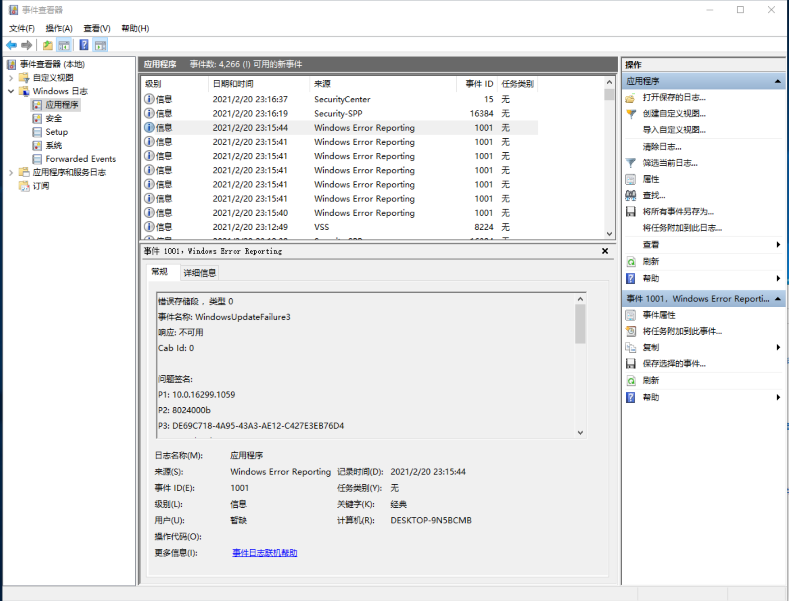  

图 20-1 Windows 事件日志显示应用程序因为未处理的异常而终止

然而，还可以通过“Windows 操作中心”来获取更有趣的细节。为了启动操作中心，请单击系统托盘中的小旗，选择“打开操作中心”。然后，请展开“维护”，单击“查看可靠性历史记录”链接。随后，会在底部的窗格看到应用程序由于未处理的异常而终止，如图 20-2 所示。

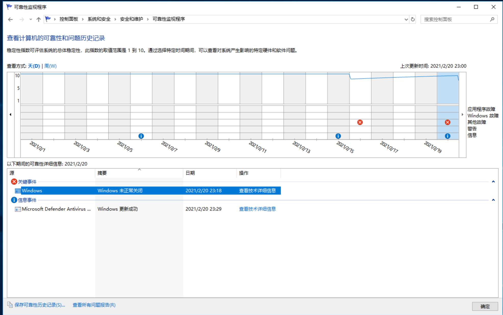  

图 20-2 “可靠性监视程序” 显示引用程序由于未处理的异常而终止

要查看已终止的应用程序的更多细节，请在“可靠性监视程序”中双击终止的应用程序。图 20-3 显示了这些细节，各个“问题签名”的含义在表 20-2 中进行了总结。托管应用程序生成的所有未处理的异常都放在 CLR20r3 这个存储段(bucket)中。

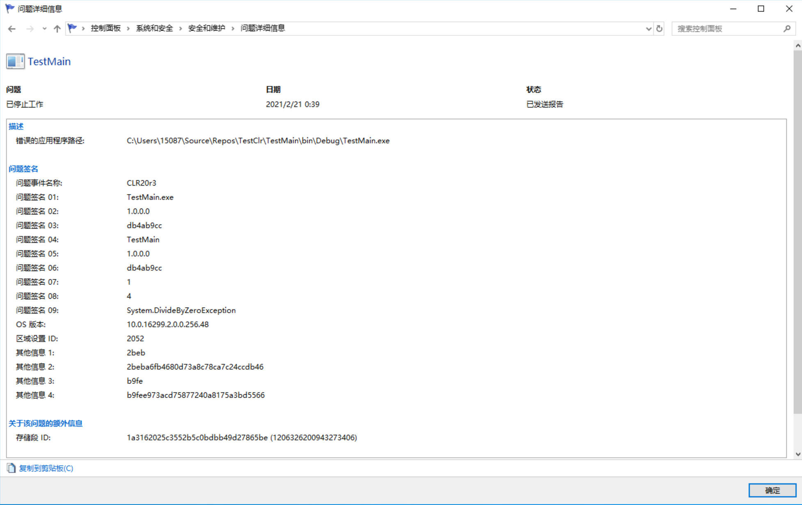  

图 20-3 “可靠性监视程序”显示了与出错应用程序有关的更多细节

表 20-2 问题签名

|问题签名|说明<sup>*</sup>|
|01|EXE 文件名(限32个字符)|
|02|EXE 文件的程序集版本号|
|03|EXE 文件的时间戳|
|04|EXE 文件的完整程序集名称(限 64 个字符)|
|05|出错的程序集的版本|
|06|出错的程序集的时间戳|
|07|出错的程序集的类型和方法。这个值是一个 MethodDef 元数据标记(剥离力 0x06 高位字符)，代表抛出异常的方法。有了这个值之后，就可以通过 ILDasm.exe 来确定的有问题的类型和方法|
|08|有问题的方法的 IL 指令。这个值是抛出异常的那个方法的 IL 指令中的一个偏移量。有了这个值之后，就可以通过 ILDasm.exe 来确定有问题的指令。|
|09|抛出的异常类型(限 32 个字符)|

> \* 如果一个字符串超过允许的限制，会执行一些巧妙的截断处理，比如会将“Exception”从异常类型名称中截去，或者将“.dll”从文件名中截去。如果结果字符串仍然太长，CLR 会对字符串进行哈希处理或者进行 base-64 编码来创建一个新值

记录好出错的应用程序有关的信息后，Windows 显示一个消息框，允许用户将与出错的应用程序有关的信息发送给 Microsoft 的服务器。<sup>①</sup>这称为“Windows 错误报告”(Windows Error Reporting)，详情请访问 Windows Quality 网站(*http://WinQual.Microsoft.com*)。

> ① 要想禁止显示这个消息框，可以通过 P/Invoke 来调用 Win32 函数 `SetErrorMode`，向函数传递 `SEM_NOGPFAULTERRORBOX`。

作为公司，可以向 Microsoft 注册查看与它们自己的应用程序和组件有关的信息。注册是免费的，但要求程序集用 VeriSign ID(也称为 Software Publisher Digital ID for Authenticode)进行签名。

当然也可以开发自己的系统，将未处理异常的信息传回给你自己，以便修正代码中的bug。应用程序初始化时，可告诉 CLR 当应用程序中的任何线程发生一个未处理的异常时，都调用一个方法。

遗憾的是，Microsoft 的每种应用程序模型都有自己的与未处理异常打交道的方式。需要在文档中查阅一下成员的信息。

* 对于任何应用程序，查阅 `System.AppDomain` 的 `UnhandledException` 事件。Windows Store 应用和 Microsoft Silverlight 应用程序访问不了该事件。

* 对于 Windows Store 应用，查阅 `Windows.UI.Xaml.Applocation` 的`UnhandledException`事件。

* 对于 Windows 窗体应用程序，查阅 `System.Windows.Forms.NativeWindow` 的 `OnThreadException` 虚方法、`System.Windows.Forms.Application`的`OnThreadException`虚方法以及`System.Windows.Forms.Application` 的 `ThreadException` 事件。

* 对于 `Windows Presentation Foundation(WPF)`应用程序，查阅 `System.Windows.Application` 的 `DispatcherUnhandledException` 事件和 `System.Windows.Threading.Dispatcher` 的 `UnhandledException` 和 `UnhandledExceptionFilter`事件。

* 对于 `Silverlight`，查询 `System.Windows.Application` 的 `UnhandledException` 事件。

* 对于 ASP.NET Web 窗体应用程序，查阅 `System.Web.UI.TemplateControl` 的 `Error` 事件。`TemplateControl` 是`System.Web.UI.Page` 类和 `System.Web.UI.UserControl` 类的基类。另外，还要查阅 `System.Web.HttpApplication` 的 `Error` 事件。

* 对于 Windows Communication Foundation 应用程序，查阅 `System.ServiceModel.Dispatcher.ChannelDispatcher` 的 `ErrorHandlers` 属性。

结束本节的讨论之前，最后讲一下分布式应用程序(例如 Web 站点或 Web 服务)中发生的未处理异常。理想情况下，服务器应用程序发生未处理异常，应该先把它记录到日志中，再向客户端发送通知，表明所请求的操作无法完成，最后终止服务器应用程序。遗憾的是，我们并非生活在理想世界中。因此，也许不可能向客户端发送失败通知。对于某些“有状态”的服务器(比如 Microsoft SQL Server)，终止服务器并重新启动服务器的新实例是不切实际的。

对于服务器应用程序，与未处理异常有关的信息不应返回客户端，因为客户端对这种信息基本上是束手无策的，尤其是假如客户端由不同的公司实现。另外，服务器应尽量少暴露自己的相关信息，减少自己被“黑”的机滤。

>注意 CLR 认为本机代码(native code)抛出的一些异常时损坏状态异常(corrupted state exceptions, CSE)异常，因为它们一般由 CLR 自身的 bug 造成，或者由托管开发人员无法控制的本机代码的 bug 造成。CLR 默认不让托管代码捕捉这些异常，`finally` 块也不会执行。以下本机 Win32 异常被认为是 CSE：

```C#
EXCEPTION_ACCESS_VIOLATION EXCEPTION_STACK_OVERFLOW
EXCEPTION_ILLEGAL_INSTRUCTION EXCEPTION_IN_PAGE_ERROR
EXCEPTION_INVALID_DISPOSITION EXCEPTION_NONCONTINUABLE_EXCEPTION
EXCEPTION_PRIV_INSTRUCTION STATUS_UNWIND_CONSOLIDATE.
```

> 但是，单独的托管方法可以覆盖默认设置来捕捉这些异常，这需要向方法应用`System.Runtime.ExceptionServices.HandleProcessCorruptedStateExceptionsAttribute`。方法还要应用 `System.Security.SecurityCriticalAttribute`。要覆盖整个进程的默认设置，可在应用程序的 XML 配置文件中将 `legacyCorruptedStateExceptionPolicy` 元素设为 `true`。CLR 将上述大多数异常都转换成一个 `System.Runtime.InteropServices.SEHException` 对象，但有两个异常例外：`EXCEPTION_ACCESS_VIOLATION` 被转换成 `System.AccessViolationException`对象，`EXCEPTION_STACK_OVERFLOW` 被转换成 `System.StackOverflowException`对象。

> 注意 调用方法前，可调用 `RuntimeHelper` 类的 `EnsureSufficientExecutionStack` 检查栈空间是否够用。该方法检查调用线程是否有足够的栈空间来执行一般性的方法(定义得比较随便的方法)。栈空间不够，方法会抛出一个`InsufficientExecutionStackException`，你可以捕捉这个异常。`EnsureSufficientExecutionStack` 方法不接受任何实参，返回值是 `void`。 递归方法特别要用好这个方法。

## <a name="20_10">20.10 对异常进行调试</a>

Visual Studio 调试器为异常提供了特殊支持。在当前已打开一个解决方案的前提下，请从“调试”菜单选择“异常”，随后会看到如图 20-4 所示的对话框。

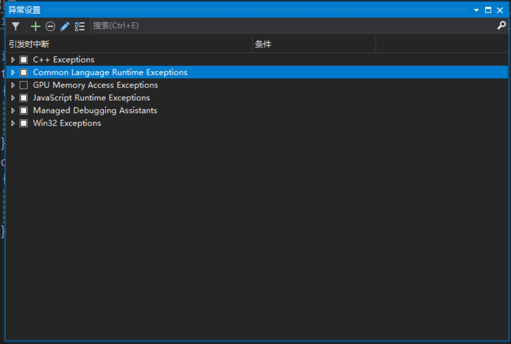   

图 20-4 “异常设置”对话框显示了不同种类的异常 

这个对话框显示了 Visual Studio 能识别的不同种类的异常。展开 Common Language Runtime Exceptions，会看到 Visual Studio 调试器能识别的命名空间集，如图 20-5 所示。

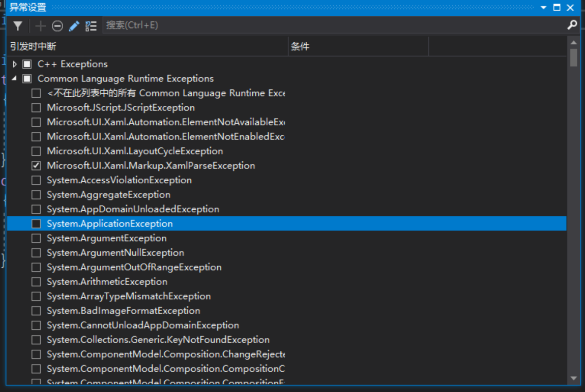  

图 20-5 按命名空间划分的各种 CLR 异常

展开一个命名空间，会看到在该命名空间中定义的所有 `System.Exception` 派生类型。例如，图 20-6 展示的是 `System` 命名空间中的CLR 异常。

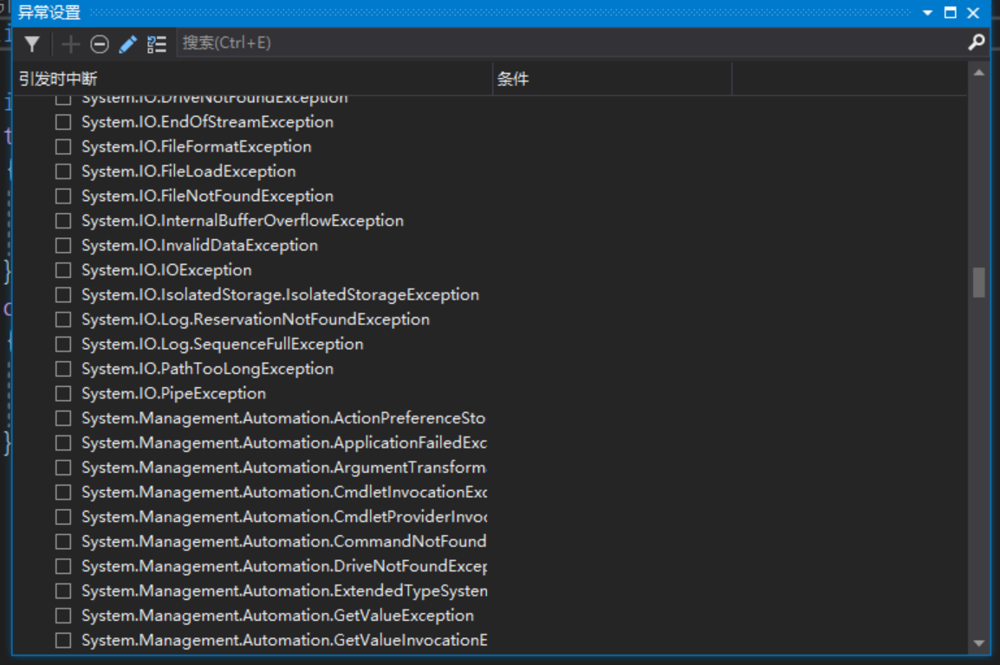  

图 20-6 “异常”对话框，显示`System` 命名空间中定义的 CLR 异常

对于任何异常类型，如果勾选了“引发”选项框，调试器就会在抛出该异常时中断。注意在中断时，CLR 还没有尝试去查找任何匹配的 `catch` 块。要对捕捉和处理一个异常的代码进行调试，这个功能相当有用。另外，如果怀疑一个组件或库“吞噬”了异常或者重新抛出了异常，但不确定在什么位置设置断点来捕捉它，这个功能也很有用。

如果异常类型的“引发”框没有勾选，调试器只有在该异常类型未得到处理时才中断。开发人员一般都保持“引发”选项框的未勾选状态，因为的到处理的异常表明应用程序已预见到了异常，并会对它进行处理；应用程序能继续正常运行。

如果定义了自己的异常类型，可单击“添加”把它们添加到这个对话框中。这会打开如图 20-7 所示的对话框。

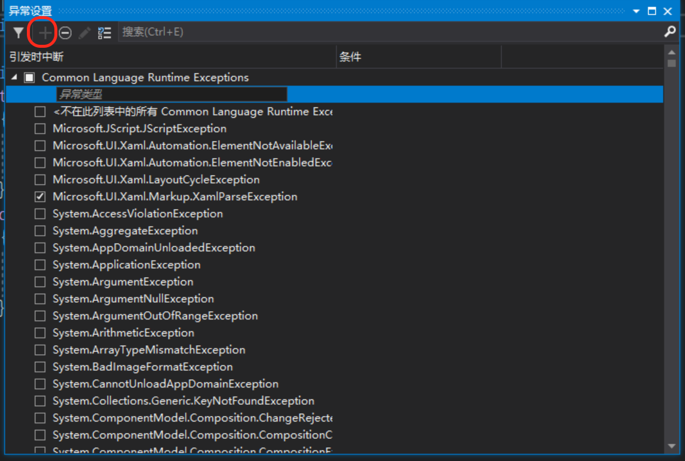  

图 20-7 让 Visual Studio 识别你自己的异常类型：“新异常”对话框

在这个对话框中，首先将异常类型设为 `Common Language Runtime Exceptions`，然后输入异常类型的完全限定名称。注意，输入的不一定是从`System.Exception` 派生的类型。非 CLS 相容的类型也是完全支持的。没有办法区分两个或多个同名但在不同程序集中的类型。幸亏这种情况很少发生。

如果你的程序集定义了几个异常类型，那么一次只能添加一个。希望在未来的版本中，这个对话框允许单击“浏览”按钮查找程序集，并自动将其中所有从`Exception` 派生的类型导入 Visual Studio 调试器。然后，每个类型都可以根据程序集来区分。这样就可以解决同名、不同程序集的两个类型不能共存的问题。

## <a name="20_11">20.11 异常处理的性能问题</a>

开发人员社区经常就异常处理的性能问题展开活跃讨论。有人说异常处理的性能是如此之坏，以至于他们根本就不打算使用。但是，我认为在面向对象平台中，异常处理不是一个可有可无的东西，而是必须的！另外，假若不用它，有什么是可以替代的呢？是让方法返回 `true/false` 来表示成功/失败，还是使用某种错误代码 `enum` 类型？真的这么做，两个世界<sup>①</sup>最坏的情况都会发生：CLR 和类库抛出异常而你的代码返回错误代码。现在你两者都要应付。

> ① 托管世界和非托管世界。 ————译注

异常处理和较常规的异常报告方式(`HRESULT` 和 特殊返回码等)相比，很难看出两者在性能上的差异。如果写代码检查每个方法调用的返回值并将返回值“漏”给调用者，应用程序性能将受到严重影响。就算不考虑性能，由于要写代码检查每个方法的返回值，也必须进行大量额外的编程，而且出错几率也会大增。异常处理的优选方案。

但异常处理也是有代价的：非托管 C++ 编译器必须生成代码来跟踪哪些对象被成功构造。编译器还必须生成代码，以便在一个异常被捕捉到的时候，调用每个已成功构造的对象的析构器。由编译器担负这个责任是很好的，但会在应用程序中生成大量薄记(bookkeeping)代码，对代码的大小和执行时间造成负面影响。

另一方面，托管编译器就要轻松得多，因为托管对象在托管堆中分配，而托乱堆受垃圾回收器的监视。如对象成功构造，而且抛出了异常，垃圾回收器最终会释放对象的内存。编译器无需生成任何薄记代码来跟踪成功构造的对象，也无需保证析构器的调用。与非托管C++相比，这意味着编译器生成的代码更少，运行时要执行的代码更少，应用程序的性能更好。

多年来，我在不同的编程语言、不同的操作系统和不同的 CPU 架构中进行过异常处理。每种情况下的异常处理都以不同方式实现，而且在性能方面各有优缺点。一些实现将异常处理构造直接编译到一个方法中。一些实现将与异常处理相关的信息存储到一个与方法关联的数据表中————只有抛出异常时才去访问这个表。一些编译器不能内联含有异常处理程序<sup>①</sup>的方法，另一些编译器在方法含有异常处理程序的时候无法用寄存器来容纳变量。

> ① 本书按照约定俗成的译法，将 exception handler 翻译成“异常处理程序”，但在这里请把它理解成“用于异常处理的构造”。————译注

总之，不好判断异常处理到底会使应用程序增大多少额外的开销。在托管世界里更不好说，因为程序集的代码子在支持 .NET Framework 的任何平台上都能运行。所以，当程序集在 x86 处理器上运行时，JIT 编译器生成的用于管理异常处理的代码也会显著有别于程序集在 x64 或 ARM 处理器上运行时生成的代码。另外，与其他 CLR 实现(比如 Microsoft 的 .NET Compact Framework 或者开源 Mono 项目)关联的 JIT 编译器也有可能生成不同的代码。

实际上，我用 Microsoft 内部使用的几个 JIT 编译器对自己的代码进行过一些测试，它们在性能上的差异大得令人吃惊。所以，必须在各种目标平台上测试代码，并相应进行调整。再次声明，我不在意异常处理所造成的额外性能开销，因为它带来的收益远大于对性能的影响。

如果希望了解异常处理对代码性能的影响，可使用 Windows 自带的 “性能监视器”。图 20-8 展示了随同 .NET Framework 安装的与异常有关的计数器。

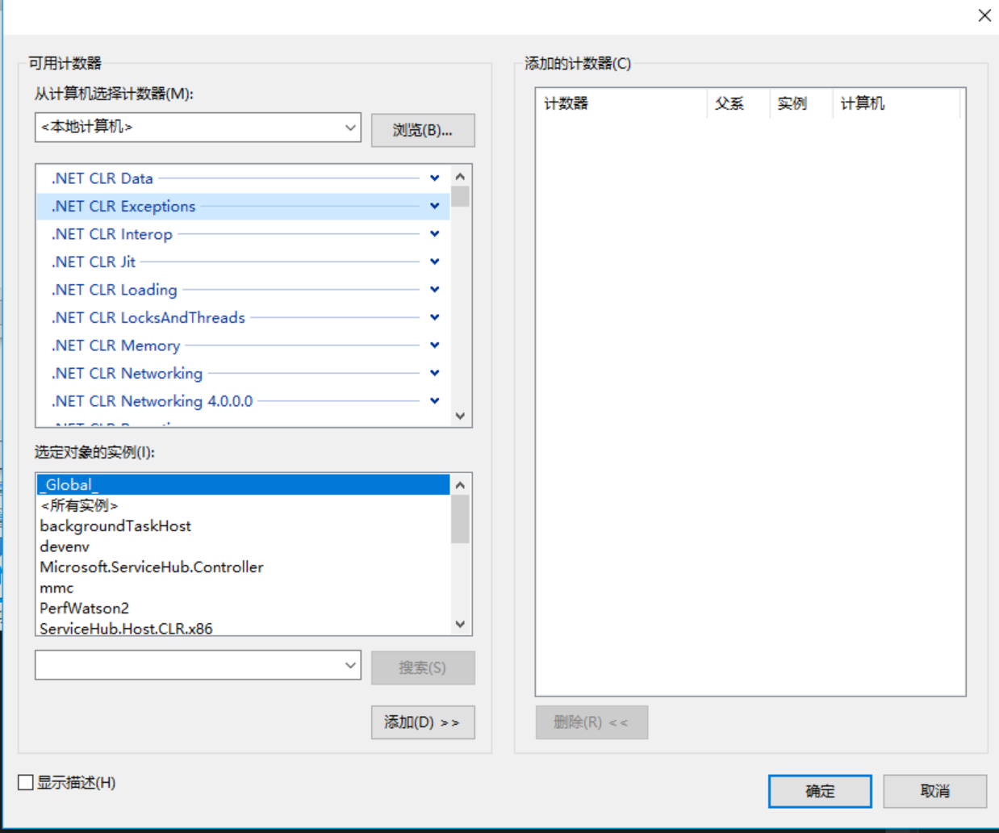  

图 20-8  性能监视器显示了 .NET CLR Exceptions 计数器

个别时候会遇到一个频繁调用但频频失败的方法。这时抛出异常所造成的性能损失可能令人无法接受。例如，Microsoft 从一些客户那里了解到，在调用 `Int32` 的 `Parse` 方法时，最终用户经常输入无法解析的数据。由于频繁调用 `Parse` 方法，抛出和捕捉异常所造成的性能损失对应用程序的总体性能造成了很大影响。

为了解决客户反映的问题，并与本章描述的设计规范保持一致，Microsoft 为 `Int32` 类添加了新方法 `TryParse`，它有两个重载版本：

```C#
public static Boolean TryParse(String s, out Int32 result);
public static Boolean TryParse(String s, NumberStyles style, IFormatProvider provider, out Int32 result);
```

注意，这些方法都返回一个 `Boolean`，指明传给方法的 `String` 是否包含了解解析成 `Int32` 的字符。它们同时返回一个名为`result`的输出参数。如果方法返回 `true`，`result` 将包含字符串解析成 32 为整数的结果。返回 `false`，`result`将包含 `0`，这时自然不应再执行任何代码去检查`result`。

有一点必须澄清：`TryXxx` 方法的 `Boolean` 返回值如果为 `false`，那么代表的只是一种错误。方法仍要为其他错误抛出异常。例如，如果为`style`参数传递的实参无效，`Int32` 的 `TryParse` 方法会抛出一个 `ArgumentException` 异常。另外，调用 `TryParse` 方法时仍有可能抛出一个 `OutMemoryException` 异常。

另外要澄清的是，面向对象编程提高了程序员的编程效率。为此，它采取的一个措施是不在类型的成员中暴露错误代码。换言之，构造器、方法、属性等采用了“调用它们不会失败”这一思路。而且，如果正确定义，成员的大多数使用都不会失败。而且由于不抛出异常，所以也没有性能上的损失。

定义类型的成员时，应确保在一般使用情形中不会失败。只有用户以后因为抛出异常面对性能不满意时，才应考虑添加一些 `TryXXX` 方法。换言之，首先应建立一个最佳的对象模型。然后，只有在用户抱怨的时候，才在类型中添加一些 `TryXXX` 方法，帮助遭遇性能问题的用户改善性能。如果用户没有遇到性能问题，那么应继续使用方法的非 `TryXXX` 版本，因为那是更佳的对象模型。

## <a name="20_12">20.12 约束执行区域(CER)</a>

许多应用程序都不需要健壮到能从任何错误中恢复的地步。许多客户端应用程序都是这样设计的，比如 Notepad.exe(记事本) 和 Calc.exe(计算器)。另外，我们中的许多人都经历过 Microsoft Office 应用程序(比如 WinWord.exe，Excel.exe 和 Outlook.exe)因为未处理的异常而终止的情况。此外，许多服务器端应用程序(比如 Web 服务器)都是无状态的，会在因为未处理的异常而失败时自动重启。当然，某些服务器(比如 SQL Server)本来就是为状态管理而设计的。这种程序假如因为未处理的异常而发生数据丢失，后果将是灾难性的。

在 CLR 中，我们有包含了状态的 AppDomain(将在第 22 章讨论)。AppDomain 卸载时，它的所有状态都会卸载。所以，如果 AppDomain 中的一个线程遭遇未处理的异常，可以在不终止整个进程的情况下卸载 AppDomain(会销毁它的所有状态)<sup>①</sup>。

> ① 如果线程的整个生命期都在一个 AppDomain 的内部(比如 ASP.NET 和托管 SQL Server 存储过程)，这个说法是完全成立的。但如果线程在其生存期内跨越了 AppDomain 边界，可能就不得不终止整个进程了。

根据定义，CER 是必须对错误有适应力的代码块。由于 AppDomain 可能被卸载，造成它的状态被销毁，所以一般用 CER 处理由多个 AppDomain 或进程共享的状态。如果要在抛出了非预期的异常时维护状态，CER 就非常有用。有时候这些异常称**异步异常**。例如，调用方法时，CLR 必须加载一个程序集，在 AppDomain 的 Loader 堆中创建类型对象，调用类型的静态构造器，并将 IL 代码 JIT 编译成本机代码。所有这些操作都可能失败，CLR 通过抛出异常来报告失败。

如果任何这些操作在一个 `catch` 或 `finally` 块中失败，你的错误恢复或资源清理代码就不会完整地执行。下例演示了可能出现的问题：

```C#
private static void Demo1() {
    try {
        Console.WriteLine("In try");
    }
    finally {
        // 隐式调用 Type1 的静态构造器
        Type1.M();
    }
}

private sealed class Type1 {
    static Type1() {
        // 如果这里抛出异常，M 就得不到调用
        Console.WriteLine("Type1's static ctor called");
    }

    public static void M() { }
}
```

运行上述代码得到以下输出：

```cmd
In try
Type1's static ctor called
```

我们想要达到的目的是，除非保证(或大致保证)<sup>①</sup>关联的 `catch` 和 `finally` 块中的代码得到执行，否则上述`try`块中的代码根本不要开始执行。为了达到这个目的，可以像下面这样修改代码：

> ① “保证” 和 “大致保证” 分别对应后文所说的 `WillNotCorruptState` 和 `MayCorruptInstance` 两个枚举成员。 ———— 译注

```C#
public static void Demo2() {
    // 强迫 finally 块中的代码提前准备好
    RuntimeHelpers.PrepareConstrainedRegions();    // System.Runtime.CompilerServices 命名空间
    try {
        Console.WriteLine("In try");
    }
    finally {
        // 隐式调用 Type2 的静态构造器
        Type2.M();
    }
}

public class Type2 {
    static Type2() {
        Console.WriteLine("Type2's static ctor called");
    }

    // 应用在 System.Runtime.ConstrainedExecution 命名空间中定义的这个特性
    [ReliabilityContract(Consistency.WillNotCorruptState, Cer.Success]
    public static void M() { }
}
```

运行这个版本得到以下输入：


```cmd
Type2's static ctor called
In try
```

`PrepareConstrainedRegions` 是一个很特别的方法。JIT 编译器如果发现在一个 `try` 块之前调用了这个方法，就会提前编译与`try` 关联的`catch`和`finally`块中的代码。JIT 编译器会加载任何程序集，创建任何类型对象，调用任何静态构造器，并对任何方法进行 JIT 编译。如果其中任何操作做成异常，这个异常会在线程进入 `try` 块**之前**发生。

JIT 编译器提前准备方法时，还会遍历整个调用图，提前准备被调用的方法，前提是这些方法应用了 `ReliabilityContractAttribute`，而且向这个特性实例的构造器传递的是`Consistency.WillNotCorruptState` 或者 `Consistency.MayCorruptInstance` 枚举成员。这是由于假如方法会损坏 AppDomain 或进程的状态，CLR 便无法对状态一致性做出任何保证。在通过一个 `PrepareConstrainedRegions` 调用来保护的一个 `catch` 或`finally` 块中，请确保只调用根据刚才的描述设置了 `ReliabilityContractAttribute` 的方法。

`ReliabilityContractAttribute`是像下面这样定义的：

```C#
public sealed class ReliabilityContractAttribute : Attribute {
    public ReliabilityContractAttribute(Consistency consistencyGuarantee, Cer cer);
    public Cer Cer { get; }
    public Consistency ConsistencyGuarantee { get; }
}
```

该特性允许开发者向方法<sup>①</sup>的潜在调用者申明方法的可靠性协定(reliability contract)。`Cer` 和 `Consistency` 都是枚举类型，它们的定义如下：

> ① 也可将这个特性应用于接口、构造器、结构、类或者程序集，从而影响其中的成员。

```C#
enum Consistency {
    MayCorruptProcess, MayCorruptAppDomain, MayCorruptInstance, WillNotCorruptState
}

enum Cer { None, MayFail, Success }
```

如果你写的方法保证不损坏任何状态，就用 `Consistency.WillNotCorruptState`，否则就用其他三个值之一来申明方法可能损坏哪一种状态。如果方法保证不会失败，就用 `Cer.Success`，否则用 `Cer.MayFail`。没有应用 `ReliabilityContractAttribute` 的任何方法等价于像下面这样标记：

`[ReliabilityContract(Consistency.MayCorruptProcess, Cer.None]`

`Cer.None` 这个值表明方法不进行 CER 保证。换言之，方法没有 CER 的概念。因此，这个方法可能失败，而且可能会、也可能不会报告失败。记住，大多数这些设置都为方法提供了一种方式来申明它向潜在的调用者提供的东西，使调用者知道什么可以期待。CLR 和 JIT 编译器不使用这种信息。

如果想写一个可靠的方法，务必保持它的短小精悍，同时约束它做的事情。要保证它不分配任何对象(例如不装箱)。另外，不调用任何虚方法或接口方法，不使用任何委托，也不使用反射，因为 JIT 编译器不知道实际会调用哪个方法。然而，可以调用 `RuntimeHelper`类定义方法之一，从而手动准备这些方法：

```C#
public static void PrepareMethod(RuntimeMethodHandle method);
public static void PrepareMethod(RuntimeMethodHandle method, RuntimeTypeHandle[] instantiation);
public static void PrepareDelegate(Delegate d);
public static void PrepareContractedDelegate(Delegate d);
```

注意，编译器和 CLR 并不验证你写的方法真的符合通过 `ReliabilityContractAttribute` 来作出的保证。所以，如果犯了错误，状态仍有可能损坏。

> 注意 即使所有方法都提前准备好，方法调用仍有可能造成 `StackOverflowException`。在 CLR 没有寄宿的前提下，`StackOverflowException`会造成 CLR 在内部调用 `Environment.FailFast` 来立即终止进程。在已经寄宿的前提下，`PrepareConstrainedRegions` 方法检查是否剩下约 48 KB的栈空间。栈空间不足，就在进入`try` 块前抛出 `StackOverflowException`。

还应该关注一下 `RuntimeHelper` 的 `ExecuteCodeWithGuaranteedCleanup` 方法，它的资源保证得到清理的前提下才执行代码：

```C#
public static void ExecuteCodeWithGuaranteedCleanup(TryCode code, CleanupCode backoutCode, Object userData);
```

调用这个方法时，要将 `try` 块和 `finally` 块的主体作为回调方法传递，它们的原型分别匹配以下两个委托：

```C#
public delegate void TryCode(Object userData);
public delegate void CleanupCode(Object userData, Boolean exceptionThrown);
```

最后，另一种保证代码得以执行的方式是使用 `CriticalFinalizerObject` 类，该类将在第 21 章"托管堆和垃圾回收"详细解释。

## <a name="20_13">20.13 代码协定</a>

**代码协定**(code contract)提供了直线在代码中声明代码设计决策的一种方式。这些协定采取以下形式。

* **前条件**  
  一般用于对实参进行验证

* **后条件**  
  方法因为一次普通的返回或者抛出异常而终止时，对状态进行验证。

* **对象不变性(Object Invariant)**  
  在对象的整个生命期内，确保对象的字段的良好状态。

代码协定有利于代码的使用、理解、进化、测试、文档和早期错误检测<sup>①</sup>。可将前条件、后条件和对象不变性想象为方法签名的一部分。所以，代码新版本的协定可以变得更宽松。但不能变得更严格，否则会破坏向后兼容性。

> ① 为了帮助进行自动化测试，请参见由 Microsoft Research 创建的 Pex 工具，网址是 *http://research.microsoft.com/en-us/projects/pex/*。

代码协定的核心是静态类 `System.Diagnostics.Contracts.Contract` :

```C#
public static class Contract {
    // 后条件方法：[Conditional("CONTRACTS_FULL")]
	public static void Requires(Boolean condition);
    public static void EndContractBlock();

    // 前条件：Always
    public static void Requires<TException>(Boolean condition) where TException : Exception;

    // 后条件方法：[Conditional("CONTRACTS_FULL")]
    public static void Ensures(Boolean condition);
    public static void EnsuresOnThrow<TException>(Boolean condition) where TException : Exception;

    // 特殊后条件方法：Always
    public static T Result<T>();
    public static T OldValue<T>(T value);
    public static T ValueAtReturn<T>(out T value);

    // 对象不变性方法： [Conditional("CONTRACTS_FULL")]
    public static void Invariant(Boolean condition);

    // 限定符(Quantifier)方法：Always
    public static Boolean Exists<T>(IEnumerable<T> collection, Predicate<T> predicate);
    public static Boolean Exists(Int32 fromInclusive, Int32 toExclusive, Predicate<Int32> predicate);
    public static Boolean ForAll<T>(IEnumerable<T> collection, Predicate<T> predicate);
    public static Boolean ForAll(Int32 fromInclusive, Int32 toExclusive, Predicate<Int32> predicate);
    // 辅助(Helper)方法：[Conditional("CONTRACTS_FULL")] 或 [Conditional("DEBUG")]
    public static void Assert(Boolean condition);
    public static void Assume(Boolean condition);

    // 基础结构(Infrastructure)事件：你的代码一般不使用这个事件
    public static event EventHandler<ContractFailedEventArgs> ContractFailed;
}
```

如前所示，许多静态方法都应用了`[Conditional("CONTRACTS_FULL")]`特性。有的辅助方法还应用了`[Conditional("DEBUG")]`，意味着除非定义了恰当的符号，否则编译器会忽略调用这些方法的任何代码。标记“Always”的任何方法意味着编译器总是生成调用方法的代码。另外，`Requires`，`Requires<TException>`，`Ensures`，`EnsuresOnThrow`，`Invariant`，`Assert` 和 `Assume` 方法有一个额外的重载版本(这里没有列出)，它获取一个 `String` 实参，用于显式指定违反协定时显示的字符串消息。

协定默认只作为文档使用，因为生成项目时没有定义 `CONTRACTS_FULL` 符号。为了发掘协定的附加价值，必须下载额外的工具和一个 Visual Studio 属性窗格，网址是 `http://msdn.microsoft.com/en-us/devlabs/dd491992.aspx`。Visual Studio之所以不包含所有代码协定工具，是因为该技术和增强的速度比 Visual Studio 本身快得多。下载和安装好额外的工具之后，会看到项目有一个新的属性窗格，如图 20-9 所示。

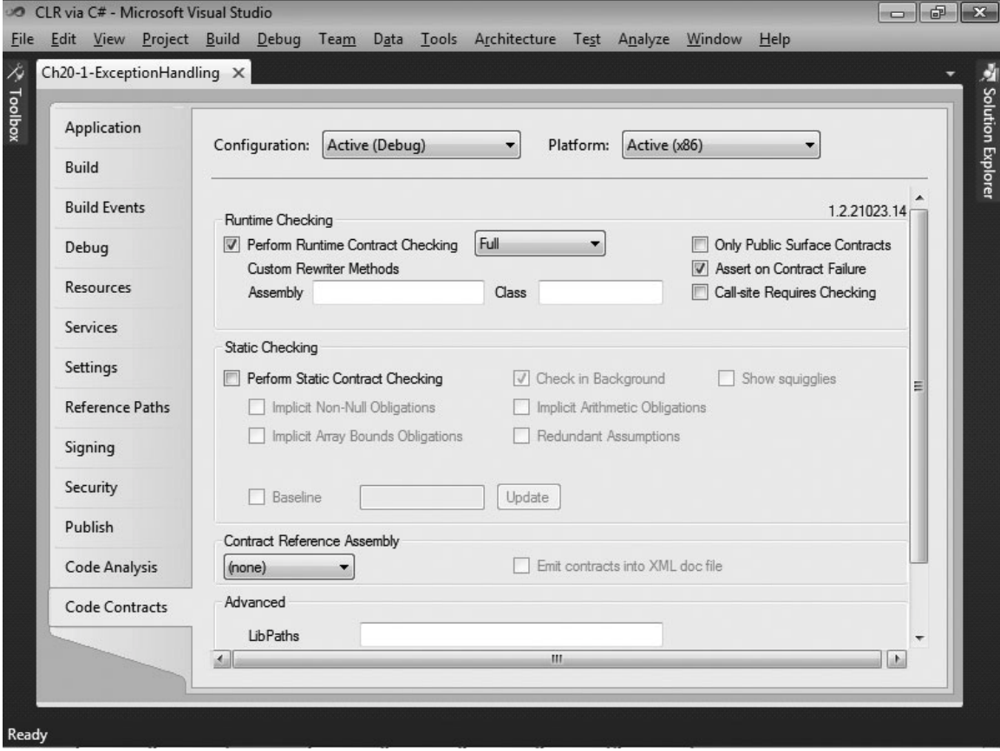  
图 20-9 一个 Visual Studio 项目的 Code Contracts 窗格  

启用代码协定功能要勾选 Perform Runtime Contract Checking，并从旁边的组合框中选择 Full。这样就会在生成项目时定义 `CONTRACTS_FULL` 符号，并在项目生成之后调用恰当的工具(稍后详述)。然后，运行时违反协定会引发`Contract`的`ContractFailed`事件。一般情况下，开发人员不向这个事件登记任何方法。但如果登记了方法，你登记的任何方法都会接收到一个 `ContractFailedEventArgs` 对象，它看起来像下面这样：

```C#
public sealed class ContractFailedEventArgs : EventArgs {
    public ContractFailedEventArgs(ContractFailureKind failureKind, String message, String condition, Exception originalException);

    public ContractFailureKind FailureKind { get; }
    public String Message                  { get; }
    public String Condition                { get; }
    public Exception OriginalException     { get; }

    public Boolean Handle { get; }  // 任何事件处理方法调用了 SetHandled，就为 true
    public void SetHandled();       // 调用该方法来忽略违反协定的情况；将 Handled 设为 true

    public Boolean Unwind { get; }  // 任何事件处理方法调用了 SetUnwind 或抛出异常，就为 true
    public void SetUnwind();        // 调用该方法强制抛出 ContractException; 将 Unwind 设为 true
}
```

可向该事件注册多个事件处理方法。每个方法都可以按照它选择的任何方式处理违反协定的情况。例如，方法可以记录协定违反，可以忽略协定违反(通过调用`SetHandled`)，也可以终止进程。任何方法如果调用了 `SetHandled`，违反协定的情况就会被认为已得到处理，而且在所有处理方法返回之后，允许应用程序代码继续运行————除非任何处理方法调用了 `SetUnwind`。如果一个处理方法调用了 `SetUnwind`， 在所有处理方法结束运行后，会抛出一个`System.Diagnostics.Contracts.ContractException`。注意，这是 MSCorLib.dll 的内部类型，所以你不能写一个 `catch` 块来显式捕捉它。还要注意，如果任何处理方法抛出未处理的异常，那么剩余的处理方法会被调用，然后抛出一个 `ContractException`。

如果没有事件处理方法，或者没有任何事件处理方法调用了 `SetHandled`，`SetUnwind` 或者抛出未处理的异常，那么违反协定会采用默认方式进行处理。如果 CLR 已寄宿，会向宿主通知协定失败。如果 CLR 正在非交互式窗口站上运行应用程序(服务应用程序就属于这种情况)，会调用 `Environment.FailFast` 来立即终止进程。如果编译时勾选了 Assert On Contract 序。如果没有勾选这个选项，就抛出一个 `ContractException`。

下面是一个使用了代码协定的示例类：

```C#
public sealed class Item { /* ... */ }

public sealed class ShoppingCart {
    private List<Item> m_cart = new List<Item>();
    private Decimal m_totalCost = 0;

    public ShoppingCart(){
    }

    public void AddItem(Item item) {
        AddItemHelper(m_cart, item, ref m_totalCost);
    }

    private static void AddItemHelper(List<Item> m_cart, Item newItem, ref Decimal totalCost) {

        // 前条件：
        Contract.Requires(newItem != null);
        Contract.Requires(Contract.ForAll(m_cart, s => s != newItem));

        // 后条件：
        Contract.Ensures(Contract.Exists(m_cart, s => s == newItem));
        Contract.Ensures(totalCost >= Contract.OldValue(totalCost));
        Contract.EnsuresOnThrow<IOException>(totalCost == Contract.OldValue(totalCost));

        // 做一些事情(可能抛出 IOException)...
        m_cart.Add(newItem);
        totalCost += 1.00M;
    }

    // 对象不变性
    [ContractInvariantMethod]
    private void ObjectInvariant() {
        Contract.Invariant(m_totalCost >= 0);
    }
}
```

`AddItemHelper`方法定义了一系列代码协定。其中，前条件指出`newItem`不能为`null`，而且要添加到购物车的商品不能已经在购物车中。后条件指出新商品必须在购物车中，而且总价格至少要与将商品添加到购物车之前一样多。还有一个后条件指出如果 `AddItemHelper` 因为某个原因抛出`IOException`，那么`totalCost` 不会发生变化，和方法开始执行时一样。`ObjectInvariant`方法只有一个私有方法；一旦调用，它会确保对象的`m_totalCost`字段永远不包含负值。

> 重要提示 前条件、后条件或不变性测试中引用的任何成员都一定不能有副作用(改变对象的状态)。这是必须的，因为测试条件不应改变对象本身的状态。除此之外，前条件测试中引用的所有成员的可访问性都至少要和定义前条件的方法一样。这是必须的，因为方法的调用者应该能在调用方法之前验证它们符合所有前条件。另一方面，后条件或不变性测试中引用的成员可具有任何可访问性，只要代码能编译就行。可访问性之所以不重要，是因为后条件和不变性测试不影响调用者正确调用方法的能力。

> 重要提示 涉及继承时，派生类型不能重写并更改基类型中定义的虚成员的前条件。类似地，实现了接口成员的类型不能更改接口成员定义的前条件。如果一个成员没有定义显式的协定，那么成员将获得一个隐式协定，逻辑上这样表示：

`Contract.Requires(true);`

> 由于协定不能在新版本中变得更严格(否则会破坏兼容性)，所以在引入新的虚/抽象/接口成员时，应仔细考虑好前条件。对于后条件和对象不变性，协定可以随意添加和删除，因为虚/抽象/接口成员中表示的条件和重写成员中表示的条件会“逻辑 AND”到一起。

现在，我们已掌握了如何声明协定。接着研究一下它们在运行时是如何工作的。要在方法的顶部声明所有前条件和后条件协定，这样才容易发现。当然，前条件协定是在方法调用时验证的。但是，我们希望后条件协定在方法返回时才验证。为了获得所需的行为，C#编译器生成的程序集必须用 Code Contract Rewriter 工具进行处理，该工具的路径一般是 `C:\Program Files(x86)\Microsoft\Contracts\Bin`，它生成程序集的一个修改版本。为自己的项目勾选 Perform Runtime Contract Checking 之后，Visual Studio 会在生成项目时自动调用这个工具。工具分析所有方法中的 IL，并重写这些 IL，使任何后条件协定都在每个方法的末尾执行。如果方法内部有多个返回点， CCRewrite.exe 工具会修改方法的 IL， 使所有返回点都在方法返回前执行后条件代码。

CCRewrite.exe 工具会在类型中查找标记了 `[ContractInvariantMethod]`特性的任何方法。这个方法可以取任何名字，但根据约定，一般将方法命名为`ObjectInvariant`，并将方法标记为 `private`(就像前面我所做的那样)。方法不接受任何实参，返回类型是 `void`。CCRewrite.exe 一旦看到标记了这个特性的 `ObjectInvariant` 方法(或者你取的其他名字)，就会在每个公共实例方法的末尾插入调用 `ObjectInvariant` 方法的 IL 代码。这样一来，方法每次返回，都会检查对象的状态，确保方法没有违反协定。注意，CCRewrite.exe 不会修改 `Finalize` 方法或者`IDisposable`的`Dispose`方法来调用 `ObjectInvariant` 方法。因为既然已决定要摧毁(destroy)或处置(dispose)，对象的状态自然是可以改变的。还要注意，一个类型可以定义多个应用了`[ContractInvariantMethod]`特性的方法。使用分部类型时，这样做就很有用。 CCRewrite.exe 修改 IL，在每个公共方法末尾调用所有这些方法(顺序不定)。

`Assert` 和 `Assume` 方法比较特殊。首先，不应把它们视为方法签名的一部分，也不必把它们放在方法的起始处。在运行时，这两个方法执行完全一样的操作：验证传给它们的条件是否为`true`；不为 `true`就抛出异常。但还可使用另一个名为 Code Contract Checker(CCCheck.exe)的工具。该工具能分析 C# 编译器生成的 IL，静态验证方法中没有代码违反协定。该工具会尝试证明传给`Assert`的任何条件都为 `true`，但假设传给 `Assume` 的任何条件都已经为 `true`，而且工具会将表达式添加到它的已知为 `true` 的事实列表中。一般要先用 `Assert`，然后在 CCCheck.exe 不能静态证明表达式为 `true` 的前提下将 `Assert` 更改为 `Assume`。

来看一个例子。假定有以下类型定义：

```C#
internal sealed class SomeType {
    private static String s_name = "Jeffrey";

    public static void ShowFirstLetter() {
        Console.WriteLine(s_name[0]);           // 警告： requires unproven： index < this.Length
    }
}
```

在项目属性页面中勾选 Perform Static Contract Checking 再生成上述代码， CCCheck.exe 工具会生成如注释所示的警告。该警告指出查询 `s_name` 的第一个字母可能失败并抛出异常，因为无法证明 `s_name` 总是引用至少包含一个字符的字符串。

所以，我们要做的是为 `ShowFirstLetter` 方法添加一个断言：

```C#
public static void ShowFirstLetter() {
    Contract.Assert(s_name.Length >= 1);    // warning: assert unproven
    Console.WriteLine(s_name[0]);
}
```

遗憾的是，当 CCCheck.exe 工具分析上述代码时，仍然无法验证 `s_name` 总是引用包含至少一个字母的字符串。所以，工具会生成类似的警告。有时，会由于工具的限制造成无法验证断言；工具未来的版本也许能执行更全面的分析。

为了避开工具的短处，或者声明工具永远证明不了的一件事情成立，可将 `Assert` 更改为 `Assume`。如果知道没有其他代码会修改 `s_name`，就可以这样修改 `ShowFirstLetter`:

```C#
public static void ShowFirstLetter() {
    Contract.Assume(s_name.Length >= 1);            // 这样就没有警告了！
    Console.WriteLine(s_name[0]);
}
```

针对代码的这个新版本，CCCheck.exe 工具会相信我们的“假设”，断定 `s_name` 总是引用至少含有一个字母的字符串。这个版本的 `ShowFirstLetter` 方法会顺利通过代码协定静态检查器(CCCheck.exe)的检查，不显示任何警告。

再来讨论一下 Code Contract Reference Assembly Generator 工具(CCRefGen.exe)。像前面描述的那样使用 CCRewrite.exe 工具来启用协定检查，确实有助于更快地发现 bug。但是，协定检查期间生成的所有代码会使程序集变得更大，并有损它的运行时性能。为了对这一点进行改进，可以使用 CCRefGen.exe 工具来创建独立的、包含协定的一个引用程序集。在 Contract Reference Assembly 组合框中选中选择 Build， Visual Studio 会自动帮你调用这个工具。协定程序集的名字一般是 AssemblyName.Contracts.dll(例如 MSCorLib.Contracts.dll)，而且这些程序集只包含对协定进行的描述的元数据和IL ———— 别的什么都没有。协定引用程序集的特点是向程序集的定义元数据表应用了 `System.Diagnostics.Contracts.ContractReferenceAssembly.Attribute`。CCRewrite.exe 和 CCCheck.exe 工具在执行操作和分析的时候，可将协定引用程序集作为输入。

最后一个工具是 Code Contract Document Generator(CCDocGen.exe)，使用 C#编译器的`/doc:file` 开关生成 XML 文档后，可利用该工具在文档中添加协定信息。经 CCDocGen.exe 增强的 XML 文档可由 Microsoft 的 Sandcastle 工具进行处理，以生成 MSDN 风格的、含有协定信息的文档。
