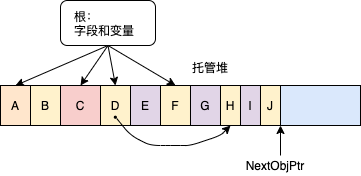
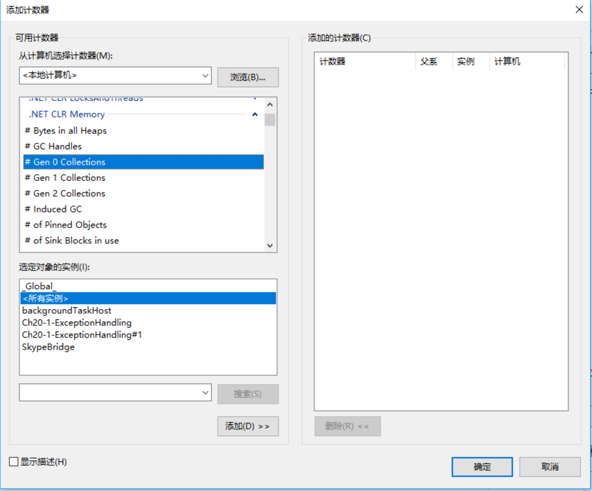
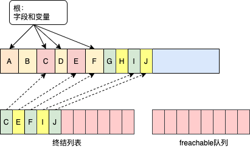
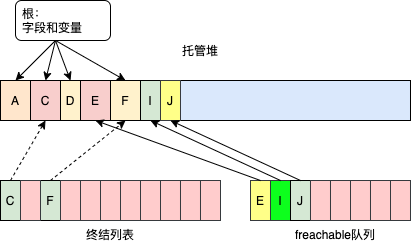
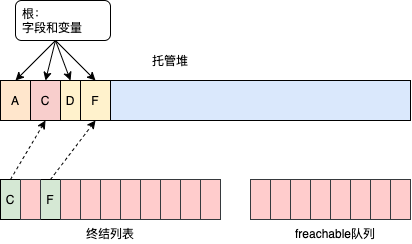

# 第 21 章 托管堆和垃圾回收

本章内容

* <a href="#21_1">托管堆基础</a>
* <a href="#21_2">代：提升性能</a>
* <a href="#21_3">使用需要特殊清理的类型</a>
* <a href="#21_4">手动监视和控制对象生存期</a>

本章要讨论托管应用程序如何构造新对象，托管堆如何控制这些对象的生存期，以及如何回收这些对象的内存。简单地说，本章要解释 CLR 中的垃圾回收器是如何工作的，还要解释相关的性能问题。另外，本章讨论了如何设计应用程序来最有效地使用内存。

## <a name="21_1">21.1 托管堆基础</a>

每个程序都要使用这样或那样的资源，包括文件、内存缓冲区、屏幕空间、网络连接、数据库资源等。事实上，在面向对象的环境中，每个类型都代表可供程序使用的一种资源。要使用这些资源，必须为代表资源的类型分配内存。以下是访问一个资源所需的步骤。

1. 调用 IL 执行 newobj，为代表资源的类型分配内存(一般使用 C# `new` 操作符来完成)。

2. 初始化内存，设置资源的初始状态并使资源可用。类型的实例构造器负责设置初始状态。

3. 访问类型的成员来使用资源(有必要可以重复)。

4. 摧毁资源的状态以进行清理。

5. 释放内存。垃圾回收器独自负责这一步。

如果需要程序员手动管理内存(例如，原生 C++ 开发人员就是这样的)，这个看似简单的模式就会成为导致大量编程错误的“元凶”之一。想想看，有多少次程序员忘记释放不再需要的内存而造成内存泄漏？又有多少次视图使用已经释放的内存，然后由于内存被破坏而造成程序错误和安全漏洞？而且，这两种bug比其他大多数 bug 都要严重，因为一般无法预测他们的后果或发生的时间<sup>①</sup>。如果是其他bug， 一旦发现程序行为异常，改正出问题的代码行就可以了。

> ① 例如，访问越界的bug 可能取回不相干的数据，使程序结果变得不正确。而且错误没有规律，让人捉摸不定。 ————译注

现在，只要写的是可验证的、类型安全的代码(不要用 C# `unsafe` 关键字)，应用程序就不可能会出现内存被破坏的情况。内存仍有可能泄露，但不像以前那样是默认行为。现在内存泄漏一般是因为在集合中存储了对象，但不需要对象的时候一直不去删除

为了进一步简化编程，开发人员经常使用的大多数类型都不需要步骤 4 (摧毁资源的状态以进行清理)。所以，托管堆除了能避免前面提到的 bug，还能为开发人员提供一个简化的编程模型；分配并初始化资源并直接使用。大多数类型都无需资源清理，垃圾回收器会自动释放内存。

使用需要特殊清理的类型时，编程模型还是像刚才描述的那样简单。只是有时需要尽快清理资源，而不是非要等着 GC <sup>①</sup>介入。可在这些类中调用一个额外的方法(称为 `Dispose`)，按照自己的节奏清理资源。另一方面，实现这样的类需要考虑到较多的问题(21.4 节会详细讨论)。一般只有包装了本机资源(文件、套接字和数据库连接等)的类型才需要特殊清理。

> ① 垃圾回收、垃圾回收器都可以简称为 GC。 ———— 译注

### 21.1.1 从托管堆分配资源

CLR 要求所有对象都从**托管堆**分配。进程初始化时，CLR 划出一个地址空间区域作为托管堆。CLR 还要维护一个指针，我把它称作 `NextObjPtr`。该指针指向下一个对象在堆中的分配位置。刚开始的时候，`NextObjPtr` 设为地址空间区域的基地址。

一个区域被废垃圾对象填满后，CLR 会分配更多的区域。这个过程一直重复，直至整个进程地址空间都被填满。所以，你的应用程序的内存受进程的虚拟地址空间的限制。32 为进程最多能分配 1.5 GB，64 位进程最多能分配 8 TB。

C# 的 `new` 操作符导致 CLR 执行以下步骤。

1. 计算类型的字段(以及从基类型继承的字段)所需的字节数。

2. 加上对象的开销所需的字节数。每个对象都有两个开销字段：类型对象指针和同步块索引。对于 32 位应用程序，这两个字段各自需要 32 位，所以每个对象要增加 8 字节。对于 64 位应用程序，这两个字段各自需要 64 位，所以每个对象要增加 16 字节。

3. CLR 检查区域中是否有分配对象所需的字节数。如果托管堆有足够的可用空间，就在 `NextObjPtr` 指针指向的地址处放入对象，为对象分配的字节会被清零。接着调用类型的构造器(为 `this` 参数传递 `NextObjPtr`)，`new` 操作符返回对象引用。就在返回这个引用之前， `NextObjPtr` 指针的值会加上对象占用的字节数来得到一个新值，即下个对象放入托管堆时的地址。

图 21-1 展示了包含三个对象(A，B 和 C)的一个托管堆。如果要分配新对象，它将放在`NextObjPtr` 指针指向的位置(紧接在对象 C 后)。

  

图 21-1 新初始化的托管堆，其中构造了 3 个对象

对于托管堆，分配对象只需在指针上加一个值————速度相当快。在许多应用程序中，差不多同时分配的对象彼此间有较强的联系，而且经常差不多在同一时间访问。例如，经常在分配一个 `BinaryWriter` 对象之前分配一个 `FileStream` 对象。然后，应用程序使用 `BinaryWriter` 对象，而后者在内部使用 `FileStream` 对象。由于托管堆在内存中连续分配这些对象，所以会因为引用的“局部化”（locality）而获得性性能上的提升。具体地说，这意味着进程的工作集会非常小，应用程序只需使用很少的内存，从而提高了速度。还意味着代码使用的对象可以全部驻留在 CPU 的缓存中。结果是应用程序能以惊人的速度访问这些对象，因为 CPU 在执行大多数操作时，不会因为“缓存未命中”(cache miss)而被迫访问较慢的 RAM。

根据前面的描述，似乎托管堆的性能天下无敌。但先别激动，刚才说的有一个大前提————内存无限，CLR总是能分配新对象。但内存不可能无限，所以 CLR 通过称为“垃圾回收”(GC)的技术“删除”堆中你的应用程序不再需要的对象。

### 21.1.2 垃圾回收算法

应用程序调用 `new` 操作符创建对象时，可能没有足够地址空间看来分配该对象。发现空间不够，CLR 就执行垃圾回收。

> 重要提示 前面的描述过于简单。事实上，垃圾回收时在第 0 代满的时候发生的。本章后面会解释“代”。在此之前，先假设堆满就发生来及回收。

至于对象生存期的管理，有的系统采用的是某种引用计数算法。事实上，Microsoft 自己的“组件对象模型”(Component Object Model, COM)用的就是引用计数。在这种系统中，堆上的每个对象都维护着一个内存字段来统计程序中多少"部分"正在使用对象。随着每一“部分”到达代码中某个不再需要对象的地方，就递减对象的计数字段。计数字段变成0，对象就可以从内存中删除了。许多引用计数系统最大的问题是处理不好循环引用。例如在GUI 应用程序中，窗口将容纳对子 UI 元素的引用，而子 UI 元素将容纳对父窗口的引用。这种引用会阻止两个对象的计数器达到 0，所以两个对象永远不会删除，即使应用程序本身不再需要窗口了。

鉴于引用计数垃圾回收器算法存在的问题，CLR 改为使用一种引用跟踪算法。引用跟踪算法只关心引用类型的变量，因为只有这种变量才能引用堆上的对象；值类型变量直接包含值类型实例。引用类型变量可在许多场合使用，包括类的静态和实例字段，或者方法的参数和局部变量。我们将所有引用类型的变量都称为**根**。

CLR 开始 GC 时，首先暂停进程中的所有线程。这样可以防止线程在 CLR 检查期间访问对象并更改其状态。然后，CLR 进入 GC 的 **标记**阶段。在这个阶段，CLR 遍历堆中的所有对象，将同步块索引字段中的一位设为 0。这表明所有对象都应删除。然后，CLR 检查所有活动根。查看它们引用了哪些对象。这正是 CLR 的 GC 称为引用跟踪 GC 的原因。如果一个根包含 null， CLR 忽略这个根并继续检查下个根。

任何根如果引用了堆上的对象，CLR 都会标记那个对象，也就是将该对象的同步块索引中对的位设为 1。一个对象被标记后， CLR 会检查那个对象中的根，标记它们引用的对象。如果发现对象已经标记，就不重新检查对象的字段。这就避免了因为循环引用而产生死循环。

图 21-2 展示了一个堆，其中包含几个对象。应用程序的根直接引用对象 A， C， D 和 F。所有对象都已标记。标记对象 D 时，垃圾回收器发现这个对象含有一个引用对象 H 的字段，造成对象 H 也被标记。标记过程会持续，直至应用程序的所有根所有检查完毕。

  

图 21-2 回收之前的托管堆

检查完毕后，堆中的对象要么已标记，要么未标记。已标记的对象不能被垃圾回收，因为至少有一个根在引用它。我们说这种对象的**可达**(reachable)的，因为应用程序代码可通过仍在引用它的变量抵达(或访问)它。未标记的对象是不可达(unreachable)的，因为应用程序中不存在使对象能被再次访问的根。

CLR 知道哪些对象可以幸存，哪些可以删除后，就进入 GC 的**压缩**(compact)<sup>①</sup>阶段。在这个阶段，CLR 对堆中已标记的对象进行“乾坤大挪移”，压缩所有幸存下来的对象，使它们占用连续的内存空间。这样做有许多好处。首先，所有幸存对象在内存中紧挨在一起，恢复了引用的“局部化”，减小了应用程序的工作集，从而提升了将来访问这些对象时的性能。其实，可用空间也全部是连续的，所以整个地址空间区段得到了解放，允许其他东西进驻。最后，压缩意味着托管堆解决了本机(原生)堆的控件碎片化问题。<sup>②</sup>

> ① 此压缩非彼压缩，这里只是按照约定俗成的当时将 compact 翻译成“压缩”。不要以为“压缩”后内存会增多。相反，这里的“压缩”更接近于“碎片整理”。事实上， compact 正确的意思是“变得更紧凑”。但事实上，从上个世纪 80 年开始，人们就把它看成是 compress 的近义词而翻译成“压缩”，以讹传讹至今。———— 译注

> ② 大对象堆(本章稍后讨论)中的对象不会压缩，所以大对象堆还是可能发生地址空间碎片化的。

在内存中移动了对象之后有一个问题亟待解决。引用幸存对象的根现在引用的还是对象最初在内存中的位置，而非移动之后的位置。被暂停的线程恢复执行时，将访问旧的内存位置，会造成内存损坏。这显然不能容忍的，所以作为压缩阶段的一部分，CLR 还要从每个根减去所引用的对象在内存中偏移的字节数。这样就能保证每个根还是引用和之前一样的对象；只是对象在内存中变换了位置。

压缩好内存后，托管堆的 `NextObjPtr` 指针指向最后一个幸存对象之后的位置。下一个分配的对象将放到这个位置。图 21-3 展示了压缩阶段之后的托管堆。压缩阶段完成后，CLR 恢复应用程序的所有线程。这些线程继续访问对象，就好像 GC 没有发过一样。

  

图 21-3 垃圾回收后的托管堆

如果 CLR 在一次 GC 之后回收不了内存，而且进程中没有空间来分配新的 GC 区域，就说明该进程的内存已耗尽。此时，试图分配更多内存的 `new` 操作符会抛出 `OutOfMemoryException`。应用程序可捕捉该异常并从中恢复。但大多数应用程序都不会这么做；相反，异常会成为未处理异常，Windows 将终止进程并回收进程使用的全部内存。

作为程序员，应注意本章开头描述的两个 bug 不复存在了。首先，内存不可能泄露，因为从应用程序的根<sup>③</sup> 访问不了任何对象，都会在某个时间被垃圾回收。其次，不可能因为访问被释放的内存而造成内存损失，因为现在只能引用活动对象；非活动的对象是引用不了的。

>> ③ 前面说过，所有引用类型的变量都是“根”。————译注

> 重要提示 静态字段引用的对象一直存在，直到用于加载类型的 AppDomain 卸载为止。内存泄漏的一个常见原因就是让静态字段引用某个集合对象，然后不停地向集合添加数据项。静态字段使集合对象一直存活，而集合对象使所有数据项一直存活。因此，应尽量避免使用静态字段。

### 21.1.3 垃圾回收和调试

一旦根离开作用域，它引用的对象就会变得“不可达”，GC 会回收其内存；不保证对象在方法的生存期中自始至终地存活。这会对应用程序产生有趣的影响。例如以下代码：

```C#
using System;
using System.Threading;

public static class Program {
    public static void Main() {
        // 创建每 2000 毫秒就调用一次 TimerCallback 方法的 Timer 对象
        Timer t = new Timer(TimerCallback, null, 0, 2000);

        // 等待用户按 Enter 键
        Console.ReadLine();
    }

    private static void TimerCallback(Object o) {
        // 当调用该方法时，显示日期和时间
        Console.WriteLine("In TimerCallback: " + DateTime.Now);

        // 出于演示目的，强制执行一次垃圾回收
        GC.Collect();
    }
}
```

在命令行上，不用任何特殊编译器开关编译代码。运行可执行文件，会发现 `TimerCallback` 方法只被调用一次！

观察代码，可能以为 `TimerCallback` 方法每隔 2000 毫秒调用一次。毕竟，代码创建了一个 `Timer` 对象，而且有一个变量 `t` 引用该对象。只要计时器对象存在，计时器就应该一直触发。但要注意，`TimerCallback` 方法调用 `GC.Collect()`强制执行了一次垃圾回收。

回收开始时，垃圾回收器首先假定堆中的所有对象都是不可达的(垃圾)；这自然也包括`Timer`对象。然后，垃圾回收器检查应用程序的根，发现在初始化之后，`Main`方法再也没有用过变量`t`。既然应用程序没有任何变量引用`Timer`对象，垃圾回收自然会回收分配给它的内存；这使计数器停止触发。并解释了为什么`TimerCallback`方法只被调用了一次。

现在，假定用调试器单步调试 `Main`，而且在将新 `Timer` 对象的地址赋给 `t` 之后，立即发生了一次垃圾回收。然后，用调试器的“监视”窗口查看`t` 引用的对象，会发生什么事情呢？因为对象已被回收，所以调试器无法显示该对象。大多数开发人员都没有料到这个结果，认为不合常理。所以，Microsoft 提出了一个解决方案。

使用 C# 编译器的 `/debug` 开关编译程序集时，编译器会应用 `System.Diagnostics.DebuggableAttribute`，并为结果程序集设置`DebuggingModes` 的 `DisableOptimizations` 标志。运行时编译方法时，JIT 编译器看到这个标志，会将所有根的生存期延长至方法结束。在我的例子中，JIT 编译器认为 `Main` 的 `t` 变量必须存活至方法结束。所以在垃圾回收时，GC 认为 `t` 仍然是一个根，`t`引用的`Timer`对象仍然“可达”。`Timer`对象会在回收中存活，`TimerCallback` 方法会被反复调用，直至`Console.ReadLine` 方法返回而且 `Main` 方法退出。

这很容易验证，只需在命令行中重新编译程序，但这一次指定 C# 编译器的 `/debug` 开关。运行可执行文件，会看到 `TimerCallback` 方法被反复代用。注意，C# 编译器的 `/optimize+`编译器开关会将 `DisableOptimizations` 禁止的优化重新恢复，所以实验时不要指定该开关。

JIT 编译器这样做的目的是帮助进行 JIT 调试。现在可以用正常方式启动应用程序(不用调试器)，方法一经调用，JIT 编译器就会将变量的生存期延长至方法结束。以后，如果决定为进程连接一个调试器，可在先前编译好的方法中添加一个断点，并检查根变量。

你现在知道了如何构建在 Debug 生成中正常工作的应用程序，但它在 Release 生成中还是不正常。没人喜欢只有调试时才正常的应用程序，所以应该修改程序，使它在任何时候都能正常工作。

可试着像下面这样修改 `Main` 方法：

```C#
public static void Main() {
    // 创建每 2000 毫秒就调用一次 TimerCallback 方法的 Timer 对象
    Timer t = new Timer(TimerCallback, null, 0, 2000);

    // 等待用户按 Enter 键
    Console.ReadLine();

    // 在 ReadLine 之后引用 t(会被优化掉)
    t = null;
}
```

但编译上述代码(无`/debug+`开关)，并运行可执行文件，会看到 `TimerCallback` 方法仍然只被调用了一次。问题在于，JIT  编译器是一个优化编译器，将局部变量或参数变量设为 `null`，等价于根本不引用该变量。换言之，JIT 编译器会将 `t = null;` 整行代码删除(优化掉)。所以，程序仍然不会按期望的方式工作。下面才是 `Main` 方法的正确修改方法：

```C#
public static void Main() {
    // 创建每 2000 毫秒就调用一次 TimerCallback 方法的 Timer 对象
    Timer t = new Timer(TimerCallback, null, 0, 2000);

    // 等待用户按 Enter 键
    Console.ReadLine();

    // 在 ReadLine 之后引用 t(在 Dispose 方法返回之前，t 会在 GC 中存活)
    t.Dispose();
}
```

现在编译代码(无`/debug+`编译器开关)并运行可执行文件，会发现 `TimerCallback` 方法被正确地重复调用，程序终于得到修正。现在发生的事情是，`t`引用的对象必须存活，才能在它上面调用`Dispose`实例方法(`t`中的值要作为`this`实参传给`Dispose`)。真是讽刺，要显式要求释放计时器，它才能活到被释放的那一刻。

> 注意 读完本节的内容后，不必担心对象被过早回收这个问题。这里讨论之所以使用 `Timer` 类，是因为它具有其他类不具有的特殊行为。`Timer`类的特点(和问题)在于，堆中存在的一个 `Timer` 对象会造成别的事情的发生：一个线程池程序期调用一个方法。其他任何类型都不具有这个行为。例如，内存中存在的一个 `String` 对象不会造成别的事情的发生；字符串就那么“傻傻地呆在那里”。所以，我用 `Timer` 展示根的工作原理以及对象生存期与调试器的关系，讨论的重点并不是如何保持对象的存活。所有非 `Timer` 的对象都会根据应用程序对的需要而自动存活。

## <a name="21_2">21.2 代：提升性能</a>

CLR 的 GC 是**基于代的垃圾回收器**(generational garbage collector)<sup>①</sup>，它对你的代码做出了以下几点假设。

>> ① 也称为 ephemeral garbage collector， 本书不打算使用这一术语。

* 对象越新，生存期越短。

* 对象越老，生存期越长。

* 回收堆的一部分，速度快于回收整个堆。

大量研究证明，这些假设对于现今大多数应用程序都是成立的，它们影响了垃圾回收器的实现方式。本节将解释代的工作原理。

托管堆在初始化时不包含对象。添加到堆的对象称为第 0 代对象。简单地说，第 0 代对象就是那些新构造的对象，垃圾回收器从未检查过它们。图 21-4 展示了一个新启动的应用程序，它分配了 5 个对象(从 A 到 E)。过了一会儿，对象 C 和 E 变得不可达。

  

图 21-4 一个初始化的堆，其中包含了一些对象，所有对象都是第 0 代，垃圾回收尚未发生

CLR 初始化时为第 0 代对象选择一个预算容量(以 KB 为单位)。如果分配一个新对象造成第 0 代超过预算，就必须启动一次垃圾回收。假设对象 A 到 E 刚好用完第 0 代的空间，那么分配对象 F 就必须启动垃圾回收。垃圾回收器判断对象 C 和 E 是垃圾，所以会压缩对象 D，使之与对象 B 相邻。在垃圾回收中存活的对象(A，B 和 D)现在成为第 1 代对象。第 1 代对象已经经历了垃圾回收器的一次检查。此时的堆如图 21-5 所示。

  

图 21-5 经过一次垃圾回收，第 0 代的幸存者被提升至第 1 代；第 0 代暂时是空的

一次垃圾回收后，第 0 代就不包含任何对象了。和前面一样，新对象会分配到第 0 代中。在图 21-6 中，应用程序继续运行，并新分配了对象 F 到对象 K。另外，随着应用程序继续运行，对象 B， H 和 J 变得不可达，它们的内存将在某一时刻回收。

  

图 21-6 第 0 代分配了新对象：第 1 代有垃圾产生

现在，假定分配新对象 L 会造成第 0 代超出预算，造成必须启动垃圾回收。开始垃圾回收时，垃圾回收器必须决定检查哪些代。前面说过，CLR 初始化时会为第 0 对象选择预算。事实上，它还必须为第 1 代选择预算。

开始一次垃圾回收时，垃圾回收器还会检查第 1 代占用了多少内存。在本例中，由于第 1 代占用的内存远少于预算，所以垃圾回收器只检查第 0 代中的对象。回顾一下基于代的垃圾回收器做出的假设。第一个假设是越新的对象活得越短。因此，第 0 代包含更多垃圾的可能性很大，能回收更多的内存。由于忽略了第 1 代中的对象，所以加快了垃圾回收速度。

显然，忽略第 1 代中的对象能提升垃圾回收器的性能。但对性能有更大提振作用的是现在不必遍历托管堆中的每个对象。如果根或对象引用了老一代的某个对象，垃圾回收器就可以忽略老对象内部的所有引用，能在更短的时间内构造好可达对象图(graph of reachable object)。当然，老对象的字段也有可能引用新对象。为了确保对老对象的已更新字段进行检查，垃圾回收器利用了 JIT 编译器内部的一个机制。这个机制在对象的引用字段发生变化时，会设置一个对应的位标志。这样，垃圾回收器就知道自上一次垃圾回收以来，哪些老对象(如果有的话)已被写入。只有字段发生变化的老对象才需检查是否引用了第 0 代中的任何新对象。<sup>①</sup>

>> ① 有人想知道更多的细节，这里便满足他们的好奇心。当 JIT 编译器生成本机(native)代码来修改对象中的一个引用字段时，本机代码会生成对一个 write barrier 方法的调用(译注：write barrier 方法是在有数据向对象写入时执行一些内存管理代码的机制)。这个 write barrier 方法检查字段被修改的那个对象是否在第 1 代或第 2 代中，如果在，write barrier 代码就在一个所谓的 code table 中设置一个 bit。card table 为堆中的每 128 字节的数据都准备好了一个 bit。GC 下一次启动时会扫描 card table，了解第 1 代和第 2 代中的哪些对象的字段自上次 GC 以来已被修改。任何被修改的对象引用了第 0 代中的一个对象，被引用的第 0 代对象就会在垃圾回收过程中“存活”。GC 之后，card table 中的所有 bit 都被重置为 0。向对象的引用字段中写入时，write barrier 代码会造成少量性能损失(对应地，向局部变量或静态字段写入便不会有这个损失)。另外，如果对象在第 1 代或第 2 代中，性能会损失得稍微多一些。

> 注意 Microsoft 的性能测试表明，对第 0 代执行一次垃圾回收，所花的时间不超过 1 毫秒。Microsoft 的目标是使垃圾回收所花的时间不超过一次普通的内存页面错误(page fault)的时间。

基于代的垃圾回收器还假设越老的对象活得越长。也就是说，第 1 代对象在应用程序中很有可能是继续可达的。如果垃圾回收器检查第 1 代中的对象，很有可能找不到多少垃圾，结果是回收不了多少内存。因此，对第 1 代进行垃圾回收很可能是浪费时间。如果真的有垃圾在第 1 代中，它将留在那里。此时的堆如图 21-7 所示。

  

图 21-7 经过两次垃圾回收之后，第 0 代的幸存者被提升至第 1 代(第 1 代的大小增加)；第 0 代又空出来了

如你所见，所有幸存下来的第 0 代对象都成了第 1 代的一部分。由于垃圾回收器没有检查第 1 代，所以对象 B 的内存并没有被回收，即使它在上一次垃圾回收时已经不可达。同样，在一次垃圾回收后，第 0 代不包含任何对象，等着分配新对象。假定应用程序继续运行，并分配对象 L 到对象 O。另外，在运行过程中，应用程序停止使用对象 G， L 和 M，使它们变得不可达。此时的托管堆如图 21-8 所示。

  

图 21-8 新对象分配到第 0 代中；第 1 代产生了更多的垃圾  

假设分配对象 `P` 导致第 0 代超过预算，垃圾回收发生。由于第 1 代中的所有对象占据的内存仍小于预算，所以垃圾回收器再次决定只回收第 0 代，忽略第 1 代中的不可达对象(对象 B 和 G)。回收后，堆的情况如图 21-9 所示。

  

图 21-9 经过三次垃圾回收，第 0 代的幸存者被提升至第 1 代(第 1 代的大小再次增加)；第 0 代空出来了

从图 21-9 可以看到，第 1 代正在缓慢增长。假定第 1 代的增长导致它的所有对象占用了全部预算。这时，应用程序继续运行(因为垃圾回收刚刚完成)，并分配对象 P 到对象 S，使第 0 代对象达到它的预算容量。这时的堆如图 21-10 所示。

  

图 21-10 新对象分配到第 0 代；第 1 代有了更多的垃圾  

应用程序视图分配对象 T 时，由于第 0 代已满，所以必须开始垃圾回收。但这一次垃圾回收器发现第 1 代占用了太多内存，以至于用完了预算。由于前几次对第 0 代进行回收时，第 1 代可能已经有许多对象变得不可达(就像本例这样)。所以这次垃圾回收器决定检查第 1 代和第 0 代中的所有对象。两代都被垃圾回收后，堆的情况如图 21-11 所示。

  

图 21-11 经过 4 次垃圾回收后，第 1 代的幸存者提升至第 2 代，第 0 代的幸存者提升至第 1 代，第 0 代空出来了

和之前一样，垃圾回收后，第 0 代的幸存者提升至第 1 代，第 1 代的幸存者被提升至第 2 代，第 0 代再次空出来了，准备好迎接新对象的到来。第 2 代中的对象经过了 2 次或更多次检查。虽然到目前为止已发生过多次垃圾回收，但只有在第 1 代超出预算时才会检查第 1 代中的对象。而在此之前，一般都已经对第 0 代进行了好几次垃圾回收。

托管堆只支持三代：第 0 代、第 1 代和第 2 代。没有第 3 代<sup>①</sup>。CLR 初始化时，会为每一代选择预算。然而，CLR 的垃圾回收器是自调节的。这意味着垃圾回收器会在执行垃圾回收的过程中了解应用程序的行为。例如，假定应用程序构造了许多对象，但每个对象用的时间都很短。在这种情况下，对第 0 代的垃圾回收会回收大量内存。事实上，第 0 代的所有对象都可能被回收。

> ① `System.GC` 类的静态 `MaxGeneration` 方法返回 2。

如果垃圾回收器发现在回收 0 代后存活下来的对象很少，就可能减少第 0 代的预算。已分配空间的减少意味着垃圾回收将更频繁地发生，但垃圾回收器每次做的事情也减少了，这减小了进程的工作集。事实上，如果第 0 代中的所有对象都是垃圾，垃圾回收时就不必压缩(移动)任何内存；只需让 `NextObjPtr` 指针指回第 0 代的起始处即可。这样回收可真快！

> 注意 如果应用程序的一些线程大多数时候都在栈顶闲置，垃圾回收器工作起来就尤其“得心应手”。在这种情况下，线程有事做就会被唤醒，创建一组短期存活的对象，返回，然后继续睡眠。许多应用程序都是这样建构的。例如，GUI 应用程序大多数时候都让 GUI 线程处在一个消息循环中。用户偶尔产生一些输入(触摸、鼠标或键盘事件)，线程被唤醒，处理输入并回到消息泵。然后，为了处理输入而创建的大多数对象都会成为垃圾。

> 类似地，对于服务器应用程序，线程在池里呆着，等着客户端请求进入。有客户端请求进入后，线程创建新对象，代表客户端执行工作。结果发回客户端后，线程将回到线程池，创建的所有对象现在都成了垃圾。

另一方面，如果垃圾回收器回收了第 0 代，发现还有很多对象存活，没有多少内存被回收，就会增大第 0 代的预算。现在，垃圾回收的次数将减少，但每次进行垃圾回收时，回收的内存要多得多。顺便说一句，如果没有回收到足够的内存，垃圾回收器会执行一次完整回收。如果还是不够，就抛出`OutOfMemoryException` 异常。

到目前为止，只是讨论了每次垃圾回收后如何动态代用第 0 代的预算。但垃圾回收器还会用类似的启发式算法调整第 1 代和第 2 代的预算。这些代码垃圾回收时，垃圾回收器会检查有多少内存被回收，以及有多少对象幸存。基于这些结果，垃圾回收器可能增大或减小这些代的预算，从而提升应用程序的总体性能。最终的结果是，垃圾回收器会根据应用程序要求的内存负载来自动优化————这非常“酷”！

以下 `GCNotification` 类在第 0 代或第 2 代回收时引发一个事件。可以利用该事件在发生一次回收时响铃，计算两次回收的间隔时间，计算两次回收之间分配了多少内存等。可以通过这个类方便地检测应用程序，更好地理解应用程序的内存使用情况。

```C#
public static class GCNotification {
    private static Action<Int32> s_gcDone = null;       // 事件的字段

    public static event Action<Int32> GCDone {
        add {
            // 如果之前没有登记的委托，就开始报告通知
            if (s_gcDone == null) { new GenObject(0); new GenObject(2); }
            s_gcDone += value;
        }
        remove { s_gcDone -= value; }
    }

    public sealed class GenObject {
        private Int32 m_generation;
        public GenObject(Int32 generation) { m_generation = generation; }
        ~GenObject() {      // 这是 Finalize 方法        
            // 如果这个对象在我们希望的(或更高的)代中，
            // 就通知委托一次 GC 刚刚完成
            if (GC.GetGeneration(this) >= m_generation) {
                Action<Int32> temp = Volatile.Read(ref s_gcDone);
                if (temp != null) temp(m_generation);
            }

            // 如果至少还有一个已登记的委托，而且 AppDomain 并非正在卸载，
            // 而且进程并非正在关闭，就继续报告通知
            if((s_gcDone != null)
                && !AppDomain.CurrentDomain.IsFinalizingForUnload()
                && !Environment.HasShutdownStarted) {
                // 对于第 0 代，创建一个新对象；对于第 2 代，复活对象，
                // 使第 2 代在下次回收时，GC 会再次调用 Finalize
                if (m_generation == 0) new GenObject(0);
                else GC.ReRegisterForFinalize(this);
            } else { /* 放过对象，让其被回收 */ }
        }
    }
}
```

### 21.2.1 垃圾回收触发条件

前面说过，CLR 在检测第 0 代超过预算时触发一次 GC。这是 GC 最常见的触发条件，下面列出其他条件。

* **代码显式调用`System.GC`的静态 `Collect`方法**  
  代码可显式请求 CLR 执行回收。虽然 Microsoft 强烈反对这种请求，但有时情势比人强。详情参见本章稍后的 21.2.4 节“强制垃圾回收”。

* **Windows报告低内存情况**  
  CLR 内部使用 Win32 函数 `CreateMemoryResourceNotification` 和 `QueryMemoryResourceNotification` 监视系统的总体内存使用情况。如果 Windows 报告低内存，CLR 将强制垃圾回收以释放死对象，减小进程工作集。

* **CLR 正在卸载 AppDomain**  
  一个 AppDomain 卸载时，CLR 认为其中一切都不是根，所以执行涵盖所有代的垃圾回收。AppDomain 将在第 22 章讨论。

* **CLR 正在关闭**  
  CLR 在进程正常终止<sup>①</sup>时关闭。关闭期间，CLR 认为进程中一切都不是根。对象有机会进行资源清理，但 CLR 不会试图压缩或释放内存。整个进程都要终止了， Windows 将回收进程的全部内存。

> ① 与之相反的是从外部终止，比如通过任务管理器。

### 21.2.2 大对象

还有另一个性能提升举措值得注意。CLR 将对象分为大对象和小对象。本章到目前为止说的都是小对象。目前认为 85000 字节或更大的对象是大对象<sup>②</sup>。CLR 以不同方式对待大小对象。

> ② 未来 CLR 可能更改大对象的标准。85000 不是常数。

* 大对象不是在小对象的地址空间分配，而是在进程地址空间的其他地方分配。

* 目前版本的 GC 不压缩大对象，因为在内存中移动它们代价过高。但这可能在进程中的大对象之间造成地址空间的碎片化，以至于抛出 `OutOfMemoryException`。CLR 将来的版本可能压缩大对象。

* 大对象总是第 2 代，绝不可能是第 0 代或 第 1 代。所以只能为需要长时间存活的资源创建大对象。分配短时间存活的大对象。分配短时间存活的大对象会导致第 2 代被更频繁地回收，会损害性能。大对象一般是大字符串(比如 XML 或 JSON)或者用于 I/O 操作的字节数组(比如从文件或网络将字节读入缓冲区以便处理)。

可在很大程度上视大对象若无物。可忽略它们的存在。仅在出现解释不了的情况时(比如地址空间碎片化)才对它进行特殊处理。

### 21.2.3 垃圾回收模式

CLR 启动时会选择一个 GC 模式，进程终止前该模式不会改变。有两个基本 GC 模式。

* **工作站**  
  该模式针对客户端应用程序优化 GC。GC 造成的延时很低，应用程序线程挂起时间很短，避免使用户感到焦虑。在该模式中，GC 假定机器上运行的其他应用程序都不会消耗太多的 CPU 资源。

* **服务器**  
  该模式针对服务器端应用程序优化 GC。被优化的主要是吞吐量和资源利用。GC 假定机器上没有运行其他应用程序(无论客户端还是服务器应用程序)，并假定机器的所有 CPU 都可用来辅助完成 GC。该模式造成托管堆被拆分成几个区域(section)，每个 CPU 一个。开始垃圾回收时，垃圾回收器在每个 CPU 上都运行一个特殊线程：每个线程都和其他线程并发回收它自己的区域。对于工作者线程(worker thread)行为一致的服务器应用程序，并发回收能很好地进行。这个功能要求应用程序在多 CPU 计算机上运行，使线程能正真地同时工作，从而获得性能的提升。

应用程序默认以“工作站” GC 模式运行。寄宿<sup>①</sup>了 CLR 的服务器应用程序(比如 ASP.NET 或 Microsoft SQL Server)可请求 CLR 加载“服务器” GC。但如果服务器应用程序在单处理器计算机上运行，CLR 将总是使用“工作站”GC模式。

> ① hosts(动词)。注意，本书将 host 的动词形式统一翻译成“寄宿”，名词形式翻译成“宿主”。但在作动词时，理解成“容纳”更佳。 ———— 译注

独立应用程序可创建一个配置文件<sup>②</sup>告诉 CLR 使用服务器回收器。配置文件要为应用程序添加一个 `getServer` 元素。下面是一个示例配置文件：

> ② 第 2 章“生成、打包、部署和管理应用程序及类型”和 第 3 章“共享程序集和强命名程序集”都有讲到应用程序配置文件的问题。

```XML
<configuration>
    <runtime>
        <gcServer enabled="true" />
    </runtime>
</configuration>
```

应用程序运行时，可查询 `GCSettings`类的只读`Boolean` 属性`IsServerGC` 来询问 CLR 它是否正在“服务器”GC模式中运行：

```C#
using System;
using System.Runtime;
public static class Program {
    public static void Main() {
        Console.WriteLine("Application is running with server GC=" + GCSettings.IsServerGC);
    }
}
```

除了这两种主要模式，GC 还支持两种子模式：并发(默认)或非并发。在并发方式中，垃圾回收器有一个额外的后台线程，它能在应用程序运行时并发标记对象。一个线程因为分配对象造成第 0 代超出预算时，GC 首先挂起所有线程，再判断要回收哪些代。如果要回收第 0 代或第 1 代，那么一切如常进行。但是，如果要回收第 2 代，就会增大第 0 代的大小(超过其预算)，以便在第 0 代中分配新对象。然后，应用程序的线程恢复运行。

应用程序线程运行时，垃圾回收器运行一个普通优先级的后台线程来查找不可达对象。找到之后，垃圾回收器再次挂起所有线程，判断是否要压缩(移动)内存。如决定压缩，内存会被压缩，根引用会被修正，应用程序线程恢复运行。这一次垃圾回收花费的时间比平常少，因为不可达对象集合已构造好了。但垃圾回收器也可能决定不压缩内存；事实上，垃圾回收器更倾向于选择不压缩。可用内存多，垃圾回收器便不会压缩堆；这有利于增强性能，但会增大应用程序的工作集。使用并发垃圾回收器，应用程序消耗的内存通常比使用并发垃圾回收器多。

为了告诉 CLR 不要使用并发回收器，可创建包含 `gcConcurrent` 元素的应用程序配置文件。下面是配置文件的一个例子：

```XML
<configuration>
    <runtime>
        <gcConcurrent enabled="false" />
    </runtime>
</configuration>
```

GC 模式是针对进程配置的，进程运行期间不能更改。但是，你的应用程序可以使用`GCSettings`类的 `GCLatencyMode` 属性对垃圾回收进行某种程度的控制。这个读/写属性能设为 `GCLatencyMode` 枚举类型中的任何值，表 21-1 对此进行了总结。

表 21-1 GCLatencyMode 枚举类型定义的符号 

|符号名称|说明|
|:---:|:---:|
|`Batch`("服务器" GC 模式的默认值)|关闭并发 GC|
|`Interactive`(“工作站”GC模式的默认值)|打开并发 GC|
|`LowLatency`|在短期的、时间敏感的操作中(比如动画绘制)使用这个延迟模式。这些操作不适合对第 2 代进行回收|
|`SustainedLowLatency`|使用这个延迟模式，应用程序的大多数操作都不会发生长的 GC 暂停。只要有足够内存，它将禁止所有会造成阻塞的第 2 代回收动作。事实上，这种应用程序(例如需要迅速响应的股票软件)的用户应考虑安装更多的 RAM 来防止发生长的 GC 暂停|

`LowLatency`模式有必要多说几句。一般用它执行一次短期的、时间敏感的操作，再将模式设回普通的 `Batch` 或 `Interactive`。在模式设为 `LowLatency` 期间，垃圾回收器会全力避免任何第 2 代回收，因为那样花费的时间较多。当然，调用 `GC.Collect()` 仍会回收第 2 代。此外，如果 Windows 告诉 CLR 系统内存低，GC 也会回收第 2 代。(参见本章前面的 21.2.1 节“垃圾回收触发条件”。)

在`LowLatency` 模式中，应用程序抛出`OutOfMemoryException` 的机率会大一些。所以，出于该模式的时间应尽量短，避免分配太多对象，避免分配大对象，并用一个约束执行区域(CER)<sup>①</sup>将模式设回 `Batch` 或 `Interactive`。另外注意，延迟模式是进程级的设置，而可能有多个线程并发运行。在一个线程使用该设置期间，其他线程可能视图更改这个设置。所以，假如有多个线程都要操作这个设置，可考虑更新某种计数器(更新计数器要通过 `Interlocked` 的方法来进行)。以下代码展示了如何正确地使用 `LowLatency` 模式：

> ① 参见 20.12 节 “约束执行区域(CER)”。

```C#
private static void LowLatencyDemo() {
    GCLatencyMode oldMode = GCSettings.LatencyMode;
    System.Runtime.CompilerServices.RuntimeHelpers.PrepareConstrainedRegions();
    try {
        GCSettings.LatencyMode = GCLatencyMode.LowLatency;
        // 在这里运行你的代码 ...
    }
    finally {
        GCSettings.LatencyMode = oldMode;
    }
}
```

### 21.2.4 强制垃圾回收

`System.GC` 类型允许应用程序对垃圾回收器进行一些直接控制。例如，可读取 `GC.MaxGeneration` 属性来查询托管堆支持的最大代数；该属性总是返回 2.

还可调用 `GC` 类的 `Collect` 方法强制垃圾回收。可向方法传递一个代表最多回收几代的整数、一个 `GCCollectionMode`以及指定阻塞(非并发)或(并发)回收的一个`Boolean`值。以下是最复杂的 `Collect` 重载的签名：

`void Collect(Int32 generation, GCCollectionMode mode, Boolean blocking);`

表 21-2 总结了 `GCCollectionMode` 枚举类型的值。

表 21-2 `GCCollectionMode`枚举类型定义的符号

|符号名称|说明|
|:---:|:---:|
|`Default`|等同于不传递任何符号名称。目前还等同于传递 `Forced`，但 CLR 未来的版本可能对此进行修改|
|`Forced`|强制回收指定的代(以及低于它的所有代)|
|`Optimized`|只有在能释放大量内存或者能减少碎片化的前提下，才执行回收。如果垃圾回收没有什么效率，当前调用就没有任何效果|

大多时候都要避免调用任何 `Collect` 方法：最好让垃圾回收器自己斟酌执行，让它根据应用程序的行为调整各个代的预算。但如果写一个 CUI(console user interface，控制台用户界面)或 GUI(graphical user interface，图形用户界面)应用程序，应用程序代码将拥有进程和那个进程中的 CLR。对于这种应用程序，你可能希望建议垃圾回收的时间：为此，请将 `GCCollectionMode`设为`Optimized` 并调用 `Collect`。`Default` 和 `Forced` 模式一般用于调试、测试和查找内存泄漏。

例如，假如刚才发生了某个非重复性的事件，并导致大量旧对象死亡，就可考虑手动调用一次 `Collect` 方法。由于是非重复性事件，垃圾回收器基于历史的预测可能变得不准确。所以，这时调用 `Collect` 方法是合适的。例如，在应用程序初始化完成之后或者在用户保存了一个数据文件之后，应用程序可强制执行一次对所有代的垃圾回收。由于调用 `Collect` 会导致代的预算发生调整，所以调用它不是为了改善应用程序的响应时间，而是为了减小进程工作集。

对于某些应用程序(尤其是喜欢在内存中容纳大量对象的服务器应用程序)，如果对包括第 2 代在内的对象执行完全的垃圾回收，花费的时间可能过长。如果一次回收要花很长时间才能完成，客户端请求可能超时。为了满足这种应用程序的需求，`GC`类提供了一个 `RegisterForFullGCNotification` 方法。利用这个方法和一些额外的辅助方法(`WaitForFullGCApproach`，`WaitForFullGCComplete` 和 `CancalFullGCNotification`)，应用程序会在垃圾回收器将要执行完全回收时收到通知。然后，应用程序可调用 `GC.Collect`，在更恰当的时间强制回收。也可与另一个服务器通信，对客户端请求进行更好的负载平衡。欲知详情，请在文档中查找这些方法和“垃圾回收通知”主题。注意，`WaitForFullGCApproach` 和 `WaitForFullGCComplete`方法必须成对调用，CLR 内部把它们当作一对儿进行处理。

### 21.2.5 监视应用程序的内存使用

可在进程中调用几个方法来监视垃圾会回收器。具体地说，`GC`类提供了以下静态方法，可调用它们查看某一代发生了多少次垃圾回收，或者托管堆中的对象当前使用了多少内存。

```C#
Int32 CollectionCount(Int32 generation);
Int64 GetTotalMemory(Boolean forceFullCollection);
```

为了评估(profile)特定代码块的性能，我经常在代码块前后写代码调用这些方法，并计算差异。这使我能很好地把握代码块对进程工作集的影响，并了解执行代码块时发生了多少次垃圾回收。数字太大，就知道应该花更多的时间调整代码块中的算法。

还可以了解单独的 AppDomain(而非整个过程)使用了多少内存。欲知这方面的详情，请参见 22.4 节“监视 AppDomain”。

安装 .NET Framework 时会自动安装一组性能计数器，为 CLR 的操作提供大量实时统计数据。这些统计数据可通过 Windows 自带的 PerMon.exe 工具或者“系统监视器” ActiveX 控件来查看。访问“系统监视器”最简单的方式就是运行 PerMon.exe，单击 “+” 工具栏按钮，随后会显示“添加计数器”对话框，如图 21-12 所示。

  

图 21-12 PerMon.exe 显示了 .NET CLR Memory 计数器

为了监视 CLR 的垃圾回收器，请选择 “.NET CLR Memory”性能对象。然后，从下方的实例列表框中选择一个具体的应用程序。最后，选定想监视的计数器集合，单击 "添加"，再单击“确定”。随后，“性能监视器”会图示实时统计数据。要知道特定计数器的含义，请选定该计数器，然后勾选“显示描述”。

还有一个很出色的工具可分析内存和应用程序的性能，它的名字是 PerfView。 该工具能收集 “Windows 事件跟踪”(Event Tracing for Windows, ETW)日志并处理它们。获取该工具最好的办法是网上搜索 PerfView 。最后还应该考虑一下 SOS Debugging Extension(SOS.dll)，它对于内存问题和其他 CLR 问题的调试颇有帮助。对于内存有关的行动， SOS Debugging Extension 允许检查进程中为托管堆分配了多少内存，显示在终结队列中登记终结的所有对象，显示每个 AppDomain 或整个进程的 GCHandle 表中的记录项，并显示是什么根保持对象在堆中存活。

## <a name="21_3">21.3 使用需要特殊清理的类型</a>

你现在基本了解了垃圾回收和托管堆的情况，包括垃圾回收器如何回收对象的内存。幸好，大多数类型有内存就能正常工作。但有的类型除了内存还需要本机资源。

例如，`System.IO.FileStream` 类型需要打开一个文件(本机资源)并保存文件的句柄。然后，类型的`Read` 和 `Write` 方法用句柄操作文件。类似地，`System.Threading.Mutex` 类型要打开一个 Windows 互斥体内核对象(本机资源)并保存其句柄，并在调用 `Mutex` 的方法时使用该句柄。

包含本机资源的类型被 GC 时， GC 会回收对象在托管堆中使用的内存。但这样会造成本机资源(GC 对它一无所知)的泄露，这当然是不允许的。所以，CLR 提供了称为**终结**(finalization)的机制，允许对象在被判定为垃圾之后，但在对象内存被回收之前执行一些代码。任何包装了本机资源(文件、网络连接、套接字、互斥体)的类型都支持终结。CLR 判定一个对象不可达时，对象将终结它自己，释放它包装的本机资源。之后，GC 会从托管堆回收对象。

终极基类 `System.Object` 定义了受保护的虚方法 `Finalize`。垃圾回收器判定对象是垃圾后，会调用对象的 `Finalize` 方法(如果重写)。Microsoft 的 C# 团队认为 `Finalize` 在编程语言中需要特殊语法(类似于 C# 要求用特殊语法定义构造器)。因此，C# 要求在类名前添加 `~`符号来定义 `Finalize` 方法，如下例所示：

```C#
internal sealed class SomeType {
    // 这是一个 Finalize 方法
    ~SomeType() {
        // 这里的代码会进入 Finalize 方法
    }
}
```

编译上述代码，用 ILDasm.exe 检查得到的程序集，会发现 C# 编译器实际是在模块的元数据中生成了名为 `Finalize` 的 `protected override` 方法。查看 `Finalize` 的 IL，会发现方法主体的代码被放到一个 `try` 块中，在 `finally` 块中则放入了一个 `base.Finalize` 调用。

> 重要提示 如果熟悉 C++，会发现 C# `Finalize` 方法的特殊语法非常类似于 C++ 析构器。事实上，在 C#编程语言规范的早期版本中，真的是将该方法称为**析构器**。但 `Finalize` 方法的工作方式和 C++ 析构器完全不同，这会使从一种语言迁移到另一种语言的开发人员产生混淆。

> 问题在于，这些开发人员可能错误地以为使用 C# 析构器语法意味着类型的实例会被确定性析构<sup>①</sup>，就像在 C++ 中那样。但 CLR 不支持确定性析构，而作为面向 CLR 的语言，C# 也无法提供这种机制。

>> ① CLR 将来的版本可能用多个终结器线程提升性能。

被视为垃圾的对象在垃圾回收完毕后才调用 `Finalize` 方法，所以这些对象的内存不是马上被回收的，因为 `Finalize` 方法可能要执行访问字段的代码。可终结对象在回收时必须存活，造成它被提升到另一代，使对象活的比正常时间长。这增大了内存耗用，所以应尽可能避免终结。更糟的是，可终结对象被提升时，其字段引用的所有对象也会被提升，因为它们也必须继续存活。所以，要尽量避免为引用类型的字段定义可终结对象。

另外要注意，`Finalize` 方法的执行时间是控制不了的。应用程序请求更多内存时才可能发生 GC，而只有 GC 完成后才运行 `Finalize`。另外，CLR 不保证多个 `Finalize` 方法的调用顺序。所以，在 `Finalize` 方法中不要访问定义了`Finalize`方法的其他类型的对象；那些对象可能已经终结了。但可以安全地访问值类型的实例，或者访问没有定义 `Finalize` 方法的引用类型的对象。调用静态方法也要当心，这些方法可能在内部访问已终结的对象，导致静态方法的行为变得无法预测。

CLR 用一个特殊的、高优先级的专用线程调用 `Finalize` 方法来避免死锁<sup>①</sup>。如果 `Finalize` 方法阻塞(例如进入死循环，或等待一个永远不发出信号的对象)，该特殊线程就调用不了任何更多的 `Finalize` 方法。这是非常坏的情况，因为应用程序永远回收不了可终结对象占用的内存————只要应用程序运行就会一直泄露内存。如果 `Finalize` 方法抛出未处理的异常，则进程终止，没办法捕捉该异常。

> ① CLR 将来的版本可能用多个终结器线程提升性能。

综上所述，`Finalize` 方法问题较多，使用须谨慎。记住它们是为释放本机资源而设计的。强烈建议不要重写 `Object` 的 `Finalize` 方法。相反，使用 Microsoft 在 FCL 中提供的辅助类。这些辅助类重写了 `Finalize` 方法并添加了一些特殊的 CLR “魔法”(以后会慢慢讲述)。你从这些辅助类派生出自己的类，从而继承 CLR 的 “魔法”。

创建封装了本机资源的托管类型时，应该先从 `System.Runtime.InteropServices.SafeHandle` 这个特殊基类派生出一个类。该类的形式如下(我在方法中添加了注释，指明它们做的事情)：

```C#
public abstract class SafeHandle : CriticalFinalizerObject, IDisposable {
    // 这是本机资源的句柄
    protected IntPtr handle;

    protected SafeHandle(IntPtr invalidHandleValue, Boolean ownsHandle) {
        this.handle = invalidHandleValue;
        // 如果 ownsHandle 为 true，那么这个从 SafeHandle 派生的对象被回收时，
        // 本机资源会被关闭
    }

    protected void SetHandle(IntPtr handle) {
        this.handle = handle;
    }

    // 可调用 Dispose 显式释放资源
    // 这是 IDisposable 接口的 Dispose 方法
    public void Dispose() { Dispose(true); }

    // 默认的 Dispose 实现(如下所示)正是我们希望的。强烈建议不要重写这个方法
    protected virtual void Dispose(Boolean disposing) {
        // 这个默认实现会忽略 disposing 参数:
        // 如果资源已经释放，那么返回;
        // 如果 ownsHandle 为 false, 那么返回;
        // 设置一个标志来指明该资源已经释放;
        // 调用虚方法 ReleaseHandle;
        // 调用 GC.SuppressFinalize(this)方法来阻止调用 Finalize 方法;
        // 如果 ReleaseHandle 返回 true，那么返回;
        // 如果走到这一步，就激活 releaseHandleFailed 托管调试助手(MDA)。
    }

    // 默认的 Finalize 实现(如下所示)正是我们希望的。强烈建议不要重写这个方法
    ~SafeHandle() { Dispose(false); }

    // 派生类要重写这个方法以实现释放资源的代码
    protected abstract Boolean ReleaseHandle();

    public void SetHandleAsInvalid()
    {
        // 设置标志来指出这个资源已经释放
        // 调用 GC.SuppressFinalize(this) 方法来阻止调用 Finalize 方法
    }

    public Boolean IsClosed
    {
        get
        {
            // 返回指出资源是否释放的一个标志
        }
    }

    public abstract Boolean IsInvalid
    {
        // 派生类要重写这个属性
        // 如果句柄的值不代表资源(通常意味着句柄为 0 或 -1)，实现应返回 true
        get;
    }

    // 以下三个方法涉及安全性和引用计数，本节最后会讨论它们
    public void   DangerousAddRef(ref Boolean success) { ... }
    public IntPtr DangerousGetHandle() { ... }
    public void   DangerousRelease() { ... }
}
```

`SafeHandle` 类有两点需要注意。其一，它派生自 `CriticalFinalizerObject`；后者在 `System.Runtime.ConstrainedExecution` 命名空间定义。CLR 以特殊方式对待这个类及其派生类。具体地说，CLR 赋予这个类以下三个很酷的功能。

* 首次构造任何 `CriticalFinalizerObject` 派生类型的对象时，CLR 立即对继承层次结构中的多有 `Finalize` 方法进行 JIT 编译。构造对象时就编译这些方法，可确保当对象被确定为垃圾之后，本机资源肯定会得以释放。不对 `Finalize` 方法进行提前编译，那么也许能分配并使用本机资源，但无法保证释放。内存紧张时，CLR 可能找不到足够的内存来编译 `Finalize` 方法，这会阻止 `Finalize` 方法的执行，造成本机资源泄露。另外，如果`Finalize` 方法中的代码引用了另一个程序集中的类型，但 CLR 定位该程序集失败，那么资源将得不到释放。

* CLR 是在调用了非 `CriticalFinalizerObject` 派生类型的 `Finalize` 方法之后，才调用 `CriticalFinalizerObject` 派生类型的`Finalize` 方法。这样，托管资源类就可以在它们的 `Finalize` 方法中成功地访问 `CriticalFinalizerObject` 派生类型的对象。例如，`FileStream` 类的 `Finalize` 方法可以放心地将数据从内存缓冲区 flush<sup>①</sup>到磁盘，它知道此时磁盘文件还没有关闭。

> ① flush 在文档中翻译成“刷新”，本书保留原文未译。其实 flush 在技术文档中的意思和日常生活中一样，即“冲洗(到别处)”。例如，我们会说“冲厕所”，不会说“刷新厕所”。———— 译注

* 如果 `AppDomain` 被一个宿主应用程序(例如 **Microsoft SQL Server** 或者 **Microsoft ASP.NET**)强行中断，**CLR** 将调用 `CriticalFinalizerObject`派生类型的 `Finalize` 方法。宿主应用程序不再信任它内部运行的托管代码时，也利用这个功能确保本机资源得以释放。

其二，`SafeHandle` 是抽象类，必须有另一个类从该类派生并重写受保护的构造器、抽象方法 `ReleaseHandle` 以及抽象属性 `IsInvalid` 的 `get` 访问器方法。

大多数本机资源都用句柄(32 位系统是 32 位值，64 位系统是 64 位值)进行操作。所以 `SafeHandle` 类定义了受保护 `IntPtr` 字段 `handle`。在 Windows 中，大多数值为 0 或 -1 的句柄都是无效的。`Microsoft.Win32.SafeHandles` 命名空间包含 `SafeHandleZeroOrMinusOneIsInvalid` 辅助类，如下所示：

```C#
public abstract class SafeHandleZeroOrMinusOneIsInvalid : SafeHandle {
    protected SafeHandleZeroOrMinusOneIsInvalid(Boolean ownsHandle) : base(IntPtr.Zero, ownsHandle) { }

    public override bool IsInvalid {
        get {
            if (base.handle == IntPtr.Zero) return true;
            if (base.handle == (IntPtr)(-1)) return true;
            return false;
        }
    }
}
```

`SafeHandleZeroOrMinusOneIsInvalid` 也是抽象类，所以必须有另一个类从该类派生并重写它的受保护构造器<sup>①</sup>和抽象方法`ReleaseHandle`。**.NET Framework**只提供了很少几个从`SafeHandleZeroOrMinusOneIsInvalid`派生的公共类，其中包括`SafeFileHandle`，`SafeRegistryHandle`，`SafeWaitHandle` 和 `SafeMemoryMappedViewHandle`。以下是`SafeFileHandle`类：

> ① 构造器不能虚或抽象，自然也不能“重写”。作者的意思是说，派生类会定义一个 .ctor来调用受保护，再重写其他抽象成员。————译注

```C#
public sealed class SafeFileHandle : SafeHandleZeroOrMinusOneIsInvalid {
    public SafeFileHandle(IntPtr preexistingHandle, Boolean ownsHandle):base(ownsHandle) {
        base.SetHandle(preexistingHandle);
    }

    protected override bool ReleaseHandle() {
         // 告诉 Windows 我们希望本机资源关闭
        return Win32Native.ColseHandle(base.handle);
    }
}
```

`SafeWaitHandle`类的实现方式与上述`SafeFileHandle`类相似。之所以要用不同的类来提供相似的实现，唯一的原因就是为了保证类型安全；编译器不允许将一个文件句柄作为实参传给希望获取一个等待句柄的方法，反之亦然。`SafeRegistryHandle` 类的 `ReleaseHandle` 方法调用的是 Win32 `RegCloseKey` 函数。

如果 .NET Framework 提供额外的类来包装各种本机资源，那么肯定会大受欢迎。例如，它似乎还应该提供下面这些类：`SafeProcessHandle`，`SafeThreadHandle`，`SafeTokenHandle`，`SafeTokenHandle`，`SafeLibraryHandle`(其 `ReleaseHandle` 方法调用 Win32 `FreeLibrary` 函数)以及 `SafeLocalAllocHandle`(其 `ReleaseHandle`方法调用 Win32 `LocalFree` 函数)。

其实，所有这些类(还有许多没有列出)已经和 FCL 一道发布了，只是没有公开。它们全都在定义它们的程序集内部使用。Microsoft 之所以不公开，是因为不想完整地测试它们，也不想花时间编写它们的文档。但如果想在自己的工作中使用这些类，建议用一个工具(比如 ILDasm.exe 或某个 IL 反编译工具)提取这些类的代码，并将代码集成到自己项目的源代码中。所有这些类的实现其实很简单，自己从头写也花不了多少时间。

`SafeHandle` 派生类非常有用，因为它们保证本机资源在垃圾回收时得以释放。除了前面讨论过的功能，`SafeHandle`类还有两个功能值得注意。首先，与本机代码互操作时，`SafeHandle` 派生类将获得 CLR 的特殊对待。例如以下代码：

```C#
using System;
using System.Runtime.InteropServices;
using Microsoft.Win32.SafeHandles;

internal static class SomeType {
    [DllImport("Kernel32",CharSet = CharSet.Unicode, EntryPoint = "CreateEvent")]
    // 这个原型不健壮
    private static extern IntPtr CreateEventBad(IntPtr pSecurityAttributes, 
        Boolean manualReset, Boolean initialState, String name);

    // 这个原型是健壮的
    [DllImport("Kernel32", CharSet = CharSet.Unicode, EntryPoint = "CreateEvent")]
    private static extern SafeWaitHandle CreateEventGood(IntPtr pSecurityAttributes, 
        Boolean manualReset, Boolean initialState, String name);

    public static void SomeMethod() {
        IntPtr handle = CreateEventBad(IntPtr.Zero, false, false, null);
        SafeWaitHandle swh = CreateEventGood(IntPtr.Zero, false, false, null);
    }
}
```

在上述代码中，`CreateEventBad` 方法的原型是返回一个 `IntPtr`，这会将句柄返回给托管代码。但以这种方式与本机代码交互是不健壮的。但以这种方式与本机代码交互是不健壮的。调用 `CreateEventBad`(该方法创建本机事件资源)之后，在句柄赋给 `handle` 变量之前，可能抛出一个 `ThreadAbortException`。虽然这很少发生，但一旦发生，托管代码将造成本机资源的泄露。这时只有终止整个进程才能关闭事件。

`SafeHandle` 类修正了这个潜在的资源泄露问题。注意，`CreateEventGood` 方法的原型是返回一个 `SafeWaitHandle`(而非 `IntPtr`)。调用`CreateEventGood` 方法时，CLR 会调用 Win32 `CreateEvent` 函数。`CreateEvent` 函数返回至托管代码时，CLR 知道 `SafeWaitHandle` 是从 `SafeHandle` 派生的，所以会自动在托管堆构造 `SafeWaitHandle` 的实例，向其传递从 `CreateEvent` 返回的句柄值。新 `SafeWaitHandle` 对象的构造以及句柄的赋值现在是在本机代码中发生的，不可能被一个 `ThreadAbortException` 打断。托管代码现在不可能泄露这个本机资源。 `SafeWaitHandle` 对象最终会被垃圾回收，其 `Finalize` 方法会被调用，确保资源得以释放。

`SafeHandle` 派生类最后一个值得注意的功能是防止有人利用潜在的安全漏洞。问题起因是一个线程可能试图使用一个本机资源，而另一个线程试图释放该资源。这可能造成句柄循环使用漏洞。`SafeHandle` 类防范这个安全隐患的办法是使用引用计数。`SafeHandle` 类内部定义了私有字段来维护一个计数器。一旦某个 `SafeHandle` 派生对象被设为有效句柄，计数器就被设为 1。每次将 `SafeHandle` 派生对象作为实参传给一个本机方法(非托管方法)，CLR 就会自动递增计数器。类似地，当本机方法返回到托管代码时，CLR 就会自动递增计数器。类似地，当本机方法返回到托管代码时，CLR 自动递减计数器。例如，Win32 `SetEvent` 函数的原型如下：

```C#
[DllImport("Kenel32", ExactSpelling = true)]
private static extern Boolean SetEvent(SafeWaitHandle swh);
```

现在，调用这个方法并传递一个 `SafeWaitHandle` 对象引用，CLR 会在调用前递增计数器，调用后递减计数器。当然，对计数器的操作是以线程安全的方式进行的。那么安全性如何得以保障？当另一个线程试图释放 `SafeHandle` 对象包装的本机资源时，CLR 知道它实际上不能释放资源，因为该资源正在由一个本机(非托管)函数使用。本机函数返回后，计数器递减为 0， 资源才会得以释放。

如果编写或调用代码将句柄作为一个 `IntPtr` 来操作，可以从 `SafeHandle` 对象中访问它，但就显式操作引用计数器。这是通过`SafeHandle`的`DangerousAddRef` 和 `DangerousRelease` 方法来完成的。另外，可通过 `DangerousGetHandle`方法访问原始句柄。

`System.Runtime.InteropServices` 命名空间还定义了一个 `CriticalHandle` 类。该类除了不提供引用计数器功能，其他方面与 `SafeHandle` 类相同。`CriticalHandle` 类及其派生类通过牺牲安全性来换取更好的性能(因为不用操作计数器)。和 `SafeHandle` 相似， `CriticalHandle` 类也有自己的几个派生类型，其中包括 `CriticalHandleMinusOneIsInvalid` 和 `CriricalHandleZeroOrMinusOneIsInvalid`。由于 Microsoft 倾向于建立更安全而不是更快的系统，所以类库中没有提供从这两个类派生的类型。自己写程序时，建议只有在必须追求性能的时候才使用派生自 `CriticalHandle` 的类型。如果降低安全性不会有什么严重的后果，就选择从 `CriticalHandle` 派生的一个类型。

### 21.3.1 使用包装了本机资源的类型

你现在知道了如何定义包装了本机资源的 `SafeHandle` 派生类，接着说说如何使用它。以常用的 `System.IO.FileStream` 类为例，可利用它打开一个文件，从文件中读取字节，向文件写入字节，然后关闭文件。`FileStream` 对象在构造时会调用 Win32 `CreateFile` 函数，函数返回的句柄保存到`SafeFileHandle` 对象中，然后通过 `FileStream` 对象的一个私有字段来维护对该对象的引用。`FileStream` 类还提供了几个额外的属性(例如 `Length`，`Position`，`CanRead`)和方法(例如 `Read`，`Write`，`Flush`)。

假定要写代码来创建一个临时文件，向其中写入一些字节，然后删除文件。开始可能会像下面这样写代码：

```C#
using System;
using System.IO;

public static class Program {
    public static void Main() {
        // 创建要写入临时文件的字节
        Byte[] bytesToWrite = new Byte[] { 1, 2, 3, 4, 5 };

        // 创建临时文件
        FileStream fs = new FileStream("Temp.dat", FileMode.Create);

        // 将字节写入临时文件
        fs.Write(bytesToWrite, 0, bytesToWrite.Length);

        // 删除临时文件
        File.Delete("Temp.dat");                // 抛出 IOException 异常
    }
}
```

遗憾的是，生成并运行上述代码，它也许能工作，但大多数时候都不能。问题在于 `File` 的静态 `Delete` 方法要求 Windows 删除一个仍然打开的文件。所以 `Delete` 方法会抛出 `System.IO.IOException` 异常，并显示以下字符串消息：**文件"Temp.dat"正由另一进程使用，因此该进程无法访问此文件。**

但某些情况下，文件可能“误打误撞”地被删除！如果另一线程不知怎么造成了一次垃圾回收，而且这次垃圾回收刚好在调用 `Write` 之后、调用 `Delete` 之前发生，那么 `FileStream` 的 `SafeFileHandle` 字段的 `Finalize` 方法就会被调用，这会关闭文件，随后 `Delete` 操作也就可以正常运行。但发生这种情况的概率很小，上述代码无法运行的可能性在 99% 以上。

类如果想允许使用者控制类所包装的本机资源的生存期，就必须实现如下所示的 `IDisposable` 接口。


```C#
public interface IDisposable {
    void Dispose();
}
```

> 重要提示 如果类定义的一个字段的类型实现了 dispose 模式<sup>①</sup>，那么类本身也应实现 dispose 模式，那么类本身也应实现 dispose 模式。`Dispose`方法应 dispose <sup>②</sup>字段引用的对象。这就允许类的使用者在类上调用 `Dispose` 来释放对象自身使用的资源。

> ① 实现了 `IDisposable` 接口，就实现了 dispose 模式。————译注  
> ② 文档将 disposal 和 dispose 翻译成 “释放”。这里解释一下为什么不赞成这个翻译。在英语中，这个词的意思是“摆脱“或”除去“(get rid of)一个东西，尤其是在这个东西很那除去的情况下。之所以认为”释放“不恰当，除了和 release 一词冲突，还因为 dispose 强调了”清理“和”处置“，而且在完成(对象中包装的)资源的清理之后，对象占用的内存还暂时不会释放。所以，”dispose 一个对象“真正的意思是：清理或处置对象中包装的资源(比如它的字段引用的对象)，然后等着在一次垃圾回收之后回收该对象占用的托管堆内存(此时才释放)。为避免误解，本书保留了 dispose 和 disposal 的原文。————译注

幸好，`FileStream` 类实现了 `IDisposable` 接口。在实现中、会在 `FileStream` 对象的私有 `SafeFileHandle` 字段上调用 `Dispose`。现在就能修改代码来显式关闭文件，而不是等着未来某个时候 GC 的发生。下面是修改后的源代码。

```C#
using System;
using System.IO;

public static class Program {
    public static void Main() {
        // 创建要写入临时文件的字节
        Byte[] bytesToWrite = new Byte[] { 1, 2, 3, 4, 5 };

        // 创建临时文件
        FileStream fs = new FileStream("Temp.dat", FileMode.Create);

        // 将字节写入临时文件
        fs.Write(bytesToWrite, 0, bytesToWrite.Length);

        // 写入结束后显式关闭文件
        fs.Dispose();

        // 删除临时文件
        File.Delete("Temp.dat");                // 总能正常工作
    }
}
```

现在，当调用 `File` 的 `Delete` 方法时，Windows 发现该文件没有打开，所以能成功删除它。

注意，并非一定要调用 `Dispose` 才能保证本机资源得以清理。本机资源的清理最终总会发生，调用 `Dispose` 只是控制这个清理动作的发生时间。另外，调用 `Dispose` 不会将托管对象从托管堆删除。只有在垃圾回收之后，托管堆中的内存才会得以回收。这意味着即使 dispose 了托管对象过去用过的任何本机资源，也能在托管对象上调用方法。

以下代码在文件关闭后调用 `Write` 方法，试图写入更多的字节。这显然不可能。代码执行时，第二个 `Write` 调用会抛出 `System.ObjectDisposedException` 异常并显示以下字符串消息：**无法访问已关闭的文件**。

```C#
using System;
using System.IO;

public static class Program {
    public static void Main() {
        // 创建要写入临时文件的字节
        Byte[] bytesToWrite = new Byte[] { 1, 2, 3, 4, 5 };

        // 创建临时文件
        FileStream fs = new FileStream("Temp.dat", FileMode.Create);

        // 将字节写入临时文件
        fs.Write(bytesToWrite, 0, bytesToWrite.Length);

        // 写入结束后显式关闭文件
        fs.Dispose();

        // 关闭文件后继续写入
        fs.Write(bytesToWrite, 0, bytesToWrite.Length);   // 抛出 ObjectDisposedException

        // 删除临时文件
        File.Delete("Temp.dat");                // 总能正常工作
    }
}
```

这不会造成对内存的破坏，因为 `FileStream` 对象的内存依然“键在”。只是在对象被显式 dispose 之后，它的方法不能再成功执行而已。

> 重要提示 定义实现 `IDisposable` 接口的类型时，在它的所有方法和属性中，一定要在对象被显式清理之后抛出一个 `System.ObjectDisposedException`。而 `Dispose` 方法永远不要抛出 `ObjectDisposedException`；被多次调用就直接返回。

> 重要提示 我一般不赞成在代码中显式调用 `Dispose`。理由是 CLR 的垃圾回收器已经写得非常好，应该放心地把工作交给它。垃圾回收器知道一个对象何时不再由应用程序代码访问，而且只有到那时才会回收对象。<sup>①</sup>而当应用程序代码调用 `Dispose` 时，实际是在信誓旦旦地说它知道应用程序在什么时候不需要一个对象。但许多应用程序都不可能准确知道一个对象在什么时候不需要。  
> 例如，假定在方法 A 的代码中构造了一个新对象，然后将对该对象的引用传给方法 B。方法 B 可能将对该对象的引用保存到某个内部字段变量(一个根)中。但方法 A 并不知道这个情况，它当然可以调用 `Dispose`。但在此之后，其他代码可能试图访问该对象，造成抛出一个 `ObjectDisposedException`。建议只有在确定必须清理资源(例如删除打开的文件)时才调用 `Dispose`。  
> 有可能多个线程同时调用一个对象的 `Dispose`。但 `Dispose` 的设计规范指出 `Dispose` 不一定要线程安全。原因是代码只有在确定没有别的线程使用对象时才应调用 `Dispose`。

>> ① 垃圾回收系统有许多好处：无内存泄露、无内存损坏、无地址空间碎片化以及缩小的工作集。现在还增加了一个好处：同步。你没有看错，GC 确实能作为线程同步机制。问题是，怎么知道所有线程都不再使用一个对象？答案是，GC 会终结对象。创建自己的应用程序时，利用 GC 的所有功能并不是一件坏事。
 
前面的例子展示了怎样显式调用类型的 `Dispose` 方法。如果决定显式调用 `Dispose`，强烈建议将调用放到一个异常处理 `finally` 块中。这样可保证清理代码得以执行。因此，前面代码示例可修改成下面这种更好的形式：

```C#
using System;
using System.IO;

public static class Program {
    public static void Main() {
        // 创建要写入临时文件的字节
        Byte[] bytesToWrite = new Byte[] { 1, 2, 3, 4, 5 };

        // 创建临时文件
        FileStream fs = new FileStream("Temp.dat", FileMode.Create);
        try {
            // 将字节写入临时文件
            fs.Write(bytesToWrite, 0, bytesToWrite.Length);
        }
        finally {
            // 写入字节后显式关闭文件
            if (fs != null) fs.Dispose();
        }

        // 删除临时文件
        File.Delete("Temp.dat");                // 总能正常工作
    }
}
```

添加异常处理代码是正确的，而且应该坚持这样做。幸好，C# 语言提供了一个 `using` 语句，它允许用简化的语法来获得和上述代码相同的结果。下面演示了如何使用 C# 的 `using` 语句重写上述代码：

```C#
using System;
using System.IO;

public static class Program {
    public static void Main() {
        // 创建要写入临时文件的字节
        Byte[] bytesToWrite = new Byte[] { 1, 2, 3, 4, 5 };

        // 创建临时文件
        using (FileStream fs = new FileStream("Temp.dat", FileMode.Create)) {
            // 将字节写入临时文件
            fs.Write(bytesToWrite, 0, bytesToWrite.Length);
        }        

        // 删除临时文件
        File.Delete("Temp.dat");                // 总能正常工作
    }
}
```

`using` 语句初始化一个对象，并将它的引用保存到一个变量中。然后再 `using` 语句的大括号内访问该变量。编译这段代码时，编译器自动生成 `try` 块和 `finally` 块。在 `finally` 块中，编译器生成代码将变量转型为一个 `IDisposable` 并调用 `Dispose` 方法。但是很显然，`using`语句只能用于那些实现了 `IDisposable` 接口的类型。

> 注意 C# 的 `using` 语句支持初始化多个变量，只要这些变量的类型相同。另外，`using` 语句还允许只使用一个已初始化的变量。欲知详情，请参见文档中的“`using`语句”主题。

### 21.3.2 一个有趣的依赖性问题

`System.IO.FileStream` 类型允许用户打开文件进行读写。为提高性能，该类型的实现利用了一个内存缓冲区。只有缓冲区满时，类型才将缓冲区中的数据刷入文件。`FileStream`类型只支持字节的写入。写入字符和字符串可以使用一个 `System.IO.StreamWriter`，如下所示：

```C#
FileStream fs = new FileStream("DataFile.dat", FileMode.Create);
StreamWriter sw = new StreamWriter(fs);
sw.Write("Hi there");

// 不要忘记写下面这个 Dispose 调用
sw.Dispose();
// 注意：调用 StreamWriter.Dispose 会关闭 FileStream
// FileStream 对象无需显式关闭
```

注意，`StreamWriter` 的构造器接受一个 `Stream` 对象引用作为参数，可以向它传递一个 `FileStream` 对象引用作为实参。在内部，`StreamWriter` 对象会保存 `Stream` 对象引用。向一个 `StreamWriter` 对象写入时，它会将数据缓存在自己的内存缓冲区中。缓冲区满时，`StreamWriter` 对象将数据写入 `Stream` 对象。

通过 `StreamWriter` 对象写入数据完毕后应调用 `Dispose`。(由于 `StreamWriter` 类型实现了 `IDisposable` 接口，所以也可使用 C#的 `using` 语句。)这导致 `StreamWriter` 对象将数据 flush 到 `Stream` 对象。<sup>①</sup>

>> ① 可调用 `StreamWriter` 的获取一个 `Boolean leaveOpen` 参数的构造器来覆盖该行为。 ———— 译注

> 注意 不需要在 `FileStream` 对象上显式调用 `Dispose`，因为 `StreamWriter` 会帮你调用。但如果非要显式调用 `Dispose`，`FileStream` 会发现对象已经清理过了，所以方法什么都不做而直接返回。

没有代码显式调用 `Dispose` 会发生什么？在某个时刻。垃圾回收器会正确检测到对象是垃圾，并对其进行终结。但垃圾回收器不保证对象的终结顺序。所以，如果 `FileStream` 对象先终结，就会关闭文件。然后，当 `StreamWriter` 对象终结时，会试图向已关闭的文件写入数据，造成抛出异常。相反，如果是 `StreamWriter` 对象先终结，数据就会安全写入文件。

Microsoft 是如何解决这个问题的呢?让垃圾回收器以特定顺序终结对象是不可能的，因为不同的对象可能包含相互之间的引用，垃圾回收器无法正确猜出这些对象的终结顺序。Microsoft 的解决方案是：`StreamWriter` 类型不支持终结，所以永远不会将它的缓冲区中的数据 flush 到底层 `FileStream` 对象。这意味着如果忘记在 `StreamWriter` 对象上显式调用 `Dispose`，数据肯定会丢失。Microsoft 希望开发人员注意到这个数据一直丢失的问题，并插入对 `Dispose` 的调用来修正代码。

> 注意 .NET Framework 支持托管调试助手(Managed Debugging Assistant，MDA)功能。启用一个 MDA 后，.NET Framework 就会查找特定种类的常见编程错误，并激活对应的 MDA。在调试器中，激活一个 MDA 感觉就像是抛出一个异常。有一个 MDA 可以检测 `StreamWriter` 对象没有显式 dispose 就作为垃圾被回收的情况。为了在 Visual Studio 中启用这个 MDA，请打开你的项目，选择“调试“|”异常”。在“异常”对话框中，展开“Managed Debugging Assistants” 节点并滚动到底部，找到名为 `StreamWriterBufferedDataLost` 的 MDA，勾选“引发”即可让 Visual Studio 调试器在 `StreamWriter` 对象的数据丢失时停止。

### 21.3.3 GC为本机资源提供的其他功能

本机资源有时会消耗大量内存，但用于包装它的托管对象只占用很少的内存。一个典型的例子就是位图。一个位图可能占用几兆字节的本机内存，托管对象却极小，只包含一个 `HBITMAP`(一个 4 或 8 字节的值)。从 CLR 的角度看，一个进程可以在执行一次垃圾回收之前分配数百个位图(它们用的托管内存太少了)。但如果进程操作许多位图，进程的内存消耗将以一个恐怖的速度增长。为了修正这个问题，`GC` 类提供了以下两个静态方法：

```C#
public static void AddMemoryPressure(Int64 bytesAllocated);
public static void RemoveMemoryPressure(Int64 bytesAllocated);
```

如果一个类要包装可能很大的本机资源，就应该使用这些方法提示垃圾收回收器实际需要消耗多少内存。垃圾回收器内部会监视内存压力，压力变大时，就强制执行垃圾回收。

有的本机资源的数量是固定的。例如，Windows 以前就限制只能创建 5 个设备上下文。应用程序能打开的文件数量也必须有限制。同样地，从 CLR 的角度看，一个进程可以在执行垃圾回收之前分配数百个对象(每个对象都使用极少的内存)。但是，如果这些本机资源的数量有限，那么一旦试图使用超过允许数量的资源，通常会导致抛出异常。为了解决这个问题，命名空间 `System.Runtime.InteropServices` 提供了 `HandleCollector` 类：

```C#
public sealed class HandleCollector {
    public HandleCollector(String name, Int32 initialThreshold);
    public HandleCollector(String name, Int32 initialThreshold, Int32 maximumThreshold);
    public void Add();
    public void Remove();

    public Int32 Count { get; }
    public Int32 InitialThreshold { get; }
    public Int32 MaximumThreshold { get; }
    public String Name { get; }
}
```

如果一个类要包装数量有限制的本机资源，就应该使用该类的实例来提示垃圾回收器实际要使用资源的多少个实例。该类的对象会在内部监视这个计数，计数太大就强制垃圾回收。

> 注意 在内部，`GC.AddMemoryPressure` 和 `HandleCollector.Add` 方法会调用 `GC.Collect` ，在第 0 代超过预算前强制进行 GC。一般都强烈反对强制开始一次垃圾回收，因为它会对应用程序性能造成负面影响。但是，类之所以调用这些方法，是为了保证应用程序性能造成负面影响。但是，类之所以调用这些方法，是为了保证应用程序能用上有限的本机资源。本地资源用光了，应用程序就会失败。对于大多数应用程序，性能遭受一些损失总胜于完全无法运行。

以下代码演示了内存压力方法及 `HandleCollector` 类的使用和效果：

```C#
using System;
using System.Runtime.InteropServices;

public static class Program {
    public static void Main() {
        MemoryPressureDemo(0);                  // 0 导致不频繁的 GC
        MemoryPressureDemo(10 * 1024 * 1024);   // 10MB 导致频繁的 GC

        HandleCollectorDemo();
    }

    public static void MemoryPressureDemo(Int32 size) {
        Console.WriteLine();
        Console.WriteLine("MemoryPressureDemo, size={0}" , size);

        // 创建一组对象，并指定它们的逻辑大小
        for (Int32 count = 0; count < 15; count++) {
            new BigNativeResource(size);
        }

        // 出于演示目的，强制一切都被清理
        GC.Collect();
    }

    private sealed class BigNativeResource {
        private Int32 m_size;

        public BigNativeResource(Int32 size) {
            m_size = size;
            // 使垃圾回收器认为对象在物理上比较大
            if (m_size > 0) GC.RemoveMemoryPressure(m_size);
            Console.WriteLine("BigNativeResource create.");
        }

        ~BigNativeResource() {
            // 使垃圾回收器认为对象释放了更多的内存
            if (m_size > 0) GC.RemoveMemoryPressure(m_size);
            Console.WriteLine("BigNativeResource destroy.");
        }
    }

    private static void HandleCollectorDemo() {
        Console.WriteLine();
        Console.WriteLine("HandleCollectorDemo");
        for (Int32 count = 0; count < 10; count++) {
            new LimitedResource();
        }

        // 出于演示目的，强制一切都被清理
        GC.Collect();
    }

    private sealed class LimitedResource {
        // 创建一个 HandleCollector，告诉它当两个或者更多这样的对象
        // 存在于堆中时，就执行回收
        private static readonly HandleCollector s_hc = new HandleCollector("LimitedResource", 2);

        public LimitedResource() {
            // 告诉 HandleCollector 堆中增加了一个 LimitedResource 对象
            s_hc.Add();
            Console.WriteLine("LimitedResource create. Count={0}", s_hc.Count);
        }

        ~LimitedResource() {
            // 告诉 HandleCollector 堆中移除了一个 LimitedResource 对象
            s_hc.Remove();
            Console.WriteLine("LimitedResource destroy. Count={0}", s_hc.Count);
        }
    }
}
```

编译并运行上述代码，会得到和下面相似的输出。

```cmd
MemoryPressureDemo, size=0
BigNativeResource create.
BigNativeResource create.
BigNativeResource create.
BigNativeResource create.
BigNativeResource create.
BigNativeResource create.
BigNativeResource create.
BigNativeResource create.
BigNativeResource create.
BigNativeResource create.
BigNativeResource create.
BigNativeResource create.
BigNativeResource create.
BigNativeResource create.
BigNativeResource create.

MemoryPressureDemo, size=10485760
BigNativeResource create.
BigNativeResource create.
BigNativeResource create.
BigNativeResource create.
BigNativeResource create.
BigNativeResource create.
BigNativeResource create.
BigNativeResource create.
BigNativeResource create.
BigNativeResource create.
BigNativeResource create.
BigNativeResource create.
BigNativeResource create.
BigNativeResource create.
BigNativeResource create.
BigNativeResource destroy.

HandleCollectorDemo
BigNativeResource destroy.
BigNativeResource destroy.
BigNativeResource destroy.
BigNativeResource destroy.
BigNativeResource destroy.
BigNativeResource destroy.
BigNativeResource destroy.
BigNativeResource destroy.
BigNativeResource destroy.
BigNativeResource destroy.
BigNativeResource destroy.
BigNativeResource destroy.
BigNativeResource destroy.
BigNativeResource destroy.
BigNativeResource destroy.
BigNativeResource destroy.
BigNativeResource destroy.
BigNativeResource destroy.
BigNativeResource destroy.
BigNativeResource destroy.
BigNativeResource destroy.
BigNativeResource destroy.
BigNativeResource destroy.
BigNativeResource destroy.
BigNativeResource destroy.
BigNativeResource destroy.
BigNativeResource destroy.
BigNativeResource destroy.
LimitedResource create. Count=1
LimitedResource create. Count=2
LimitedResource create. Count=3
LimitedResource destroy. Count=3
LimitedResource destroy. Count=2
LimitedResource destroy. Count=1
BigNativeResource destroy.
LimitedResource create. Count=1
LimitedResource create. Count=2
LimitedResource destroy. Count=2
LimitedResource create. Count=2
LimitedResource create. Count=3
LimitedResource destroy. Count=3
LimitedResource destroy. Count=2
LimitedResource destroy. Count=1
LimitedResource create. Count=1
LimitedResource create. Count=2
LimitedResource create. Count=3
LimitedResource destroy. Count=2
LimitedResource destroy. Count=1
LimitedResource destroy. Count=0
```

### 21.3.4 终结的内部工作原理

终结表面上很简单：创建对象，当它被回收时，它的 `Finalize` 方法得以调用。但一旦深下去，就会发现终结的门道很多。

应用程序创建新对象时，`new`操作符会从堆中分配内存。如果对象的类型定义了 `Finalize` 方法，那么在该类型的实例构造器被调用之前，会将指向该对象的指针放到一个**终结列表**(finalization list)中。终结列表是由垃圾回收器控制的一个内部数据结构。列表中的每一项都指向一个对象————回收该对象的内存前应调用它的 `Finalize` 方法。

图 12-13 展示了包含几个对象的堆。有的对象从应用程序的根可达，有的不可达。对象 C，E，F，I 和 J 被创建时，系统检测到这些对象的类型定义了 `Finalize` 方法，所以将指向这些对象的指针添加到终结列表中。

 

图 21-13 托管堆的络结列表包含了指向对象的指针 

> 注意 虽然 `System.Object` 定义了 `Finalize` 方法，但 CLR 知道忽略它。也就是说，构造类型的实例时，如果该类型的 `Finalize` 方法是从 `System.Object` 继承的，就不认为这个对象是 ”可终结“ 的。类型必须重写 `Object` 的 `Finalize` 方法，这个类型及其派生类型的对象才被认为是”可终结“的。

垃圾回收开始时，对象 B，E，G，H，I 和 J 被判定为垃圾。垃圾回收器扫描终结列表以查找这些对象的引用。找到一个引用后，该引用会从终结列表中移除，并附加到 freachable 队列。freachable**队列**(发音是“F-reachable”)也是垃圾回收器的一种内部数据结构。队列中的每个引用都代表其 `Finalize` 方法已准备好调用的一个对象。图 21-14 展示了回收完毕后的托管堆。

  
图 21-14 在托管堆中，一些指针从终结列表移至 freachable 队列 

从图 21-14 可以看出，对象 B，G 和 H 占用的内存已被回收，因为它们没有 `Finalize` 方法。但对象 E，I 和 J 占用的内存暂时不能回收，因为它们的 `Finalize` 方法还没有调用。

一个特殊的高优先级 CLR 线程专门调用 `Finalize` 方法。专用线程可避免潜在的线程同步问题。(使用应用程序的普通优先级线程就可能发生这个问题。)freachable队列为空时(这很常见)，该线程将睡眠。但一旦队列中有记录项出现，线程就会被唤醒，将每一项都从 freachable 队列中移除，同时调用每个对象的 `Finalize` 方法。由于该线程的特殊工作方式，`Finalize` 中的代码不应该对执行代码做出任何假设。例如，不要在 `Finalize` 方法中访问线程的本地存储。

CLR 未来可能使用多个终结器线程。所以，代码不应假设 `Finalize` 方法会被连续调用。在只有一个终结器线程的情况下，可能有多个 CPU 分配可终结的对象，但只有一个线程执行 `Finalize` 方法，这造成该线程可能跟不上分配的速度，从而产生性能和伸缩性方面的问题。

终结列表和 freachable 队列之间的交互很有意思。首先，让我告诉你 freachable 队列这个名称的由来。“f” 明显代表 “终结”(finalization)；freachable 队列中的每个记录项都是对托管堆中应用调用其 `Finalize` 方法的一个对象的引用。“reachable”意味着对象是可达的。换言之，可将 freachable 队列看成是像静态字段那样的一个根。所以，freachable 队列中的引用使它指向的对象保持可达，不是垃圾。

简单地说，当一个对象不可达时，垃圾回收器就把它视为垃圾。但是，当垃圾回收器将对象的引用从终结列表移至 freachable 队列时，对象不再被认为是垃圾，不能回收它的内存。对象被视为垃圾又变得不是垃圾，我们说对象被**复活**了。

标记 freachable 对象时，将递归标记对象中的引用类型的字段所引用的对象；所有这些对象也必须复活以便在回收过程中存活。之后，垃圾回收器才结束对垃圾的标识。在这个过程中，一些原本认为是垃圾的对象复活了。然后，垃圾回收器压缩(移动)可回收的内存，将复活的对象提升到较老的一代(这不理想)。现在，特殊的终结线程清空 freachable 队列，执行每个对象的 `Finalize` 方法。

下次对老一代进行垃圾回收时，会发现已终结的对象成为真正的垃圾，因为没有应用程序的根指向它们，freachable 队列也不再指向它们。所以，这些对象的内存会直接回收。整个过程中，注意，可终结对象需要执行两次垃圾回收才能释放它们占用的内存。在实际应用中，由于对象可能被提升至另一代，所以可能要求不止进行两次垃圾回收。图 21-15 展示了第二次垃圾回收后托管堆的情况。

  
图 21-15 第二次垃圾回收后托管堆的情况  

### 21.3.5 手动监视和控制对象的生存期

CLR 为每个 AppDomain 都提供了一个 **GC 句柄表**(GC Handle table)，允许应用程序监视或手动控制对象的生存期。这个表在 AppDomain 创建之初是空白的。表中每个记录项都包含以下两种信息：对托管堆中的一个对象的引用，以及指出如何监视或控制对象的标志(flag)。应用程序使用如下所示的 `System.Runtime.InteropServices.GCHandle` 类型在表中添加或删除记录项。

```C#
// 该类型在 System.Runtime.InteropServices 命名空间中定义
public struct GCHandle {
    // 静态方法，用于在表中创建一个记录项
    public static GCHandle Alloc(object value);
    public static GCHandle ALloc(object value, GCHandleType type);

    // 静态方法，用于将一个 GCHandle 转换成一个 IntPtr 
    public static explicit operator IntPtr(GCHandle value);
    public static IntPtr ToIntPtr(GCHandle value);

    // 静态方法，用于将一个 IntPtr 转换为一个 GCHandle
    public static explicit operator GCHandle(IntPtr value);
    public static GCHandle FromIntPtr(IntPtr value);

    // 静态方法，用于比较两个 GCHandle
    public static Boolean operator == (GCHandle a, GCHandle b);
    public static Boolean operator != (GCHandle a, GCHandle b);

    // 实例方法，用于释放表中的记录项 (索引设为 0)
    public void Free();

    // 实例属性，用于 get/set 记录项的对象引用
    public object Target { get; set; }

    // 实例属性，如果索引不为 0，就返回 true
    public Boolean IsAllocated { get; }

    // 对于已固定(pinned)的记录项，这个方法返回对象的地址
    public IntPtr AddrOfPinnedObject();

    public override Int32 GetHashCode();
    public override Boolean Equals(object o);
}
```

简单地说，为了控制或监视对象的生存期，可调用 `GCHandle` 的静态 `Alloc` 方法并传递想控制/监视的对象的引用。还可传递一个 `GCHandleType`，这可传递一个 `GCHandleType`，这是一个标志，指定了你想如何控制/监视对象。`GCHandleType` 是枚举类型，它的定义如下所示：

```C#
public enum GCHancleType {
    Weak = 0,                       // 用于监视对象的存在
    WeakTrackResurrection = 1,      // 用于监视对象的存在
    Normal = 2,                     // 用于控制对象的生存期
    Pinned = 3                      // 用于控制对象的生存期
}
```

下面解释每个标志的具体含义。

* `Weak`  
  该标志允许监视对象的生存期。具体地说，可检测垃圾回收器在什么时候判定该对象在应用程序代码中不可达。注意，此时对象的 `Finalize` 方法可能执行，也可能没有执行，对象可能在内存中。

* `WeakTrackResurrection`  
  该标志允许监视对象的生存期。具体地说，可检测垃圾回收器在什么时候判定该对象在应用程序的代码中不可达。注意，此时对象的 `Finalize` 方法(如果有的话)已经执行，对象的内存已经回收。

* `Normal`  
  该标志允许控制对象的生存期。具体地说，是告诉垃圾回收器：即使应用程序中没有变量(根)引用该对象，该对象也必须留在内存中。垃圾回收发生时，该对象的内存可以压缩(移动)。不向 `Alloc` 方法传递任何 `GCHandleType` 标志，就默认使用 `GCHandleType.Normal`。

* `Pinned`  
  该标志允许控制对象的生存期。具体地说，是告诉垃圾回收器：即使应用程序中没有变量(根)引用该对象，该对象也必须留在内存中。垃圾回收发生时，该对象的内存不能压缩(移动)。需要将内存地址交给本机代码时，这个功能很好用。本机代码知道 GC 不会移动对象，所以能放心地向托管堆的这个内存写入。

`GCHandle` 的静态 `Alloc` 方法在调用时会扫描 `AppDomain` 的 GC 句柄表，查找一个可用的记录项来存储传给 `Alloc` 的对象引用，并将标志设为你为 `GCHandleType` 实参传递的值。然后，`Alloc` 方法返回一个 `GCHandle` 实例。 `GCHandle` 是轻量级的值类型，其中包含一个实例字段(一个 `IntPtr` 字段)，它引用了句柄表中的记录项索引。要释放 GC 句柄表中的这个记录项时，可以获取 `GCHandle` 实例，并在这个实例上调用 `Free` 方法。`Free` 方法将 `IntPtr` 字段设为 0，使实例变得无效。

下面展示了垃圾回收器如何使用 GC 句柄表。当垃圾回收发生时，垃圾回收器的行为如下。

1. 垃圾回收器标记所有可达的对象(本章开始的时候已进行了描述)。然后，垃圾回收器扫描 GC 句柄表；所有 `Normal` 或 `Pinned` 对象都被看成是根，同时标记这些对象(包括这些对象通过它们的字段引用的对象)。

2. 垃圾回收器扫描 GC 句柄表，查找所有 `Weak` 记录项。如果一个 `Weak` 记录项引用了未标记的对象，该引用标识的就是不可达对象(垃圾)，该记录项的引用值更改为 `null`。

3. 垃圾回收器扫描终结列表。在列表中，对未标记对象的引用标识的是不可达对象，这些引用从终结列表移至 freachable 队列。这时对象会被标记，因为对象又变成可达了。

4. 垃圾回收器扫描 GC 句柄表，查找所有 `WeakTrackResurrection` 记录项。如果一个 `WeakTrackResurrection` 记录项引用了未标记的对象(它现在是由 freachable 队列中的记录项引用的)，该引用标识的就是不可达对象(垃圾)，该记录项的引用值更改为 `null`。

5. 垃圾回收器堆内存进行压缩，填补不可达对象留下的内存“空调”，这其实就是一个内存碎片整理的过程。`Pinned` 对象不会压缩(移动)，垃圾回收器会移动它周围的其他对象。

理解了机制之后，接着看看在什么情况下使用。最容易理解的标志就是 `Normal` 和 `Pinned`，所以让我们从它们入手。这两个标志通常在和本机代码互操作时使用。

需要将托管对象的指针交给本机代码时使用 `Normal` 标记，因为本机代码将来要回调托管代码并传递指针。但不能就这么将托管对象的指针交给本机代码，因为如果垃圾回收发生，对象可能在内存中移动，指针便无效了。解决方案是调用 `GCHandle` 的 `Alloc` 方法，传递对象引用和 `Normal` 标志。将返回的 `GCHandle` 实例转型为 `IntPtr`，再将这个 `IntPtr` 传给本机代码。本机代码回调托管代码时，托管代码传递的 `IntPtr` 转型为 `GCHandle`，查询 `Target` 属性获得托管对象的引用(当前地址)。本机代码不再需要这个引用之后，你可以调用 `GCHandle` 的 `Free` 方法，使未来的垃圾回收能够释放对象(假定不存在引用该对象的其他根)。

注意在这种情况下，本机代码并没有真正使用托管对象本身；它只是通过一种方式引用了对象。但某些时候，本机代码需要真正地使用托管对象。这时托管对象必须固定(pinned)，从而阻止垃圾回收器压缩(移动)对象。常见的例子是将托管 `String` 对象传给某个 Win32 函数。这时 `String` 对象必须固定。不能将对托管对象的引用传给本机代码，然后任由垃圾回收器在内存中移动对象。`String` 对象被移走了，本机代码就会向已经不包含 `String` 对象的字符内容的内存进行读写————导致应用程序的行为无法预测。

使用 CLR 的 P/Invoke 机制调用方法时，CLR 会自动帮你固定实参，并在本机方法返回时自动解除固定。所以，大多数时候都不必使用 `GCHandle` 类型来显式固定任何托管对象。只有在将托管对象的指针传给本机代码，然后本机函数返回，但本机代码将来仍需使用该对象时，才需要显式使用 `GCHandle` 类型。最常见的例子就是执行异步 I/O 操作。

假定分配了一个字节数组，并准备在其中填充来自一个套接字的数据。这时应该调用 `GCHandle` 的 `Alloc` 方法，传递对数组对象的引用以及`Pinned` 标志。然后，在返回的`GCHandle` 实例上调用 `AddrOfPinnedObject` 方法。这会返回一个 `IntPtr`，它是已固定对象在托管堆中的实际地址。然后，就该地址传给本机函数，该函数立即返回至托管代码。数据从套接字传来时，该字节数组缓冲区在内存中不会移动；阻止移动是 `Pinned`标志的功劳。异步 I/O 操作完毕后调用 `GCHandle` 的 `Free` 方法，以后垃圾回收时就可以移动缓冲区了。托管代码应包含一个缓冲区引用，这使你能访问数据。正是由于这个引用的存在，所以才会阻止垃圾回收从内存中彻底释放该缓冲区。

值得注意的是，C# 提供了一个 `fixed` 语句，它能在一个代码块中固定对象。以下代码演示了该语句是如何使用的:

```C#
unsafe public static void Go() {
    // 分配一系列立即变成垃圾的对象
    for (Int32 x = 0; x < 10000; x++) new Object();

    IntPtr originalMemoryAddress;
    Byte[] bytes = new Byte[1000];  // 在垃圾对象后分配这个数组

    // 获取 Byte[] 在内存中的地址
    fixed (Byte* pbytes = bytes) { originalMemoryAddress = (IntPtr)pbytes; }

    // 强迫进行一次垃圾回收；垃圾对象会被回收，Byte[] 可能被压缩
    GC.Collect();

    // 获取 Byte[] 当前在内存中的地址，把它同第一个地址比较
    fixed (Byte* pbytes = bytes) {
        Console.WriteLine("The Byte[] did[0] move during the GC", 
            (originalMemoryAddress == (IntPtr) pbytes) ? "not" : null);
    }
}
```

使用 C# 的 `fixed` 语句比分配一个固定 GC 句柄高效得多。这里发生的事情是，C# 编译器在 `pbytes` 局部变量上生成一个特殊的”已固定“标志。垃圾回收期间，GC 检查这个根的内容，如果根不为 `null`，就知道在压缩阶段不要移动变量引用的对象。C# 编译器生成 IL 将 `pbytes` 局部变量初始化为 `fixed` 块起始处的对象的地址。在 `fixed` 块的尾部，编译器还会生成 IL 指令将 `pbytes` 局部变量设回 `null`，使变量不引用任何对象。这样一来，下一次垃圾回收发生时，对象就可以移动了。

现在讨论一下另两个标志，即 `Weak` 和 `WeakTrackResurrection`。它们既可用于和本机代码的互操作，也可在只有托管代码的时候使用。`Weak`标志使你知道在什么时候一个对象被判定为垃圾，但这时对象的内存不一定被回收。`WeakTrackResurrection` 标志使你知道在什么时候对象的内存已被回收。两个标志中 `Weak` 更常用。事实上，我还没有见过任何人在真正的应用程序中用过 `WeakTrackResurrection` 标志。

假定 `Object-A` 定时在 `Object-B` 上调用一个方法。但由于 `Object-A` 有一个对 `Object-B` 的引用，所以阻止了 `Object-B` 被垃圾回收。在极少数情况下，这可能并不是你希望的；相反，你可能希望只要`Object-B`仍然存活于托管堆中，`Object-A` 就调用 `Object-B` 的方法。为此，`Object-A`要调用 `GCHandle` 的 `Alloc` 方法，向方法传递对 `Object-B` 的引用和 `Weak` 标志。`Object-A`现在只需保存返回的 `GCHandle` 实例，而不是保存对 `Object-B` 的引用。

在这种情况下，如果没有其他根引用 `Object-B`(保持其存活状态)，`Object-B` 就可以被垃圾回收。`Object-A` 每次想调用 `Object-B`的方法时，都必须查询 `GCHandle` 的只读属性 `Target`。如果该属性返回非 `null` 的值，就表明 `Object-B` 依然存活。然后，`Object-A` 的代码会将返回的引用转型为 `Object-B` 的类型，并调用方法。如果 `Target` 属性返回 `null`，表明 `Object-B` 已被回收，`Object-A` 不再尝试调用方法。在这个时候，`Object-A` 的代码也许还要调用 `GCHandle` 的 `Free` 方法来释放 `GCHandle` 实例。

由于使用 `GCHandle` 类型有些繁琐，而且要求提升的安全性才能在内存中保持或固定对象，所以 `System` 命名空间提供了一个 `WeakReference<T>` 类来帮助你。

```C#
public sealed class WeakReference<T> : ISerializable where T : class {
    public WeakReference(T target);
    public WeakReference(T target, Boolean trackResurrection);
    public void SetTarget(T target);
    public Boolean TryGetTarget(out T target);
}
```

这个类其实是包装了一个 `GCHandle` 实例的面向对象包装器(wrapper)：逻辑上说，它的构造器调用 `GCHandle` 的 `Alloc` 方法，`TryGetTarget` 方法查询 `GCHandle` 的 `Target` 属性，`SetTarget` 方法设置 `GCHandle` 的 `Target` 属性，而 `Finalize` 方法(这里未显示，因为是受保护方法) 则调用 `GCHandle` 的 `Free` 方法。此外，代码无需特殊权限即可使用 `WeakReference<T>` 类，因为该类只支持弱引用；不支持`GCHandleType` 设为 `Normal` 或 `Pinned` 的 `GCHandle` 实例的行为。`WeakReference<T>` 类的缺点在于它的实例必须在堆上分配。所以，`WeakReference` 类比 `GCHandle` 实例更“重”。

开发人员经常需要将一些数据和另一个实体关联。例如，数据可以和一个线程或 AppDomain 关联。另外，可用 `System.Runtime.CompilerServices.ConditionalWeakTable<TKey, TValue>` 类将数据和单独的对象关联，如下所示：

```C#
public sealed class ConditionalWeakTable<TKey, TValue> where TKey :class where TValue :class {
    public ConditionalWeakTable();
    public void Add(TKey key, TValue value);
    public TValue GetValue(TKey key, CreateValueCallback<TKey, TValue> createValueCallback);
    public Boolean TryGetValue(TKey key, out TValue value);
    public TValue GetOrCreateValue(TKey key);
    public Boolean Remove(TKey key);

    public delegate TValue CreateValueCallback(TKey key);       // 嵌套的委托定义
}
```

> 重要提示 开发人员刚开始学习弱引用时，会马上想到它们在缓存情形中的用处。例如，他们会想到构造包含大量数据的一组对象，并创建对这些对象的弱引用。程序需要数据时检查这些弱引用。程序需要数据时就检查这些弱引用，看看包含这些数据的对象是否依然“健在”。对象还在，程序就直接使用对象；这样程序就会有较好的性能。但如果发生垃圾回收，包含数据的对象就会被销毁。而一旦需要重新创建数据，程序的性能就会受到影响。  

> 这个技术的问题在于：垃圾回收不是在内存满或接近满时才发生的。相反，只要第 0 代满了，垃圾回收就会发生。多以，对象在内存中被抛弃的频率比预想的高得多，应用程序的性能将大打折扣。  

> 弱引用在缓存情形中确实能得到高效应用。但构建良好的缓存算法来找到内存消耗与速度之间的平衡点十分复杂。简单地说，你希望缓存保持对自己的所有对象的强引用，内存吃紧就开始将强引用转换为弱引用。目前，CLR 没有提供一个能告诉应用程序内存吃紧的机制。但已经有人通过定时调用 Win32 `GlobalMemoryStatusEx` 函数并检查返回的 `MEMORYSTATUSEX` 结构的 `dwMemoryLoad` 成员成功做到了这一点。如果该成员报告大于 80 的值，内存空间就处于吃紧状态。然后可以开始将强引用转换为弱引用————可依据的算法包括：最近最少使用算法(Least-Recently Used algorithm, LRU)、最频繁使用算法(Most-Frequently Used algorithm， MFU)以及某个时基算法(time-base algorithm)等。

任意数据要和一个或多个对象关联，首先要创建该类的实例。然后调用 `Add` 方法，为 `key` 参数传递对象引用，为 `value` 参数传递想和对象关联的数据。试图多次添加对同一个对象的引用，`Add` 方法会抛出 `ArgumentException`；要更改和对象关联的值，必须先删除 `key`，再用新值把它添加回来。注意这个类是线程安全的，多个线程能同时使用它(虽然这也意味着类的性能并不出众)；应测试好这个类的性能，验证它在是否适合你的实际环境。

当然，表对象在内部存储了对作为 `key` 传递的对象的弱引用(一个 `WeakReference` 对象)；这样可保证不会因为表的存在而造成对象“被迫”存活。但是，`ConditionalWeakTable` 类最特别的地方在于，它保证了只要 `key` 所标识的对象在内存中，值就肯定在内存中。这使其超越了一个普通的`WeakReference`，因为如果是普通的 `WeakReference`，那么即使 `key` 对象保持存活，值就肯定在内存中。这使其超越了一个普通的 `WeakReference`，因为如果是普通的 `WeakReference`， 那么即使 `key` 对象保持存活，值也可能被垃圾回收。`ConditionalWeakTable` 类可用于实现 XAML 的依赖属性(dependency property)机制。动态语言也可在内部利用它将数据和对象动态关联。

以下代码演示了 `ConditionalWeakTable` 类的使用。它允许在任何对象上调用 `GCWatch` 扩展方法并传递一些 `String` 标签(在程序中作为通知消息显示)。然后，在特定对象被垃圾回收时，它通过控制台窗口发生通知：

```C#
internal static class ConditionalWeakTableDemo {
    public static void Main() {
        Object o = new Object().GCWatch("My Object created at " + DateTime.Now);
        GC.Collect();           // 此时看不到 GC 通知
        GC.KeepAlive(o);        // 确定 o 引用的对象现在还活着
        o = null;               // o 引用的对象现在可以死了

        GC.Collect();           // 此时才会看到 GC 通知
        Console.ReadLine();
    }
}

internal static class GCWatcher {
    // 注意：由于字符串留用(interning) 和 MarshalByRefObject 代理对象，所以
    // 使用 String 要当心
    public readonly static ConditionalWeakTable<Object, NotifyWhenGCd<String>> s_cwt =
        new ConditionalWeakTable<object, NotifyWhenGCd<string>>();

    private sealed class NotifyWhenGCd<T> {
        private readonly T m_value;

        internal NotifyWhenGCd(T value) { m_value = value; }
        public override string ToString() { return m_value.ToString(); }
        ~NotifyWhenGCd() { Console.WriteLine("GC'd: " + m_value); }
    }

    public static T GCWatch<T>(this T @object, String tag) where T : class {
        s_cwt.Add(@object, new NotifyWhenGCd<String>(tag));
        return @object;

    }
}
```
