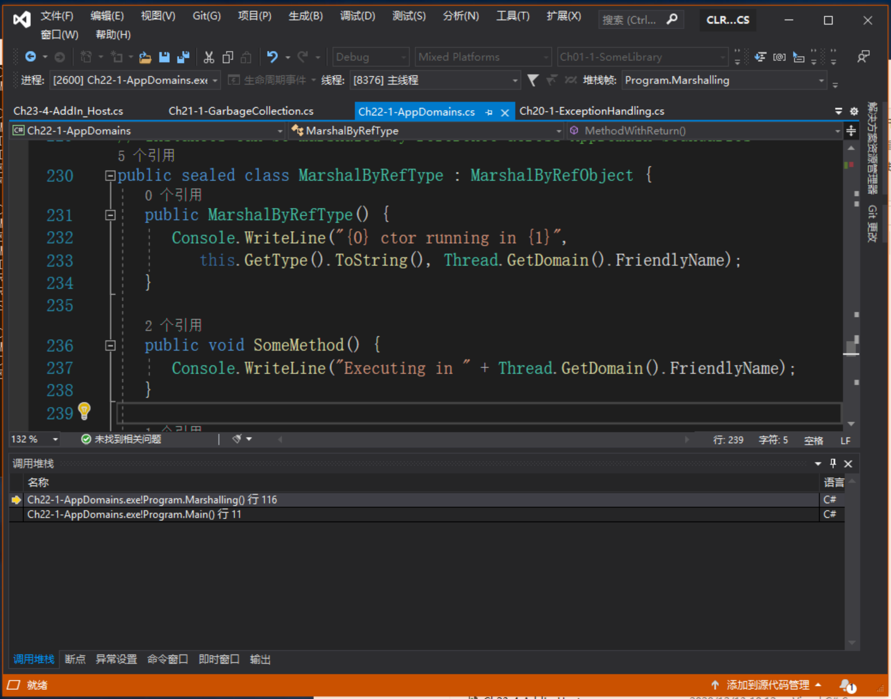

# 第 22 章 CLR 寄宿和 AppDomain

本章内容：

* <a href="#22_1">CLR 寄宿</a>
* <a href="#22_2">AppDomain</a>
* <a href="#22_3">卸载 AppDomain</a>
* <a href="#22_4">监视 AppDomain</a>
* <a href="#22_5">AppDomain FirstChance 异常通知</a>
* <a href="#22_6">宿主如何使用 AppDomain</a>
* <a href="#22_7">高级宿主控制</a>

本章主要讨论两个主题：寄宿和 AppDomain。这两个主题充分演示了 Microsoft .NET Framework 的巨大价值。寄宿(hosting)使任何应用程序都能利用 CLR 的功能。特别要指出的是，它使现有的应用程序至少能部分使用托管代码编写。另外，寄宿还为应用程序至少能部分使用托管代码编写。另外，寄宿还为应用程序提供了通过编程来进行自定义和扩展的能力。

允许可扩展性意味着第三方代码可在你的进程中运行。在 Windows 中将第三方 DLL 加载到进程中意味着冒险。DLL 中的代码很容易破坏应用程序的数据结构和代码。DLL 还可能企图利用应用程序程序的安全上下文来访问它本来无权访问的资源。CLR 的 AppDomain 功能解决了所有这些问题。AppDomain 允许第三方的、不受信任的代码在现有的进程中运行，而 CLR 保证数据结构、代码和安全上下文不被滥用或破坏。

程序员经常将寄宿和 AppDomain 与程序集的加载和反射一起使用。这 4 种技术一起使用，使 CLR 成为一个功能极其丰富和强大的平台。本章重点在于寄宿和 AppDomain。下一章则会重点放在程序集加载和反射上。学习并理解了所有这些技术后，会发现今天在 .NET Framework 上面的投资，将来必会获得丰厚回报。

## <a name="22_1">22.1 CLR 寄宿</a> 

.NET Framework 在 Windows 平台的顶部运行。这意味着 .NET Framework 必须用 Windows 能理解的技术来构建。首先，所有托管模块和程序集文件都必须使用 Windows PE 文件格式，而且要么是 Windows EXE 文件，要么是 DLL 文件。

开发 CLR 时，Microsoft 实际是把它实现成包含一个 DLL 中的 COM 服务器。也就是说，Microsoft 为 CLR 定义了一个标准的 COM 接口，并为该接口和 COM 服务器分配了 GUID。 安装 .NET Framework 时，代表 CLR 的 COM 服务器和其他 COM 服务器一样在 Windows 注册表中注册。要了解这方面的更多信息，可参考与 .NET Framework SDK 一起发布的 C++ 头文件 MetaHost.h。该头文件中定义了 GUID 和非托管 `ICLRMetaHost` 接口。

任何 Windows 应用程序都能寄宿(容纳)CLR。但不要通过调用 `CoCreateInstance` 来创建 CLR COM 服务器的实例，相反，你的非托管宿主应该调用 `MetaHost.h` 文件中声明的 `CLRCreateInstance` 函数。`CLRCreateInstance` 函数在 MSCorEE.dll 文件中实现，该文件一般在`C:\Windows\System32` 目录中。这个 DLL 被人们亲切地称为“垫片”(shim)，它的工作是决定创建哪个版本的CLR；垫片 DLL 本身不包含 CLR COM 服务器。

一台机器可安装多个版本的 CLR，但只有一个版本的 MSCorEE.dll 文件(垫片)<sup>①</sup>。机器上安装的 MSCorEE.dll 是与机器上安装的最新版本的 CLR 一起发布的那个版本。所以，该版本的 MSCorEE.dll 知道如何查找机器上的老版本 CLR。

> ① 使用 64 位 Windows 实际会安装两个版本的 MSCorEE.dll 文件。一个是 32 位 x86 版本，在 `C:\Windows\SysWOW64` 目录中；另一个是 64 位 x64 或 IA64 版本(取决于计算机的 CPU 架构)，在 `C:\Windows\System32` 目录中。

包含实际 CLR 代码的文件的名称在不同版本的 CLR 中是不同的。版本 1.0， 1.1 和 2.0 的 CLR 代码在 MSCorWks.dll 文件中；版本 4 则在 Clr.dll 文件中。由于一台机器可能安装多个版本的 CLR，所以这些文件安装到不同的目录，如下所示。<sup>②</sup>

> ② 注意，.NET Framework 3.0 和 3.5 是与 CLR 2.0 一起发布的。我没有显示 .NET Framework 3.0 和 3.5 的目录，因为 CLR DLL 是从 v2.0.50727 目录加载的。

* 版本 1.0 在 `C:\Windows\Microsoft.Net\Framework\v1.0.3705` 中。

* 版本 1.1 在 `C:\Windows\Microsoft.Net\Framework\V1.0.4322` 中。

* 版本 2.0 在 `C:\Windows\Microsoft.Net\Framework\v2.0.50727` 中。

* 版本 4 在 `C:\Windows\Microsoft.Net\Framework\v4.0.30319`<sup>③</sup>中。

> ③ 这是本书出版时的 .NET Framework 4 目录。在你的机器上可能有所不同。 ———— 译注

`CLRCreateInstance` 函数可返回一个 `ICLRMetaHost` 接口。宿主应用程序可调用这个接口的 `GetRuntime` 函数，指定宿主要创建的 CLR 的版本。然后，垫片将所需版本的 CLR 加载到宿主的进程中。

默认情况下，当一个托管的可执行文件启动时，垫片会检查可执行文件，提取当初生成和测试应用程序时使用的 CLR 的版本信息。但应用程序可以在它的 XML 配置文件中设置 `requiredRuntime` 和 `supportedRuntime` 这两项来覆盖该默认行为。(XML 配置文件的详情请参见第 2 章和第 3 章。)

`GetRuntime` 函数返回指向非托管 `ICLRRuntimeInfo` 接口的指针。有了这个指针后，就可利用 `GetInterface` 方法获得 `ICLRRuntimeHost` 接口。宿主应用程序可调用该接口定义的方法来做下面这些事情。

* 设置宿主管理器。告诉 CLR 宿主想参与涉及以下操作的决策：内存分配、线程调度/同步以及程序集加载等。宿主还可声明它想获得有关垃圾回收启动和停止以及特定操作超时的通知。

* 获取 CLR 管理器。告诉 CLR 阻止使用某些类/成员。另外，宿主能分辨哪些代码可以调试，哪些不可以，以及当特定事件(例如 AppDomain 卸载、CLR停止或者堆栈溢出异常)发生时宿主应调用哪个方法。

* 初始化并启动 CLR。

* 加载程序集并执行其中的代码。

* 停止 CLR，阻止任何更多的托管代码在 `Windows` 进程中运行。

> 注意 Windows 进程完全可以不加载 CLR，只有在进程中执行托管代码时才进行加载。在 .NET Framework 4 之前，CLR 只允许它的一个实例寄宿在 Windows 进程中。换言之，在一个进程中，要么不包含任何 CLR，要么只能包含 CLR v1.0, CLR v1.1 或者 CLR 2.0 之一。每进程仅一个版本的 CLR 显然过于局限。例如，这样 Microsoft Office Outlook 就不能加载为不同版本的 .NET Framework 生成和测试的两个加载项了。  

> 但是，随着 .NET Framework 4 的发布，Microsoft 支持在一个 Windows 进程中同时加载 CLR v2.0 和 v4.0，为 .NET Framework 2.0 和 4.0 写的不同组件能同时运行，不会出现任何兼容性问题。这是一个令人激动的功能，因为它极大扩展了 .NET Framework 组件的应用场合。可利用 CLrVer.exe 工具检查给定的进程加载的是哪个(哪些)版本的 CLR。

> 一个 CLR 加载到 Windows 进程之后，便永远不能卸载；在 `ICLRRuntimeHost` 接口上调用 `AddRef` 和 `Release` 方法是没有作用的。CLR 从进程中卸载的唯一途径就是终止进程，这会造成 Windows 清理进程使用的所有资源。

## <a name="22_2">22.2 AppDomain</a>

CLR COM 服务器初始化时会创建一个 AppDomain。AppDomain 是一组程序集的逻辑容器。 CLR 初始化时创建的第一个 AppDomain 称为“默认 AppDomain”，这个默认的 AppDomain 只有在 Windows 进程终止时才会被销毁。

除了默认 AppDomain，正在使用非托管 COM 接口方法或托管类型方法的宿主还可要求 CLR 创建额外的 AppDomain。AppDomain 是为了提供隔离而设计的。下面总结了 AppDomain 的具体功能。

* **一个 AppDomain 的代码不能直接访问另一个 AppDomain 的代码创建的对象**  
  一个 AppDomain 中的代码创建了一个对象后，该对象便被该 AppDomain “拥有”。换言之，它的生存期不能超过创建它的代码所在的 AppDomain。一个 AppDomain 中的代码要访问另一个 AppDomain 中的对象，只能使用“按引用封送”(marshal-by-reference)或者“按值封送”(marshal-by-value)的语义。这就强制建立了清晰的分隔边界，因为一个 AppDomain 中的代码不能直接引用另一个 AppDomain 中的代码创建的对象。这种隔离使 AppDomain 能很容易地从进程中卸载，不会影响其他 AppDomain 正在运行的代码。

* **AppDomain 可以卸载**
  CLR 不支持从 AppDomain 中卸载特定的程序集。但可以告诉 CLR 卸载一个 AppDomain，从而卸载该 AppDomain 当前包含的所有程序集。

* **AppDomain 可以单独保护**
  AppDomain 创建后应用一个权限集，它决定了向这个 AppDomain 中运行的程序集授予的最大权限，所以当宿主加载一些代码后，可以保证这些代码不会破坏(或读取)宿主本身使用的一些重要数据结构。

* **AppDomain 可以单独配置**  
  AppDomain 创建后会关联一组配置设置。这些设置主要影响 CLR 在 AppDomain 中加载程序集的方式。涉及搜索路径、版本绑定重定向、卷影复制以及加载器优化。

> 重要提示 Windows 的一个重要特色是让每个应用程序都在自己的进程地址空间中运行。这就保证了一个应用程序的代码不能访问另一个应用程序使用的代码或数据。进程隔离可防范安全漏洞、数据破坏和其他不可预测的行为，确保了 Windows 系统以及在它上面运行的应用程序的健壮性。遗憾的是，在 Windows 中创建进程的开销很大。Win32 CreateProcess 函数的速度很慢，而且 Windows 需要大量内存来虚拟化进程的地址空间。  

> 但是，如果应用程序安全由托管代码构成(这些代码的安全性可以验证)，同时这些代码没有调用非托管代码，那么在一个 Windows 进程中运行多个托管应用程序是没有问题的。AppDomain 提供了保护、配置和终止其中每一个应用程序所需的隔离。  

图 22-1 演示了一个 Windows 进程，其中运行着一个 CLR COM 服务器。该 CLR 当前管理着两个 AppDomain(虽然在一个 Windows 进程中可以运行的 AppDomain 数量没有硬性限制)。每个 AppDomain 都有自己的 Loader 堆，每个 Loader 堆都记录了自 AppDomain 创建以来已访问过哪些类型。这些类型对象已在第 4 章讨论过，Loader 堆中的每个类型对象都有一个方法表，方法表中的每个记录项都指向 JIT 编译的本机代码(前面是方法至少执行过一次)。

  

图 22-1 寄宿了 CLR 和两个 AppDomain 的一个 Windows 进程  

除此之外，每个 AppDomain 都加载了一些程序集。AppDomain #1(默认 AppDomain)有三个程序集：MyApp.exe，TypeLib.dll 和 System.dll。AppDomain #2 有两个程序集：Wintellect.dll 和 System.dll。

如图 22-1 所示，两个 AppDomain 都加载了 System.dll 程序集。如果这两个 AppDomain 都使用了来自 System.dll 的一个类型，那么两个 AppDomain 的 Loader 堆会为相同的类型分别分配一个类型对象；类型对象的内存不会由两个 AppDomain 共享。另外，一个 AppDomain 中的代码调用一个类型定义的方法时，方法的 IL 代码会进行 JIT 编译，生成的本机代码单独与每个 AppDomain 关联，而不是由调用它的所有 AppDomain 共享。

不共享类型对象的内存或本机代码显得有些浪费。但 AppDomain 的设计宗旨就是提供隔离；CLR 要求在卸载某个 AppDomain 并释放其所有资源时不会影响到其他任何 AppDomain。复制 CLR 的数据结构才能保证这一点。另外，还保证多个 AppDomain 使用的类型在每个 AppDomain 中都有一组静态字段。

有的程序集本来就要由多个 AppDomain 使用。最典型的例子就是 MSCorLib.dll。该程序集包含了 `System.Object`，`System.Int32` 以及其他所有与 .NET Framework 密不可分的类型。CLR 初始化，该程序集会自动加载，而且所有 AppDomain 都共享该程序集中的类型。为了减少资源消耗，MSCorLib.dll 程序集以一种“AppDomain 中立”的方式加载。也就是说，针对以“AppDomain 中立”的方式加载的程序集，CLR 会为它们维护一个特殊的 Loader 堆。该 Loader 堆中的所有类型对象，以及为这些类型定义的方法 JIT 编译生成的所有本机代码，都会由进程中的所有 AppDomain 共享。遗憾的是，共享这些资源所获得的收益并不是没有代价的。这个代价就是，以 “AppDomain 中立”的方式加载的所有程序集永远不能卸载。要回收它们占用的资源，唯一的办法就是终止 Windows 进程，让 Windows 去回收资源。

### **跨越 AppDomain 边界访问对象**

一个 AppDomain 中的代码可以和另一个 AppDomain 中的类型和对象通信，但只能通过良好定义的机制进行。以下 Ch22-1-AppDomains 示例程序演示了如何创建新 AppDomain，在其中加载程序集并构造该程序集定义的类型的实例。代码演示了一下三种类型在构造时的不同行为：“按引用封送”(Marshal-by-Reference)类型，“按值封送”(Marshal-by-Value)类型，以及完全不能封送的类型。代码还演示了创建它们的 AppDomain 卸载时这些对象的不同行为。Ch22-1-AppDomains 示例程序的代码实际很少，只是我添加了大量注释。在代码清单之后，我将逐一分析这些代码，解释 CLR 所做的事情。

```C#
private static void Marshalling() {
    // 获取 AppDomain 引用 (“调用线程”当前正在该 AppDomain 中执行)
    AppDomain adCallingThreadDomain = Thread.GetDomain();

    // 每个 AppDomain 都分配了友好字符串名称(以便调试)
    // 获取这个 AppDomain 的友好字符串名称并显示它
    String callingDomainName = adCallingThreadDomain.FriendlyName;
    Console.WriteLine("Default AppDomain's friendly name={0}", callingDomainName);

    // 获取并显示我们的 AppDomain 中包含了“Main”方法的程序集
    String exeAssembly = Assembly.GetEntryAssembly().FullName;
    Console.WriteLine("Main assembly={0}", exeAssembly);

    // 定义局部变量来引用一个 AppDomain
    AppDomain ad2 = null;

    // *** DEMO 1：使用 Marshal-by-Reference 进行跨 AppDomain 通信 ***
    Console.WriteLine("{0}Demo #1", Environment.NewLine);

    // 新建一个 AppDomain (从当前 AppDomain 继承安全性和配置)
    ad2 = AppDomain.CreateDomain("AD #2", null, null);
    MarshalByRefType mbrt = null;

    // 将我们的程序集加载到新 AppDomain 中，构造一个对象，把它
    // 封送回我们的 AppDomain (实际得到对一个代理的引用)
    mbrt = (MarshalByRefType)ad2.CreateInstanceAndUnwrap(exeAssembly, "MarshalByRefType");

    Console.WriteLine("Type={0}", mbrt.GetType());      // CLR 在类型上撒谎了

    // 证明得到的是对一个代理对象的引用
    Console.WriteLine("Is proxy={0}", RemotingServices.IsTransparentProxy(mbrt));

    // 看起来像是在 MarshalByRefType 上调用一个方法，实例不然、
    // 我们是在代理类型上调用一个方法，代理使线程切换到拥有对象的
    // 那个 AppDomain，并在真实的对象上调用这个方法
    mbrt.SomeMethod();

    // 卸载新的 AppDomain
    AppDomain.Unload(ad2);

    // mbrt 引用一个有效的代理独享；代理对象引用一个无效的 AppDomain

    try {
        // 在代理类型上调用一个方法。AppDomain 无效，造成抛出异常
        mbrt.SomeMethod();
        Console.WriteLine("Successful call.");
    }
    catch (AppDomainUnloadedException) {
        Console.WriteLine("Failed call.");
    }

    // *** DEMO 2: 使用 Marshal-by-Value 进行跨 AppDomain 通信 ***
    Console.WriteLine("{0}Deom #2", Environment.NewLine);

    // 新建一个 AppDomain(从当前 AppDomain 继承安全性和配置)
    ad2 = AppDomain.CreateDomain("AD #2", null, null);

    // 将我们的程序集加载到新 AppDomain 中，构造一个对象，把它
    // 封送回我们的 AppDomain (实际得到对一个代理的引用)
    mbrt = (MarshalByRefType)ad2.CreateInstanceAndUnwrap(exeAssembly, "MarshalByRefType");

    // 对象的方法返回所返回对象的副本；
    // 对象按值(而非按引用)封送
    MarshalByRefType mbvt = mbrt.MethodWithReturn();

    // 证明得到的不是对一个代理对象的引用
    Console.WriteLine("Is proxy={0}", RemotingServices.IsTransparentProxy(mbvt));

    // 看起来是在 MarshalByRefType 上调用一个方法，实际也是如此
    Console.WriteLine("Returned object created " + mbvt.ToString());

    // 卸载新的 AppDomain
    AppDomain.Unload(ad2);
    // mbvt 引用有效的对象；卸载 AppDomain 没有影响

    try {
        // 我们是在对象上调用一个方法；不会抛出异常
        Console.WriteLine("Returned object created " + mbvt.ToString());
        Console.WriteLine("Successful call.");
    }
    catch (AppDomainUnloadedException) {
        Console.WriteLine("Failed call.");
    }

    // DEMO 3：使用不可封送的类型进行跨 AppDomain 通信 ***
    Console.WriteLine("{0}Demo #3", Environment.NewLine);

    // 新建一个 AppDomain (从当前 AppDomain 继承安全性和配置)
    ad2 = AppDomain.CreateDomain("AD #2", null, null);
    // 将我们的程序集加载到新 AppDomain 中，构造一个对象，把它
    // 封送回我们的 AppDomain (实际得到对一个代理的引用)
    mbrt = (MarshalByRefType)ad2.CreateInstanceAndUnwrap(exeAssembly, "MarshalByRefType");

    // 对象的方法返回一个不可封送的对象；抛出异常
    NonMarshalableType nmt = mbrt.MethodArgAndReturn(callingDomainName);
    // 这里永远执行不到...
}


// 该类的实例可跨越 AppDomain 的边界“按引用封送”
public sealed class MarshalByRefType : MarshalByRefObject {
    public MarshalByRefType() {
        Console.WriteLine("{0} ctor running in {1}", this.GetType().ToString(), Thread.GetDomain().FriendlyName);
    }

    public void SomeMethod() {
        Console.WriteLine("Exexuting in " + Thread.GetDomain().FriendlyName);
    }

    public MarshalByValType MethodWithReturn() {
        Console.WriteLine("Executing in" + Thread.GetDomain().FriendlyName);
        MarshalByValType t = new MarshalByValType();
        return t;
    }

    public NonMarshalableType MethodArgAndReturn(String callingDomainName) {
        // 注意： callingDomainName 是可序列化的
        Console.WriteLine("Calling from '{0}' to '{1}'.", callingDomainName, Thread.GetDomain().FriendlyName);
        NonMarshalableType t = new NonMarshalableType();
        return t;
    }
}

// 该类的实例可跨越 AppDomain 的边界“按值封送”
[Serializable]
public sealed class MarshalByValType : Object {
    private DateTime m_creationTime = DateTime.Now;  // 注意：DateTime 是可序列化的

    public MarshalByValType() {
        Console.WriteLine("{0} ctor running in {1}, Created on {2:D}", this.GetType().ToString(), Thread.GetDomain().FriendlyName, m_creationTime);
    }

    public override String ToString() {
        return m_creationTime.ToLongDateString();
    }
}

// 该类的实例不能跨 AppDomain 边界进行封送
// [Serializable]
public sealed class NonMarshalableType : Object {
    public NonMarshalableType() {
        Console.WriteLine("Executing in " + Thread.GetDomain().FriendlyName);
    }
}
```

生成并运行 Ch22-1-AppDomains 应用程序，获得以下输出结果：<sup>①</sup>

> ① 在本书配套代码中，找到 C22-1 AppDomains 项目，在 Main() 方法中解除对 Marshalling() 方法调用的注释。————译注

```cmd
Default AppDomain's friendly name=Ch22-1-AppDomains.exe
Main assembly=Ch22-1-AppDomains, Version=0.0.0.0, Culture=neutral, PublicKeyToken=null

Demo #1
MarshalByRefType ctor running in AD #2
Type=MarshalByRefType
Is proxy=True
Executing in AD #2
Failed call.

Demo #2
MarshalByRefType ctor running in AD #2
Executing in AD #2
MarshalByValType ctor running in AD #2, Created on 2021年3月11日
Is proxy=False
Returned object created 2021年3月11日
Returned object created 2021年3月11日
Successful call.

Demo #3
MarshalByRefType ctor running in AD #2
Calling from 'Ch22-1-AppDomains.exe' to 'AD #2'.
Executing in AD #2

Unhandled Exception: System.Runtime.Serialization.SerializationException:
Type ‘NonMarshalableType’ in assembly ‘Ch22-1-AppDomains, Version=0.0.0.0,
Culture=neutral, PublicKeyToken=null’ is not marked as serializable.
at MarshalByRefType.MethodArgAndReturn(String callingDomainName)
at Program.Marshalling()
at Program.Main() 
```

现在来讨论以上代码以及 CLR 所做的事情。

`Marshalling` 方法首先获得一个 `AppDomain` 对象引用，当前调用线程正在该 AppDomain 中执行。在 Windows 中，线程总是在一个进程的上下文中创建，而且线程的这个生存期都在该进程的生存期中。但线程和 AppDomain 没有一对一关系。AppDomain 是一项 CLR 功能；Windows 对 AppDomain 一无所知。由于一个 Windows 进程可包含多个 AppDomain，所以线程能执行一个 AppDomain 中的代码，再执行另一个 AppDomain 中的代码。从 CLR 的角度看，线程一次只能执行一个 AppDomain 中的代码。线程可调用 `System.Threading.Thread` 的静态方法 `GetDomain` 向 CLR 询问它正在哪个 AppDomain 中执行。线程还可查询 `System.AppDomain` 的静态只读属性 `CurrentDomain` 获得相同的信息。

AppDomain 创建后可被赋予一个**友好名称**。它是用于标识 AppDomain 的一个 `String`。友好名称主要是为了方便调试。由于 CLR 要在我们的任何执行前创建默认 AppDomain，所以使用可执行文件的文件名作为默认的 AppDomain 友好名称。`Marshalling` 方法使用 `System.AppDomain` 的只读 `FriendlyName` 属性来查询默认 AppDomain 的友好名称。

接着，`Marshalling` 方法查询默认 AppDomain 中加载的程序集的强命名标识，这个程序集定义了入口方法 `Main`(其中调用了 `Marshalling`)。程序集定义了几个类型：`Program`，`MarshalByRefType`，`MarshalByValType` 和 `NonMarshalableType`。现在已准备好研究上面的三个演示(Demo)，它们本质上很相似。

#### 演示 1：使用“按引用封送”进行跨 AppDomain 通信 

演示 1 调用 `System.AppDomain` 的静态 `CreateDomain` 方法指示 CLR 在同一个 Windows 进程中创建一个新 AppDomain。`AppDomain` 类型提供了 `CreateDomain` 方法的多个重载版本。建议仔细研究一下它们，并在新建 AppDomain 时选择最合适的一个。本例使用的 `CreateDomain` 接受以下三个参数。

* 代表新 AppDomain 的友好名称的一个 `String`。本例传递的是“AD #2”。

* 一个 `System.Security.Policy.Evidence`，是 CLR 用于计算 AppDomain 权限集的证据。本例为该参数传递 `null`，造成新 AppDomain 从创建它的 AppDomain 继承权限集。通常，如果希望围绕 AppDomain 中的代码创建安全边界，可构造一个 `System.Security.PermissionSet`对象，在其中添加希望的权限对象(实现了 `IPermission` 接口的类型的实例)，将得到的 `PermissionSet` 对象引用传给接受一个 `PermissionSet` 的 `CreateDomain` 方法重载。

* 一个 `System.AppDomainSetup`，代表 CLR 为新 AppDomain 使用的配置设置。同样，本例为该参数传递 `null`，使新 AppDomain 从创建它的 AppDomain 继承配置设置。如果希望对新 AppDomain 进行特殊设置，可构造一个 `AppDomainSetup` 对象，将它的各种属性(例如配置文件的名称)设为你希望的值，然后将得到的 `AppDomainSetup` 对象引用传给 `CreateDomain` 方法。

`CreateDomain`方法内部会在进程中新建一个 AppDomain，该 AppDomain 将被赋予指定的友好名称、安全性和配置设置。新 AppDomain 有自己的 Loader 堆，这个堆目前是空的，因为还没有程序集加载到新 AppDomain 中。创建 AppDomain 时，CLR 不在这个 AppDomain 中创建任何线程；AppDomain 中也不会运行代码，除非显式地让一个线程调用 AppDomain 中的代码。

现在，要在新 AppDomain 中创建类型的实例，首先要将程序集加载到新 AppDomain 中，然后构造程序集中定义的类型的实例。这就是 AppDomain 的公共实例方法 `CreateInstanceAndUnwrap` 所做的事情。调用这个方法时我传递了两个 `String` 实参；第一个标识了想在新 AppDomain(`ad2`变量引用的那个 AppDomain)中加载的程序集；第二个标识了想构建其实例的那个类型的名称("`MarshalByRefType`")。在内部，`CreateInstanceAndUnwrap` 方法导致调用线程从当前 AppDomain 切换新 AppDomain 。现在，线程(当前正在调用`CreateInstanceAndUnwrap`)将制定程序集加载到新 AppDomain 中，并扫描程序集的类型定义元数据表，查找指定类型("MarshalByRefType")。找到类型后，线程调用 `MarshalByRefType` 的无参构造器。现在，线程又切回默认 AppDomain ，使 `CreateInstanceAndUnwrap` 能返回对新`MarshalByRefType`对象的引用。

> 注意 `CreateInstanceAndUnwrap` 方法的一些重载版本允许在调用类型的构造器时传递实参。

所有这一切听起来都很美好，但还有一个问题；CLR 不允许一个 AppDomain 中的变量(根)引用另一个 AppDomain 中创建的对象。如果 `CreateInstanceAndUnwrap` 直接返回对象引用，隔离性就会被打破，而隔离是 AppDomain 的全部目的！因此，`CreateInstanceAndUnwrap`在返回对象引用，隔离性就会被打破，而隔离是 AppDomain 的全部目的！因此，`CreateInstanceAndUnwrap` 在返回对象引用前要执行一些额外的逻辑。

我们的 `MarshalByRefType` 类型从一个很特别的基类 `System.MarshalByRefObject` 派生。当 `CreateInstanceAndUnwrap` 发现它封送的一个对象的类型派生自 `MarshalByRefObject` 时，CLR 就会跨 AppDomain 边界按引用封送对象。下面讲述了按引用将对象从一个 AppDomain(源 AppDomain，这是真正创建对象的地方)封送到另一个 AppDomain(目标 AppDomain，这是调用 `CreateInstanceAndUnwrap` 的地方)的具体含义。

源 AppDomain 想向目标 AppDomain 发送或返回对象引用时，CLR 会在目标 AppDomain 的Loader 堆中定义一个代理类型。代理类型是用原始类型完全一样；有完全一样的实例成员(属性、事件和方法)。但是，实例字段不会成为(代理)类型的一部分，我稍后会具体解释这一点。代理类型确实定义了几个(自己的)实例字段，但这些字段和原始类型的不一致。相反，这些字段只是指出哪个 AppDomain “拥有”真实的对象，以及如何在拥有(对象的)AppDomain 中找到真实的对象。(在内部，代理对象用一个 `GCHandle` 实例引用真实的对象。第 21 章“托管堆和垃圾回收”讨论了 `GCHandle` 类型。)

在目标 AppDomain 中定义好这个代理类型之后，`CreateInstanceAndUnwrap` 方法就会创建代理类型的实例，初始化它的字段来标识源 AppDomain 和真实对象，然后将对这个代理对象的引用返回给目标 AppDomain。在 Ch22-1AppDomains 应用程序中，`mbrt` 变量被设为引用这个代理。注意，从`CreateInstanceAndUnwrap` 方法返回的对象实际不是 `MarshalByRefType` 类型的实例。CLR 一般不允许将一个类型的对象转换成不兼容的类型。但在当前这种情况下，CLR 允许转型，因为新类型具有和原始类型一样的实例成员。事实上，用代理对象调用 `GetType`，它会向你撒谎，说自己是一个`MarshalByRefType` 对象。

但可以证明从 `CreateInstanceAndUnwrap` 返回的对象实际是对代理对象的引用。为此，Ch22-1-AppDomains 应用程序调用了 `System.Runtime.Remoting.RemotingService` 的公共静态 `IsTransparentProxy` 方法并向其传递 `CreateInstanceAndUnwrap` 方法返回的引用。从输出结果可知，`IsTransparentProxy` 方法返回 `true`，证明返回的是代理。

接着，Ch22-1-AppDomains 应用程序使用代理调用 `SomeMethod` 方法。由于 `mbrt` 变量引用代理对象，所以会调用由代理实现的 `SomeMethod`。代理的实现利用代理对象中的信息字段，将调用线程从默认 AppDomain 切换至新 AppDomain。现在，该线程的任何行动都在新 AppDomain 的安全策略和配置设置下运行。线程接着使用代理对象的 `GCHandle` 字段查找新 AppDomain 中的真实对象，并用真实对象调用真实的 `SomeMethod` 方法。

有两个办法可证明调用线程已从默认 AppDomain 切换至新 AppDomain。首先，我在 AppDomain。首先，我在 `SomeMethod` 方法调用了 `Thread.GetDomain.CreateDomain` 方法，并传递“AD #2”作为友好名称参数来创建的。其次，在调试器中逐语句调试代码，并打开了“调用堆栈”窗口，那么“[外部代码]”行会标注一个线程在什么位置跨越 AppDomain 边界。请参见图 22-2 底部的“调用堆栈”窗口。

  

图 22-2 调试器的“调用堆栈”窗口显示了一次 AppDomain 切换

真实的 `SomeMethod` 方法返回后，会返回至代理的 `SomeMethod` 方法，后者将线程切换回默认 AppDomain。线程继续执行默认 AppDomain 中的代码。

> 注意 一个 AppDomain 中的线程调用另一个 AppDomain 中的方法时，线程会在这两个 AppDomain 之间切换。这意味着跨 AppDomain 边界的方法调用是同步执行的<sup>①</sup>。任何时刻一个线程只能在一个 AppDomain 中，而且要用那个 AppDomain 的安全和配置设置来执行代码。如果希望多个 AppDomain 中的代码并发执行，应创建额外的线程，让这些线程在你希望的 AppDomain 中执行你希望的代码。

>> ① 一个 AppDomain 的方法执行完毕，才能执行另一个 AppDomain 的方法。不能多个 AppDomain 的代码并发执行。 ———— 译注

Ch22-1-AppDomains 应用程序接着做的事情是调用 `AppDomain` 类的公共静态 `Unload` 方法，这会强制 CLR 卸载指定的 AppDomain(包括加载到其中的所有程序集)，并强制执行一次垃圾回收，以释放由卸载的 AppDomain 中的代码创建的所有对象。这时，默认 AppDomain 的 `mbrt` 变量仍然引用一个有效的代理对象。但代理对象已不再引用一个有效的 AppDomain(因为它已经卸载了)。

当默认 AppDomain 试图使用代理对象调用 `SomeMethod` 方法时，调用的是该方法在代理中的实现。代理的实现发现包含真实对象的 `AppDomain` 已卸载。所以，代理的 `SomeMethod` 方法抛出一个 `AppDomainUnloadedException` 异常，告诉调用者操作无法完成。

显然，Microsoft 的 CLR 团队不得不做大量的工作来确保 AppDomain 的正确隔离，但这是他们必须做的。跨 AppDomain 访问对象的功能正在被大量地使用，开发人员对这个功能的依赖性正在日益增加。不过，使用“按引用封送”的语义进行跨 AppDomain 边界的对象访问，会产生一些性能上的开销。所以，一般应尽量少用这个功能。

前面我承诺会更多地讨论实例字段。从 `MarshalByRefObject` 派生的类型可定义实例字段。但这些实例字段不会成为代理类型的一部分，也不会包含在代理对象中。写代码对派生自 `MarshalByRefObject` 的类型的实例字段进行读写时，JIT 编译器会自动生成代码，分别调用 `System.Object` 的 `FieldGetter` 方法(用于读)或 `FieldSetter` 方法(用于写)来使用代理对象(以找到真正的 AppDomain/对象)。这些方法是私有的，而且没有在文档中记录。简单地说，这些方法利用反射机制获取或设置字段值。因此，虽然能访问派生自 `MarshalByRefObject`的一个类型中的字段，但性能很差，因为 CLR 最终要调用方法来执行字段访问。事实上，即使要访问的字段在你自己的 AppDomain 中，性能也好不到哪里去。<sup>①</sup>

> ① 如果 CLR 要求所有字段都必须私有(为了获得好的数据封装，我强烈建议这样做)，那么 `FieldGetter` 和 `FieldSetter` 方法根本没有存在的必要，从方法中总是能够直接访问字段，避免(因为还要经由中间的 getter 或 setter 方法)造成性能损失。

>> 访问实例字段时的性能问题  
>> 我用以下代码演示性能损失的程度：

```C#
private sealed class NonMBRO : Object { public Int32 x; }
private sealed class MBRO    : Object { public Int32 x; }

private static void FieldAccessTiming() {
    const Int32 count = 100000000;
    NonMBRO nonMbro = new NonMBRO();
    MBRO mbro = new MBRO();

    Stopwatch sw = Stopwatch.StartNew();
    for (Int32 c = 0; c < count; c++ ) nonMbro.x++;
    Console.WriteLine("{0}", sw.Elapsed);       // 00:00:00.4073560

    sw = Stopwatch.StartNew();
    for (Int32 c = 0; c < count; c++) mbro.x++;
    Console.WriteLine("{0}", sw.Elapsed);       // 00:00:02.5388665 
}
```

>> 我运行以上代码，访问从 `Object` 派生的 `NonMBRO` 类的实例字段只花了约 0.4 秒，但访问从 `MarshalByRefObject` 派生的 `MBRO` 类的实例字段却花了 2.54 秒。也就是说，访问从 `MarshalByRefObject` 派生的一个类的实例字段要多花约 6 倍的时间！

从好不好用(usability)的角度说，派生自 `MarshalByRefObject` 的类型真的应该避免定义任何静态成员。这是因为静态成员总是在调用 AppDomain 的上下文中访问。要切换到哪个 AppDomain 的信息包含在代理对象中，但调用静态成员时没有代理对象，所以不会发生 AppDomain 的切换。让类型的静态成员一个 AppDomain 中执行，实例成员却在另一个 AppDomain 中执行，这样的编程模型未免太“丑”了！

由于第二个 AppDomain 中没有根，所以代理引用的原始对象可以被垃圾回收。这当然不理想。但另一方面，假如将原始对象不确定地(indefinitely)留在内存中，代理可能不再引用它，而原始对象依然存活；这同样不理想。CLR 解决这个问题的办法是使用一个“租约管理器”(lease manager)。一个对象的代理创建好之后，CLR 保持对象存活 5 分钟。5 分钟内没有通过代理发出调用，对象就会失效，下次垃圾回收会释放它的内存。每发出一次对对象的调用，“租约管理器”都会续订对象的租期，保证它在接下来的 2 分钟内在内存中保持存活。在对象过期后试图通过代理调用它，CLR 会抛出 `System.Runtime.Remoting.RemotingException` 异常。

默认的 5 分钟和 2 分钟租期设定是可以修改的，重写 `MarshalByRefObject` 的虚方法 `InitializeLifetimeService` 即可。详情参见文档的“生存期租约”主题。

#### 演示2: 使用“按值封送”进行跨 AppDomain 通信

演示 2 与演示 1 很相似。和演示 1 一样，演示 2 也创建了新 AppDomain。然后调用 `CreateInstanceAndUnwrap` 方法将同一个程序集加载到新建 AppDomain 中，并在这个新 AppDomain 中创建 `MarshalByRefType` 类型的实例。CLR 为这个对象创建代理，`mbrt` 变量(在默认 AppDomain中)被初始化成引用这个代理。接着用代理调用 `MethodWithReturn` 方法。这个方法是无参的，将在新 AppDomain 中执行以创建 `MarshalByValType` 类型的实例，并将一个对象引用返回给默认 AppDomain。

`MarshalByValType` 不从 `System.MarshalByRefObject` 派生，所以 CLR 不能定义一个代理类型并创建代理类型的实例；对象不能按引用跨 AppDomain 边界进行封送。

但由于 `MarshalByValType` 标记了自定义特性`[Serializble]`，所以 `MethodWithReturn` 方法能按值封送对象。下面具体描述了将一个对象按值从一个 AppDomain(源 AppDomain)封送到另一个 AppDomain(目标 AppDomain)的含义。欲知 CLR 序列化和反序列化的详情，请参见第 24 章“运行时序列化”。

源 AppDomain 想向目标 AppDomain 发送或返回一个对象引用时，CLR 将对象的实例字段序列化成一个字节数组。字节数组从源 AppDomain 复制到目标 AppDomain。然后，CLR 在目标 AppDomain 中反序列化字节数组，这会强制 CLR 将定义了“被反序列化的类型”的程序集加载到目标 AppDomain 中(如果尚未加载的话)。接着，CLR 创建类型的实例，并利用字节数组中的值初始化对象的字段，使之与源对象中的值相同。换言之，CLR 在目标 AppDomain 中精确复制了源对象。然后， `MethodWithReturn` 方法返回对这个副本的引用；这样一来，对象就跨 AppDomain 的边界按值封送了。

> 重要提示 加载程序集时，CLR 使用目标 AppDomain 的策略和配置设置(而 AppDomain 可能设置了不同的 AppBase 目录或者不同的版本绑定重定向)。策略上的差异可能妨碍 CLR 定位程程序集。程序集无法加载时会抛出异常，目标 AppDomain 接收不到对象引用。

至此，源 AppDomain 中的对象和目标 AppDomain 中的对象就有了独立的生存期，它们的状态也可以独立地更改。如果源 AppDomain 中没有保持对象存活(就像我的 Ch22-1-AppDomains 应用程序所做的那样)，源对象的内存就会在下次垃圾回收时被回收。

为了证明 `MethodWithReturn` 方法返回的不是对代理对象的引用，Ch22-1-AppDomains 应用程序调用了 `System.Runtime.Remoting.RemotingService` 的公共静态 `IsTransparentProxy` 方法，将 `MethodWithReturn` 方法返回的引用作为参数传给它。如输出所示，`IsTransparentProxy` 方法返回 `false`， 表明对象是一个真实的对象，不是代理。

现在，程序使用真实的对象调用 `ToString` 方法。由于 `mbvt` 变量引用真实的对象，所以会调用这个方法的真实实现，线程不会在 AppDomain 之前切换。为了证明这一点，可查看调试器“调用堆栈”窗口，它没有显示一个“[外部代码]”行。

为进一步证实没有涉及道理，Ch22-1-AppDomains 应用程序卸载了 AppDomain，然后尝试再次调用 `ToString`。和演示 1 不一样，这次调用会成功，因为卸载新 AppDomain 对默认 AppDomain “拥有”的对象(其中包括按值封送的对象)没有影响。

#### 演示3：使用不可封送的类型跨 AppDomain 通信

演示 3 的开始部分与演示 1 和 2 相似，都是新建 AppDomain，调用 `CreateInstanceAndUnwrap` 方法将相同的程序集加载到新 AppDomain 中，在新 AppDomain 中创建一个 `MarshalByRefType` 对象，并让 `mbrt` 引用该对象的代理。

然后，我用代理调用接受一个实参的 `MethodArgAndReturn` 方法。同样地，CLR 必须保持 AppDomain 的隔离，所以不能直接将对实参的引用传给新 AppDomain。如果对象的类型派生自  `MarshalByRefObject`， CLR 会为它创建代理并按引用封送。如果对象的类型用 `[Serializable]` 进行了标记，CLR 会将对象(及其子)序列化成一个字节数组，将字节数组封送到新 AppDomain 中，再将字节数组反序列化成对象图，将对象图的根传给 `MethodArgAndReturn` 方法。

在这个特定的例子中，我跨越 AppDomain 边界传递一个`System.String` 对象。`System.String` 类型不是从 `MarshalByRefObject` 派生的，所以 CLR 不能创建代理。幸好， `System.String` 被标记为`[Serializable]`，所以 CLR 能按值封送它，使代码能正常工作。注意，对于 `String` 对象，CLR 会采取特殊的优化措施。跨越 AppDomain 边界封送一个 `String` 对象时， CLR 只是跨越边界传递对 `String` 对象的引用；不会真的生成 `String` 对象的副本。之所以能提供这个优化，是因为 `String` 对象是不可变的；所以，一个 AppDomain 中的代码不可能破坏 `String` 对象的字段。<sup>①</sup>`String`“不可变”的详情强参见第 14 章“字符、字符串和文本处理”。

> ① 顺便说一句，这正是为什么 `System.String` 类是密封类的原因。类不密封，就能定义从 `String` 派生的类，并添加自己的字段。如果这样做了，CLR 就没有办法确保你的“字符串”类是不可变的。

在 `MethodArgAndReturn` 内部，我显示传给它的字符串，证明字符串跨越了 AppDomain 边界。然后，我创建 `NonMarshalableType` 类型的实例，并将对这个对象的引用返回至默认 AppDomain。由于 `NonMarshalableType` 不是从 `System.MarshalByRefObject` 派生的，也没有用 `[Serializable]` 定制特性进行标记，所以不允许 `MethodArgAndReturn` 按引用或按值封送对象 ———— 对象完全不能跨越 AppDomain 边界进行封送！为了报告这个问题， `MethodArgAndReturn` 在默认 AppDomain 中抛出一个 `SerializationException` 异常。由于我的程序没有捕捉这个异常，所以程序终止。

## <a name="22_3">22.3 卸载 AppDomain</a>

AppDomain 很强大的一个地方就是可以卸载它。卸载 AppDomain 会导致 CLR 卸载 AppDomain 中的所有程序集，还会释放 AppDomain 的 Loader 堆。卸载 AppDomain 的办法是调用 `AppDomain` 的静态 `Unload` 方法(参见 Ch22-1-AppDomains 应用程序)。这导致 CLR 执行一系列操作来得体地卸载指定的 AppDomain。

1. CLR 挂起进程中执行过托管代码的所有线程。

2. CLR 检查所有线程栈，查看哪些线程正在执行要卸载的 AppDomain 中的代码，或者哪些线程会在某个时候返回至要卸载的 AppDomain。任何栈上有要卸载的 AppDomain，CLR 都会强迫对应的线程抛出一个 `ThreadAbortException`(同时恢复线程的执行)。这将导致线程展开(unwind)，并执行遇到的所有`finally` 块以清理资源。如果没有代码捕捉 `ThreadAbortException`，它最终会成为未处理的异常，CLR会“吞噬”这个异常：线程会终止，但进程可继续运行。这是很特别的一点，因为对于其他所有未经处理的异常，CLR 都会终止进程。

> 重要提示 如果线程当前正在 `finally` 块、`catch` 块、类构造器、临界执行区域<sup>②</sup>或非托管代码中执行，那么 CLR 不会立即终止该线程。否则、资源清理代码、错误恢复代码、类型初始化代码、关键(critical)代码或者其他任何 CLR 不了解的代码都将无法完成，导致应用程序的行为无法预测，甚至可能造成安全漏洞。线程终止时会等待这些代码块执行完毕。然后，当代码块结束时，CLR 再强制线程抛出一个 `ThreadAbortException` 异常。

>> ② 即 critical execution region，文档翻译为 “关键执行区域”，本书翻译为“临界执行区域”或“临界区”。临界区是指线程终止或未处理异常的影响可能不限于当前任务的区域。相反，非临界区中的终止或失败只对出错的任务有影响。 ———— 译注

3. 当第 2 步发现的所有线程都离开 AppDomain 后，CLR 遍历堆，为引用了“由已卸载的 AppDomain 创建的对象”的每个代理对象都设置一个标志(flag
)。这些代理对象现在知道它们引用的真实对象已经不在了。现在，任何代码在无效的代理对象上调用方法都会抛出一个 `AppDomainUnloadedException`异常。

4. CLR强制垃圾回收，回收由已卸载的 AppDomain 创建的任何对象的内存。这些对象的 `Finalize` 方法被调用，使对象有机会正确清理它们占用的资源。

5. CLR 恢复剩余所有线程的执行。调用 `AppDomain.Unload` 方法的线程将继续运行；对 `AppDomain.Unload` 的调用是同步进行的。<sup>①</sup>。

> ① 换言之，一旦调用 Unload，只有在它返回之后，线程才能恢复运行。 ———— 译注

在 Ch22-1-AppDomains 应用程序中，所有工作都用一个线程来做。因此，任何时候只要调用 `AppDomain.Unload` ，都不可能有另一个线程在要卸载的 AppDomain 中。因此，CLR 不必抛出任何 `ThreadAbortException` 异常。本章后面将进一步讨论 `ThreadAbortException`。

顺便说一句，当一个线程调用 `AppDomain.Unload` 方法时，针对要卸载的 AppDomain 中的线程， CLR 会给它们 10 秒钟的时间离开。10 秒钟后，如果调用 `AppDomain.Unload` 方法的线程还没有返回，CLR 将抛出一个 `CannotUnloadAppDomainException` 异常，AppDomain 将来可能会、也可能不会卸载。

> 注意 如果调用 `AppDomain.Unload` 方法的线程不巧在要卸载的 AppDomain 中，CLR 会创建另一个线程来尝试卸载 AppDomain。第一个线程被强制抛出 `ThreadAbortException` 并展开(unwind)。新线程将等待 AppDomain 卸载，然后新线程会终止。如果 AppDomain 卸载失败，新线程将抛出 `CannotUnloadAppDomainException` 异常。但是，由于我们没有写由新线程执行的代码，所以无法捕捉这异常。

## <a name="22_4">22.4 监视 AppDomain</a>

宿主应用程序可监视 AppDomain 消耗的资源。有的宿主根据这种信息判断一个 AppDomain 的内存或 CPU 消耗是否超过了应有的水准，并强制卸载一个 AppDomain。还可利用监视来比较不同算法的资源消耗情况，判断哪一种算法用的资源较少。由于 AppDomain 监视本身也会产生开销，所以宿主必须将 `AppDomain` 的静态 `MonitoringEnabled` 属性设为 `true`，从而显式地打开监视。监视一旦打开便不能关闭；将 `MonitoringEnabled` 属性设为 `false` 会抛出一个 `ArgumentException` 异常。

监视打开后，代码可查询 `AppDomain` 类提供的以下 4 个只读属性。

* `MonitoringSurvivedProcessMemorySize` 这个 `Int64` 静态属性返回由当前 CLR  实例控制的所有 AppDomain 使用的字节数。这个数字只保证在上一次垃圾回收时是准确的。

* `MonitoringTotalAllocatedMemorySize` 这个 `Int64` 实例属性返回特定 AppDomain 已分配的字节数。这个数字只保证在上一次垃圾回收时是准确的。

* `MonitoringSurvivedMemorySize` 这个 `Int64` 实例属性返回特定 `AppDomain` 当前正在使用的字节数。这个数字只保证在上一次垃圾回收时是准确的。

* `MonitoringTotalProcessorTime` 这个 `TimeSpan` 实例属性返回特定 AppDomain 的 CPU 占用率。

下面这个类演示了如何利用这些属性检查两个时间点之间一个 AppDomain 发生的变化：

```C#
private sealed class AppDomainMonitorDelta : IDisposable {
    private AppDomain m_appDomain;
    private TimeSpan m_thisADCpu;
    private Int64 m_thisADMemoryInUse;
    private Int64 m_thisADMemoryAllocated;

    static AppDomainMonitorDelta() {
        // 确定已打开了 AppDomain 监视
        AppDomain.MonitoringIsEnabled = true;
    }

    public AppDomainMonitorDelta(AppDomain ad) {
        m_appDomain = ad ?? AppDomain.CurrentDomain;
        m_thisADCpu = m_appDomain.MonitoringTotalProcessorTime;
        m_thisADMemoryInUse = m_appDomain.MonitoringSurvivedMemorySize;
        m_thisADMemoryAllocated = m_appDomain.MonitoringTotalAllocatedMemorySize;
    }

    public void Dispose() {
        GC.Collect();
        Console.WriteLine("FriendlyName={0}, CPU={1}ms", m_appDomain.FriendlyName,
            (m_appDomain.MonitoringTotalProcessorTime - m_thisADCpu).TotalMilliseconds);
        Console.WriteLine(" Allocated {0:N0} bytes of which {1:N0} survived GCs",
            m_appDomain.MonitoringTotalAllocatedMemorySize - m_thisADMemoryAllocated,
            m_appDomain.MonitoringSurvivedMemorySize - m_thisADMemoryInUse);
    }
}
```

以下代码演示了如何使用 `AppDomainMonitorDelta` 类：

```C#
private static void AppDomainResourceMonitoring() {
    using(new AppDomainMonitorDelta(null)) {
        // 分配在回收时能存活的约 10 MB 
        var list = new List<Object>();
        for (Int32 x = 0; x < 1000; x++) list.Add(new Byte[10000]);

        // 分配在回收时存活不了的约 20 MB
        for (Int32 x = 0; x < 2000; x++) new Byte[10000].GetType();

        // 保持 CPU 工作约 5 秒
        Int64 stop = Environment.TickCount + 5000;
        while (Environment.TickCount < stop) ;
    }
}
```

在我的机器上运行以上代码，得到以下输入：<sup>①</sup>

```C#
FriendlyName=03-Ch22-1-AppDomains.exe, CPU=4937.982ms
 Allocated 30,159,424 bytes of which 10,099,024 survived GCs
```

> ① 在本书配套代码中，找到 Ch22-1 AppDomains 项目，在 `Main()`方法中注释掉`Marshalling()` 和 `FieldAccessTiming()`方法调用，然后解除对 `AppDomainResourceMonitoring()` 调用 `R` 的注释。 ————译注

## <a name="22_5">22.5 AppDomain FirstChance 异常通知</a>

每个 AppDomain 都可关联一组回调方法；CLR 开始查找 AppDomain 中的 `catch` 块时，这些回调方法将得以调用。可用这些方法执行日志记录操作。另外，宿主可利用这个机制监视 AppDomain 中抛出的异常。回调方法不能处理异常，也不能以任何方式“吞噬”异常(装作异常没有发生)；它们只是接收关于异常发生的通知。要登记回调方法，为 AppDomain 的实例事件 `FirstChanceException` 添加一个委托就可以了。

下面描述了 CLR 如何处理异常：异常首次抛出时，CLR 调用向抛出异常的 AppDomain 登记的所有 `FirstChanceException` 回调方法。然后，CLR 查找栈上在同一个 AppDomain 中的任何 `catch` 块。有一个 `catch` 块能处理异常，则异常处理完成，将继续正常执行。如果 AppDomain 中没有一个 `catch` 块能处理异常，则 CLR 沿着栈向上来到调用 AppDomain，再次抛出同一个异常对象(序列化和反序列化之后)。这时感觉就像是抛出了一个全新的异常，CLR 调用向当前 AppDomain 登记的所有 `FirstChanceException` 回调方法。这个过程会一直持续，直到抵达线程栈顶部。届时如果异常还未被任何代理处理，CLR 只好终止整个进程。

## <a name="22_6">22.6 宿主如何使用 AppDomain</a>

前面已讨论了宿主以及宿主加载 CLR 的方式。同时还讨论了宿主如何告诉 CLR 创建和卸载 AppDomain。为了使这些讨论更加具体，下面将描述一些常见的寄宿和 AppDomain 使用情形。我看重解释了不同应用程序类型如何寄宿(容纳)CLR，以及如何管理 AppDomain。

### 22.6.1 可执行应用程序

控制台 UI 应用程序、NT Service应用程序、Windows窗体应用程序和 Windows Presentation Foundation(WPF)应用程序都会自寄宿(self-hosted，即自己容纳 CLR)的应用程序，它们都有托管 EXE 文件。Windows 用托管 EXE 文件初始化进程时，会加载垫片<sup>②</sup>。垫片检查应用程序的程序集(EXE 文件)中的CLR头信息。头信息指明了生成和测试应用程序时使用的 CLR 版本。垫片根据这些信息决定将哪个版本的 CLR 加载到进程中，CLR 加载并初始化好之后，会再次检查程序集的 CLR 头，判断哪个方法是应用程序的入口方(`Main`)。CLR 调用该方法，此时应用程序才真正启动并运行起来。

代码运行时会访问其他类型。引用另一个程序集中的类型时，CLR 会定位所需的程序集，并将其加载到同一个 AppDomain 中。应用程序的 `Main` 方法返回后，Windows 进程终止(销毁默认 AppDomain 和其他所有 AppDomain)。

> 注意 顺便说一句，要关闭 Windows 进程(包括它的所有 AppDomain)，可调用 `System.Enviroment` 的静态方法 `Exit`。`Exit` 是终止进程最得体的方式，因为它首先调用托管堆上的所有对象的 `Finalize` 方法，再释放 CLR 容纳的所有非托管 COM 对象，最后，`Exit` 调用 Win32 `ExitProcess` 函数。

应用程序可告诉 CLR 在进程的地址空间中创建额外的 AppDomain。事实上，我的 Ch22-1-AppDomains 应用程序正是这么做的。

### 22.6.2 Microsoft Silverlight 富 Internet 应用程序

Microsoft Silverlight “运行时” 使用了有别于 .NET Framework 普通桌面版本的特殊 CLR。安装好 Silverlight “运行时”之后，每次访问使用了 Silverlight 技术的网站，都会造成 Silverlight CLR(CoreClr.dll)加载到浏览器(可能是、也可能不是 Windows Internet Explorer————甚至不一定是 Windows 机器)中。网页上的每个 Silverlight 控件都在它自己的 AppDomain 中运行。用户关闭标签页或切换至另一个网站，不再使用的任何 Silverlight 控件都在它自己的 AppDomain 都会被卸载。AppDomain 中的 Silverlight 代码在限制了安全权限的沙盒中运行，不会对用户或机器造成任何损害。

### 22.6.3 Microsoft ASP.NET 和 XML Web 服务应用程序

ASP.NET 作为一个 ISAPI DLL(ASPNet_ISAPI.dll)实现。客户端首次请求由这个 DLL 处理的 URL 时，ASP.NET 判断这是不是第一次请求。如果是，ASP.NET 要求 CLR 为该 Web 应用程序创建新 AppDomain；每个 Web 应用程序都根据虚拟目录来标识。然后，ASP.NET 要求 CLR 将包含应用程序所公开类型的程序集加载到新 AppDomain 中，创建该型的实例，并调用其中的方法响应客户端的 Web 请求。如果代码引用了更多的类型，CLR 将所需的程序集加载到 Web 应用程序的 AppDomain 中。

以后，如果客户端请求已开始运行的 Web 应用程序，ASP.NET 就不再新建 AppDomain 了，而是使用现有的 AppDomain，创建 Web 应用程序的类型的新实例并开始调用方法。这些方法已 JIT 编译成本机代码，所以后续客户端请求的性能会比较出众。

如果客户端请求不同的 Web 应用程序，ASP.NET 会告诉 CLR 创建新 AppDomain。新 AppDomain 通常在和其他 AppDomain 一样的工作进程中创建。这意味着将有大量 Web 应用程序在同一个 Windows 进程中运行，这提升了系统的总体效率。同样地，每个 Web 应用程序需要的程序集都会加载到一个单独的 AppDomain 中，以隔离不同 Web 应用程序的代码和对象。

ASP.NET 的一个亮点是允许在不关闭 Web 服务器的前提下动态更改网站代码。网站的文件在硬盘上发生改动时，ASP.NET 会检测到这个情况，并卸载包含旧版本文件的 AppDomain(在当前运行的最后一个请求完成之后)，并创建一个新 AppDomain，向其中加载新版本的文件。为了确保这个过程的顺利进行。ASP.NET 使用了 AppDomain 的一个名为 “影像复制<sup>①</sup>”(shadow copying)的功能。

> ① 文档如此。参见 `AppDomainSetup.ShadowCopyDirectories` 属性。 ——译注

### 22.6.4 Microsoft SQL Server

Microsoft SQL Server 是非托管应用程序，它的大部分代码仍是用非托管 C++ 写的。 SQL Server 允许开发人员使用托管代码创建存储过程。首次请求数据库运行一个用托管代码写的存储过程时，SQL Server 会加载 CLR。存储过程在它们自己的安全 AppDomain 中运行，这避免了存储过程对数据库服务器产生负面影响。

这其实是一项非同寻常的功能！它意味着开发人员可以选择自己喜欢的编程语言来编写存储过程。存储过程可以在自己的代码中使用强类型的数据对象。代码还会被 JIT 编译成本机代码执行，而不是采用解释执行的方式。开发人员可利用 FCL 或任何其他程序集中定义的任何类型。结果是我们的工作变得越来越轻松，但应用程序的表现变得越来越好。作为开发人员，我表示很知足！

### 22.6.5 更多的用法只局限于想象力

生产型应用程序(比如字处理和电子表格软件)也允许用户使用任何编程语言来编写宏。宏可以访问与 CLR 一起运行的所有程序集和类型。宏会被编译，所以执行得更快。最重要的是，宏在一个安全 AppDomain 中运行，不会骚扰到用户。你自己的应用程序也可利用这个功能。具体怎么用，只局限于你自己的想象力。

## <a name="22_7">22.7 高级宿主控制</a>

本节探讨与寄宿 CLR 有关的高级话题。目的是让你有一个初步的认识，帮你更多地理解 CLR 的能力。如果有兴趣，鼓励你参考其他更有针对性的参考书。

### 22.7.1 使用托管代码管理 CLR

`System.AppDomainManager` 类允许宿主使用托管代码(而不是非托管代码)覆盖 CLR 的默认行为。当然，使用托管代码使宿主的实现变得更容易。你唯一要做的就是定义自己的类，让它从 `System.AppDomainManager` 派生，重写想接手控制的任何虚方法。然后，在专用的程序集中生成类，并将程序集安装到 GAC 中。这是由于该程序集需要被授予完全信任权限，而 GAC 中的所有程序集都总是被授予完全信任权限。

然后要告诉 `CLR` 使用你的 `AppDomainManager` 派生类。在代码中，最佳的办法就是创建一个 `AppDomainSetup` 对象，初始化它的 `AppDomainManagerAssembly` 和 `AppDomainManagerType` 属性(均为 `String` 类型)。将前面设为定义了你的 `AppDomainManager` 派生类的那个程序集的强名称字符串，后者设为你的 `AppDomainManager` 派生类的全名。还可在应用程序 `XML` 配置文件中，用 `appDomainManagerAssembly` 和 `appDomainManagerType`元素来设置 `AppDomainManager`。此外，本机宿主可查询 `ICLRRControl` 接口，调用该接口的 `SetAppDomainManagerType` 函数，向它传递 `GAC` 安装的程序集的标识和 `AppDomainManager` 派生类的名称。<sup>①</sup>

> ① 还可使用环境变量和注册表设置来配置一个 `AppDomainManager`。但这些机制比正文描述的方法麻烦得多。除非是在一些测试性的场合中，否则应避免使用。

现在看看 `AppDomainManager` 派生类能做什么。`AppDomainManager` 派生类的作用是使宿主保持控制权，即使是在加载项(add-in)试图创建自己的 AppDomain 时。进程中的代码试图创建新 AppDomain 时，那个 AppDomain 中的 `AppDomainManager` 派生对象可修改安全性和配置设置。它还可决定阻止一次 AppDomain 创建，或返回对现有 AppDomain 的引用。新 AppDomain 创建好之后，CLR 会在其中创建新的 `AppDomainManager` 派生对象。新 AppDomain 创建好之后，CLR 会在其中创建新的 `AppDomainManager` 派生对象。这个对象也能修改配置设置、决定执行上下文如何在线程之间切换，并决定向程序集授予的权限。

### 22.7.2 写健壮的宿主应用程序  

托管代码出现错误时，宿主可告诉 CLR 采取什么行动。下面是一些例子(按严重性从低到高排序)。

* 如果线程执行时间过长，CLR 可终止线程并返回一个响应。(下一节会更多地讨论这个问题。)

* CLR 可卸载 AppDomain。这会终止该 AppDomain 中的所有线程，导致有问题的代码卸载。

* CLR 可被禁用。这会阻止更多的托管代码在程序中运行，但仍然允许非托管代码运行。

* CLR 可退出 Windows 进程。首先会终止所有线程，并卸载所有 AppDomain，使资源清理操作得以执行，然后才会终止进程。

CLR 可以得体地(gracefully)或者粗鲁地(rudely)终止线程或 AppDomain。得体意味着会执行(资源)清理代码。换言之，`finally` 块中的代码会运行，对象的 `Finalize` 方法也将被执行。而粗鲁意味着清理代码不会执行。换言之，`finally` 块中的代码可能不会运行，对象的 `Finalize` 方法也可能不会执行。如果得体地终止，当前正在一个 `catch` 块或 `finally` 块中的线程。遗憾的是，非托管代码或者约束执行区(Constrained Execution Region，CER)中的线程完全无法终止。

宿主可设置所谓的升级策略(escalation policy)，从而告诉 CLR 应该如何处理托管代码的错误。例如，SQL Server 就告诉 CLR 在执行托管代码时，假如遇到未处理的异常应该如何处理。线程遇到未经处理的异常时，CLR 首先尝试将该异常升级成一次得体的线程终止。如果线程在指定时间内没有终止，CLR 就尝试将得体的终止升级成粗鲁的终止。

刚才描述的是最常见的情况。但如果线程在一个临界区(critical region)遇到了未处理的异常，策略就有所不同。位于临界区的线程是指进入线程同步锁的线程，该锁必须由同一个线程释放(例如最初调用 `Monitor.Enter` 方法，调用 `Mutex` 的 `WaitOne` 方法，或者调用 `ReaderWriterLock` 的 `AcquireReaderLock` 或 `AcquireWriteLock` 方法的那个线程<sup>①</sup>)。成功等待一个 `AutoResetEvent`，`ManualResetEvent` 或者 `Semaphore` 不会造成线程进入临界区，因为另一个线程可通知这些同步对象。线程在临界区时，CLR 认为线程访问的数据是由同一个 AppDomain 中的多个线程共享的。毕竟，这才是导致线程跑去获取一个锁的原因。直接终止正在访问共享数据的线程是不合适的，因为其他线程随后得到的就可能是已损坏的数据，造成 AppDomain 的运行变得无法预测，甚至可能留下安全隐患。

> ① 所有这些锁都在内部调用 `Thread` 的 `BeginCriticalRegion` 和 `EndCriticalRegion` 方法，指出它们要进入和离开临界区。如有必要，你的代码也可调用这些方法。但一般只有在和非托管代码进行互操作时才有必要。

所以，位于临界区的线程遭遇未处理的异常时，CLR 首先尝试将异常升级成一次得体的 AppDomain 卸载，从而摆脱(清理)当前正在这个 AppDomain 中的所有线程以及当前正在使用的数据对象。如果 AppDomain 未能在指定时间内卸载，CLR 就将得体的 AppDomain 卸载升级成粗鲁的 AppDomain 卸载。

### 22.7.3 宿主如何拿回它的线程

宿主应用程序一般都想保持对自己的线程的控制。以一个数据库服务器为例。当一个请求抵达数据库服务器时，线程 A 获得请求，并将该请求派生(dispatch)给线程B以执行实际工作。线程 B 可能要执行并不是由数据库服务器的开发团队创建和测试的代码。例如，假定一个请求到达数据库服务器，要执行由运行服务器的公司用托管代码写的存储过程。数据库服务器要求存储过程在自己的 AppDomain 中运行，这个设计自然是极好的，因为能保障安全，防止存储过程访问其 AppDomain 中运行，这个设计自然是极好的，因为能保障安全，防止存储过程访问其 AppDomain 外部的对象，还能防止代码访问不允许访问的资源(比如磁盘文件或剪贴板)。

但是，如果存储过程的代码进入死循环怎么办？在这种情况下，数据库服务器把它的一个线程派发给存储过程代码，但这个线程一去不复返。这便将数据库服务器置于一个危险的境地；服务器未来的行为变得不可预测了。例如，由于线程进入死循环，所以服务器的性能可能变得很糟。服务器是不是应该创建更多的线程？这样会消耗更多的资源(比如栈空间)，而且这些线程本身也可能进入死循环。

为了解决这些问题，宿主可利用线程中止功能。图 22-3 展示了旨在解决落跑(runway)线程问题的宿主应用程序的典型架构。其具体工作方式如下(编号和图的圆圈中的编号对应)：

  

图 22-3 宿主应用程序如何拿回它的线程

1. 客户端向服务器发送请求。

2. 服务器线程获得请求，把它派发给一个线程池线程来执行实际工作。

3. 线程池线程获得客户端的请求，执行由构建并测试宿主应用程序的那个公司写的可信代码(trusted code)。

4. 可信代码进入一个 `try` 块。从这个 `try` 块中，跨域一个 AppDomain 的边界进行调用(通过派生自`MarshalByRefObject` 的一个类型)。AppDomain 中包含的是不可信代码(可能是存储过程)，这些代码不是由制作宿主应用程序的那个公司生成和测试的。在这个时候，服务器相当于把它的线程的控制权交给了一些不可信的代码。服务器感到有点儿"紧张"了。

5. 宿主会记录接收到客户端请求的时间。不可信代码在管理员设定的时间内没有对客户端做出响应，宿主就会调用 `Thread` 的 `Abort` 方法要求CLR 中止线程线程池，强制它抛出一个 `ThreadAbortException` 异常。

6. 这时，线程线程池开始展开(unwind)，调用 `finally` 块，使清理代理得以执行。最后，线程池线程穿越 AppDomain 边界返回。由于宿主的存根代码是从一个 `try` 块中调用不可信代码，所以宿主的存根代码有一个 `catch` 块捕捉 `ThreadAbortException`。

7. 为了响应捕捉到的 `ThreadAbortException` 异常，宿主调用 `Thread` 的 `ResetAbort` 方法。稍后将介绍该调用的目的。

8. 现在，宿主的代码已捕捉到 `ThreadAbortException` 异常。因此，宿主可向客户端返回某种形式的错误，允许线程池线程返回线程池，供未来的客户端请求使用。

澄清一下上述架构中容易被忽视的地方。首先，`Thread`的`Abort`方法是异步的。调用 `Abort` 方法时，会在设置目标线程的 `AbortRequsted` 标志后立即返回。“运行时”检测到一个线程要中止时，会尝试将该线程弄到一个安全地点(safe place)。如果“运行时”认为能安全地停止线程正在做的事情，不会造成灾难性后果，就说线程在安全地点。如果线程正在执行一个托管的阻塞操作(比如睡眠或等待)，它就在一个安全地点。相反，如果线程正在执行类型的类构造器、`catch` 块或 `finally` 块中的代码、CER 中的代码或者非托管代码，线程就不在安全地点。

线程到达安全地点后，“运行时”检测到线程已设置了 `AbortRequsted` 标志。这导致线程抛出一个 `ThreadAbortException`，如果该异常未捕捉，异常就会成为未处理的异常，所有挂起的 `finally` 块将执行，线程得体地中止。和其他所有异常不同，未处理的 `ThreadAbortException` 不会导致应用程序终止。“运行时”会悄悄地“吞噬”这个异常(假装它没有发生)，线程将“死亡”。但应用程序及其剩余的所有线程都将继续运行。

在本例中，宿主捕捉 `ThreadAbortException`，允许宿主重新获取该线程的控制权，并把它归还到线程池中。但还有一个问题：宿主用什么办法阻止不可信代码自己捕捉`ThreadAbortException`，从而保持宿主对线程的控制呢？答案是 CLR 以一种非常特殊的方式对待 `ThreadAbortException`。即使代码捕捉了 `ThreadAbortException`。即使代码捕捉了 `ThreadAbortException`，CLR 也不允许代码悄悄地“吞噬”该异常。换言之，在 `catch` 块的尾部，CLR 会自动重新抛出 `ThreadAbortException`异常。

CLR 的这个功能又引起另一个问题：如果 CLR 在 `catch` 块的尾部重新抛出了 `ThreadAbortException` 异常，宿主如何捕捉它并重新获取线程的控制权呢？宿主的 `catch` 块中有一个对 `Thread` 的 `ResetAbort` 方法的调用。调用该方法会告诉 CLR 在 `catch` 块的尾部不要重新抛出`ThreadAbortException` 异常。

这又引起了另一个问题：宿主怎么阻止不可信代码自己捕捉 `ThreadAbortException` 并调用 `Thread` 的 `ResetAbort` 方法，从而保持宿主对线程的控制呢？答案是 `Thread` 的 `ResetAbort` 方法要求调用者被授予了 `SecurityPermission` 权限，而且其 `ControlThread` 标志已被设为`true`。宿主为不可信代码创建 AppDomain 时，不会向其授予这个权限，所以不可信代码不能保持对宿主的线程的控制权。

需要指出的是，这里仍然存在一个潜在的漏洞：当线程从它的 `ThreadAbortException` 展开时，不可信代码可执行 `catch` 块和 `finally` 块。在这些块中，不可信代码可能进入死循环，阻止宿主重新获取线程的控制权。宿主应用程序通过设置一个升级策略(前面已进行了讨论)来修正这个问题。要终止的线程在合理的时间内没有完成，CLR 可将线程的终止方式升级成“粗鲁”的线程终止、“粗鲁”的 AppDomain 卸载、禁用 CLR 或者干脆杀死整个进程。还要注意，不可信代码可捕捉 `ThreadAbortException`，并在 `catch` 块中抛出其他种类的一个异常。如果这个其他的异常捕捉到，CLR 会在 `catch` 块的尾部自动重新抛出 `ThreadAbortException` 异常。

需要指出的是，大多数不可信的代码实际并非故意写成恶意代码；只是根据宿主的标准，它们的执行时间太长了一点。通常，`catch` 块和 `finally` 块只包含极少量代码，这些代码可以很快地执行，不会造成死循环，也不会执行耗时很长的任务。所以，宿主为了重新获取线程的控制权，一般情况都不会动用升级策略(开始各种各样的“粗鲁”行为)。

顺便说一句，`Thread` 类实际提供了两个 `Abort` 方法：一个无参；另一个获取一个 `Object` 参数，允许传递任何东西进来。代码捕捉到`ThreadAbortException` 时，可查询它的只读 `ExceptionState` 属性。该属性返回的就是传给 `Abort` 的对象。这就允许调用 `Abort` 的线程指定一些额外的信息，供捕捉 `ThreadAbortException` 异常的代码检查。宿主可利用这个功能让自己的处理代码知道它为什么要中止线程。