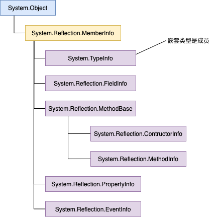
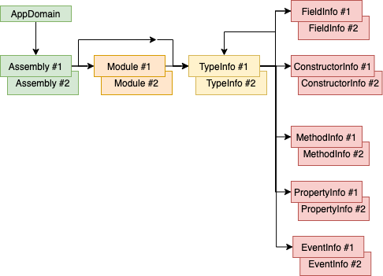

# 第 23 章 程序集加载和反射  

本章内容

* <a href="#23_1">程序集加载</a>
* <a href="#23_2">使用反射构建动态可扩展应用程序</a>
* <a href="#23_3">反射的性能</a>
* <a href="#23_4">设计支持加载项的应用程序</a>
* <a href="#23_5">使用反射发现类型的成员</a>

本章讨论了在编译时对一个类型一无所知的情况下，如何在运行时发现类型的信息、创建类型的实例以及访问类型的成员。可利用本章讲述的内容创建动态可扩展应用程序。在这种情况下，一般是由一家公司创建宿主应用程序，其他公司创建加载项(add-in)来扩展宿主应用程序。宿主不能基于一些具体的加载项来构建和测试，因为加载项由不同公司创建，而且极有可能是在宿主应用程序发布之后才创建的。这是宿主为什么要在运动时发现加载项的原因。

动态可扩展应用程序可利用第 22 章讲述的 CLR 寄宿和 AppDomain。宿主可以在一个 AppDomain 中运行加载项代码，这个 AppDomain 有它自己的安全性和配置设置。宿主还可通过卸载 AppDomain 来卸载加载项。在本章末尾，将花费一点时间来讨论如何将所有这些功能组合到一起————包括 CLR 寄宿、AppDomain、程序集加载、类型发现、实例实例构造和反射————从而构建健壮、安全而且可以动态扩展的应用程序。

> 重要提示 .NET Framework 4.5 引入了新的反射 API。旧的 API 缺点太多。例如，它对 LINQ 的支持不好，内建的策略对某些语言来说不正确，有时不必要地强制加载程序集，而且为很少遇到的问题提供了过于复杂的 API。新 API 解决了所有这些问题。但至少就 .NET 4.5 来说，新的反射 API 还不如旧 API 完整。利用新 API 和 `System.Reflection.RuntimeReflcetionExtensions` 类中的扩展方法，现在所有事情都可以做到。希望在 .NET Framework 未来的版本中为新 API 添加更多的方法。当然，对于桌面应用程序，旧 API 是仍然存在的，重新编译现有的代码不会出任何问题。但新 API 是未来的发展方向，这正是本章要全面讨论新 API 的原因。Windows Store 应用由于不用考虑向后兼容，所以必须使用新 API。

## <a name="23_1">23.1 程序集加载</a>

我们知道，JIT 编译器将方法的 IL 代码编译成本机代码时，会查看 IL 代码中引用了哪些类型。在运行时，JIT 编译器利用程序集的 TypeRef 和 AssemblyRef 元数据表来确定哪一个程序集定义了所引用的类型。在 AssemblyRef 元数据表的记录项中，包含了构成程序集强名称的各个部分。JIT 编译器尝试将与该标识匹配的程序集加载到 AppDomain 中(如果还没有加载的话)。如果被加载的程序集是弱命名的，那么标识中就只包含程序集的名称(不包含版本、语言文化及公钥标记信息)。<sup>①</sup>

> ① 强命名程序集和弱命名程序集的区别请参见 3.1 节 “两种程序集，两种部署”。 ———— 译注

在内部，CLR 使用 `System.Reflection.Assembly` 类的静态 `Load` 方法尝试加载这个程序集。该方法在 .NET Framework SDK 文档中是公开的，可调用它显式地将程序集加载到 AppDomain 中。该方法是 CLR 的与 Win32 `LoadLibrary` 函数等价的方法。`Assembly` 的 `Load` 方法实际有几个重载版本。以下是最常用的重载的原型：

```C#
public class Assembly {
    public static Assembly Load(AssemblyName assemblyRef);
    public static Assembly Load(String assemblyString);
    // 未列出不常用的 Load 重载
}
```

在内部，`Load` 导致 CLR 向程序集应用一个版本绑定重定向策略，并在 GAC(全局程序集缓存)中查找程序集。如果没找到，就接着去应用程序的基目录、私有路径子目录和 `codebase`<sup>②</sup>位置查找。如果调用 `Load` 时传递的是弱命名程序集，`Load` 就不会向程序集应用版本绑定重定向策略，CLR 也不会去 GAC 查找程序集。如果 `Load` 找到指定的程序集，会返回对代表已加载的那个程序集的一个 `Assembly` 对象的引用。如果 `Load` 没有找到指定程序集，会抛出一个 `System.IO.FileNotFoundException` 异常。

>> ② 要了解 `codeBase` 元素指定的位置，请参见 3.9 节“高级管理控制(配置)”。 ———— 译注

> 注意 一些极罕见的情况可能需要加载为特定 CPU 架构生成的程序集。这时在指定程序集的标识时，还可包括一个进程架构部分。例如，假定 GAC 中同时包含了一个程序集的 IL 中立版本和 x86 专用版本，CLR 会默认选择 x86 专用版本(参见 第 3 章 “共享程序集和强命名程序集”)。但是，为了强迫 CLR 加载 IL 中立的版本，可以向 `Assembly` 的 `Load` 方法传递以下字符串：

> `"SomeAssembly, Version=2.0.0.0, Culture=neutral, PublicKeyToken=01234567890abcde, ProcessorArchitecture=MSIL"`

> CLR 目前允许 `ProcessorArchitecture` 取 5 个值之一： `MSIL`(Microsoft IL)、`X86`、`IA64`，`AMD64` 以及 `Arm`。

> 重要提示 一些开发人员可能注意到 `System.AppDomain` 提供了 `Load` 方法。和 `Assembly` 的静态 `Load` 方法不同，`AppDomain` 的`Load` 是实例方法，它允许将程序集加载到指定的 AppDomain 中。该方法设计由非托管调用，允许宿主将程序集“注入” 特定 AppDomain 中。托管代码的开发人员一般情况下不应调用它，因为调用 `AppDomain` 的 `Load` 方法时需要传递一个标识了程序集的字符串。该方法随后会应用策略，并在一些常规位置搜索程序集。我们知道，AppDomain 关联了一些告诉 CLR 如何查找程序集的设置。为了加载这个程序集，CLR 将使用与指定 AppDomain 关联的设置，而非与发出调用之 AppDomain 关联的设置。

> 但 `AppDomain` 的 `Load` 方法会返回对程序集的引用。由于 `System.Assembly` 类不是从 `System.MarshalByRefObject` 派生的，所以程序集对象必须按值封送回发出调用的那个 AppDomain。但是，现在 CLR 就会用发出调用的那个 AppDomain 的设置来定位并加载程序集。如果使用发出调用的那个 AppDomain 的策略和搜索位置找不到指定的程序集，就会抛出一个 `FileNotFoundException`。 这个行为一般不是你所期望的，所以应该避免使用 `AppDomain` 的 `Load` 方法。

在大多数动态可扩展应用程序中，`Assembly` 的 `Load` 方法是将程序集加载到 AppDomain 的首选方法。但它要求事先掌握构成程序集标识的各个部分。开发人员经常需要写一些工具或实用程序(例如 ILDasm.exe，PEVerify.exe，CorFlags.exe，GACUtil.exe，SGen.exe，SN.exe 和 XSD.exe 等)来操作程序集，它们都要获取引用了程序集文件路径名(包括文件扩展名)的命令行实参。

调用 `Assembly` 的 `LoadFrom` 方法加载指定了路径名的程序集：

```C#
public class Assembly {
    public static Assembly LoadFrom(String path);
    // 未列出不常用的 LoadFrom 重载
}
```

在内部 `LoadFrom` 首先调用 `System.Refection.AssemblyName` 类的静态 `GetAssemblyName` 方法，该方法打开指定的文件，找到 `AssemblyRef` 元数据表的记录项，提取程序集标识信息，然后以一个 `System.Reflection.AssemblyName` 对象的形式返回这些信息(文件同时会关闭)。随后，`LoadFrom` 方法在内部调用 `Assembly` 的 `Load` 方法，将 `AssemblyName` 对象传给它。然后，CLR 应用版本绑定重定向策略，并在各个位置查找匹配的程序集。`Load` 找到匹配程序集会加载它，并返回代表已加载程序集的 `Assembly` 对象；`LoadFrom` 方法将返回这个值。如果 `Load` 没有找到匹配的程序集，`LoadFrom` 会加载通过 `LoadFrom` 的实参传递的路径中的程序集。当然，如果已加载了具有相同标识的程序集，`LoadFrom` 方法就会直接返回代表已加载程序集的 `Assembly` 对象。

顺便说一句，`LoadFrom` 方法允许传递一个 URL 作为实参，下面是一个例子：

`Assembly a = Assembly.LoadFrom(@"http://Wintellect.com/SomeAssembly.dll");`

如果传递的是一个 Internet 位置，CLR 会下载文件，把它安装到用户的下载缓存中，再从哪儿加载文件。注意，当前必须联网，否则会抛出异常。但如果文件之前已下载过，而且 Microsoft Internet Explorer 被设为脱机工作(在 Internet Explorer 中单击 “文件”|“脱机工作”)，就会使用以前下载的文件，不会抛出异常。还可以调用 `UnsafeLoadFrom`，它能够加载从网上下载的程序集，同时绕过一些安全检查。

> 重要提示 一台机器可能同时存在具有相同标识的多个程序集。由于 `LoadFrom` 会在内部调用 `Load`，所以 CLR 有可能不是加载你指定的文件，而是加载一个不同的文件，从而造成非预期的行为。强烈建议每次生成程序集时都更改版本号，确保每个版本都有自己的唯一性标识，确保 `LoadFrom` 方法的行为符合预期。

Microsoft Visual Studio 的 UI 设计人员和其他工具一般用的是 `Assembly` 的 `LoadFile` 方法。这个方法可从任意路径加载程序集，而且可以将具有相同标识的程序集多次加载到一个 AppDomain 中。在设计器/工具中对应用程序的 UI 进行了修改，而且用户重新生成了程序集时，便有可能发生这种情况。通过 `LoadFile` 加载程序集时，CLR 不会自动解析任何依赖性问题；你的代码必须向`AppDomain` 的 `AssemblyResolve` 事件登记，并让事件回调方法显式地加载任何依赖的程序集。

如果你构建的一个工具只想通过反射(本章稍后进行讨论)来分析程序集的元数据，并希望确保程序集中的任何代码都不会执行，那么加载程序集的最佳方式就是使用 `Assembly` 的 `ReflectionOnlyLoadFrom` 方法或者使用 `Assembly` 的 `ReflectionOnlyLoad` 方法(后者比较少见)。下面是这两个方法的原型：

```C#
public class Assembly {
    public static Assembly ReflectionOnlyLoadFrom(String assemblyFile);
    public static Assembly ReflectionOnlyLoad(String assemblyString);
    // 未列出不常用的 ReflectionOnlyLoad 重载
}
```

`ReflectionOnlyLoadFrom` 方法加载由路径指定的文件；文件的强名称标识不会获取，也不会在 GAC 和其他位置搜索文件。 `ReflectionOnlyLoad` 方法会在 GAC、应用程序基目录、私有路径和 `codebase` 指定的位置搜索指定的程序集。但和 `Load` 方法不同的是，`ReflectionOnlyLoad` 方法不会应用版本控制策略，所以你指定的是哪个版本，获得的就是哪个版本。要自行向程序集标识应用版本控制策略，可将字符串传给 `AppDomain` 的 `ApplyPolicy` 方法。

用 `ReflectionOnlyLoadFrom` 或 `ReflectionOnlyLoad` 方法加载程序集时，CLR 禁止程序集中的任何代码执行；试图执行由这两个方法加载的程序集中的代码，会导致 CLR 抛出一个 `InvalidOperationException` 异常。这两个方法允许工具加载延迟签名的程序集<sup>①</sup>，这种程序集正常情况下会因为安全权限不够而无法加载。另外，这种程序集也可能是为不同的 CPU 架构而创建的。

> ① 要进一步了解延迟签名的程序集，请参见 3.6 节“延迟签名”。 ———— 译注

利用反射来分析由这两个方法之一加载的程序集时，代码经常需要向 `AppDomain` 的 `ReflectionOnlyAssemblyResolve` 事件注册一个回调方法，以便手动加载任何引用的程序集(如果必要，还需要调用 `AppDomain` 的 `ApplyPolicy` 方法)；CLR 不会自动帮你做这个事情。回调方法被调用(invoke)时，它必须调用(call) `Assembly` 的 `ReflectionOnlyLoadFrom` 或 `ReflectionOnlyLoad` 方法来显式加载引用的程序集，并返回对该程序集的引用。

> 注意 经常有人问到程序集卸载的问题。遗憾的是，CLR 不提供卸载单独程序集的能力。如果 CLR 允许这样做，那么一旦线程从某个方法返回至已卸载的一个程序集中的代码，如果允许应用程序以这样的一种方式崩溃，就和它的设计初衷背道而驰了。卸载程序集必须卸载包含它的整个 AppDomain。这方面的详情已在第 22 章“CLR 寄宿和 AppDomain”进行了讨论。

> 使用 `ReflectionOnlyLoadFrom` 或 `ReflectionOnlyLoad` 方法加载的程序集表面上是可以卸载的。毕竟，这些程序集中的代码是不允许执行的。但 CLR 一样不允许执行的。但 CLR 一样不允许卸载用这两个方法加载的程序集。因为用这两个方法加载了程序集之后，仍然可以利用反射来创建对象，以便引用这些程序集中定义的元数据。如果卸载程序集，就必须通过某种方式使这些对象，以便引用这些程序集中定义的元数据。仍然可以利用反射来创建对象，以便引用这些程序集中定义的元数据。如果卸载程序集，就必须通过某种方式使这些对象失效。无论是实现的复杂性，还是执行速度，跟踪这些对象的状态都是得不偿失的。

许多应用程序都由一个要依赖于众多 DLL 文件的 EXE 文件构成。部署应用程序时，所有文件都必须部署。但有一个技术允许只部署一个 EXE 文件。首先标识出 EXE 文件。首先标识出 EXE 文件要依赖的、不是作为 Microsoft .NET Framework 一部分发布的所有 DLL 文件。然后将这些 DLL 添加到 Visual Studio 项目中。对于添加的每个 DLL，都显示它的属性，将它的“生成操作“更改为”嵌入的资源“。这会导致 C# 编译器将 DLL 文件嵌入 EXE  文件中，以后就只需部署这个 EXE。

在运行时，CLR 会找不到依赖的 DLL 程序集。为了解决这个问题，当应用程序初始化时，向 `AppDomain` 的 `ResolveAssembly` 事件登记一个回调方法。代码大致如下：

```C#
private static Assembly ResolveEventHandler(Object sender, ResolveEventArgs args) {
    String dllName = new AssemblyName(args.Name).Name + ".dll";

    var assem = Assembly.GetExecutingAssembly();
    String resourceName = assem.GetManifestResourceNames().FirstOrDefault(rn => rn.EndsWith(dllName));
    if(resourceName == null) return;    // Not found, maybe another handler will find it 
    using (var stream = assem.GetManifestResourceStream(resourceName)) {
        Byte[] assemblyData = new Byte[stream.Length];
        stream.Read(assemblyData, 0, assemblyData.Length);
        return Assembly.Load(assemblyData);
    }
}
```

现在，线程首次调用一个方法时，如果发现该方法引用了依赖 DLL 文件中的类型，就会引发一个 `AssemblyResolve` 事件，而上述回调代码会找到所需的嵌入 DLL 资源，并调用 `Assembly` 的 `Load` 方法获取一个 `Byte[]` 实参的重载版本来加载所需的资源。虽然我喜欢将依赖 DLL 程序集的技术，但要注意这会增大应用程序在运行时的内存消耗。

## <a name="23_2">23.2 使用反射构建动态可扩展应用程序</a>

众所知周，元数据是用一系列表来存储的。生成程序集或模块时，编译器会创建一个类型定义表、一个字段定义表、一个方法定义表以及其他表。利用 `System.Reflection` 命名空间中的其他类型，可以写代码来反射(或者说”解析“)这些元数据表。实际上，这个命名空间中类型为程序集或模块中包含的元数据提供了一个对象模型。

利用对象模型中的类型，可以轻松枚举类型定义元数据表中的所有类型，而针对每个类型都可获取它的基类型、它实现的接口以及与类型关联的标志(flag)。利用 `System.Reflection` 命名空间中的其他类型，还可解析对应的元数据表来查询类型的字段、方法、属性和事件。还可发现应用于任何元数据实体的定制特性(详情参见第 18 章”定制特性“)。甚至有些类允许判断引用的程序集；还有一些方法能返回一个方法的 IL 字节流。利用所有这些信息，很容易构建出与 Microsoft 的 ILDasm.exe 相似的工具。

> 注意 有的反射类型及其成员时专门由 CLR 编译器的开发人员使用的。应用程序的开发人员一般用不着。FCL 文档没有明确指出哪些类型和成员供编译器开发人员(而非应用程序开发人员)使用，但只要意识到有些反射类型及其成员不适合所有人使用，该文档时就会更清醒一些。

事实上，只有极少数应用程序才需使用反射类型。如果类库需要理解类型的定义才能提供丰富的功能，就适合使用反射。例如，FCL 的序列化机制(详情参见第 24 章”运行时序列化”)就是利用反射来判断类型定义了哪些字段。然后，序列化格式器(serialization formatter)可获取这些字段的值，把它们写入字节流以便通过 Internet 传送、保存到文件或复制到剪贴板。类似地，在设计期间，Microsoft Visual Studio 设计器在 Web 窗体或 Windows 窗体上放置控件时，也利用反射来决定要向开发人员显示的属性。

在运行时，当应用程序需要从特定程序集中加载特定类型以执行特定任务时，也要使用反射。例如，应用程序可要求用户提供程序集和类别名。然后，应用程序可显式加载程序集，构造类型的实例，再调用类型中定义的方法。这种用法在概念上类似于调用 Win32 `LoadLibrary` 和 `GetProcAddress` 函数。以这种用法在概念上类似于调用 Win32 `LoadLibrary` 和 `GetProAddress` 函数。以这种方式绑定到类型并调用方法称为**晚期绑定**。(对应的，早期绑定是指在编译时就确定应用程序要使用的类型和方法。)

## <a name="23_3">23.3 反射的性能</a>

反射是相当强大的机制，允许在运行发现并使用编译时还不了解的类型及其成员。但是，它也有下面两个缺点。

* 反射造成编译时无法保证类型安全性。由于反射严重依赖字符串，所以会丧失编译时的类型安全性。例如，执行 `Type.GetType("int")`；要求通过反射在程序集中查找名为“int”的类型，代码会通过编译，但在运行时会返回 `null`，因为 CLR 只知 `"System.Int32"`，不知道`"int"`。

* 反射速度慢。使用反射时，类型及其成员的名称在编译时未知；你要用字符串名称标识每个类型及其成员，然后在运行时发现它们。也就是说，使用 `System.Reflection` 命名空间中的类型扫描程序集的元数据时，反射机制会不停地执行字符串搜索。通常，字符串搜索执行的是不区分大小写的比较，这会进一步影响速度。

使用反射调用成员也会影响性能。用反射调用方法时，首先必须将实参打包(pack)成数组；在内部，反射必须将这些实参解包(unpack)到线程栈上。此外，在调用方法前，CLR 必须检查实参具有正确的数据类型。最后，CLR 必须确保调用者有正确的安全权限来访问被调用的成员。

基于上述所有原因，最好避免利用反射来访问字段或调用方法/属性。应该利用一下两种技术之一开发应用程序来动态发现和构造类型实例。

* 让类型从编译时已知的基类型派生。在运行时构造派生类型的实例，将对它的引用方法放到基类型的变量中(利用转型)，再调用基类型定义的虚方法。

* 让类型实现编译时已知的接口。在运行时构造类型的实例，将对它的引用放到接口类型的变量中(利用转型)，再调用接口定义的方法。

在这两种技术中，我个人更喜欢使用接口技术而非基类技术，因为基类技术不允许开发人员选择特定情况下工作得最好的基类。不过，需要版本控制的时候基类技术更合适，因为可随时向基类型添加成员，派生类会直接继承该成员。相反，要向接口添加程成员，实现该接口的所有类型都得修改它们的代码并重新编译。

使用这两种技术时，强烈建议接口或基类型在它们自己的程序集中定义，这有助于缓解版本控制问题。欲知详情，请参见稍后的 23.4 节“设计支持加载项的应用程序”。

### 23.3.1 发现程序集中定义的类型

反射经常用于判断程序集定义了哪些类型。FCL 提供了许多 API 来获取这方面的信息。目前最常用的 API 是 `Assembly` 的 `ExportedTypes` 属性。下例加载一个程序集，并显示其中定义的所有公开导出的类型<sup>①<sup>:

> ① 所谓公开导出的类型，就是程序集中定义的 `public` 类型，它们在程序集的外部可见。 ———— 译注

```C#
using System;
using System.Reflection;

public static class Program {
    public static void Main() {
        String dataAssembly = "System.Data, version=4.0.0.0, "
            + "culture=neutral, PublicKeyToken=b77a5c561934e089";
        LoadAssemAndShowPublicTypes(dataAssembly);
    }

    private static void LoadAssemAndShowPublicTypes(String assemId) {
        // 显式地将程序集加载到这个 AppDomain 中
        Assembly a = Assembly.Load(assemId);

        // 在一个循环中显示已加载程序集中每个公开导出 Type 的全名
        foreach (Type t in a.ExportedTypes) {
            // 显示类型全名
            Console.WriteLine(t.FullName);
        }
    }
}
```

### 23.3.2 类型对象的准确含义

注意，上述代码遍历 `System.Type` 对象构成的数组。 `System.Type` 类型是执行类型和对象操作的起点。`System.Type` 对象代表一个类型引用(而不是类型定义)。

众所周知，`System.Object` 定义了公共非虚实例方法 `GetType`。调用这个方法时，CLR 会判断指定对象的类型，并返回对该类型的 `Type` 对象的引用。由于在一个 AppDomain 中，每个类型只有一个 `Type` 对象，所以可以使用相等和不等操作符来判断两个对象是不是相同的类型：

```C#
private static Boolean AreObjectsTheSameType(Object o1, Object o2) {
    return o1.GetType() == o2.GetType();
}
```

除了调用 `Object` 的 `GetType` 方法， FCL 还提供了获得 `Type` 对象的其他几种方式。

* `System.Type` 类型提供了静态 `GetType` 方法的几个重载版本。所有版本都接收一个 `String` 参数。字符串必须指定类型的全名(包括它的命名空间)。注意不允许使用编译器支持的基元类型(比如 C# 的 `int`，`string`，`bool`等)，这些名称对于 CLR 没有任何意义。如果传递的只是一个类型名称，方法将检查调用程序集，看它是否定义了指定名称的类型。如果是，就返回对恰当 `Type` 对象的引用。

如果调用程序集没有定义指定的类型，就检查 MSCorLib.dll 定义的类型。如果还是没有找到，就返回 `null` 或抛出 `System.TypeLoadException`(取决于调用的是 `GetType` 方法的哪个重载，以及传递的是什么参数)。文档对该方法进行了完整解释。

可向 `GetType` 传递限定了程序集的类型字符串，比如`"System.Int32, mscorlib, Version=4.0.0.0, Culture=neutral, PublicKeyToken=b77a5c561934e089"`。在本例中，`GetType` 会在指定程序集中查找类型(如有必要会加载程序集)。

* `System.Type` 类型提供了静态 `ReflectionOnlyGetType` 方法。该方法与上一条提到的 `GetType` 方法在行为上相似，只是类型会以“仅反射”的方式加载，不能执行。

* `System.TypeInfo` 类型提供了实例成员 `DeclaredNestedTypes` 和 `GetDeclaredNestedType`.

* `System.Reflection.Assembly` 类型提供了实例成员 `GetType`，`DefinedTypes` 和 `ExportedTypes`。

> 注意 构造传给反射方法的字符串时，要使用类型名称或限定了程序集的类型名称。Microsoft 为这些名称定义了巴克斯——诺尔范式(Backus-MaurForm， BNF)语法。使用反射时，了解这种语法对你很有帮助，尤其是在处理嵌套类型、泛型类型、泛型类型、引用参数或者数组的时候。要想了解完整语法，请参考文档<sup>①</sup>或者 Google “BNF 类型名称”。还可参考 `Type` 和 `TypeInfo` 的 `MakeArrayType,MakeByRefType,MakeGenericType` 和 `MakePointerType` 方法。

> ① 参考文档中的 “指定完全限定的类型名称”主题。————译注

许多编程语言都允许使用一个操作符并根据编译时已知的类型名称来获得 `Type` 对象。尽量用这个操作符获得 `Type` 引用，而不要使用上述列表中的任何方法，因为操作符生成的代码通常更快。C# 的这个操作符称为 `typeof`，通常用它将晚期绑定的类型信息与早期绑定(编译时已知)的类型信息进行比较。以下代码演示了一个例子：

```C#
private static void SomeMethod(Object o) {
    // GetType 在运行时返回对象的类型(晚期绑定)
    // typeof 返回指定类的类型(早期绑定)
    if (o.GetType() == typeof(FileInfo)) { ... }
    if (o.GetType() == typeof(DirectoryInfo)) { ... }
}
```

> 注意 上述代码的第一个 `if` 语句检查变量 `o` 是否引用了 `FileInfo` 类型的对象；它不检查 `o` 是否引用从 `FileInfo` 类型派生的对象。换言之，上述代码测试的是精确匹配，而非兼容匹配，(使用转型或 C# 的 `is/as` 操作符时，测试的就是兼容匹配。)

如前所述，`Type` 对象是轻量级的对象引用。要更多地了解类型本身，必须获取一个 `TypeInfo` 对象，后者才代表类型定义。可调用 `System.Reflection.IntrospectionExtensions` 的 `GetTypeInfo` 扩展方法将 `Type` 对象转换成 `TypeInfo` 对象。

```C#
Type typeReference = ...;       // 例如： o.GetType() 或者 typeof(Object)
TypeInfo typeDefinition = typeReference.GetTypeInfo();
```

另外，虽然作用不大，但还可调用 `TypeInfo` 的 `AsType` 方法将 `TypeInfo` 对象转换成 `Type` 对象。

```C#
TypeInfo typeDefinition = ...;
Type typeReference = typeDefinition.AsType();
```

获取 `TypeInfo` 对象会强迫 CLR 确保已加载类型的定义程序集，从而对类型进行解析。这个操作可能代价高昂。如果只需要类型引用(`Type` 对象)，就应避免这个操作。但一旦获得了 `TypeInfo` 对象，就可查询类型的许多属性进一步了解它。大多数属性，比如 `IsPublic`，`IsSealed`，`IsAbstract`，`IsClass` 和 `IsValueType` 等，都指明了与类型关联的标志。另一些属性，比如 `Assembly`，`AssemblyQualifiedName`,`FullName` 和 `Module` 等，则返回定义该类型的程序集或模块的名称以及类型的全名。还可查询 `BaseType` 属性来获取对类型的基类型的引用。除此之外，还有许多方法能提供关于类型的更多信息。文档描述了 `TypeInfo` 公开的所有方法和属性。

### 23.3.3 构建 Exception 派生类型的层次结构

以下代码使用本章讨论的许多概念将一组程序集加载到 AppDomain 中，并显示最终从 `System.Exception` 派生的所有类型。顺便说一句，20.4 节 “FCL 定义的异常类” 展示的 `Exception` 层次结构就是用这个程序显示的。

```C#
public static void Go() {
    // 显式加载想要反射的程序集
    LoadAssemblies();

    // 对所有类型进行筛选和排序
    var allTypes = (from a in AppDomain.CurrentDomain.GetAssemblies()
                    from t in a.ExportedTypes
                    where typeof(Exception).GetTypeInfo().IsAssignableFrom(t.GetTypeInfo())
                    orderby t.Name
                    select t).ToArray();

    // 生成并显示继承层次结构
    Console.WriteLine(WalkInheritanceHierarchy(new StringBuilder(), 0, typeof(Exception), allTypes));
}

private static StringBuilder WalkInheritanceHierarchy(StringBuilder sb, Int32 indent, Type baseType, IEnumerable<Type> allTypes) {
    String spaces = new String(' ', indent * 3);
    sb.AppendLine(spaces + baseType.FullName);
    foreach (var t in allTypes) {
        if (t.GetTypeInfo().BaseType != baseType) continue;
        WalkInheritanceHierarchy(sb, indent + 1, t, allTypes);
    }
    return sb;
}

private static void LoadAssemblies() {
    String[] assemblies = {
        "System, PublicKeyToken={0}",
        "System.Core, PublicKeyToken={0}",
        "System.Data, PublicKeyToken={0}",
        "System.Design, PublicKeyToken={1}",
        "System.DirectoryServices, PublicKeyToken={1}",
        "System.Drawing, PublicKeyToken={1}",
        "System.Drawing.Design, PublicKeyToken={1}",
        "System.Management, PublicKeyToken={1}",
        "System.Messaging, PublicKeyToken={1}",
        "System.Runtime.Remoting, PublicKeyToken={0}",
        "System.Security, PublicKeyToken={1}",
        "System.ServiceProcess, PublicKeyToken={1}",
        "System.Web, PublicKeyToken={1}",
        "System.Web.RegularExpressions, PublicKeyToken={1}",
        "System.Web.Services, PublicKeyToken={1}",
        "System.Xml, PublicKeyToken={0}"
    };

    String EcmaPublicKeyToken = "b77a5c561934e089";
    String MSPublicKeyToken = "b03f5f7f11d50a3a";

    // 获取包含 System.Object 的程序集的版本，
    // 假定其他所有程序集都是相同的版本
    Version version = typeof(System.Object).Assembly.GetName().Version;

    // 显示加载想要反射的程序集
    foreach (String a in assemblies) {
        String AssemblyIdentity = String.Format(a, EcmaPublicKeyToken, MSPublicKeyToken) + 
            ", Culture=neutral, Version=" + version;
        Assembly.Load(AssemblyIdentity);
    }
}
```

### 23.3.4 构造类型的实例

获得对 `Type` 派生对象的引用之后，就可以构造该类型的实例了。FCL 提供了以下几个机制。

* `System.Activator` 的 `CreateInstance` 方法  
  `Activator` 类提供了静态 `CreateInstance` 方法的几个重载版本。调用方法时既可传递一个 `Type` 对象引用，也可传递标识了类型的 `String`。直接获取类型对象的几个版本较为简单。你要为类型的构造器传递一组实参，方法返回对新对象的引用。
  用字符串来指定类型的几个版本则稍微复杂一些。首先必须指定另一个字符串来标识定义了类型的程序集。其次，如果正确匹配了远程访问(remoting)选项，这些方法还允许构造远程对象。第三，这次版本返回的不是对新对象的引用，而是一个 `System.Runtime.Remoting.ObjectHandle` 对象(从 `System.MarshalByRefObject` 派生)。`ObjectHandle`类型允许将一个 AppDomain 中创建的对象传至其他 AppDomain，期间不强迫对象具体化(materialize)。准备好具体化这个对象时，请调用 `ObjectHandle` 的 `Unwrap` 方法。在一个 AppDomain 中调用该方法时，它将定义了要具体化的类型的程序集加载到这个 AppDomain 中。如果对象按引用封送，会创建代理类型和对象。如果对象按值封送，对象的副本会被反序列化。

* `System.Activator` 的 `CreateInstanceFrom` 方法  
  `Activator` 类还提供了一组静态 `CreateInstanceFrom` 方法。它们与 `CreateInstance` 的行为相似，只是必须通过字符串参数来指定类型及其程序集。程序集用 `Assembly` 的 `LoadFrom`(而非 Load)方法加载到调用 `AppDomain` 中。由于都不接受 Type 参数，所以返回的都会一个`ObjectHandle` 对象引用，必须调用 `ObjectHandle` 的 `Unwrap` 方法进行具体化。
  
* `System.AppDomain` 的方法  
  `AppDomain` 类型提供了 4 个用于构造类型实例的实例方法(每个都有几个重载版本)，包括 `CreateInstance`，`CreateInstanceAndUnwrap`，`CreateInstanceFrom` 和 `CreateInstanceFromAndUnwrap`。这些方法的行为和 `Activator` 类的方法相似，区别在于它们都是实例方法，允许指定在哪个 AppDomain 中构造对象。另外，带 `Unwrap` 后缀的方法还能简化操作，不必执行额外的方法调用。

* `System.Reflection.ConstructorInfo` 的 `Invoke` 实例方法  
  使用一个 `Type` 对象引用，可以绑定到一个特定的构造器，并获取对构造器的 `ConstructorInfo` 对象的引用。然后，可利用 `ConstructorInfo` 对象引用来调用它的 `Invoke` 方法。类型总是在调用 AppDomain 中创建，返回的是对新对象的引用。本章稍后会详细讨论该方法。
  
> 注意 CLR 不要求值类型定义任何构造器。但这会造成一个问题，因为上述列表中的所有机制都要求调用构造器来构造对象。然而，`Activator` 的`CreateInstance` 方法允许在不调用构造器的情况下创建值类型的实例。要在不调用构造器的情况下创建值类型的实例，必须调用 `CreateInstance` 方法获取单个 `Type` 参数的版本或者获取 `Type` 和 `Boolean` 参数的版本。

利用前面列出的机制，可为出数组(`System.Array` 派生类型)和委托(`System.MulticastDelegate` 派生类型)之外的所有类型创建对象。创建数组需要调用 `Array` 的静态 `CreateInstance` 方法(有几个重载的版本)。所有版本的 `CreateInstance` 方法获取的第一个参数都是对数组元数 `Type` 的引用。`CreateInstance` 的其他参数允许指定数组维数和上下限的各种组合。创建委托则要调用 `MethodInfo` 的静态 `CreateDelegate` 方法。所有版本的 `CreateDelegate` 方法获取的第一个参数都是对委托 `Type` 的引用。`CreateDelegate` 方法的其他参数允许指定在调用实例方法时应将哪个对象作为 `this` 参数传递。

构造泛型类型的实例首先要获取对开放类型的引用，然后调用 `Type` 的 `MakeGenericType` 方法并向其传递一个数组(其中包含要作为类型实参使用的类型)<sup>①</sup>。然后，获取返回的 `Type` 对象并把它传给上面列出的某个方法。下面是一个例子：

> ① 要想进一步了解开放类型、封闭类型、类型参数和类型实参等术语，请参见第 12 章 “泛型”。———— 译注

```C#
using System;
using System.Reflection;

internal sealed class Dictionary<Tkey, TValue> { }

public static class Program {
    public static void Main() {
        // 获取对泛型类型的类型对象的引用
        Type openType = typeof(Dictionary<,>);

        // 使用 TKey=String、TValue=Int32 封闭泛型类型 ①
        Type closedType = openType.MakeGenericType(typeof(String), typeof(Int32));

        // 构造封闭类型的实例
        Object o = Activator.CreateInstance(closedType);

        // 证实能正常工作
        Console.WriteLine(o.GetType());
    }
}
```

> ① 开放类型变成了封闭类型。 ———— 译注

编译并运行上述代码得到以下输出：

```cmd
Dictionary`2[System.String,System.Int32]
```

## <a name="23_4">23.4 设计支持加载项的应用程序</a>

构建可扩展应用程序时，接口是中心。可用基类代替接口，但接口通常是首选的，因为它允许加载项开发人员选择他们自己的基类。例如，假定要写一个应用程序来无缝地加载和使用别人创建的类型。下面描述了如何设计这种应用程序。

* 创建“宿主 SDK”(Host SDK)程序集，它定义了一个接口，接口的方法作为宿主应用程序与加载项之间的通信机制使用。为接口方法定义参数和返回类型时，请尝试使用 MSCorLib.dll 中定义的其他接口或类型。要传递并返回自己的数据类型，也在“宿主 SDK”程序集中定义。一旦搞定接口定义，就可为这个程序集赋予强名称(参见第 3 章)，然后把它打包并部署到合作伙伴和用户那里。发布后要避免对该程序集中的类型做出任何重大的改变。例如，不要以任何方式更改接口。但如果定义了任何数据类型，在类型中添加新成员是完全允许的。对程序集进行任何修改之后，可能需要使用一个发布者策略文件来部署它(也参见第 3 章的讨论)。

> 注意 之所以能使用 MSCorLib.dll 中定义的类型，是因为 CLR 总是加载与 CLR 本身的版本匹配的那个版本的 MSCorLib.dll。此外，一个 CLR 实例只会加载一个版本的 MSCorLib.dll 。换言之，永远不会出现多个不同版本的 MSCorLib.dll 都加载的情况(详见第 3 章)。最后结果就是，绝不会出现类型版本不匹配的情况。这还有助于减少应用程序对内存的需求。

* 当然，加载项开发人员会在加载项程序集中定义自己的类型。这些程序集将引用你的“宿主”程序集中的类型。加载项开发人员可按自己的步骤推出程序集的新版本，而宿主应用程序能正常使用加载项中的类型，不会出任何纰漏。

* 创建单独的“宿主应用程序”程序集，在其中包含你的应用程序的类型。这个程序集显然要引用“宿主 SDK”程序集，并使用其中定义的类型。可自由修改“宿主应用程序”程序集的代码。由于加载项开发人员不会引用这个“宿主应用程序”程序集的新版本，这不会对加载项开发人员产生任何影响。

本节包含了一些非常重要的信息。跨程序集使用类型时，需要关注程序集的版本控制问题。要花一些时间精心建构，将跨程序集通信的类型隔离到它们自己的程序集中。要避免以后更改这些类型的定义。但是，如果真的要修改类型定义，一定要修改程序集的版本号，并为新版本的程序集创建发布者策略文件。

下面来看一个非常简单的例子，它综合运用了所有这些知识。首选是 HostSDK.dll 程序集的代码：

```C#
using System;

namespace Wintellect.HostSDK {
    public interface IAddIn {
        String DoSomething(Int32 x);
    }
}
```

其次是 AddInTypes.dll 程序集的代码，其中定义了两个公共类型，它们实现了 HostSDK.dll 的接口。要生成该程序集，必须引用 HostSDK.dll 程序集：

```C#
using System;
using Wintellect.HostSDK;

public sealed class AddIn_A : IAddIn {
    public AddIn_A() {         
    }
    public String DoSomething(Int32 x) {
        return "AddIn_A: " + x.ToString();
    }
}

public sealed class AddIn_B :IAddIn {
    public AddIn_B() {
    }
    public String DoSomething(Int32 x) {
        return "AddIn_B: " + (x * 2).ToString();
    }
}
```

然后是一个简单的 Host.exe 程序集(控制台应用程序)的代码。生成该程序集必须引用 HostSDK.dll 程序集。为了发现有哪些可用的加载项类型，以下宿主代码假定类型是在一个以 .dll 文件扩展名结尾的程序集中定义的，而且这些程序集已部署到和宿主的 EXE 文件相同的目录中。 Microsoft 的“托管可扩展性框架”(Managed Extensibility Framework， MEF)是在我刚才描述的各种机制的顶部构建的，它提供了加载项注册和发现机制。构建动态可扩展引用程序时，强烈建议研究一下 MEF，它能简化本章描述的一些操作。

```C#
using System;
using System.IO;
using System.Reflection;
using System.Collections.Generic;
using Wintellect.HostSDK;

public static class Program {
    public static void Main() {
        // 查找宿主 EXE 文件所在的目录
        String AddInDir = Path.GetDirectoryName(Assembly.GetEntryAssembly().Location);

        // 假定加载项程序集合宿主 EXE 文件在同一个目录
        var AddInAssemblies = Directory.EnumerateFiles(AddInDir, "*.dll");

        // 创建可由宿主使用的所有加载 Type 的一个集合
        var AddInTypes =
            from file in AddInAssemblies
            let assembly = Assembly.Load(file)
            from t in assembly.ExportedTypes // 公开导出的类型
            // 如果类型实现了 IAddIn 接口，该类型就可由宿主使用
            where t.IsClass && typeof(IAddIn).GetTypeInfo().IsAssignableFrom(t.GetTypeInfo())
            select t;
        // 初始化完成：宿主已发现了所有可用的加载项

        // 下面示范宿主如何构造加载项对象并使用它们
        foreach (Type t in AddInTypes) {
            IAddIn ai = (IAddIn)Activator.CreateInstance(t);
            Console.WriteLine(ai.DoSomething(5));
        }
    }
}
```

这个简单的宿主/加载项例子没有用到 AppDomain。但在实际应用中，每个加载项都可能要在自己的 AppDomain 中创建，每个 AppDomain 都有自己的安全性和配置设置。当然，如果希望将加载项从内存中移除，可以卸载相应的 AppDomain。为了跨 AppDomain 边界通信，可告诉加载项开发人员从 `MarshalByRefObject` 派生出他们自己的加载类型。但另一个更常见的办法是让宿主应用程序定义自己的、从 `MarshalByRefObject` 派生的内部类型。每个 AppDomain 创建好后，宿主要在新 AppDomain 中创建它自己的 `MarshalByRefObject` 派生类型实例。宿主的代码(位于默认 AppDomain 中)将与它自己的类型(位于其他 AppDomain 中)通信，让后者载入加载项程序集，并创建和使用加载的类型的实例。


## <a name="23_5">23.5 使用反射发现类型的成员</a>

到目前为止，本章的重点一直都是构建动态可扩展应用程序所需的反射机制，包括程序集加载、类型发现以及对象构造。要获得好的性能和编译时的类型安全性，应尽量避免使用反射。如果是动态可扩展应用程序，构造好对象后，宿主代码一般要将对象转型为编译时已知的接口类型或者基类。这样访问对象的成员就可以获得较好的性能，而且可以确保编译时的类型安全性。

本章剩余部分将从其他角度探讨反射，目的是发现并调用类型的成员。一般利用这个功能创建开发工具和实用程序，查找特定编程模式或者对特定成员的使用，从而对程序集进行分析。例子包括 ILDasm，FxCopCmd.exe 以及 Visual Studio 的 Windows 窗体/WPF/Web 窗体设计器。另外，一些类库也利用这个功能发现和调用类型的成员，为开发人员提供便利和丰富的功能。例子包括执行序列化/反序列化以及简单数据绑定的类库。

### 23.5.1 发现类型的成员 

字段、构造器、方法、属性、事件和嵌套类型都可以定义成类型的成员。FCL 包含抽象基类 `System.Reflection.MemberInfo` ，封装了所有类型成员都通用的一组属性。`MemberInfo` 有许多派生类，每个都封装了与特定类型成员相关的更多属性。图 23-1 是这些类型的层次结构。

  

图 23-1 封装了类型成员信息的反射类型层次结构

以下程序演示了如何查询类型的成员并显示成员的信息。代码处理的是由调用 AppDomain 加载的所有程序集定义的所有公共类型。对每个类型都调用 `DeclaredMembers` 属性以返回由 `MemeberInfo` 派生对象构成的集合；每个对象都引用类型中定义的一个成员。然后，显示每个成员的种类(字段、构构造器、方法和属性等)及其字符串值(调用 `ToString` 来获取)。


```C#
using System;
using System.Reflection;

public static class Program {
    public static void Main() {
        // 遍历这个 AppDomain 中加载的所有程序集
        Assembly[] assemblies = AppDomain.CurrentDomain.GetAssemblies();
        foreach (Assembly a in assemblies) {
            Show(0, "Assembly: {0}", a);

            // 查找程序集中的类型
            foreach (Type t in a.ExportedTypes) {
                Show(1, "Type: {0}", t);

                // 发现类型的成员
                foreach (MemberInfo mi in t.GetTypeInfo().DeclaredMembers) {
                    String typeName = String.Empty;
                    if (mi is Type) typeName = "(Nested) Type";
                    if (mi is FieldInfo) typeName = "FieldInfo";
                    if (mi is MethodInfo) typeName = "MethodInfo";
                    if (mi is ConstructorInfo) typeName = "ConstructorInfo";
                    if (mi is PropertyInfo) typeName = "PropertyInfo";
                    if (mi is EventInfo) typeName = "EventInfo";
                    Show(2, "{0}: {1}", typeName, mi);
                }
            }
        }
    }

    private static void Show(Int32 indent, String format, params Object[] args) {
        Console.WriteLine(new String(' ', 3 * indent) + format, args);
    }
}
```

编译并运行上述代码会产生大量输出。下面摘录了其中一小部分：

```cmd
Assembly: mscorlib, Version=4.0.0.0, Culture=neutral, PublicKeyToken=b77a5c561934e089
 Type: System.Object
 MethodInfo: System.String ToString()
 MethodInfo: Boolean Equals(System.Object)
 MethodInfo: Boolean Equals(System.Object, System.Object)
 MethodInfo: Boolean ReferenceEquals(System.Object, System.Object)
 MethodInfo: Int32 GetHashCode()
 MethodInfo: System.Type GetType()
 MethodInfo: Void Finalize()
 MethodInfo: System.Object MemberwiseClone()
 MethodInfo: Void FieldSetter(System.String, System.String, System.Object)
 MethodInfo: Void FieldGetter(System.String, System.String, System.Object ByRef)
 MethodInfo: System.Reflection.FieldInfo GetFieldInfo(System.String, System.String)
 ConstructoInfo: Void .ctor()
 Type: System.Collections.Generic.IComparer`1[T]
 MethodInfo: Int32 Compare(T, T)
 Type: System.Collections.IEnumerator
 MethodInfo: Boolean MoveNext()
 MethodInfo: System.Object get_Current()
 MethodInfo: Void Reset()
 PropertyInfo: System.Object Current
 Type: System.IDisposable
 MethodInfo: Void Dispose()
 Type: System.Collections.Generic.IEnumerator`1[T]
 MethodInfo: T get_Current()
 PropertyInfo: T Current
 Type: System.ArraySegment`1[T]
 MethodInfo: T[] get_Array()
 MethodInfo: Int32 get_Offset()
 MethodInfo: Int32 get_Count()
 MethodInfo: Int32 GetHashCode()
 MethodInfo: Boolean Equals(System.Object)
 MethodInfo: Boolean Equals(System.ArraySegment`1[T])
 MethodInfo: Boolean op_Equality(System.ArraySegment`1[T], System.ArraySegment`1[T])
 MethodInfo: Boolean op_Inequality(System.ArraySegment`1[T], System.ArraySegment`1[T])
 ConstructoInfo: Void .ctor(T[])
 ConstructoInfo: Void .ctor(T[], Int32, Int32)
 PropertyInfo: T[] Array
 PropertyInfo: Int32 Offset
 PropertyInfo: Int32 Count
 FieldInfo: T[] _array
 FieldInfo: Int32 _offset 
```

由于 `MemberInfo` 类是成员层次结构的根，所以有必要更深入地研究一下它。表 23-1 展示了 `MemberInfo` 类提供的几个只读属性和方法。这些属性和方法是一个类型的所有成员都通用的。不要忘了 `System.TypeInfo` 从 `MemberInfo` 派生。 `TypeInfo` 也提供了表 23-1 列出的所有属性。

表 23-1 MemberInfo 的所有派生类型都通用的属性和方法

|成员名称|成员类型|说明|
|---|---|---|
|`Name`|一个 `String` 属性| 返回成员名称|
|`DeclaringType`| 一个 `Type` 属性|返回声明成员的 `Type`|
|`Module`|一个 `Module` 属性| 返回声明成员的 `Module`|
|`CustomAttributes`|该属性返回一个 `IEnumerable<CustomAttributeData>`|返回一个集合，其中每个元素都标识了应用于该成员的一个定制特性的实例。定制特性可应用于任何成员。虽然 `Assembly` 不从 `MemberInfo` 派生，但它提供了可用于程序集的相同属性|

在查询 `DeclaredMemebers` 属性所返回的集合中，每个元素都会对层次结构中的一个具体类型的引用。虽然 `TypeInfo` 的 `DeclaredMembers` 属性能返回类型的所有成员，但还可利用 `TypeInfo` 提供的一些方法返回具有指定字符串名称的成员类型。例如，利用 `TypeInfo` 的 `GetDeclaredNestedType`，`GetDeclaredField`，`GetDeclaredMethod`，`GetDeclaredProperty` 和 `GetDeclaredEvent` 方法，可分别返回一个 `TypeInfo`、`FieldInfo`、`MethodInfo`、`PropertyInfo` 和 `EventInfo` 对象引用。而利用`GetDeclaredMethods`方法能返回由`MethodInfo`对象构成的集合，这些对象描述了和指定字符串名称匹配的一个(多个)方法。

图 23-2 总结了用于遍历反射对象模型的各种类型。基于 AppDomain，可发现其中加载的所有程序集。基于程序集，可发现构成它的所有模块。基于程序集或模块，可发现它定义的所有类型。基于类型，可发现它的嵌套类型、字段、构造器、方法、属性和事件。命名空间不是这个层次结构的一部分，因为它们只是从语法角度将相关类型聚集到一起。CLR 不知道什么是命名空间。要列出程序集中定义的所有命名空间，需枚举程序集中的所有类型，并查看其 `Namespace` 属性。

  

图 23-2 应用程序用于遍历反射对象模型的各种类型

基于一个类型，还可发现它实现的接口。基于构造器、方法、属性访问器方法或者事件的添加/删除方法，可调用 `GetParameters` 方法来获取由 `ParameterInfo` 对象构成的数组，从而了解成员的参数的类型。还可查询只读属性 `ReturnParameter` 获得一个 `ParameterInfo` 对象，它详细描述了成员的返回类型。对于泛型类型或方法，可调用 `GetGenericArguments` 方法来获得类型参数的集合。最后，针对上述任何一项，都可查询 `CustomAttributes` 属性来获得应用于它们的自定义定制特性的集合。

### 23.5.2 调用类型的成员

发现类型定义的成员后可调用它们。“调用”(invoke)的确切含义取决于要调用的成员的种类。表 23-2 展示了为了调用(invoke)一种成员而需调用(call)的方法。

表 23-2 如何调用成员
|成员类型|调用(invoke)成员而需调用(call)的方法|
|---|---|
|`FieldInfo`|调用 `GetValue` 获取字段的值</br>调用 `SetValue` 设置字段的值|
|`ConstructorInfo`|调用 `Invoke` 构造类型的实例并调用构造器|
|`MethodInfo`| 调用 `Invoke` 来调用类型的方法|
|`PropertyInfo`|调用 `GetValue` 来调用的属性的 `get` 访问器方法</br>调用 `SetValue` 来调用属性的 `set` 访问器方法|
|`EventInfo`|调用 `AddEventHandler` 来调用事件的 `add` 访问器方法 </br> 调用 `RemoveEventHandler` 来调用事件的 `remove` 访问器方法|

`PropertyInfo` 类型代表与属性有关的元数据信息(参见第 10 章“属性”)；也就是说，`PropertyInfo` 提供了 `CanRead`、`CanWrite`、和 `PropertyType`只读属性，它们指出属性是否可读和可写，以及属性的数据类型是什么。`PropertyInfo` 还提供了只读 `GetMethod` 和 `SetMethod` 属性，它们返回代表属性 `get` 和 `set` 访问器方法的 `MethodInfo` 对象。`PropertyInfo` 的 `GetValue` 和 `SetValue` 方法只是为了提供方法；在内部，它们会自己调用合适的`MethodInfo` 对象。为了支持有参属性(C# 的索引器)，`GetValue` 和 `SetValue` 方法提供了一个 `Object[]` 类型的 `index` 参数。

`EventInfo` 类型代表与事件有关的元数据信息(参见第 11 章“事件”)。`EventInfo` 类型提供了只读 `EventHandlerType`属性，返回事件的基础委托的 `Type`。`EventInfo` 类型还提供了只读 `AddMethod` 和 `RemoveMethod` 属性，返回为事件增删委托的方法的 `MethodInfo`对象。增删委托可调用这些 `MethodInfo` 对象，也可调用 `EventInfo` 类型提供的更好用的 `AddEventHandler` 和 `RemoveEventHandler` 方法。

以下示例应用程序演示了用反射来访问类型成员的各种方式。`SomeType` 类包含多种成员：一个私有字段(`m_someField`)；一个公共构造器(`SomeType`)，它获取一个传引用的 `Int32` 实参；一个公共方法(`ToString`)；一个公共属性(`SomeProp`)；以及一个公共事件(`SomeEvent`)。定义好`SomeType` 类型后，我提供了三个不同的方法，它们利用反射来访问 `SomeType` 的成员。三个方法用不同的方式做相同的事情。

* `BindToMemberThenInvokeTheMember` 方法演示了如何绑定到成员并调用它。

* `BindToMemberCreateDelegateToMemberThenInvokeTheMember` 方法演示了如何绑定到一个对象或成员，然后创建一个委托来引用该对象或成员。通过委托来调用的速度很快。如果需要在相同的对象上多次调用相同的成员，这个技术的性能比上一个好。

* `UseDynamicToBindAndInvokeTheMember` 方法演示了如何利用 C# 的 `dynamic` 基元类型(参见第 5 章“基元类型、引用类型和值类型”)简化成员访问语法。此外，在相同类型的不同对象上调用相同成员时，这个技术还能提供不错的性能，因为针对每个类型，绑定都只会发生一次。而且可以缓存起来，以后多次调用的速度会非常快。用这个技术也可以调用不同类型的对象的成员。

```C#
using System;
using System.Reflection;
using Microsoft.CSharp.RuntimeBinder;
using System.Linq;

// 该类用于演示反射机制，
// 其中定义了一个字段、构造器、方法、属性和一个事件
internal sealed class SomeType {
    private Int32 m_someField;
    public SomeType(ref Int32 x) { x *= 2; }
    public override String ToString() { return m_someField.ToString(); }
    public Int32 SomeProp {
        get { return m_someField; }
        set {
            if (value < 1)
                throw new ArgumentOutOfRangeException("value");
            m_someField = value;
        }
    }
    public event EventHandler SomeEvent;
    private void NoCompilerWarnings() { SomeEvent.ToString(); }
}

public static class Program {
    public static void Main() {
        Type t = typeof(SomeType);
        BindToMemberThenInvokeTheMember(t);
        Console.WriteLine();

        BindToMemberCreateDelegateToMemberThenInvokeTheMember(t);
        Console.WriteLine();

        UseDynamicToBindAndInvokeTheMember(t);
        Console.WriteLine();
    }

    private static void BindToMemberThenInvokeTheMember(Type t) {
        Console.WriteLine("BindToMemberThenInvokeTheMember");

        // 构造实例
        Type ctorArgument = Type.GetType("System.Int32&");   // 或者 typeof(Int32).MakeByRefType();
        ConstructorInfo ctor = t.GetTypeInfo().DeclaredConstructors.First(
               c => c.GetParameters()[0].ParameterType == ctorArgument);
        Object[] args = new Object[] { 12 };        // 构造器的实参

        Console.WriteLine("x before constructor called: " + args[0]);
        Object obj = ctor.Invoke(args);
        Console.WriteLine("Type: " + obj.GetType());
        Console.WriteLine("x after constructor returns: " + args[0]);

        // 读写字段
        FieldInfo fi = obj.GetType().GetTypeInfo().GetDeclaredField("m_someField");
        fi.SetValue(obj, 33);
        Console.WriteLine("someField: " + fi.GetValue(obj));

        // 调用方法
        MethodInfo mi = obj.GetType().GetTypeInfo().GetDeclaredMethod("ToString");
        String s = (String)mi.Invoke(obj, null);
        Console.WriteLine("ToString: " + s);

        // 读写属性
        PropertyInfo pi = obj.GetType().GetTypeInfo().GetDeclaredProperty("SomeProp");
        try  {
            pi.SetValue(obj, 0, null);
        }
        catch (TargetInvocationException e) {
            if (e.InnerException.GetType() != typeof(ArgumentOutOfRangeException)) throw;
            Console.WriteLine("Property set catch.");
        }
        pi.SetValue(obj, 2, null);
        Console.WriteLine("SomeProp: " + pi.GetValue(obj, null));

        // 为事件添加和删除委托
        EventInfo ei = obj.GetType().GetTypeInfo().GetDeclaredEvent("SomeEvent");
        EventHandler eh = new EventHandler(EventCallback);      // See ei.EventHandleType
        ei.AddEventHandler(obj, eh);
        ei.RemoveEventHandler(obj, eh);
    }

    // 添加到事件的回调方法
    private static void EventCallback(Object sender, EventArgs e) { }

    private static void BindToMemberCreateDelegateToMemberThenInvokeTheMember(Type t) {
        Console.WriteLine("BindToMemberCreateDelegateToMemberThenInvokeTheMember");

        // 构造实例(不能创建对构造器的委托)
        Object[] args = new Object[] { 12 };  // 构造器实参
        Console.WriteLine("x before constructor called: " + args[0]);
        Object obj = Activator.CreateInstance(t, args);
        Console.WriteLine("Type: " + obj.GetType().ToString());
        Console.WriteLine("x after constructor returns: " + args[0]);

        // 注意： 不能创建对字段的委托

        // 调用方法
        MethodInfo mi = obj.GetType().GetTypeInfo().GetDeclaredMethod("ToString");
        var toString = mi.CreateDelegate<Func<String>>(obj);
        String s = toString();
        Console.WriteLine("ToString: " + s);

        // 读写属性
        PropertyInfo pi = obj.GetType().GetTypeInfo().GetDeclaredProperty("SomeProp");
        var setSomeProp = pi.SetMethod.CreateDelegate<Action<Int32>>(obj);
        try {
            setSomeProp(0);
        }
        catch (ArgumentOutOfRangeException) {
            Console.WriteLine("Property set catch.");
        }
        setSomeProp(2);
        var getSomeProp = pi.GetMethod.CreateDelegate<Func<Int32>>(obj);
        Console.WriteLine("SomeProp: " + getSomeProp());

        // 向事件增删委托
        EventInfo ei = obj.GetType().GetTypeInfo().GetDeclaredEvent("SomeEvent");
        var addSomeEvent = ei.AddMethod.CreateDelegate<Action<EventHandler>>(obj);
        addSomeEvent(EventCallback);
        var removeSomeEvent = ei.RemoveMethod.CreateDelegate<Action<EventHandler>>(obj);
        removeSomeEvent(EventCallback);
    }

    private static void UseDynamicToBindAndInvokeTheMember(Type t) {
        Console.WriteLine("UseDynamicToBindAndInvokeTheMember");

        // 构造实例(不能创建对构造器的委托)
        Object[] args = new Object[] { 12 };    // 构造器的实参
        Console.WriteLine("x before constructor called: " + args[0]);
        dynamic obj = Activator.CreateInstance(t, args);
        Console.WriteLine("Type: " + obj.GetType().ToString());
        Console.WriteLine("x after constructor returns: " + args[0]);

        // 读写字段
        try {
            obj.m_someField = 5;
            Int32 v = (Int32)obj.m_someField;
            Console.WriteLine("someField: " + v);
        }
        catch(RuntimeBinderException e) {
            // 之所以会执行到这里，是因为字段是私有的
            Console.WriteLine("Failed to access field: " + e.Message);
        }

        // 调用方法
        String s = (String)obj.ToString();
        Console.WriteLine("TpString: " + s);

        // 读写属性
        try {
            obj.SomeProp = 0;
        }
        catch (ArgumentOutOfRangeException) {
            Console.WriteLine("Property set catch.");
        }
        obj.SomeProp = 2;
        Int32 val = (Int32)obj.SomeProp;
        Console.WriteLine("SomeProp: " + val);

        // 从事件增删委托
        obj.SomeEvent += new EventHandler(EventCallback);
        obj.SomeEvent -= new EventHandler(EventCallback);
    }
}

internal static class ReflectionExtensions {
    // 这个辅助扩展方法简化了创建委托的语法
    public static TDelegate CreateDelegate<TDelegate>(this MethodInfo mi, Object target= null) {
        return (TDelegate)(Object)mi.CreateDelegate(typeof(TDelegate), target);
    }
}
```

生成并运行上述代码得到以下输出：

```cmd
BindToMemberThenInvokeTheMember
x before constructor called: 12
Type: SomeType
x after constructor returns: 24
someField: 33
ToString: 33
Property set catch.
SomeProp: 2

BindToMemberCreateDelegateToMemberThenInvokeTheMember
x before constructor called: 12
Type: SomeType
x after constructor returns: 24
ToString: 0
Property set catch.
SomeProp: 2

UseDynamicToBindAndInvokeTheMember
x before constructor called: 12
Type: SomeType
x after constructor returns: 24
Failed to access field: 'SomeType.m_someField' is inaccessible due to its protection level
TpString: 0
Property set catch.
SomeProp: 2
```

> `Failed to access field: 'SomeType.m_someField' is inaccessible due to its protection level` = `Failed to access field: 'SomeType.m_someField' 不可访问，因为它具有一定的保护级` 

注意，`SomeType` 构造器唯一的参数即使传引用的`Int32`。上述代码演示了如何调用这个构造器，如何在构造器返回后检查修改的 `Int32` 值。在 `BindToMemberThenInvokeTheMember` 方法靠近顶部的地方，我调用 `Type` 的 `GetType` 方法并传递字符串`"System.Int32&"`。其中的“`&`”表明参数是传引用的。这个符号是类型名称的巴克斯-诺尔范式(BNF)语法的一部分，详情请参考文档。在注释中，我还解释了如何用 `Type` 的 `MakeByRefType` 方法获得相同效果。

### 23.5.3 使用绑定句柄减少进程的内存消耗

许多应用程序都绑定了一组类型(`Type` 对象)或类型成员(`MemeberInfo` 派生对象)，并将这些对象保存在某种形式的集合中。以后，应用程序搜索这个集合，查找特定对象，然后调用(invoke)这个对象。这个机制很好，只是有个小问题：`Type` 和 `MemberInfo` 派生对象需要大量内存。所以，如果应用程序容纳了太多这样的对象，但只是偶尔调用，应用程序消耗的内存就会急剧增加，对应用程序的性能产生负面影响。

CLR 内部用更精简的方式表示这种信息。CLR 之所以为应用程序创建这些对象，只是为了方便开发人员。CLR 不需要这些大对象就能运行。如果需要保存/缓存大量 `Type` 和 `MemberInfo` 派生对象，开发人员可以使用运行时句柄(runtime handle)代替对象以减小工作集(占用的内存)。FCL 定义了三个运行时句柄(全部都在 `System` 命名空间中)，包括 `RuntimeTypeHandle`，`RuntimeFieldHandle` 和 `RuntimeMethodHandle`。三个类型都是值类型，都只包含一个字段，也就是一个 `IntPtr`；这使类型的实例显得相当精简(相当省内存)。`IntPtr` 字段是一个句柄，引用了 AppDomain 的 Loader 堆中的一个类型、字段或方法。因此，现在需要以一种简单、高效的方式将重量级的 `Type` 或 `MemberInfo` 对象转换为轻量级的运行时句柄实例，反之亦然。幸好，使用以下转换方法和属性可轻松达到目的。

* 要将 Type 对象转换为一个 `RuntimeTypeHandle`，调用 `Type` 的静态 `GetTypeHandle` 方法并传递那个 `Type` 对象引用。

* 要将一个 `RuntimeTypeHandle` 转换为 `Type` 对象，调用 `Type` 的静态方法 `GetTypeFromHandle`，并传递那个 `RuntimeTypeHandle`。

* 要将 `FieldInfo` 对象转换为一个 `RuntimeFieldHandle`，查询 `FieldInfo` 的实例只读属性 `FieldHandle`。

* 要将一个 `RuntimeFieldHandle` 转换为 `FieldInfo` 对象，调用 `FieldInfo` 的静态方法 `GetFieldFromHandle`。

* 要将 `MethodInfo` 对象转换为一个 `RuntimeMethodHandle`，查询 `MethodInfo` 的实例只读属性 `MethodHandle`。

* 要将一个 `RuntimeMethodHandle` 转换为一个 `MethodInfo` 对象，调用 MethodInfo 的静态方法 `GetMethodFromHandle`。

以下示例程序获取许多 `MethodInfo` 对象，把它们转换为 `RuntimeMethodHandle` 实例，并演示了转换前后的工作集的差异：

```C#
using System;
using System.Collections.Generic;
using System.Reflection;

public static class Program {
    private const BindingFlags c_bf = BindingFlags.FlattenHierarchy |
            BindingFlags.Instance | BindingFlags.Static |
            BindingFlags.Public | BindingFlags.NonPublic;

    public static void Main() {
        // 显示在任何反射操作之前堆的大小
        Show("Before doing anything");

        // 为 MSCorLib.dll 中的所有方法构建 MethodInfo 对象缓存
        List<MethodBase> methodInfos = new List<MethodBase>();
        foreach (Type t in typeof(Object).Assembly.GetExportedTypes()) {
            // 跳过任何泛型类型
            if (t.IsGenericTypeDefinition) continue;

            MethodBase[] mb = t.GetMethods(c_bf);
            methodInfos.AddRange(mb);
        }

        // 显示当绑定所有方法之后，方法的个数和堆的大小
        Console.WriteLine("# of methods={0:N0}", methodInfos.Count);
        Show("After building cache of MethodInfo objects");

        // 为所有 MethodInfo 对象构建 RuntimeMethodHandle 缓存
        List<RuntimeMethodHandle> methodHandles =
            methodInfos.ConvertAll<RuntimeMethodHandle>(mb => mb.MethodHandle);

        Show("Holding MethodInfo and RuntimeMethodHandle cache");
        GC.KeepAlive(methodInfos);          // 阻止缓存被过早垃圾回收

        methodInfos = null;                 // 现在允许缓存垃圾回收
        Show("After freeing MethodInfo objects");

        methodInfos = methodHandles.ConvertAll<MethodBase>(
            rmh => MethodBase.GetMethodFromHandle(rmh));
        Show("Size of heap after re-creating MethodInfo objects");
        GC.KeepAlive(methodHandles);        // 阻止缓存被过早垃圾回收
        GC.KeepAlive(methodInfos);          // 阻止缓存被过早垃圾回收

        methodHandles = null;               // 现在允许缓存垃圾回收
        methodInfos = null;                 // 现在允许缓存垃圾回收
        Show("After freeing MethodInfos and RuntimeMethodHandles");
    }

    private static void Show(String s) {
        Console.WriteLine("Heap size={0,12:N0} - {1}",
            GC.GetTotalMemory(true), s);
    }
}
```

编译并运行以上程序，在我的机器上得到以下输出：

```cmd
Heap size=      57,056 - Before doing anything
# of methods=41,353
Heap size=   5,360,456 - After building cache of MethodInfo objects
Heap size=   5,691,656 - Holding MethodInfo and RuntimeMethodHandle cache
Heap size=   5,691,520 - After freeing MethodInfo objects
```