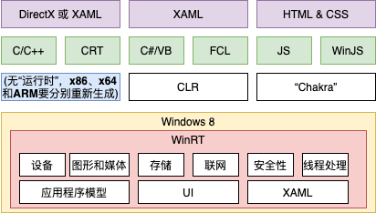
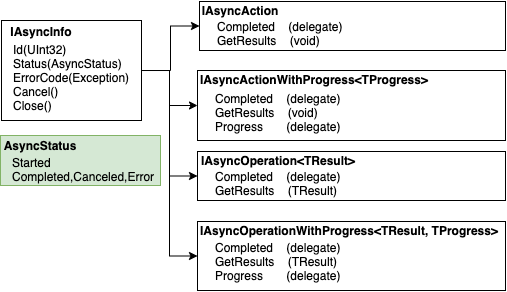

# 第 25 章 与 WinRT 组件互操作

本章内容：

* <a href="#25_1">CLR 投射与 WinRT 组件类型系统规则</a>
* <a href="#25_2">框架投射</a>
* <a href="#25_3">用 C# 定义 WinRT 组件</a>

Windows 8/8.1 带来了一个新类库，应用程序可通过它访问操作系统功能。类库正式名称是 **Windows 运行时**(Windows Runtime， WinRT)，其组件通过 WinRT 类型系统访问。首次发布时， WinRT 的许多目标都和 CLR 相同，例如简化应用程序开发，以及允许代码用不同编程语言实现以简化互操作。特别是，Microsoft 支持在原生 C/C++、JavaScript(通过 Microsoft 的 “Chakra” JavaScript 虚拟机)和 C#/Visual Basic(通过 CLR)中使用 WinRT 组件。

图 25-1 展示了 Windows 的 WinRT 组件所公开的功能，以及可以访问它们的 Microsoft 语言。对于原生 C/C++ 实现的应用程序，开发人员必须为每种 CPU 架构(x86，x64 和 ARM)单独编译代码。相比之下，.NET 开发人员只需编译一次(编译成 IL，CLR 自行将其编译成与主机 CPU 对应的本机代码)。JavaScript 应用程序则自带了源代码，“Chakra”虚拟机解析这些源代码，把它编译成与主机 CPU 对应的本机代码。其他公司也可制作能与 WinRT 组件互操作的语言和环境。

  

图 25-1 Windows 的 WinRT 组件所公开的功能，以及访问它们的各种语言

Windows Store 应用和桌面应用程序可通过 WinRT 组件来利用操作系统的功能。Windows 配套提供的 WinRT 组件数量比 .NET Framework 类库小多了。但设计就是这样的，组件的目的是公开操作系统最擅长的事情，也就是对硬件和跨应用程序的功能进行抽象。所以，大多数 WinRT 组件都只是公开了功能，比如存储、联网、图形、媒体、安全性、线程处理等。而其他核心语言服务(比如字符串操作)和较复杂的框架(比如 LINQ)不是由操作系统提供，而是由访问 WinRT 组件的语言提供。

WinRT 组件内部作为“组件对象模型”(Component Object Model，COM)组件来实现，后者是 Microsoft 1993 年推出的技术。COM 当年被认为过于复杂，规则过于难解，是一个很让人头疼的编程模型。当 COM 实际是有许多亮点的。多年来，Microsoft 对其进行了大量修订，显著地进行了简化。Microsoft 对 WinRT 组件进行了一个很大的调整，不是使用类库来描述 COM 组件的 API，而是使用元数据。你没有看错，WinRT 组件使用由 ECMA 协会标准化的 .NET 元数据格式(ECMA-335)来描述其API。

这个元数据格式正是本书一直在讨论的。元数据比类库更有表现力，而且 CLR 已经对元数据有了全面理解。此外，CLR 一开始就通过**运行时可调用包装器**(Runtime Callable Wrapper，RCW)和**COM 可调用包装器**(COM Callable Wrapper，CCW)实现了与 COM 组件的互操作。这使在 CLR 顶部运行的语言(如 C#)能无缝地与 WinRT 类型和组件进行互操作。

在 C# 中引用 WinRT 对象，实际获得的是对一个 RCW 的引用，RCW 内部引用了 WinRT 组件。类似地，将一个 CLR 对象传给 WinRT API，实际传递的是一个 CCW 引用，CCW 内部容纳了对 CLR 对象的引用。

WinRT 组件将元数据嵌入扩展名为 .winmd 的文件中(winmd 代表 Windows MetaData)。Windows 搭载的 WinRT 组件将元数据存储到各种 Windows.*.winmd 文件中，这些文件可在 %WinDir%\System32\WinMetadata 目录中找到。生成应用时要引用安装到以下目录的 Windows.winmd 文件<sup>①</sup>：

> ① 针对 Windows 8.1。————译注

`%ProgramFiles(x86)%\Windows Kits\8.1\References\CommonConfiguration\Neutral\Windows.winmd`

Windows Runtime 类型系统的一个主要设计目标是使开发人员能使用他们擅长的技术、工具、实践以及约定写应用。为此，有的 WinRT 功能被投射<sup>②</sup>成对应的开发技术。针对.NET Framework 开发人员主要有两种投射：

> ② 本章所说的投射(projection)和映射(mapping)是一回事。 ———— 译注

* **CLR 投射**  
  CLR 投射由 CLR 隐式执行，通常和元数据的重写解释有关。下一节会讨论 WinRT 组件类型系统规则以及 CLR 如何将这些规则投射给 .NET Framework 开发人员。

* **Framework 投射**  
  Framework 投射由你的代码显式执行，这是通过 FCL 新引入的 API 来执行的。如果 WinRT 类型系统和 CLR 类型系统差异太大，造成 CLR 不能隐式地投射，就需要用到 Framework 投射。本章稍后会讨论这种投射。

## <a name="25_1">25.1 CLR 投射与 WinRT 组件类型系统规则</a>

就像 CLR 强制遵循一个类型系统，WinRT 组件也遵循自己的类型系统。CLR 看到一个 WinRT 类型时，通常允许通过 CLR 的一般化 COM 互操作技术来使用该类型。但有时 CLR 会隐藏 WinRT 类型(将其动态设为私有)。然后，CLR 通过一个不同的类型来公开该类型。在内部，CLR 会查找特定的类型(通过元数据)，然后将这些类型映射成 FCL 的类型。要获得 CLR 隐式投射到 FCL 类型的完整 WinRT 类型列表，请访问 *[http://msdn.microsoft.com/en-us/library/windows/apps/hh995050.aspx](http://msdn.microsoft.com/en-us/library/windows/apps/hh995050.aspx)*。

### WinRT 类型系统的核心概念

WinRT 类型系统在功能上不如CLR 类型系统丰富。下面总结了 WinRT 类型系统的核心概念以及 CLR 如何投射它们。

* **文件名和命名空间**  
  .winmd 文件本身的名称必须和包含 WinRT 组件的命名空间匹配。例如，Wintellect.WindowsStore.winmd 文件必须在 `Wintellect.WindowsStore` 命名空间或者它的子命名空间中定义 WinRT 组件。由于 Windows 系统区分大小写，所以仅大小写不同的命名空间是不允许的。另外，WinRT 组件不能与命名空间同名。

* **通用基类型**  
  WinRT 组件不同享一个通用基类。CLR 投射一个 WinRT 类型时，感觉 WinRT 就像是从 `System.Object` 派生，因此所有 WinRT 类型都会继承所有公共方法，包括 `ToString`、`GetHashCode`、`Equals` 和 `GetType`。所以，在通过 C# 使用 WinRT 对象时，对象看起来是从 `System.Object` 派生，可在代码中到处传递 WinRT 对象而不会出任何问题。还可调用 “继承” 的方法，例如 `ToString`。

* **核心数据类型**  
  WinRT 类型系统支持核心数据类型，包括 Boolean，无符号字节、16/32/64 位有符号和无符号整数、单精度和双精度浮点数、16位字符、字符串和 void<sup>①</sup>。和 CLR 一样，其他所有数据类型都由这些核心数据类型合成。

> ① WinRT 不支持有符号字节。

* **类**  
  WinRT 是面向对象的类型系统，这意味着 WinRT 组件支持数据抽象、继承和多态<sup>②</sup>。但有的语言(如 JavaScript)不支持类型继承。为了迎合这些语言，几乎没有 WinRT 组件会利用继承。这意味着它们也没有利用多态。事实上，只有除 JavaScript 之外的其他语言所用的 WinRT 组件才会利用继承和多态。在随 Windows 发布的 WinRT 组件中，只有 XAML 组件(用于创建 UI)才利用了继承和多态。用 JavaScript 写的应用程序使用 HTML 和 CSS 来创建 UI。

> ② 数据抽象实际是被强制的，因为 WinRT 类不允许有公共字段。

* **结构**  
  WinRT 支持结构(值类型)，它们的实例跨越 COM 互操作边界按值封送。和 CLR 的值类型不同，WinRT 结构只能包含核心数据类型或其他 WinRT 结构类型的公共字段<sup>①</sup>。另外，WinRT 结构不能有任何构造器或辅助方法(helper method)。为方便起见，CLR 将某些操作系统 WinRT 结构投射成原生 CLR 类型，后者确实提供了构造器和辅助方法。CLR 开发人员会觉得这些投射的类型更亲切。例子包括 `Windows.Foundation` 命名空间定义的 `Point`、`Rect`、`Size` 和 `TimeSpan` 结构。

> ① 枚举也可以，但枚举本质上是 32 位整数。

* **可空结构**  
  WinRT API 可公开可空结构(值类型)。CLR 将 WinRT 的 `Windows.Foundation.IReferencce<T>` 接口投射成 CLR 的 `System.Nullable<T>`类型。

* **枚举**  
  枚举值作为有符号或无符号 32 位整数传递。用 C# 定义枚举类型，基础类型要么是 `int`，要么是 `uint`。另外，有符号 32 位枚举被看成是离散值，而无符号 32 位枚举被看成是可以 OR 到一起的标志值。

* **接口**  
  对于 WinRT 接口的成员，其参数和返回类型只能是 WinRT 兼容的类型。

* **方法**  
  WinRT 提供了对方法重载的有限支持。具体地说，由于 JavaScript 使用动态类型，所以它分辨不了仅参数类型由区别的方法。例如，JavaScript 允许向原本期待字符串的方法传递数字。但 JavaScript 确实能区分获取一个参数和获取两个参数的方法。此外，WinRT 不支持操作符重载方法和默认参数值。另外，实参只能在封送进入或外出(marshal in or out)之间选择一个，永远都不能两者同时进行(marshal in and out)。这意味着不能向方法实参应用 `ref`，但应用 `out` 就是可以的。欲知详情，请参考下个列表的"数组"项目。

* **属性**  
  WinRT 属性的数据类型只能指定 WinRT 兼容类型。WinRT 不支持有参属性或只写属性。

* **委托**  
  WinRT 委托类型只能为参数类型和返回类型执行 WinRT 组件。向 WinRT 组件传递一个委托时，委托对象会用一个 CCW 包装，在使用它的 WinRT 组件释放 CCW 之前，该委托对象不会被垃圾回收。WinRT 委托无 `BeginInvoke` 和 `EndInvoke` 方法。

* **事件**  
  WinRT 组件可通过一个 WinRT 委托类型公开事件。由于大多数 WinRT 组件都密封(无继承)，WinRT 定义了一个 `TypedEventHandler` 委托，其 `sender` 参数是泛型类型(而不是 `System.Object`)。  
  `public delegate void TypedEventHandler<TSender, TResult>(TSender sender, TResult args);`  
  还有一个 `Windows.Foundation.EventHandler<T>` WinRT 委托类型，CLR 把它投射成你熟悉的 .NET Framework的 `System.EventHandler<T>`委托类型。
  
* **异常**  
  和 COM 组件一样，WinRT 组件幕后用 HRESULT 值(具有特殊语义的32位整数)指明其状态。CLR 将 `Windows.Foundation.HResult` 类型的 WinRT 值投射成异常对象。WinRT API 返回已知的、代表错误的 `HRESULT` 值时，CLR 会抛出对应的 `Exception` 派生类实例。例如，`HRESULT 0x8007000e(E_OUTOFMEMORY)` 映射成 System.OutOfMemoryException。其他 `HRESULT` 值造成 CLR 抛出 System.Exception 对象，其 HResult 属性将包含 HRESULT 值。用 C# 实现的 WinRT 组件可以直接抛出所需类型的异常，CLR 会把它自动转换成恰当的 HRESULT 值。要获得对 HRESULT 值的完全控制，可构造异常对象，将你想要的 HRESULT 值赋给对象的 HResult 属性，再抛出对象。

* **字符串**  
  当然可以在 WinRT 和 CLR 类型系统之间传递不可变的字符串。但 WinRT 类型系统不允许字符串为 `null` 值。向 WinRT API 的字符串参数传递 null，CLR 会检测到这个动作并抛出 `ArgumentNullException`。相反，应该用 `String.Empty` 向 WinRT API 传递空字符串。字符串以传引用的方式传给 WinRT API；传入时被固定(pinned)，返回时解除固定(unpinned)。从 WinRT API 时，会生成包含其所有字符串元素的数组拷贝。传入或返回的是这个拷贝。

* **日期和时间**  
  WinRT `Windows.Foundation.DateTime` 结构代表的是一个 UTC 日期/时间。CLR 将 WinRT `DateTime` 结构投射成 .NET Framework 的 `System.DateTimeOffset` 结构，这是因为 `DateTimeOffset` 优于 .NET Framework 的 System.DateTime 结构。在生成的 DateTimeOffset 实例中，CLR 将从 WinRT 组件返回的 UTC 时间/日期转换成本地时间。相反，CLR 将一个 `DateTimeOffset`作为 UTC 时间传给 WinRT API。

* **URI**  
   CLR 将 WinRT `Windows.Foudation.Uri` 类型投射成 .NET Framework 的 `System.Uri` 类型。向 WinRT API 传递一个 .NET Framework URI 时，CLR 发现它是相对 URI 会抛出一个 `ArgumentException`。WinRT 只支持绝对 URI。URI 总是跨越互操作边界进行拷贝。
   
* **`IClosable/IDisposable`**  
  CLR 将 WinRT `Windows.Foundation.IClosable` 接口(仅有一个 Close 方法)投射成.NET Framework 的 `System.IDisposable` 接口(及其 `Dispose` 方法)。注意，执行 I/O 操作的所有 WinRT API 都是异步实现的。由于 IClosable 接口的方法称为 `Close` 而不是 `CloseAsync`，所以 `Close` 方法绝对不能执行任何 I/O 操作。这在语义上有别于 .NET Framework 的 `Dispose` 方法。对于 .NET Framework 实现的类型，调用 Dispose 是可以执行 I/O 操作的。而且事实上，它经常导致先将缓冲数据写入再关闭设备。但 C# 代码在某个 WinRT 类型上调用 `Dispose` 时，I/O(比如将缓冲数据写入)是不会执行的，所以有丢失数据的风险。这一点务必引起重视。写包装了输出流的 WinRT 组件时，必须显式调用方法来防止数据丢书。例如，使用 `DataWriter` 时必须记得调用它的 `StoreAsync` 方法。

* **数组**  
  WinRT API 支持一维零基数组。WinRT 能将数组元素封送进入方法，或者从方法中封送出去(marshal in or out)，永远不能两者同时进行(marshal in and out)。所以，不能将数组传入 WinRT API，让 API 修改数组元素，再在 API 返回后访问修改的元素。<sup>①</sup>但我说的只是一个应该遵守的协定。该协定没有得到强制贯彻，所以有的投射可能同时封送传入传出数组内容。这一般是为了改善性能。例如，如果数组包含结构，CLR 会直接固定(pin)数组，把它传给 WinRT API，返回后再解除固定(unpin)。在这个过程中，实际是传入数组内容，由 WinRT API 修改内容，然后返回修改的内容。但在这个例子中，WinRT API违反了协定，其行为是得不到保证的。事实上，在进程外运行的一个 WinRT 组件上调用 API 就肯定行不通。

> ① 这意味着无法实现像 `System.Array` 的 `sort` 方法这样的 API。有趣的是，所有语言(C，C++，C#，Visual Basic 和 JavaScript)都支持传入和传出数组元素，但 WinRT 类型系统就是不允许。

* **集合**  
  向 WinRT API 传递集合时，CLR 用一个 CCW 来包装集合对象，然后将 CCW 引用传给 WinRT API。WinRT 代码在 CCW 上调用一个成员时，调用线程要跨越互操作边界，造成一定的性能损失。和数组不同，这意味着将集合传给 WinRT API后，API可以现场操作集合，不会创建结婚元素的拷贝。表 25-1 总结了 WinRT 集合接口以及 CLR 如何把它们投射到 .NET 应用程序代码。

  表 25-1 WinRT 结婚接口和投射的 CLR 集合类型  
  |WinRT 集合类型</br>(`Windows.Foundation.Collections` 命名空间)|投射的 CLR 集合类型</br>(`System.Collections.Generic` 命名空间)|
  |---|---|
  |`IIterable<T>`|`IEnumerable<T>`|
  |`IVector<T>`|`IList<T>`|
  |`IVectorView<T>`|`IReadOnlyList<T>`|
  |`IMap<K, V>`|`IDictonary<TKey, TValue>`|
  |`IMapView<K, V>`|`IReadOnlyDictionary<TKey, TValue>`|
  |`IKeyValuePair<K, V>`|`KeyValuePair<TKey, TValue>`|

从上述列表可以看出，CLR 团队进行了大量工作，尽量保证了 WinRT 类型系统和 CLR 类型系统之间的无缝互操作，使托管代码的开发人员能在代码中更好地利用 WinRT 组件。<sup>①</sup>

> ① 欲知详情，请访问 *[http://msdn.microsoft.com/en-us/library/windows/apps/hh995050.aspx](http://msdn.microsoft.com/en-us/library/windows/apps/hh995050.aspx)* 并下载 CLRandtheWindowsRuntime.docx 文档。

## <a name="25_2">25.2 框架投射</a>

在 CLR 不能将一个 WinRT 类型隐式投射给 .NET Framework 开发人员的时候，开发人员就必须显式使用框架投射。主要有三种需要进行框架投射的技术：异步编程、WinRT流和 .NET Framework 流之间的互操作以及需要在 CLR 和 WinRT API 之间传输数据块的时候。后续的小节将分别讨论这三种框架投射。由于许多应用程序都要使用这些技术，所以有必要很好地理解和高效地使用它们。

### 25.2.1 从 .NET 代码中调用异步 WinRT API

线程以同步方式执行 I/O 操作时，线程可能阻塞不确定的时间。GUI 线程等待一个同步 I/O 操作时，应用程序 UI 会停止响应用户的输入，比如触摸、鼠标和手写笔事件，造成用户对应用程序感到厌烦。为了防止应用程序出现不响应的情况，执行 I/O 操作的 WinRT 组件通过异步 API 公开其功能。事实上，凡是 CPU 计算时间可能超过 50 毫秒的功能，WinRT 组件都通过异步 API 来公开该功能。本书第 V 部分“线程处理”将详细讨论如何构建响应灵敏的应用程序。

由于如此多的 WinRT API 都是异步的，所以为了高效地使用它们，你需要理解如何通过 C#与它们互操作。例如以下代码：

```C#
public void WinRTAsyncIntro() {
  IAsyncOperation<StorageFile> asyncOp = KnownFolders.MusicLibrary.GetFileAsync("Song.mp3");
  asyncOp.Completed = OpCompleted;
  // 可选：在以后某个时间调用 asyncOp.Cancel()
}

// 注意：回调方法通过 GUI 或线程池线程执行
private void OpCompleted(IAsyncOperation<StorageFile> asyncOp, AsyncStatus status) {
  switch (status) {
    case AsyncStatus.Completed: // 处理结果
      StorageFile file = asyncOp.GetResults(); /* Completed... */ break;

    case AsyncStatus.Canceled: // 处理取消
      /* Canceled... */ break;

    case AsyncStatus.Error: // 处理异常
      Exception exception = asyncOp.ErrorCode; /* Error... */ break;
  }
  asyncOp.Close();
}
```

`WinRTAsyncIntro` 方法调用 WinRT `GetFileAsync` 方法在用户的音乐中查找文件。执行异步操作的所有 WinRT API 名称都要以`Async` 结尾，而且都要返回类型实现了 WinRT `IAsyncXxx` 接口的对象；本例使用的接口是 `IAsyncOperation<TResult>`，其中 `TResult` 是 WinRT `StorageFile` 类型。我将对该对象的引用放到名为 `asyncOp` 的变量中，代表等待进行的异步操作。代码必须通过某种方式接收操作完成通知。为此，必须实现一个回调方法(本例是 `OpCompleted`)，创建对它的委托，并将委托赋给 `asyncOp` 的 `Completed` 属性。现在，一旦操作结束，就会由某个线程(不一定是 GUI 线程)调用回调方法。如果操作在将委托赋给 `Completed` 属性之前便结束了，系统会尽快安排对回调方法的调用。换言之，这里发生了竞态条件(race condition)，但实现 `IAsyncXxx` 接口的对象帮你解决了竞态，确保代码能正常工作。

就像 `WinRTAsyncIntro` 方法最后的注释所说的，要取消正在等待进行的操作，可选择调用所有 `IAsyncXxx` 接口都有提供的 `Cancel` 方法。所有异步操作结束都是因为三个原因之一：操作成功完成，操作被显式取消，或者操作出错。异步操作因为上述任何原因而结束时，系统都会调用回调方法，向其传递和原始 `XxxAsync` 方法返回的一样的对象引用，同时传递一个 `AsyncStatus`。在 `OpCompleted` 方法中，我检查 `status` 参数，分别处理成功完成、显式取消和出错的情况<sup>①</sup>。还要注意，处理好操作因为各种原因而结束的情况之后，应该调用 `IAsyncXxx` 接口对象的 `Close` 方法进行清理。

> ① `IAsyncInfo` 接口提供了一个 `Status` 属性，其中包含的值和传给回调方法的 `status` 参数的值是一样的。但由于参数以传值方式传递，所以访问参数的速度比查询 `IAsyncInfo` 的 `Status` 属性快(查询属性要求通过一个 RCW 来调用 WinRT API)。

图 25-2 展示了各种 WinRT `IAsyncXxx` 接口。主要的 4 个接口都从 `IAsyncInfo` 接口派生。其中，两个 `IAsyncAction` 接口使你知道操作在什么时候结束，但这些操作没有返回值(`GetReults` 的返回类型是 `void`)。而两个 `IAsyncOperation` 接口不仅使你知道操作在什么时候结束，还能获取它们的返回值(`GetResults` 方法具有泛型 `TResult` 返回类型)。

  

图 25-2 和执行异步 I/O 与计算操作有关的 WinRT 接口

两个 `IAsyncXxxWithProgress` 接口允许代码接收异步操作期间的定期进度更新。大多数异步操作都不提供进度更新，但有的会(比如后台下载和上传)。接收定时进度更新要求定义另一个回调方法，创建引用它的委托，并将委托赋给 `IAsyncXxxWithProgress` 对象的 `Progress` 属性。回调方法被调用时，会向其传递类型与泛型 `TProgress` 类型匹配的实参。

.NET Framework 使用 `System.Threading.Tasks` 命名空间的类型来简化异步操作。我将在第 27 章“计算限制的异步操作”解释这些类型以及如何用它们执行计算操作，在第 28 章“I/O 限制的异步操作”解释如何用它们执行 I/O 操作。除此之外，C# 提供了 `async` 和 `await` 关键字，允许使用顺序编程模型来执行异步操作，从而大幅简化了编码。

以下代码重写了之前的 `WinRTAsyncIntro` 方法。这个版本利用了 .NET Framework 提供的一些扩展方法，将 WinRT 异步编程模型转变成更方便的 C# 编程模型。

```C#
using System; // 为了使用 WindowsRuntimeSystemExtensions 中的扩展方法，
              // 这些扩展方法称为框架投射扩展方法
.
.
.
public async void WinRTAsyncIntro() {
  try {
    StorageFile file = await KnownFolders.MusicLibrary.GetFileAsync("Song.mp3");
    /* Completed... */
  }
  catch (OperationCanceledException) { /* Canceled... */ }
  catch (SomeOtherException ex) { /* Error... */ }
} 
```

C# 的 `await` 操作符导致编译器在 `GetFileAsync` 方法返回的 `IAsyncOperation<StorageFile>` 接口上查找 `GetAwaiter` 方法。该接口没有提供 `GetAwaiter` 方法，所以编译器查找扩展方法。幸好，.NET Framework 团队在 System.Runtime.WindowsRuntime.dll 中提供了能在任何一个 WinRT `IAsyncXxx` 接口上调用的大量扩展方法。

```C#
namespace System { 
  public static class WindowsRuntimeSystemExtensions {
    public static TaskAwaiter GetAwaiter(this IAsyncAction source);
    public static TaskAwaiter GetAwaiter<TProgress>(this IAsyncActionWithProgress<TProgress> source);
    public static TaskAwaiter<TResult> GetAwaiter<TResult>(this IAsyncOperation<TResult> source);
    public static TaskAwaiter<TResult> GetAwaiter<TResult, TProgress>(
      this IAsyncOperationWithProgress<TResult, TProgress> source);
 }
```

所有这些方法都在内部构造一个 `TaskCompletionSource`，并告诉 `IAsyncXxx` 对象在异步操作结束后调用一个回调方法来设置 `TaskCompletionSource` 的最终状态。这些扩展方法返回的 `TaskAwaiter` 对象才是 C# 最终所等待的。异步操作结束后，`TaskAwaiter` 对象通过与原始线程关联的 `SynchronizationContext`(第 28 章讨论)确保代码继续执行。然后，线程执行 C# 编译器生成的代码。这些代码查询 `TaskCompletionSource` 的 `Task` 的 `Result` 属性来返回结果(本例是一个 `StorageFile`)，在取消的情况下抛出 `OperationCanceledException`，或在出错的情况下抛出其他异常。要了解这些方法的内部工作过程，请参考本节末尾的代码。

刚才展示的只是调用异步 WinRT API 并发现其结果的一般情况。我展示了如何知道发生了取消，但没有展示如何真正地取消操作，也没有展示如何处理进度更新。为了正确处理取消和进度更新，不要让编译器自动调用某个 `GetAwaiter` 扩展方法，而要显式调用同样在 `WindowsRuntimeSystemExtensions` 类中定义的某个 `AsTask` 扩展方法。

```C#
namespace System {
  public static class WindowsRuntimeSystemExtensions {
    public static Task AsTask<TProgress>(this IAsyncActionWithProgress<TProgress> source,
      CancellationToken cancellationToken, IProgress<TProgress> progress);

    public static Task<TResult> AsTask<TResult, TProgress>(
      this IAsyncOperationWithProgress<TResult, TProgress> source,
      CancellationToken cancellationToken, IProgress<TProgress> progress);
    //未显示更简单的重载
  }
} 
```

现在就可以对程序进行最后的完善了。下面展示了如何调用异步 WinRT API，并在需要的时候正确使用取消和进度更新功能。

```C#
using System;           // 为了 WindowsRuntimeSystemExtensions 的 AsTask
using System.Threading; // 为了 CancellationTokenSource
internal sealed class MyClass {
  private CancellationTokenSource m_cts = new CancellationTokenSource();

  // 注意：如果由 GUI 线程调用，所有代码都通过 GUI 线程执行
  private async void MappingWinRTAsyncToDotNet(WinRTType someWinRTObj) {
    try {
      // 假定 XxxAsync 返回 IAsyncOperationWithProgress<IBuffer, UInt32>
      IBuffer result = await someWinRTObj.XxxAsync(...)
        .AsTask(m_cts.Token, new Progress<UInt32>(ProgressReport));
      /* Completed... */
    }
    catch (OperationCanceledException) { /* Canceled... */ }
    catch (SomeOtherException) { /* Error... */ }
  }

  private void ProgressReport(UInt32 progress) { /* Update progress... */ }

  public void Cancel() { m_cts.Cancel(); } // 以后某个时间调用
} 
```

有的读者想知道这些 `AsTask` 方法内部如何将一个 WinRT `IAsyncXxx` 转换成最终可以等待一个 .NET Framework `Task`。以下代码展示了最复杂的 `AsTask` 方法在内部如何实现。当然，更简单的重载实现起来更简单。

```C#
public static Task<TResult> AsTask<TResult, TProgress>(
  this IAsyncOperationWithProgress<TResult, TProgress> asyncOp,
  CancellationToken ct = default(CancellationToken),
  IProgress<TProgress> progress = null) {

  // 在 CancellationTokenSource 取消时取消异步操作
  ct.Register(() => asyncOp.Cancel());

  // 在异步操作报告进度时，报告给进度回调
  asyncOp.Progress = (asyncInfo, p) => progress.Report(p);

  // 这个 TaskCompletionSource 监视异步操作结束
  var tcs = new TaskCompletionSource<TResult>();

  // 在异步操作结束时通知 TaskCompletionSource ①
  // 届时，正在等待 TaskCompletionSource 的代码重新获取控制权
  asyncOp.Completed = (asyncOp2, asyncStatus) => {
    switch (asyncStatus) {
      case AsyncStatus.Completed: tcs.SetResult(asyncOp2.GetResults()); break;
      case AsyncStatus.Canceled: tcs.SetCanceled(); break;
      case AsyncStatus.Error: tcs.SetException(asyncOp2.ErrorCode); break;
    }
  };

  // 调用代码等待这个返回的 Task 时，它调用 GetAwaiter，后者
  // 用一个 SynchronizationContext 包装 Task，确保异步操作
  // 在 SynchronizationContext 对象的上下文中结束
  return tcs.Task;
} 
```

> ① 或者说向这个 `TaskCompletionSource` 发信号。 ———— 译注


### 25.2.2 WinRT 流和 .NET 流之间的互操作

许多 .NET Framework 类都要求操作 `System.IO.Stream` 派生类型，包括序列化和 LINQ to XML 等。只有使用 `System.IO.WindowsRuntimeStorageExtensions` 类定义的扩展方法，实现了 WinRT  `IStorageFile` 或 `IStorageFolder` 接口的 WinRT 对象才能和要求 `Stream` 派生类型 .NET Framework 类一起使用。

```C#
namespace System.IO { // 在 System.Runtime.WindowsRuntime.dll 中定义
  public static class WindowsRuntimeStorageExtensions {
    public static Task<Stream> OpenStreamForReadAsync(this IStorageFile file);
    public static Task<Stream> OpenStreamForWriteAsync(this IStorageFile file);

    public static Task<Stream> OpenStreamForReadAsync(this IStorageFolder rootDirectory,
      String relativePath);
    public static Task<Stream> OpenStreamForWriteAsync(this IStorageFolder rootDirectory,
      String relativePath, CreationCollisionOption creationCollisionOption);
  }
}
```

下例使用扩展方法打开一个 WinRT `StorageFile`，将内容读入一个 .NET Framework `XElement` 对象。

```C#
async Task<XElement> FromStorageFileToXElement(StorageFile file) {
  using (Stream stream = await file.OpenStreamForReadAsync()) {
    return XElement.Load(stream);
  }
}
```

最后，`System.IO.WindowsRuntimeStreamExtensions` 类提供了一些扩展方法能将 WinRT 流接口(例如 `IRandomAccessStream`，`IInputStream` 和 `IOutputStream`)“转型”为 .NET Framework 的 `Stream` 类型，或者反向转换。

```C#
namespace System.IO { // 在 System.Runtime.WindowsRuntime.dll 中定义
  public static class WindowsRuntimeStreamExtensions {
    public static Stream AsStream(this IRandomAccessStream winRTStream);
    public static Stream AsStream(this IRandomAccessStream winRTStream, Int32 bufferSize);

    public static Stream AsStreamForRead(this IInputStream winRTStream);
    public static Stream AsStreamForRead(this IInputStream winRTStream, Int32 bufferSize);

    public static Stream AsStreamForWrite(this IOutputStream winRTStream);
    public static Stream AsStreamForWrite(this IOutputStream winRTStream, Int32 bufferSize);

    public static IInputStream AsInputStream (this Stream clrStream);
    public static IOutputStream AsOutputStream(this Stream clrStream);
  }
}
```

下例使用扩展方法将一个 WinRT `IInputStream` “转型” 为 .NET Framework `Stream` 对象。

```C#
XElement FromWinRTStreamToXElement(IInputStream winRTStream) {
  Stream netStream = winRTStream.AsStreamForRead(); 
  return XElement.Load(netStream);
} 
```

注意，.NET Framework 提供的“转型”扩展方式幕后不仅仅是执行转型。具体地说，将 WinRT 流转换成 .NET Framework 流时，会在托管堆中为 WinRT 流隐式创建一个缓冲区。结果是大多数操作都向这个缓冲区写入，不需要跨越互操作边界，这提升了性能。涉及大量小的 I/O 操作(比如解析 XML 文档)时，性能的提升尤其明显。

使用 .NET Framework 流投射的好处是，在同一个 WinRT 流实例上多次执行一个 `AsStreamXxx` 方法，不用担心会创建多个相互没有连接的缓冲区，造成向一个缓冲区写入的数据在另一个那里看不见。.NET Framework 的 API 确保每个流对象都有唯一的适配器实例，所有用户共享同一个缓冲区。

虽然默认缓冲区大多数时候都能在性能与内存使用之间获得较好的平衡，但有时还是希望调用缓冲区的大小(而不是默认的 16 KB)。这时可以使用 `AsStreamXxx` 方法的重载版本来达到目的。例如，如果知道要长时间操作一个很大的文件，同时不会使用其他太多的缓冲流，就可为自己的流请求一个很大的缓冲区来获得进一步的性能提升。相反，有的应用程序要求低网络延迟，这时可能希望确保除非应用程序显式请求，否则不要从网络读取更多的字节。这时可考虑完全禁用缓冲区。为 `AsStreamXxx` 方法指定零字节的缓冲区，就不会创建缓冲区对象了。

### 25.2.3 在 CLR 和 WinRT 之间传输数据块

要尽量使用上一节讨论的框架投射，因为它们有不错的性能。但有时需要在 CLR 和 WinRT 组件之间传递原始数据块(raw blocks)。例如，WinRT 的文件和套接字流组就要求读写原始数据块。另外，WinRT 的加密组件要对数据块进行加密和解密，位图像素也要用原始数据块来维护。

.NET Framework 获取数据块的方式一般是通过字节数组(`Byte[]`)，或者通过流(比如在使用 `MemoryStream` 类的时候)。当然，字节数组和 `MemoryStream` 对象都不能直接传给 WinRT 组件。所以，WinRT 定义了 `IBuffer` 接口，实现该接口的对象代表可传给 WinRT API 的原始数据块。WinRt `IBuffer` 接口是这样定义的：

```C#
namespace Windows.Storage.Streams {
  public interface IBuffer {
    UInt32 Capacity { get; }    // 缓冲区最大大小(以字节为单位)
    UInt32 Length { get; set; } // 缓冲区当前使用的字节数
  } 
}
```

## <a name="25_3">25.3 用 C# 定义 WinRT 组件</a>