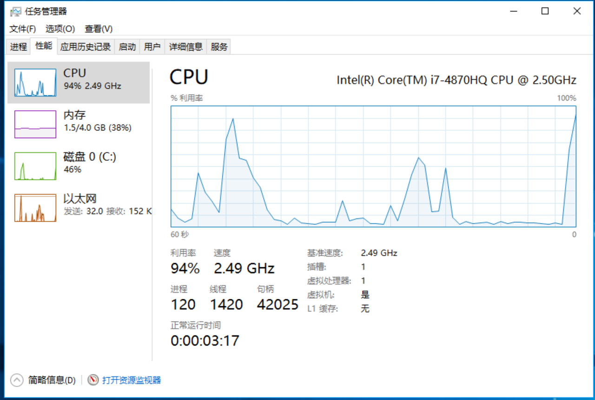
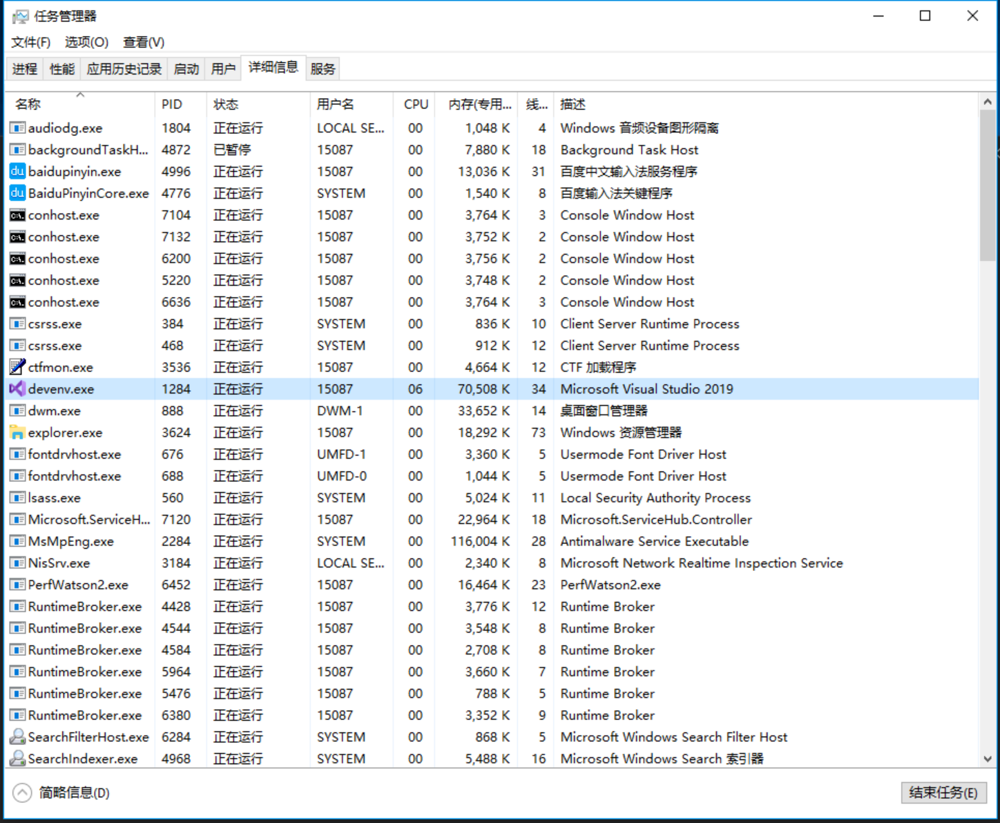
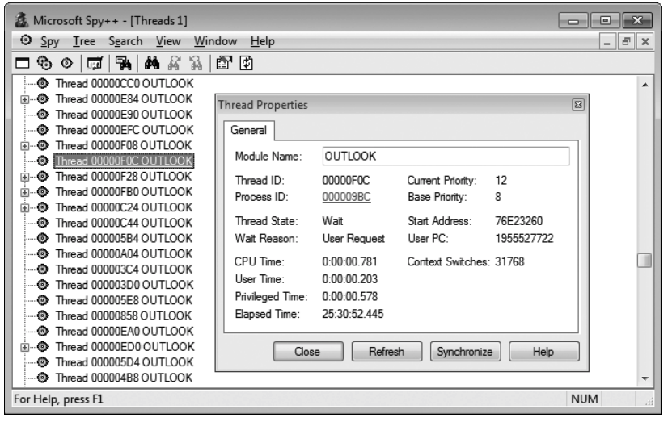

# 第 26 章 线程基础

本章内容：

* <a href="#26_1">Windows 为什么要支持线程</a>
* <a href="#26_2">线程开销</a>
* <a href="#26_3">停止疯狂</a>
* <a href="#26_4">CPU 发展趋势</a>
* <a href="#26_5">CLR 线程和 Windows 线程</a>
* <a href="#26_6">使用专用线程执行异步的计算限制操作</a>
* <a href="#26_7">使用线程的理由</a>
* <a href="#26_8">线程调度和优先级</a>
* <a href="#26_9">前台线程和后台线程</a>
* <a href="#26_10">继续学习</a>

本章将介绍线程的基本概念，帮助开发人员理解线程及其使用。我将解释 Microsoft Windows 为什么引入线程的概念、CPU 发展趋势、CLR 线程和 Windows 线程的关系、线程开销、Windows 如何调度线程以及公开了线程属性的 Microsoft .NET Framework 类。

本书第 V 部分“线程处理” 的各个章节将解释 Windows 和 CLR 如何协同提供一个线程处理架构。希望通过这些内容帮你打下一个良好的基础，学会高效使用线程来设计和构建响应灵敏的、可靠的、可伸缩的应用程序和组件。

## <a name="26_1">26.1 Windows 为什么要支持线程</a>

在计算机的早期岁月，操作系统没有线程的概念。事实上，整个系统只运行着一个执行线程，其中同时包含操作系统代码和应用程序代码。只用一个执行线程的问题在于，长时间运行的任务会阻止其他任务执行。例如，在 16 位 Windows 的那些日子，打印文档的应用程序很容易“冻结”整个机器，造成 OS (操作系统)和其他应用程序停止响应。有些应用程序的 bug 会造成死循环，同样会造成整个机器停止工作。

遇到这个问题，用户只好按 Reset 键或电源开关重启计算机。用户对此深恶痛绝(事实上，他们现在一样会)，因为所有正在运行的应用程序都会终止。更重要的是，这些应用程序正在处理的数据都会无端地丢失。Microsoft 明白 16 位 Windows 不是理想的操作系统。随着计算机工业的持续进步，它不足以使 Microsoft 保持领先地位。所以，它们计划构建一个新的 OS 来满足企业和个人的需要。这个新的 OS 必须健壮、可靠、易于伸缩和安全，而且它必须弥补 16 位 Windows 的许多不足。新的 OS 内核最初通过 Microsoft Windows NT 发布。经过多年的发展，它已进行了大量改进，增加了大量功能。Microsoft 每次发布客户端和服务器 Windows 操作系统的最新版本时，都在其中采用了这个内核的最新版本。

Microsoft 设计这个 OS 内核时，决定在一个 **进程** 中运行应用程序的每个实例。进程实际是应用程序的实例要使用的资源的集合。每个进程都被赋予了一个虚拟地址空间，确保在一个进程中使用的代码和数据无法由另一个进程访问。此外，进程访问不了 OS 的内核代码和数据；所以，应用程序代码破坏不了操作系统代码或数据。由于应用程序代码破坏不了其他应用程序或者 OS 自身，所以用户的计算体验变得更好了。除此之外，系统变得比以往更安全，因为应用程序代码无法访问另一个应用程序或者 OS 自身使用的用户名、密码、信用卡资料或其他敏感信息。

听起来不错，但 CPU 本身呢？应用程序发生死循环会发生什么？如果机器只有一个 CPU，它会执行死循环，不能执行其他任何东西。所以，虽然数据无法被破坏，而且更安全，但系统仍然可能停止响应。 Microsoft 需要修正这个问题，他们拿出的方案就是线程。作为一个 Windows 概念， **线程** 的职责是对 CPU 进行虚拟化。 Windows 为每个进程都提供了该进程专用的线程(功能相当于一个 CPU)。应用程序的代码进入死循环，与那个代码关联的进程会“冻结”，但其他进程(它们有自己的线程)不会冻结，它们会继续执行！

## <a name=“26_2”>26.2 线程开销</a>

线程很强大，因为它们使 Windows 即使在执行长时间运行的任务时也能随时响应。另外，线程允许用户使用一个应用程序(比如“任务管理器”)强制终止似乎已冻结的应用程序(它也有可能正在执行一个长时间运行的任务)。但和一切虚拟化机制一样，线程有空间(内存耗用)和时间(运行时的执行性能)上的开销。

下面更详细地探讨这种开销。每个线程都有以下要素。

* **线程内核对象(thread kernel object)**  
  OS 为系统中创建的每个线程都分配并初始化这种数据结构之一。数据结构包含一组对线程进行描述的属性(本章后面讨论)。数据结果还包含所谓的线程上下文(thread context)。上下文是包含 CPU 寄存器集合的内存块。对于 x86， x64 和 ARM CPU 架构，线程上下文分别使用约 700， 1240 和 350 字节的内存。

* **线程环境块(thread environment block，TEB)**  
  TEB 是在用户模式(应用程序代码能快速访问的地址空间)中分配和初始化的内存块。TEB 耗用 1 个内存页(x86， x64 和 ARM CPU 中是 4 KB)。 TEB 包含线程的异常处理链首(head)。线程进入的每个 `try` 块都在链首插入一个节点(node)；线程退出 `try` 块时从链中删除该节点。此外，TEB 还包含线程的“线程本地存储”数据，以及由 GDI(Graphics Deveice Interface， 图形设备接口)和 OpenGL 图形使用的一些数据结构。

* **用户模式栈(user-mode stack)**  
  用户模式栈存储传给方法的局部变量和实参。它还包含一个地址；指出当前方法返回时，线程应该从什么地方接着执行。Windows 默认为每个线程的用户模式栈分配 1 MB 内存。更具体地说，Windows 只是保留 1 MB 地址空间，在线程实际需要时才会提交(调拨)物理内存。

* **内核模式栈(kernel-mode stack)**  
  应用程序代码向操作系统中的内核模式函数传递实参时，还会使用内核模式栈。出于对安全的考虑，针对从用户模式的代码传给内核的任何实参，Windows 都会把它们从线程的用户模式栈复制到线程的内核模式栈。一经复制，内核就可验证实参的值。由于应用程序代码不能访问内核模式栈，所以应用程序无法更改验证后的实参值。OS 内核代码开始处理复制的值。除此之外，内核会调用它自己内部的方法，并利用内核模式栈传递它自己的实参、存储函数的局部变量以及存储返回地址。在 32 位 Windows 上运行，内核模式栈大小是 12 KB； 64 位 Windows 是 24 KB。

* **DLL 线程连接(attach)和线程分离(detach)通知**  
  Windows 的一个策略是，任何时候在进程中创建线程，都会调用进程中加载的所有非托管 DLL 的 `DllMain` 方法，并向该方法传递 `DLL_THREAD_ATTACH` 标志。类似地，任何时候线程终止，都会调用进程中的所有非托管 DLL 的 `DLLMain` 方法，并向方法传递`DLL_THREAD_DETACH` 标志。有的 DLL 需要获取这些通知，才能为进程中创建/销毁的每个线程执行特殊的初始化或(资源)清理操作。例如， C-Runtime 库 DLL 会分配一些线程本地存储状态。线程使用 C-Runtime 库中包含的函数时需要用到这些状态。

在 Windows 的早期岁月，许多进程最多只加载五六个 DLL。但如今，随便一个进程就可能加载几百个 DLL。就拿目前来说，在我的机器上， Microsoft Visual Studio 在它的进程地址空间加载了大约 470 个 DLL！这意味着每次在 Visual Studio 中新建一个线程，都必须先调用 470 个 DLL函数，然后线程才能开始做它想做的事情。Visual Studio 进程终止时，这 470 个函数还要调用一遍。这严重影响了进程中创建和销毁线程的性能。<sup>①</sup>

> ① C# 和其他大多数托管编程语言生成的 DLL 没有 `DllMain` 函数。所以，托管 DLL 不会收到 `DLL_THREAD_ATTACH` 和 `DLL_THREAD_DETACH` 通知，这提升了性能。此外，非托管 DLL 可调用 Win32 `DisableThreadLibraryCalls` 函数来决定不理会这些通知。遗憾的是，许多非托管开发人员都不知道有这个函数。

你现在已经知道了创建线程、让它进驻系统以及最后销毁它所需的全部空间和时间开销。但还没完——接着讨论上下文切换。单 CPU 计算机一次只能做一件事件。所以， Windows 必须在系统中的所有线程(逻辑 CPU)之间共享物理 CPU。

Windows 任何时刻只将一个线程分配给一个 CPU。那个线程能运行一个“时间片”(有时也称为“量”或者“量程”，即 quantum)的长度。时间片到期，Windows 就上下文切换到另一个线程。每次上下文切换都要求 Windows 执行以下操作。

1. 将 `CPU` 寄存器的值保存到当前正在运行的线程的内核对象内部的一个上下文结构中。

2. 从现有线程集合中选出一个线程供调度。如果该线程由另一个进程拥有，Windows 在开始执行任何代码或者接触任何数据之前，还必须切换 CPU “看见” 的虚拟地址空间。

3. 将所选上下文结构中的值加载到 `CPU` 的寄存器中。

上下文切换完成后，CPU 执行所选的线程，直到它的时间片到期。然后发生下次上下文切换。Windows 大约每 30 毫秒执行一次上下文切换。上下文切换所产生的开销；也就是说，上下文切换所产生的开销不会换来任何内存或性能上的收益。Windows 执行上下文切换，向用户提供一个健壮的、响应灵敏的操作系统。

现在，假如一个应用程序的线程进入死循环，Windows 会定期抢占(preempt)它，将新线程分配给 CPU，让新线程有机会运行。假定新线程是“任务管理器”的线程，用户就可利用“任务管理器”终止包含了死循环线程的进程。之后，进程会终止，它处理的所有数据会被销毁。但系统中的其他所有进程都继续运行，不会丢失它们的数据，用户当然也不需要重启计算机。所以，上下文切换通过牺牲性能换来了好得多的用户体验。

事实上，上下文切换对性能的影响可能超出你的想象。是的，当 Windows 上下文切换到另一个线程时，会产生一定的性能损失。但是，CPU 现在是要执行一个不同的线程，而之前的线程的代码和数据还在 CPU 的高速缓存(cache)中，这使 CPU 不必经常访问 RAM(它的速度比 CPU 告诉缓存慢的多)。当 Windows 上下文切换到新线程时，这个新线程极有可能要执行不同的代码并访问不同的数据，这些代码和数据不在 CPU 的高速缓存中。因此，CPU 必须访问 RAM 来填充它的告高速缓存，以恢复告诉执行状态。但在 30 毫秒之后，一次新的上下文切换又发生了。

> 重要提示 一个时间片结束时，如果 Windows 决定再次调度同一个线程(而不是切换到另一个线程)，那么 Windows 不会执行上下文切换。相反，线程将继续运行。这显著改进了性能。注意，在设计自己的代码时，上下文切换能避免就要尽量避免。

> 重要提示 线程可自主提前终止其时间片。这经常发生，因为线程经常要等待 I/O 操作(键盘、鼠标、文件、网络等)结束。例如，“记事本”程序的线程经常都会处于空闲状态，什么事情都不做；这个线程是在等待输入。如果用户按键盘上的 J 键，Windows 会唤醒“记事本”线程，让他处理按键操作。“记事本”线程可能花 5 毫秒处理按键，然后调用一个 Win32 函数，告诉 Windows 它准备好处理下一个输入事件。如果没有更多的输入事件，Windows 使“记事本”线程进入等待状态(时间片剩余的部分就放弃了)，使线程在任何 CPU 上都不再调度，直到发生下一次输入事件。这增强了系统的总体性能，因为正在等待 I/O 操作完成的线程不会在 CPU 上调度，所以不会浪费 CPU 时间，而节省出来的时间则可以供 CPU 调度其他线程。

执行上下文切换所需的时间取决于 CPU 架构和速度。而填充 CPU 缓存所需的时间取决于系统中运行的应用程序、CPU 缓存的大小以及其他各种因素。所以，无法为每一次上下文切换的时间开销给出确定值，甚至无法给出估计值。唯一确定的是，要构建高性能应用程序和组件，就应该尽量避免上下文切换。

此外，执行垃圾回收时，CLR 必须挂起(暂停)所有线程，遍历它们的栈来查找根以便对堆中的对象进行标记<sup>①</sup>，再次遍历它们的栈(有的对象在压缩期间发生了移动，所以要更新它们的根)，再恢复所有线程。所以，减少线程的数量也会显著提升垃圾回收器的性能。每次使用调试器并遇到断点，Windows 都会挂起正在调试的应用程序中的所有线程，并在单步执行或者运行应用程序时恢复所有线程。所以，线程越多，调试体验越差。

> ① “标记”是垃圾回收器的第一个阶段，详见 21.1.2 节 “垃圾回收算法”。 ———— 译注

根据上述讨论，结论是必须尽量避免使用线程，因为它们要耗用大量内存，而且需要相当多的时间来创建、销毁和管理。Windows 在线程之间记性上下文切换，以及在发生垃圾回收的时候，也会浪费不少时间。然而，根据上述讨论，我们还得出了另一个结论，那就是有时必须使用线程，因为它们使 Windows 变得更健壮，响应更灵敏。

应该指出的是，安装了多个 CPU(或者一个多核 CPU)的计算机可以真正同时运行几个线程，这提升了应用程序的可伸缩性(用更少的时间做更多的工作)。Windows 为每个 CPU 内核都分配一个线程，每个内核都自己执行到其他线程的上下文切换。Windows 确保单个线程不会同时在多个内核上调度，因为这会带来巨大的混乱。如今的许多计算机都配备了多个 CPU、超线程 CPU 或者多核 CPU。但在 Windows 最初设计时，单 CPU 计算机才是主流，所以 Windows 设计了线程来增强系统的响应能力和可靠性。今天，线程还被用于增强应用程序的可伸缩性，但只有在多 CPU(多核)计算机上才有可能。

本书剩余各章将讨论如何利用 Windows 和 CLR 提供的各种机制，当代码在多 CPU(多核)计算机上运行时，创建尽量少的线程并保证代码的响应能力和伸缩性。

## <a name="26_3">26.3 停止疯狂</a>

如果只关心性能，那么任何机器最优的线程数就是那台机器的 CPU 数目(从现在开始将 CPU的每个内核都当作一个 CPU)。所以，安装一个 CPU 的机器最好只有一个线程，安装两个 CPU 的机器最好只有两个线程，依次类推。理由非常明显；如果线程数超过了 CPU 的数目，就会产生上下文切换和性能损失。如果每个 CPU 只有一个线程，就不会有上下文切换，线程将全速运行。

然而，Microsoft 设计 Windows 时，决定侧重于可靠性和响应能力，而非侧重于速度和性能。我拥护这个决定：如果今天的应用程序仍然会造成 OS 和其他应用程序“冻结”，我想没有人愿意使用 Windows 或者 .NET Framework。因此，Windows 为每个进程提供了该进程专用的线程来增强系统的可靠性和响应能力。例如，在我的机器上运行“任务管理器”并选择“性能“选项卡，会看到如果 26-1 所示的结果。

  

图 26-1 任务管理器的”性能“选项卡

看来我的机器正在运行 48 个进程，所以可认为机器上至少运行这 48 个线程，因为每个进程都至少有一个线程。但“任务管理器”显示我的机器实际有 683 个线程！这意味着仅仅是线程栈就需要分配 683 MB 内存，而我的机器总共才 3 GB RAM！另外，这还意味着每个进程平均有大约 14.2 个线程，而我的 4 核电脑理想情况下不应该是每进程 4 线程吗？

再来看看 CPU 利用率读数：它显示我的 CPU “忙” 的时间是 6%。这意味着在 94% 的时间里，这 683 个线程什么事情都没做————它们白白霸占着内存；线程未运行时，这些内存是不会使用的。你肯定会问：这些应用程序真的需要这些在 94% 的时间里什么事情都不做的线程吗？答案明显是否定的。要知道哪些进程最浪费，请单击”详细信息“标签，添加”线程“列<sup>①</sup>，再按降序对这个列进行排序，如图 26-2 所示。

> ① 右击现有的列，选择”选择列“。

  

图 26-2 任务管理器显示进程的详细信息

让你所见，System 创建了 111 个线程，CPU 利用率为 0%。Explorer(资源管理器)创建了 73 个线程，CPU 利用率为 0%。Visual Studio(Devenv.exe)创建了 34 个线程，CPU 利用率为 0%。Microsoft Outlook 创建了 17 个线程，CPU 利用率为 0%；我可以一直列举下去。到底发生了什么事情？

在 Windows 中，进程是十分 ”昂贵“ 的。创建一个进程通常要花几秒钟的时间，必须分配大量内存，这些内存必须初始化， EXE 和 DLL 文件必须从磁盘上加载，等等。相反，在 Windows 中创建线程则十分”廉价“。所以，开发人员决定停止创建进程，改为创建线程。这正是我们看到有这么多线程的原因。但是，虽然线程比进程廉价，它们和其他系统资源相比仍然十分昂贵，所以还是应该省着用，而且要用得恰当。

可以肯定地说，刚才讨论的所有这些应用程序都在以效率低下的方式使用线程。所有这些线程在系统中都没有存在的必要。在应用程序中分配资源是十分正常的一件事件，但分配了又不用，这又算是什么呢？这纯属浪费！另外，为线程栈分配这么多内存，意味着一些更重要的数据(比如用户的文档)获得的内存变少了。<sup>①</sup>

> ① 为了让你体会到情况有多糟，我忍不住想和你分享另一个例子。请做个试验：打开”记事本“程序(Notepad.exe)，用”任务管理器“查看它包含了多少个线程(这时看到的是 1)。然后，选择”记事本“的”文件“|”打开“菜单来显示通用的”打开“对话框。保持这个对话框的打开状态，在“任务管理器”中查看现在创建了多少个新线程。在我的机器上，仅仅是因为打开了这个对话框，就创建了 14 个额外的线程！事实上，使用通用“打开”和“保存”对话框的每个应用程序都会在其内部创建大量额外的线程，这些线程大多数时候都处于空闲状态。另外，即使对话框关闭，其中大多数线程也不会销毁。

更可怕的是，假如这些进程在用户的“远程桌面服务”会话中运行，而且这台机器有 100 个用户在访问，那么会发生什么？在这种情况下，将会有 100 个 Outlook 实例，每个实例都创建 17 个什么都不干的线程。这 1700 个 “坐吃等死” 的线程每个都有自己的内核对象、TEB、用户模式栈、内核模式栈等。由此浪费的资源将非常可观。必须停止这种疯狂的举动，尤其是如果 Microsoft 想为笔记本用户提供一个好的使用体验的话(许多笔记本都只有 2~4 GB RAM)。本书剩余各章将讲述如何正确设置应用程序，以一种高效的方式使用尽量少的线程。

## <a name="26_4">26.4 CPU 发展趋势</a>

CPU 厂商过去只知道一味地提高 CPU 速度。所以，在旧机器上运行得慢的程序在新机器上一般都会快一些。但 CPU 厂商没有延续这个趋势，因为高速运行的CPU 会产生大量热量。我几年前从一家著名厂商那里购买了一台新款笔记本电脑。这台电脑的固件有一个 bug，造成风扇时转时不转。结果是，用不了多久，CPU 和主板便烧坏了。硬件厂商更换了机器，并“改进”了固件，使风扇能更频繁地工作。遗憾的是，这又造成耗电过大，因为风扇本身也很耗电。

这些问题是今天的硬件厂商必须面对的。由于不能做到一直提升 CPU 的速度，所以又改为侧重于将晶体管做得更小，使一个芯片能容下更多的晶体管。今天，一个硅芯片可以容纳两个或者更多的 CPU 内核。这样一来，如果在写软件时能利用多个内核，软件就能运行得更快。这是怎么做到的呢？我们“**以一种智能的方式**”使用线程。

今天的计算机使用了以下三种多 CPU 技术。

* **多个CPU**  
  有的计算机安装了多个 CPU。主板上有多个 CPU 插座，每个都可安装一个 CPU。由于主板会变得更大，所以计算机机箱也会变得更大。有的时候，这种机器甚至要安装多个电源以提供额外的功率。这种计算机问世已有几十年的历史，但在普通用户中并不流行，因其体积和加个都不太理想。

* **超线程芯片**  
  这种技术(Intel 专利)允许一个芯片在操作系统中显示成两个。芯片中包含两组架构状态(比如 CPU 寄存器)，但芯片只有一组执行资源。对于 Windows，这看起来是安装了两个 CPU，所以 Windows 会同时调用调度两个线程。但芯片一次只能执行一个线程。一个线程由于缓存未命中(cache miss)、分支预测错误(branch misprediction)或者要等待数据(data dependency)而暂停时，芯片将切换到另一个线程。一切都是在硬件中发生的，Windows 对此一无所知；它以为有两个线程正在并发运行，Windows 不知道实际使用的是超线程 CPU。如果一台机器上安装了多个超线程 CPU，Windows 首先在每个 CPU 上都调度一个线程，使线程真正并发运行，然后在已经处于“忙”状态的 CPU 上调度其他线程。Intel 声称超线程 CPU 能提升 10%~30%的性能。

* **多核芯片**  
  包含多个内核的 CPU 戏弄爱你几年前就已问世。当我写到这里的时候，双核、四核和八核 CPU 已经“遍地开花”。就连我的笔记本电脑都是四核的。不久，也许我们的手机都普遍 4~8 核。Interl 现在甚至在实验集成了 80 个核的处理器！这是多么强大的计算能力！除此之外，Interl 甚至推出了超线程的多核芯片。

## <a name="26_5">26.5 CLR 线程和 Windows 线程</a>

CLR 使用 Windows 对的线程处理功能，所以本书第 V 部分实际是围绕 Windows 向开发人员公开的线程处理功能展开的。我将解释线程在 Windows 中如何工作，以及 CLR 如何改变线程的行为(如果能的话)。然而，如果想更多地学习线程，建议阅读我以前就这个主题出版的著作，比如我和 Christophe Nasarre 合写的 *Windows via C/C++*(Microsoft Press,2007)<sup>①</sup>。

>> ① 简体中文版是 《Windows 核心编程(第 5 版)》，简体中文版是 《Windows 应用程式开发经典》。分别由清华大学出版社和悦知文化出版。我参与了它的翻译。———— 译注

> 注意 在 .NET Framework 的早期岁月，CLR 团队认为有朝一日 CLR 会提供不一定会映射到 Windows 线程的逻辑线程。但大约在 2005 年的时候，这个尝试宣告失败，CLR 团队放弃了在这个方面的努力。所以，今天的 CLR 线程完全等价于 Windows 线程，但 .NET Framework 仍然留下了一些能看出当年努力成果的一些东西。例如，`System.Environment` 类公开了 `CurrentManagedThreadId` 属性，返回线程的 CLR ID；而 `System.Diagnostics.ProcessThread` 类公开了 `Id` 属性，返回同一个线程的 Windows ID。`System.Thread` 类的 `BeginThreadAffinity` 和 `EndThreadAffinity` 方法则处理 CLR 线程没有映射到 Windows 线程的情况。

> 注意 Microsoft 为 Windows Store 应用移除了和线程处理有关的一些 API，因为它们鼓励不好的编程实践(就像 26.3 节“停止疯狂”描述的那样)，或者是因为它们不利于达成 Microsoft 为 Windows Store 应用设立的目标。例如，整个 `System.Thread` 类都不开放给 Windows Store 应用，因为其中有许多不好的 API(比如 `Start`，`IsBackground`，`Sleep`，`Suspend`，`Resume`，`Join`，`Interrupt`，`Abort`，`BeginThreadAffinity` 和 `EndThreadAffinity`)。我个人赞成这个做法，而且认为早就该这么做。所以，第 26 章到第 30 章讨论了适合桌面应用但不适合 Windows Store 应用的一些 API 和功能。阅读过程中能清楚地认识到为何有一些 API 不适合 Windows Store 应用。

## <a name="26_6">26.6 使用专用线程执行异步的计算限制操作</a>

本节展示如何创建线程来执行异步的计算限制(computed-bound)操作。虽然会展示完整过程，但强烈建议避免使用这个技术。而且事实上，由于 `Thread` 类不可用，所以构建 Windows Store 应用时根本用不了这个技术。相反，应尽量使用线程池来执行异步的计算限制操作，这方面的详情将在第 27 章“计算限制的异步操作”讨论。

但极少数情况下，你可能想显式创建线程来专门执行一个计算限制的操作。如果执行的代码要求线程处于一种特定状态，而这种状态对于线程池程来说是非同寻常的，就可考虑创建专用线程。例如，满足以下任何条件，就可显式创建自己的线程。

* 线程需要以非普通线程优先级运行。所以线程池线程都以普通优先级运行；虽然可以更改这个优先级，但不建议那样做。另外，在不同的线程池操作之间，对优先级的更改是无法持续的。

* 需要线程表现为一个前台线程，防止应用程序在线程结束任务前终止。欲知详情，请参见本章后面的 26.9 节“前台线程和后台线程”。线程池线程始终是后台线程。如果 CLR 想终止进程，它们就可能完成不了任务。

* 计算限制的任务需要长时间运行。线程池为了判断是否需要创建一个额外的线程，所采用的逻辑是比较复杂的。直接为长时间运行的任务创建专用线程，就可以避免这个问题。

* 要启动线程，并可能调用 `Thread` 的 `Abort` 方法来提前终止它(参见第 22 章“CLR 寄宿和 AppDomain”)。

为了创建专用线程，要构造 `System.Threading.Thread` 类的实例，向构造器传递一个方法名。以下是 `Thread` 的构造器的原型：

```C#
public sealed class Thread : CriticalFinalizerObject, ... {
  public Thread(ParameterizedThreadStart start);
  // 未列出不常用的构造器
}
```

`start` 参数标识专用线程要执行的方法，这个方法必须和 `ParameterizedThreadStart` 委托的签名匹配：<sup>①</sup>

> ① 郑重声明，`Thread` 还提供了一个获取 `ThreadStart` 委托的构造器。`ThreadStart` 委托不接受任何实参，返回 `void`。我个人不建议使用这个构造器和委托，因为它们的功能十分有限。如果你的线程方法(要在线程上执行的方法)要获取一个`Object` 并返回 `void`，可以使用一个专用线程来代用，也可以使用线程池(第 27 章会解释具体做法)。

`delegate void ParameterizedThreadStart(Object obj);`

构造 `Thread` 对象是轻量级的操作，因为它并不实际创建一个操作系统线程。要实际创建操作系统线程，并让它开始执行回调方法，必须调用 `Thread` 的 `Start` 方法，向它传递要作为回调方法的实参传递的对象(状态)。

以下代码演示了如何创建专用线程并让它异步调用一个方法：

```C#
using System;
using System.Threading;

public static class Program {
    public static void Main() {
        Console.WriteLine("Main thread: starting a dedicated thread " + "to do an asynchronous operation");
        Thread dedicatedThread = new Thread(ComputeBoundOp);
        dedicatedThread.Start(5);

        Console.WriteLine("Main thread: Doing other work here...");
        Thread.Sleep(1000);             // 模拟做其他工作(10秒)

        dedicatedThread.Join();         // 等待线程终止
        Console.WriteLine("Hit <Enter> to end this program...");
        Console.ReadLine();
    }

    // 这个方法的签名必须和 ParameterizedThreadStart 委托匹配
    private static void ComputeBoundOp(Object state) {
        // 这个方法由一个专用线程执行

        Console.WriteLine("In ComputeBoundOp: state={0}", state);
        Thread.Sleep(1000);     // 模拟做其他任务(1秒)

        // 这个方法返回后，专用线程将终止
    }
}
```

编译并运行上述代码可能得到以下输出：

```cmd
Main thread: starting a dedicated thread to do an asynchronous operation
Main thread: Doing other work here...
In ComputeBoundOp: state=5
```

但也可能得到以下输出，我搞不定 Windows 对两个线程进行调度的方式：

```cmd
Main thread: starting a dedicated thread to do an asynchronous operation
In ComputeBoundOp: state=5
Main thread: Doing other work here...
```

注意，`Main` 方法调用了 `Join`。`Join` 方法造成调用线程阻塞(暂停)当前执行的任何代码，直到 `dedicatedThread` 所代表的那个线程销毁或终止。

## <a name="26_7">26.7 使用线程的理由</a>

主要是出于两方面的原因使用线程。

* **可响应性(通常是对于客户端 GUI 应用程序)**  
  Windows 为每个进程提供它自己的线程，确保发生死循环的应用程序不会妨碍其他应用程序。类似地，在自己的客户端 GUI 应用程序中，可以将一些工作交给一个线程进行，使 GUI 线程能灵敏地响应用户输入。在这个过程中创建的线程数可能超过 CPU 的核数，会浪费系统资源和损害性能。但用户得到了一个响应灵敏的 UI，所以应用程序的总体使用体验增强了。

* **性能(对于客户端和服务器应用程序)**  
  由于 Windows 每个 CPU 调度一个线程，而且多个 CPU 能并发执行这些线程，所以同时执行多个操作能提升性能。当然，只有多 CPU(或多核 CPU)才能得到性能的提升。如今这种机器很普通，所以设计应用程序来使用多个内核是有意义的，这将是第 27 章和第 28 章的主题。

我想和你分享我的一个观点。每台计算机其实都包含一个无比强大的资源，即 CPU 自身。既然已经花了钱在计算机上，它就应该一直工作。换言之，我认为计算机所有 CPU的利用率都应该一直保持在 100%。但有两个例外。首先，如果计算机用电池供电，那么你可能不希望 CPU 一直保持 100% 的利用率，否则会快速耗尽电池。其次，有的数据中心可能情愿让 10 机器以 50% 的 CPU 利用率运行，也不愿意让 5 台机器以 100% 的利用率运行。这是由于全速运行的CPU 会变成散热大户，由此带来的热量成本的大幅提升反而不美。虽然数据中心维护多台机器的费用也不算低(每台机器都要定期进行软硬件升级和监视)，但必须把这方面的费用同运行高级散热系统所需的费用比较。

如果你同意我的观点，那么下一步是决定应该让 CPU 做什么。在我给出我自己的想法之前，先来说一些别的东西。过去，开发人员和最终用户总是觉得计算机不够强劲。所以，除非最终用户通过 UI 元素(比如菜单项、按钮和复选框)给开发人员权限，允许应用程序开始消耗 CPU 资源，否则开发人员绝对不会擅自决定让代码开始执行。

但今非昔比。如今的计算机一般都配备了强大的计算能力。而且可以预见，在不久的将来，计算能力还会大幅提高。本章早些时候，我演示了通过“任务管理器”查看我的 CPU 的利用率只有 6%。如果我的计算机使用的是八核 CPU，而不是现在的四核，那么“任务管理器”可能只会报告 3% 的利用率。等 80 核处理器问世时，我的机器看起来会在几乎所有时间都什么都不做！对于计算机的购买者来说，这感觉就像是花了更多的钱购买了更强大的 CPU，但计算机做的工作变得越来越少！

这正是用户升级电脑动力不足的原因：软件没有充分地利用硬件，用户没有从额外的 CPU 中获益。我认为现在的计算能力有很大的富余，而且还会越来越富余，所以开发人员应该大胆消费它。是时候转变思维了————过去，除非最终用户确定想要获得计算结果，否则我们根本不敢提前计算。但现在有了额外的计算能力，所以开发人员完全不必像以前那样畏首畏尾。

举一个例子：在 Visual Studio的编辑器中停止输入的时候，Visual Studio 会自动运行编译器并编译代码。这极大提高了开发人员的开发效率，因为他们能在输入时看到源代码的警告和错误，并可立即修正问题。事实上，传统的“编辑-生成-调试”模式逐渐变成“编辑-调试”，因为生成(编译)代码的动作一直都在发生。作为最终用户，你是注意不到这一点的，因为有充足的计算资源可供使用，而且编译器的频繁运行一般不会影响你正在做的其他事情。事实上，我希望 Visual Studio 未来的版本完全移除“生成”菜单，因为这个过程变得完全自动化。这不仅能使应用程序的 UI 变得更简单，还能自动向用户提供“答案”来提高他们使用软件的效率。

移除菜单项这样的 UI 元素后，计算机对最终用户来说变得更简单。他们面临的选项变得更少，需要阅读和理解的概念也变得更少。多核革命使我们能够消除菜单项这样的 UI 元素，进而使软件变得更简单好用，让我的奶奶有一天也能舒舒服服地用上计算机。对于开发人员，移除 UI 元素之后，所需的测试次数一般会变得更少。另外，向最终用户提供更少的选项简化了代码库。如果需要对 UI 元素和文档进行本地化(就像 Microsoft 那样)，那么移除 UI 元素意味着需要写的文档变少了，需要本地化的文档也变少了。这一切能为你的公司节省大量时间和金钱。

下面是更多主动消费计算能力的例子：文档拼写检查和语法检查、电子表格重新计算、磁盘文件索引以提高索引速度以及硬盘碎片整理以提升 I/O 性能。

我愿意生活在一个 UI 得到大幅简化的世界里。我想有更多的屏幕空间来显示我实际处理的数据。应用程序主动提供更多的信息帮我快速和高效地完成工作，而不是每次都由我自己告诉应用程序去获取信息。过去这几年，硬件在哪里静静地等待着软件开发人员去发掘它们的潜力。现在，软件是时候开始创造性地使用硬件了！

## <a name="26_8">26.8 线程调度和优先级</a>

抢占式(preemptive)操作系统必须使用算法判断在什么时候调度哪些线程多长时间。本节讨论 Windows 采用的算法。本章早些时候说过，每个线程的内核对象都包含一个上下文结构。上下文(context)结构反映了线程上一次执行完毕后 CPU 寄存器的状态。在一个时间片(time-slice)之后， Windows 检查现在的所有线程内核对象。在这些对象中，只有哪些没有正在等待什么的线程才适合调度。Windows 选择一个可调度的线程内核对象，并上下文切换到它。Windows 检查现在的所有线程内核对象。在这些对象中，只有哪些没有正在等待什么的线程才适合调度。Windows 选择一个可调度的线程内核对象，并上下文切换到的次数。可以使用像 Microsoft Spy++ 这样的工具查看这个数据。<sup>①</sup>图 26-3 展示了一个线程的属性。注意，这个线程已被调度了 31768 次<sup>②</sup>。

> ① Microsoft Spy++(spyxx.exe)随同 Visual Studio 安装。启动“VS2013 开发人员命令提示”，输入 `spyxx` 即可启动它。 ————译注

> ② 补充一点，线程已在系统中存在超过 25 小时了，但它实际只被使用了不到 1 秒额 CPU 时间。可想而知它浪费了多少资源！

  
图 26-3 Spy++显示了线程的属性

然后，线程开始执行代码，并在其进程的地址空间处理数据。又过了一个时间片之后， Windows 执行下一次上下文切换。 Windows 从系统启动开始便一直执行上下文切换，直到系统关闭为止。

Windows 之所以被称为抢占式多线程(preemptive multithreaded)操作系统，是因为线程可在任何时间停止(被抢占)并调度另一个线程。你在这个方面是有一定控制权的，虽然并不多。记住一点，你不能保证自己的线程一直运行，你阻止不了其他线程的运行。

> 注意 经常有开发人员问我，怎样保证线程在发生某个事件后的一段时间内开始运行————例如，怎样保证一个线程在网络有数据传来的 1 毫秒内开始运行？对比我的回答总是很干脆：保证不了！

> 实时操作系统能做出这样的保证，但 Windows 不是实时操作系统。实时操作系统需要对硬件的运行情况有一个精准的把握，它知道硬盘控制器、键盘以及其他组件的准确延迟时间。但 Microsoft Windows 的设计目标是兼容大范围的硬件，包括不同的 CPU、不同的驱动器、不同的网络等。简单地说，Windows 没有被设计成实时操作系统。补充一句，CLR 使托管代码的行为变得更不“实时”了。之所以要这样设计，是出于许多方面的原因，包括 DLL 的 JIT(just-in-time)加载、代码的 JIT 编译以及垃圾回收器无法预测的介入时间等。

每个线程都分配了从 0(最低)到 31(最高)的优先级。系统决定为 CPU 分配哪个线程时，首先检查优先级 31 的线程，并以一种轮流(round-robin)方式调度它们。如果优先级 31 的一个线程可以调度，就把它分配给 CPU。在这个线程的时间片结束时，系统检查是否有另一个优先级 31 的线程可以运行；如果是，就允许将那个线程分配给 CPU。

只要存在可调度的优先级 31 的线程，系统就永远不会将优先级 0~30 的任何线程分配给 CPU。这种情况称为**饥饿**(starvation)。较高优先级的线程占用了太多 CPU 时间，造成较低优先级的线程无法运行，就会发生这种情况。多处理器机器发生饥饿的可能性要小得多，因为这种机器上优先级为 31 的线程和优先级为 30 的线程可以同时运行。系统总是保持各个 CPU 出于忙碌状态，只有没有线程可调度的时候，CPU 才会空闲下来。

较高优先级的线程总是抢占低优先级的线程，无论正在运行的是什么较低优先级的线程。例如，如果有一个优先级为 5 的线程在运行，而系统确定有一个较高优先级的线程准备好运行，系统会立即挂起(暂停)较低优先级的线程(即使后者的时间片还没有用完)，将 CPU 分配给较高优先级的线程，该线程将获得一个完整的时间片。

顺便说一下，系统启动时会创建一个特殊的**零页线程**(zero page thread)。该线程的优先级是 0，而且是整个系统唯一优先级为 0 的线程。在没有其他线程需要“干活儿”的时候，零页线程将系统 RAM 的所有空闲页清零。

Microsoft 知道开发人员在为线程分配优先级时很难做到完全合理。这个线程的优先级应该为 10 吗？另一个线程的优先级应该为 23 吗？为了解决这个问题，Windows 公开了优先级系统的一个抽象层。

设计应用程序时，你要决定自己的应用程序需要比机器上同时运行的其他应用程序更大还是更小的响应能力。然后，选择一个进程**优先级类**(priority class)<sup>①</sup>来反映你的决定。Windows 支持 6 个进程优先级类：Idle，`Below Normal`，`Normal`，`Above Normal`，`High` 和 `Realtime`。默认的 `Normal` 是最常用的优先级类。

> ① 优先级类和优先级是两个概念。根据定义，每个线程的优先级取决于两个标准：1)它的进程的优先级类；2)在其进程的优先级类中，线程的优先级。优先级类和优先级合并构成了一个线程的“基础优先级”(base priority)。注意，每个线程都有一个动态优先级(dynamic priority)。线程调度器根据这个优先级来决定要执行哪个线程。最初，线程的动态优先级和它的基础优先级是相同的。系统可提升(boost)和降低(lower)动态优先级，以确保它的可响应性，并避免线程在处理器时间内“饥饿”。但是，对于基础优先级 16~31 之间的线程，系统不会提升它们的优先级。只有基础优先级在 0 到 15 之间的线程才会被动态提升(优先级)。 ————译注

在系统什么事情都不做的时候运行的应用程序(比如屏幕保护程序)适合分配 `Idle` 优先级类。注意，即使一台计算机没有被交互地使用<sup>②</sup>，也有可能处于忙的状态(比如作为文件服务器运行)，它不应该和屏幕保护程序竞争 CPU 时间。一些执行统计、跟踪和分析的应用程序只是定期更新与系统有关的状态，它们一般不应妨碍执行更关键的任务。

> ② 所谓交互使用，是指一个用户坐在计算机面前或者以远程连接的方式进行人机交互。 ———— 译注

只有绝对必要的时候才应使用 `High` 优先级类。`Realtime`优先级类要尽可能地避免。`Realtime` 优先级相当高，它甚至可能干扰操作系统任务，比如阻碍一些必要的磁盘 I/O 和网络传输。除此之外，一个 `Realtime` 进程的线程可能造成不能及时地处理键盘和鼠标输入，用户会感觉“死机”了。简单地说，必须要有很好的理由才能使用 `Realtime` 优先级，比如需要响应延迟(Latency)很短的硬件事件，或者要执行一些不能中断的“短命”任务。

> 注意 为了保持系统总体平稳运行，除非用户有“提高调度优先级”(Increase Scheduling Priority)特权，否则进程不能以 `Realtime` 优先级类运行。管理员和 Power User 默认有这个特权。

选好优先级类之后，就不要再思考你的应用程序和其他应用程序的关系了。现在，应该将所有注意力放在应用程序的关系了。现在，应该将所有注意力放在应用程序中的线程上。Windows 支持 7 个相对线程优先级：`Idle`，`Lowest`，`Below Normal`，`Normal`，`Above Normal`，`Highest` 和`Time-Critial`。这些优先级是*相对*于进程优先级，所以是最常用的。

总之，你的进程是一个优先级类的成员。在你的进程中，要为各个线程分配相对优先级。到目前为止，我一直没有提到关于 `0~31` 的线程优先级的任何事情。应用程序开发人员永远不直接处理这些优先级。相反，系统将进程的优先级类和其中的一个线程的相对优先级映射成一个优先级(`0~31`)。表 26-1 总结了进程的优先级类和线程的相对优先级与优先级(`0~31`)的映射关系。

表 26-1 “进程优先级类” 和 “相对线程优先级” 如何映射到 “优先级” 值

|相对线程优先级|进程优先级类 Idle|Below Normal|Normal|Above Normal|High|Realtime|
|---|---|---|---|---|---|---|
|`Time-Critical`|15|15|15|15|15|31|
|`Highest`|6|8|10|12|15|26|
|`Above Normal`|5|7|9|11|14|25|
|`Noraml`|4|6|8|10|13|24|
|`Below Normal`|3|5|7|9|12|23|
|`Lowest`|2|4|6|8|11|22|
|`Idle`|1|1|1|1|1|16|

例如，`Normal`进程中的一个 `Normal` 线程的优先级是 8。由于大多数进程都会 `Normal` 优先级，大多数线程也是 `Normal` 优先级，所以系统中大多数线程的优先级都是 8 。

`High` 优先级进程中的 `Normal` 线程的优先级是 13。将进程优先级类更改为 `Idle`，线程的优先级变成 4。记住，线程优先级是相对于进程优先级类的。更改一个进程的优先级类，线程的相对优先级不会改变，但它的绝对优先级值会改变。

注意，表中没有值为 0 的线程优先级。这是因为 0 优先级保留给零页线程了，系统不允许其他线程的优先级为0。而且，以下优先级也不可获得：17，18，19，20，21，27，28，29 或者 30。以内核模式运行的设备驱动程序才能获得这些优先级；用户模式的应用程序不能。还要注意，`Realtime` 优先级类中的线程优先级不能低于 16。类似地，非 `Realtime` 的优先级类中的线程优先级不能高于 15.

正常情况下，进程根据启动它的进程来分配优先级。大多数进程都由 Windows 资源管理器启动，后者在 `Normal` 优先级类中生成它的所有子进程。托管应用程序不应该表现为拥有它们自己的进程；相反，它们应该 *表现*为在一个 AppDomain 中运行。所以，托管应用程序不应该更改它们的进程的优先级类，因为这会影响进程中运行的所有代码。例如，许多 ASP.NET 应用程序都在单个进程中运行，每个应用程序都在它自己的 AppDomain 中。类似的还有 Silverlight 应用程序，它在一个 IE 浏览器进程中运行。还有托管的存储过程，它在 Microsoft SQL Server 进程中运行。

> 注意 “进程优先级类”的概念容易引起混淆。人们可能以为 Windows 在调度进程。事实上 Windows 永远不会调度进程，它只调度线程。“进程优先级类”是 Microsoft 提出的抽象概念，旨在帮助你理解自己的应用程序和其他正在运行的应用程序的关系，它没有别的用途。

> 重要提示 最好是降低一个线程的优先级，而不是提升另一个线程的优先级。如果线程要执行长时间的计算限制任务，比如编译代码、拼写检查、电子表格重新计算等，一般应降低该线程的优先级。如果线程要快速响应某个事件，运行短暂时间，再回复为等待状态，则应提高该线程的优先级。高优先级线程在其生存期的大多数时间里都应出于等待状态，这样才不至于影响系统的总体响应能力。例如，响应用户按 Windows 徽标键的 “Windows 资源管理器” 线程就是一个高优先级线程。当用户按这个键时，Windows 资源管理器立即抢占其他更低优先级的线程，并显示它的菜单。用户在菜单中上下移动时， Windows 资源管理器的线程会快速响应每一次按键(或鼠标移动)，更新菜单，并停止运行，直到用户继续在菜单中导航。

注意，Windows Store 应用不能创建额外的 AppDomain，不能更改其进程的优先级类，也不能更改其任何线程的优先级。另外，当 Windows Store 应用不再处于前台时，Windows 自动挂起它的所有线程。这是出于两方面的考虑。首先，这样做可防止后台应用从用户当前正在积极交互的应用“窃取”CPU 时间。确保像“轻扫”(swipe)这样的触摸事件能快速和流畅地完成。其次，降低 CPU 利用率有利于省电，PC 充电一次运行得更久。

另一方面，你的应用程序可更改其线程的相对线程优先级，这需要设置 `Thread` 的 `Priority` 属性，向其传递 `ThreadPriority` 枚举类型定义的 5 个值之一；`Lowest`，`BelowNormal`，`Normal`，`AboveNormal` 或者 `Highest`。然而，就像 Windows 为自己保留了优先级 0 和 Realtime 范围一样，CLR 为自己保留了 Idle 和 Time-Critical 优先级。今天的 CLR 还没有以 Idle 优先级运行的线程，但这一点未来可能改变。然而，如第 21 章“托管堆和垃圾回收”讨论的那样，CLR 的终结器线程以 `Time-Critical` 优先级运行。所以，作为托管应用程序的开发人员，你实际只需使用表 26-1 中 5 个加了底纹的相对线程优先级。

> 重要提示 今天，大多数应用程序都没有利用线程优先级。但在我设想的理想世界中，CPU 应保持 100% 的利用率，一致都在做有用的工作。在这种情况下，为了保证系统响应能力不受影响，线程优先级就显得至关重要。遗憾的是，多年来最终用户已养成了一个习惯；一旦看到太高的 CPU 使用率，就感觉应用程序要失去控制了。在我的新世界中，需要对最终用户进行“知识再普及”，让他们明白高的 CPU 利用率也许是一件好事情 ———— 表明计算机正在积极地为用户处理有用的信息。如果所有 CPU 都忙于运行优先级 8 和以上的线程，就真的出问题了。这意味着应用程序在响应最终用户的输入时遇到麻烦。“任务管理器”未来的版本在报告 CPU 利用率时，或许应该将线程优先级考虑在内；诊断有问题的系统时，这种信息是相当有帮助的。

对于桌面应用(非 Windows Store 应用)，我要强调的是 `System.Diagnostics` 命名空间包含 `Process` 类和 `ProcessThread` 类。这两个类分别提供了进程和线程的 Windows 视图。用托管代码写实用程序(utility)，或者构建代码来帮助自己进行调试时，就可以使用这两个类。事实上，这正是为什么这两个类都在 `System.Diagnostics` 命名空间中的原因。应用程序需要以特殊的安全权限运行才能使用这两个类。例如，Silverlight 或 ASP.NET 应用程序便用不了这两个类。

另一方面，应用程序可使用 `AppDomain` 和 `Thread` 类，它们公开了 AppDomain 和线程的 CLR 视图。一般不需要特殊安全权限就可以使用这两个类，虽然某些操作仍需提升权限才可以使用。

## <a name="26_9">26.9 前台线程和后台线程</a>

CLR 将每个线程要么视为前台线程，要么视为后台线程。一个进程的所有前台线程停止运行时，CLR 强制终止仍在运行的任何后台线程。这些后台线程被直接终止：不抛出异常。

所以，应该用前台线程执行确实想完成的任务，比如将数据从内存缓冲区 flush <sup>①</sup>到磁盘。非关键性任务则使用后台线程，比如重新计算电子表格的单元格，或者为记录建立索引等。这是由于这些工作能在应用程序重启时继续，而且如果用户想终止应用程序，就没必要强迫应用程序保持活动。

> ① flush 在文档中翻译成“刷新”，本书保留原文未译。其实 flush 在技术文档中的意思和日常生活中一样，即“冲(到别处)”。例如，我们会说“冲水”，不会说“刷水”。 ———— 译注

CLR 需要提供前台和后台线程的概念来更好地支持 AppDomain。我们知道，每个 AppDomain 都可运行一个单独的应用程序，而每个应用程序都有自己的前台线程。如果应用程序退出，它们的所有前台线程都终止后，整个进程就可以被销毁了。

以下代码演示了前台和后台线程之间的差异：

```C#
using System;
using System.Threading;

public static class Program {
    public static void Main() {
        // 创建新线程(默认为前台线程)
        Thread t = new Thread(Worker);

        // 使线程称为后台线程
        t.IsBackground = true;

        t.Start();    // 启动线程
        // 如果 t 是前台线程，则应用程序大约 10 秒后才终止
        // 如果 t 是后台线程，则应用程序立即终止
        Console.WriteLine("Returning from Main");
    }

    private static void Worker() {
        Thread.Sleep(10000);        // 模拟做 10 秒钟的工作

        // 下面这行代码只有在由一个前台线程执行时才会显示
        Console.WriteLine("Returning from Worker");
    }
}
```

在线程的生存期中，任何时候都可以从前台变成后台，或者从后台变成前台。应用程序的主线程以及通过构造一个 `Thread` 对象来显式创建的任何线程都默认为前台线程。相反，线程池线程默认为后台线程。另外，由进入托管执行环境的本机(native)代码创建的任何线程都被标记为后台线程。

> 重要提示 尽量避免使用前台线程。我有次接手了一个顾问工作，有个应用程序就是不终止。花了几小时研究问题后，才发现是一个 UI 组件显式地创建了一个前台线程(默认)，这正是进程一直不终止的原因。后来修改组件使用线程池才解决了问题。执行效率也提升了。

## <a name="26_10">26.10 继续学习</a>

本章讲解了线程的基础知识，我希望我已讲清楚了线程是非常宝贵的资源，必须省着用。为了做到这一点，最好的方式就是使用 CLR 的线程池。线程池自动为你管理线程的创建和销毁。线程池创建的线程将为各种任务而重用，所以你的应用程序其实只需几个线程即可完成全部工作。

第 27 章重点讲述如何使用 CLR 线程池执行计算限制的操作。第 28 章则要讨论如何使用线程池执行 I/O 限制的操作。许多时候都可以在不需要线程同步的前提下执行异步的计算限制和 I/O 限制操作。但也有的时候必须进行线程同步。第 29 章和第 30 章将讨论线程同步构造的工作方式，以及各种构造之间的区别

结束本章的讨论之前，我想告诉大家，我全面接触并使用线程始于 1992 年 Windows NT 3.1 的第一个 BETA 版本。.NET 开始 BETA 测试时，我开始制作一个类库来简化异步编程和线程同步。这个库称为 Wintellect Power Threading Library，可免费下载和使用。这个库有针对桌面 CLR、Silverlight CLR 和 Compact Framework 的版本。库、文档和示例代码的下载地址是 [http://wintellect.com/Resource-Power-Collections-Library](http://wintellect.com/Resource-Power-Collections-Library)。网站还包含了到一个支持论坛的链接。还可观看一些视频，它们演示了如何使用库的各个部分。
