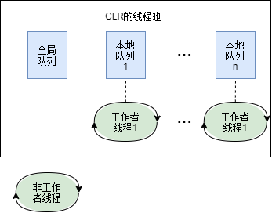

# 第 27 章 计算限制的异步操作

本章内容：

* <a href="#27_1">CLR 线程池基础</a>
* <a href="#27_2">执行简单的计算限制操作</a>
* <a href="#27_3">执行上下文</a>
* <a href="#27_4">协作式取消和超时</a>
* <a href="#27_5">任务</a>
* <a href="#27_6">`Parallel` 的静态 `For`，`ForEach` 和 `Invoke`方法</a>
* <a href="#27_7">并行语言集成查询(PLINQ)</a>
* <a href="#27_8">执行定时的计算限制操作</a>
* <a href="#27_9">线程池如何管理线程</a>

本章将讨论以异步方式操作的各种方式。异步的计算限制操作要用其他线程执行，例子包括编译代码、拼写检查、语法检测、电子表格重计算、音频或视频数据转码以及生成图像的缩略图。在金融和工程应用程序中，计算限制的操作也是十分普遍的。

大多数应用程序都不会花太多时间处理内存数据或执行计算。要验证这一点，可以打开“任务管理器”，选择“性能”标签。如果 CPU 利用率不到 100%(大多数时候都如此)，就表明当前运行的进程没有使用由计算机的 CPU 内核提供的全部计算能力。CPU 利用率低于 100% 时，进程中的部分(但不是全部)线程根本没有运行。相反，这些线程正在等待某个输入或输出操作。例如，这些线程可能正在等待一个计时器到期<sup>①</sup>；等待在数据库/Web服务器/文件/网络/其他硬件设备中读取或写入数据；或者等待按键、鼠标移动或鼠标点击等。执行 I/O 限制的操作时，Microsoft Windows 设备驱动程序让硬件设备为你“干活儿”，但 CPU 本身“无所事事”。由于线程不在 CPU 上运行，所以“任务管理器”说 CPU 利用率很低。

> ① 计时器“到期”(come due)的意思是还有多久触发它。

但是，即使 I/O 限制非常严重的应用程序也要对接收到的数据执行一些计算，而并行执行这些计算能显著提升应用程序的吞吐能力。本章首先介绍 CLR 的线程池，并解释了和它的工作和使用有关的一些基本概念。这些信息非常重要。为了设计和实现可伸缩的、响应灵敏和可靠的应用程序和组件，线程池是你必须采用的核心技术。然后，本章展示了通过线程池执行计算限制操作的各种机制。

## <a name="27_1">27.1 CLR 线程池基础</a>

如第 26 章所述，创建和销毁线程时一个昂贵的操作，要耗费大量时间。另外，太多的线程会浪费内存资源。由于操作系统必须调度可运行的线程并执行上下文切换，所以太多的线程还对性能不利。为了改善这个情况，CLR 包含了代码来管理它自己的**线程池**(thread pool)。线程池是你的应用程序能使用的线程集合。每 CLR 一个线程池；这个线程池由 CLR 控制的所有 AppDomain 共享。如果一个进程中加载了多个 CLR，那么每个 CLR 都有它自己的线程池。

CLR 初始化时，线程池中是没有线程的。在内部，线程池维护了一个操作请求队列。应用程序执行一个异步操作时，就调用某个方法，将一个记录项(entry)追加到线程池的队列中。线程池的代码从这个队列中提取记录项，将这个记录项派发(dispatch)给一个线程池线程。如果线程池中没有线程，就创建一个新线程。创建线程会造成一定的性能损失(前面已讨论过了)。然而，当线程池线程完成任务后，线程不会被销毁。相反，线程会返回线程池，在那里进入空闲状态，等待响应另一个请求。由于线程不销毁自身，所以不再产生额外的性能损失。

如果你的应用程序向线程池发出许多请求，线程池会尝试只用这一个线程来服务所有请求。然而，如果你的应用程序发出请求的速度超过了线程池线程处理它们的速度，就会创建额外的线程。最终，你的应用程序的所有请求都能由少量线程处理，所以线程池不必创建大量线程。

如果你的应用程序停止向线程池发出请求，池中会出现大量什么都不做的线程。这是对内存资源的浪费。所以，当一个线程池线程闲着没事儿一段时间之后(不同版本的 CLR 对这个时间的定义不同)，线程会自己醒来终止自己以释放资源。线程终止自己会产生一定的性能损失。然而，线程终止自己是因为它闲的慌，表明应用程序本身就么有做太多的事情，所以这个性能损失关系不大。

线程池可以只容纳少量线程，从而避免浪费资源；也可以容纳更多的线程，以利用多处理器、超线程处理器和多核处理器。它能在这两种不同的状态之间从容地切换。线程池是启发式的。如果应用程序需要执行许多任务，同时有可能的 CPU，那么线程池会创建更多的线程。应用程序负载减轻，线程池线程就终止它们自己。

## <a name="27_2">27.2 执行简单的计算限制操作</a>

要将一个异步的计算限制操作放到线程池的队列中，通常可以调用 `ThreadPool` 类定义的以下方法之一：

```C#
static bool QueueUserWorkItem(WaitCallback callBack);
static bool QueueUserWorkItem(WaitCallback callBack, Object state);
```

这些方法向线程池的队列添加一个“工作项”(work item)以及可选的状态数据。然后，所有方法会立即返回。工作项其实就是由 `callBack` 参数标识的一个方法，该方法将由线程池线程调用。可向方法传递一个 `state` 实参(状态数据)。无 `state` 参数的那个版本的 `QueueUserWorkItem` 则向回调方法传递`null`。最终，池中的某个线程会处理工作项，造成你指定的方法被调用。你写的回调方法必须匹配 `System.Threading.WaitCallback`委托类型，后者的定义如下：

`delegate void WaitCallback(Object state);`

> 注意 `WaitCallback` 委托、`TimerCallback` 委托(参见本章 27.8 节“执行定时计算限制操作”的讨论)和 `ParameterizedThreadStart` 委托(在第 26 章“线程基础” 中讨论)签名完全一致。定义和该签名匹配的方法后，使用 `ThreadPool.QueueUserWorkItem`、`System.Threading.Timer` 和 `System.Threading.Thread` 对象都可调用该方法。

```C#
using System;
using System.Threading;

public static class Program {
    public static void Main() {
        Console.WriteLine("Main thread: queuing an asynchronous operation");
        ThreadPool.QueueUserWorkItem(ComputeBoundOp, 5);
        Console.WriteLine("Main thread: Doing other work here...");
        Thread.Sleep(10000);    // 模拟其他工作(10秒)
        Console.WriteLine("Hit <Enter> to end this program...");
        Console.ReadLine();
    }

    private static void ComputeBoundOp(Object state) {
        // 这个方法由一个线程池线程执行

        Console.WriteLine("In ComputeBoundOp: state={0}", state);
        Thread.Sleep(1000);             // 模拟其他工作(1秒)

        // 这个方法返回后，线程回到池中，等待另一个任务
    }
}
```

编译并运行上述代码得到以下输出：

```cmd
Main thread: queuing an asynchronous operation
Main thread: Doing other work here...
In ComputeBoundOp: state=5
```

有时也得到以下输出：

```cmd
Main thread: queuing an asynchronous operation
In ComputeBoundOp: state=5
Main thread: Doing other work here...
```

之所以输出行的顺序会发生变化，是因为两个方法相互之间是异步运行的。Windows 调度器决定先调度哪一个线程。如果应用程序在多核机器上运行，可能同时调度它们。

> 注意 一旦回调方法抛出未处理的异常，CLR 会终止进程(除非宿主强加了它自己的策略)。未处理异常的详情已在第 20 章“异常和状态管理”进行了讨论。

> 注意 对于 Windows Store 应用，`System.Threading.ThreadPool` 类是没有公开的。但在使用 `System.Threading.Tasks` 命名空间中的类型时，这个类被间接地使用(详情参见本章稍后的 27.5 节“任务”)。

## <a name="27_3">27.3 执行上下文</a>

每个线程都关联了一个执行上下文数据结构。**执行上下文**(execution context)包括的东西有安全设置(压缩栈、`Thread` 的 `Principal`属性和 Windows 身份)、宿主设置(参见 `System.Threading.HostExecutionContextManager`)以及逻辑调用上下文数据(参见`System.Runtime.Remoting.Messaging.CallContext` 的 `LogicalSetData` 和 `LogicalGetData`方法)。线程执行它的代码时，一些操作会受到线程执行上下文设置(尤其是安全设置)的影响。理想情况下，每当一个线程(初始线程)使用另一个线程(辅助线程)执行任务时，前者的执行上下文应该流向(复制到)辅助线程。这就确保了辅助线程执行的任何操作使用的是相同的安全设置和宿主设置。还确保了再初始线程的逻辑调用上下文中存储的任何数据都适用于辅助线程。

默认情况下，CLR 自动造成初始线程的执行上下文“流向”任何辅助线程。这造成将上下文信息传给辅助线程，但这会对性能造成一定影响。这是因为执行上下文中包含大量信息，而收集所有这些信息，再把它们复制到辅助线程，要耗费不少时间。如果辅助线程又采用了更多的辅助线程，还必须创建和初始化更多的执行上下文数据结构。

`System.Threading`命名空间有一个 `ExecutionContext` 类，它允许你控制线程的执行上下文如何从一个线程“流”向另一个。下面展示了这个类的样子：

```C#
public sealed class ExecutionContext : IDisposable, ISerializable {
    [SecurityCritical] public static AsyncFlowControl SuppressFlow();
    public static void RestoreFlow();
    public static Boolean IsFlowSuppressed();

    // 为列出不常用的方法
}
```

可用这个类阻止执行上下文流动以提升应用程序的性能。对于服务器应用程序，性能的提升可能非常显著。但客户端应用程序的性能提升不了多少。另外，由于 `SuppressFlow` 方法用 `[SecurityCritical]` 特性进行了标识，所以在某些客户端应用程序(比如 Silverlight)中是无法调用的。当然，只有在辅助线程不需要或者不访问上下文信息时，才应阻止执行上下文的流动。当然，只有在辅助线程不需要或者不访问上下文信息时，才应阻止执行上下文的流动。如果初始线程的执行上下文不流向辅助线程，辅助线程会使用上一次和它关联的任意执行上下文。在这种情况下，辅助线程不应执行任何要依赖于执行上下文状态(不如用户的 Windows 身份)的代码。

下例展示了向 CLR 的线程池队列添加一个工作项的时候，如何通过阻止执行上下文的流动来影响线程逻辑调用上下文中的数据<sup>①</sup>：

> ① 添加到逻辑调用上下文的项必须是可序列化的，详情参见第 24 章“运行时序列化”。对于包含了逻辑调用上下文数据项的执行上下文，让它流动起来可能严重损害性能，因为为了捕捉执行上下文，需要对所有数据项进行序列化和反序列化。

```C#
public static void Main() {
    // 将一些数据放到 Main 线程的逻辑调用上下文中
    CallContext.LogicalSetData("Name", "Jeffrey");

    // 初始化要由一个线程池线程做的一些工作
    // 线程池线程能访问逻辑调用上下文数据
    ThreadPool.QueueUseWorkItem(
        state => Console.WriteLine("Name={0}", CallContext.LogicalGetData("Name")));

    // 现在，阻止 Main 线程的执行上下文的流动
    ExecutionContext.SuppressFlow();

    // 初始化要由线程池线程做的工作，
    // 线程池线程不能访问逻辑调用上下文数据
    ThreadPool.QueueUserWorkItem(state => Console.WriteLine("Name={0}", CallContext.LogicalGetData("Name")));

    // 恢复 Main 线程的执行上下文的流动，
    // 以免将来使用更多的线程池线程
    ExecutionContext.RestoreFlow();
    ...
    Console.ReadLine();
}
```

编译并运行上述代码得到以下输出：

```cmd
Name=Jeffrey
Name=
```

## <a name="27_4">27.4 协作式取消和超时</a>

Microsoft .NET Framework 提供了标准的**取消操作**模式。这个模式是**协作式**的，意味着要取消的操作必须显式支持**取消**。换言之，无论执行操作的代码，还是试图取消操作的代码，还是试图取消操作的代码，都必须使用本节提到的类型。对于长时间运行的计算限制操作，支持取消是一件很“棒”的事情。所以，你应该考虑为自己的计算限制操作添加取消能力。本节将解释具体如何做。但首先解释一下作为标准协作式取消模式一部分的两个 FCL 类型。

取消操作首先要创建一个 `System.Threading.CancellationTokenSource` 对象。这个类看起来像下面这样：

```C#
public sealed class CancellationTokenSource : IDisposable {  // 一个引用类型
    public CancellationTokenSource();
    public void Dispose();          // 释放资源(比如 WaitHandle)

    public Boolean IsCancellationRequested { get; }
    public CancellationToken Token { get; }

    public void Cancel();   // 内部调用 Cancel 并传递 false
    public void Cancel(Boolean throwOnFirstException);
    ...
}
```

这个对象包含了和管理取消有关的所有状态。构造好一个 `CancellationTokenSource`(一个引用类型)之后，可从它的 `Token` 属性获得一个或多个`CancellationToken`(一个值类型)实例，并传给你的操作，使操作可以取消。以下是 `CancellationToken` 值类型最有用的成员：

```C#
public struct CancellationToken {           // 一个值类型
    public static CancellationToken None { get;	}       // 很好用

    public Boolean IsCancellationRequested { get; }     // 由非通过 Task 调用的操作调用
    public void ThrowIfCancellationRequested();         // 由通过 Task 调用的操作调用

    // CancellationTokenSource 取消时，WaitHandle 会收到信号
    public WaitHandle WaitHandle { get; }
    // GetHashCode，Equals，operator== 和 operator!= 成员未列出

    public bool CanBeCanceled { get; } // 很少使用

    public CancellationTokenRegistration Register(Action<Object> callback, Object state, Boolean useSynchronizationContext);        // 未列出更简单的重载版本
}
```

`CancellationToken` 实例是轻量级值类型，包含单个私有字段，即对其 `CancellationTokenSource` 对象的引用。在计算限制操作的循环中，可定时调用 `CancellationToken` 的 `IsCancellationRequested` 属性，了解循环是否应该提前终止，从而终止计算限制的操作。提前终止的好处在于，CPU 不需要再把时间浪费在你对结果不感兴趣的操作上。以下代码将这些概念全部梳理了一遍：

```C#
internal static class CancellationDemo {
    public static void Go() {
        CancellationTokenSource cts = new CancellationTokenSource();

        // 将 CancellationToken 和 “要数到的数” (number-to-count-to)传入操作
        ThreadPool.QueueUserWorkItem(o => Count(cts.Token, 1000));

        Console.WriteLine("Press <Enter> to cancel the operation.");
        Console.ReadLine();
        cts.Cancel();   // 如果 Count 方法已返回，Cancel 没有任何效果
        // Cancel 立即返回，方法从这里继续运行...

        Console.ReadLine();
    }

    private static void Count(CancellationToken token, Int32 countTo) {
        for (Int32 count = 0; count < countTo; count++) {
            if (token.IsCancellationRequested) {
                Console.WriteLine("Count is cancelled");
                break;  // 退出循环以停止操作
            }
            Console.WriteLine(count);
            Thread.Sleep(200);      // 出于演示目的而浪费一些时间
        }
        Console.WriteLine("Count is done");
    }
}
```

> 注意 要执行一个不允许被取消的操作，可向该操作传递通过调用`CancellationToken`的静态`None`属性而返回的`CancellationToken`。该属性返回一个特殊的`CancellationToken`实例，它不和任何`CancellationTokenSource`对象关联(实例的私有字段为`null`)。由于没有`CancellationTokenSource`，所以没有代码能调用 `Cancel`。一个操作如果查询这个特殊 `CancellationToken` 的`IsCancellationRequested`属性，将总是返回`false`。使用某个特殊`CancellationToken`实例查询`CancellationToken`的`CanBeCanceled`属性，属性会返回`false`。相反，对于通过查询`CancellationTokenSource`对象的`Token`属性而获得的其他所有`CancellationToken`实例，该属性(`CancellationToken`)都会返回`true`。

如果愿意，可调用 `CancellationTokenSource` 的 `Register` 方法登记一个或多个在取消一个 `CancellationTokenSource` 时调用的方法。要向方法传递一个 `Action<Object>` 委托；一个要通过委托传给回到(方法)的状态值；以及一个`Boolean`值(名为`useSynchronizationContext`)，该值指明是否要使用调用线程的 `SynchronizationContext` 来调用委托。如果为 `useSynchronizationContext` 参数传递 `false`，那么调用`Cancel` 的线程会顺序调用已登记的所有方法。为 `useSynchronizationContext` 参数传递 `true`，则回调(方法)会被 send(而不是post<sup>①</sup>)给已捕捉的 `SynchronizationContext` 对象，后者决定由哪个线程调用回调(方法)。`SynchronizationContext` 类的详情将在 28.9 节“应用程序及其线程处理模型”讨论。

> ① 简单地说，如果执行 send 操作，要等到在目标线程哪里处理完毕之后才会返回。在此期间，调用线程会被阻塞。这相当于同步调用。而如果执行 post 操作，是指将东西 post 到一个队列中便完事儿，调用线程立即返回，相当于异步调用。————译注

> 注意 向被取消的 `CancellationTokenSource` 登记一个回调方法，将由调用 `Register` 的线程调用回调方法(如果为 `useSynchronizationContext` 参数传递了 `true` 值，就可能要通过调用线程的 `SynchronizationContext` 进行)。

多次调用 `Register`，多个回调方法都会调用。这些回调方法可能抛出未处理的异常。如果调用 `CancellationTokenSource` 的 `Cancel` 方法，向它传递 `true`，那么抛出了未处理异常的第一个回调方法会阻止其他回调方法的执行，抛出的异常也会从 `Cancel` 中抛出。如果调用 `Cancel` 并向它传递 `false`，那么登记的所有回调方法都会调用。所有未处理的异常都会添加到一个集合中。所有回调方法都执行好后，其中任何一个抛出了未处理的异常，`Cancel` 就会抛出一个 `AggregateException`，该异常实例的 `InnerExceptions` 属性被设为已抛出的所有异常对象的集合。如果登记的所有回调方法都没有抛出未处理的异常，那么 `Cancel` 直接返回，不抛出任何异常。

> 重要提示 没有办法将 `AggregateException` 的 `InnerExceptions` 集合中的一个异常对象和特的操作对应起来；你只知道某个操作出错，并通过异常类型知道出了什么错。要跟踪错误的具体位置，需要检查异常对象的 `StackTrace` 属性，并手动扫描你的源代码。

`CancellationToken` 的 `Register` 方法返回一个 `CancellationTokenRegistration`，如下所示：

```C#
public readonly struct CancellationTokenRegistration : 
    IEquatable<CancellationTokenRegistration>, IDisposable {
    public void Dispose();
    // GetHashCode, Equals, operator== 和 operator!=成员未列出
}
```

可以调用 `Dispose` 从关联的 `CancellationTokenSource` 中删除已登记的回调；这样一来，在调用 `Cancel` 时，便不会再调用这个回调。以下代码演示了如何向一个 `CancellationTokenSource` 登记两个回调：

```C#
var cts = new CancellationTokenSource();
cts.Token.Register(() => Console.WriteLine("Canceled 1"));
cts.Token.Register(() => Console.WriteLine("Canceled 2"));

// 出于测试的目的，让我们取消它，以便执行 2 个回调
cts.Cancel();
```

运行上述代码，一旦调用 `Cancel` 方法，就会得到以下输出： 

```cmd
Canceled 2
Canceled 1
```

最后，可以通过链接另一组 `CancellationTokenSource` 来新建一个 `CancellationTokenSource` 对象。任何一个链接的 `CancellationTokenSource` 被取消，这个新的 `CancellationTokenSource` 对象就会被取消。以下代码对此进行了演示：

```C#
// 创建一个 CancellationTokenSource
var cts1 = new CancellationTokenSource();
cts1.Token.Register(() => Console.WriteLine("cts1 canceled"));

// 创建另一个 CancellationTokenSource
var cts2 = new CancellationTokenSource();
cts2.Token.Register(() => Console.WriteLine("cts2 canceled"));

// 创建一个新的 CancellationTokenSource，它在 cts1 或 cts2 取消时取消
var linkedCts = CancellationTokenSource.CreateLinkedTokenSource(cts1.Token, cts2.Token);
linkedCts.Token.Register(() => Console.WriteLine("linkedCts canceled"));

// 取消其中一个 CancellationTokenSource 对象(我选择cts2)
cts2.Cancel();

// 显示哪个 CancellationTokenSource 对象被取消了
Console.WriteLine("cts1 canceled={0}, cts2 canceled={1}, linkedCts={2}",
    cts1.IsCancellationRequested, cts2.IsCancellationRequested, linkedCts.IsCancellationRequested);
```

运行上述代码得到以下输出：

```cmd
linkedCts canceled
cts2 canceled
cts1 canceled=False, cts2 canceled=True, linkedCts=True
```

在很多情况下，我们需要在过一段时间之后才取消操作。例如，服务器应用程序可能会根据客户端的请求而开始计算。但必须在 2 秒钟之内有响应，无论此时工作是否已经完成。有的时候，与其等待漫长时间获得一个完整的结果，还不如在短时间内报错，或者用部分计算好的结果进行响应。幸好，`CancellationTokenSource` 提供了在指定时间后自动取消的机制。为了利用这个机制，要么用接受延时参数的构造构造一个 `CancellationTokenSource` 对象，要么调用 `CancellationTokenSource` 的 `CancelAfter` 方法。

```C#
public sealed class CancellationTokenSource : IDisposable {
    public CancellationTokenSource(int millisecondsDelay);
    public CancellationTokenSource(TimeSpan delay);
    public void CancelAfter(int millisecondsDelay);
    public void CancelAfter(TimeSpan delay);
    ...
}
```

## <a name="27_5">27.5 任务</a>

很容易调用 `ThreadPool` 的 `QueueUserWorkItem` 方法发起一次异步的计算限制操作。但这个技术有许多限制。最大的问题是没有内建的机制让你知道操作在什么时候完成，也没有机制在操作完成时获得返回值。为了克服这些限制(并解决其他一些问题)，Microsoft 引入了 **任务**的概念。我们通过 `System.Threading.Tasks` 命名空间中的类型来使用任务。

所以，不是调用 `ThreadPool` 的 `QueueUserWorkItem` 方法，而是用任务来做相同的事情：

```C#
ThreadPool.QueueUserWorkItem(ComputeBoundOp, 5);    // 调用 QueueUserWorkItem
new Task(ComputeBoundOp, 5).Start();                // 用 Task 来做相同的事情
Task.Run(() => ComputeBoundOp(5));                  // 另一个等价的写法
```

第二行代码创建 `Task` 对象并立即调用 `Start` 来调度任务。当然，也可先创建好 `Task` 对象再调用 `Start`。例如，可以创建一个 `Task` 对象再调用`Start` 来调度任务。由于创建 `Task` 对象并立即调用 `Start` 是常见的编程模式，所以可以像最后一行代码展示的那样调用 `Task` 的静态 `Run` 方法。

为了创建一个 `Task`，需要调用构造器并传递一个 `Action` 或 `Action<Object>` 委托。这个委托就是你想执行的操作。如果传递的是期待一个`Object` 的方法，还必须向 `Task` 的构造器传递最终要传给操作的实参。调用 `Run` 时可以传递一个 `Action` 或 `Func<TResult>` 委托来指定想要执行的操作。无论调用构造器还是`Run`，都可选择传递一个 `CancellationToken`，它使 `Task` 能在调度前取消(详情参见稍后的 27.5.2 节“取消任务”)。

还可选择向构造器传递一些 `TaskCreationOptions` 标志来控制 `Task` 的执行方式。`TaskCreationOptions` 枚举类型定义了一组可按位 OR 的标志。定义如下：

```C#
[Flags, Serializable]
public enum TaskCreationOptions {
	None           = 0x0000,      // 默认
	
    // 提议 TaskScheduler 你希望该任务尽快执行
	PreferFairness = 0x0001,
	
    // 提议 TaskScheduler 应尽可能地创建线程池线程
	LongRunning    = 0x0002,
	
    // 该提议总是被采纳：将一个 Task 和它的父 Task 关联(稍后讨论)
	AttachedToParent = 0x0004,
	
    // 该提议总是被采纳：如果一个任务试图和这个父任务连接，它就是一个普通任务，而不是子任务
	DenyChildAttach = 0x0008,
	
    // 该提议总是被采纳：强迫子任务使用默认调度器而不是父任务的调度器
	HideScheduler = 0x0010
}
```

有的标志只是“提议”，`TaskScheduler` 在调度一个 `Task` 时，可能会、也可能不会采纳这些提议。不过，`AttachedToParent`，`DenyChildAttach` 和`HideScheduler` 总是得以采纳，因为它们和 `TaskScheduler` 本身无关。`TaskScheduler` 对象的详情将在 27.5.7 节“任务调度器”讨论。

### 27.5.1 等待任务完成并获取结果 

可等待任务完成并获取结果。例如，以下 `Sum` 方法在 `n` 值很大的时候会执行较长时间：

```C#
private static Int32 Sum(Int32 n) {
    Int32 sum = 0;
    for (; n > 0; n--)
        checked { sum += n; }       // 如果 n 太大，会抛出 System.OverflowException
    return sum;
}
```

现在可以构造一个 `Task<TResult>`对象(派生自 `Task`)，并为泛型 `TResult` 参数传递计算限制操作的返回类型。开始任务之后，可等待它完成并获得结果，如以下代码所示：

```C#
// 创建一个 Task(现在还没有开始运行)
Task<Int32> t = new Task<Int32>(n => Sum((Int32)n), 1000000000);

// 可以后再启动任务
t.Start();

// 可选择显式等待任务完成
t.Wait();   // 注意：还有一些重载的版本能接受 timeout/CancellationToken 值

// 可获得结果(Result 属性内部会调用 Wait)
Console.WriteLine("The Sum is: " + t.Result);   // 一个 Int32 值
```

如果计算限制的任务抛出未处理的异常，异常会被“吞噬”并存储到一个集合中，而线程池线程可以返回到线程池中。调用 `Wait` 方法或者 `Result` 属性时，这些成员会抛出一个 `System.AggregateException` 对象。

> 重要提示 线程调用 `Wait` 方法时，系统检查线程要等待的 `Task` 是否已开始执行。如果是，调用 `Wait` 的线程来执行 `Task`。在这种情况下，调用`Wait` 的线程不会阻塞；它会执行 `Task` 并立即返回。好处在于，没有线程会被阻塞，所以减少了对资源的占用(因为不需要创建一个线程来替代被阻塞的线程)，并提升了性能(因为不需要花时间创建线程，也没有上下文切换)。不好的地方在于，假如线程在调用 `Wait` 前已获得了一个线程同步锁，而 `Task` 试图获取同一个锁，就会造成死锁的线程！

`AggregateException` 类型封装了异常对象的一个集合(如果父任务生成了多个子任务，而多个子任务都抛出了异常，这个集合便可能包含多个异常)。该类型的 `InnerExceptions` 属性返回一个 `ReadOnlyCollection<Exception>` 对象。不要混淆 `InnerExceptions` 属性和 `InnerException` 属性，后者是`AggregateException` 类从 `System.Exception` 基类继承的，在本例中，`AggregateException` 的 `InnerExceptions` 属性的元素 `0` 将引用由计算限制方法(`Sum`)抛出的实际 `System.OverflowException` 对象。

为方便编码，`AggregateException` 重写了 `Exception` 的 `GetBaseException` 方法，返回作为问题根源的最内层的 `AggregateException`(假定集合只有一个最内层的异常)。`AggregateException` 还提供了一个 `Flatten` 方法，它创建一个新的 `AggregateException`， 其 `InnerExceptions` 属性包含一个异常列表，其中的异常是通过遍历原始 `AggregateException` 的内层异常层次结构而生成的。最后，`AggregateException` 还提供了一个 `Handle` 方法，它为 `AggregateException` 中包含的每个异常都调用一个回调方法。然后，回调方法可以为每个异常决定如何对其进行处理：回调返回 `true` 表示异常已处理；返回 `false` 表示未处理。调用 `Handle` 后，如果至少有一个异常没有被处理，就创建一个新的 `AggregateException` 对象，其中只包含未处理的异常，并抛出这个新的 `AggregateException` 对象。本章以后会展示使用了 `Flatten` 和 `Handle` 方法的例子。

> 重要提示 如果一致不调用 `Wait` 或 `Result`，或者一直不查询 `Task` 的 `Exception` 属性，代码就一直注意不到这个异常的发生。这当然不好，因为程序遇到了未预料到的问题，而你居然没注意到。为了帮助你检测没有被注意到。为了帮助你检测没有被注意到的异常，可以向 `TaskScheduler` 的静态 `UnobservedTaskException` 事件登记一个回调方法。每次放一个 `Task` 被垃圾回收时，如果存在一个没有被注意到的异常，CLR 的终结器线程就会引发这个事件。一旦引发，就会向你的事件处理方法传递一个 `UnobservedTaskExceptionEventArgs` 对象，其中包含你没有注意到的 `AggregateException`。

除了等待单个任务，`Task` 类还提供了两个静态方法，允许线程等待一个 `Task` 对象数组。其中，`Task` 的静态 `WaitAny` 方法会阻塞调用线程，直到数组中的任何 `Task` 对象完成。方法返回 `Int32` 数组索引值，指明完成的是哪个 `Task` 对象。方法返回后，线程被唤醒并继续运行。如果发生超时，方法将返回 `-1`。如果 `WaitAny` 通过一个 `CancellationToken` 取消，会抛出一个 `OperationCanceledException`。

类似地，`Task` 类还有一个静态 `WaitAll` 方法，它阻塞调用线程，直到数组中的所有 `Task` 对象完成。如果所有 `Task` 对象都完成，`WaitAll` 方法返回`true`。发生超时则返回 `false`。如果 `WaitAll` 通过一个 `CancellationToken`取消，会抛出一个 `OperationCanceledException`。

### 27.5.2 取消任务

可用一个 `CancellationTokenSource` 取消 `Task`。首先必须修订前面的 `Sun` 方法，让它接受一个 `CancellationToken`：

```C#
private static Int32 Sum(CancellationToken ct, Int32 n) {
    Int32 sum = 0;
    for (; n > 0; n--) {

        // 在取消标志引用的 CancellationTokenSource 上调用 Cancel，
        // 下面这行代码就会抛出 OperationCanceledException
        ct.ThrowIfCancellationRequested();

        checked { sum += n; }  // 如果 n 太大，会抛出 System.OverflowException
    }    
    return sum;
}
```

循环(负责执行计算限制的操作)中调用 `CancellationToken` 的 `ThrowIfCancellationRequested` 方法定时检查操作是否已取消。这个方法与`CancellationToken` 的 `IsCancellationRequested` 属性相似(27.4 节“协作式取消和超时”已经讨论过这个属性)。但如果 `CancellationTokenSource` 已经取消，`ThrowIfCancellationRequested` 会抛出一个 `OperationCanceledException`。之所以选择抛出异常，是因为和 `ThreadPool` 的 `QueueUserWorkItem` 方法初始化的工作项不同，任务有办法表示完成，任务甚至能返回一个值。所以，需要采取一种方式将已完成的任务和出错的任务区分开。而让任务抛出异常，就可以知道任务没有一直运行到结束。

现在像下面这样创建 `CancellationTokenSource` 和 `Task` 对象：

```C#
CancellationTokenSource cts = new CancellationTokenSource();
Task<Int32> t = Task.Run(() => Sum(cts.Token, 1000000000), cts.Token);

// 在之后的某个时间，取消 CancellationTokenSource 以取消 Task
cts.Cancel();       // 这是异步请求，Task 可能已经完成了

try {
    // 如果任务已取消，Request 会抛出一个 AggregateException
    Console.WriteLine("The sum is: " + t.Result);   // 一个 Int32 值
}
catch (AggregateException x) {
    // 将任何 OperationCanceledException 对象都视为已处理。
    // 其他任何异常都造成抛出一个新的 AggregateException，
    // 其中只包含未处理的异常
    x.Handle(e => e is OperationCanceledException);
    // 所有异常都处理好之后，执行下面这一行
    Console.WriteLine("Sum was canceled");
}
```

可在创建 `Task` 时将一个 `CancellationToken` 传给构造器(如上例所示)，从而将两者关联。如果 `CancellationToken` 在 `Task` 调度前取消，`Task`会被取消，永远都不执行<sup>①</sup>。但如果 `Task` 已调度(通过调用 `Start` 方法<sup>②</sup>)，那么`Task`的代码只有显示支持取消，其操作才能在执行期间取消。遗憾的是，虽然 `Task` 对象关联了一个 `CancellationToken`，但却没有办法访问它。因此，必须在`Task` 的代码中获得创建`Task` 对象时的同一个`CancellationToken`。为此，最简单的办法就是使用一个 lambda 表达式，将 `CancellationToken` 作为闭包变量“传递”(就像上例那样)。

> ① 顺便说一句，如果一个任务还没有开始就试图取消它，会抛出一个 `InvalidOperationException`。
> ② 调用静态 `Run` 方法会自动创建 `Task`对象并立即调用`Start`。  ———— 译注

### 27.5.3 任务完成时自动启动新任务

伸缩性好的软件不应该使线程阻塞。调用 `Wait`，或者在任务尚未完成时查询任务的 `Result` 属性<sup>③</sup>，极有可能造成线程池创建新线程，这增大了资源的消耗，也不利于性能和伸缩性。幸好，有更好的办法可以知道一个任务在什么时候结束运行。任务完成时可启动另一个任务。下面重写了之前的代码，它不阻塞任何线程：

> ③ `Result` 属性内部会调用 `Wait`。 ———— 译注

```C#
// 创建并启动一个 Task，继续另一个任务
Task<Int32> t = Task.Run(() => Sum(CancellationToken.None, 1000));

// ContinueWith 返回一个 Task，但一般都不需要再使用该对象(下例的 cwt)
Task cwt = t.ContinueWith(task => Concole.WriteLine("The sum is: " + task.Result));
```

现在，执行 `Sum` 的任务完成时会启动另一个任务(也在某个线程池线程上)以显示结果。执行上述代码的线程不会进入阻塞状态并等待这两个任务中的任何一个完成。相反，线程可以执行其他代码。如果线程本身就是一个线程池线程，它可以返回池中以执行其他操作。注意，执行 `Sum` 的任务可能在调用 `ContinueWith` 之前完成。但这不是一个问题，因为 `ContinueWith` 方法会看到 `Sum` 任务已经完成，会立即启动显示结果的任务。

注意， `ContinueWith` 返回对新 `Task` 对象的引用(我的代码是将该引用放到 `cwt` 变量中)。当然，可以用这个 `Task` 对象调用各种成员(比如 `Wait`，`Result`，甚至 `ContinueWith`)，但一般都忽略这个 `Task` 对象，不再用变量保存对它的引用。

另外，`Task` 对象内部包含了 `ContinueWith` 任务的一个集合。所以，实际可以用一个 `Task` 对象来多次调用 `ContinueWith`。任务完成时，所有`ContinueWith` 任务都会进入线程池的队列中。此外，可在调用 `ContinueWith` 时传递对一组 `TaskContinuationOptions` 枚举值进行按位 OR 运算的结果。前 6 个标志(`None`，`PreferFairness`，`LongRunning`，`AttachedToParent`，`DenyChildAttach` 和 `HideScheduler`)与之前描述的 `TaskCreationOptions` 枚举类型提供的标志完全一致。下面是 `TaskContinuationOptions` 类型的定义：

```C#
[Flags, Serializable]
public enum TaskContinuationOptions
{
    None                    = 0x0000,  // 默认

    // 提议 TaskScheduler 你希望该任务尽快执行.
    PreferFairness          = 0x0001,
    // 提议 TaskScheduler 应尽可能地创建池线程线程
    LongRunning             = 0x0002,
    
    // 该提议总是被采纳：将一个 Task 和它的父 Task 关联(稍后讨论) 
    AttachedToParent        = 0x0004,

    // 任务试图和这个父任务连接将抛出一个 InvalidOperationException
    DenyChildAttach         = 0x0008,

    // 强迫子任务使用默认调度器而不是父任务的调度器
    HideScheduler           = 0x0010,

    // 除非前置任务(antecedent task)完成，否则禁止延续任务完成(取消)
    LazyCancellation        = 0x0020,

    // 这个标志指出你希望由执行第一个任务的线程执行
    // ContinueWith 任务。第一个任务完成后，调用
    // ContinueWith 的线程接着执行 ContinueWith 任务 ①
    ExecuteSynchronously    = 0x80000,

    // 这些标志指出在什么情况下运行 ContinueWith 任务
    NotOnRanToCompletion    = 0x10000,
    NotOnFaulted            = 0x20000,
    NotOnCanceled           = 0x40000,

    // 这些标志是以上三个标志的便利组合
    OnlyOnRanToCompletion   = NotOnRanToCompletion | NotOnFaulted, //0x60000,
    OnlyOnFaulted           = NotOnRanToCompletion | NotOnCanceled,// 0x50000,
    OnlyOnCanceled          = NotOnFaulted | NotOnCanceled,// 0x30000
}
```

> ① `ExecuteSynchronously` 是指同步执行。两个任务都在使用同一个线程一前一后地执行，就称为同步执行。 ————译注

调用 `ContinueWith` 时，可用 `TaskContinuationOptions.OnlyOnCanceled` 标志指定新任务只有在第一个任务被取消时才执行。类速地，`TaskContinuationOptions.OnlyOnFaulted` 标志指定新任务只有在第一个任务抛出未处理的异常时才执行。当然，还可使用 `TaskContinuationOptions.OnlyOnRanToCompletion` 标志指定新任务只有在第一个任务顺利完成(中途没有取消，也没有抛出未处理异常)时才执行。默认情况下，如果不指定上述任何标志，则新任务无论如何都会运行，不管第一个任务如何完成。一个 `Task` 完成时，它的所有未运行的延续任务都被自动取消<sup>②</sup>。下面用一个例子来演示所有这些概念。

> ② 未运行是因为不满足前面说的各种条件。 ———— 译注

```C#
// 创建并启动一个 Task，它有多个延续任务 
Task<Int32> t = Task.Run(() => Sum(10000)); 

// 每个 ContinueWith 都返回一个 Task， 但这些 Task 一般都用不着了
t.ContinueWith(task => Console.WriteLine("The sum is: " + task.Result), 
 TaskContinuationOptions.OnlyOnRanToCompletion); 
t.ContinueWith(task => Console.WriteLine("Sum threw: " + task.Exception.InnerException), 
 TaskContinuationOptions.OnlyOnFaulted); 
t.ContinueWith(task => Console.WriteLine("Sum was canceled"), 
 TaskContinuationOptions.OnlyOnCanceled); 
```

### 27.5.4 任务可以启动子任务

最后，任务支持父/子关系，如以下代码所示：

```C#
Task<Int32[]> parent = new Task<int[]>(() => {
    var results = new Int32[3];     // 创建一个数组来存储结果

    // 这个任务创建并启动 3 个子任务
    new Task(() => results[0] = Sum(10000), TaskCreationOptions.AttachedToParent).Start();
    new Task(() => results[1] = Sum(20000), TaskCreationOptions.AttachedToParent).Start();
    new Task(() => results[2] = Sum(30000), TaskCreationOptions.AttachedToParent).Start();

    // 返回对数组的引用(即使数组元素可能还没有初始化)
    return results;
});

// 付任务及其子任务运行完成后，用一个延续任务显示结果
var cwt = parent.ContinueWith(parentTask => Array.ForEach(parentTask.Result, Console.WriteLine));

// 启动父任务，便于它启动它的子任务
parent.Start();
```

在本例中，父任务闯将并启动三个 `Task` 对象。一个任务创建的一个或多个 `Task` 对象默认是顶级任务，它们与创建它们的任务无关。但 `TaskCreationOptions.AttachedToParent` 标志将一个 `Task` 和创建它的 `Task` 关联，结果是除非所有子任务(以及子任务的子任务)结束运行，否则创建任务(父任务)不认为已经结束。调用 `ContinueWith` 方法创建 `Task` 时，可指定 `TaskCreationOptions.AttachedToParent` 标志将延续任务指定成子任务。

### 27.5.5 任务内部揭秘

每个 `Task` 对象都有一组字段，这些字段构成了任务的状态。其中包括一个 `Int32 ID`(参见`Task`的只读`Id`属性)、代表`Task` 执行状态的一个`Int32`、对父任务的引用、对`Task`创建时指定的 `TaskScheduler` 的引用、对回调方法的引用、对要传给回调方法的对象的引用(可通过`Task`的只读`AsyncState`属性查询)、对 `ExecutionContext` 的引用以及对 `ManualResetEventSlim` 对象的引用。另外，每个 `Task` 对象都有对根据需要创建的补充状态的引用。补充状态包含一个 `CancellationToken` 、一个 `ContinueWithTask` 对象集合、为抛出未处理异常的子任务而准备的一个 `Task` 对象集合等。说了这么多，重点不需要任务的附加功能，那么使用 `ThreadPool.QueueUserWorkItem` 能获得更好的资源利用率。

`Task` 和 `Task<TResult>` 类实现了 `IDisposable` 接口，允许在用完 `Task` 对象后调用 `Dispose`。如今，所有 `Dispose` 方法所做的都是关闭 `ManualResetEventSlim` 对象。但可定义从 `Task` 和 `Task<TResult>` 派生的类，在这些类中分配它们自己的资源，并在它们重写的 `Dispose` 方法中释放这些资源。我建议不要在代码中为 `Task` 对象显式调用 `Dispose`；相反，应该让垃圾回收器自己清理任何不再需要的资源。

每个 `Task` 对象都包含代表 `Task` 唯一 ID 的 `Int32` 字段。创建 `Task` 对象时该字段初始化为零。首次查询 `Task` 的只读 `Id` 属性时，属性将一个唯一的 `Int32` 值分配给该字段，并返回该值。任务 ID 从 1 开始，没分配一个 ID 都递增 1。在 Microsoft Visual Studio 调试器中查看 `Task` 对象，会造成调试器显示 `Task` 对象，会造成调试器显示 `Task` 的 ID，从而造成为 `Task` 分配 ID。

该 ID 的意义在于每个 `Task` 都可用唯一值进行标识。事实上，Visual Studio 会在“并行任务” 和 “并行堆栈” 窗口中显示这些任务 ID。但由于不能在自己的代码中分配 ID，所以几乎不可能将 ID 和代码正在做的事情联系起来。运行任务的代码时，可查询 `Task` 的静态 `CurrentId` 属性来返回一个可空`Int32(Int32?)`。调试期间，可在 Visual Studio 的“监视”或“即使”窗口中调用它，获得当前正在调试的代码的 ID。然后，可在“并行任务”或“并行堆栈”窗口中找到自己的任务。如果当前没有任务正在执行，查询 `CurrentId` 属性会返回 `null`。

在一个 `Task` 对象的存在期间，可查询 `Task` 的只读 `Status` 属性了解它在其生存期的什么位置。该属性返回一个 `TaskStatus` 值，定义如下：

```C#
public enum TaskStatus {
	// 这些标志指出一个 Task 在其生命期内的状态
	Created,                // 任务已显示创建：可以手动 Start() 这个任务
	WaitingForActivation,   // 任务已隐式创建：会自动开始
	
    WaitingToRun,           // 任务已调度，但尚未运行
	Running,                // 任务正在运行

    // 任务正在等待他的子任务完成，子任务完成后它才完成
	WaitingForChildrenToComplete,

    // 任务的最终状态是一下三个之一：
	RanToCompletion,
	Canceled,
	Faulted
}
```

首次构造 `Task` 对象时，它的状态是 `Created`。以后，当任务启动时，它的状态变成 `WaitingToRun`。`Task` 实际在一个线程上运行时，它的状态变成 `Running`。任务停止运行，状态变成 `WaitingForChildrenToComplete`。任务完成时进入一下状态之一：`RanToCompletion`(运行完成)，`Canceled`(取消)或`Faulted`(出错)。如果运行完成，可通过 `Task<TResult>` 的 `Result` 属性来查询任务结果。`Task` 或 `Task<TResult>` 出错时，可查询 `Task` 的 `Exception` 属性来获得任务抛出的未处理异常；该属性总是返回一个 `AggregateException` 对象，对象的 `InnerException` 集合包含了所有未处理的异常。

为简化编码，`Task` 提供了几个只读 `Boolean` 属性，包括 `IsCanceled`，`IsFaulted` 和 `IsCompleted`。注意当 `Task` 处于 `RanToCompletion`，`Canceled` 或 `Faulted` 状态时，`IsCompleted` 返回 `true`。判断一个 `Task` 是否成功完成最简单的办法是使用如下所示的代码：

`if (task.Status == TaskStatus.RanToCompletion) ...`

调用 `ContinueWith`，`ContinueWhenAll`，`ContinueWhenAny` 或 `FromAsync` 等方法来创建的 `Task` 对象处于 `WaitingForActivation` 装填。该状态意味着 `Task` 的调度由任务基础结构控制。例如，不可显式启动通过调用 `ContinueWith` 来创建的对象，该 `Task` 在它的前置任务(antecedent task)执行完毕后自动启动。

### 27.5.6 任务工厂

有时需要创建一组共享相同配置的 `Task` 对象。为避免机械地将相同的参数传给每个 `Task` 的构造器，可创建一个任务工厂来封装通用的配置。`System.Threading.Tasks` 命名空间定义了一个 `TaskFactory` 类型和一个 `TaskFactory<TResult>` 类型。两个类型都派生自 `System.Object`；也就是说，它们是平级的。

要创建一组返回 `void` 的任务，就构造一个 `TaskFactory`；要创建一组具有特定返回类型的任务，就构造一个 `TaskFactory<TResult>`，并通过泛型 `TResult` 实参传递任务的返回类型。创建上述任何工厂类时，要向构造器传递工厂创建的所有任务都具有的默认值。具体地说，要向任务工厂传递希望任务具有的 `CancellationToken`，`TaskScheduler`，`TaskCreationOptions` 和 `TaskContinuationOptions` 设置。

以下代码演示了如何使用一个 `TaskFactory`：

```C#
Task parent = new Task(() => {
    var cts = new CancellationTokenSource();
    var tf = new TaskFactory<Int32>(cts.Token,
        TaskCreationOptions.AttachedToParent,
        TaskContinuationOptions.ExecuteSynchronously,
        TaskScheduler.Default);

    // 这个任务创建并启动 3 个子任务
    var childTasks = new[] {
        tf.StartNew(() => Sum(cts.Token, 10000)),
        tf.StartNew(()=> Sum(cts.Token, 20000)),
        tf.StartNew(()=> Sum(cts.Token, Int32.MaxValue)) // 太大，抛出 OverflowException
    };

    // 任何子任务抛出异常，就取消其余子任务
    for (Int32 task = 0; task < childTasks.Length; task++)
        childTasks[task].ContinueWith(
            t => cts.Cancel(), TaskContinuationOptions.OnlyOnFaulted);

    // 所有子任务完成后，从未出错/未取消的任务获取返回的最大值，
    // 然后将最大值传给另一个任务来显示最大结果
    tf.ContinueWhenAll(
        childTasks,
        completedTasks => completedTasks.Where(t => !t.IsFaulted && !t.IsCanceled).Max(t => t.Result),
        CancellationToken.None)
            .ContinueWith(t => Console.WriteLine("The maximum is: " + t.Result),
                TaskContinuationOptions.ExecuteSynchronously);                        
});

// 子任务完成后，也显示任何未处理的异常
parent.ContinueWith(p => {
    // 我将所有文本放到一个 StringBuilder 中，并只调用 Console.WriteLine 一次，
    // 因为这个任何可能和上面的任务并行执行，而我不希望任务的输出变得不连续
    StringBuilder sb = new StringBuilder(
        "The following exception(s) occurred:" + Environment.NewLine);

    foreach (var e in p.Exception.Flatten().InnerExceptions)
        sb.AppendLine(" " + e.GetType().ToString());
    Console.WriteLine(sb.ToString());
}, TaskContinuationOptions.OnlyOnFaulted);

// 启动父任务，使它能启动子任务
parent.Start();
```

我通过上述代码创建了一个 `TaskFactory<Int32>` 对象。该任务工厂创建 3 个 `Task` 对象。我希望所有子任务都以相同方式配置：每个 `Task` 对象都共享相同的 `CancellationTokenSource` 标记，任务都被视为其父任务的子任务，`TaskFactory` 创建的所有延续任务都以同步方式执行，而且 `TaskFactory` 创建的所有 `Task` 对象都使用默认 `TaskScheduler`。 

然后创建包含 3 个子任务对象的数组，所有子任务都调用 `TaskFactory` 的 `StartNew` 方法来创建。使用该方法可以很方便地创建并启动子任务。我通过一个循环告诉每个子任务，如果抛出未处理的异常，就取消其他仍在运行的所有子任务。最后，我在 `TaskFactory` 上调用 `ContinueWhenAll`，它创建在所有子任务都完成后启动的一个 `Task`。由于这个任务是用 `TaskFactory` 创建的，所以它仍被视为父任务的一个子任务，会用默认 `TaskScheduler` 同步执行。但我希望即使其他子任务被取消，也要运行这个任务，所以我通过传递 `CancellationToken.None` 来覆盖 `TaskFactory` 的 `CancellationToken`。这使该任务不能取消。最后，当处理所有结果的任务完成后，我创建另一个任务来显示从所有子任务中返回的最大值。

> 注意 调用 `TaskFactory` 或 `TaskFactory<TResult>`的静态 `ContinueWhenAll` 和 `ContinueWhenAny` 方法时，以下`TaskContinuationOption` 标志是非法的：`NotOnRanToCompletion`，`NotOnFaulted` 和 `NotOnCanceled`。当然，基于这些标志组合起来的标志(`OnlyOnCanceled`，`OnlyOnFaulted` 和 `OnlyOnRanToCompletion`)也是非法的。也就是说，无论前置任务是如何完成的，`ContinueWhenAll` 和 `ContinueWhenAny` 都会执行延续任务。

### 27.5.7 任务调度器

任务基础结构非常灵活，其中 `TaskScheduler` 对象功不可没。`TaskScheduler` 对象负责执行被调度的任务，同时向 Visual Studio 调试器公开任务信息。FCL 提供了两个派生自 `TaskScheduler` 的类型：线程池任务调度器(thread pool task scheduler)，和同步上下文任务调度器(synchronization context task scheduler)。默认情况下，所有应用程序使用的都是线程池任务调度器。这个任务调度器将任务调度给线程池的工作者线程，将在本章后面的 27.9 节“线程池如何管理线程”进行更详细的讨论。可查询 `TaskScheduler` 的静态 `Default` 属性来获得对默认任务调度器的引用。

同步上下文任务调度器适合提供了图形用户界面的应用程序，例如 Windows 窗体、Windows Presentation Foundation(WPF)、Silverlight 和 Windows Store 应用程序。它将所有任务都调度给应用程序的 GUI 线程，使所有任务代码都能成功更新 UI 组件(按钮、菜单项等)。该调度器不使用线程池。可执行 `TaskScheduler` 的静态 `FromCurrentSynchronizationContext` 方法来获得对同步上下文任务调度器的引用。

下面这个简单的 Windows 窗体应用程序演示了如何使用同步上下文任务调度器。

```C#
internal sealed class MyForm : Form {
    private readonly TaskScheduler m_syncContextTaskScheduler;
    public MyForm() {
        // 获得对一个同步上下文任务调度器的引用
        m_syncContextTaskScheduler = TaskScheduler.FromCurrentSynchronizationContext();

        Text = "Synchronization Context Task Scheduler Demo";
        Visible = true; Width = 400; Height = 100;
    }


    private CancellationTokenSource m_cts;

    protected override void OnMouseClick(MouseEventArgs e) {
        if (m_cts != null) {    // 一个操作正在进行，取消它
            m_cts.Cancel();
            m_cts = null;
        } else {    // 操作没有开始，启动它
            // 操作没有开始，启动它
            Text = "Operation running";
            m_cts = new CancellationTokenSource();

            // 这个任务使用默认任务调度器，在一个线程池线程上执行
            Task<Int32> t = Task.Run(() => Sum(m_cts.Token, 20000), m_cts.Token);

            // 这些任务使用同步上下文任务调度器，在 GUI 线程上执行
            t.ContinueWith(task => Text = "Result: " + task.Result,
                CancellationToken.None, TaskContinuationOptions.OnlyOnRanToCompletion, m_syncContextTaskScheduler);

            t.ContinueWith(task => Text = "Operation canceled",
                CancellationToken.None, TaskContinuationOptions.OnlyOnCanceled, m_syncContextTaskScheduler);

            t.ContinueWith(task => Text = "Operation faulted",
                CancellationToken.None, TaskContinuationOptions.OnlyOnFaulted, m_syncContextTaskScheduler);
        }
        base.OnMouseClick(e);
    }
}
```

单击窗体的客户区域，就会在一个线程池线程上启动一个计算限制的任务。使用线程池线程很好，因为 GUI 线程在此期间不会被阻塞，能响应其他 UI 操作。但线程池线程执行的代码不应尝试更新 UI 组件，否则会抛出 `InvalidOperationException`。

计算限制的任务完成后执行三个延续任务之一。它们由与 GUI 线程对应的同步上下文任务调度器来调度。任务调度器将任务放到 GUI 线程的队列中，使它们的代码能成功更新 UI 组件。所有任务都通过继承的 `Text` 属性来更新窗体的标题。

由于计算限制的工作(`Sum`)在线程池线程上运行，所以用户可以和 UI 交互来取消操作。在这个简单的例子中，我允许用户在操作进行期间单击窗体的客户区域来取消操作。

当然，如果有特殊的任务调度需求，完全可以定义自己的 `TaskScheduler` 派生类。Microsoft 在 Parallel Extensions Extras 包中提供了大量和任务有关的示例代码，其中包括多个任务调度器源码，下载地址是 [http://code.msdn.microsoft.com/ParExtSamples](http://code.msdn.microsoft.com/ParExtSamples)。下面是这个包提供的一部分任务调度器。

* `IOTaskScheduler`  
  这个任务调度器将任务排队给线程池的 I/O 线程而不是工作者线程。

* `LimitedConcurrencyLevelTaskScheduler`  
  这个任务调度器不允许超过 *n*(一个构造器参数)个任务同时执行

* `OrderedTaskScheduler`  
  这个任务调度器一次只允许一个任务执行。这个类派生自 `LimitedConcurrencyLevelTaskScheduler`，为 *n* 传递 1。

* `PrioritizingTaskScheduler`  
  这个任务调度器将任务送入 CLR 线程池队列。之后，可调用 `Prioritize` 指出一个 `Task` 应该在所有普通任务之前处理(如果它还没有处理的话)。可以调用 `Deprioritize` 使一个 `Task` 在所有普通任务之后处理。
  
* `ThreadPerTaskScheduler`  
  这个任务调度器为每个任务创建并启动一个单独的线程；他完全不使用线程池。

## <a name="27_6">27.6 `Parallel` 的静态 `For`，`ForEach` 和 `Invoke`方法</a>

一些常见的编程情形可通过任务提升性能。为简化编程，静态 `System.Threading.Tasks.Parallel` 类封装了这些情形，它内部使用 `Task` 对象。例如，不要像下面这样处理集合中的所有项：

```C#
// 一个线程顺序执行这个工作(每次迭代调用一次 DoWork)
for (Int32 i = 0; i < 1000; i++) DoWork(i);
```

而要使用 `Parallel` 类的 `For` 方法，用多个线程池线程辅助完成工作：

```C#
// 线程池的线程并行处理工作
Parallel.For(0, 1000, i => DoWork(i));
```

类似地，如果有一个集合，那么不要像这样写：

```C#
// 一个线程顺序执行这个工作(每次迭代调用一次 DoWork)
foreach (var item in collection) DoWork(item);
```

而要像这样写：

```C#
// 线程池的线程并行处理工作
Parallel.ForEach(collection, item => DoWork(item));
```

如果既可以使用 `For`， 也可以使用 `ForEach`， 那么建议使用 `For`，因为它执行得更快。

最后，如果要执行多个方法，那么既可像下面这样顺序执行：

```C#
// 一个线程顺序执行所有方法
Method1();
Method2();
Method3();
```

也可并行执行，如下所示：

```C#
// 线程池的线程并行执行方法
Parallel.Invoke(
    () => Method1(),
    () => Method2(),
    () => Method3());
```

`Parallel` 的所有方法都让调用线程参与处理。从资源利用的角度说，这是一件好事，因为我们不希望调用线程停下来(阻塞)，等线程池线程做完所有工作才能继续。然而，如果调用线程在线程池线程完成自己额那一部分工作之前完成工作，调用线程会将自己挂起，直到所有工作完成工作。这也是一件好事，因为这提供了和使用普通`for` 或 `foreach` 循环时相同的语义：线程要在所有工作完成后才继续运行。还要注意，如果任何操作抛出未处理的异常，你调用的 `Parallel` 方法最后会抛出一个 `AggregateException`。

但这并不是说需要对自己的源代码进行全文替换，将 `for` 循环替换成对 `Parallel.For` 的调用，将 `foreach` 循环替换成对 `Parallel.ForEach` 的调用。调用 `Parallel` 的方法时有一个很重要的前提条件：工作项必须能并行执行！所以，如果工作必须顺序执行，就不要使用 `Parallel` 的方法。另外，要避免会修改任何共享数据的工作项，否则多个线程同时处理可能会损坏数据。解决这个问题一般的办法是围绕数据访问添加线程同步锁。但这样一次就只能有一个线程访问数据，无法享受并行处理多个项所带来的好处。

另外，`Parallel` 的方法本身也有开销；委托对象必须分配，而针对每个工作项都要调用一次这些委托。如果有大量可由多个线程处理的工作项，那么也许能获得性能的提升。另外，如果每一项都涉及大量工作，那么通过委托来调用所产生的性能损失是可以忽略不计的。但如果只为区区几个工作项使用 `Parallel` 的方法，或者为处理得非常快的工作项使用 `Parallel` 的方法，就会得不偿失，反而降低性能。

注意 `Parallel` 的 `For`， `ForEach` 和 `Invoke` 方法都提供了接受一个 `ParallelOptions` 对象的重载版本。这个对象的定义如下：

```C#
public class ParallelOptions {
    public ParallelOptions();

    // 允许取消操作
    public CancellationToken CancellationToken { get; set; }  // 默认为 CancellationToken.None

    // 允许指定可以并发操作的最大工作项数目
    public Int32 MaxDegreeOfParallelism { get; set; }  // 默认为 -1 (可用 CPU 数)

    // 允许指定要使用那个 TaskScheduler
    public TaskSchedulerTaskScheduler { get; set; }   // 默认为 TakScheduler.Default
}
```

除此之外，`For` 和 `ForEach` 方法有一些重载版本允许传递 3 个委托。

* 任务局部初始化委托(localInit)，为参与工作的每个任务都调用一次该委托。这个委托是在任务被要求处理一个工作项之前调用的。

* 主体委托(body)，为参与工作的各个线程所处理的每一项都调用一次该委托。

* 任务局部终结委托(localFinally)，为参与工作的每一个任务都调用一次该委托。这个委托是在任务处理好派发给它的所有工作项之后调用的。即使主体委托代码引发一个未处理的异常，也会调用它。

以下代码演示如何利用这三个委托计算一个目录中的所有文件的字节长度。

```C#
private static Int64 DirectoryBytes(String path, String searchPattern, SearchOption searchOption) {
    var files = Directory.EnumerateFiles(path, searchPattern, searchOption);
    Int64 masterTotal = 0;

    ParallelLoopResult result = Parallel.ForEach<String, Int64>(
        files,

        () => { // localInit: 每个任务开始之前调用一次
            // 每个任务开始之前，总计值都初始化为 0
            return 0;   // 将 taskLocalTotal 初始值设为 0
        },

        (file, loopState, index, taskLocalTotal) => { // body:每个工作项调用一次
            // 获得这个文件的大小，把它添加到这个任务的累加值上
            Int64 fileLength = 0;
            FileStream fs = null;
            try {
                fs = File.OpenRead(file);
                fileLength = fs.Length;
            }
            catch (IOException) { /* 忽略拒绝访问的任何文件 */ }
            finally { if (fs != null) fs.Dispose(); }
            return taskLocalTotal + fileLength;
        },

        taskLocalTotal => {  // localFinally: 每个任务完成时调用一次
            // 将这个任务的总计值(taskLocalTotal)加到总的总计值(masterTotal)上
            Interlocked.Add(ref masterTotal, taskLocalTotal);
        });

    return masterTotal;
}
```

每个任务都通过 `taskLocalTotal` 变量为分配给它的文件维护它自己的总计值。每个任务在完成工作之后，都通过调用 `Interlocked.Add` 方法(参见第 29 章“基元线程同步构造”)，以一种线程安全的方式更新总的总计值(master total)。由于每个任务都有自己的总计值，所以在一个工作项处理期间，无需进行线程同步。由于线程同步会造成性能的损失，所以不需要线程同步是好事。只有在每个任务返回之后，`masterTotal` 才需要以一种线程安全的方式更新 `masterTotal` 变量。所以，因为调用 `Interlocked.Add` 而造成的性能损失每个任务只发生一次，而不会每个工作项都发生。

注意，我们向主体委托传递了一个 `ParallelLoopState` 对象，它的定义如下：

```C#
public class ParallelLoopState {
	public void Stop ();
    public Boolean IsStopped { get; }

    public void Break ();
    public Int64? LowestBreakIteration { get; }

	public Boolean IsExceptional { get; }
    public Boolean ShouldExitCurrentIteration { get; }
}
```

参与工作的每个任务都获得它自己的 `ParallelLoopState` 对象，并可通过这个对象和参与工作的其他任务进行交互。`Stop` 方法告诉循环停止处理任何更多的工作，未来对 `IsStopped` 属性的查询会返回 `true`。 `Break` 方法告诉循环不再继续处理当前项之后的项。例如，假如 `ForEach` 被告知要处理 100 项，并在处理第 5 项时调用了 `Break`，那么循环会确保前 5 项处理好之后，`ForEach` 才返回。但要注意，这并不是说在这 100 项中，只有前 5 项才会被处理，第 5 项之后的项可能在以前已经处理过了。`LowestBreakIteration` 属性返回在处理过程中调用过 `Break` 方法的最低的项。如果从来没有调用过 `Break`，`LowestBreakIteration` 属性会返回 `null`。

处理任何一项时，如果造成未处理的异常，`IsException` 属性会返回 `true`。处理一项时花费太长时间，代码可查询 `ShouldExitCurrentIteration` 属性看它是否应该提前退出。如果调用过 `Stop`，调用过 `Break`，取消过 `CancellationTokenSource`(由 `ParallelOption` 的 `CancellationToken` 属性引用)，或者处理一项时造成了未处理的异常，这个属性就会返回 `true`。

`Parallel` 的 `For` 和 `ForEach` 方法都返回一个 `ParallelLoopResult` 实例，它看起来像下面这样：

```C#
public struct ParallelLoopResult {
    // 如果操作提前终止，以下方法返回 false
    public Boolean IsCompleted { get; }
    public Int64? LowestBreakIteration { get; }
}
```

可检查属性来了解循环的结果。如果 `IsCompleted` 返回 `true`，表明循环运行完成，所有项都得到了处理。如果 `IsCompleted` 为 `false`，而且 `LowestBreakIteration` 为 `null`，表明参与工作的某个线程调用了 `Stop` 方法。如果 `IsCompleted` 返回`false`，而且`LowestBreakIteration` 不为 `null`，表明参与工作的某个线程调用了 `Break` 方法，从 `LowestBreakIteration` 返回的 `Int64` 值是保证得到处理的最低一项的索引。如果抛出异常，应捕捉 `AggregateException` 来得体地恢复。

## <a name="27_7">27.7 并行语言集成查询(PLINQ)</a>

Microsoft 的语言集成查询(Language Integrated Query，LINQ)功能提供了一个简捷的语法来查询数据集合。可用 LINQ 轻松对数据项进行筛选、排序、投射等操作。使用 LINQ to Objects 时，只有一个线程顺序处理数据集合中的所有项；我们称之为**顺序查询**(sequential query)。要提高处理性能，可以使用**并行 LINQ**(Parallel LINQ)，它将顺序查询转换成并行查询，在内部使用任务(排队给默认 `TaskScheduler`)，将集合中的数据项的处理工作分散到多个 CPU 上，以便并发处理多个数据项。和 `Parallel` 的方法相似，要同时处理大量项，或者每一项的处理过程都是一个耗时的计算限制的操作，那么能从并行 LINQ 获得最大的收益。

静态 `System.Linq.ParallelEnumerable` 类(在 System.Core.dll 中定义)实现了 PLINQ 的所有功能，所以必须通过 C# 的 `using` 指令将`System.Linq` 命名空间导入你的源代码。尤其是这个类公开了所有标准 LINQ 操作符(`Where`，`Select`，`SelectMany`，`GroupBy`，`Join`，`OrderBy`，`Skip`，`Take`等)的并行版本。所有这些方法都是扩展了 `System.Linq.ParallelQuery<T>` 类型的扩展方法。要让自己的 LINQ to Objects 查询调用这些方法的并行版本，必须将自己的顺序查询(基于 `IEnumerable` 或者 `IEnumerable<T>`)转换成并行查询(基础 `ParallelQuery` 或者 `ParallelQuery<T>`)，这是用 `ParallelEnumerable` 的 `AsParallel` 扩展方法来实现的<sup>①</sup>，如下所示：

> ① `ParallelQuery<T>` 类派生自 `ParallelQuery` 类。

```C#
public static ParallelQuery<TSource> AsParallel<TSource>(this IEnumerable<TSource> source)
public static ParallelQuery          AsParallel(this IEnumerable source)
```

下面是将顺序查询转换成并行查询的例子。查询返回的是一个程序集中定义的所有过时(obsolete)方法：

```C#
private static void ObsoleteMethods(Assembly assembly) {
    var query = 
        from type in assembly.GetExportedTypes().AsParallel()

        from method in type.GetMethods(BindingFlags.Public |
            BindingFlags.Instance | BindingFlags.Static)

        let obsoleteAttrType = typeof(ObsoleteAttribute)

        where Attribute.IsDefined(method, obsoleteAttrType)

        orderby type.FullName

        let obsoleteAttrObj = (ObsoleteAttribute)
            Attribute.GetCustomAttribute(method, obsoleteAttrType)

        select String.Format("Type={0}\nMethod={1}\nMessage={2}\n",
                type.FullName, method.ToString(), obsoleteAttrObj.Message);

    // 显示结果
    foreach (var result in query) Console.WriteLine(result);
}
```

虽然不太常见，但在一个查询中，可以从执行并行操作切换回执行顺序操作，这是通过调用 `ParallelEnumerable` 的 `AsSequential` 方法做到的：

`public static IEnumerable<TSource> AsSequential<TSource>(this ParallelQuery<TSource> source)`

该方法将一个 `ParallelQuery<T>` 转换回一个 `IEnumerable<T>`。这样一来，在调用了 `AsSequential` 之后执行的操作将只由一个线程执行。

通过，一个 LINQ 查询的结果数据是让某个线程执行一个 `foreach` 语句来计算获得的，就像前面展示的那样。这意味着只有一个线程遍历查询的所有结果。如果希望以并行方式处理查询的结果，就应该使用 `ParallelEnumerable` 的 `ForAll` 方法处理查询：

`static void ForAll<TSource>(this ParallelQuery<TSource> source, Action<TSource> action)`

这个方法允许多个线程同时处理结果。可修改前面的代码来使用该方法：

```C#
// 显示结果
query.ForAll(Console.WriteLine);
```

然而，让多个线程同时调用 `Console.WriteLine` 反而会损害性能，因为 `Console` 类内部会对线程进行同步，确保每次只有一个线程能访问控制台窗口，避免来自多个线程的文本在最后显示时乱成一团。希望为每个结果都执行计算时，才使用 `ForALl` 方法。

由于 PLINQ 用多个线程处理数据项，所以数据项被并发处理，结果被无序地返回。如果需要让 PLINQ 保持数据项的顺序，可调用 `ParallelEnumerable` 的 `AsOrdered` 方法。调用这个方法时，线程会成组处理数据项。然后，这些组被合并回去，同时保持顺序。这样会损害性能。以下操作符生成不排序的操作：`Distinct`，`Except`，`Intersect`，`Union`，`Join`，`GroupBy`，`GroupJoin` 和 `ToLookup`。在这些操作符之后要再次强制排序，只需调用`AsOrdered` 方法。

以下操作符生成排序的操作：`OrderBy`，`OrderByDescending`，`ThenBy` 和 `ThenByDescending`。在这些操作符之后，要再次恢复不排序的处理，只需调用 `AsUnordered` 方法。

PLINQ 提供了一些额外的 `ParallelEnumerable` 方法，可调用它们来控制查询的处理方式：

```C#
public static ParallelQuery<TSource> WithCancellation<TSource>(
    this ParallelQuery<TSource> source, CancellationToken cancellationToken)

public static ParallelQuery<TSource> WithDegreeOfParallelism<TSource>(
    this ParallelQuery<TSource> source, Int32 degreeOfParallelism)

public static ParallelQuery<TSource> WithExecutionMode<TSource>(
    this ParallelQuery<TSource> source, ParallelExecutionMode executionMode)

public static ParallelQuery<TSource> WithMergeOptions<TSource>(
    this ParallelQuery<TSource> source, ParallelMergeOptions mergeOptions)
```

显然，`WithCancellation` 方法允许传递一个 `CancellationToken`，使查询处理能提前停止。`WithDegreeOfParallelism` 方法指定最多允许多少个线程处理查询。但不是说指定多少个它就创建多少个。它是有原则的，不需要的不会创建。你一般不用调用该方法。另外，默认是没个内核用一个线程执行查询。但如果想空出一些内核做其他工作，可调用 `WithDegreeOfParallelism` 并传递小于可用内核数的一个数字。另外，如果查询要执行同步I/O 操作，还可传递比内核数大的一个数字，因为线程会在这些操作期间阻塞。这虽然会浪费更多线程，但可以用更少的时间生成最终结果。同步 I/O 操作在客户端应用程序中没什么问题，但我强烈建议不要再服务器应用程序中执行同步 I/O 操作。

PLINQ 分析一个查询，然后决定如何最好地处理它。有的时候，顺序处理一个查询可以获得更好的性能，尤其是在使用以下任何操作时：`Concat`，`ElementAt(OrDefault)`，`First(OrDefault)`，`Last(OrDefault)`，`Skip(While)`，`Take(While)`或`Zip`。使用 `Select(Many)` 或 `Where` 的重载版本，并向你的 `selector` 或 `predicate` 委托传递一个位置索引时也是如此。然而，可以调用 `WithExecutionMode`， 向它传递某个 `ParallelExecutionMode` 标志，从而强迫查询以并行方式处理：

```C#
public enum ParallelExecutionMode {
    Default = 0,            // 让并行 LINQ 决定处理查询的最佳方式
    ForceParallelism = 1    // 强迫查询以其并行方式处理
}
```

如前所述，并行 LINQ 让多个线程处理数据项，结果必须再合并回去。可调用 `WithMergeOptions`，向它传递以下某个 `ParallelMergeOptions` 标志，从而控制这些结果的缓冲与合并方式：

```C#
public enum ParallelMergeOptions {
    Default       = 0,      // 目前和 AutoBuffered 一样(将来可能改变)
    NotBuffered   = 1,      // 结果一但就绪就开始处理
    AutoBuffered  = 2,      // 每个线程在处理前缓冲一些结果
    FullyBuffered = 3       // 每个线程在处理前缓冲所有结果
}
```

这些选项使你能在某种程度上平衡执行速度和内存消耗。`NotBuffered` 最省内存，但处理速度慢一些。`FullyBuffered` 消费较多的内存，`AutoBuffered` 介于 `NotBuffered` 和 `FullyBuffered` 之间。说真的，要想知道应该为一个给定的查询选择哪个并行合并选项，最好的办法就是亲自试验所有选项，并对比其性能。也可以“无脑”地接受默认值，它对于许多查询来说都工作得非常好。请参见以下博客文章，进一步了解 PLIQ 如何在 CPU 内核之间分配工作：

* *[http://blogs.msdn.com/pfxteam/archive/2009/05/28/9648672.aspx](http://blogs.msdn.com/pfxteam/archive/2009/05/28/9648672.aspx)*

* *[http://blogs.msdn.com/pfxteam/archive/2009/06/13/9741072.aspx](http://blogs.msdn.com/pfxteam/archive/2009/06/13/9741072.aspx)*

## <a name="27_8">27.8 执行定时的计算限制操作</a>

`System.Threading` 命名空间定义了一个 `Timer` 类，可用它让一个线程池线程定时调用一个方法。构造 `Timer` 类的实例相当于告诉线程池：在将来某个时间(具体由你指定)回调你的一个方法。`Timer` 类提供了几个相似的构造器：

```C#
public sealed class Timer : MarshalByRefObject, IDisposable {
    public Timer(TimerCallback callback, Object state, Int32    dueTime, Int32 period);
    public Timer(TimerCallback callback, Object state, UInt32   dueTime, UInt32 period);
    public Timer(TimerCallback callback, Object state, Int64    dueTime, Int64 period);
    public Timer(TimerCallback callback, Object state, TimeSpan dueTime, TimeSpan period)
}
```

4 个构造器以完全一致的方式构造 `Timer` 对象。`callback` 参数标识希望由一个线程池线程回调的方法。当然，你写的回调方法必须和`System.Threading.TimerCallback` 委托类型匹配，如下所示：

`delegate void TimerCallback(Object state);`

构造器的 `state` 参数允许在每次调用回调方法时都向它传递状态数据；如果没有需要传递的状态数据，可以传递 `null`。`dueTime`参数告诉CLR 在首次调用回调方法之前要等待多少毫秒。可以使用一个有符号或无符号的 32 位值、一个有符号的 64 位值或者一个 `TimeSpan` 值指定毫秒数。如果希望回调方法立即调用，为 `dueTime` 参数指定 `0` 即可。最后一个参数 `(period)` 指定了以后每次调用回调方法之前要等多少毫秒。如果为这个参数传递 `Timeout.Infinite(-1)`，线程池线程只调用回调方法一次。

在内部，线程池为所有 `Timer` 对象只使用了一个线程。这个线程知道下一个 `Timer` 对象在什么时候到期(计时器还有多久触发)。下一个 `Timer` 对象到期时，线程就会唤醒，在内部调用 `ThreadPool` 的 `QueueUserWorkItem`， 将一个工作项添加到线程池的队列中，使你的回调方法得到调用。如果回调方法的执行时间很长，计时器可能(在上个回调还没有完成的时候)再次触发。这可能造成多个线程池线程同时执行你的回调方法。为解决这个问题，我的建议是：构造 `Timer` 时，为 `period` 参数指定 `Timeout.Infinite`。这样，计时器就只触发一次。然后，在你的回调方法中，调用 `Change` 方法来指定一个新的 `dueTime`，并再次为 `period` 参数指定 `Timeout.Infinite`。以下是 `Change` 方法的各个重载版本：

```C#
public sealed class Timer : MarshalByRefObject, IDisposable {
    public bool Change(Int32    dueTime, Int32    period);
    public bool Change(UInt32   dueTime, UInt32   period);
    public bool Change(Int64    dueTime, Int64    period);
    public bool Change(TimeSpan dueTime, TimeSpan period);
}
```

`Timer` 类还提供了一个 `Dispose` 方法，允许完全取消计时器，并可在当时处于 pending 状态的所有回调完成之后，向 `notifyObject` 参数标识的内核对象发出信号。以下是 `Dispose` 方法的各个重载版本：

```C#
public sealed class Timer : MarshalByRefObject, IDisposable {
    public void Dispose();
    public bool Dispose(WaitHandle notifyObject);
}
```

> 重要提示 `Timer` 对象被垃圾回收时，它的终结代码告诉线程池取消计时器，使它不再触发。所以，使用 `Timer` 对象时，要确定有一个变量在保持 `Timer` 对象的存活，否则对你的回调方法的调用就会停止。21.1.3 节“垃圾回收与调试”对此进行了详细讨论和演示。

以下代码演示了如何让一个线程池线程立即调用回调方法，以后每 2 秒调用一次：

```C#
internal static class TimerDemo {
    private static Timer s_timer;

    public static void Main() {
        Console.WriteLine("Checking status every 2 seconds");

        // 创建但不启动计时器。确保 s_timer 在线程池线程调用 Status 之前引用该计时器
        s_timer = new Timer(Status, null,Timeout.Infinite, Timeout.Infinite);

        // 现在 s_timer 已被赋值，可以启动计时器了
        // 现在在 Status 中调用 Change，保证不会抛出 NullReferenceException
        s_timer.Change(0, Timeout.Infinite);

        Console.ReadLine();  // 防止进程终止
    }

    // 这个方法的签名必须和 TimerCallback 委托匹配
    private static void Status(Object state) {
        // 这个方法由一个线程池线程执行
        Console.WriteLine("In Status at {0}", DateTime.Now);
        Thread.Sleep(1000);         // 模拟其他工作(1 秒)

        // 返回前让 Timer 在 2 秒后再次触发
        s_timer.Change(2000, Timeout.Infinite);

        // 这个方法返回后，线程回归池中，等待下一个工作项
    }
}
```

如果有需要定时执行的操作，可利用 `Task` 的静态 `Delay` 方法和 C# 的 `async` 和 `await` 关键字(第 28 章讨论)来编码。下面重写了前面的代码。

```C#
internal static class DelayDemo {
    public static void Main() {
        Console.WriteLine("Checking status every 2 seconds");
        Status();
        Console.ReadLine();     // 防止进程终止
    }

    // 该方法可获取你想要的任何参数
    private static async void Status() {
        while (true) {
            Console.WriteLine("Checking status at {0}", DateTime.Now);
            // 要检查的代码放到这里...

            // 在循环末尾，在不阻塞喜爱能成的前提下延迟 2 秒
            await Task.Delay(2000);     // await 允许线程返回
            // 2 秒之后，某个线程会在 await 之后介入并继续循环
        }
    }
}
```

**计时器太多，时间太少**

遗憾的是，FCL 事实上提供了几个计时器，大多数程序员都不清楚它们有什么独特之处。让我试着解释一下。

* `System.Threading` 的 `Timer`  
  这是上一节讨论的计时器。要在一个线程池线程上执行定时的(周期性发生的)后台任务，它是最好的计时器。

* `System.Windows.Forms` 的 `Timer` 类  
  构造这个类的实例，相当于告诉 Windows 将一个计时器和调用线程关联(参见 Win32 `SetTimer` 函数)。当这个计时器触发时，Windows 将一条计时器消息(`WM_TIMER`)注入线程的消息队列。线程必须执行一个消息泵来提取这些消息，并把它们派发给需要的回调方法。注意，所有这些工作都只由一个线程完成 ———— 设置计时器的线程保证就是执行回调方法的线程。还意味着计时器方法不会由多哥线程并发执行。

* `System.Windows.Threading` 的 `DispatcherTimer`类  
  这个类是 `System.Windows.Forms` 的 `Timer` 类在 Silverlight 和 WPF 应用程序中的等价物。
  
* `Windows.UI.Xaml` 的 `DispatcherTimer` 类  
  这个类是 `System.Windows.Forms` 的 `Timer` 类在 Windows Store 应用中的等价物。

* `System.Timers` 的 `Timer` 类  
  这个计时器本质上是 `System.Threading` 的 `Timer` 类的包装类。计时器到期(触发)会导致 CLR 将事件放到线程池队列中。`System.Timers.Timer` 类派生自 `System.ComponentModel` 的 `Component` 类，允许在 Visual Studio 中将这些计时器对象放到设计平面(design surface)上。另外，它还公开了属性和事件，使它在 Visual Studio 的设计器中更容易使用。这个类是在好几年前，Microsoft 还没有理清线程处理和计时器的时候添加到 FCL 中的。这个类完全应该删除，强迫每个人都改为使用 `System.Threading.Timer` 类。事实上，我个人从来不用 `System.Timers.Timer` 类，建议你也不要用它，除非真的想在设计平面上添加一个计时器。

## <a name="27_9">27.9 线程池如何管理线程</a>

现在讨论一下线程池代码如何管理工作者线程和 I/O 线程。但我不打算讲太多细节，因为在这么多年的时间里，随着 CLR 的每个版本的发布，其内容的实现已发生了显著变化。未来的版本还会继续变化。最好是将线程池看成一个黑盒。不要拿单个应用程序去衡量它的性能，因为它不是针对某个单独的应用程序而设计的。相反，作为一个常规用途的线程调度技术，它面向的是大量应用程序；它对某些应用程序的效果要好于对其他应用程序。目前，它的工作情况非常理想，我强烈建议你信任它，因为你很难搞出一个比 CLR 自带的更好的线程池。另外，随着时间的推移，线程池代码内部会更改它管理线程的方式，所以大多数应用程序的性能会变得越来越好。

### 27.9.1 设置线程池限制  

CLR 允许开发人员设置线程池要创建的最大线程数。但实践证明，线程池永远都不应该设置线程数上限，因为可能发生饥饿或死锁。假定队列中有 1000 个工作项，但这些工作项全都因为一个事件而阻塞。等第 1001 个工作项发出信号才能解除阻塞。如果设置最大 1000 个线程，第 1001 个工作项就不会执行，全部 1000 个线程会一直阻塞，用户将被迫中止应用程序，并丢失所有未保存的工作。

事实上，开发人员很少人为限制自己的应用程序使用的资源。例如，你会启动自己的应用程序，并告诉系统你想限制应用程序能使用的内存量，或限制能使用的网络宽带吗？但出于某种心态，开发人员感觉好像有必要限制线程池拥有的线程数量。

由于存在饥饿和死锁问题，所以 CLR 团队一直都在稳步地增加线程池默认拥有的最大线程数。目前默认值是大约 1000 个线程。这基本上可以看成是不限数量，因为一个 32 位进程最大有 2 GB 的可用地址空间。加载了一组 Win32 和 CLR DLLs，并分配了本地堆和托管堆之后，剩余约 1.5 GB的地址空间。由于每个线程都要为其用户模式栈和线程环境块(TEB)准备超过 1 MB 的内存，所以在一个 32 位进程中，最多能够有大约 1360 个线程。试图创建更多的线程会抛出 `OutOfMemoryException`。当然，64 位进程提供了 8 TB 的地址空间，所以理论上可以创建千百万个线程。但分配这么多线程纯属浪费，尤其是当理想线程数等于机器的 CPU 数(内核数)的时候。CLR 团队应该做的事情是彻底取消限制，但他们现在还不能这样做，否则预期存在线程池限制的一些应用程序会出错。

`System.Threading.ThreadPool` 类提供了几个静态方法，可调用它们设置和查询线程池的线程数：`GetMaxThreads`，`SetMaxThreads`，`GetMinThreads`，`SetMinThreads` 和 `GetAvailableThreads`。强烈建议不要调用上述任何方法。限制线程池的线程数，一般都只会造成应用程序的性能变得更差，而不是更好。如果认为自己的应用程序需要几百或几千个线程，表明你的应用程序的架构和使用线程的方式已出现严重问题。本章和第 28 章会演示使用线程的正确方式。

### 27.9.2 如何管理工作者线程

图 27-1 展示了构成作为线程池一部分的工作者线程的各种数据结构。`ThreadPool.QueueUserWorkItem` 方法和 `Timer` 类总是将工作项放到全局队列中。工作者线程采用一个先入先出(first-in-first-out，FIFO)算法将工作项从这个队列中取出，并处理它们。由于多个工作者线程可能同时从全局队列中拿走工作项，所以所有工作者线程都竞争一个线程同步锁，以保证两个或多个线程不会获取同一个工作项。这个线程同步锁在某些应用程序中可能成为瓶颈，对伸缩性和性能造成某种程度的限制。

  

图 27-1 CLR 的线程池

> **重要提示** 线程池从来不保证排队中的工作项的处理顺序。这是合理的，尤其是考虑到多个线程可能同时处理工作项。但上述副作用使这个问题变得恶化了。你必须保证自己的应用程序对于工作项或 `Task` 的执行顺序不作任何预设。

现在说一说使用默认 `TaskScheduler`<sup>①</sup>(查询 `TaskScheduler` 的静态 `Default` 属性获得)来调度的 `Task` 对象。非工作者线程调度一个 `Task` 时，该 `Task` 被添加到全局队列。但每个工作者线程都有自己的本地队列。工作者线程调度一个 `Task` 时，该`Task` 被添加到调用线程的本地队列。

> ① 其他 `TaskScheduler` 派生对象的行为可能和我在这里描述的不同。

工作者线程准备好处理工作项时，它总是先检查本地队列来查找一个 `Task`。存在一个 `Task`，工作者线程就从本地队列移除 `Task` 并处理工作项。要注意的是，工作者线程采用后入先出(LIFO)算法将任务从本地队列取出。由于工作者线程是唯一允许访问它自己的本地队列头的线程，所以无需同步锁，而且在队列中添加和删除 `Task` 的速度非常快。这个行为的副作用是 `Task` 按照和进入队列时相反的顺序执行。

如果工作者线程发现它的本地队列变空了，会尝试从另一个工作者线程的本地队列“偷”一个 `Task`。 这个 `Task` 是从本地队列的尾部“偷”走的，并要求获取一个线程同步锁，这对性能有少许影响。当然，希望这种“偷盗”行为很少发生，从而很少需要获取锁。如果所有本地队列都变空，那么工作者线程会使用 FIFO 算法，从全局队列提取一个工作项(取得它的锁)。如果全局队列也为空，工作者线程会进入睡眠状态，等待事情的发生。如果睡眠了太长时间，它会自己醒来，并销毁自身，允许系统回收线程使用的资源(内核对象、栈、TEB 等)。

线程池会快速创建工作者线程，使工作者线程的数量等于传给 `ThreadPool` 的 `SetMinThreads` 方法的值。如果从不调用这个方法(也建议你永远不调用这个方法)，那么默认值等于你的进程允许使用的 CPU 数量，这是由进程的 affinity mask(关联掩码)决定的。通常，你的进程允许使用机器上的所有 CPU，所以线程池创建的工作者线程数量很快就会达到机器的 CPU 数。创建了这么多(CPU 数量)的线程后，线程池会监视工作项的完成速度。如果工作项完成的时间太长(具体多长没有正式公布)，线程池会创建更多的工作者线程。如果工作项的完成速度开始变快，工作者线程会被销毁。
