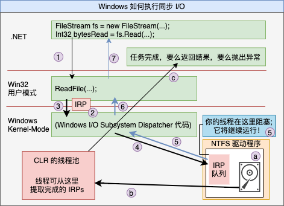

# 第 28 章 I/O 限制的异步操作

本章内容：

* <a href="#28_1">Windows 如何执行 I/O 操作</a>
* <a href="#28_2">C# 的异步函数</a>
* <a href="#28_3">编译器如何将异步函数转换成状态机</a>
* <a href="#28_4">异步函数扩展性</a>
* <a href="#28_5">异步函数和事件处理程序</a>
* <a href="#28_6">FCL 的异步函数</a>
* <a href="#28_7">异步函数和异常处理</a>
* <a href="#28_8">异步函数和其他功能</a>
* <a href="#28_9">应用程序及其线程处理模型</a>
* <a href="#28_10">以异步方式实现服务器</a>
* <a href="#28_11">取消 I/O 操作</a>
* <a href="#28_12">有的 I/O 操作必须同步进行</a>
* <a href="#28_13">I/O 请求优先级</a>

第 27 章重点讲述了如何异步执行计算限制的操作，允许线程池在多个 CPU 内核上调度任务，使多个线程能并发工作，从而高效率地使用系统资源，同时提升应用程序的吞吐能力。本章重点讲述如何异步执行 I/O 限制的操作，允许将任务交由硬件设备处理，期间完全不占用线程和 CPU 资源。然而，线程池仍然扮演了一个重要的角色，因为如同你马上就要看到的那样，各种 I/O 操作的结果还是要由线程池线程来处理的。

## <a name="28_1">28.1 Windows 如何执行 I/O 操作</a>

首先讨论 Windows 如何执行同步 I/O 操作。图 28-1 是连接了几个硬件设备的计算机系统。每个硬件设备都有自己的电路板，每个电路板都集成了一个小型的、特殊用途的计算机，它知道如何控制自己的硬件设备。例如，硬盘驱动器就有一个小的电路板，它知道如何旋转碟片、寻道、在碟上读写数据以及和计算机内存交换数据。

  

图 28-1 Windows 如何执行执行同步 I/O 操作

程序通过构造一个 `FileStream` 对象来打开磁盘文件，然后调用 `Read` 方法从文件中读取数据。调用 `FileStream` 的 `Read` 方法时，你的线程从托管代码转变为本机/用户模式代码，`Read` 内部调用 Win32 `ReadFile` 函数(①)。`ReadFile` 分配一个小的数据结构，称为 I/O 请求包(I/O Request Packet, IRP)(②)。IRP 结构初始化后包含的内容有：文件句柄，文件中的偏移量(从这个位置开始读取字节)，一个 `Byte[]` 数组的地址(数组用读取的字节来填充)，要传输的字节数以及其他常规性内容。

然后，`ReadFile` 将你的线程从本机/用户模式代码，向内核传递 IRP 数据结构，从而调用 Windows 内核(③)。根据 IRP 中的设备句柄， Windows 内核知道 I/O 操作要传送给哪个硬件设备。因此，Windows 将 IRP 中的设备句柄，Windows 内核知道 I/O 操作要传送给哪个硬件设备。因此，Windows 将 IRP 传送给恰当的设备驱动程序的 IRP 队列(④)。每个设备驱动程序都维护着自己的 IRP 队列，其中包含了机器上运行的所有进程发出的 I/O 请求。IRP 数据包到达时，设备驱动程序将 IRP 信息传给物理硬件设备上安装的电路板。现在，硬件设备将执行请求的 I/O 操作(⑤)。

但要注意一个重要问题；在硬件设备执行 I/O 操作期间，发出了 I/O 请求的线程将无事可做，所以 Windows 将线程变成睡眠状态，防止它浪费 CPU 时间(⑥)。这当然很好。但是，虽然线程不浪费时间，但它仍然浪费了空间(内存)，因为它的用户模式栈、内核模式栈、线程环境块(thread environment block，TEB)和其他数据结构都还在内存中，而且完全没有谁去访问这些东西。这当然就不好了。

最终，硬件设备会完成 I/O 操作。然后，Windows 会唤醒你的线程，把它调度给一个 CPU，使它从内核模式返回用户模式，再返回至托管代码(⑦，⑧和⑨)。`FileStream` 的 `Read` 方法现在返回一个 `Int32`，指明从文件中读取的实际字节数，使你知道在传给 `Read` 的 `Byte[]` 中，实际能检索到多少个字节。

假定要实现一个 Web 应用程序，每个客户端请求抵达服务器时，都需要发出一个数据库请求。客户端请求抵达时，一个线程池线程会调用你的代码。如果以同步方式发出数据库请求，线程会阻塞不确定的时间，等待数据库返回结果。在此期间，如果另一个客户端请求抵达，线程池会创建另一个线程，这个线程在发出另一个数据库请求后，同样会阻塞。随着越来越多的客户端请求抵达，创建的线程也越来越多，所有这些线程都阻塞并等待数据库的响应。结果是 Web 服务器分配的系统资源(线程及其内存)基本上都浪费了！

更糟的是，当数据库用结果来响应请求时，线程会被解锁，全都开始执行。但由于可能运行了大量线程，同时 CPU 内核只有区区几个，所以 Windows 被迫执行频繁的上下文切换，这进一步损害了性能。这和实现一个可伸缩应用程序的初衷是完全背道而驰的。

现在讨论一下 Windows 如何执行异步 I/O 操作。图 28-2 删除了除硬盘之外的所有硬件设备，引入了 CLR 的线程池，稍微修改了代码。打开磁盘文件的方式仍然是通过构造一个 `FileStream` 对象，但现在传递了一个 `FileOptions.Asynchronous` 标志，告诉 Windows 我希望文件的读/写操作以异步方式执行。

  

图 28-2 Windows 如何执行异步 I/O 操作

现在调用 `ReadAsync` 而不是 `Read` 从文件中读取数据。`ReadAsync` 内部分配一个 `Task<Int32>` 对象来代表用于完成读取操作的代码。然后，`ReadAsync` 调用 Win32 `ReadFile` 函数(①)。`ReadFile` 分配 IRP，和前面的同步操作一样初始化它(②)，然后把它传给 Windows 内核(③)。Windows 把 IRP 添加到硬盘驱动程序的 IRP 队列中(④)。但线程不再阻塞，而是允许返回至你的代码。所以，线程能立即从 `ReadAsync` 调用中返回(⑤，⑥和⑦)。当然，此时 IRP 可能尚未出处理好，所以不能够在 `ReadAsync` 之后的代码中访问传递的 `Byte[]` 中的字节。

那么，什么时候以及用什么方式处理最终读取的数据呢？注意，调用 `ReadAsync` 返回的是一个 `Task<Int32>` 对象。可在该对象上调用 `ContinueWith` 来登记任务完成时执行的回调方法，然后在回调方法中处理数据。当然，也可利用 C# 的异步函数功能简化编码，以顺序方式写代码(感觉就像是执行同步 I/O)。

硬件设备处理好 IRP 后(ⓐ)，会将完成的 IRP 放到 CLR 的线程池队列中(ⓑ)。将来某个时候，一个线程池线程会提取完成的 IRP 并执行完成任务的代码，最终要么设置异常(如果发生错误)，要么返回结果(本例是代表成功读取的字节数的一个 `Int32`)(ⓒ)<sup>①</sup>。这样一来，`Task` 对象就知道操作在什么时候完成，代码可以开始运行并安全地访问 `Byte[]` 中的数据。

> ① 完成的 IRP 使用一个先入先出(FIFO)算法从线程池中提取。

掌握基础知识后，让我们综合运用一下这些知识。假定在传入一个客户端请求之后，服务器发出的是一个异步数据库请求。此时线程不会阻塞，它可返回线程池以处理传入的更多客户端请求。所以，现在用一个线程就能处理所有传入的客户端请求。数据库服务器响应之后，它的响应也会进入线程池队列，使线程池线程能在某个时间处理它，最后将需要的数据发送回客户端。在这种情况下，只用一个线程就处理了所有客户端请求和所有数据库响应。服务器只需使用极少的系统资源，同时运行速度也得到了保证，尤其是考虑到根本不会发生上下文切换！

如果工作项被送入线程池的速度比一个线程处理它们的速度还要快，线程池就可能创建额外的线程。线程池很快会为机器上的每个 CPU 都创建一个线程。例如，在 4 核机器上，4 个客户端请求/数据库响应(任意组合)可以在 4 个线程上同时运行，而且还不会发生上下文切换。<sup>②</sup>

> ② 前提是当前没有运行其他线程。大多数时候都是如此，因此大多数计算机的 CPU 利用率都远低于 100%。即使 CPU 利用率因为低于优先级 8 的线程而达到了 100%，应用程序的可响应性和性能也不会受到影响，因为应用程序的线程会抢占低优先级线程。如果其他线程的优先级和你的发生冲突，那么上下文切换确实会发生。这种情况虽然不利于性能，但对可响应性来说是一件好事。记住，Windows 为每个进程准备了至少一个线程，而执行上下文切换可避免线程进入死循环的一个应用程序阻止其他应用程序的线程的运行。

然而，如果其中任何一个线程主动阻塞(通过调用同步 I/O 操作，调用 `Thread.Sleep` 或者等待获取线程同步锁)，Windows 就会通知线程池它的一个线程停止了运行。随后，线程池意识到 CPU 处于欠饱和状态，所以会创建一个新线程来替换阻塞的线程。这当然不理想，因为创建信息那成的时间和内存开销都是很“昂贵”的。

更糟的是，阻塞的线程可能醒来，CPU 又变得过饱和了，所以必须发生上下文切换，这会影响到性能。然而，线程池在这个时候是比较聪明的。线程完成处理并回到池中时，除非 CPU 再度变得饱和<sup>③</sup>，否则线程池不让它们处理新的工作项。这样就减少了上下文切换并提升了性能。如果线程池以后判断它的线程数超过需要的数量，会允许多余的线程终止自身，回收这些线程使用的资源。

> ③ 是指刚刚饱和，既不欠饱和，也不过饱和。  ———— 译注

在内部，CLR 的线程池使用名为 “I/O完成端口”(I/O Completion Port)的 Windows 资源来引出我刚才描述的行为。CLR 在初始化时创建一个 I/O 完成端口。当你打开硬件设备时，这些设备可以和 I/O 完成端口关联，使设备驱动程序知道将完成的 IRP 送到哪儿。要深入了解这个机制，建议阅读我和 Christophe Nasarre 共同撰写的《Windows 核心编程(第 5 版)》<sup>①</sup>。

> 简体中文版是《Windows 核心编程(第 5 版)》，繁体中文版是《Windows 应用程式开发经典》。分别由清华大学出版社和悦知文化出版。我参与了它的翻译。————译注

 除了将资源利用率降到最低，并减少上下文切换，以异步方式执行 I/O 操作还有其他许多好处。每开始一次垃圾回收，CLR 都必须挂起进程中的所有线程。所以，线程越少，垃圾回收器运行的速度越快。此外，一次垃圾回收发生时，CLR 必须遍历所有线程的栈来查找根。同样，线程越少，栈的数量越少，使垃圾回收速度变得更快。如果线程在处理工作项时没有阻塞，线程大多数时间都是在线程池中等待。所以，当垃圾回收发生时，线程在它们的栈顶(无事可做，自然在栈顶)，遍历每个线程的栈来查找根只需很少的时间。

 另外，在调试应用程序时，一旦遇到断点，Windows 会挂起被调试的应用程序中的所有线程。应用程序刚恢复继续运行时，Windows 必须恢复它的所有线程。所以，如果应用程序中的线程数太多，在调试器中单步调试代码会慢得令人难受。使用异步 I/O 可以将线程数控制在少数几个，可以增强调试性能。

 还有一个好处值得一提：假定应用程序要从多个网站下载 10 幅图像，而且每幅图像要花 5 秒下载。如果同步执行这个任务(一幅接一幅地下载)，就要花 50 秒才能获得 10 幅图像。但如果只用一个线程来初始化 10 个异步下载操作，全部 10 个操作都将并发执行，获得全部 10 幅图像只需 5 秒钟！也就说说，执行多个同步 I/O 操作，获得所有结果的时间是获得每个单独结果所需时间之和。但执行多个异步 I/O 操作，获得所有结果的时间是表现最差的那个操作所需的时间。
 
 对于 GUI 应用程序，异步操作还有另一个好处，即用户界面不会挂起，一直都能灵敏地响应用户的操作。事实上，Microsoft Silverlight 或 Windows Store 应用程序只允许异步 I/O 操作，因为用于执行 I/O 操作的类库只公开了异步版本，同步版本根本就没有提供。这个设计是故意的，目前是确保这些应用程序永远不会执行同步 I/O 操作来造成阻塞 GUI 线程，使整个应用程序失去响应。响应灵敏的应用程序能为用户提供更好的使用体验。

## <a name="28_2">28.2 C# 的异步函数</a>

执行异步操作是构建可伸缩的、响应灵敏的应用程序的关键，它允许使用少量线程执行大量操作。与线程池结合，异步操作允许利用机器中的所有 CPU。意识到其中的巨大潜力，Microsoft 设计了一个编程模型来帮助开发者利用这种能力<sup>②</sup>。该模式利用了第 27 章讨论的

> ② 开发者如果使用 Microsoft .NET Framework 4.5 之前的版本，我的 `AsyncEnumerator` 类(我的 Power Threading 库的一部分，可从 *http://Wintellect.com* 下载)允许使用和 .NET Framework 4.5 非常相似的一个编程模型。事实上，正是因为我的 `AsyncEnumerator` 类的成功，才使我有机会帮助 Microsoft 设计本章讨论的这个编程模型。由于两者是如此相似，所以只需花很少代价就能将使用我的 `AsyncEnumerator` 类的代码移植到新的编程模型。

`Task` 和称为**异步函数**的一个 C# 语言功能。以下代码使用异步函数来执行两个异步 I/O 操作。

```C#
private static async Task<String> IssueClientRequestAsync(String serverName, String message) {
    using(var pipe = new NamedPipeClientStream(serverName, 'PipeName', PipeDirection.InOut, PipeOptions.Asynchronous | PipeOptions.WriteThrough)) {
        pipe.Connect();     // 必须在设置 ReadMode 之前连接
        pipe.ReadMode = PipeTransmissionMode.Message;

        // 将数据异步发送给服务器
        Byte[] request = Encoding.UTF8.GetBytes(message);
        await pipe.WriteAsync(request, 0, request.Length);

        // 异步读取服务器的响应
        Byte[] response = new Byte[1000];
        Int32 butesRead = await pipe.ReadAsync(response, 0, response.Length);
        return Encoding.UTF8.GetString(response, 0, butesRead);
    } // 关闭管道
}
```

在上述代码中，很容易分辨 `IssueClientRequestAsync` 是异步函数，因为第一行代码的 `static` 后添加了 `async` 关键字。一旦将方法标记为 `async`，编译器就会将方法的代码转换成实现了状态机中的一些代码并返回，方法不需要一直执行到结束。所以当线程调用 `IssueClientRequestAsync` 时，线程会构造一个 `NamedPipeClientStream`，调用 `Connect`， 设置它的 `ReadMode` 属性，将传入的消息转换成一个 `Byte[]`，然后调用 `WriteAsync`。`WriteAsync` 内部分配一个 `Task` 对象并把它返回给 `IssueClientRequestAsync`。此时，C# `await` 操作符实际会在 `Task` 对象上调用 `ContinueWith`，向它传递用于恢复状态机的方法。然后线程从 `IssueClientRequestAsync`返回。

将来某个时候，网络设置驱动程序会结束向管道的写入，一个线程池线程会通知 `Task` 对象，后者激活 `ContinueWith` 回调方法，造成一个线程恢复状态机。更具体地说，一个线程会重新进入 `IssueClientRequestAsync` 方法，但这次是从 `await` 操作符的位置开始。方法现在执行编译器生成的、用于查询 `Task` 对象状态的代码。如果操作失败，会设置代表错误的一个异常。如果操作成功完成，`await`操作符会返回结果。在本例中，`WriteAsync` 返回一个 `Task` 而不是 `Task<TResult>`，所以无返回值。

现在方法继续执行，分配一个 `Byte[]` 并调用 `NamedPipeClientStream` 的异步 `ReadAsync` 方法。`ReadAsync` 内部创建一个`Task<Int32>` 对象并返回它。同样地，`await` 操作符实际会在 `Task<Int32>` 对象上调用 `ContinueWith`，向其传递用于恢复状态机的方法。然后线程再次从 `IssueClientRequestAsync` 返回。

将来某个时候，服务器向客户机发送一个响应，网络设备驱动程序获得这个响应，一个线程池线程通知 `Task<Int32>` 对象，后者恢复状态机。`await` 操作符造成编译器生成代码来查询 `Task` 对象的 `Result` 属性(一个 `Int32`)并将结果赋给局部变量 `byteRead`；如果操作失败，则抛出异常，然后执行 `IssueClientRequestAsync` 剩余的代码，返回结果字符串并关闭管道。此时，状态机执行完毕，垃圾回收器会回收任何内存。

由于异步函数在状态机执行完毕之前返回，所以在 `IssueClientRequestAsync` 执行它的第一个 `await` 操作符之后，调用 `IssueClientRequestAsync` 的方法会继续执行。但是，调用者如何知道 `IssueClientRequestAsync` 已执行完毕它的状态机呢？一旦将方法标记为 `async`，编译器会自动生成代码，在状态机开始执行时创建一个 `Task` 对象。该 `Task` 对象在状态机执行完毕时自动完成。注意 `IssueClientRequestAsync` 方法的返回类型是 `Task<String>`，它实际返回的是由编译器生成的代码为这个方法的调用者而创建的`Task<String>` 对象，`Task` 的 `Result` 属性在本例中是 `String` 类型。在 `IssueClientRequestAsync` 方法靠近尾部的地方，我返回了一个字符串。这造成编译器生成的代码完成它创建的 `Task<String>` 对象，把对象的 `Result` 属性设为返回的字符串。

注意，异步函数存在以下限制。

* 不能将应用程序的 `Main` 方法转变成异步函数。另外，构造器、属性访问器方法和事件访问器方法不能转变成异步函数。

* 异步函数不能使用任何 `out` 或 `ref` 参数。

* 不能在 catch，finally 或 unsafe 块中使用 await 操作符。

* 不能在 `await` 操作符之前获得一个支持线程所有权或递归的锁，并在 `await` 操作符之后释放它。这是因为 `await` 之前的代码由一个线程执行，之后的代码则可能由另一个线程执行。在 C# `lock` 语句中使用 `await`，编译器会报错。如果显式调用 `Monitor` 的 `Enter` 和 `Exit` 方法，那么代码虽然能编译，但 `Monitor.Exit` 会在运行时抛出一个 `SynchronizationLockException`<sup>①</sup>。

> ① 不要让线程等待一个线程同步构造从而造成线程的阻塞。相反，可以等待(`await`)从 `SemaphoreSlim` 的 `WaitAsync` 方法或者我自己的 `OneManyLock` 的 `AcquireAsync` 方法所返回的任务，从而避免线程被阻塞。两者均在第 30 章 “混合线程同步构造”讲述。

* 在查询表达式中，`await` 操作符只能在初始 `from` 子句的第一个集合表达式中使用，或者在 `join` 子句的集合表达式中使用。

这些限制都不算太大，如果违反，编译器会提醒你，一般只需少量代码修改就可解决问题。

## <a name="28_3">28.3 编译器如何将异步函数转换成状态机</a>

使用异步函数时，理解编译器为你执行的代码转换有助于提高开发效率。另外，我始终认为最简单、最好的学习方式就是从例子中学习。所以，让我们首先定义一些简单的类型和方法。

```C#
internal sealed class Type1 { }
internal sealed class Type2 { }
private static async Task<Type1> Method1Async() {
 /* 以异步方式执行一些操作，最后返回一个 Type1 对象 */
}
private static async Task<Type2> Method2Async() {
 /* 以异步方式执行一些操作，最后返回一个 Type2 对象 */
} 
```

然后通过异步函数来使用这些简单的类型和方法。

```C#
private static async Task<String> MyMethodAsync(Int32 argument) {
    Int32 local = argument;
    try {
        Type1 result1 = await Method1Async();
        for (Int32 x = 0; x < 3; x++) {
            Type2 result2 = await Method2Async();
        }
    }
    catch (Exception) {
        Console.WriteLine("Catch");
    }
    finally {
        Console.WriteLine("Finally");
    }
    return "Done";
} 
```

虽然 `MyMethodAsync` 看起来很别扭，但它确实演示了一些关键概念。首先，它本身是一个异步函数，返回一个 `Task<String>`，但代码主体最后返回的是一个 `String`。其次，它调用了其他函数，这些函数以异步方法执行操作。一个函数是单独执行，另一个是从 `for` 循环中执行。最后，它包含了异常处理代码。编译 `MyMethodAsync` 时，编译器将该方法中的代码转换成一个状态机结构。这种结构能挂起和恢复。

我编译上述代码，对 IL 代码进行逆向工程以转换回 C# 源代码。然后，我对代码进行了一些简化，并添加了大量注释，帮助你理解编译器对异步函数做的事情。下面展示的是编译器转换后的精华代码，我展示了转换的 `MyMethodAsync` 方法及其依赖的状态机结构。

```C#
// AsyncStateMachine 特性指出这是一个异步方法(对使用反射的工具有用)
// 类型指出实现状态机的是哪个结构
[DebuggerStepThrough, AsyncStateMachine(typeof(StateMachine))]
private static Task<String> MyMethodAsync(Int32 argument) {
    // 创建状态机实例并初始化它
    StateMachine stateMachine = new StateMachine() {
        // 创建 builder ，总这个存根方法返回 Task<String>
        // 状态机访问 builder 来设置 Task 完成/异常
        m_builder = AsyncTaskMethodBuilder<String>.Create(),
        m_state = -1, // 初始化状态机位置
        m_argument = argument // 将实参拷贝到状态机字段
    };

    // 开始执行状态机
    stateMachine.m_builder.Start(ref stateMachine);
    return stateMachine.m_builder.Task; // 返回状态机的 Task
}

// 这是状态机结构
[CompilerGenerated, StructLayout(LayoutKind.Auto)]
    private struct StateMachine : IAsyncStateMachine {

    // 代表状态机 builder(Task)及其位置的字段
    public AsyncTaskMethodBuilder<String> m_builder;
    public Int32 m_state;

    // 实参和局部变量现在成了字段 
    public Int32 m_argument, m_local, m_x;
    public Type1 m_resultType1;
    public Type2 m_resultType2;
    
    // 每个 awaiter 类型一个字段。
    // 任何时候这些字段只有一个是重要的，那个字段引用最近执行的、以异步方式完成的 await
    private TaskAwaiter<Type1> m_awaiterType1;
    private TaskAwaiter<Type2> m_awaiterType2;

    // 这是状态机方法本身
    void IAsyncStateMachine.MoveNext() {
        String result = null; // Task 的结果值

        // 编译器插入 try 块来确保状态机的任务完成
        try {
            Boolean executeFinally = true; // 先假定逻辑上离开 try 块
            if (m_state == -1) {           // 如果第一次在状态机方法中，
                m_local = m_argument;      // 原始方法就从头开始执行
            }

            // 原始代码中的 try 块
            try {
                TaskAwaiter<Type1> awaiterType1;
                TaskAwaiter<Type2> awaiterType2;
                
                switch (m_state) {
                    case -1: // 开始执行 try 块中的代码
                        // 调用 Method1Async 并获得它的 awaiter
                        awaiterType1 = Method1Async().GetAwaiter();
                        if (!awaiterType1.IsCompleted) {
                            m_state = 0; // Method1Async 要以异步方式完成
                            m_awaiterType1 = awaiterType1; // 保存 awaiter 以便将来返回

                            // 告诉 awaiter 在操作完成时调用 MoveNext
                            m_builder.AwaitUnsafeOnCompleted(ref awaiterType1, ref this);
                            // 上述带按摩调用 awaiterType1 的 OnCompleted，它会在被等待的任务上
                            // 调用 ContinueWith(t => MoveNext())。
                            // 任务完成后，ContinueWith 任务调用 MoveNext

                            executeFinally = false; // 逻辑上不离开 try 块
                            return; // 线程返回至调用者
                        }
                        // Method1Async 以同步方式完成了
                        break;

                    case 0: // Method1Async 以异步方式完成了
                        awaiterType1 = m_awaiterType1; // 恢复最新的 awaiter
                        break;

                    case 1: // Method2Async 以异步方式完成了
                        awaiterType2 = m_awaiterType2; // 恢复最新的 awaiter
                        goto ForLoopEpilog;
                }

                // 在第一个 await 后, 我们捕捉结果并启动 for 循环
                m_resultType1 = awaiterType1.GetResult(); // 获取 awaiter 的结果
                
                ForLoopPrologue:
                    m_x = 0; // for 循环初始化
                    goto ForLoopBody; // 跳过 for 循环主体
                
                ForLoopEpilog:
                    m_resultType2 = awaiterType2.GetResult();
                    m_x++; // 每次循环迭代都递增 x
                    // ↓↓ 直通到 for 循环主体 ↓↓
                
                ForLoopBody:
                    if (m_x < 3) { // for 循环测试
                        // 调用 Method2Async 并获取它的 awaiter
                        awaiterType2 = Method2Async().GetAwaiter();
                        if (!awaiterType2.IsCompleted) {
                            m_state = 1;                    // Method2Async 要以异步方式完成
                            m_awaiterType2 = awaiterType2;  // 保存 awaiter 以便将来返回
                            
                            // 告诉 awaiter 在操作完成时调用 MoveNext
                            m_builder.AwaitUnsafeOnCompleted(ref awaiterType2, ref this);
                            executeFinally = false; // 逻辑上不离开 try 块
                            return;     // 线程返回至调用者
                        }
                        // Method2Async 以同步方式完成了
                        goto ForLoopEpilog; // 以同步方式完成就再次循环
                    }
            }
            catch (Exception) {
                Console.WriteLine("Catch");
            }
            finally {
                // 只要线程物理上离开 try 就会执行 finally。
                // 我们希望在线程逻辑上离开 try 时才执行这些代码
                if (executeFinally) {
                    Console.WriteLine("Finally");
                }
            }
            result = "Done"; // 这是最终从异步函数返回的东西
        }
        catch (Exception exception) {
            // 未处理的异常：通常设置异常来完成状态机的 Task
            m_builder.SetException(exception);
            return;
        }
        // 无异常：通过返回结果来完成状态机的 Task
        m_builder.SetResult(result);
    }
} 
```

花些时间梳理上述代码并读完所有注释，我猜你就能完全地领会编译器为你做的事情了。但是，如果将被等待的对象与状态机粘合起来还需着重解释一下。任何时候使用 `await` 操作符，编译器都会获取操作数，并尝试在它上面调用 `GetAwaiter` 方法。这可能是实例方法或扩展方法。调用 `GetAwaiter` 方法所返回的对象称为 `awaiter`(等待者)，正是它将被等待的对象与状态机粘合起来。

状态机获得 awaiter 后，会查询其 `IsCompleted` 属性。如果操作已经以同步方式完成了，属性将返回 `true`，而作为一项优化措施，状态机将继续执行并调用 awaiter 的 `GetResult` 方法。该方法要么抛出异常(操作失败)，要么返回结果(操作成功)。状态机继续执行以处理结果。如果操作以异步方式完成，`IsCompleted` 将返回 `false`。状态机调用 awaiter 的 `OnCompleted` 方法并向它传递一个委托(引用状态机的 `MoveNext` 方法)。现在，状态机允许它的线程回到原地以执行其他代码。将来某个时候，封装了底层任务的 awaiter 会在完成时调用委托以执行 `MoveNext`。可根据状态机中的正确位置，使方法能从它当初离开时的位置继续。这时，代码调用 awaiter 的 `GetResult` 方法。执行将从这里继续，以便对结果进行处理。

这便是异步函数的工作原理，开发人员可用它轻松地写出不阻塞的代码。

## <a name="28_4">28.4 异步函数扩展性</a>

在扩展性方面，能用 `Task` 对象包装一个将来完成的操作，就可以用 `await` 操作符来等待该操作。用一个类型(`Task`)来表示各种异步操作对编码有利，因为可以实现组合操作(比如 `Task` 的 `WhenAll` 和 `WhenAny` 方法)和其他有用的操作。本章后面会演示如何用 `Task` 包装一个`CancellationToken`，在等待异步操作的同时利用超时和取消功能。

我想和你分享另外一个例子。下面是我的 `TaskLogger` 类，可用它显示尚未完成的异步操作。这在调试时特别有用，尤其是当应用程序因为错误的请求或者未响应的服务器而挂起的时候。

```C#
public static class TaskLogger {
    public enum TaskLogLevel { None, Pending }
    public static TaskLogLevel logLevel { get; set; }

    public sealed class TaskLogEntry {
        public Task Task { get; internal set; }
        public String Tag { get; internal set; }
        public DateTime LogTime { get; internal set; }
        public String CallerMemberName { get; internal set; }
        public String CallerFilePath { get; internal set; }
        public Int32 CallerLineNumber { get; internal set; }
        public override string ToString() {
            return String.Format("LogTime={0}, Tag={1}, Member={2}, File={3}{4}",
                LogTime, Tag ?? "(none)", CallerMemberName, CallerFilePath, CallerLineNumber);
        }
    }

    private static readonly ConcurrentDictionary<Task, TaskLogEntry> s_log =
        new ConcurrentDictionary<Task, TaskLogEntry>();
    public static IEnumerable<TaskLogEntry> GetLogEntries() { return s_log.Values; }

    public static Task<TResult> Log<TResult>(this Task<TResult> task, String tag = null,
        [CallerMemberName] String callerMemberName = null,
        [CallerFilePath] String callerFilePath = null,
        [CallerLineNumber] Int32 callerLineNumber = -1) {
        return (Task<TResult>)
            Log((Task)task, tag, callerMemberName, callerFilePath, callerLineNumber);
    }

    public static Task Log(this Task task, String tag = null,
        [CallerMemberName] String callerMemeberName = null,
        [CallerFilePath] String callerFilePath = null,
        [CallerLineNumber] Int32 callerLineNumber = -1) {
        if (logLevel == TaskLogLevel.None) return task;
        var logEntry = new TaskLogEntry {
            Task = task,
            LogTime = DateTime.Now,
            Tag = tag,
            CallerMemberName = callerMemeberName,
            CallerFilePath = callerFilePath,
            CallerLineNumber = callerLineNumber
        };
        s_log[task] = logEntry;
        task.ContinueWith(t => { TaskLogEntry entry; s_log.TryRemove(t, out entry); }, TaskContinuationOptions.ExecuteSynchronously);
        return task;
    }
}
```

以下代码演示了如何使用该类。

```C#
public static async Task Go() {
#if DEBUG
    // 使用 TaskLogger 会影响内存和性能，所以只在调试生成中启用它
    TaskLogger.logLevel = TaskLogger.TaskLogLevel.Pending;
#endif

    // 初始化为 3 个任务；为了测试 TaskLogger，我们显式控制其持续时间
    var tasks = new List<Task> { 
        Task.Delay(2000).Log("2s op"),
        Task.Delay(5000).Log("5s op"),
        Task.Delay(6000).Log("6s op")
    };

    try {
        // 等待全部任务，但在 3 秒后取消：只有一个任务能按时完成
        // 注意：WithCancellation 扩展方法将在本章稍后进行描述
        await Task.WhenAll(tasks).
            WithCancellation(new CancellationTokenSource(3000).Token);
    }
    catch (OperationCanceledException) { }

    // 查询 logger 哪些任务尚未完成，按照从等待时间最长到最短的顺序排序
    foreach (var op in TaskLogger.GetLogEntries().OrderBy(tle => tle.LogTime))
        Console.WriteLine(op);
}
```

在我的机器上生成并运行上述代码得到以下结果。

```cmd
LogTime=2021-04-17 10:29:42, Tag=6s op, Member=Go, File=C:\Users\Steven\source\repos\TestCLRVia\TestCLRVia\TestClass.cs40
LogTime=2021-04-17 10:29:42, Tag=5s op, Member=Go, File=C:\Users\Steven\source\repos\TestCLRVia\TestCLRVia\TestClass.cs39
```

除了增强使用 `Task` 时的灵活性，异步函数另一个对扩展性有利的地方在于编译器可以在 `await` 的任何操作数上调用 `GetAwaiter`。所以操作数不一定是 `Task` 对象。可以是任意类型，只要提供了一个可以调用的 `GetAwaiter` 方法。下例展示了我自己的 `awaiter`，在异步方法的状态机和被引发的事件之间，它扮演了“粘合剂”的角色。

```C#
public sealed class EventAwaiter<TEventArgs> : INotifyCompletion {
    private ConcurrentQueue<TEventArgs> m_events = new ConcurrentQueue<TEventArgs>();
    private Action m_continuation;

    #region 状态机调用的成员
    // 状态机先调用这个来获得 awaiter；我们自己返回自己
    public EventAwaiter<TEventArgs> GetAwaiter() { return this; }

    // 告诉状态机是否发生了任何事情
    public Boolean IsCompleted { get { return m_events.Count > 0; } }

    // 状态机告诉我们以后要调用什么方法：我们把它保存起来
    public void OnCompleted(Action continuation) {
        Volatile.Write(ref m_continuation, continuation);
    }

    // 状态机查询结果；这是 await 操作符的结果
    public TEventArgs GetResult() {
        TEventArgs e;
        m_events.TryDequeue(out e);
        return e;
    }
    #endregion

    // 如果都引发了事件，多个线程可能同时调用
    public void EventRaised(Object sender, TEventArgs eventArgs) {
        m_events.Enqueue(eventArgs);    // 保存 EventArgs 以便从 GetResult / await 返回

        // 如果有一个等待进行的延续任务，该线程会运行它
        Action continuation = Interlocked.Exchange(ref m_continuation, null);
        if (continuation != null) continuation();   // 恢复状态机
    }
}
```

以下方法使用我的 `EventAwaiter` 类在事件发生的时候从 `await` 操作符返回。在本例中，一旦 AppDomain 中的任何线程抛出异常，状态机就会继续。

```C#
public static async void ShowExceptions() {
    var eventAwaiter = new EventAwaiter<FirstChanceExceptionEventArgs>();
    AppDomain.CurrentDomain.FirstChanceException += eventAwaiter.EventRaised;
    while (true) {
        Console.WriteLine("AppDomain exception: {0}", 
            (await eventAwaiter).Exception.GetType());
    }
}
```

最后用一些代码演示了所有这一切是如何工作的。

```C#
public static void Go() {
    ShowExceptions();

    for (Int32 x = 0; x < 3; x++) {
        try {
            switch (x) {
                case 0: throw new InvalidOperationException();
                case 1: throw new ObjectDisposedException("");
                case 2: throw new ArgumentOutOfRangeException();
            }
        }
        catch { }
    }
}
```

## <a name="28_5">28.5 异步函数和事件处理程序</a>

异步函数的返回类型一般是 `Task` 或 `Task<TResult>`，它们代表函数的状态机完成。但异步函数是可以返回 `void` 的。实现异步事件处理程序时，C# 编译器允许你利用这个特殊情况简化编码。几乎所有事件处理程序都遵循以下方法签名：

`void EventHandlerCallback(Object sender, EventArgs e);`

但经常需要在事件处理方法中执行 I/O 操作，比如在用户点击 UI 元素来打开并读取文件时。为了保持 UI 的可响应性，这个 I/O 应该以异步函数返回 `void` 的事件处理方法中写这样的代码，C# 编译器就要允许异步函数返回 `void`，这样才能利用 `await` 操作符执行不阻塞的 I/O 操作。编译器仍然为返回 `void` 的异步函数创建状态机，但不再创建 `Task` 对象，因为创建了也没法使用。所以，没有办法知道返回 `void` 的异步函数的状态机在什么时候运行完毕。<sup>①</sup>

> ① 正是由于这个原因，将程序的入口方法(`Main`)标记为 `async` 将导致 C# 编译器报错：**入口点不能用“async”修饰符标记**。如果在 `Main` 方法中使用了 `await` 操作符，进程的主线程会在遇到第一个 `await` 操作符时立即从 `Main` 返回。但由于调用 `Main` 的代码无法获得一个可进行监视并等待完成的 `Task`，所以进程将终止(因为已经从 `Main` 返回了)，`Main` 中剩下的代码永远执行不到。幸好，C# 编译器认为这是一个错误，所以会阻止它发生。

## <a name="28_6">28.6 FCL 的异步函数</a>

我个人很喜欢异步函数，它们易于学习和使用，而且获得了 FCL 的许多类型的支持。异步函数很容易分辨，因为规范要求为方法名附加 `Async` 后缀。在 FCL 中，支持 I/O 操作的许多类型都提供了 `XxxAsync` 方法<sup>②</sup>。下面是一些例子。

> ② WinRT 方法遵循相同的命名规范并返回一个 `IAsyncInfo` 接口。幸好，.NET Framework 提供了能将 `IAsyncInfo` 转换为 `Task` 的扩展方法。要想进一步了解异步 WinRT API 和异步函数配合使用的问题，请参见第 25 章 “与 WinRT 组件互操作”。

* `System.IO.Stream` 的所有派生类都提供了 `ReadAsync`，`WriteAsync`，`FlushAsync` 和 `CopyToAsync` 方法。

* `System.IO.TextReader` 的所有派生类都提供了 `ReadAsync`，`ReadLineAsync`，`ReadToEndAsync` 和 `ReadBlockAsync` 方法。`System.IO.TextWriter` 的派生类提供了 `WriteAsync`，`WriteLineAsync` 和 `FlushAsync` 方法。

* `System.Net.HttpClient` 类提供了 `GetAsync`，`GetStreamAsync`，`GetByteArrayAsync`，`PostAsync`，`PutAsync`,`DeleteAsync` 和其他许多方法。

*  `System.Net.WebRequest` 的所有派生类(包括 `FileWebRequest`,`FtpWebRequest` 和 `HTTPWebRequest`)都提供了 `GetRequestStreamAsync` 和 `GetResponseAsync` 方法。

* `System.Data.SqlClient.SqlCommand` 类提供了 `ExecuteDbDataReaderAsync`，`ExecuteNonQueryAsync`，`ExecuteReaderAsync`，`ExecuteScalarAsync` 和 `ExecuteXmlReaderAsync` 方法。

* 生成 Web 服务代理类型的工具(比如 SvcUtil.exe)也生成 `XxxAsync` 方法。

用过早起版本的 .NET Framework 的开发人员应该熟悉它提供的其他异步编程模型。有一个编程模型使用 `BeginXxx/EndXxx` 方法和 `IAsyncResult` 接口。还有一个基于事件的编程模型，它也提供了 `XxxAsync` 方法(不返回 `Task` 对象)，能在异步操作完成时调用事件处理程序。现在这两个异步编程模型已经过时，使用 `Task` 的新模型才是你的首要选择。

当前，FCL 的一些类缺乏 `XxxAsync` 方法，只提供了 `BeginXxx` 和 `EndXxx` 方法。这主要是由于 Microsoft 没有时间用新方法更新这些类。Microsoft 将来会增强这些类，使其完全支持新模型。但在此之前，有一个辅助方法可将旧的 `BeginXxx` 和 `EndXxx` 方法转变成新的、基于`Task` 的模型。

28.2 节展示过通过命名管道来发出请求的客户端应用程序的代码，下面是服务器端的代码。

```C#
private static async void StartServer() {
    while (true) {
        var pipe = new NamedPipeServerStream(c_pipeName, PipeDirection.InOut, -1,
            PipeTransmissionMode.Message, PipeOptions.Asynchronous | PipeOptions.WriteThrough);

        // 异步地接受客户端连接
        // 注意：NamedPipServerStream 使用旧的异步编程模型(APM)
        // 我用 TaskFactory 的 FromAsync 方法将旧的 APM 转换成新的 Task 模型
        await Task.Factory.FromAsync(pipe.BeginWaitForConnection, pipe.EndWaitForConnection, null);

        // 开始为客户端提供服务，由于是异步的，所以能立即返回
        ServiceClientRequestAsync(pipe);
    }
}
```

`NamedPipeServerStream` 类定义了 `BeginWaitForConnection` 和 `EndWaitForConnection` 方法，但没有定义 `WaitForConnectionAsync` 方法。FCL 未来的版本有望添加该方法。但不是说在此之前就没有希望了。如上述代码所示，我调用 `TaskFactory` 的 `FromAsync` 方法，向它传递 `BeginXxx` 和 `EndXxx` 方法的名称。然后，`FromAsync` 内部创建一个 `Task` 对象来包装这些方法。现在就可以随同 `await` 操作符使用 `Task` 对象了<sup>①</sup>。

> ① `TaskFactory` 的 `FromAsync` 方法有重载版本能接受一个 `IAsyncResult`，还有重载版本能接受对 `BeginXxx` 和 `EndXxx` 方法的委托。尽量不要使用接受 IAsyncResult 的重载版本，因为它们不高效。

FCL 没有提供任何辅助方法将旧的、基于事件的编程模型改编成新的、基于 `Task` 的模型。所以只能采用硬编码的方式。以下代码演示如何用 `TaskCompletionSource` 包装使用了 “基于事件的编程模型” 的 `WebClient`，以便在异步函数中等待它。

```C#
private static async Task<String> AwaitWebClient(Uri uri) {
    // System.Net.WebClient 类支持基于事件的异步模型
    var wc = new System.Net.WebClient();

    // 创建 TaskCompletionSource 及其基础 Task 对象
    var tcs = new TaskCompletionSource<String>();

    // 字符串下载完毕后，WebClient 对象引发 DownloadStringCompleted 事件，
    // 从而完成 TaskCompletionSource
    wc.DownloadStringCompleted += (s, e) => {
        if (e.Cancelled) tcs.SetCanceled();
        else if (e.Error != null) tcs.SetException(e.Error);
        else tcs.SetResult(e.Result);
    };

    // 启动异步操作
    wc.DownloadStringAsync(uri);

    // 现在可以等待 TaskCompletionSource 的 Task，和往常一样处理结果
    String result = await tcs.Task;
    // 处理结果字符串(如果需要的话)...

    return result;
}
```

## <a name="28_7">28.7 异步函数和异常处理</a>

Windows 设备驱动程序处理异步 I/O 请求时可能出错，Windows 需要向应用程序通知这个情况。例如，通过网络收发字节时可能超时。如果数据没有及时到达，设备驱动程序希望告诉应用程序异步操作虽然完成，但存在一个错误。为此，设备驱动程序会向 CLR 的线程池 post 已完成的 IRP。一个线程池线程会完成 `Task` 对象并设置异常。你的状态机方法恢复时，`await` 操作符发现操作失败并引发该异常。

第 27 章说过，`Task` 对象通常抛出一个 `AggregateException`，可查询该异常的 `InnerExceptions` 属性来查看真正发生了什么异常。但将 `await` 用于 `Task` 时，抛出的是第一个内部异常而不是 `AggregateException`。<sup>①</sup>这个设计提供了自然的编程体验。否则就必须在代码中捕捉 `AggregateException`，检查内部异常，然后要么处理异常，要么重新抛出。这未免过于烦琐。

> ① 具体地说，是 `TaskAwaiter` 的 `GetResult` 方法抛出第一个内部异常而不是抛出 `AggregateException`。

如果状态机出现未处理的异常，那么代表异步函数的 `Task` 对象会因为未处理的异常而完成。然后，正在等待该 `Task` 的代码会看到异常。但异步函数也可能使用了 `void` 返回类型，这时调用者就没有办法发现未处理的异常。所以，当返回 `void` 的异步函数抛出未处理的异常时，编译器生成的代码将捕捉它，并使用调用者的同步上下文(稍后讨论)重新抛出它。如果调用者通过 GUI 线程执行， GUI 线程最终将重新抛出异常。重新抛出这种异常通常造成整个进程终止。

## <a name="28_8">28.8 异步函数和其他功能</a>

本节要和你分享的是和异步函数相关的其他功能。 Microsoft Visual Studio 为异步函数的调试提供了出色的支持。如果调试器在 `await` 操作符上停止，“逐过程”(F10)会在异步操作完成后，在抵达下一个语句时重新由调试器接管。在这个时候，执行代码的线程可能已经不是当初发起异步操作的线程。这个设计十分好用，能极大地简化调试。

另外，如果不小心对异步函数执行“逐语句”(功能键 F11)操作，可以 “跳出”(组合键 Shift+F11)函数并返回至调用者；但必须在位于异步函数的起始大括号的时候执行这个操作。一旦越过起始大括号，除非异步函数完成，否则“跳出”(组合键 Shift+F11)操作无法中断异步函数。要在状态机运行完毕前对调用方法进行调试，在调用方法中插入断点并运行至断点(F5)即可。

有的异步操作执行速度很快，几乎瞬间就能完成。在这种情况下，挂起状态机并让另一个线程立即恢复状态机就显得不太划算。更有效的做法是让状态机继续执行。幸好，编译器为 `await` 操作符生成的代码能检测到这个问题。如果异步操作在线程返回前完成，就阻止线程返回，直接由它执行下一行代码。

到目前为止一切都很完美，但有时异步函数需要先执行密集的、计算限制的处理，再发起异步操作。如果通过应用程序的 GUI 线程来调用函数，UI 就会突然失去响应，好长时间才能恢复。另外，如果操作以同步方式完成，那么 UI 失去响应的时间还会变得更长。在这种情况下，可利用 `Task` 的静态 `Run` 方法从非调用线程的其他线程中执行异步函数。

```C#
// Task.Run 在 GUI 线程上调用
Task.Run(async () => {
    // 这里的代码在一个线程池线程上运行
    // TODO：在这里执行密集的、计算限制的处理...

    await XXXAsync();  // 发起异步操作
    // 在这里执行更多处理...
});
```

上述代码演示了 C# 的异步 lambda 表达式。可以看出，不能只在普通的 lambda 表达式主体中添加 `await` 操作符完事，因为编译器不知道如何将方法转换成状态机。但同时在 lambda 表达式前面添加 `async`，编译器就能将 lambda 表达式转换成状态机方法来返回一个 `Task` 或 `Task<TResult>`，并可赋给返回类型为 `Task` 或 `Task<TResult>` 的任何 `Func` 委托变量。

写代码时，很容易发生调用异步函数但忘记使用 `await` 操作符的情况。以下代码进行了演示。

```C#
static async Task OuterAsyncFunction() {
    InnerAsyncFunction();       // Oops， 忘了添加 await 操作符

    // 在 InnerAsyncFunction 继续执行期间，这里的代码也继续执行
}
static async Task InnerAsyncFunction() { /* 这里的代码不重要 */ }
```

幸好，C#编译器会针对这种情况显示以下警告：

`由于此调用不会等待，因此在此调用完成之前将会继续执行当前方法。请考虑将 “await” 运算符应用于调用结果。`

这个警告大多数时候都很有用，但极少数情况下，你确实不关心 `InnerAsyncFunction` 在什么时候结束，上述代码正是你想要的结果，不希望看到警告。

为了取消警告，只需将 `InnerAsyncFunction` 返回的 `Task` 赋给一个变量，然后忽略该变量。<sup>①</sup>

> ① 幸好编译器不会为从不使用的局部变量显示警告。

```C#
static async Task OuterAsyncFunction() {
    var noWarning = InnerAsyncFunction();       // 故意不添加 await 操作符

    // 在 InnerAsyncFunction 继续执行期间，这里的代码也继续执行
}
```

我个人更喜欢定义如下所示的扩展方法。

```C#
[MethodImpl(MethodImplOptions.AggressiveInlining)]  // 造成编译器优化调用
public static void NoWarning(this Task task) { /* 这里没有代码 */ }
```

然后像下面这样使用它：

```C#
static async Task OuterAsyncFunction() {
    InnerAsyncFunction().NoWarning();   // 故意不添加 await 操作符

    // 在 InnerAsyncFunction 继续执行期间，这里的代码也继续执行
}
```

异步 I/O 操作最好的一个地方是可以同时发起许多这样的操作，让它们并行执行，从而显著提升应用程序的性能。以下代码启动我的命名管道服务器，然后向它发起大量的客户端请求。

```C#
public static async Task Go() {
    // 启动服务器并立即返回，因为它异步地等待客户端请求
    StartServer();  // 返回 void，所以编译器会发出警告

    // 发出大量异步客户端请求；保存每个客户端的 Task<String>
    List<Task<String>> requests = new List<Task<String>>(10000);
    for (Int32 n = 0; n < requests.Capacity; n++)
        requests.Add(IssueClientRequestAsync("localhost", "Request #" + n));

    // 异步地等待所有客户端请求完成
    // 注意：如果 1 个以上的任务抛出异常，WhenAll 重新抛出最后一个抛出的异常
    String[] responses = await Task.WhenAll(requests);

    // 处理所有响应
    for (Int32 n = 0; n < responses.Length; n++) 
        Console.WriteLine(responses[n]);
}
```

上述代码启动命名管道服务器来监听客户端请求，然后，`for` 循环以最快速度发起 10000 个客户端请求。每个 `IssueClientRequestAsync` 调用都返回一个 `Task<String>` 对象，这些对象全部添加到一个集合中。现在，命名管道服务器使用线程池线程以最快的速度处理这些请求，机器上的所有 CPU 都将保持忙碌状态。<sup>①</sup>每处理完一个请求，该请求的 `Task<String>` 对象都会完成，并从服务器返回字符串响应。

> ① 我观察到一个有趣的现象。我在一台 8 核电脑上测试代码，所有 CPU 的利用率都达到 100%，这是理所当然的。由于所有 CPU 都非常忙，所以电脑变更吵！处理结束后，CPU 利用率下降，风扇重新变得安静了。我感觉可以根据风扇噪声来验证代码是否正常工作。

在上述代码中，我希望等待所有客户端请求都获得响应后再处理结果。为此，我调用了 `Task` 的静态 `WhenAll` 方法。该方法内部创建一个 `Task<String[]>` 对象，它在列表中的所有 `Task` 对象都完成后才完成。然后，我等待 `Task<String[]>` 对象，使状态机在所有任务完成后继续执行。所有任务完成后，我遍历所有响应并进行处理(调用 `Console.WriteLine`)。

如果希望收到一个响应就处理一个，而不是在全部完成后再处理，那么用 `Task` 的静态 `WhenAny` 方法可以轻松地实现，下面是修改后的代码。

```C#
public static async Task Go() {
    // 启动服务器并立即返回，因为它异步地等待客户端请求
    StartServer();

    // 发起大量异步客户端请求；保存每个客户端的 Task<String>
    List<Task<String>> requests = new List<Task<String>>(10000);
    for (Int32 n = 0; n < requests.Capacity; n++) 
         requests.Add(IssueClientRequestAsync("localhost", "Request #" + n));

    // 每个任务完成都继续
    while (requests.Count > 0) {
        // 顺序处理每个完成的响应
        Task<String> response = await Task.WhneAny(requests);
        requests.Remove(response);      // 从集合中删除完成的任务

        // 处理一个响应
        Console.WriteLine(response.Result);
    }
}
```

上述代码创建 `while` 循环，针对每个客户端请求都迭代一次。循环内部等待 `Task` 的 `WhenAny` 方法，该方法一次返回一个 `Task<String>` 对象，代表由服务器响应的一个客户端请求。获得这个 `Task<String>` 对象后，就把它从集合中删除，然后查询它的结果以进行处理(把它传经 `Console.WriteLine`)。

## <a name="28_9">28.9 应用程序及其线程处理模型</a>

.NET Framework 支持几种不同的应用程序模型，而每种模型都可能引入了它自己的线程处理模型。控制台应用程序和 Windows 服务(实际也是控制台应用程序；只是看不见控制台而已)没有引入任何线程处理模型；换言之，任何线程可在任何时候做它想做的任何事情。

但 GUI 应用程序(包括 Windows 窗体、WPF、Silverlight 和 Windows Store 应用程序)引入了一个线程处理模型。在这个模型中，UI 元素只能由创建它的线程更新。在 GUI 线程中，经常都需要生成一个异步操作，使 GUI 线程不至于阻塞并停止响应用户输入(比如鼠标、按键、手写笔和触控事件)。但当异步操作完成时，是由一个线程池线程完成 `Task` 对象并恢复状态机。

对于某些应用程序模型，这样做无可非议，甚至可以说正好符合开发人员的意愿，因为它非常高效。但对于另一些应用程序模型(比如 GUI 应用程序)，这个做法会造成问题，因为一旦通过线程池线程更新 UI 元素就会抛出异常。线程池线程必须以某种方式告诉 GUI 线程更新 UI 元素。

ASP.NET 应用程序允许任何线程做它想做的任何事情。线程池线程开始处理一个客户端的请求时，可以对客户端的语言文化(`System.Globalization.CultureInfo`)做出假定，从而允许 Web 服务器对返回的数字、日期和时间进行该语言文化特有的格式化处理。<sup>①</sup>此外， Web 服务器还可对客户端的身份标识(`System.Security.Principal.IPrincipal`)做出假定，确保只能访问客户端有权访问的资源。线程池线程生成一个异步操作后，它可能由另一个线程池线程完成，该线程将处理异步操作的结果。代表原始客户端执行工作时，语言文化和身份标识信息需要“流向”新的线程池线程。这样一来，代表客户端执行的任何额外的工作才能使用客户端的语言文化和身份标识信息。

> ① 欲知详情，请访问 *[http://msdn.microsoft.com/zh-cn/library/bz9tc508.aspx](http://msdn.microsoft.com/zh-cn/library/bz9tc508.aspx)*。注意，帮助文档将 culture 翻译成 “区域性”。 ———— 译注

幸好 FCL 定义了一个名 `System.Threading.SynchronizationContext` 的基类，它解决了所有这些问题。简单地说，`SynchronizationContext` 派生对象将应用程序模型连接到它的线程处理模型。FCL 定义了几个 `SynchronizationContext` 派生类，但你一般不直接和这些类打交道：事实上，它们中的许多都没有公开或记录到文档。

应用程序开发人员通常不需要了解关于 `SynchronizationContext` 类的任何事情。等待一个 `Task` 时会获取调用线程的 `SynchronizationContext` 对象。线程池线程完成 `Task` 后，会使用该 `SynchronizationContext` 对象，确保为应用程序模型使用正确的线程处理模型。所以，当 GUI 线程等待一个 `Task` 时，`await` 操作符后面的代码保证在 GUI 线程上执行，使代码能更新 UI 元素。<sup>①</sup>对于 ASP.NET 应用程序，`await` 后面的代码保证在关联了客户端语言文化和身份标识信息的线程池线程上执行。

> ① 在内部，各种 `SynchronizationContext` 派生类使用像 `System.Windows.Forms.Control`，`BeginInvoke`，`System.Windows.Threading.Dispatcher.BeginInvoke` 和 `Windows.UI.Core.CoreDispatcher.RunAsync` 这样的方法让 GUI 线程恢复状态机。

让状态机使用应用程序模型的线程处理模型来恢复，这在大多数时候都很有用，也很方便。但偶尔也会带来问题。下面是造成 WPF 应用程序死锁的一个例子。

```C#
private sealed class MyWpfWindow : Window {
    public MyWpfWindow() { Title = "WPF Window"; }

    protected override void OnActivated(EventArgs e) {
        // 查询 Result 属性阻止 GUI 线程返回；
        // 线程在等待结果期间阻塞
        String http = GetHttp().Result;     // 以同步方式获取字符串

        base.OnActivated(e);
    }

    private async Task<String> GetHttp() {
        // 发出 HTTP 请求，让线程从 GetHttp 返回
        HttpResponseMessage msg = await new HttpClient().GetAsync("http://Wintellect.com/");
        // 这里永远执行不到；GUI 线程在等待这个方法结束，
        // 但这个方法结束不了，因为 GUI 线程在等待它结束 --> 死锁！

        return await msg.Content.ReadAsStringAsync();
    }
}
```

类库开发人员为了写高性能的代码来应对各种应用程序模型，尤其需要注意 `SynchronizationContext` 类。由于许多类库代码都要求不依赖于特定的应用程序模型，所以要避免因为使用 `SynchronizationContext` 对象而产生的额外开销。此外，类库开发人员要竭尽全力帮助应用程序开发人员防止死锁。为了解决这两方面的问题，`Task` 和 `Task<TResult>` 类提供了一个 `ConfigureAwait` 方法，它的签名如下所示。

```C#
// 定义这个方法的 Task
public ConfiguredTaskAwaitable ConfigureAwait(Boolean continueOnCapturedContext);

// 定义这个方法的 Task<TResult>
public ConfiguredTaskAwaitable<TResult> configureAwait(Boolean continueOnCapturedContext);
```

向方法传递 `true` 相当于根本没有调用方法。但如果传递 `false`，`await` 操作符就不查询调用线程的 `SynchronizationContext` 对象。当线程池线程结束 `Task` 时会直接完成它，`await` 操作符后面的代码通过线程池线程执行。

虽然我的 `GetHttp` 方法不是类库代码，但在添加了对 `ConfigureAwait` 的调用后，死锁问题就不翼而飞了。下面是修改过的 `GetHttp` 方法。

```C#
private async Task<String> GetHttp() {
    // 发出 HTTP 请求，让线程从 GetHttp 返回
    HttPResponseMessage msg = await new HttpClient().GetAsync("http://Wintellect.com/").ConfigureAwait(false);
    // 这里能执行到了，因为线程池线程可以执行这里的代码，
    // 而非被迫由 GUI 线程执行

    return await msg.Content.ReadAsStringAsync().ConfigureAwait(false);
}
```

如上述代码所示，必须将 `ConfigureAwait(false)` 应用于等待的每个 `Task` 对象。这是由于异步操作可能同步完成，而且在发生这个情况时，调用线程直接继续执行，不会返回至它的调用者；你根本不知道哪个操作要求忽略 `SynchronizationContext` 对象，所以只能要求所有操作都忽略它。这还意味着类库代码不能依赖于任何特定的应用程序模型。另外，也可像下面这样重写 `GetHttp` 方法，用一个线程池线程执行所有操作。

```C#
private Task<String> GetHttp() {
    return Task.Run(async () => {
        // 运行一个无 SynchronizationContext 的线程池线程
        HttPResponseMessage msg = await new HttpClient().GetAsync("http://Wintellect.com/");
        // 这里的代码真的能执行，因为某个线程池线程能执行这里的代码

        return await msg.Content.ReadAsStringAsync();
    });
}
```

在这个版本中，注意，`GetHttp` 不再是异步函数；我从方法签名中删除了 `async` 关键字，因为方法中没有了 `await` 操作符。但是，传给 `Task.Run` 的lambda 表达式是异步函数。

## <a name="28_10">28.10 以异步方式实现服务器</a>

根据我多年来和开发人员的交流经验，发现很少有人知道 .NET Framework 其实内建了对伸缩性很好的一些异步服务器的支持。本书限制篇幅无法一一解释，但可以列出 MSDN 文档中值得参考的地方。

* 要构建异步 ASP.NET Web 窗体，在 .aspx 文件中添加 `Async="true"`网页指令，并参考 `System.Web.UI.Page` 的 `RegisterAsyncTask` 方法。

* 要构建异步 ASP.NET MVC 控制器，使你的控制器类从 `System.Web.Mvc.AsyncController` 派生，让操作方法返回一个 `Task<ActionResult>` 即可。

* 要构建异步 ASP.NET 处理程序，使你的类从 `System.Web.HttpTaskAsyncHandler` 派生，重写其抽象 `ProcessRequestAsync` 方法。

* 要构建异步 WCF 服务，将服务作为异步函数实现，让它返回 `Task` 或 `Task<TResult>`。

## <a name="28_11">28.11 取消 I/O 操作</a>

Windows 一般没有提供取消未完成 I/O 操作的途径。这是许多开发人员都想要的功能，实现起来却很困难。毕竟，如果向服务器请求了 1000 个字节，然后决定不再需要这些字节，那么其实没有办法告诉服务器忘掉你的请求。在这种情况下，只能让字节照常返回，再将它们丢弃。此外，这里还会发生竞态条件————取消请求的请求可能正好在服务器发送响应的时候到来。这时应该怎么办？所以，要在代码中处理这种潜在的竞态条件，决定是丢弃还是使用数据。

为此，我建议实现一个 `WithCancellation` 扩展方法来扩展 `Task<TResult>`(需要类似的重载版本来扩展 `Task`)，如下所示：

```C#
private struct Void { } // 因为没有非泛型的 TaskCompletionSource 类

private static async Task<TResult> WithCancellation<TResult>(this Task<TResult> originalTask,
    CancellationToken ct) {
    // 创建在 CancellationToken 被取消时完成的一个 Task
    var cancelTask = new TaskCompletionSource<Void>();

    // 一旦 CancellationToken 被取消，就完成 Task
    using (ct.Register(
        t => ((TaskCompletionSource<Void>)t).TrySetResult(new Void()), cancelTask)) {

        // 创建在原始 Task 或 CancellationToken Task完成时都完成的一个 Task
        Task any = await Task.WhenAny(originalTask, cancelTask.Task);

        // 任何 Task 因为 CancellationToken 而完成，就抛出 OperationCanceledException
        if (any == cancelTask.Task) ct.ThrowIfCancellationRequested();
    }

    // 等待原始任务(以同步方式)：若任务失败，等待它将抛出第一个内部异常，
    // 而不是抛出 AggregateException
    return await originalTask;
}
```

现在可以像下面这样调用该扩展方法。

```C#
public static async Task Go() {
    // 创建一个 CancellationTokenSource，它在 # 毫秒后取消自己
    var cts = new CancellationTokenSource(5000);   // 更快取消需调用 cts.Cancel()
    var ct = cts.Token;

    try {
        // 我用 Task.Delay 进行测试；把它替换成返回一个 Task 的其他方法
        await Task.Delay(1000).WithCancellation(ct);
        Console.WriteLine("Task completed");
    }
    catch (OperationCanceledException) {
        Console.WriteLine("Task cancelled");
    }
}
```

## <a name="28_12">28.12 有的 I/O 操作必须同步进行</a>

Win32 API 提供了许多 I/O 函数。遗憾的是，有的方法不允许以异步方式执行 I/O。例如，Win32 `CreateFile` 方法(由 `FileStream` 的构造器调用)总是以同步方式执行。试图在网络服务器上创建或打开文件，可能要花数秒时间等待 `CreateFile` 方法返回 ———— 再次期间，调用线程一直处于空闲状态。理想情况下，注重性能和伸缩性的应用程序应该调用一个允许以异步方式创建或打开文件的 Win32 函数，使线程不至于傻乎乎地等着服务器响应。遗憾的是，Win32 没有提供一个允许这样做且功能和 `CreateFile` 相同的函数。因此，FCL 不能以异步方式高效地打开文件。另外，Windows 也没有提供函数以异步方式访问注册表、访问事件日志、获取目录的文件/子目录或者更改文件/目录的属于等等。

下例说明某些时候这真的会造成问题。假定要写一个简单的 UI 允许用户输入文件路径，并提供自己完成功能(类似于通过 “打开” 对话框)。控件必须用单独的线程枚举目录并在其中查找文件，因为 Windows 没有提供任何现成的函数来异步地枚举文件。当用户继续在 UI 控件中输入时，必须使用更多的线程，并忽略之前创建的任何线程的结果。从 Windows Vista 起，Microsoft 引入了一个名为 `CancelSynchronousIO` 的 Win32 函数。它允许一个线程取消正在由另一个线程执行的同步 I/O 操作。FCL 没有公开该函数，但要在用托管代码实现的桌面应用程序中利用它，可以 P/Invoke 它，本章下一节将展示它的 P/Invoke 签名。

我向强调的一个重点是，虽然许多人认为同步 API 更易使用(许多时候确实如此)，但某些时候同步 API 会使局面变得更难。

考虑到同步 I/O 操作的各种问题，在设计 Windows Runtime 的时候，Windows 团队决定公开以异步方式执行 I/O 的所有方法。所以，现在可以用一个 Windows Runtime API 来异步地打开文件了，详情参见 `Windows.Storage.StorageFile` 的 `OpenAsync` 方法。事实上， Windows Runtime 没有提供以同步方式执行 I/O 操作的任何 API。幸好，可以使用 C# 的异步函数功能简化调用这些 API 时的编码。

### `FileStream` 特有的问题

创建 `FileStream` 对象时，可通过 `FileOptions.Asynchronous` 标志指定以同步还是异步方式进行通信。这等价于调用 Win32 `CreateFile` 函数并传递 `FILE_FLAG_OVERLAPPED` 标志。如果不指定这个标志，Windows 以同步方式执行所有文件操作。当然，仍然可以调用 `FileStream` 的 `ReadAsync` 方法。对于你的应用程序，操作表面上异步执行，但 `FileStream` 类是在内部用另一个线程模拟异步行为。这个额外的线程纯属浪费，而且会影响到性能。

另一方面，可在创建 `FileStream` 对象时指定 `FileOptions.Asynchronous` 标志。然后，可以调用 `FileStream` 的 `Read` 方法执行一个同步操作。在内部，`FileStream` 类会开始一个异步操作，然后立即使调用线程进入睡眠状态，直至操作完成才会唤醒，从而模拟同步行为。这同样效率低下。但相较于不指定 `FileOPtions.Asynchronous` 标志来构建一个 `FileStream` 并调用 `ReadAsync`，它的效率还是要高上那么一点点的。

总之，使用 `FileStream` 时必须先想好是同步还是异步执行文件 I/O，并指定(或不指定) `FileOptions.Asynchronous` 标志来指明自己的选择。如果指定了该标志，就总是调用 `ReadAsync`。 如果没有指定这个标志，就总是调用 `Read`。这样可以获得最佳的性能。如果想先对 `FileStream` 执行一些同步操作，再执行一些异步操作，那么更高效的做法是使用 `FileOptions.Asynchronous` 标志来构造它。另外，也可针对同一个文件创建两个 `FileStream` 对象；打开一个 `FileStream` 进行异步 I/O，打开另一个 `FileStream` 进行同步 I/O。注意，`System.IO.File` 类提供了辅助方法(`Create`，`Open` 和 `OpenWrite`)来创建并返回 `FileStream` 对象。但所有这些方法都没有在内部指定 `FileOptions.Asynchronous` 标志，所以为了实现响应灵敏的、可伸缩的应用程序，应避免使用这些方法。

还要注意，NTFS 文件系统设备驱动程序总是以同步方式执行一些操作，不管具体如何打开文件。详情参见 *[http://support.microsoft.com/default.aspx?scid=kb%3Ben-us%3B156932](http://support.microsoft.com/default.aspx?scid=kb%3Ben-us%3B156932)*。

## <a name="28_13">28.13 I/O 请求优先级</a>

第 26 章“线程基础”介绍了线程优先级对线程调度方式的影响。然而，线程还要执行 I/O 请求以便从各种硬件设备中读写数据。如果一个低优先级线程获得了 CPU 时间，它可以在非常短的时间里轻易地将成百上千的 I/O 请求放入队列。由于 I/O 请求一般需要时间来执行，所以一个低优先级线程可能挂起高优先级线程，使后者不能快速完成工作，从而严重影响系统的总体响应能力。正是由于这个原因，当系统执行一些耗时的低优先级服务时(比如磁盘碎片整理程序、病毒扫描程序、内容索引程序等)，机器的响应能力可能会变得非常差。<sup>①</sup>

> ① Windows SuperFetch 功能就利用了低优先级 I/O 请求。

Windows 允许线程在发出 I/O 请求时指定优先级。欲知 I/O 优先级的详情，请参考以下网址的白皮书：*[http://www.microsoft.com/whdc/driver/priorityio.mspx](http://www.microsoft.com/whdc/driver/priorityio.mspx)*。遗憾的是，FCL 还没有包含这个功能；但未来的版本有望添加。如果现在就想使用这个功能，可以采取 P/Invoke 本机 Win32 函数的方式。以下是 P/Invoke 代码：

```C#
internal static class ThreadIO {
    public static BackgroundProcessingDisposer BeginBackgroundProcessing(Boolean process = false) {
        ChangeBackgroundProcessing(process, true);
        return new BackgroundProcessingDisposer(process);
    }

    public static void EndBackgroundProcessing(Boolean process = false) {
        ChangeBackgroundProcessing(process, false);
    }

    private static void ChangeBackgroundProcessing(Boolean process, Boolean start) {
        Boolean ok = process
            ? SetPriorityClass(GetCurrentWin32ProcessHandle(),
                start ? ProcessBackgroundMode.Start : ProcessBackgroundMode.End)
            : SetThreadPriority(GetCurrentWin32ThreadHandle(),
                start ? ThreadBackgroundgMode.Start : ThreadBackgroundgMode.End);
        if (!ok) throw new Win32Exception();
    }

    // 这个结果使 C# 的 using 语句能终止后台处理模式
    public struct BackgroundProcessingDisposer : IDisposable {
        private readonly Boolean m_process;
        public BackgroundProcessingDisposer(Boolean process) { m_process = process; }
        public void Dispose() { EndBackgroundProcessing(m_process); }
    }

    // 参见 Win32 的 THREAD_MODE_BACKGROUND_BEGIN 和 THREAD_MODE_BACKGROUND_END
    private enum ThreadBackgroundgMode { Start = 0x10000, End = 0x20000 }

    // 参见 Win32 的 PROCESS_MODE_BACKGROUND_BEGIN 和 PROCESS_MODE_BACKGROUND_END
    private enum ProcessBackgroundMode { Start = 0x100000, End = 0x200000 }

    [DllImport("Kernel32", EntryPoint = "GetCurrentProcess", ExactSpelling = true)]
    private static extern SafeWaitHandle GetCurrentWin32ProcessHandle();

    [DllImport("Kernel32", ExactSpelling = true, SetLastError = true)]
    [return: MarshalAs(UnmanagedType.Bool)]
    private static extern Boolean SetPriorityClass(
        SafeWaitHandle hprocess, ProcessBackgroundMode mode);

    [DllImport("Kernel32", EntryPoint = "GetCurrentThread", ExactSpelling = true)]
    private static extern SafeWaitHandle GetCurrentWin32ThreadHandle();

    [DllImport("Kernel32", ExactSpelling = true, SetLastError = true)]
    [return: MarshalAs(UnmanagedType.Bool)]
    private static extern Boolean SetThreadPriority(
        SafeWaitHandle hthread, ThreadBackgroundgMode mode);

    // http://msdn.microsoft.com/en-us/library/aa480216.aspx
    [DllImport("Kernel32", SetLastError = true, EntryPoint = "CancelSynchronousIo")]
    [return: MarshalAs(UnmanagedType.Bool)]
    private static extern Boolean CancelSynchronousIO(SafeWaitHandle hThread);
}
```

以下代码展示了如何使用它：

```C#
public static void Main () {
    using (ThreadIO.BeginBackgroundProcessing()) {
        // 这里执行低优先级 I/O 请求(例如： 调用 ReadAsync/WriteAsync)
    }
}
```

要调用 `ThreadIO` 的 `BeginBackgroundProcessing` 方法，告诉 Windows 你的线程要发出低优先级 I/O 请求。注意，这同时会降低线程的 CPU 调度优先级。可调用 `EndBackgroundProcessing`，或者在 `BeginBackgroundProcessing` 返回的值上调用 `Dispose`(如以上 C# 的 `using` 语句所示)，使线程恢复为发出普通优先级的 I/O 请求(以及普通的 CPU 调度优先级)。线程只能影响它自己的后台处理模式；Windows 不允许线程更改另一个线程的后台处理模式。

如果希望一个进程中的所有线程都发出低优先级 I/O 请求和进行低优先级的 CPU 调度，可调用 `BeginBackgroundProcessing`，为它的 `process` 参数传递 `true` 值。一个进程只能影响它自己的后台处理模式；Windows 不允许一个线程更改另一个进程的后台处理模式。

> 重要提示 作为开发人员，是你的责任使用这些新的后台优先级增强前台应用程序的响应能力，从而避免优先级发生反转。<sup>①</sup>在存在大量普通优先级 I/O 操作的情况下，以后台优先级运行运行的线程可能延迟数秒才能过得到它的 I/O 请求结果。如果一个低优先级线程获取了一个线程同步锁，造成普通优先级线程等待，普通优先级线程可能一直等待后台优先级线程，直至低优先级 I/O 请求完成为止。你的后台优先级线程甚至不需要提交自己的 I/O 请求，就可能造成上述问题。所以，应尽量避免(甚至完全杜绝)在普通优先级和后台优先级线程之间使用共享的同步对象，避免普通优先级的线程因为后台优先级线程拥有的锁而阻塞，从而发生优先级反转。

>> ① 高优先级进程被低优先级进程阻塞(因为低优先级的线程拿着一个共享的资源)，造成它等待的时间变得长，这就是所谓的优先级反转(Priority Inversion)。 ———— 译注