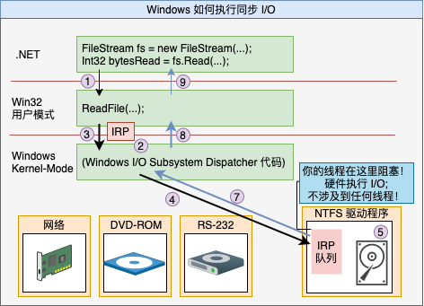

# 第 28 章 I/O 限制的异步操作

本章内容：

* <a href="#28_1">Windows 如何执行 I/O 操作</a>
* <a href="#28_2">C# 的异步函数</a>
* <a href="#28_3">编译器如何将异步函数转换成状态机</a>
* <a href="#28_4">异步函数扩展性</a>
* <a href="#28_5">异步函数和事件处理程序</a>
* <a href="#28_6">FCL 的异步函数</a>
* <a href="#28_7">异步函数和异常处理</a>
* <a href="#28_8">异步函数和其他功能</a>
* <a href="#28_9">应用程序及其线程处理模型</a>
* <a href="#28_10">以异步方式实现服务器</a>
* <a href="#28_11">取消 I/O 操作</a>
* <a href="#28_12">有的 I/O 操作必须同步进行</a>
* <a href="#28_13">I/O 请求优先级</a>

第 27 章重点讲述了如何异步执行计算限制的操作，允许线程池在多个 CPU 内核上调度任务，使多个线程能并发工作，从而高效率地使用系统资源，同时提升应用程序的吞吐能力。本章重点讲述如何异步执行 I/O 限制的操作，允许将任务交由硬件设备处理，期间完全不占用线程和 CPU 资源。然而，线程池仍然扮演了一个重要的角色，因为如同你马上就要看到的那样，各种 I/O 操作的结果还是要由线程池线程来处理的。

## <a name="28_1">28.1 Windows 如何执行 I/O 操作</a>

首先讨论 Windows 如何执行同步 I/O 操作。图 28-1 是连接了几个硬件设备的计算机系统。每个硬件设备都有自己的电路板，每个电路板都集成了一个小型的、特殊用途的计算机，它知道如何控制自己的硬件设备。例如，硬盘驱动器就有一个小的电路板，它知道如何旋转碟片、寻道、在碟上读写数据以及和计算机内存交换数据。

  

图 28-1 Windows 如何执行执行同步 I/O 操作

程序通过构造一个 `FileStream` 对象来打开磁盘文件，然后调用 `Read` 方法从文件中读取数据。调用 `FileStream` 的 `Read` 方法时，你的线程从托管代码转变为本机/用户模式代码，`Read` 内部调用 Win32 `ReadFile` 函数(①)。`ReadFile` 分配一个小的数据结构，称为 I/O 请求包(I/O Request Packet, IRP)(②)。IRP 结构初始化后包含的内容有：文件句柄，文件中的偏移量(从这个位置开始读取字节)，一个 `Byte[]` 数组的地址(数组用读取的字节来填充)，要传输的字节数以及其他常规性内容。

然后，`ReadFile` 将你的线程从本机/用户模式代码，向内核传递 IRP 数据结构，从而调用 Windows 内核(③)。根据 IRP 中的设备句柄， Windows 内核知道 I/O 操作要传送给哪个硬件设备。因此，Windows 将 IRP 中的设备句柄，Windows 内核知道 I/O 操作要传送给哪个硬件设备。因此，Windows 将 IRP 传送给恰当的设备驱动程序的 IRP 队列(④)。每个设备驱动程序都维护着自己的 IRP 队列，其中包含了机器上运行的所有进程发出的 I/O 请求。IRP 数据包到达时，设备驱动程序将 IRP 信息传给物理硬件设备上安装的电路板。现在，硬件设备将执行请求的 I/O 操作(⑤)。

但要注意一个重要问题；在硬件设备执行 I/O 操作期间，发出了 I/O 请求的线程将无事可做，所以 Windows 将线程变成睡眠状态，防止它浪费 CPU 时间(⑥)。这当然很好。但是，虽然线程不浪费时间，但它仍然浪费了空间(内存)，因为它的用户模式栈、内核模式栈、线程环境块(thread environment block，TEB)和其他数据结构都还在内存中，而且完全没有谁去访问这些东西。这当然就不好了。

最终，硬件设备会完成 I/O 操作。然后，Windows 会唤醒你的线程，把它调度给一个 CPU，使它从内核模式返回用户模式，再返回至托管代码(⑦，⑧和⑨)。`FileStream` 的 `Read` 方法现在返回一个 `Int32`，指明从文件中读取的实际字节数，使你知道在传给 `Read` 的 `Byte[]` 中，实际能检索到多少个字节。

假定要实现一个 Web 应用程序，每个客户端请求抵达服务器时，都需要发出一个数据库请求。客户端请求抵达时，一个线程池线程会调用你的代码。如果以同步方式发出数据库请求，线程会阻塞不确定的时间，等待数据库返回结果。在此期间，如果另一个客户端请求抵达，线程池会创建另一个线程，这个线程在发出另一个数据库请求后，同样会阻塞。随着越来越多的客户端请求抵达，创建的线程也越来越多，所有这些线程都阻塞并等待数据库的响应。结果是 Web 服务器分配的系统资源(线程及其内存)基本上都浪费了！

更糟的是，当数据库用结果来响应请求时，线程会被解锁，全都开始执行。但由于可能运行了大量线程，同时 CPU 内核只有区区几个，所以 Windows 被迫执行频繁的上下文切换，这进一步损害了性能。这和实现一个可伸缩应用程序的初衷是完全背道而驰的。

现在讨论一下 Windows 如何执行异步 I/O 操作。图 28-2 删除了除硬盘之外的所有硬件设备，引入了 CLR 的线程池，稍微修改了代码。打开磁盘文件的方式仍然是通过构造一个 `FileStream` 对象，但现在传递了一个 `FileOptions.Asynchronous` 标志，告诉 Windows 我希望文件的读/写操作以异步方式执行。

  

图 28-2 Windows 如何执行异步 I/O 操作

现在调用 `ReadAsync` 而不是 `Read` 从文件中读取数据。`ReadAsync` 内部分配一个 `Task<Int32>` 对象来代表用于完成读取操作的代码。然后，`ReadAsync` 调用 Win32 `ReadFile` 函数(①)。`ReadFile` 分配 IRP，和前面的同步操作一样初始化它(②)，然后把它传给 Windows 内核(③)。Windows 把 IRP 添加到硬盘驱动程序的 IRP 队列中(④)。但线程不再阻塞，而是允许返回至你的代码。所以，线程能立即从 `ReadAsync` 调用中返回(⑤，⑥和⑦)。当然，此时 IRP 可能尚未出处理好，所以不能够在 `ReadAsync` 之后的代码中访问传递的 `Byte[]` 中的字节。

那么，什么时候以及用什么方式处理最终读取的数据呢？注意，调用 `ReadAsync` 返回的是一个 `Task<Int32>` 对象。可在该对象上调用 `ContinueWith` 来登记任务完成时执行的回调方法，然后在回调方法中处理数据。当然，也可利用 C# 的异步函数功能简化编码，以顺序方式写代码(感觉就像是执行同步 I/O)。

硬件设备处理好 IRP 后(ⓐ)，会将完成的 IRP 放到 CLR 的线程池队列中(ⓑ)。将来某个时候，一个线程池线程会提取完成的 IRP 并执行完成任务的代码，最终要么设置异常(如果发生错误)，要么返回结果(本例是代表成功读取的字节数的一个 `Int32`)(ⓒ)<sup>①</sup>。这样一来，`Task` 对象就知道操作在什么时候完成，代码可以开始运行并安全地访问 `Byte[]` 中的数据。

> ① 完成的 IRP 使用一个先入先出(FIFO)算法从线程池中提取。

掌握基础知识后，让我们综合运用一下这些知识。假定在传入一个客户端请求之后，服务器发出的是一个异步数据库请求。此时线程不会阻塞，它可返回线程池以处理传入的更多客户端请求。所以，现在用一个线程就能处理所有传入的客户端请求。数据库服务器响应之后，它的响应也会进入线程池队列，使线程池线程能在某个时间处理它，最后将需要的数据发送回客户端。在这种情况下，只用一个线程就处理了所有客户端请求和所有数据库响应。服务器只需使用极少的系统资源，同时运行速度也得到了保证，尤其是考虑到根本不会发生上下文切换！

如果工作项被送入线程池的速度比一个线程处理它们的速度还要快，线程池就可能创建额外的线程。线程池很快会为机器上的每个 CPU 都创建一个线程。例如，在 4 核机器上，4 个客户端请求/数据库响应(任意组合)可以在 4 个线程上同时运行，而且还不会发生上下文切换。<sup>②</sup>

> ② 前提是当前没有运行其他线程。大多数时候都是如此，因此大多数计算机的 CPU 利用率都远低于 100%。即使 CPU 利用率因为低于优先级 8 的线程而达到了 100%，应用程序的可响应性和性能也不会受到影响，因为应用程序的线程会抢占低优先级线程。如果其他线程的优先级和你的发生冲突，那么上下文切换确实会发生。这种情况虽然不利于性能，但对可响应性来说是一件好事。记住，Windows 为每个进程准备了至少一个线程，而执行上下文切换可避免线程进入死循环的一个应用程序阻止其他应用程序的线程的运行。

然而，如果其中任何一个线程主动阻塞(通过调用同步 I/O 操作，调用 `Thread.Sleep` 或者等待获取线程同步锁)，Windows 就会通知线程池它的一个线程停止了运行。随后，线程池意识到 CPU 处于欠饱和状态，所以会创建一个新线程来替换阻塞的线程。这当然不理想，因为创建信息那成的时间和内存开销都是很“昂贵”的。

更糟的是，阻塞的线程可能醒来，CPU 又变得过饱和了，所以必须发生上下文切换，这会影响到性能。然而，线程池在这个时候是比较聪明的。线程完成处理并回到池中时，除非 CPU 再度变得饱和<sup>③</sup>，否则线程池不让它们处理新的工作项。这样就减少了上下文切换并提升了性能。如果线程池以后判断它的线程数超过需要的数量，会允许多余的线程终止自身，回收这些线程使用的资源。

> ③ 是指刚刚饱和，既不欠饱和，也不过饱和。  ———— 译注

在内部，CLR 的线程池使用名为 “I/O完成端口”(I/O Completion Port)的 Windows 资源来引出我刚才描述的行为。CLR 在初始化时创建一个 I/O 完成端口。当你打开硬件设备时，这些设备可以和 I/O 完成端口关联，使设备驱动程序知道将完成的 IRP 送到哪儿。要深入了解这个机制，建议阅读我和 Christophe Nasarre 共同撰写的《Windows 核心编程(第 5 版)》<sup>①</sup>。

> 简体中文版是《Windows 核心编程(第 5 版)》，繁体中文版是《Windows 应用程式开发经典》。分别由清华大学出版社和悦知文化出版。我参与了它的翻译。————译注

 除了将资源利用率降到最低，并减少上下文切换，以异步方式执行 I/O 操作还有其他许多好处。每开始一次垃圾回收，CLR 都必须挂起进程中的所有线程。所以，线程越少，垃圾回收器运行的速度越快。此外，一次垃圾回收发生时，CLR 必须遍历所有线程的栈来查找根。同样，线程越少，栈的数量越少，使垃圾回收速度变得更快。如果线程在处理工作项时没有阻塞，线程大多数时间都是在线程池中等待。所以，当垃圾回收发生时，线程在它们的栈顶(无事可做，自然在栈顶)，遍历每个线程的栈来查找根只需很少的时间。

 另外，在调试应用程序时，一旦遇到断点，Windows 会挂起被调试的应用程序中的所有线程。应用程序刚恢复继续运行时，Windows 必须恢复它的所有线程。所以，如果应用程序中的线程数太多，在调试器中单步调试代码会慢得令人难受。使用异步 I/O 可以将线程数控制在少数几个，可以增强调试性能。

 还有一个好处值得一提：假定应用程序要从多个网站下载 10 幅图像，而且每幅图像要花 5 秒下载。如果同步执行这个任务(一幅接一幅地下载)，就要花 50 秒才能获得 10 幅图像。但如果只用一个线程来初始化 10 个异步下载操作，全部 10 个操作都将并发执行，获得全部 10 幅图像只需 5 秒钟！也就说说，执行多个同步 I/O 操作，获得所有结果的时间是获得每个单独结果所需时间之和。但执行多个异步 I/O 操作，获得所有结果的时间是表现最差的那个操作所需的时间。
 
 对于 GUI 应用程序，异步操作还有另一个好处，即用户界面不会挂起，一直都能灵敏地响应用户的操作。事实上，Microsoft Silverlight 或 Windows Store 应用程序只允许异步 I/O 操作，因为用于执行 I/O 操作的类库只公开了异步版本，同步版本根本就没有提供。这个设计是故意的，目前是确保这些应用程序永远不会执行同步 I/O 操作来造成阻塞 GUI 线程，使整个应用程序失去响应。响应灵敏的应用程序能为用户提供更好的使用体验。

## <a name="28_2">28.2 C# 的异步函数</a>

执行异步操作是构建可伸缩的、响应灵敏的应用程序的关键，它允许使用少量线程执行大量操作。与线程池结合，异步操作允许利用机器中的所有 CPU。意识到其中的巨大潜力，Microsoft 设计了一个编程模型来帮助开发者利用这种能力<sup>②</sup>。该模式利用了第 27 章讨论的

> ② 开发者如果使用 Microsoft .NET Framework 4.5 之前的版本，我的 `AsyncEnumerator` 类(我的 Power Threading 库的一部分，可从 *http://Wintellect.com* 下载)允许使用和 .NET Framework 4.5 非常相似的一个编程模型。事实上，正是因为我的 `AsyncEnumerator` 类的成功，才使我有机会帮助 Microsoft 设计本章讨论的这个编程模型。由于两者是如此相似，所以只需花很少代价就能将使用我的 `AsyncEnumerator` 类的代码移植到新的编程模型。

`Task` 和称为**异步函数**的一个 C# 语言功能。以下代码使用异步函数来执行两个异步 I/O 操作。

```C#
private static async Task<String> IssueClientRequestAsync(String serverName, String message) {
    using(var pipe = new NamedPipeClientStream(serverName, 'PipeName', PipeDirection.InOut, PipeOptions.Asynchronous | PipeOptions.WriteThrough)) {
        pipe.Connect();     // 必须在设置 ReadMode 之前连接
        pipe.ReadMode = PipeTransmissionMode.Message;

        // 将数据异步发送给服务器
        Byte[] request = Encoding.UTF8.GetBytes(message);
        await pipe.WriteAsync(request, 0, request.Length);

        // 异步读取服务器的响应
        Byte[] response = new Byte[1000];
        Int32 butesRead = await pipe.ReadAsync(response, 0, response.Length);
        return Encoding.UTF8.GetString(response, 0, butesRead);
    } // 关闭管道
}
```

在上述代码中，很容易分辨 `IssueClientRequestAsync` 是异步函数，因为第一行代码的 `static` 后添加了 `async` 关键字。一旦将方法标记为 `async`，编译器就会将方法的代码转换成实现了状态机中的一些代码并返回，方法不需要一直执行到结束。所以当线程调用 `IssueClientRequestAsync` 时，线程会构造一个 `NamedPipeClientStream`，调用 `Connect`， 设置它的 `ReadMode` 属性，将传入的消息转换成一个 `Byte[]`，然后调用 `WriteAsync`。`WriteAsync` 内部分配一个 `Task` 对象并把它返回给 `IssueClientRequestAsync`。此时，C# `await` 操作符实际会在 `Task` 对象上调用 `ContinueWith`，向它传递用于恢复状态机的方法。然后线程从 `IssueClientRequestAsync`返回。

将来某个时候，网络设置驱动程序会结束向管道的写入，一个线程池线程会通知 `Task` 对象，后者激活 `ContinueWith` 回调方法，造成一个线程恢复状态机。更具体地说，一个线程会重新进入 `IssueClientRequestAsync` 方法，但这次是从 `await` 操作符的位置开始。方法现在执行编译器生成的、用于查询 `Task` 对象状态的代码。如果操作失败，会设置代表错误的一个异常。如果操作成功完成，`await`操作符会返回结果。在本例中，`WriteAsync` 返回一个 `Task` 而不是 `Task<TResult>`，所以无返回值。

现在方法继续执行，分配一个 `Byte[]` 并调用 `NamedPipeClientStream` 的异步 `ReadAsync` 方法。`ReadAsync` 内部创建一个`Task<Int32>` 对象并返回它。同样地，`await` 操作符实际会在 `Task<Int32>` 对象上调用 `ContinueWith`，向其传递用于恢复状态机的方法。然后线程再次从 `IssueClientRequestAsync` 返回。

将来某个时候，服务器向客户机发送一个响应，网络设备驱动程序获得这个响应，一个线程池线程通知 `Task<Int32>` 对象，后者恢复状态机。`await` 操作符造成编译器生成代码来查询 `Task` 对象的 `Result` 属性(一个 `Int32`)并将结果赋给局部变量 `byteRead`；如果操作失败，则抛出异常，然后执行 `IssueClientRequestAsync` 剩余的代码，返回结果字符串并关闭管道。此时，状态机执行完毕，垃圾回收器会回收任何内存。

由于异步函数在状态机执行完毕之前返回，所以在 `IssueClientRequestAsync` 执行它的第一个 `await` 操作符之后，调用 `IssueClientRequestAsync` 的方法会继续执行。但是，调用者如何知道 `IssueClientRequestAsync` 已执行完毕它的状态机呢？一旦将方法标记为 `async`，编译器会自动生成代码，在状态机开始执行时创建一个 `Task` 对象。该 `Task` 对象在状态机执行完毕时自动完成。注意 `IssueClientRequestAsync` 方法的返回类型是 `Task<String>`，它实际返回的是由编译器生成的代码为这个方法的调用者而创建的`Task<String>` 对象，`Task` 的 `Result` 属性在本例中是 `String` 类型。在 `IssueClientRequestAsync` 方法靠近尾部的地方，我返回了一个字符串。这造成编译器生成的代码完成它创建的 `Task<String>` 对象，把对象的 `Result` 属性设为返回的字符串。

注意，异步函数存在以下限制。

* 不能将应用程序的 `Main` 方法转变成异步函数。另外，构造器、属性访问器方法和事件访问器方法不能转变成异步函数。

* 异步函数不能使用任何 `out` 或 `ref` 参数。

* 不能在 catch，finally 或 unsafe 块中使用 await 操作符。

* 不能在 `await` 操作符之前获得一个支持线程所有权或递归的锁，并在 `await` 操作符之后释放它。这是因为 `await` 之前的代码由一个线程执行，之后的代码则可能由另一个线程执行。在 C# `lock` 语句中使用 `await`，编译器会报错。如果显式调用 `Monitor` 的 `Enter` 和 `Exit` 方法，那么代码虽然能编译，但 `Monitor.Exit` 会在运行时抛出一个 `SynchronizationLockException`<sup>①</sup>。

> ① 不要让线程等待一个线程同步构造从而造成线程的阻塞。相反，可以等待(`await`)从 `SemaphoreSlim` 的 `WaitAsync` 方法或者我自己的 `OneManyLock` 的 `AcquireAsync` 方法所返回的任务，从而避免线程被阻塞。两者均在第 30 章 “混合线程同步构造”讲述。

* 在查询表达式中，`await` 操作符只能在初始 `from` 子句的第一个集合表达式中使用，或者在 `join` 子句的集合表达式中使用。

这些限制都不算太大，如果违反，编译器会提醒你，一般只需少量代码修改就可解决问题。

## <a name="28_3">28.3 编译器如何将异步函数转换成状态机</a>

使用异步函数时，理解编译器为你执行的代码转换有助于提高开发效率。另外，我始终认为最简单、最好的学习方式就是从例子中学习。所以，让我们首先定义一些简单的类型和方法。

```C#
internal sealed class Type1 { }
internal sealed class Type2 { }
private static async Task<Type1> Method1Async() {
 /* 以异步方式执行一些操作，最后返回一个 Type1 对象 */
}
private static async Task<Type2> Method2Async() {
 /* 以异步方式执行一些操作，最后返回一个 Type2 对象 */
} 
```

然后通过异步函数来使用这些简单的类型和方法。

```C#
private static async Task<String> MyMethodAsync(Int32 argument) {
    Int32 local = argument;
    try {
        Type1 result1 = await Method1Async();
        for (Int32 x = 0; x < 3; x++) {
            Type2 result2 = await Method2Async();
        }
    }
    catch (Exception) {
        Console.WriteLine("Catch");
    }
    finally {
        Console.WriteLine("Finally");
    }
    return "Done";
} 
```

虽然 `MyMethodAsync` 看起来很别扭，但它确实演示了一些关键概念。首先，它本身是一个异步函数，返回一个 `Task<String>`，但代码主体最后返回的是一个 `String`。其次，它调用了其他函数，这些函数以异步方法执行操作。一个函数是单独执行，另一个是从 `for` 循环中执行。最后，它包含了异常处理代码。编译 `MyMethodAsync` 时，编译器将该方法中的代码转换成一个状态机结构。这种结构能挂起和恢复。

我编译上述代码，对 IL 代码进行逆向工程以转换回 C# 源代码。然后，我对代码进行了一些简化，并添加了大量注释，帮助你理解编译器对异步函数做的事情。下面展示的是编译器转换后的精华代码，我展示了转换的 `MyMethodAsync` 方法及其依赖的状态机结构。

```C#
// AsyncStateMachine 特性指出这是一个异步方法(对使用反射的工具有用)
// 类型指出实现状态机的是哪个结构
[DebuggerStepThrough, AsyncStateMachine(typeof(StateMachine))]
private static Task<String> MyMethodAsync(Int32 argument) {
    // 创建状态机实例并初始化它
    StateMachine stateMachine = new StateMachine() {
        // 创建 builder ，总这个存根方法返回 Task<String>
        // 状态机访问 builder 来设置 Task 完成/异常
        m_builder = AsyncTaskMethodBuilder<String>.Create(),
        m_state = -1, // 初始化状态机位置
        m_argument = argument // 将实参拷贝到状态机字段
    };

    // 开始执行状态机
    stateMachine.m_builder.Start(ref stateMachine);
    return stateMachine.m_builder.Task; // 返回状态机的 Task
}

// 这是状态机结构
[CompilerGenerated, StructLayout(LayoutKind.Auto)]
    private struct StateMachine : IAsyncStateMachine {

    // 代表状态机 builder(Task)及其位置的字段
    public AsyncTaskMethodBuilder<String> m_builder;
    public Int32 m_state;

    // 实参和局部变量现在成了字段 
    public Int32 m_argument, m_local, m_x;
    public Type1 m_resultType1;
    public Type2 m_resultType2;
    
    // 每个 awaiter 类型一个字段。
    // 任何时候这些字段只有一个是重要的，那个字段引用最近执行的、以异步方式完成的 await
    private TaskAwaiter<Type1> m_awaiterType1;
    private TaskAwaiter<Type2> m_awaiterType2;

    // 这是状态机方法本身
    void IAsyncStateMachine.MoveNext() {
        String result = null; // Task 的结果值

        // 编译器插入 try 块来确保状态机的任务完成
        try {
            Boolean executeFinally = true; // 先假定逻辑上离开 try 块
            if (m_state == -1) {           // 如果第一次在状态机方法中，
                m_local = m_argument;      // 原始方法就从头开始执行
            }

            // 原始代码中的 try 块
            try {
                TaskAwaiter<Type1> awaiterType1;
                TaskAwaiter<Type2> awaiterType2;
                
                switch (m_state) {
                    case -1: // 开始执行 try 块中的代码
                        // 调用 Method1Async 并获得它的 awaiter
                        awaiterType1 = Method1Async().GetAwaiter();
                        if (!awaiterType1.IsCompleted) {
                            m_state = 0; // Method1Async 要以异步方式完成
                            m_awaiterType1 = awaiterType1; // 保存 awaiter 以便将来返回

                            // 告诉 awaiter 在操作完成时调用 MoveNext
                            m_builder.AwaitUnsafeOnCompleted(ref awaiterType1, ref this);
                            // 上述带按摩调用 awaiterType1 的 OnCompleted，它会在被等待的任务上
                            // 调用 ContinueWith(t => MoveNext())。
                            // 任务完成后，ContinueWith 任务调用 MoveNext

                            executeFinally = false; // 逻辑上不离开 try 块
                            return; // 线程返回至调用者
                        }
                        // Method1Async 以同步方式完成了
                        break;

                    case 0: // Method1Async 以异步方式完成了
                        awaiterType1 = m_awaiterType1; // 恢复最新的 awaiter
                        break;

                    case 1: // Method2Async 以异步方式完成了
                        awaiterType2 = m_awaiterType2; // 恢复最新的 awaiter
                        goto ForLoopEpilog;
                }

                // 在第一个 await 后, 我们捕捉结果并启动 for 循环
                m_resultType1 = awaiterType1.GetResult(); // 获取 awaiter 的结果
                
                ForLoopPrologue:
                    m_x = 0; // for 循环初始化
                    goto ForLoopBody; // 跳过 for 循环主体
                
                ForLoopEpilog:
                    m_resultType2 = awaiterType2.GetResult();
                    m_x++; // 每次循环迭代都递增 x
                    // ↓↓ 直通到 for 循环主体 ↓↓
                
                ForLoopBody:
                    if (m_x < 3) { // for 循环测试
                        // 调用 Method2Async 并获取它的 awaiter
                        awaiterType2 = Method2Async().GetAwaiter();
                        if (!awaiterType2.IsCompleted) {
                            m_state = 1;                    // Method2Async 要以异步方式完成
                            m_awaiterType2 = awaiterType2;  // 保存 awaiter 以便将来返回
                            
                            // 告诉 awaiter 在操作完成时调用 MoveNext
                            m_builder.AwaitUnsafeOnCompleted(ref awaiterType2, ref this);
                            executeFinally = false; // 逻辑上不离开 try 块
                            return;     // 线程返回至调用者
                        }
                        // Method2Async 以同步方式完成了
                        goto ForLoopEpilog; // 以同步方式完成就再次循环
                    }
            }
            catch (Exception) {
                Console.WriteLine("Catch");
            }
            finally {
                // 只要线程物理上离开 try 就会执行 finally。
                // 我们希望在线程逻辑上离开 try 时才执行这些代码
                if (executeFinally) {
                    Console.WriteLine("Finally");
                }
            }
            result = "Done"; // 这是最终从异步函数返回的东西
        }
        catch (Exception exception) {
            // 未处理的异常：通常设置异常来完成状态机的 Task
            m_builder.SetException(exception);
            return;
        }
        // 无异常：通过返回结果来完成状态机的 Task
        m_builder.SetResult(result);
    }
} 
```

花些时间梳理上述代码并读完所有注释，我猜你就能完全地领会编译器为你做的事情了。但是，如果将被等待的对象与状态机粘合起来还需着重解释一下。任何时候使用 `await` 操作符，编译器都会获取操作数，并尝试在它上面调用 `GetAwaiter` 方法。这可能是实例方法或扩展方法。调用 `GetAwaiter` 方法所返回的对象称为 `awaiter`(等待者)，正是它将被等待的对象与状态机粘合起来。

状态机获得 awaiter 后，会查询其 `IsCompleted` 属性。如果操作已经以同步方式完成了，属性将返回 `true`，而作为一项优化措施，状态机将继续执行并调用 awaiter 的 `GetResult` 方法。该方法要么抛出异常(操作失败)，要么返回结果(操作成功)。状态机继续执行以处理结果。如果操作以异步方式完成，`IsCompleted` 将返回 `false`。状态机调用 awaiter 的 `OnCompleted` 方法并向它传递一个委托(引用状态机的 `MoveNext` 方法)。现在，状态机允许它的线程回到原地以执行其他代码。将来某个时候，封装了底层任务的 awaiter 会在完成时调用委托以执行 `MoveNext`。可根据状态机中的正确位置，使方法能从它当初离开时的位置继续。这时，代码调用 awaiter 的 `GetResult` 方法。执行将从这里继续，以便对结果进行处理。

这便是异步函数的工作原理，开发人员可用它轻松地写出不阻塞的代码。

## <a name="28_4">28.4 异步函数扩展性</a>

在扩展性方面，能用 `Task` 对象包装一个将来完成的操作，就可以用 `await` 操作符来等待该操作。用一个类型(`Task`)来表示各种异步操作对编码有利，因为可以实现组合操作(比如 `Task` 的 `WhenAll` 和 `WhenAny` 方法)和其他有用的操作。本章后面会演示如何用 `Task` 包装一个`CancellationToken`，在等待异步操作的同时利用超时和取消功能。

我想和你分享另外一个例子。下面是我的 `TaskLogger` 类，可用它显示尚未完成的异步操作。这在调试时特别有用，尤其是当应用程序因为错误的请求或者未响应的服务器而挂起的时候。

```C#
public static class TaskLogger
{
    public enum TaskLogLevel { None, Pending }
    public static TaskLogLevel logLevel { get; set; }

    public sealed class TaskLogEntry
    {
        public Task Task { get; internal set; }
        public String Tag { get; internal set; }
        public DateTime LogTime { get; internal set; }
        public String CallerMemberName { get; internal set; }
        public String CallerFilePath { get; internal set; }
        public Int32 CallerLineNumber { get; internal set; }
        public override string ToString()
        {
            return String.Format("LogTime={0}, Tag={1}, Member={2}, File={3}{4}",
                LogTime, Tag ?? "(none)", CallerMemberName, CallerFilePath, CallerLineNumber);
        }
    }
}
```

`````

## <a name="28_5">28.5 异步函数和事件处理程序</a>

## <a name="28_6">28.6 FCL 的异步函数</a>

## <a name="28_7">28.7 异步函数和异常处理</a>

## <a name="28_8">28.8 异步函数和其他功能</a>

## <a name="28_9">28.9 应用程序及其线程处理模型</a>

## <a name="28_10">28.10 以异步方式实现服务器</a>

## <a name="28_11">28.11 取消 I/O 操作</a>

## <a name="28_12">28.12 有的 I/O 操作必须同步进行</a>

## <a name="28_13">28.13 I/O 请求优先级</a>
