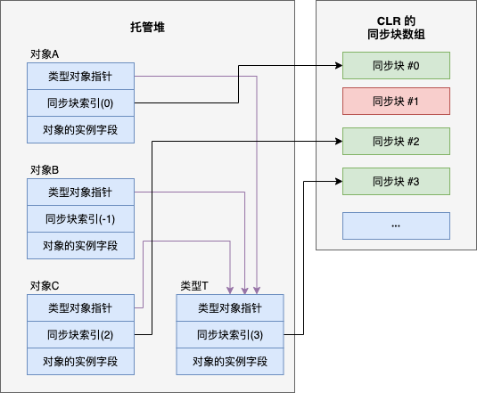

# 第 30 章 混合线程同步构造

本章内容

* <a href="#30_1">一个简单的混合锁</a>
* <a href="#30_2">自旋、线程所有权和递归</a>
* <a href="#30_3">FCL 中的混合结构</a>
* <a href="#30_4">著名的双检锁技术</a>
* <a href="#30_5">条件变量模式</a>
* <a href="#30_6">异步的同步构造</a>
* <a href="#30_7">并发集合类</a>

第 29 章“基元线程同步构造”讨论了基元用户模式和内核模式线程同步构造。其他所有线程同步构造都基于它们而构建，而且一般都合并了用户模式和内核模式构造，我们称为**混合线程同步构造**。没有线程竞争时，混合构造提供了基元用户模式构造所具有的性能优势。多个线程竞争一个构造时，混合构造通过基元内核模式的构造来提供不“自旋”的优势(避免浪费 CPU 时间)。由于大多数应用程序的线程都很少同时竞争一个构造，所以性能上的增强可以使你的应用程序表现得更出色。

本章首先展示了如何基于构造来构建混合构造。然后展示了 FCL 自带的许多混合构造，描述了它们的行为，并介绍了如何正确使用它们。我还提供了一些我自己创建的构造，它们通过 Wintellect 的 Power Threading 库免费提供给大家使用，请从 *[http://wintellect.com/Resource-Power-Collections-Library](http://wintellect.com/Resource-Power-Collections-Library)* 下载。

本章末尾展示了如何使用 FCL 的并发集合类来取代混合构造，从而最小化资源使用并提升性能。最后讨论了异步的同步构造，允许以同步方式访问资源，同时不造成任何线程的阻塞，从而减少了资源消耗，并提高了伸缩性。

## <a name="30_1">30.1 一个简单的混合锁</a>

言归正传，下面是一个混合线程同步锁的例子：

```C#
internal sealed class SimpleHybridLock : IDisposable {
    // Int32 由基元用户模式构造 (Interlocked 的方法)使用
    private Int32 m_waiters = 0;

    // AutoResetEvent 是基元内核模式构造
    private readonly AutoResetEvent m_waiterLock = new AutoResetEvent(false);

    public void Enter() {
        // 指出这个线程想要获得锁
        if (Interlocked.Increment(ref m_waiters) == 1)
            return; // 锁可自由使用，无竞争，直接返回
                    
        // 另一个线程拥有锁(发生竞争)，使这个线程等待
        m_waiterLock.WaitOne(); // 这里产生较大的性能影响
        // WaitOne 返回后，这个线程拿到锁了
    }

    public void Leave() {
        // 这个线程准备释放锁
        if (Interlocked.Decrement(ref m_waiters) == 0)
            return; // 没有其他线程正在等待，直接返回

        // 有其他线程正在阻塞，唤醒其中一个
        m_waiterLock.Set(); // 这里产生较大的性能影响
    }

    public void Dispose() { m_waiterLock.Dispose(); }
}
```

`SimpleHybridLock` 包含两个字段：一个 `Int32`，由基元用户模式的构造来操作；以及一个 `AutoResetEvent`，它是一个基元内核模式的构造。为了获得出色的性能，锁要尽量操作 `Int32`，尽量少操作 `AutoResetEvent`。每次构造 `SimpleHybridLock` 对象就会创建 `AutoResetEvent`；和 `Int32` 字段相比，它对性能的影响大得多。本章以后会展示混合构造 `AutoResetEventSlim`；多个线程同时访问锁时，只有在第一次检测到竞争时才会创建 `AutoResetEvent`，这样就避免了性能损失。`Dispose` 方法关闭 `AutoResetEvent`，这也会对性能造成大的影响。

`SimpleHybridLock` 对象在构造和 dispose 时的性能能提升当然很好，但我们应该将更多精力放在它的 `Enter` 和 `Leave` 方法的性能上，因为在对象生存期内，这两个方法要被大量地调用。下面让我们重点关注这些方法。

调用 `Enter` 的第一个线程造成 `Interlocked.Increment` 在 `m_waiters` 字段上加 `1`，使它的值变成 `1`。这个线程发现以前有零个线程正在等待这个锁，所以线程从它的 `Enter` 调用中返回。值得欣赏的是，线程获得锁的速度非常快。现在，如果另一个线程介入并调用`Enter`，这个线程将 `m_waiters` 递增到 `2`，发现锁在另一个线程那里。所以，这个线程会使用 `AutoResetEvent` 对象来调用 `WaitOne`，从而阻塞自身。调用 `WaitOne` 造成线程的代码转变成内核模式的代码，这会对性能产生巨大影响。但线程反正都要停止运行，所以让线程花点时间来完全停止，似乎也不是太坏。好消息是，线程现在会阻塞，不会因为在 CPU 上“自旋”而浪费 CPU 时间。(29.3.3 节“实现简单的自旋锁”引入的 `SimpleSpinLock` 的 `Enter` 方法就会这样“自旋”。)

再来看看 `Leave` 方法。一个线程调用 `Leave` 时，会调用 `Interlocked.Decrement` 从 `m_waiters` 字段减 1。 如果 `m_waiters` 现在是 `0`，表明没有其他线程在调用 `Enter` 时发生阻塞，调用 `Leave` 的线程可以直接返回。同样地，想象以下这有多快：离开一个锁意味着线程从一个 `Int32` 中减 1，执行快速的 `if` 测试，然后返回！另一方面，如果调用 `Leave` 的线程发现 `m_waiters` 不为 0，线程就知道现在存在一个竞争，另外至少有一个线程在内核中阻塞。这个线程必须唤醒一个(而且只能是一个)阻塞的线程。唤醒线程是通过在 `AutoResetEvent` 上调用 `Set` 来实现的。这会造成性能上的损失，因为线程必须转换成内核模式代码，再转换回来。但这个转换只有在发生竞争时才会发生。当然，`AutoResetEvent` 确保只有一个阻塞的线程被唤醒；在 `AutoResetEvent` 上阻塞的其他所有线程会继续阻塞，直到新的、解除了阻塞的线程最终调用 `Leave`。

> 注意 在实际应用中，任何线程可以在任何时间调用 `Leave`， 因为 `Enter` 方法没有记录哪一个线程成功获得了锁。很容易添加字段和代码来维护这种信息，但会增大锁对象自身需要的内存，并损害 `Enter` 和 `Leave` 方法的性能，因为它们现在必须操作这个字段。我情愿有一个性能高超的锁，并确保我的代码以正确方式使用它。你会注意到，事件和信号量都没有维护这种信息，只有互斥体才有维护。

## <a name="30_2">30.2 自旋、线程所有权和递归</a>

由于转换为内核模式会造成巨大的性能损失，而且线程占有锁的时间通常都很短，所以为了提升应用程序的总体性能，可以让一个线程在用户模式中“自旋”一小段时间，再让线程转换为内核模式。如果线程正在等待的锁在线程“自旋”期间变得可用，就能避免向内核模式的转换了。

此外，有的锁限制只能由获得锁的线程释放锁。有的锁允许当前拥有它的线程递归地拥有锁(多次拥有)，`Mutex` 锁就是这样一个例子。<sup>①</sup>可通过一些别致的逻辑构建支持自旋、线程所有权和递归的一个混合锁，如下所示：

> ① 线程在 `Mutex` 对象上等待时不会“自旋”，因为 `Mutex` 的代码在内核中。这意味着线程必须转换成内核模式才能检查 `Mutex` 的状态。

```C#
internal sealed class AnotherHybridLock : IDisposable {
    // Int32 由基元用户模式构造 (Interlocked 的方法)使用
    private Int32 m_waiters = 0;

    // AutoResetEvent 是基元内核模式构造
    private AutoResetEvent m_waiterLock = new AutoResetEvent(false);

    // 这个字段控制自旋，希望能提升性能
    private Int32 m_spincount = 4000; // 随便选择的一个计数

    // 这些字段指出哪个线程拥有锁，以及拥有了它多少次
    private Int32 m_owningThreadId = 0, m_recursion = 0;

    public void Enter() {
        // 如果调用线程已经拥有锁，递增递归计数并返回
        Int32 threadId = Thread.CurrentThread.ManagedThreadId;
        if (threadId == m_owningThreadId) { m_recursion++; return; }

        // 调用线程不拥有锁，尝试获取它
        SpinWait spinwait = new SpinWait();
        for (Int32 spinCount = 0; spinCount < m_spincount; spinCount++) {
            // 如果锁可以自由使用了，这个线程就获得它；设置一些状态并返回
            if (Interlocked.CompareExchange(ref m_waiters, 1, 0) == 0) goto GotLock;

            // 黑科技：给其他线程运行的机会，希望锁会被释放
            spinwait.SpinOnce();
        }

        // 自旋结束，锁仍未获得，再试一次
        if (Interlocked.Increment(ref m_waiters) > 1) {
            // 仍然是竞态条件，这个线程必须阻塞
            m_waiterLock.WaitOne(); // 等待锁：性能有损失
            // 等这个线程醒来时，它拥有锁；设置一些状态并返回
        }

    GotLock:
        // 一个线程获得锁时，我们记录它的 ID，并
        // 指出线程拥有锁一次
        m_owningThreadId = threadId; m_recursion = 1;
    }

    public void Leave() {
        // 如果调用线程不拥有锁，表明存在 bug
        Int32 threadId = Thread.CurrentThread.ManagedThreadId;
        if (threadId != m_owningThreadId)
            throw new SynchronizationLockException("Lock not owned by calling thread");
        
        // 递减递归技术。如果这个线程仍然拥有锁，那么直接返回
        if (--m_recursion > 0) return;

        m_owningThreadId = 0; // 现在没有线程拥有锁
                              
        // 如果没有其他线程在等待，直接返回
        if (Interlocked.Decrement(ref m_waiters) == 0)
            return;

        // 有其他线程正在等待，唤醒其中 1 个
        m_waiterLock.Set(); // 这里有较大的性能损失
    }
    
    public void Dispose() { m_waiterLock.Dispose(); }
}
```

可以看出，为锁添加了额外的行为之后，会增大它拥有的字段数量，进而增大内存消耗。代码还变得更复杂了，而且这些代码必须执行，造成锁的性能的下降。29.4.1 节“Event构造”比较了各种情况下对一个 `Int32` 进行递增的性能，这些情况分别是：无任何锁，使用基元用户模式构造，以及使用内核模式构造。这里重复了哪些性能测试的结果，并添加了使用 `SimpleHybridlock` 和 `AnotherHybridLock` 的结果。结果从快到慢依次是：

```cmd
Incrementing x: 8                           最快
Incrementing x in M: 69                     慢约 9 倍
Incrementing x in SpinLock: 164             慢约 21 倍
Incrementing x in SimpleHybridlock: 164     慢约 21 倍(类似于 SpinLock)
Incrementing x in AnotherHybridLock: 230    慢约 29 倍(因为所有权/递归)
Incrementing x in SimpleWaitLock: 8854      慢约 1107 倍
```

注意，`AnotherHybridLock` 的性能不如 `SimpleHybridlock`。这是因为需要额外的逻辑和错误检查来管理线程所有权和递归行为。如你所见，在锁中添加的每一个行为都会影响它的性能。

## <a name="30_3">30.3 FCL 中的混合结构</a>

FCL 自带了许多混合构造，它们通过一些别致的逻辑将你的线程保持在用户模式，从而增应用程序的性能。有的混合构造直到首次有线程在一个构造上发生竞争时，才会创建内核模式的构造。如果线程一直不在构造说上发生竞争，应用程序就可避免因为创建对象而产生的性能损失，同时避免为对象分配内存。许多构造还支持使用一个 `Cancellation Token`(参见第 27 章“计算限制的异步操作”)，使一个线程强迫解除可能正在构造上等待的其他线程的阻塞。本节将向你介绍这些混合构造。

### 30.3.1 `ManualResetEventSlim`类和 `SemaphoreSlim`类

先来看看 `System.Threading.ManualResetEventSlim` 和 `System.Threading.SemaphoreSlim` 这两个类。<sup>①</sup>这两个构造的工作方式和对应的内核模式构造完全一致，只是它们都在用户模式中“自旋”，而且都推迟到发生第一次竞争时，才创建内核模式的构造。它们的 `Wait` 方法允许传递一个超时值和一个 `CancellationToken`。下面展示了这些类(未列出部分方法的重载版本)：

> ①  虽然没有一个 `AutoResetEventSlim` 类，但许多时候都可以构造一个 `SemaphoreSlim` 对象，并将 `maxCount` 设为 1.

```C#
public class ManualResetEventSlim : IDisposable {
    public ManualResetEventSlim(Boolean initialState, Int32 spinCount);
    public void Dispose();
    public void Reset();
    public void Set();
    public Boolean Wait(Int32 millisecondsTimeout, CancellationToken cancellationToken);

    public Boolean IsSet { get; }
    public Int32 SpinCount { get; }
    public WaitHandle WaitHandle { get; }
}

public class SemaphoreSlim : IDisposable {
    public SemaphoreSlim(Int32 initialCount, Int32 maxCount);
    public void Dispose();
    public Int32 Release(Int32 releaseCount);
    public Boolean Wait(Int32 millisecondsTimeout, CancellationToken cancellationToken);

    // 该特殊的方法用于 async 和 await(参见第 28 章)
    public Task<Boolean> WaitAsync(Int32 millisecondsTimeout, CancellationToken cancellationToken);
    public Int32 CurrentCount { get; }
    public WaitHandle AvailableWaitHandle { get; }
}
```

### 30.3.2 `Monitor`类和同步块

或许最常用的混合型线程同步构造就是 `Monitor` 类，它提供了支持自旋、线程所有权和递归和互斥锁。之所以最常用，是因为它资格最老，C# 有内建的关键字支持它，JIT 编译器对它知之甚详，而且 CLR 自己也在代表你的应用程序使用它。但正如稍后就要讲到的那样，这个构造存在许多问题，用它很容易造成代码中出现 bug。我先解释这个构造，然后指出问题以及解决问题的方法。

堆中的每个对象都可关联一个名为 **同步块** 的数据结构。同步块包含字段，这些字段和本章前面展示的 `AnotherHybridLock` 类的字段相似。具体地说，它对内核对象、拥有线程(owning thread)的 ID、递归计数(recursion count)以及等待线程(waiting thread)计数提供了相应的字段。`Monitor` 是静态类，它的方法接收对任何堆对象的引用。这些方法对指定对象的同步块中的字段进行操作。以下是 `Monitor` 类最常用的方法：

```C#
public static class Monitor {
    public static void Enter(Object obj);
    public static void Exit(Object obj);

    // 还可指定尝试进入锁时的超时值(不常用):
    public static Boolean TryEnter(Object obj, Int32 millisecondsTimeout);

    // 稍后会讨论 lockTaken 实参
    public static void Enter(Object obj, ref Boolean lockTaken);
    public static void TryEnter(Object obj, Int32 millisecondsTimeout, ref Boolean lockTaken);
}
```

显然，为堆中每个对象都关联一个同步块数据结构显得很浪费，尤其是考虑到大多数对象的同步块都从不使用。为节省内存，CLR 团队采用一种更经济的方式提供刚才描述的功能。它的工作原理是：CLR 初始化时在堆中分配一个同步块数组。本书第 4 章说过，每当一个对象在堆中创建的时候，都有两个额外的开销字段与它关联。第一个“类型对象指针”，包含类型的“类型对象”的内存地址。第二个是“同步块索引”，包含同步块数组中的一个整数索引。

一个对象在构造时，它的同步块索引初始化为 -1，表明不引用任何同步块。然后，调用 `Monitor.Enter` 时，CLR 在数组中找到一个空白同步块，并设置对象的同步块索引，让它引用该同步块。换言之，同步块和对象是动态关联的。调用 `Exit` 时，会检查是否有其他任何线程正在等待使用对象的同步块。如果没有线程在等待它，同步块就自由了，`Exit` 将对象的同步块索引设回 `-1`，自由的同步块将来可以和另一个对象关联。

图 30-1 展示了堆中的对象、它们的同步块索引以及 CLR 的同步块数组元素之间的关系。Object-A，Object-B 和 Object-C 都将它们的类型对象指针成员设为引用 Type-T(一个类型对象)。这意味着三个对象全都具有相同的类型。如第 4 章所述，类型对象本身也是堆中的一个对象。和其他所有对象一样，类型对象有两个开销成员：同步块索引和类型对象指针。这意味着同步块可以和类型对象关联，而且可以将一个类型对象引用传给 `Monitor` 的方法。顺便说一句，如有必要，同步块数组能创建更多的同步块。所以，同时同步大量对象时，不必担心系统会用光同步块。

  

图 30-1 堆中的对象(包括类型对象)可使其中同步块索引引用 CLR 同步块数组中的记录项

以下代码演示了 `Monitor` 类原本的使用方式：

```C#
internal sealed class Transaction {
    private DateTime m_timeOfLastTrans;

    public void PerformTransaction() {
        Monitor.Enter(this);
        // 以下代码拥有对数据的独占访问权...
        m_timeOfLastTrans = DateTime.Now;
        Monitor.Exit(this);
    }

    public DateTime LastTransaction {
        get {
            Monitor.Enter(this);
            // 以下代码拥有对数据的独占访问权...
            DateTime temp = m_timeOfLastTrans;
            Monitor.Exit(this);
            return temp;
        }
    }
}
```

表面看很简单，但实际存在问题。现在的问题是，每个对象的同步块索引都隐式为公共的。以下代码演示了这可能造成的影响。

```C#
public static void SomeMethod() {
    var t = new Transaction();
    Monitor.Enter(t); // 这个线程获取对象的公共锁

    // 让一个线程池线程显示 LastTransaction 时间
    // 注意：线程线程会阻塞，直到 SomeMethod 调用了 Monitor.Exit！
    ThreadPool.QueueUserWorkItem(o => Console.WriteLine(t.LastTransaction));

    // 这里执行其他一些代码...
    Monitor.Exit(t);
}
```

在上述代码中，执行 `SomeMethod` 的线程调用 `Monitor.Enter`，获取由 `Transaction` 对象公开的锁。线程池线程查询 `LastTransaction` 属性时，这个属性也调用 `Monitor.Enter` 来获取同一个锁，造成线程池线程阻塞，直到执行 `SomeMethod` 的线程调用`Monitor.Exit`。有调试器可发现线程池线程在 `LastTransaction` 属性内部阻塞。但很难判断是另外哪个线程拥有锁。即使真的弄清楚了是哪个线程拥有锁，还必须弄清楚是什么代码造成它取得锁，这就更难了。更糟的是，即使历经千辛万苦，终于搞清楚了是什么带按摩造成线程取得锁，最后却发现那些代码不在你的控制范围之内，或者无法修改它们来修正问题。因此，我的建议是始终坚持使用私有锁。下面展示了如何修正 `Transaction` 类：

```C#
internal sealed class Transaction {
    private readonly Object m_lock = new Object(); // 现在每个 Transaction 对象都有私有锁
    private DateTime m_timeOfLastTrans;

    public void PerformTransaction() {
        Monitor.Enter(m_lock);  // 进入私有锁
        // 以下代码拥有对数据的独占访问权...
        m_timeOfLastTrans = DateTime.Now;
        Monitor.Exit(m_lock);  // 退出私有锁
    }

    public DateTime LastTransaction {
        get {
            Monitor.Enter(m_lock);  // 进入私有锁
            // 以下代码拥有对数据的独占访问权...
            DateTime temp = m_timeOfLastTrans;
            Monitor.Exit(m_lock);   // 退出私有锁
            return temp;
        }
    }
}
```

如果 `Transaction` 的成员是静态的，只需将 `m_lock` 字段也变成静态字段，即可确保静态成员的线程安全性。

通过以上讨论，一个很明显的结论是：`Monitor` 根本就不该实现成静态类；它应该像其他所有同步构造那样实现。也就是说，应该是一个可以实例化并在上面调用实例方法的类。事实上，正因为 `Monitor` 被设计成一个静态类，所以它还存在其他许多问题。下面对这些额外的问题进行了总结。

* 变量能引用一个代理对象————前提是变量引用的那个对象的类型派生自 `System`，`MarshalByRefObject` 类(参见第 22 章“CLR寄宿和 AppDomain”)。调用 `Monitor` 的方法时，传递对代理对象的引用，锁定的是代理对象而不是代理引用的实际对象。

* 如果线程调用 `Monitor.Enter`，向它传递对类型对象的引用，而且这个类型对象是以 “AppDomain 中立”的方式加载的<sup>①</sup>，线程就会跨越进程中的所有 AppDomain 在那个类型上获取锁。这是 CLR 一个已知的 bug，它破坏了 AppDomain 本应提供的隔离能力。这个 bug 很难在保证高性能的前提下修复，所以它一直没有修复。我的建议是，永远都不要向 `Monitor` 的方法传递类型对象引用。

> ① 参考 22.2 节“AppDomain”。————译注

* 由于字符串可以留用(参见 14.2.2 节“字符串是不可变的”)，所以两个完全独立的代码段可能在不知情的情况下获取对内存中的一个 `String` 对象的引用。如果将这个 `String` 对象引用传给 `Monitor` 的方法，两个独立的代码段现在就会在不知情的情况下以同步方式执行<sup>②</sup>。

> ② 强调一下，同步执行意味着不能同时访问一个资源，只有在你用完了之后，我才能接着用。在多线程编程中，“同步”(Synchronizing)的定义是：当两个或更多的线程需要存取共同的资源时，必须确定在同一时间点只有一个线程能存取共同的资源，而实现这个目标的过程就称为“同步”。————译注

* 跨越 AppDomain 边界传递字符串时，CLR 不创建字符串的副本；相反，它只是将对字符串的一个引用传给其他 AppDomain。这增强了性能，理论上也是可行的，因为 `String` 对象本来就不可变(不可修改)。但和其他所有对象一样，`String` 对象关联了一个同步索引块，这个索引是可变的(可修改)，使不同 AppDomain 中的线程在不知情的情况下开始同步。这是 CLR 的 AppDomain 隔离存在的另一个 bug。我的建议是永远不要将 `String` 引用传给 `Monitor` 的方法。

* 由于 `Monitor` 的方法要获取一个 `Object`，所以传递值类型会导致值类型被装箱，造成线程在已装箱对象上个获取锁。每次调用 `Monitor.Enter` 都会在一个完全不同的对象上获取锁，造成完全无法实现线程同步。

* 向方法应用 `[MethodImpl(MethodImplOptions.Synchronized)]`特性，会造成 JIT 编译器用 `Monitor.Entrer` 和 `Monitor.Exit` 调用包围方法的本机代码。如果方法是实例方法，会将 `this` 传给 `Monitor` 的这些方法，锁定隐式公共的锁。如果方法时静态的，对类型的类型对象的引用会传给这些方法，造成锁定“AppDomain 中立”的类型。我的建议是永远不要使用这个特性。

* 调用类型的类型构造器时(参见 8.3 节“类型构造器”)，CLR 要获取类型对象上的一个锁，确保只有一个线程初始化类型对象及其静态字段。同样地，这个类型可能以 “AppDomain 中立”的方式加载，所以会出问题。例如，假定类型构造器的代码进入死循环，进程中的所有 AppDomain 都无法使用该类型。我的建议是尽量避免使用类型构造器，或者至少保持它们的短小和简单。

遗憾的是，除了前面说的这些，还可能出现更糟糕的情况。由于开发人员习惯在一个方法中获取一个锁，做一些工作，然后释放锁，所以 C# 语言通过 `lock` 关键字来提供了一个简化的语法。假定你要写下面这样的方法：

```C#
private void SomeMethod() {
    lock (this) {
        // 这里的代码拥有对数据的独占访问权...
    }
}
```

它等价于像下面这样写方法：

```C#
private void SomeMethod() {
    Boolean lockTaken = false;
    try {
       // 这里可能发生异常(比如 ThreadAbortException)...
       Monitor.Enter(this, ref lockTaken);
       // 这里的代码拥有对数据的独占访问权... 
    }
    finally {
        if (lockTaken) Monitor.Exit(this);
    }
}
```

第一个问题是，C# 团队认为他们在 `finally` 块中调用 `Monitor.Exit` 是绑了你一个大忙。他们的想法是，这样一来，就可确保锁总是得以释放，无论 `try` 块中发生了什么。但这只是他们一厢情愿的想法。在 `try` 块中，如果在更改状态时发生异常，这个状态就会处于损坏状态。锁在 `finally` 块中退出时，另一个线程可能开始操作损坏的状态。显然，更好的解决方法时让应用程序挂起，而不是让它带着损坏的状态继续运行。这样不仅结果难以预料，还有可能引发安全隐患。第二个问题是，进入和离开 `try` 块会影响方法的性能。有的 JIT 编译器不会内联含有 `try` 块的方法，造成性能进一步下降。所以最终结果是，不仅代码的速度变慢了，还会造成线程访问损坏的状态。<sup>①</sup>我的建议是杜绝使用 C# 的 `lock` 语句。

> ① 顺便说一句，虽然仍然会对性能造成影响，但假如 `try` 块的代码只是对状态执行读取操作，而不是试图修改它，那么在 `finally` 块中释放锁是安全的。

现在终于可以开始讨论 `Boolean lockTaken` 变量了。下面是整个变量试图解决的问题。假定一个线程进入 `try` 块，但在调用 `Monitor.Enter` 之前退出(参见第 22 章)。现在，`finally` 块会得到调用，但它的代码不应退出锁。`lockTaken` 变量就是为了解决这个问题而设计的。它初始化为`false`，假定现在还没有进入锁(还没有获得锁)。然后，如果调用 `Monitor.Enter`，而且成功获得锁，`Enter`方法就会将 `lockTaken` 设为 `true`。`finally` 块通过检查 `lockTaken` ，便知道到底要不要调用 `Monitor.Exit`。顺便说一句，`SpinLock` 结构也支持这个 `lockTaken`模式。

### 30.3.3 `ReaderWriterLockSlim` 类

我们经常都希望让一个线程简单地读取一些数据的内容。如果这些数据被一个互斥锁(比如 `SimpleSpinLock`，`SimpleWaitLock`，`SimpleHybridLock`，`AnotherHybridLock`，`Mutex` 或者 `Monitor`)保护，那么当多个线程同时试图访问这些数据时，只有一个线程才会运行，其他所有线程都会阻塞。这会造成应用程序伸缩性和吞吐能力的急剧下降。如果所有线程都希望以只读方式访问数据，就根本没有必要阻塞它们；应该允许它们并发地访问数据。另一方面，如果一个线程希望修改数据，这个线程就需要对数据的独占式访问。`ReaderWriterLockSlim` 构造封装了解决这个问题的逻辑。具体地说，这个构造像下面这样控制线程。

* 一个线程向数据写入时，请求访问的其他所有线程都被阻塞。

* 一个线程从数据读取时，请求读取的其他线程允许继续执行，但请求写入的线程仍被阻塞。

* 向线程写入的线程结束后，要么解除一个写入线程(`writer`)的阻塞，使它能向数据写入。如果没有线程被阻塞，锁就进入可以自由使用的状态，可供下一个 `reader` 或 `writer` 线程获取。

下面展示了这个类(未列出部分方法的重载版本)：

```C#
public class ReaderWriterLockSlim : IDisposable{
    public ReaderWriterLockSlim(LockRecursionPolicy recursionPolicy);
    public void Dispose();

    public void     EnterReadLock();
    public Boolean  TryEnterReadLock(Int32 millisecondsTimeout);
    public void     ExitReadLock();

    public void     EnterWriteLock();
    public Boolean  TryEnterWriteLock(Int32 millisecondsTimeout);
    public void     ExitWriteLock();

    // 大多数应用程序从不查询一下任何属性
    public Boolean IsReadLockHeld               { get; }
    public Boolean IsWriteLockHeld              { get; }
    public Int32 CurrentReadCount               { get; }
    public Int32 RecursiveReadCount             { get; }
    public Int32 RecursiveWriteCount            { get; }
    public Int32 WaitingReadCount               { get; }
    public Int32 WaitingWriteCount              { get; }
    public LockRecursionPolicy RecursionPolicy  { get; }
    // 未列出和 reader 升级到 writer 有关的成员
}
```

以下代码演示了这个构造的用法：

```C#
internal sealed class Transaction : IDisposable {
    private readonly ReaderWriterLockSlim m_lock =
        new ReaderWriterLockSlim(LockRecursionPolicy.NoRecursion);
    private DateTime m_timeOfLastTrans;

    public void PerformTransaction() {
        m_lock.EnterWriteLock();
        // 以下代码拥有对数据的独占访问权...
        m_timeOfLastTrans = DateTime.Now;
        m_lock.ExitWriteLock();
    }

    public DateTime LastTransaction {
        get {
            m_lock.EnterReadLock();
            // 以下代码拥有对数据的共享访问权...
            DateTime temp = m_timeOfLastTrans;
            m_lock.ExitReadLock();
            return temp;
        }
    }
    public void Dispose() { m_lock.Dispose(); }
}
```

这个构造有几个概念要特别留意。首先，`ReaderWriterLockSlim` 的构造器允许传递一个 `LockRecurionsPolicy` 标志，它的定义如下：

`public enum LockRecursionPolicy { NoRecursion, SupportsRecursion }`

如果传递 `SupportsRecursion` 标志，锁就支持线程所有权和递归行为。如同本章早些时候讨论的那样，这些行为对锁的性能有负面影响。所以，建议总是向构造器传递 `LockRecursionPolicy.NoRecursion`(就像本例)。reader-writer 锁支持线程所有权和递归的代价非常高昂，因为锁必须跟踪蹭允许进入锁的所有 reader 线程，同时为每个线程都单独维护递归计数。事实上，为了以线程安全的方式维护所有这些信息，`ReaderWriterLockSlim` 内部要使用一个互斥的“自旋锁”，我不是在开玩笑！

`ReaderWriterLockSlim` 类提供了一些额外的方法(前面没有列出)允许一个 reader 线程升级为 writer 线程。以后，线程可以把自己降级回 reader 线程。设计者的思路是，一个线程刚开始的时候可能是读取数据。然后，根据数据的内容，线程可能想对数据进行修改。为此，线程要把它自己从 reader 升级为 writer。锁如果支持这个行为，性能会大打折扣。而且我完全不觉得这是一个有用的功能。线程并不是直接从 reader 变成 writer 的。当时可能还有其他线程正在读取，这些线程必须完全退出锁。在此之后，尝试升级的线程才允许成为 writer。这相当于先让 reader 线程退出锁，再立即获取这个锁以进行写入。

> 注意 FCL 还提供了一个 `ReaderWriterLock` 构造，它是在 Microsoft .NET Framework 1.0 中引入的。这个构造存在许多问题，所以Microsoft 在 .NET Framework 3.5 中引入了 `ReaderWriterLockSlim` 构造。团队没有对原先的 `ReaderWriterLock` 构造进行改进，因为它们害怕失去和那些正在使用它的应用程序的兼容性。下面列举了 `ReaderWriterLock` 存在的几个问题。首先，即使不存在线程竞争，它的速度也非常慢。其次，线程所有权和递归行为是这个构造强加的，完全取消不了，这使锁变得更慢。最后，相比 writer 线程，它更青睐于 reader 线程，所以 writer 线程可能排起好长的队，却很少有机会获得服务，最终造成 “拒绝服务”(DoS)问题。

### 30.3.4 `OneManyLock` 类

我自己创建了一个 reader-writer 构造，它的速度比 FCL 的 `ReaderWriterLockSlim` 类快。<sup>①</sup>该类名为 `OneManyLock`，因为它要么允许一个 writer 线程访问，要么允许多个 reader 线程访问。下面展示了这个类：

> ① 参见本书源代码文件 Ch30-1-HybridThreadSync.cs。

```C#
public sealed class OneManyLock : IDisposable{
    public OneManyLock();
    public void Dispose();

    public void Enter(Boolean exclusive);
    public void Leave();
}
```

现在，让我讲解一下这个类是如何工作的。在内部，类定义了一个 `Int64` 字段来存储锁的状态、一个供 reader 线程阻塞的 `Semaphore` 对象以及一个供 writer 线程阻塞的 `AutoResetEvent` 对象。`Int64` 状态字段分解成以下 4 个子字段。

* 4 位代表锁本身的状态。`0=Free, 1=OwnedByWriter, 2=OwnedByReaders, 3=OwnedByReadersAndWriterPending, 4=ReservedForWriter`。 其他值未使用。

* 20 位(0~1048575 的一个数)代表锁当前允许进入的、正在读取的 reader 线程的数量(RR)。

* 20 位代表锁当前正在等待进入锁的 reader 线程的数量(RW)。这些线程在自动重置事件对象(`AutoResetEvent`)上阻塞。

* 20 位代表正在等待进入锁的 writer 线程的数量(WW)。这些线程在其他信号量对象(`Semaphore`)上阻塞。

由于与锁有关的全部信息都在单个 `Int64` 字段中，所以可以使用 `Interlocked` 类的方法来操纵这个字段，这就使锁的速度非常快，而且线程只有在竞争的时候才会阻塞。

下面说明了线程进入一个锁进行共享访问时发生的事情。

* 如果锁的状态是 `Free`：将状态设为 `OwnedByReaders,RR=1`，返回。

* 如果锁的状态是 `OwnedByReaders: RR++`，返回。

* 否则：`RW++` ，阻塞 reader 线程。线程醒来时，循环并重试。

下面说明了进行共享访问的一个线程离开锁时发生的事情。

* `RR--`。

* 如果 `RR > 0:` 返回。

* 如果 `WW > 0:` 将状态设为 `ReservedForWriter, WW--`，释放 1 个阻塞的 writer 线程，返回。

* 如果 `RW == 0 && WW == 0:` 将状态设为 Free，返回。

下面说明了一个线程进入锁进行独占访问时发生的事情。

* 如果锁的状态为 `Free:` 将状态设为 `OwnedByWriter`，返回。

* 如果锁的状态为 `ReservedForWriter:` 将状态设为 `OwnedByWriter`，返回。

* 如果锁的状态为 `OwnedByWriter: WW++`，阻塞 writer 线程。线程醒来时，循环并重试。

* 否则：将状态设为 `OwnedByReadersAndWriterPending, WW++`，阻塞 writer 线程。线程醒来时，循环并重试。

下面说明了进行独占访问的一个线程离开锁时发生的事情。

* 如果 `WW==0 && RW == 0:`将状态设为 Free，返回。

* 如果 `WW>0:` 将状态设为 `ReservedForWriter, WW--`，释放 1 个阻塞的 writer 线程，返回。

* 如果 `WW==0 && RW>0:` 将状态设为 `Free, RW=0`，唤醒所有阻塞的 reader 线程，返回。

假定当前有一个线程(reader)正在锁中进行读取操作，另一个线程(writer)想进入锁进行(独占的)写入操作。writer 线程首先检查锁是否为 Free，由于不为 Free，所以线程会继续执行下一项检查。然而，在这个时候，reader 线程可能离开了锁，而且在离开时发现 `RR` 和 `WW`都是 0。所以，线程会将锁的状态设为 Free。这便造成了一个问题，因为 writer 线程已经执行过这个测试，并且走开了。简单地说，这里发生的事情是，reader 线程背着 writer 线程改变了 writer 线程访问的状态。我需要解决这个问题，使锁能够正确工作。

为了解决这个问题，所有这些位操作都要使用 29.3.4 节“Interlocked Anything 模式”描述的技术来执行。这个模式允许将任何操作转换成线程安全的原子操作。正式因为这个原因，才使得这个锁的速度是如此之快，而且其中维护的状态比其他 reader-writer 锁少。比较 `OneManyLock` 类与 FCL 的 `ReaderWriterLockSlim` 和 `ReaderWriterLock` 类的性能，我得到以下结果：

```cmd
Incrementing x in OneManyLock: 330           最快
Incrementing x in ReaderWriterLockSlim: 554  约慢 1.7 倍
Incrementing x in ReaderWriterLock: 984      约慢 3倍
```

当然，由于所有 reader-writer 锁都执行比互斥锁更多的逻辑，所以它们的性能可能要稍差一些。但在比较时不要忘记这样一个事实：reader-writer 锁允许多个 reader 线程同时进入锁。

结束本节的讨论之前，我想指出的是，我的 Power Threading 库提供了这个锁的一个稍微不同的版本，称为 `OneManryResourceLock`。这个锁和库中的其他锁提供了许多附件的功能，比如死锁检测，开启锁的所有权与递归行为(虽然要付出一定性能代价)，全部锁的统一编码模型，以及观测锁的运行时行为。可供观测的行为包括：一个线程等待获取一个锁的最长时间和一个锁占有的最短和最长时间。

### 30.3.5 `CountdownEvent` 类

下一个结构是 `System.Threading.CountdownEvent`。这个构造使用了一个 `ManualResetEventSlim` 对象。这个构造阻塞一个线程，直到它的内部计数器变成 0。从某种角度说，这个构造的行为和 `Semaphore` 的行为相反。(`Semaphore` 是在计数为 0 时阻塞线程。)下面展示了这个类(未列出部分方法的重载版本)：

```C#
public class CountdownEvent : IDisposable {
    public CountdownEvent(Int32 initialCount);
    public void Dispose(); 
    public void Reset(Int32 count);                 // 将 CurrentCount 设为 count
    public void AddCount(Int32 signalCount);        // 使 CurrentCount 递增 signalCount
    public Boolean TryAddCount(Int32 signalCount);  // 使 CurrentCount 递增 signalCount
    public Boolean Signal(Int32 signalCount);       // 使 CurrentCount 递减 signameCount
    public Boolean Wait(Int32 millisecondsTimeout, CancellationToken cancellationToken);
    public Int32 CurrentCount { get; }
    public Boolean IsSet { get; }                   // 如果 CurrentCount 为 0，就返回 true
    public WaitHandle WaitHandle { get; }
}
```

一旦一个 `CountdownEvent` 的 `CurrentCount` 变成 `0`，它就不能更改了。`CurrentCount` 为 `0` 时，`AddCount` 方法会抛出一个`InvalidOperationException`。如果 `CurrentCount` 为 `0`，`TryAddCount` 直接返回 `false`。

### 30.3.6 `Barrier` 类

`System.Threading.Barrier` 构造用于解决一个非常稀有的问题，平时一般用不上。`Barrier` 控制的一系列线程需要并行工作，从而在一个算法的不同阶段推进。或许通过一个例子更容易立即：当 CLR 使用它的垃圾回收器(GC)的服务器版本时，GC算法为每个内核都创建一个线程。这些线程在不同应用程序线程的栈汇总向上移动，并发标记堆中的对象。每个线程完成了它自己的那一部分工作之后，必须停下来等待其他线程完成。所有线程都标记好对象后，线程就可以并发地压缩(compact)堆的不同部分。每个线程都完成了对它的那一部分的堆的压缩之后，所有线程都要在应用程序的线程的栈中上行，对根进行修正，使之引用因为压缩而发生了移动的对象的新位置。只有在所有线程都完成这个工作之后，垃圾回收器的工作才算正真完成，应用程序的线程现在可以恢复执行了。

使用 `Barrier` 类可轻松应付像这样的情形。下面展示了这个类(未列出部分方法的重载版本)：

```C#
public class Barrier : IDisposable {
    public Barrier(Int32 participantCount, Action<Barrier> postPhaseAction);
    public void Dispose();
    public Int64 AddParticipants(Int32 participantCount);   // 添加参与者
    public void RemoveParticipants(Int32 participantCount); // 减去参与者
    public Boolean SignalAndWait(Int32 millisecondsTimeout, 
        CancellationToken cancellationToken);
    
    public Int64 CurrentPhaseNumber { get; }    // 指出进行到哪一个阶段(从 0 开始)
    public Int32 ParticipantCount { get; }      // 参与者数量
    public Int32 ParticipantsRemaining { get; } // 需要调用 SignalAndWait 的线程数
    SignalAndWait
}
```

构造 `Barrier` 时要告诉它有多少个线程准备参与工作，还可传递一个 `Action<Barrier>` 委托来引用所有参与者完成一个阶段的工作后要调用的代码。可以调用 `AddParticipant` 和 `RemoveParticipant` 方法在 `Barrier` 中动态添加和删除参与线程。但在实际应用中，人们很少这样做。每个线程完成它的阶段性工作后，应代用 `SignalAndWait`，告诉 `Barrier` 线程已经完成一个阶段的工作，而 `Barrier` 会阻塞线程(使用一个 `ManualResetEventSlim`)。所有参与者都调用了 `SignalAndWait` 后，`Barrier` 将调用指定的委托(由最后一个调用 `SignalAndWait` 的线程调用)，然后解除正在等待的素有线程的阻塞，使它们开始下一阶段。

### 30.3.7 线程同步构造小结

我的建议是，代码尽量不要阻塞任何线程。执行异步计算或 I/O 操作时，将数据从一个线程交给另一个线程时，应避免多个线程同时访问数据。如果不能完全做到这一点，请尽量使用 `Volatile` 和 `Interlocked` 的方法，因为它们的速度很快，而且绝不阻塞线程。遗憾的是，这些方法只能操作简单类型。但可以像 29.3.4 节“Interlocked Anything 模式” 描述的那样在这些类型上执行丰富的操作。

主要在以下两种情况下阻塞线程。

* **线程模型很简单**  
  阻塞线程虽会牺牲一些资源和性能，但可顺序地写应用程序代码，无需使用回调方法。不过，C# 的异步方法功能现在提供了不阻塞线程的简化编程模型。

* **线程有专门用途**  
  有的线程时特定任务专用的。最好的例子就是应用程序的主线程。如果应用程序的主线程没有阻塞，它最终就会返回，造成整个进程终止。其他例子还有应用程序的 GUI 线程。Windows 要求一个窗口或控件总是由创建它的线程操作。因次，我们有时写代码阻塞一个 GUI 线程，直到其他某个操作完成。然后，GUI 线程根据需要对窗口和控件进行更新。当然，阻塞 GUI 线程会造成应用程序挂起，使用户体验变差。

要避免阻塞线程，就不要刻意地为线程打上标签。例如，不要创建一个拼写检查线程、一个语法检查线程、一个处理特定客户端请求的线程等。为线程打上标签，其实是在告诫自己该线程不能做其他任何事情。但由于线程是如此昂贵，所以不能把它们专门用于某个目的。相反，应通过线程池将线程出租短暂时间。所以正确方式是一个线程池线程开始拼写检查，再改为语法检查，再代表一个客户端请求执行工作，以此类推。

如果一定要阻塞线程，为了同步在不同 AppDomain 或进程中运行的线程，请使用内核对象构造。要在一系列操作中原子性地操纵状态，请使用带有私有字段的 `Monitor` 类。<sup>①</sup>另外，可以使用 reader-writer 锁代替 `Monitor`。reader-writer 锁通常比 `Monitor`慢，但它们允许多个线程并发执行，这提升了总体性能，并将阻塞线程的机率将至最低。

> ①  可用 SpinLock 代替 Monitor，因为 SpinLock 稍快一些。但 SpinLock 比较危险，因为它可能浪费 CPU 时间。而且在我看来，它还没有快到非用不可的地步。

此外，避免使用递归锁(尤其是递归的 reader-writer 锁)，因为它们会损害性能。但 `Monitor` 是递归的，性能也不错。<sup>②</sup>另外，不要在 `finally` 块中释放锁，因为进入和离开异常处理块会招致性能损失。如果在更改状态时抛出异常，状态就会损坏，操作这个状态的其他线程会出现不可预料的行为，并可能引入安全隐患。

> ② 部分是由于 Monitor 用本机代码(而非托管代码)来实现。

当然，如果写代码来占有锁，注意时间不要太长，否则会增大线程阻塞的机率。后面的 30.6 节 “异步的同步构造”会展示如何利用集合类防止长时间占有锁。

最后，对于计算限制的工作，可以使用任务(参见第 27.5 节“任务”)避免使用大量线程同步构造。我喜欢的一个设计是，每个任务都关联一个或多个延续任务。某个操作完成后，这些任务将通过某个线程池线程继续执行。这比让一个线程阻塞并等待某个操作完成好得多。对于 I/O 限制的工作，调用各种 `XxxAsync` 方法将造成你的代码在 I/O 操作完成后继续；这其实类似于任务的延续任务。

## <a name="30_4">30.4 著名的双检锁技术</a>

双检锁(Double-Check Locking)是一个非常著名的技术，开发人员用它将单实例(singleton)对象的构造推迟到应用程序首次请求该对象时进行。这有时也称为**延迟初始化**(lazy Initialization)。如果应用程序永远不请求对象，对象就永远不会构造，从而节省了时间和内存。但当多个线程同时请求单实例对象时就可能出问题。这个时候必须使用一些线程同步机制确保单实例对象只被构造一次。

该技术之所以有名，不是因为它非常有趣或有用，而是因为它曾经是人们热烈讨论的话题。该技术曾在 Java 中大量使用，后来有一天，一些人发现 Java 不能保证该技术在任何地方都能正确工作。这个使它出名的网页对问题进行了清楚的说明：*[http://www.cs.umd.edu/~pugh/java/memoryModel/DoubleCheckedLocking,html](http://www.cs.umd.edu/~pugh/java/memoryModel/DoubleCheckedLocking,html)*。

无论如何，一个好消息是，CLR 很好地支持双检锁技术，这应该归功于 CLR 的内存模型以及 `volatile` 字段访问(参见第 29 章)。以下代码演示了如何用 C# 实现双检锁技术<sup>③</sup>：

> ③ 两个 if 语句即是两次检查。 ———— 译注

```C#
internal sealed class Singleton {
    // s_lock 对象是实现线程安全所需要的。定义这个对象时，我们假设创建单实例对象的
    // 代价高于创建一个 System.Object 对象，并假设可能根本不需要创建单实例对象、
    // 否则，更经济、更简单的做法是在一个类构造器中创建单实例对象、
    private static readonly Object s_lock = new Object();

    // 这个字段引用一个单实例对象
    private static Singleton s_value = null;

    // 私有构造器阻止这个类外部的任何代码创建实例
    private Singleton() {
        // 把初始化单实例对象的代码放在这里...
    }

    // 以下公共静态方法返回单实例对象(如果必要就创建它)
    public static Singleton GetSingleton() {
        // 如果单实例对象已经创建，直接返回它(这样速度很快)
        if (s_value != null) return s_value;

        Monitor.Enter(s_lock); // 还没有创建，让一个线程创建它
        if (s_value == null) {
            // 仍未创建，创建它
            Singleton temp = new Singleton();

            // 将引用保存到 s_value 中(参见正文的详细讨论)
            Volatile.Write(ref s_value, temp);
        }
        Monitor.Exit(s_lock);

        // 返回对单实例对象的引用
        return s_value;
    }
}
```

双检锁技术背后的思路在于，对 `GetSingleton` 方法的一个调用可以快速地检查 `s_value` 字段，判断对象是否创建。如果是，方法就返回对它的引用。这里的妙处在于，如果对象已经构造好，就不需要线程同步；应用程序会运行得非常快。另一方面，如果调用 `GetSingleton` 方法的第一个线程发现对象还没有创建，就会获取一个线程同步锁来确保只有一个线程构造单实例对象。这意味着只有线程第一次查询单实例对象时，才会出现性能上的损失。

现在，让我解释一下为什么这个模式在 Java 中出了问题。Java 虚拟机(JVM)在 `GetSingleton` 方法开始的时候将 `s_value` 的值读入 CPU 寄存器。然后，对第二个  `if` 语句求值时，它直接查询寄存器，造成第二个 `if` 语句总是求值为 `true`，结果就是多个线程都会创建`Singleton` 对象。当然，只有多个线程恰好同时调用 `GetSingleton` 才会发生这种情况。在大多数应用程序中，发生这种情况的概率都是极低的。这正是该问题在 Java 中长时间都没有被发现的原因。

在 CLR 中，对任何锁方法的调用都构成了一个完整的内存栅栏，在栅栏之前写入的任何变量必须在栅栏之前完成；在栅栏之后的任何变量读取都必须在栅栏之后开始。对于 `GetSingleton` 方法，这意味着 `s_value` 字段的值必须在调用了 `Monitor.Enter` 之后重新读取；调用前缓存到寄存器中的东西作不了数。

`GetSingleton` 内部有一个 `Volatile.Write` 调用。下面让我解释一下它解决的是什么问题。假定第二个 `if` 语句中包含的是下面这行代码：

`s_value = new Singleton();      // 你极有可能这样写`

你的想法是让编译器生成代码为一个 `Singleton` 分配内存，调用构造器来初始化字段，再将引用赋给 `s_value` 字段。使一个值对其他线程可见称为**发布**(publishing)。但那只是你一厢情愿的想法，编译器可能这样做：为 `Singleton` 分配内存，将引用发布到(赋给)`s_value`，再代用构造器。从单线程的角度出发，像这样改变顺序是无关紧要的。但在将引用发布给 `s_value` 之后，并在调用构造器之前，如果另一个线程调用了 `GetSingleton` 方法，那么会发生什么？这个线程会发现 `s_value` 不为 `null`，所以会开始使用 `Singleton` 对象，但对象的构造器还没有结束执行呢！这是一个很难追踪的 bug，尤其是它完全是由于计时而造成的。

对 `Volatile.Write` 的调用修正了这个问题。它保证 `temp` 中的引用只有在构造器结束执行之后，才发布到 `s_value`中。解决这个问题的另一个办法是使用 C# 的 `volatile` 关键字来标记 `s_value` 字段。这使向 `s_value` 的写入变得具有“易变性”。同样，构造器必须在写入发生前结束运行。但遗憾的是，这同时会使所有读取操作具有“易变性”<sup>①</sup>，这是完全没必要的。因此，使用 `volatile` 关键字，会使性能无谓地受到损害。

>  ① 所以对字段的读取也要同步了。  ————译注

本节开头指出双检锁技术无关有趣。在我看来，是开发人员把它捧得太高，在许多不该使用它的时候也在用它。大多数时候，这个技术实际会损害效率。下面是 `Singleton` 类的一个简单得多的版本，它的行为和上一个版本相同。这个版本没有使用“著名”的双检锁技术：

```C#
internal sealed class Singleton {
    private static Singleton s_value = new Singleton();

    // 私有构造器防止这个类外部的任何代码创建一个实例
    private Singleton() {
        // Code to initialize the one Singleton object goes here...
    }
    // 以下公共静态方法返回单实例对象 (如有必要就创建它)
    public static Singleton GetSingleton() { return s_value; }
}
```

由于代码首次访问类的成员时，

## <a name="30_5">30.5 条件变量模式</a>

## <a name="30_6">30.6 异步的同步构造</a>

## <a name="30_7">30.7 并发集合类</a>