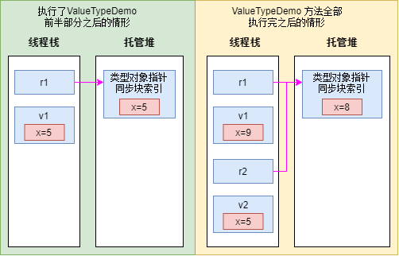

# 第 5 章 基元类型、引用类型和值类型

本章内容：
* <a href="#5_1">编程语言的基元类型</a>
* <a href="#5_2">引用类型和值类型</a>
* <a href="#5_3">值类型的装箱和拆箱</a>
* <a href="#5_4">对象哈希码</a>
* <a href="#5_5">dynamic 基元类型</a>

本章将讨论 Microsoft .NET Framework 开发人员经常要接触的各种类型。所以开发人员都应熟悉这些类型的不同行为。我首次接触 .NET Framework 时没有完全理解基元类型、引用类型和值类型的区别，造成在代码中不知不觉引入 bug 和性能问题。通过解释类型之间的区别，希望开发人员能避免我所经历的麻烦，同时提高编码效率。

## <a name="5_1">5.1 编程语言的基元类型</a>

某些数据类型如此常用，以至于许多编译器允许代码以简化语法来操纵它们。例如，可用以下语法分配一个整数：  

```C#
System.Int32 a = new System.Int32();
```

但你肯定不愿意用这种语法声明并初始化整数，它实在是太繁琐了。幸好，包括 C# 在内的许多编译器都允许换用如下所示的语法：

```C#
int a = 0;
```

这种语法不仅增强了代码可读性，生成的 IL 代码还与使用 `System.Int32` 生成的 IL 代码完全一致。编译器直接支持的数据类型称为 **基元类型**(primitive type)。基元类型直接映射到 Framework 类库(FCL)中存在的类型。例如，C# 的 `int` 直接映射到 `System.Int32` 类型。因此，以下 4 行代码都能正确编译，并生成完全相同的 IL：

```C#
  int            a = 0;                   // 最方便的语法
  System.Int32   a = 0;                   // 方便的语法
  int            a = new int();           // 不方便的语法
  System.Int32   a = new System.Int32();  // 最不方便的语法
```

表 5-1 列出的 FCL 类型在 C# 中都有对应的基元类型。只要是符合公共语言规范(CLS)的类型，其他语言都提供了类似的基元类型。但是，不符合 CLS 的类型语言就不一定要支持了。

表 5-1 C# 基元类型与对应的 FCL 类型
|C#基元类型|FCL类型|符合CLS|说明|
|:---:|:---:|:----:|:---:|
|`sbyte`|`System.SByte`|否|有符合 8 位值|
|`byte`|`System.Byte`|是|无符号 8 位值|
|`short`|`System.Int16`|是|有符号 16 位值|
|`ushort`|`System.UInt16`|否|无符号 16 位值|
|`int`|`System.Int32`|是|有符号 32 位值|
|`uint`|`System.UInt32`|否|无符号 32 位值|
|`long`|`System.Int64`|是|有符号 64 位值|
|`ulong`|`System.UInt64`|否|无符号 64 位值|
|`char`|`System.Char`|是|16位 Unicode 字符(`char` 不像在非托管 C++ 中那样代表一个 8 位置)|
|`float`|`System.Single`|是|IEEE 32 位浮点值|
|`double`|`System.Double`|是|IEEE 64 位浮点值|
|`bool`|`System.Boolean`|是|`true`/`false` 值|
|`decimal`|`System.Decimal`|是|128 位高精度浮点值，常用于不容许舍入误差的金融计算。 128 位中， 1 位是符号，96位是值本身(*N*)，8位是比例引子(*k*)。 `decimal` 实际值是 ±*N*×10<sup>k</sup>，其中 -28<= *k* <=0。其余位没有使用|
|`string`|`System.String`|是|字符数组|
|`object`|`System.Object`|是|所有类型的基类型|
|`dynamic`|`System.Object`|是|对于 CLR， `dynamic` 和 `object` 完全一致。但 C# 编译器允许使用简单的语法让 `dynamic` 变量参与动态调度。详情参见本章最后的 5.5 节“`dynamic` 基元类型”|

从另一个角度，可认为 C# 编译器自动假定所有源代码文件都添加了以下 `using` 指令(参考第 4 章)：

```C#
using sbyte  = System.SByte;
using byte   = System.Byte;
using short  = System.Int16;
using ushort = System.UInt16;
using int    = System.Int32;
using uint   = System.UInt32;
···
```

C# 语言规范称：“从风格上说，最好是使用关键字，而不是使用完整的系统类型名称。”我不同意语言规范：我情愿使用 FCL 类型名称，完全不用基元类型名称。事实上，我希望编译器根本不提供基元类型名称，而是强迫开发人员使用 FCL 类型名称。理由如下。

1. 许多开发人员纠结于是用 `string` 还是 `String` 。由于 C# 的 `using`(一个关键字)直接映射到 `System.String`(一个 FCL 类型)，所以两者没有区别，都可使用。类似地，一些开发人员说应用程序在 32 位操作系统上运行， `int` 代表 32 位整数；在 64 位操作系统上运行， `int` 代表 64 位整数。这个说法完全错误。C# 的 `int` 始终映射到 `System.Int32`，所以不管在什么操作系统上运行，代表的都是 32 位整数。如果程序员习惯在代码中使用 `Int32`，像这样的误解就没有了。

2. C#的 `long` 映射到 `System.Int64` ，但在其他编程语言中，`long` 可能映射到 `Int16` 或 `Int32`。例如， C++/CLI 就将 `long` 视为 `Int32`。习惯于用一种语言写程序的人在看用另一种语言写程序的人在看用另一种语言写的源代码时，很容易错误理解代码意图。事实上，大多数语言甚至不将 `long` 当作关键字，根本不编译使用了它的代码。

3. FCL 的许多方法都将类型名作为方法名的一部分。例如， `BinaryReader` 类型的方法包括 `ReadBoolean`，`ReadInt32`，`ReadSingle` 等；而 `System.Convert` 类型的方法包括 `ToBoolean`，`ToInt32`，`ToSingle` 等。以下代码虽然语法没问题，但包含 `float` 的那一行显得很别扭，无法一下子判断该行的正确性：  

    ```C#
    BinaryReader br = new BinaryReaser(...);
    float val    = br.ReadSingle();    // 正确，但感觉别扭
    Single val   = br.ReadSingle();    // 正确，感觉自然
    ```

4. 平时只用 C# 的许多程序员逐渐忘了还可以用其他语言写面向 CLR 的代码，“C#主义”逐渐入侵类库代码。例如， Microsoft 的 FCL 几乎是完全用 C# 写的，FCL 团队向库中引入了像 `Array` 的 `GetLongLength` 这样的方法。该方法返回 `Int64` 值。这种值在 C# 中确实是 `long`，但在其他语言(比如 C++/CLI)中不是。另一个例子是 `System.Linq.Enumerable` 的 `LongCount` 方法。

考虑到所有这些原因，本书坚持使用 FCL 类型名称。

在许多编程语言中，以下代码都能正确编译并运行：

```C#
Int32 i = 5;   // 32 位值
Int64 l = i;   // 隐式转型为 64 位值
```

但根据第 4 章对类型转换的讨论，你或许认为上述代码无法编译。毕竟，`System.Int32` 和 `System.Int64` 是不同的类型，相互不存在派生关系。但事实上，你会欣喜地发现 C# 编译器正确编译了上述代码，运行起来也没有问题。这是为什么呢？原因是 C# 编译器非常熟悉基元类型，会在编译代码时应用自己的特殊规则。也就是说，编译器能识别常见的编程模式，并生成必要的 IL，使写好的代码能像预期的那样工作。具体地说，C# 编译器支持与类型转换、*字面值*以及操作符有关的模式。接着的几个例子将对它们进行演示。
> 即 literal ，也称为直接量或文字常量。本书将采用“字面值”这一译法。 —— 译注

首先，编译器能执行基元类型之间的隐式或显式转型，例如：

```C#
Int32 i = 5;          // 从 Int32 隐式转型为 Int32
Int64 l = i;          // 从 Int32 隐式转型为 Int64
Single s = i;         // 从 Int32 隐式转型为 Single
Byte b = (Byte) i;    // 从 Int32 显式转型为 Byte
Int16 v = (Int16) s;  // 从 Single 显式转型为 Int16
```

只有在转换“安全”的时候，C#才允许隐式转型。所谓“安全”，是指不会发生数据丢失的情况，比如从 `Int32` 转换为 `Int64`。但如果可能不安全，C# 就要求显示转型。对于数值类型，“不安全”意味着转换后可能丢失精度或数量级。例如， `Int32` 转换为 `Byte` 要求显式转型，因为大的 `Int32` 数字可能丢失精度；`Single` 转换为 `Int16` 也要求显式转型，因为 `Signle` 能表示比 `Int16` 更大数量级的数字。

注意，不同编译器可能生成不同代码来处理这些转型。例如，将值为 6.8 的 `Single` 转型为 `Int32`，有的编译器可能生成代码对其进行截断(向下取整)，最终将 6 放到一个 `Int32` 中；其他编译器则可能将结果向上取整为 7 。顺便说一句，C# 总是对结果进行截断，而不进行向上取整。要了解 C# 对基元类型进行转型时的具体规则，请参加 C# 语言规范的 “转换” 一节。

除了转型，基本类型还能写成字面值(literal)。字面值可被看成是类型本身的实例，所以可像下面为实例(123 和 456)调用实例方法：

```C#
Console.WriteLine(123.ToString() + 456.ToString());     // "123456"
```

另外，如果表达式由字面值构成，编译器在编译时就能完成表达式求值，从而增强应用程序性能:

```C#
Boolean found = false;   // 生成的代码将 found 设为 0
Int32 x = 100 + 20 + 3； // 生成的代码将 x 设为 123
String s ="a " + "bc";   // 生成的代码将 s 设为 "a bc"
```

最后，编译器知道如何和以什么顺序解析代码中的操作符(比如 `+`，`-`，`*`，`/`，`%`，`&`，`^`，`|`，`==`，`!=`，`>`，`<`，`>=`，`<=`，`<<`，`>>`，`~`，`!`，`++`，`--` 等):

```C#
Int32 x = 100;                     // 赋值操作符
Int32 y = x + 123;                 // 加和赋值操作符
Boolean lessThanFifty = (y < 50);  // 小于和赋值操作符
```

### **checked 和 unchecked 基元类型操作符**

对基元类型执行的许多算术运算都可能造成溢出：

```C#
Byte b = 100;
b = (Byte) (b + 200);  // b 现在包含 44 (或者十六进制 2C)
```

> 重要提示 执行上述算术运算时，第一步要求所有操作数都扩大为 32 位值(或者 64 位值，如果任何操作数需要超过 32 位来表示的话)。所以 b 和 200(两个都不超过 32 位)首先转换成 32 位值，然后加到一起。结果是一个 32 位值(十进制 300，或十六进制 12C)。该值在寄回变量 b 前必须转型为 `Byte` 。C# 不隐式执行这个转型操作，这正是第二行代码需要强制转型 `Byte` 的原因。

溢出大多数时候是我们不希望的。如果没有检测到这种溢出，会导致应用程序行为失常。但极少数时候(比如计算哈希值或者校验和)，这种溢出不仅可以接受，还是我们希望的。

不同语言处理溢出的方式不同。C 和 C++ 不将溢出视为错误，允许值*回滚(wrap)*;应用程序将“若无其事”地运行。相反， Microsoft Visual Basic 总是将溢出视为错误，并在检测到到溢出时抛出异常。
> 所谓"回滚"，是指一个值超过了它的类型所允许的最大值，从而”回滚“到一个非常小的、负的或者未定义的值。 wrap 是 wrap-around 的简称。——译注

CLR 提供了一些特殊的 IL 指令，允许编译器选择它认为最恰当的行为。 CLR 有一个 `add` 指令，作用是将两个值相加，但不执行溢出检查。还有一个 `add.ovf` 指令，作用也是将两个相加，但会在发生溢出时抛出 `System.OverflowException` 异常。除了用于加法运算的 IL 指令，CLR 还为减、乘和数据转换提供了类似的 IL 指令，分别是 `sub/sub.ovf,mul/mul.ovf` 和 `conv/conv.ovf`。

C# 允许程序员自己决定如何处理溢出。溢出检查默认关闭。也就是说，编译器生成 IL 代码时，将自动使用加、减、乘以及转换指令的无溢出检查版本。结果是代码能更快地运行 —— 但开发人员必须保证不发生溢出，或者代码能预见到溢出。

让 C# 编译器控制溢出的一个办法是使用 `/checked+` 编译器开关。该开关指示编译器在生成代码时，使用加、减、乘和转换指令的溢出检查版本。这样生成的代码在执行时会稍慢一些，因为 CLR 会检查这些运算，判断是否发生溢出。如果发生溢出， CLR 抛出 `OverflowException` 异常。

除了全局性地打开或关闭溢出检查，程序员还可在代码的特定区域控制溢出检查。C# 通过 `checked` 和 `unchecked` 操作符来提供这种灵活性。下面是使用了 `unchecked` 操作符的例子：

```C#
UInt32 invalid = unchecked( (UInt32) (-1));   // OK
```

下例则使用了 `checked` 操作符：

```C#
Byte b = 100;
b = checked((Byte) (b + 200));    // 抛出 OverflowException 异常
```

在这个例子中， `b` 和 `200` 首先转换成 32 位值，然后加到一起，结果是 300。然后，因为显式转型的存在， `300` 被转换成一个 `Byte`，这造成 `OverflowException` 异常。`Byte` 在 `checked` 操作符外部转型则不会发生异常：  

```C#
b = (Byte) checked(b + 200);    // b 包含 44； 不会抛出 OverflowException 异常
```

除了 `checked` 和 `unchecked` 操作符，C# 还支持 `checked` 和 `unchecked` 语句，它们造成一个块中的所有表达式都进行或不进行溢出检查：

```C#
checked {                   // 开始 checked 块
  Byte b = 100;
  b = (Byte) (b + 200);     // 该表达式会进行溢出检查
}                           // 结束 checked 块
```

事实上，如果使用了 `checked` 语句块，就可将 += 操作符用于 `Byte`，稍微简化一下代码：  

```C#
checked {             // 开始 checked 块
  Byte b = 100;
  b += 200;           // 该表达式会进行溢出检查
}                     // 结束 checked 块
```

> 重要提示 由于 `checked` 操作符和 `checked` 语句唯一的作用就是决定生成哪个版本的加、减、乘和数据转换 IL 指令，所以在 `checked` 操作符或语句中调用方法，不会对该方法造成任何影响，如下例所示：

```C#
checked {
  // 假定 SomeMethod 试图把 400 加载到一个 Byte 中
  SomeMethod(400);
  // SomeMethod 可能会、也可能不会抛出 OverflowException 异常
  // 如果 SomeMethod 使用 checked 指令编程，就可能会抛出异常
  // 但这和当前的 checked 语句无关
}
```

根据我的经验，许多计算都会产生令人吃惊的结果。这一般是由于无效的用户输入，但也可能是由于系统的某个部分返回了程序员没有预料到的值。所以我对程序员有以下建议。

1. 尽量使用有符号数值类型(比如 `Int32` 和 `Int64`)而不是无符号数值类型(比如 `UInt32` 和 `UInt64`)。这允许编译器检测更多的上溢/下溢错误。除此之外，类库多个部分(比如 `Array` 和 `String` 的 `Length` 属性)被硬编码为返回有符号的值。这样在代码中四处移动这些值时，需要进行的强制类型转换就少了。较少的强制类型转换使代码更整洁，更容易维护。除此之外，无符号数值类型不符合 CLS。

2. 写代码时，如果代码可能发生你不希望的溢出(可能是因为无效的输入，比如要求使用最终用户或客户机提供的数据)，就把这些代码放到 `checked` 块中。同时捕捉 `OverflowException`，得体地从错误中恢复。

3. 写代码时，将允许发生溢出的代码显式放到 `unchecked` 块中，比如在计算校验和时。

4. 对于没有使用 `checked` 或 `unchecked` 的任何代码，都假定你希望在发生溢出时抛出一个异常，比如在输入已知的前提下计算一些东西(比如质数)，此时的溢出应被计为 bug。

开发应用程序时，打开编译器的 `/checked+` 开关进行调试性生成。这样系统会对没有显式标记 `checked` 或 `unchecked` 的代码进行溢出检查，所以应用程序运行起来会慢一些。此时一旦发生异常，就可以轻松检测到，而且能及时修正代码中的 bug。但是，为了正式发布而生成应用程序时，应使用编译器的 `/checked-` 开关，确保代码能更快运行，不会产生溢出异常。要在 Microsoft Visual Studio 中更改 Checked 设置，请打开项目的属性页，点击”生成“标签，单击”高级“，再勾选”检查运算上溢/下溢“，如图 5-1 所示。  
  
图 5-1 在 Visual Studio 的”高级生成设置“对话框中指定编译器是否检查溢出  

如果应用程序能容忍总是执行 `checked` 运算而带来的轻微性能损失，建议即使是为了发布而生成应用程序，也用 `/checked` 命令行开关进行编译，这样可防止应用程序在包含已损坏的数据(甚至可能是安全漏洞)的前提下继续运行。例如，通过乘法运算来计算数组索引时，相较于因为数学运算的 *”回滚“* 而访问到不正确的数组元素，抛出 `OverflowException` 异常才是更好的做法。
> 乘法运算可能产生一个较大的值，超出数组的索引范围。参见上一条关于 ”wrap“ 的注释。 —— 译注

>> 重要提示 `System.Decimal` 是非常特殊的类型。虽然许多编程语言(包括 C# 和 Visual Basic)将 `Decimal` 视为基元类型，但 CLR 不然。这意味着 CLR 没有知道如何处理 `Decimal` 值的 IL 指令。在文档中查看 `Decimal` 类型，可以看到它提供了一系列 `pulbic static` 方法，包括 `Add`，`Subtract`，`Multiply`，`Divide` 等。此外， `Decimal` 类型还为 `+`，`-`，`\*`，`/`等提供了操作重载方法。

>> 编译使用了 `Decimal` 值的程序时，编译器会生成代码来调用 `Decimal` 的成员，并通过这些成员来执行实际运算。这意味着 `Decimal` 值的处理速度慢于 CLR 基元类型的值。另外，由于没有相应的 IL 指令来处理 `Decimal` 值，所以 `checked` 和 `unchecked` 操作符、语句以及编译器开关都失去了作用。如果对 `Decimal` 值执行的运算是不安全的，肯定会抛出 `OverflowException` 异常。

>> 类似地，`System.Numerics.BigInteger` 类型也在内部使用 `UInt32` 数组来表示任意大的整数，它的值没有上限和下限。因此，对 `BigInteger` 执行的运算永远不会造成 `OverflowException` 异常。但如果值太大，没有足够多的内存来改变数组大小，对 `BigInteger` 的运算可能抛出 `OutOfMemoryException` 异常。

## <a name="5_2">5.2 引用类型和值类型</a>

CLR 支持两种类型：**引用类型**和**值类型**。虽然 FCL 的大多数类型都是引用类型，但程序员用得最多的还是值类型。引用类型总是从托管堆分配， C# 的 `new` 操作符返回对象内存地址 —— 即指向对象数据的内存地址。使用引用类型必须留意性能问题。首先要认清楚以下四个事实。

1. 内存必须从托管堆分配。
2. 堆上分配的每个对象都有一些额外成员，这些成员必须初始化。
3. 对象中的其他字节(为字段而设)总是设为零。
4. 从托管堆分配对象时，可能强制执行一次垃圾回收。

如果所有类型都是引用类型，应用程序的性能将明显下降。设想每次使用 `Int32` 值时都进行一次内存分配，性能会受到多么大的影响！为了提升简单和常用的类型的性能，CLR 提供了名为“值类型”的轻量级类型。值类型的实例一般在线程栈上分配(虽然也可作为字段嵌入引用类型的对象中)。在代表值类型实例的变量中不包含指向实例的指针。相反，变量中包含了实例本身的字段。由于变量已包含了实例的字段，所以操作实例中的字段不需要提领指针。值类型的实例不受垃圾回收器的控制。因此，值类型的使用缓解了托管堆的压力，并减少了应用程序生存期内的垃圾回收次数。

文档清楚指出哪些类型是引用类型，哪些是值类型。在文档中查看类型时，任何称为“类”的类型都是引用类型。例如，`System.Exception` 类、`System.IO.FileStream` 类以及 `System.Random` 类都是引用类型。相反，所有值类型都称为结构或枚举。例如，`System.Int32` 结构、`System.Boolean` 结构，`System.Decimal` 结构、 `System.TimeSpan`结构、`System.DayOfWeek`枚举、`System.IO.FileAttributes`枚举以及 `System.Drawing.FontStyle` 枚举都是值类型。

进一步研究文档，会发现所有结构都是抽象类型 `System.ValueType` 的直接派生类。 `System.ValueType` 本身又直接从 `System.Object` 派生。根据定义，所有值类型都必须从 `System.ValueType` 派生。所有枚举都从 `System.Enum` 抽象类型派生，后者又从 `System.ValueType` 派生。CLR 和所有编程语言都给予枚举*特殊待遇*。欲知枚举类型的详情，请参见第 15 章 “枚举类型和位标志”。
> 将视为“一等公民”，直接支持各种强大的操作。在非托管环境中，枚举就没这么“好命”了。 —— 译注

虽然不能在定义值类型时为它选择基类型，但如果愿意，值类型可实现一个或多个接口。除此之外，所有值类型都隐式密封，目的是防止将值类型用作其他引用类型或值类型的基类型。例如，无法将 `Boolean`，`Char`，`Int32`，`UInt64`，`Single`，`Double`，`Decimal`等作为基类型来定义任何新类型。
 > 重要提示 对于许多开发人员(比如非托管 C/C++ 开发人员)，最初接触引用类型和值类型时都觉得有些不解。在非托管 C/C++ 中声明类型后，使用该类型的代码会决定是在线程栈上还是在应用程序的堆中分配类型的实例。但在托管代码中，要由定义类型的开发人员决定在什么地方分配类型的实例，使用类型的人对此并无控制权。

 以下代码和图 5-2 演示了引用类型和值类型的区别：

 ```C#
 // 引用类型(因为 'class')
 class SomeRef { public Int32 x; }

 // 值类型(因为 'struct')
 struct SomeVal { public Int32 x; }

 static void ValueTypeDemo() {
   SomeRef r1 = new SomeRef();  // 在堆上分配
   SomeVal v1 = new SomeVal();  // 在栈上分配
   rl.x = 5;                    // 提领指针
   v1.x = 5;                    // 在栈上修改
   Console.WriteLine(r1.x);     // 显示 “5”
   Console.WriteLine(v1.x);     // 同样显示 “5”
   // 图 5-2 的左半部分反映了执行以上代码之后的情况

   SomeRef r2 = r1;             // 只复制引用(指针)
   SomeVal v2 = v1;             // 在栈上分配并复制成员
   rl.x = 8;                    // r1.x 和 r2.x 都会更改
   v1.x = 9;                    // v1.x 会更改， v2.x 不变
   Console.WriteLine(r1.x);     // 显示 "8"
   Console.WriteLine(r2.x);     // 显示 "8"
   Console.WriteLine(v1.x);     // 显示 "9"
   Console.WriteLine(v2.x);     // 显示 "5"
 }
 ```

  
图 5-2 图解代码执行时的内存分配情况  

上述代码中， `SomeVal` 类型用 `struct` 声明，而不是用更常用的 `class`。在 C# 中，用 `struct` 声明的类型是值类型，用 `class` 声明的类型是引用类型。可以看出，引用类型和值类型的区别相当大。在代码中使用类型时，必须注意是引用类型还是值类型，因为这会极大地影响在代码中表达自己意图的方式。

上述代码中有这样一行：

```C#
SomeVal vl = new SomeVal();    // 在栈上分配
```

因为这行代码的写法，似乎是要在托管堆上分配一个 `SomeVal` 实例。但 C# 编译器知道 `SomeVal` 是值类型，所以会生成正确的 IL 代码，在线程栈上分配一个 `SomeVal` 实例。 C# 还会确保值类型中的所有字段都初始化为零。

上述代码还可以像下面这样写：

```C#
SomeVal v1;    // 在栈上分配 
```

这一行生成的 IL 代码也会在线程栈上分配实例，并将字段初始化为零。唯一的区别在于，如果使用 `new` 操作符，C# 会认为实例已初始化。以下代码更清楚地进行了说明：  

```C#
// 这两行代码能通过编译，因为 C# 认为
// v1 的字段已初始化为 0
SomeVal v1 = new SomeVal();
Int32 a = v1.x;

// 这两行代码不能通过编译，因为 C# 不认为
// v1 的字段已初始化为 0
SomeVal v1；
Int32 a = v1.x;   // error CS0170：使用了可能未赋值的字段 “x” 
```

设计自己的类型时，要仔细考虑类型是否应该定义成值类型而不是引用类型。值类型有时能提供更好的性能。具体地说，除非满足以下全部条件，否则不应该将类型声明为值类型。

* 类型具有基元类型的行为。也就是说，是十分简单的类型，没有成员会修改类型的任何实例字段。如果类型没有提供会更改其字段的成员，就说该类型是**不可变**(immutable)类型。事实上，对于许多值类型，我们都建议将全部字段标记为 **readonly**(详情参见第 7 章 “常量和字段”)。

* 类型不需要从其他任何类型继承。

* 类型也不派生出其他任何类型。

类型实例大小也应在考虑之列，因为实参默认以传值方式传递，造成对值类型实例中的字段进行复制，对性能造成损害。同样地，被定义为返回一个值类型的方法在返回时，实例中的字段会复制到调用者分配的内存中，对性能造成损害。所以，要将类型声明为值类型，除了要满足以上全部条件，还必须满足以下任意条件。

* 类型的实例较小(16 字节或更小)。

* 类型的实例较大(大于 16 字节)，但不作为方法实参传递，也不从方法返回。

值类型的主要优势是不作为对象在托管堆上分配。当然，与引用类型相比，值类型也存在自身的一些局限。下面列出了值类型和引用类型的一些区别。

* 值类型对象有两种表示形式： **未装箱** 和 **已装箱**，详情参见下一节。相反，引用类型总是处于已装箱形式。

* 值类型从 `System.ValueType` 派生。该类型提供了与 `System.Object` 相同的方法。但 `System.ValueType` 重写了 `Equals` 方法，能在两个对象的字段值完全匹配的前提下返回 `true`。此外， `System.ValueType` 重写了 `GetHashCode` 方法。生成哈希码时，这个重写方法所用的算法会将对象的实例字段中的值考虑在内。由于这个默认实现存在性能问题，所以定义自己的值类型时应重写 `Equals` 和 `GetHashCode` 方法，并提供它们的显式实现。 本章末尾会讨论 `Equals` 和 `GetHashCode` 方法。

* 由于不能将值类型作为基类型来定义新的值类型或者新的引用类型，所以不应在值类型中引入任何新的虚方法。所有方法都不能是是抽象的，所有方法都隐式密封(不可重写)。

* 引用类型的变量包含堆中对象的地址。引用类型的变量创建时默认初始化 `null` ，表明当前不指向有效对象。视图使用 `null` 引用类型变量会抛出 `NullReferenceException` 异常。相反，值类型的变量总是包含其基础类型的一个值，而且值类型的所有成员都初始化为 **0**。值类型变量不是指针，访问值类型不可能抛出 `NullReferenceException` 异常。CLR 确实允许为值类型添加”可空“(nullability)标识。可空类型将在第 19 章”可空值类型“详细讨论。

* 将值类型变量赋给另一个值类型变量，会执行逐字段的复制。将引用类型的变量赋给另一个引用类型的变量只复制内存地址。

* 基于上一条，两个或多个引用类型变量能引用堆中同一个对象，所以对一个变量执行的操作可能影响到另一个变量引用的对象。相反，值类型变量自成一体，对值类型变量执行的操作不可能影响另一个值类型变量。

* 由于未装箱的值类型不在堆上分配，一旦定义了该类型的一个实例的方法不再活动，为它们分配的存储就会被释放，而不是等着进行垃圾回收。

> CLR 如何控制类型中的字段布局

>>为了提高性能，CLR 能按照它所选择的任何方式排列类型的字段。例如，CLR 可以在内存中重新安排字段的顺序，将对象引用分为一组，同时正确排列和填充数据字段。但在定义类型时，针对类型的各个字段，你可以告诉 CLR 是严格按照自己制定的顺序排列，还是按照 CLR 自己认为合适的方式重新排列。

>>为了告诉 CLR 应该怎样做，要为自己定义的类或结构应用 `System.Runtime.InteropServices.StructLayoutAttribute` 特性。可向该特性的构造器传递 `LayoutKind.Auto`，让 CLR 自动排列字段；也可传递 `LayoutKind.Sequential` ，让 CLR 保持你的字段布局；也可传递 `LayoutKind.Explicit`，利用偏移量在内存中显式排列字段。如果不为自己定义的类型显式指定 `StructLayoutAttribute`，编译器会选择它自认为最好的布局。

>>注意，Microsoft C# 编译器默认为引用类型(类)选择 `LayoutKind.Auto`，为值类型(结构)选择 `LayoutKind.Sequential` 。显然，C# 编译器团队认为和非托管代码互操作时会经常用到结构。为此，字段必须保持程序员定义的顺序。然而，假如创建的值类型不与非托管代码互操作，就应该覆盖 C# 编译器的默认设定，下面是一个例子：

```C#
using System;
using System.Runtime.InteropServices;

// 让 CLR 自动排列字段以增强这个值类型的性能
[StructLayout(LayoutKind.Auto)]
internal struct SomeValType {
  private readonly Byte m_b;
  private readonly Int16 m_x;
  ...
}
```

>>`StructLayoutAttribute` 还允许显式指定每个字段的偏移量，这要求向其构造器传递 `LayoutKind.Explicit`。 然后向值类型中的每个字段都应用 `System.Runtime.InteropServices.FieldOffsetAttribute` 特性的实例，向该特性的构造器传递 `Int32` 值来指出字段第一个字节距离实例起始处的偏移量(以字节为单位)。显式布局常用于模拟非托管 C/C++ 中的 *`union`*，因为多个字段可起始于内存的相同偏移位置。下面是一个例子：

>>> union 是特殊的类，union 中的数据成员在内存中的存储相互重叠。每个数据成员都从相同内存地址开始。分配给 union 的存储区数量是包含它最大数据成员所需的内存数。同一时刻只有一个成员可以被赋值。 —— 译注

```C#
using System;
using System.Runtime.InteropServices;

// 开发人员显式排列这个值类型的字段
[StructLayout(LayoutKind.Explicit)]
internal struct SomeValType {
  [FiledOffset(0)]
  private readonly Byte m_b;     // m_b 和 m_x 字段在该类型的实例中相互重叠

  [FiledOffset(0)]
  private readonly Int16 m_x;    // m_b 和 m_x 字段在该类型的实例中相互重叠
  ...
}
```

>> 注意在类型中，一个引用类型和一个值类型相互重叠是不合法的。虽然允许多个引用类型在同一个起始偏移位置相互重叠，但这无法验证(unverifiable)。定义类型，在其中让多个值类型相互重叠则是合法的。但是，为了使这样的类型能够验证(verifiable)，所有重叠字节都必须能通过公共字段访问。

## <a name="5_3">5.3 值类型的装箱和拆箱</a>

值类型比引用类型“轻”，原因是它们不作为对象在托管堆中分配，不被垃圾回收，也不通过指针进行引用。但许多时候都需要获取对值类型实例的引用。例如，假定要创建 `ArrayList` (`System.Collections` 命名空间中定义的一个类型)对象来容纳一组 `Point` 结构，代码如下：

```C#
// 声明值类型
struct Point {
  public Int32 x, y;
}

public sealed class Program {
  public static void Main() {
    ArrayList a = new ArrayList();
    Point p;                          // 分配一个 Point (不在堆中分配)
    for (Int32 i = 0; i < 10; i++) {
      p.x = p.y = i;                  // 初始化值类型中成员
      a.Add(p);                       // 对值类型装箱，将引用添加到 ArrayList 中
    }
    ...
  }
}
```

每次循环迭代都初始化一个 `Point` 的值类型字段，并将该 `Point` 存储到 `ArrayList` 中。但思考一下 `ArrayList` 中究竟存储了什么？是 `Point` 结构， `Point` 结构的地址，还是其他完全不同的东西？要知道正确答案，必须研究 `ArrayList` 的 `Add` 方法，了解它的参数被定义成什么类型。本例的 `Add` 方法原型如下：

```C#
public virtual Int32 Add(Object value);
```

可以看出 `Add` 获取的是一个 `Object` `参数，也就是说，Add` 获取对托管堆上的一个对象的引用(或指针)来作为参数。但之前的代码传递的是 `p`，也就是一个 `Point`，是值类型。为了使代码正确工作， `Point` 值类型必须转换成真正的、在堆中托管的对象，而且必须获取对该对象的引用。

将值类型转换成引用类型要使用**装箱**机制。下面总结了对值类型的实例进行装箱时所发生的事情。

1. 在托管堆中分配内存。分配的内存量是值类型各字段所需的内存量，还要加上托管堆所有对象都有的两个额外成员(类型对象指针和同步块索引)所需的内存量。

2. 值类型的字段复制到新分配的堆内存。

3. 返回对象地址。现在该地址是对象引用；值类型成了引用类型。

C# 编译器自动生成对值类型实例进行装箱所需的 IL 代码，但仍需理解内部发生的事情，对代码长度和性能心中有数。  
C# 编译器自动生成对值类型实例进行装箱所需的 IL 代码，但你仍然需要理解内部的工作机制才能体会到代码的大小和性能问题。

C# 编译器检测到上述代码是向要求引用类型的方法传递值类型，所以自动生成代码对对象进行装箱。所以在运行时，当前存在于 `Point` 值类型实例 `p` 中的字段复制到新分配的 `Point` 对象中。已装箱 `Point` 对象(现在是引用类型)的地址返回并传给 `Add` 方法。 `Point` 对象一直存在于堆中，直至被垃圾回收。 `Point` 值类型变量 `p` 可被重用，因为 `ArrayList`  不知道关于它的任何事情。在这种情况下，已装箱值类型的生存期超过了未装箱值类型的生存期。
> 注意 FCL 现在包含一组新的泛型集合类，非泛型集合类已成为“昨日黄花”。例如，应该使用 `System.Collections.Generic.List<T>` 类而不是 `System.Collections.ArrayList` 类。泛型集合类对非泛型集合类进行了大量改进。例如， API 得到简化和增强，集合类的性能也得到显著提升。但最大的改进就是泛型集合类允许开发人员在操作值类型的集合时不需要对集合中的项进行装箱/拆箱。单这一项改进，就使性能提升了不少。这是因为托管堆中需要创建的对象减少了，进而减少了应用程序需要执行的垃圾回收的次数。另外，开发人员还获得了编译时的类型安全性，源代码也因为强制类型转换的次数减少而变得更清晰。所有这一切都将在第 12 章 “泛型” 详细解释。

知道装箱如何进行后，接着谈谈拆箱。假定要用以下代码获取 `ArrayList` 的第一个元素：

```C#
Point p = (Point) a[0];
```

它获取 `ArrayList` 的元素0包含的引用(或指针)，试图将其放到 `Point` 值类型的实例 `p` 中。为此，已装箱 `Point` 对象中的所有字段都必须复制到值类型变量 `p` 中，后者在线程栈上。 CLR 分两步完成复制。第一步获取已装箱 `Point` 对象中的各个 `Point` 字段的地址。这个过程称为**拆箱**(unboxing)。第二步将字段包含的值从堆复制到基于栈的值类型实例中。

拆箱不是直接将装箱过程倒过来。拆箱的代价比装箱低得多。拆箱其实就是获取指针的过程，该指针指向包含在一个对象中的原始值类型(数据字段)。其实，指针指向的是已装箱实例中的未装箱部分。所以和装箱不同，拆箱不要求在内存中复制任何字节。知道这个重要区别之后，还应知道一个重点是，往往紧接着土拆箱发生一次字段复制。

装箱和拆箱/复制显然会对应用程序的速度和内存消耗产生不利影响，所以应留意编译器在什么时候生成代码来自动进行这些操作。并尝试手动编写代码，尽量减少这种情况的发生。

已装箱值类型实例在拆箱时，内部发生下面这些事情。

1. 如果包含“对已装箱值类型实例的引用”的变量为 `null`，抛出 `NullReferenceException` 异常。
2. 如果引用的对象不是所需值类型的已装箱实例，抛出 `InvalidCastException` 异常。

> CLR 还允许将值类型拆箱为相同值类型的可空版本。详情将在第 19 章讨论。

第二条意味着以下代码的工作方式和你想的可能不一样：

```C#
public static void Main() {
  Int32 x = 5;
  Object o = x;         // 对 x 装箱， o 引用已装箱对象
  Int16 y = (Int16) o;  // 抛出 InvalidCastException 异常  :System.InvalidCastException: 'Specified cast is not valid.'
}
```

从逻辑上说，完全能获取 `o` 引用的已装箱 `Int32`，将其强制转型为 `Int16` 。但在对于对象进行拆箱时，只能转型为最初未装箱的值类型——本例是 `Int32` 。以下是上述代码的正确写法：

```C#
public static void Main() {
  Int32 x = 5;
  Object o = x;                // 对 x 装箱， o 引用已装箱对象
  Int16 y = (Int16)(Int32)o;   // 先拆箱为正确类型，再转型
}
```

前面说过，一次拆箱操作经常紧接着一次字段复制。以下 C# 代码演示了拆箱和复制：

```C#
public static void Main() {
  Point p;
  p.x = p.y = 1;
  Object o = p;         // 对 p 装箱：o 引用已装箱实例  

  p = (Point) o;        // 对 o 拆箱，将字段从已装箱实例复制到栈变量中
}
```

最后一行，C# 编译器生成一条 IL 指令对 `o` 拆箱(获取已装箱实例中的字段的地址)，并生成另一条 IL 指令将这些字段从堆复制到基于栈的变量 `p` 中。

再来看看以下代码：

```C#
public static void Main() {
    Point p;
    p.x = p.y = 1;
    Object o = p;   // 对 p 装箱：o 引用已装箱实例

    // 将 Point 的 x 字段变成 2
    p = (Point)o;   // 对 o 拆箱，将字段从已装箱的实例复制到栈变量中
    p.x = 2;        // 更改栈变量的状态
    o = p;          // 对 p 装箱：o 引用新的已装箱实例
}
```

最后三行代码唯一的目的就是将 `Point` 的 `x` 字段从 **1** 变成 **2**。为此，首先要执行一次拆箱，再执行一次字段复制，再更改字段(在栈上)，最后执行一次装箱(在托管堆上创建全新的已装箱实例)。想必你已体会到了装箱和拆箱/复制对应用程序性能的影响。

有的语言(比如 C++/CLI)允许在不复制字段的前提下对已装箱的值类型进行拆箱。拆箱返回已装箱对象中的未装箱部分的地址(忽略对象的“类型对象指针”和“同步块索引”这两个额外的成员)。接着可利用这个指针来操纵未装箱实例的字段(这些字段恰好在堆上的已装箱对象中)。例如，上述代码用 C++/CLI 来写，效率会高很多，因为可直接在已装箱 `Point` 实例中修改 `Point` 的 `x` 字段的值。这就避免了在堆上分配新对象和复制所有字段两次！

> 重要提示 如果关心应用程序的性能，就应清楚编译器何时生成代码执行这些操作。遗憾的是，许多编译器都隐式生成代码来装箱对象，所以有时并不知道自己的代码会造成装箱。如果关心特定算法的性能，可用 ILDasm.exe 这样的工具查看方法的 IL 代码，观察 IL 指令 box 都在哪些地方出现。

再来看几个装箱和拆箱的例子：

```C#
public static void Main() {
  Int32 v = 5;       // 创建未装箱值类型变量
  Object o = v;      // o 引用已装箱的、包含值 5 的 Int32
  v = 123;           // 将未装箱的值修改成 123

  Console.WriteLine(v + "," + (Int32)o);     // 显示 "123,5"
}
```

能从上述代码中看出发生了多少次装箱吗？如果说 3 次，会不会觉得意外？让我们仔细分析一下代码，理解具体发生的事情。为了帮助理解，下面列出为这个 `Main` 方法生成的 IL 代码。我为这些代码加上了注释，方便你看清楚发生的每个操作：

```C#
.method public hidebysig static void  Main() cil managed
{
  .entrypoint
  // 代码大小       45 (0x2d)
  .maxstack  3
  .locals init ([0] int32 v,
           [1] object o)
  // 将 5 加载到 v 中
  IL_0000:  ldc.i4.5
  IL_0001:  stloc.0

  // 将 v 装箱，将引用指针存储到 o 中
  IL_0002:  ldloc.0
  IL_0003:  box        [mscorlib]System.Int32
  IL_0008:  stloc.1

  // 将 123 加载到 v 中
  IL_0009:  ldc.i4.s   123
  IL_000b:  stloc.0

  // 对 v 装箱，将指针保留在栈上以进行 Concat (连接)操作
  IL_000c:  ldloca.s   v
  IL_000d:  box       [mscorlib]System.Int32

  // 将字符串加载到栈上以执行 Concat 操作
  IL_0012:  ldstr      ","

  // 对 o 拆箱：获取一个指针，它指向栈上的 Int32 字段
  IL_0017:  ldloc.1
  IL_0018:  unbox.any  [mscorlib]System.Int32

  // 对 Int32 装箱，将指针保留在栈上以进行 Concat 操作
  IL_001d:  box       [mscorlib]System.Int32

  // 调用 Concat
  IL_0022:  call       string [mscorlib]System.String::Concat(object,
                                                              object,
                                                              object)

  // 将从 Concat 返回的字符串传给 WriteLine
  IL_0027:  call       void [mscorlib]System.Console::WriteLine(string)
  
  // 从 Main 返回，终止应用程序
  IL_002c:  ret
} // end of method App::Main 
```

首先在栈上创建一个 `Int32` 未装箱值类型实例( `v` )，将其初始化为 `5` 。再创建 `Object` 类型的变量( `o` )并初始化，让它指向 v 。但由于引用类型的变量始终指向堆中的对象，所以 C# 生成正确的 IL 代码对 `v` 进行装箱，将 `v` 的已装箱拷贝的地址存储到 `o` 中。接着，值 `123` 被放到未装箱值类型实例 `v` 中，但这个操作不会影响已装箱的 `Int32` ，后者的值依然为 `5`。

接着调用 `WriteLine` 方法， `WriteLine` 要求获取一个 `String` 对象，但当前没有 `String` 对象。相反，现在有三个数据项：一个未装箱的 `Int32` 值类型实例( `v` )，一个 `String` (它是引用类型)，以及对已装箱 `Int32` 值类型实例的引用( `o` )，它要转型为未装箱的 `Int32` 。必须以某种方法合并这些数据项来创建一个 `String` 。

为了创建一个 `String` ，C# 编译器生成代码来调用 `String` 的静态方法 `Concat` 。 该方法有几个重载版本，所有版本执行的操作都一样，只是参数的数量不同。由于需要连接三个数据项来创建字符串，所以编译器选择 `Concat` 方法的以下版本：

```C#
public static String Concat(Object arg0, Object arg1, Object arg2);
```

为第一个参数 `arg0` 传递的是 `v`。但 `v` 是未装箱的值参数，而 `arg0` 是 `Object`，所以必须对 `v` 进行装箱，并将已装箱的 `v` 的地址传给 `arg0` 。 对于 `arg1` 参数，字符串`“,”`作为 `String` 对象引用传递。对于 `arg2` 参数， `o` (一个 `Object` 引用)会转型为 `Int32` 。这要求执行拆箱(但不紧接着执行复制)，从而获取包含在已装箱 `Int32` 中的未装箱 `Int32` 的地址。这个未装箱的 `Int32` 实例必须再次装箱，并将新的已装箱实例的内存地址传给 `Concat` 的 `arg2` 参数。

`Concat` 方法调用指定的每个对象的 `ToString` 方法，将每个对象的字符串形式连接起来。从 `Concat` 返回的 `String` 对象传给 `WriteLine` 方法以显示最终结果。

应该指出，如果像下面这样写 `WriteLine` 调用，生成的 IL 代码将具有更高的执行效率：

```c#
Console.WriteLine(v + "," + o);     // 显示 "123,5"
```

这和前面的版本几乎完全一致，只是移除了变量 `o` 之前的( `Int32` )强制转型。之所以效率更高，是因为 `o` 已经是指向一个 `Object` 的引用类型，它的地址可直接传给 `Concat` 方法。所以，移除强制转型避免了两次操作：一次拆箱和一次装箱。不妨重新生成应用程序，观察 IL 代码来体会避免的额外操作：

```C#
.method public hidebysig static void  Main() cil managed
{
  .entrypoint
  // 代码大小       35 (0x23)
  .maxstack  3
  .locals init ([0] int32 v,
           [1] object o)
  // 将 5 加载到 v 中
  IL_0000:  ldc.i4.5
  IL_0001:  stloc.0

  // 将 v 装箱，将引用指针存储到 o 中
  IL_0002:  ldloc.0
  IL_0003:  box        [mscorlib]System.Int32
  IL_0008:  stloc.1

  // 将 123 加载到 v 中
  IL_0009:  ldc.i4.s   123
  IL_000b:  stloc.0

  // 对 v 装箱，将指针保留在栈上以进行 Concat (连接)操作
  IL_000c:  ldloca.s   v
  IL_000d:  box       [mscorlib]System.Int32

  // 将字符串加载到栈上以执行 Concat 操作
  IL_0012:  ldstr      ","

  // 将已装箱 Int32 的地址加载到栈上以执行 Concat 操作
  IL_0017:  ldloc.1

  // 调用 Concat
  IL_0018:  call       string [mscorlib]System.String::Concat(object,
                                                              object,
                                                              object)

  // 将从 Concat 返回的字符串传给 WriteLine
  IL_001d:  call       void [mscorlib]System.Console::WriteLine(string)
  
  // 从 Main 返回，终止应用程序
  IL_0022:  ret
} // end of method App::Main 
```

简单对比一下两个版本的 `Main` 方法的 IL 代码，会发现没有( `Int32` )转型的版本比有转型的版本小了 10 字节。第一个版本额外的拆箱/装箱步骤显然会生成更多的代码。更大的问题是，额外的装箱步骤会从托管堆中分配一个额外的对象，将来必须对其进行垃圾回收。这两个版本的结果一样，速度上的差别也并不明显。但是，假如在循环中发生额外的、不必要的装箱操作，就会严重影响应用程序的性能和内存消耗。

甚至可以这样调用 `WriteLine` ，进一步提升上述代码的性能：

```C#
 Console.WriteLine(v.ToString() + "," + (Int32)o);     // 显示 "123,5"
```

这会为未装箱的值类型实例 `v` 调用 `ToString` 方法，它返回一个 `String` 。 `String` 对象已经是引用类型，所以能直接传给 `Concat` 方法，不需要任何装箱操作。

下面是演示装箱和拆箱的另一个例子：

```C#
public static void Main() {
    Int32 v = 5;              // 创建未装箱的值类型变量
    Object o = v;             // o 引用 v 的已装箱版本

    v = 123;                  // 将未装箱的值类型修改成 123
    Console.WriteLine(v);     // 显示 “123”
    v = (Int32)o;             // 拆箱并将 o 复制到 v
    Console.WriteLine(v);     // 显示 “5”
}
```

上述代码发生了多少次装箱？答案是一次。之所以只发生一次装箱，是因为 `System.Console` 类已定义了获取单个 `Int32` 参数的 `WriteLine` 方法：

```C#
public static void WriteLine(Int32 value);
```

在前面对 `WriteLine` 的两次调用中，变量 `v` ( `Int32` 未装箱值类型实例)以传值方式传给方法。虽然 `WriteLine` 方法也许会在它自己内部对 `Int32` 装箱，但这已经不在我们的控制范围之内了。最重要的是，我们已尽可能地在*自己*的代码中减少了装箱。

仔细研究一下 FCL，会发现许多方法都针对不同的值类型参数进行了重载。例如， `System.Console` 类型提供了 `WriteLine` 方法的几个重载版本：

```C#
public static void WriteLine(Boolean);
public static void WriteLine(Char);
public static void WriteLine(Char[]);
public static void WriteLine(Int32);
public static void WriteLine(UInt32);
public static void WriteLine(Int64);
public static void WriteLine(UInt64);
public static void WriteLine(Single);
public static void WriteLine(Double);
public static void WriteLine(Decimal);
public static void WriteLine(Object);
public static void WriteLine(String);
```

以下几个方法也有一组类似的重载版本：`System.Console` 的 `Write` 方法， `System.IO.BinaryWriter` 的 `Write` 方法， `System.IO.TextWriter` 的 `Write` 和 `WriteLine` 方法， `System.Runtime.Serialization.SerializationInfo` 的 `AddValue` 方法， `System.Text.StringBuilder` 的 `Append` 和 `Insert` 方法。大多数方法进行重载唯一的目的就是减少常用类型的装箱次数。

但这些 FCL 类的方法不可能接受你自己定义的值类型。另外，即使是 FCL 中定义好的值类型，这些方法也可能没有提供对应的重载版本。调用方法并传递值类型时，如果不存在与值类型对应的重载版本，那么调用的肯定是获取一个 `Object` 参数的重载版本。将值类型实例作为 `Object` 传递会造成装箱，从而对性能造成不利影响。定义自己的类时，可将类中的方法定义为泛型(通过类型约束将类型参数限制为值类型)。这样方法就可获取任何值类型而不必装箱。泛型主题将在第 12 章讨论。

关于装箱最后注意一点：如果知道自己的代码会造成编译器反复对一个值类型装箱，请改成用手动方式对值类型进行装箱。这样代码会变得更小、更快。下面是一个例子：

```C#
using System;

public sealed class Program {
  public static void Main() {
    Int32 v = 5;      // 创建未装箱的值类型变量

  #if INEFFICIENT
    // 编译下面这一行， v 被装箱 3 次，浪费时间和内存
    Console.WriteLine("{0}, {1}, {2}", v, v, v);
  #else
    // 下面的代码结果一样，但无论执行速度，还是内存利用，都比前面的代码更胜一筹
    Object o = v;     // 对 v 进行手动装箱(仅 1 次)

    // 编译下面这一行不发生装箱
    Console.WriteLine("{0}, {1}, {2}", o, o, o);
  #endif
  }
}
```

在定义了 `INEFFICIENT` 符号的前提下编译，编译器会生成代码对 `v` 装箱 3 次，造成在堆上分配 3 个对象！这太浪费了，因为每个对象都是完全相同的内容：**5**。在没有定义 `INEFFICIENT` 符号的前提下编译， `v` 只装箱一次，所以只在堆上分配一个对象。随后，在对 `Console.WriteLine` 方法的调用中，对同一个已装箱对象的引用被传递 3 次。第二个版本执行起来快得多，在堆上分配的内存也要少得多。

通过这些例子，很容易判断在什么时候一个值类型的实例需要装箱。简单地说，要获取对值类型实例的引用，实例就必须装箱。将值类型实例传给需要获取引用类型的方法，就会发生这种情况。但这并不是要对值类型实例装箱的唯一情况。

前面说过，未装箱值类型比引用类型更“轻”。这要归结于以下两个原因。

* 不在托管堆上分配。
* 没有堆上的每个对象都有的额外成员：“类型对象指针” 和 “同步块索引”。

由于未装箱值类型没有同步块索引，所以不能使用 `System.Threading.Monitor` 类型的方法(或者 C# `lock` 语句)让多个线程同步对实例的访问。

虽然未装箱值类型没有类型对象指针，但仍可调用由类型继承或重写的虚方法(比如 `Equals`，`GetHashCode` 或者 `ToString`)。如果值类型重写了其中任何虚方法，那么 CLR 可以非虚地调用该方法，因为值类型隐式密封，不可能有类型从它们派生，而且调用虚方法的值类型实例没有装箱。然而，如果重写的虚方法要调用方法在基类中的实现，那么在调用基类的实现时，值类型实例会装箱，以便能够通过 `this` 指针将对一个堆对象的引用传给基方法。

但在调用非虚的、继承的方法时(比如 `GetType` 或 `MemberwiseClone`)，无论如何都要对值类型进行装箱。因为这些方法由 `System.Object` 定义，要求 `this` 实参是指向堆对象的指针。

此外，将值类型的未装箱实例转型为类型的某个接口时要对实例进行装箱。这是因为接口变量必须包含对堆对象的引用(接口主题将在第 13 章“接口”中讨论)。以下代码对此进行了演示：

```C#
using System;

internal struct Point : IComparable {
    private Int32 m_x, m_y;
    
    // 构造器负责初始化字段
    public Point(Int32 x, Int32 y)
    {
        m_x = x;
        m_y = y;
    }
    
    // 重写从 System.ValueType 继承的 ToString 方法
    public override string ToString()
    {
        // 将 point 作为字符创返回。注意：调用 ToString 以避免装箱
        return String.Format("({0}, {1})", m_x.ToString(), m_y.ToString());
    }
     
    // 实现类型安全的 CompareTo 方法
    public Int32 CompareTo(Point other)
    {
        // 利用勾股定理计算哪个 point 距离原点 (0, 0) 更远
        return Math.Sign(Math.Sqrt(m_x * m_x + m_y * m_y) - Math.Sqrt(other.m_x * other.m_x + other.m_y * other.m_y));
    }

    // 实现 IComparable 的 CompareTo 方法
    public Int32 CompareTo(Object o) {
        if(GetType() != o.GetType()) {
            throw new ArgumentException("o is not a Point");
        }
        // 调用类型安全的 CompareTo 方法
        return CompareTo((Point)o);
    }
}

public static class Program
{
    public static void Main()
    {
        // 在栈上闯将两个 Point 实例
        Point p1 = new Point(10, 10);
        Point p2 = new Point(20, 20);

        // 调用 ToString (虚方法)不装箱 p1
        Console.WriteLine(p1.ToString());      // 显示 "(10, 10)"

        // 调用 GetType (非虚方法)时，要对 p1 进行装箱
        Console.WriteLine(p1.GetType());       // 显示 "Point"

        // 调用 CompareTo 不装箱 p1 
        // 由于调用的是 CompareTo(Point) ，所以 p2 不装箱
        Console.WriteLine(p1.CompareTo(p2));   // 显示 "-1"

        // p1 要装箱，引用放到 c 中
        IComparable c = p1;
        Console.WriteLine(c.GetType());        // 显示 "Point"

        // 调用 CompareTo 不装箱 p1
        // 由于向 CompareTo 传递的不是 Point 变量，
        // 所以调用的是 CompareTo(Object) ，它要求获取对已装箱 Point 的引用
        // c 不装箱是因为它本来就引用已装箱 Point
        Console.WriteLine(p1.CompareTo(c));    // 显示 "0"

        // c 不装箱，因为它本来就引用已装箱 Point
        // p2 要装箱，因为调用的是 CompareTo(Object)
        Console.WriteLine(c.CompareTo(p2));    // 显示 "-1"

        // 对 c 拆箱，字段复制到 p2 中
        p2 = (Point) c;
        
        // 证明字段已复制到 p2 中
        Console.WriteLine(p2.ToString());      // 显示 "(10, 10)"
    }
}

```

上述代码演示了涉及装箱和拆箱的几种情形。

1. 调用 `ToString`
  调用 `ToString` 时 `p1` 不必装箱。表面看 `p1` 似乎必须装箱，因为 `ToString` 是从基类型 `System.ValueType` 继承的虚方法。通常，为了调用虚方法，CLR 需要判断对象的类型来定位类型的方法表。由于 `p1` 是未装箱的值类型，所以不存在“类型对象指针”。但 JIT 编译器发现 `Point` 重写了 `ToString` 方法，所以会生成代码来直接(非虚地)调用 `ToString` 方法，而不必进行任何装箱操作。编译器知道这里不存在多态性问题，因为 `Point` 是值类型，没有类型能从它派生以提供虚方法的另一个实现。但假如 `Point` 的 `ToString` 方法在内部调用 `base.ToString()` ，那么在调用 `System.ValueType` 的 `ToString` 方法时，值类型的实例会被装箱。

2. 调用`GetType`
  调用非虚方法 `GetType` 时 `p1` 必须装箱。`Point` 的 `GetType` 方法是从 `System.Object` 继承的。所以，为了调用 `GetType` ，CLR 必须使用指向类型对象的指针，而这个指针只能通过装箱 `p1` 来获得。

3. 调用 `CompareTo` (第一次)
   第一次调用 `CompareTo` 时 `p1` 不必装箱，因为 `Point` 实现了 `CompareTo` 方法，编译器能直接调用它。注意向 `CompareTo` 传递的是一个 `Point` 变量(`p2`)，所以编译器调用的是获取一个 `Point` 参数的 `CompareTo` 重载版本。这意味着 `p2` 以传值方式传给 `CompareTo`，无需装箱。

4. 转型为 `IComparable`
   `p1`转型为接口类型的变量 `c` 时必须装箱，因为接口被定义为引用类型。装箱 `p1` 后，指向已装箱对象的指针存储到变量 `c` 中。后面对 `GetType` 的调用证明 `c` 确实引用堆上的已装箱 `Point`。

5. 调用 `CompareTo` (第二次)
   第二次调用 `CompareTo` 时 `p1` 不必装箱，因为 `Point` 实现了 `CompareTo` 方法，编译器能直接调用。注意向 `CompareTo` 传递的是 `IComparable` 类型的变量 `c` ，所以编译器调用的是获取一个 `Object` 参数的 `CompareTo` 重载版本。这意味着传递的实参必须是指针，必须引用堆上一个对象。幸好， `c` 确实引用一个已装箱 `Point`， 所以 `c` 中的内存地址直接传给 `CompareTo` ，无需额外装箱。

6. 调用 `CompareTo` (第三次)
   第三次调用 `CompareTo` 时， `c` 本来就引用堆上的已装箱 `Point` 对象，所以不装箱。由于 `c` 是 `IComparable` 接口类型，所以只能调用接口的获取一个 `Object` 参数的 `CompareTo` 方法。这意味着传递的实参必须是引用了堆上对象的指针。所以 `p2` 要装箱，指向这个已装箱对象的指针将传给 `CompareTo`。

7. 转型为`Point`
   将 `c` 转型为 `Point` 时， `c` 引用的堆上对象被拆箱，其字段从堆复制到 `p2`。`p2` 是栈上的 `Point` 类型实例。

我知道，对于引用类型、值类型和装箱的所有这些讨论很容易让人产生挫败感。但是，任何 .NET Framework 开发人员只有在切实了解了这些概念之后，才能保障自己的长期成功。相信我，只有深刻理解了之后，才能更快、更轻松地构建高效率的应用程序。

### 5.3.1 使用接口更改已装箱值类型中的字段(以及为什么不应该这样做)

下面通过一些例子来验证自己对值类型、装箱和拆箱的理解程度。请研究以下代码，判断它会在控制台上显示什么：

```C#
using System;

// Point 是值类型
internal struct Point {
    private Int32 m_x, m_y;

    public Point(Int32 x, Int32 y) {
        m_x = x;
        m_y = y;
    }
    public void Change(Int32 x, Int32 y) {
        m_x = x; m_y = y;
    }

    public override string ToString() {
        return String.Format("({0}, {1})", m_x.ToString(), m_y.ToString());
    }
}

public sealed class Program {
    public static void Main() {
        Point p = new Point(1, 1);

        Console.WriteLine(p);

        p.Change(2, 2);
        Console.WriteLine(p);

        Object o = p;
        Console.WriteLine(o);

        ((Point)o).Change(3, 3);
        Console.WriteLine(o);
    }
}
```

程序其实很简单。 `Main` 在栈上创建 `Point` 值类型的实例(`p`)，将它的 `m_x` 和 `m_y` 字段设为 `1` 。然后，第一次调用 `WriteLine` 之前 `p` 要装箱。 `WriteLine` 在已装箱 `Point` 上调用 `ToString` ，并像预期的那样显示 `(1, 1)`。然后用 `p` 调用 `Change` 方法，该方法将 `p` 在栈上的 `m_x` 和 `m_y` 字段值都更改为 `2` 。第二次调用 `WriteLine` 时，再次对 `p` 进行装箱，像预料之中的那样显示 `(2, 2)`。

现在， `p` 进行第 3 次装箱，`o` 引用已装箱的 `Point` 对象。第 3 次调用 `WriteLine` 再次显示 `(2, 2)`， 这同样是预料之中的。最后，我们希望调用 `Change` 方法来更新已装箱的 `Point` 对象中的字段。然而，`Object` (变量 `o` 的类型)对 `Change` 方法一无所知，所以首先必须将 `o` 转型为 `Point` 。将 `o` 转型为 `Point` 要求对 `o` 进行拆箱，并将已装箱 `Point` 中的字段复制到线程栈上的一个临时 `Point` 中！这个临时 `Point` 的 `m_x` 和 `m_y` 字段会变成 `3`和`3`，但已装箱的 `Point` 不受这个 `Change` 调用的影响。第四次调用 `WriteLine` 方法，会再次显示 `(2, 2)`。这是许多开发人员预料不到的。

有的语言(比如 C++/CLI) 允许更改已装箱值类型中的字段，但 C# 不允许。不过，可以用接口欺骗 C#，让它允许这个操作。下面是上例的修改版本：

```C#
using System;

// 接口定义了 Change 方法
internal interface IChangeBoxedPoint {
    void Change(Int32 x, Int32 y);
}

// Point 是值类型
internal struct Point : IChangeBoxedPoint {
    private Int32 m_x, m_y;

    public Point(Int32 x, Int32 y) {
        m_x = x;
        m_y = y;
    }

    public void Change(int x, int y) {
        m_x = x; m_y = y;
    }

    public override string ToString() {
        return String.Format("({0}, {1})", m_x.ToString(), m_y.ToString());
    }
}

public sealed class Program {
    public static void Main() {
        Point p = new Point(1, 1);

        Console.WriteLine(p);

        p.Change(2, 2);        
        Console.WriteLine(p);

        Object o = p;
        Console.WriteLine(o);

        ((Point)o).Change(3, 3);  
        Console.WriteLine(o);

        // 对 p 进行装箱，更改已装箱的对象，然后丢弃它
        ((IChangeBoxedPoint)p).Change(4, 4);
        Console.WriteLine(p);

        // 更改已装箱的对象，并显示它
        ((IChangeBoxedPoint)o).Change(5, 5);
        Console.WriteLine(o);
    }
}
```

上述代码和上一个版本几乎完全一致，主要区别是 `Change` 方法由 `IChangeBoxedPoint` 接口定义， `Point` 类型现在实现了该接口。 `Main` 中的前 4 个 `WriteLine` 调用和前面的例子相同，生成的结果也一样(这是我们预期的)。然而， `Main` 最后新增了两个例子。

在第一个例子中，未装箱的 `Point p` 转型为一个 `IChangeBoxedPoint`。这个转型造成对 `p` 中的值进行装箱。然后在已装箱值上调用 `Change` ，这确实会将其 `m_x` 和 `m_y` 字段分别变成 `4`和`4`。但在 `Change` 返回之后，已装箱对象立即准备好进行垃圾回收。所以，对 `WriteLine` 的第 5 个调用会显示 `(2, 2)`。许多开发人员预期的并不是这个结果。

在最后一个例子中， `o` 引用的已装箱 `Point` 转型为一个 `IChangeBoxedPoint`。这不需要装箱，因为 `o` 本来就是已装箱 `Point`。然后调用 `Change`，它能正确修改已装箱 `Point` 的 `m_x` 和 `m_y` 字段。接口方法 `Change` 使我能够更已装箱 `Point` 对象中的字段！现在调用`WriteLine` ，会像预期的那样显示`(5,5)`。本例旨在演示接口方法如何修改已装修值类型中的字段。在 C# 中，不用接口方法便无法做到。

> 重要提示 本章前面提到，值类型应该“不可变”(immutable)。也就是说，我们不应该定义任何会修改实例字段的成员。事实上，我建议将值类型的字段都标记为 `readonly`。这样，一旦不留神写一个视图更改字段的方法，编译时就会报错。前面的例子清楚揭示了我们为什么应该这样做。假如方法试图修改值类型的实例字段，调用这个方法就会产生非预期的行为。构造好值类型后，如果不调用任何会修改其状态的方法(或者如果根本不存在这样的方法)，就用不着操心什么时候发生装箱和拆箱/字段复制。如果值类型不可变，简单复制相同的状态就可以了(不用担心有方法会修改这些状态)，代码的任何行为都在你的掌控之中。

> 有许多开发人员审阅了本书内容。在阅读我的部分示例代码之后(比如前面的代码)，他们告诉我以后再也不敢使用值类型了。我必须声明，值类型的这些玄妙之处着实花了我好几天功夫进行调试，痛定思痛之余，我必须在之里着重强调，提醒大家注意，希望大家记住我描述的问题。这样，当代码真正出现这些问题的时候，我们就能够做到心中有数。虽然如此，但也不要因噎废食而惧怕值类型。它们很有用，有自己的适用场景。毕竟，程序偶尔还是需要 `Int32` 的。只是要注意，值类型和引用类型的行为会因为使用方式的不同而有明显差异。事实上，前例将 `Point` 声明为 `class` 而不是 `struct`，即可获得令人满意的结果。最后还要告诉你一个好消息，FCL 的核心值类型(`Byte`，`Int32`，`UInt32`，`Int64`，`UInt64`，`Single`, `Double` ,`Decimal`,`BigInteger`,`Complex` 以及所有枚举)都是“不可变”的，所以在使用这些类型时，不会发生任何稀奇古怪的事情。

### 5.3.2 对象相等性和同一性

开发人员经常写代码比较对象。例如，有时要将对象放到集合，写代码对集合中的对象排序、搜索或比较。本节将讨论相等性和同一性，还将讨论如何定义正确实现了对象相等性的类型。

`System.Object` 类型提供了名为 `Equals` 的虚方法，作用是在两个对象包含相同值的前提下返回`true`。`Object`的`Equals`方法是像下面这样实现的：

```C#
public class Object {
    public virtual Boolean Equals(Object obj) {
        // 如果两个引用指向同一个对象，它们肯定包含相同的值
        if (this == obj) return true;

        // 假定对象不包含相同的值
        return false;
    }
}
```

乍一看，这似乎就是 `Equals` 的合理实现：假如 `this` 和`obj`实参引用同一个对象，就返回`true`。似乎合理是因为 `Equals` 知道对象肯定包含和它自身一样的值。但假如实参引用不同对象，`Equals` 就不肯定对象是否包含相同的值，所以返回 `false`。换言之，对于 `Object`的`Equals`方法的默认实现，它实现的实际是**同一性**(identity)，而非**相等性**(equality)。

遗憾的是，`Object`的`Equals`方法的默认实现并不合理，而且永远都不应该像这样实现。研究一下类的继承层次结构，并思考如何正确重写`Equals`方法，马上会发现问题出在哪里。下面展示了`Equals`方法应该如何正确地实现。

1. 如果`obj`实参为`null`，就返回`false`，因为调用非静态`Equals`方法时，`this`所标识的当前对象显然不为`null`。

2. 如果`this`和`obj`实参引用同一个对象，就返回`true`。在比较包含大量字段的对象时，这一步有助于提升性能。

3. 如果`this`和`obj`实参引用不同类型的对象，就返回`false`。一个`String`对象显然不等于一个`FileStream`对象。

4. 针对类型定义的每个实例字段，将`this`对象中的值与`obj`对象中的值进行比较。任何字段不相等，就返回`false`。

5. 调用基类的`Equals`方法来比较它定义的任何字段。如果基类的`Equals`方法返回`false`，就返回`false`；否则返回`true`。

所以，Microsoft 本应像下面这样实现 `Object` 的 `Equals`方法：

```C#
public class Object {
    public virtual Boolean Equals(Object obj) {
        // 要比较的对象不能为 null
        if (obj == null) return false;

        // 如果对象属于不同的类型，则肯定不相等
        if (this.GetType() != obj.GetType()) return false;

        // 如果对象属于相同的类型，那么在它们的所有字段都匹配的前提下返回 true
        // 由于 System.Object 没有定义任何字段，所以字段是匹配的
        return true;
    }
}
```

但由于 Microsoft 没有像这样实现 `Equals`，所以`Equals`的实现规则远比想像的复杂。类型重写`Equals`方法时应调用其类型的 `Equals` 实现(除非基类就是 `Object`)。另外，由于类型能重写 `Object` 的 `Equals` 方法，所以不能再用它测试同一性。为了解决这个问题，`Object`提供了静态方法`ReferenceEquals`，其原型如下：

```C#
public class Object {
    public static Boolean ReferenceEquals(Object objA, Object objB) {
        return (objA == objB);
    }
}
```

检查同一性(看两个引用是否指向同一个对象)务必调用 `ReferenceEquals`，不应使用C#的 == 操作符(除非先把两个操作数都转型为 `Object`)，因为某个操作数的类型可能重载了 == 操作符，为其赋予不同于”同一性“的语义。

可以看出，在涉及对象相等性和同一性的时候，.NET Framework 的设计很容易使人混淆。顺便说一下，`System.ValueType`(所有值类型的基类)就重写了 `Object` 的 `Equals` 方法，并进行了正确的实现来执行值的相等性检查(而不是同一性检查)。 `ValueType` 的 `Equals` 内部是这样实现。

1. 如果 `obj` 实参为 `null`，就返回`false`。

2. 如果 `this` 和 `obj` 实参引用不同类型的对象，就返回 `false`。

3. 针对类型定义的每个实例字段，都将`this`对象中的值与`obj`对象中的值进行比较(通过调用字段的`Equals`方法)。任何字段不相等，就返回`false`。

4. 返回 `true`。`ValueType` 的 `Equals` 方法不调用 `Object` 的 `Equals` 方法。

在内部，`ValueType`的`Equals`方法利用反射(详情将在第23章”程序集加载和反射“讲述)完成上述步骤3。由于 CLR 反射机制慢，定义自己的值类型时应重写`Equals`方法来提供自己的实现，从而提供用自己类型的实例进行值相等性比较的性能。当然，自己的实现不调用 `base.Equals`。

定义自己的类型时，你重写的`Equals`要符合相等性的 4 个特性。

* `Equals` 必须自反；`x.Equals(x)`肯定返回 `true`。

* `Equals` 必须对称；`x.Equals(y)` 和 `y.Equals(x)`返回相同的值。

* `Equals` 必须可传递；`x.Equals(y)`返回`true`，`y.Equals(z)`返回`true`，则 `x.Equals(z)`肯定返回`true`。

* `Equals` 必须一致。比较的两个值不变，`Equals`返回值(`true`或`false`)也不能变。

如果实现的 `Equals` 不符合上述任何特征，应用程序就会行为失常。重写`Equals`方法时，可能还需要做下面几件事情。

* **让类型实现`System.IEquatable<T>`接口的`Equals`方法**  
  这个泛型接口允许定义类型安全的`Equals`方法。通常，你实现的`Equals`方法应获取一个`Object`参数，以便在内部调用类型安全的`Equals`方法。
  
* **重载==和!=操作符方法**  
  通常应实现这些操作符方法，在内部调用类型安全的`Equals`。

此外，如果以后要出于排序目的而比较类型的实例，类型还应实现 `System.IComparable` 的 `CompareTo` 方法和 `System.IComparable<T>`的类型安全的 `CompareTo` 方法。如果实现了这些方法，还可考虑重载各种比较操作符方法(<, <=, >, >=)，在这些方法内部调用类型安全的 `CompareTo` 方法。

## <a name="5_4">5.4 对象哈希码</a>

FCL 的设计者认为，如果能将任何对象的任何实例放到哈希表集合中，能带来很多好处。为此， `System.Object` 提供了虚方法 `GetHashCode`，它能获取任意对象的 `Int32` 哈希码。

如果你定义的类型重写了 `Equals` 方法，还应重写 `GetHashCode` 方法。事实上，如果类型重写 `Equals` 的同时没有重写`GetHashCode` ，Microsoft C# 编译器会生成一条警告。例如，编译以下类型会显示警告消息：**warning CS0659:"Program"重写 Object.Equals(object o) 但不重写 Object.GetHashCode()**。

```C#
public sealed class Program {
    public override Boolean Equals(Object obj) { ... }
}

```

类型定义 `Equals` 之所以还要定义 `GetHashCode` ，是由于在 `System.Collections.Hashtable` 类型、`System.Collections.Generic.Dictionary` 类型以及其他一些集合的实现中，要求两个对象必须具有相同哈希码才被视为相等。所以，重写 `Equals` 就必须重写 `GetHashCode` ，确保相等性算法和对象哈希码算法一致。

简单地说，向集合添加键/值(key/value)对，首先要获取键对象的哈希码。该哈希码指出键/值对要存储到哪个哈希桶(bucket)中。集合需要查找键对象的哈希码。该哈希码标识了现在要以顺序方式搜索的哈希桶，将在其中查找与指定键对象相等的键对象。采用这个算法来存储和查找键，意味着一旦修改了集合中的一个键对象，集合就再也找不到该对象。所以，需要修改哈希表中的键对象时，正确做法是移除原来的键/值对，修改建对象，再将新的键/值对添加回哈希表。

自定义`GetHashCode` 方法或许不是一件难事。但取决于数据类型和数据分布情况，可能并不容易设计出能返回良好分布值的哈希算法。下面是一个简单的哈希算法，它用于 `Point` 对象时也许还不错：

```C#
internal sealed class Point {
    private readonly Int32 m_x, m_y;
    public override int GetHashCode() {
        return m_x ^ m_y; // 返回 m_x 和 m_y 的 XOR 结果
    }
    ...
}
```

选择算法来计算类型实例的哈希码时，请遵守以下规则。

* 这个算法要提供良好的随机分布，使哈希表获得最佳性能。
* 可在算法中调用基类的 `GetHashCode` 方法，并包含它的返回值。但一般不要调用 `Object` 或 `ValueType` 的 `GetHashCode` 方法，因为两者的实现都与高性能哈希算法“不沾边”。
* 算法至少使用一个实例字段
* 理想情况下，算法使用的字段应该不可变(immutable)；也就是说，字段应在对象构造时初始化，在对象生存期“用不言变”。
* 算法执行速度尽量快
* 包含相同值的不同对象应返回相同哈希码。例如，包含相同文本的两个 `String` 对象应返回相同哈希码。

`System.Object` 实现的 `GetHashCode` 方法对派生类型和其中的字段一无所知，所以返回一个在对象生存期保证不变的编号。
> 重要提示 假如因为某些原因要实现自己的哈希表集合，或者要在实现的代码中调用 `GetHashCode`，记住千万不要对哈希码进行持久化，因为哈希码很容易改变。例如，一个类型未来的版本可能使用不同的算法计算对象哈希码。有个公司没有把这个警告放在心上。在他们的网站上，用户可选择用户名和密码来创建账号。然后，网站获取密码 `String`，调用 `GetHashCode` ，将哈希码持久性存储到数据库。用户重新登录网站，输入自己的密码。网站再次调用 `GetHashCode`，并将哈希码与数据库中存储的值比较，匹配就允许访问。不幸的是，公司升级到新版本 CLR 后， `String` 的 `GetHashCode` 方法发生了改变，现在返回不同的哈希码。结果是所有用户都无法登录！

## <a name="5_5">5.5 `dynamic` 基元类型</a>

C# 是类型安全的编程语言。意味着所有表达式都解析成类型的实例，编译器生成的代码只执行对该类型有效的操作。和非类型安全的语言相比，类型安全的语言的优势在于：程序员会犯的许多错误都能在编译时检测到 ，确保代码在尝试执行前是正确的。此外，能编译出更小、更快的代码，因为能在编译时进行更多预设，并在生成的 IL 和元数据中落实预设。

但程序许多时候仍需处理一些运行时才会知晓的信息。虽然可用类型安全的语言(比如 C#)和这些信息交互，但语法就会比较笨拙，尤其是在涉及大量字符串处理的时候。另外，性能也会有所损失。如果写的是纯 C# 应用程序，只有在使用反射(详情参见第 23 章“程序集加载和反射”)的时候，才需要和运行时才能确定的信息打交道。但许多开发者在使用 C# 时，都要和一些不是用 C# 实现的组件进行通信。有的组件是 .NET 动态语言，比如 Python 或 Ruby，有的是支持 `IDispatch` 接口的 COM 对象(可能用原生 C 或 C++ 实现)，也有的是 HTML 文档对象模型(Document Object Model, DOM)对象(可以用多中语言和技术实现)。构建 Microsoft Silverlight 应用程序时，与 HTML DOM 对象的通信尤其重要。

为了方便开发人员使用反射或者与其他通信，C# 编译器允许将表达式的类型标记为 `dynamic`。还可将表达式的结果放到变量中，并将变量类型标记为 `dynamic`。然后，可以用这个 `dynamic` 表达式/变量调用成员，比如字段、属性/索引器、方法、委托以及一元/二元/转换操作符。代码使用 `dynamic` 表达式/变量调用成员时，编译器生成特殊 IL 代码来描述所需的操作。这种特殊的代码称为 payload(有效载荷)。在运行时，payload 代码根据 `dynamic` 表达式/变量引用的对象的实际类型来决定具体执行的操作。

以下代码进行了演示。

```C#
internal static class DynamicDemo {
    public static void Main() {
        dynamic value;
        for (Int32 demo = 0; demo < 2; demo++) {
            value = (demo == 0) ? (dynamic)5 : (dynamic)"A";
            value = value + value;
            M(value);
        }
    }

    public static void M(Int32 n) { Console.WriteLine("M(Int32): " + n); }
    public static void M(String s) { Console.WriteLine("M(String): " + s); }
}
````

执行 `Main` 会得到以下输出：

```cmd
M(Int32): 10
M(String): AA
```

要理解发生的事情，首先旧的搞清楚 + 操作符。它的两个操作数的类型是 `dynamic`。由于 `value` 是 `dynamic`，所以 C# 编译器生成 payload 代码在运行时检查 `value` 的实际类型，决定+操作符实际要做什么。

第一次对+操作符求值， `value` 包含 `5`(一个 `Int32`)，所以结果是 `10`(也是 `Int32`)。结果存回 `value` 变量。然后调用 `M` 方法，将 `value` 创给它。编译器针对 `M` 调用生成 payload 代码，以便在运行时检查传给 `M` 的实参的实际类型，并决定应该调用 `M` 方法的那个重载版本。由于 `value` 包含一个 `Int32`，所以调用获取 `Int32` 参数的版本。

第二次对+操作符求值， `value` 包含 "A"(一个 `String`)，所以结果是"AA"("A"和它自己连接)。然后再次调用 `M` 方法，将 `value` 传给它。这次 payload 代码判断传给 `M` 的是一个 `String`，所以调用获取 `String` 参数的版本。

如果字段，方法参数或方法返回值的类型是 `dynamic`，编译器会将该类型转换为 `System.Object` ，并在元数据中向字段、参数或返回类型应用 `System.Runtime.CompilerServices.DynamicAttribute` 的实例。如果局部变量被指定为 `dynamic`，则变量类型也会成为 `Object`，但不会向局部变量应用 `DynamicAttribute`， 因为它限制在方法内部使用。由于 `dynamic` 其实就是 `Object`，所以方法签名不能仅靠 `dynamic` 和 `Object`，所以方法签名不能仅靠 `dynamic` 和 `Object` 的变化来区分。

泛型类(引用类型)、结构(值类型)、接口、委托或方法的泛型类型实参也可以是 `dynamic` 类型。编译器将 `dynamic` 转换成 `Object`，并向必要的各种元数据应用 `DynamicAttribute`。注意，使用的泛型代码是已经编译好的，会将类型视为 `Object`；编译器不在泛型代码中生成 payload 代码，所以不会执行动态调度。

所有表达式都能隐式转型为 `dynamic`，因为所有表达式最终都生成从 `Object` 派生的*类型*。正常情况下，编译器不允许写代码将表达式从 `Object` 隐式转型为其他类型；必须显式转型。但是，编译器允许使用隐式转型语法将表达式从 `dynamic` 转型为其他类型：
> 值类型当然要装箱。

```C#
Object o1 = 123;         // OK: 从 Int32 隐式转型为 Object (装箱)
Int32 n1 = o1;           // Error: 不允许从 Object 到 Int32 的隐式转型
Int32 n2 = (Int32) o1;   // OK: 从 Object 显式转型为 Int32 (拆箱)

dynamic d1 = 123;        // OK: 从 Int32 隐式转型为 dynamic (装箱)
Int32 n3 = d1;           // OK: 从 dynamic 隐式转型为 Int32 (拆箱)
```

从 `dynamic` 转型为其他类型时，虽然编译器允许省略显式转型，但 CLR 会在运行时验证转型来确保类型的安全性。如果对象类型不兼容要转换成的类型， CLR 会抛出 `InvalidCastException` 异常。

注意， `dynamic` 表达式的求值结果是一个动态表达式。例如以下代码：

```C#
dynamic d = 123;
var result = M(d)；     //  注意: 'var result' 等同于 'dynamic result'
```

代码之所以能通过编译，是因为编译时不知道调用那个 `M` 方法，从而不知道 `M` 的返回类型，所以编译器假定 `result` 变量具有 `dynamic` 类型。为了对此进行验证，可以在 Visual Studio 中将鼠标放在 `var` 上；“智能感知”窗口会显示 **“dynamic: 表示对象的操作将在运行时解析”**。如果运行时调用的 `M` 方法的返回类型是 `void`，将抛出 `Microsoft.CSharp.RuntimeBinder.RuntimeBinderException` 异常。

> 重要提示 不要混淆 `dynamic` 和 `var` 。用 `var` 声明局部变量只是一种简化语法，它要求编译器根据表达式推断具体数据类型。`var`关键字只能在方法内部声明局部变量，而 `dynamic` 关键字可用于局部变量、字段和参数。表达式不能转型为`var`，但能转型为`dynamic`。必须显示初始化用`var`声明的变量，但无需初始化用`dynamic` 声明的变量。欲知 C# 的`var`关键字的详情，请参见 9.2 节“隐式类型的局部变量”。

然而，从 `dynamic` 转换成另一个静态类型时，结果类型当然是静态类型。类似地，向类型的构造器传递一个或多个 `dynamic`实参，结果是要构造的对象的类型：

```C#
dynamic d = 123;
var x = (Int32) d;         // 转换： 'var x' 等同于 'Int32 x'
var dt = new DateTime(d);  // 构造： 'var dt' 等同于 'DateTime dt'
```

如果 `dynamic` 表达式被指定为 `foreach` 语句中的集合，或者被指定为 `using`语句中的资源，编译器会生成代码，分别将表达式转型为非泛型`System.IEnumerable` 接口或 `System.IDisposable` 接口。转型成功，就使用表达式，代码正常运行。转型失败，就抛出 `Microsoft.CSharp.RuntimeBinder.RuntimeBinderException` 异常。

> 重要提示 `dynamic` 表达式其实是和 `System.Object` 一样的类型，编译器假定你在表达式上进行的任何操作都是合法的，所以不会生成任何警告或错误。但如果试图在运行时执行无效的操作，就会抛出异常。此外， Visual Studio 无法提供任何“智能感知”支持来帮助你写针对 `dynamic` 表达式的代码。虽然能定义对 `Object` 进行扩展方法(详情参见第 8 章“方法”)，但不能定义对 `dynamic` 进行扩展的扩展方法。另外，不能将 lambda 表达式或匿名方法(都在第 17 章 “委托” 中讨论)作为实参传给 `dynamic` 方法调用，因为编译器推断不了要使用的类型。

以下示例C# 代码使用 COM `IDispatch` 创建 Microsoft Office Excel 工作薄，将一个字符串放到单元格 A1 中：

```C#
using Microsoft.Office.Interop.Excel;
...
public static void Main() {
  Application excel = new Application();
  excel.Visible = true;
  excel.Workbooks.Add(Type.Missing);
  ((Range)excel.Cells[1, 1]).Value = "Text in cell A1";  // 把这个字符串放到单元格 A1 中
}
```

没有 `dynamic` 类型，`excel.Cells[1, 1]`的返回值就是 `Object` 类型，必须先转型为 `Range` 类型才能访问其 `Value`属性。但在为 COM 对象生成可由”运行时”调用的包装(wrapper)程序集时，COM 方法中使用的任何 `VARIANT` 实际都转换成 `dynamic`；这称为**动态化**(dynamification)。所以，由于 `excel.Cells[1, 1]`是`dynamic`类型，所以不必显式转型为 `Range` 类型就能访问其 `Value` 属性。动态化显著简化了与 COM 对象的互造作。下面是简化后的代码：

```C#
using Microsoft.Office.Interop.Excel;
...
public static void Main() {
  Application excel = new Application();
  excel.Visible = true;
  excel.Workbooks.Add(Type.Missing);
  excel.Cells[1, 1].Value = "Text in cell A1";  // 把这个字符串放到单元格 A1 中
}
```

以下代码展示了如何利用反射在 `String` 目标("Jeffrey Richter")上调用方法("Contains")，向它传递一个 `String` 实参("ff")，并将 `Boolean` 结果存储到局部变量 `result` 中：

```C#
Object target = "Jeffrey Richter";
Object arg = "ff";

// 在目标上查找和希望的实参类型匹配的方法
Type[] argTypes = new Type[] { arg.GetType() };
MethodInfo method = target.GetType().GetMethod("Contains", argTypes);

// 在目标上调用方法，传递希望的实参
Object[] arguments = new Object[] { arg };
Boolean result = Convert.ToBoolean(method.Invoke(target, arguments));
```

可利用C# 的`dynamic` 类型重写上述代码，并使用获得了显著简化的语法：

```C#
dynamic target = "Jeffrey Richter";
dynamic arg = "ff";
Boolean result = target.Contains(arg);
```

我早先指出 C# 编译器会生成 payload 代码，在运行时根据对象实际类型判断要执行什么操作。这些 payload 代码使用了称为**运行时绑定器**(runtime binder)的类。不同编程语言定义了不同的运行时绑定器来封装自己的规则。C#“运行时绑定器”的代码在 Microsoft.CSharp.dll 程序集中，生成使用 `dynamic` 关键字的项目必须引用该程序集。编译器的默认响应文件 CSC.rsp 中已引用了该程序集。记住是这个程序集中的代码知道在运行时生成代码，在 + 操作符应用于两个 `Int32` 对象时执行加法，在 + 操作符应用于两个 `String` 对象时执行连接。

在运行时， Microsoft.CSharp.dll 程序集必须加载到 AppDomain 中，这会损害应用程序的性能，增大内存消耗。 Microsoft.CSharp.dll 还会加载 System.dll 和 System.Core.dll。如果使用 `dynamic` 与 COM 组件互操作，还会加载 System.Dynamic.dll。 payload 代码执行时，会在运行时生成动态代码；这些代码进入驻留于内存的程序集，即“匿名寄宿的 DynamicMethods 程序集”(Anonymously Hosted DynamicMethods Assembly)，作用是当特定 call site 使用具有相同运行时类型的动态实参发出大量调用时增强动态调度性能。

> call site 是发出调用的地方，可理解成调用了一个目标方法的表达式或代码行。 —— 译注

C# 内建的动态求值功能所产生的额外开销不容忽视。虽然能用动态功能简化语法，但也要看是否值得。毕竟，加载所有这些程序集以及额外的内存消耗，会对性能造成额外影响。如果程序中只是一、两个地方需要动态行为，传统做法或许更高效。即调用反射方法(如果是托管对象)，或者进行手动类型转换(如果是 COM 对象)。

在运行时，C#的 “运行时绑定器” 根据对象的运行时类型分析应采取什么动态操作。绑定器首先检查类型是否实现了 `IDynamicMetaObjectProvider` 接口。如果是，就调用接口的 `GetMetaObject` 方法，它返回 `DynamicMetaObject` 的一个派生类型。该类型能处理对象的所有成员、方法和操作符绑定。 `IDynamicMetaObjectProvider` 接口和 `DynamicMetaObject` 基类都在 `System.Dynamic` 命名空间中定义，都在 System.Core.dll 程序集中。

像 Python 和 Ruby 这样的动态语言，是为它们的类型赋予了从 `DynamicMetaObject` 派生的类型，以便从其他编程语言(比如 C#)中以恰当的方式访问。类似地，访问 COM 组件时，C#的“运行时绑定器”会使用知道如何与 COM 组件通信的 `DynamicMetaObject` 派生类型。 COM `DynamicMetaObject` 派生类型在 System.Dynamic.dll 程序集中定义。

如果在动态表达式中使用的一个对象的类型未实现 `IDynamicMetaObjectProvider` 接口，C# 编译器会对对象视为用 C# 定义的普通类型的实例，利用反射在对象上执行操作。

`dynamic` 的一个限制是只能访问对象的实例成员，因为 `dynamic` 变量必须引用对象。但有时需要动态调用运行时才能确定的一个类型的静态成员。我为此创建了 `StaticMemberDynamicWrapper` 类，它从 `System.Dynamic.DynamicObject` 派生。后者实现了 `IDynamicMetaObjectProvider` 接口。类内部使用了相当多的反射(这个主题将在第 23 章讨论)。以下是我的 `StaticMemberDynamicWrapper` 类的完整代码。

```C#
using System;
using System.Collections.Generic;
using System.Dynamic;
using System.Linq;
using System.Reflection;

internal sealed class StaticMemberDynamicWrapper : DynamicObject {
    private readonly TypeInfo m_type;
    public StaticMemberDynamicWrapper(Type type) {
        m_type = type.GetTypeInfo();
    }

    public override IEnumerable<string> GetDynamicMemberNames() {
        return m_type.DeclaredMembers.Select(mi => mi.Name);
    }

    public override Boolean TryGetMember(GetMemberBinder binder, out object result) {
        result = null;
        var field = FindField(binder.Name);
        if(field != null) { result = field.GetValue(null); return true; }

        var prop = FindProperty(binder.Name, true);
        if (prop != null) { result = prop.GetValue(null, null); return true; }
        return false;
    }

    public override Boolean TrySetMember(SetMemberBinder binder, object value) {
        var field = FindField(binder.Name);
        if(field != null) { field.SetValue(null, value); return true; }

        var prop = FindProperty(binder.Name, false);
        if (prop != null) { prop.SetValue(null, value, null); return true; }
        return false;
    }

    public override Boolean TryInvokeMember(InvokeMemberBinder binder, object[] args, out object result) {
        MethodInfo method = FindMethod(binder.Name, args.Select(c => c.GetType()).ToArray());
        if (method == null) { result = null; return false; }
        result = method.Invoke(null, args);
        return true;
    }

    private MethodInfo FindMethod(String name,Type[] paramTypes){
        return m_type.DeclaredMethods.FirstOrDefault(mi => mi.IsPublic && mi.IsStatic
                                && mi.Name == name && ParametersMatch(mi.GetParameters(), paramTypes));
    }

    private Boolean ParametersMatch(ParameterInfo[] parameters, Type[] paramTypes) {
        if (parameters.Length != paramTypes.Length) return false;
        for (Int32 i = 0; i < parameters.Length; i++)
            if (parameters[i].ParameterType != paramTypes[i]) return false;
        return true;
    }

    private FieldInfo FindField(String name) {
        return m_type.DeclaredFields.FirstOrDefault(fi => fi.IsPublic && fi.IsStatic && fi.Name == name);
    }

    private PropertyInfo FindProperty(String name, Boolean get) {
        if (get)
            return m_type.DeclaredProperties.FirstOrDefault(
                pi => pi.Name == name && pi.GetMethod != null &&
                    pi.GetMethod.IsPublic && pi.GetMethod.IsStatic);

        return m_type.DeclaredProperties.FirstOrDefault(
            pi => pi.Name == name && pi.SetMethod != null &&
                pi.SetMethod.IsPublic && pi.SetMethod.IsStatic);
    }
}
```

为了动态调用静态成员，传递想要操作的 `Type` 来构建上述的实例，将引用放到 `dynamic` 变量中，再用实例成员语法调用所需静态成员。下例展示如何调用 `String` 的静态 `Concat(String,String)` 方法。

```C#
dynamic stringType = new StaticMemberDynamicWrapper(typeof(String));
var r = stringType.Concat("A", "B"); // 动态调用 String 的静态 Concat 方法
Console.WriteLine(r);                // 显示 "AB"
```