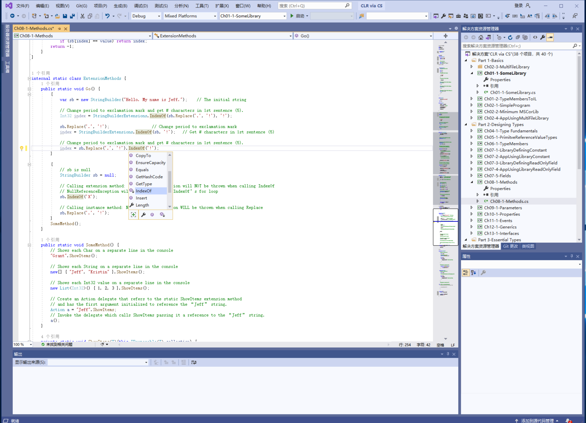

# 第 8 章 方法

本章内容：

* <a href="#8_1">实例构造器和类(引用类型)</a>
* <a href="#8_2">实例构造器和结构(值类型)</a>
* <a href="#8_3">类型构造器</a>
* <a href="#8_4">操作符重载方法</a>
* <a href="#8_5">转换操作符方法</a>
* <a href="#8_6">扩展方法</a>
* <a href="#8_7">分部方法</a>

本章重点讨论你将来可能遇到的各种方法，包括实例构造器和类型构造器。还会讲述如何定义方法来重载操作符和类型转换(以进行隐式和显示转型)。还会讨论扩展方法，以便将自己的实例在逻辑上“添加”到现在类型中。还会讨论分部方法，允许将类型的实现分散到多个组成部分中。

## <a name="8_1">8.1 实例构造器和类(引用类型)</a>

**构造器**是将类型的实例初始化为良好状态的特殊方法。构造器方法在“方法定义元数据表”中始终叫做 `.ctor`(constructor 的简称)。创建引用类型的实例时，首先为实例的数据字段分配内存，然后初始化对象的附加字段(类型对象指针和同步块索引)，最后调用类型的实例构造器来设置对象的初始状态。

> 这些附加的字段称为 overhead fields，“overhead”是开销的意思，意味着是创建对象时必须的“开销”。——译注

构造引用类型的对象时，在调用类型的实例构造器之前，为对象分配的内存总是先被归零。没有构造器显式重写的所有字段都保证获得 **0** 或 `null`值。

和其他方法不同，实例构造器永远不能被继承。也就是说，类只有类自己定义的实例构造器。由于永远不能继承实例构造器，所以实例构造器不能使用以下修饰符：`virtual`，`new`，`override`，`sealed` 和 `abstract`。如果类没有显式定义任何构造器，C#编译器将定义一个默认(无参)构造器。在它的实现中，只是简单地调用了基类的无参构造器。

例如下面这个类：

```C#
public class SomeType {
}
```

它等价于：

```C#
public class SomeType {
    public SomeType() : base() { }
}
```

如果类的修饰符为 `abstract`，那么编译器生成的默认构造器的可访问性就为 `protected`；否则，构造器会被赋予 `public` 可访问性。如果基类没有提供无参构造器，那么派生类必须显式调用一个基类构造器，否则编译器会报错。如果类的修饰符为`static`(`sealed` 和 `abstract`)，编译器根本不会在类的定义中生成默认构造器。

> 静态类在元数据中是抽象密封类。 —— 译注

一个类型可以定义多个实例构造器。每个构造器都必须有不同的签名，而且每个都可以有不同的可访问性。为了使代码"可验证"(verifiable)，类的实例构造器在访问从基类继承的任何字段之前，必须先调用基类的构造器。如果派生类的构造器没有显式调用一个基类构造器，C# 编译器会自动生成对默认的基类构造器的调用。最终，`System.Object` 的公共无参构造器会得到调用。该构造器什么都不做，会直接返回。由于 `System.Object` 没有定义实例数据字段，所以它的构造器无事可做。

极少数时候可以在不调用实例构造器的前提下创建类型的实例。一个典型的例子是 `Object` 的 `MemberwiseClone` 方法。该方法的作用是分配内存，初始化对象的附加字段(类型对象指针和同步块索引)，然后将源对象的字节数据复制到新对象中。另外，用运行时序列化器(runtime serializer)反序列化对象时，通常也不需要调用构造器。反序列化代码使用`System.Runtime.Serialization.FormatterServices`类型的`GetUninitializedObject`或者`GetSafeUninitializedObject`方法为对象分配内存，期间不会调用一个构造器。详情参见第 24 章“运行时序列化”。

> 重要提示 不要在构造器中调用虚方法。原因是假如被实例化的类型重写了虚方法，就会执行派生类型对虚方法的实现。但在这个时候，尚未完成对继承层次结构中的所有字段的初始化(被实例化的类型的构造器还没有运行呢)。所以，调用虚方法会导致无法预测的行为。归根到底，这是由于调用虚方法时，直到运行时之前都不会选择执行该方法的实际类型。

C# 语言用简单的语法在构造引用类型的实例时初始化类型中定义的字段：

```C#
internal sealed class SomeType {
    private Int32 m_x = 5;
}
```

构造 `SomeType` 的对象时，它的 `m_x` 字段被初始化为`5`。这是如何发生的呢？检查一下 `SomeType` 的构造器方法(也称作`.ctor`)的 IL 代码就明白了，如下所示：

```C#
.method public hidebysig specialname rtspecialname 
         instance void .ctor() cil managed
{
    // Code size 14 (0xe)
    .maxstack 8 
    IL_0000: ldarg.0 
    IL_0001: ldc.i4.5 
    IL_0002: stfld  int32 SomeType::m_x
    IL_0007: ldarg.0 
    IL_0008: call         instance void [mscorlib]System.Object::.ctor()
    IL_000d: ret
} // end of method SomeType::.ctor
```

可以看出，`SomeType`的构造器把值`5`存储到字段`m_x`，再调用基类的构造器。换句话说，C# 编译器提供了一个简化的语法，允许以“内联”(其实就是嵌入)方式初始化实例字段。但在幕后，它会将这种语法转换成构造器方法中的代码来执行初始化。这同时提醒我们注意代码的膨胀效应。如以下类定义所示：

```C#
internal sealed class SomeType {
    private Int32 m_x = 5;
    private String m_s = "Hi there"; 
    private Double m_d = 3.14159; 
    private Byte m_b;

    // 下面是一些构造器
    public SomeType() { ... }
    public SomeType(Int32 x) { ... }
    public SomeType(String s) { ...; m_d = 10; } 
} 
```

编译器为这三个构造器方法生成代码时，在每个方法的开始位置，都会包含用于初始化`m_x`，`m_s`和`m_d`的代码。在这些初始化代码之后，编译器会插入对基类构造器的调用。再然后，会插入构造器自己的代码。例如，对于获取一个`String`参数的构造器，编译器生成的代码首先初始化`m_x`，`m_s`和`m_d`，再调用基类(`Object`)的构造器，再执行自己的代码(最后是用值`10`覆盖`m_d`原先的值)。注意，即使没有代码显式初始化`m_b`，`m_b`也保证会被初始化为`0`。

> 注意 编译器在调用基类构造器前使用简化语法对所有字段进行初始化，以维持源代码给人留下的“这些字段总是有一个值”的印象。但假如基类构造器调用了虚方法并回调由派生类定义的方法，就可能出问题。在这种情况下，使用简化语法初始化的字段在调用虚方法之前就初始化好了。

由于有三个构造器，所以编译器生成三次初始化 `m_x`，`m_s` 和 `m_d` 的代码——每个构造器一次。如果有几个已初始化的实例字段和许多重载的构造器方法，可考虑不是在定义字段时初始化，而是创建单个构造器来执行这些公共的初始化。然后，让其他构造器都显式调用这个公共初始化构造器。这样能减少生成的代码。下例演示了如何在 C# 中利用 `this` 关键字显式调用另一个构造器：

```C#
using System;
internal sealed class SomeType {
    // 不要显式初始化下面的字段
    private Int32   m_x;
    private String  m_s;
    private Double  m_d;
    private Byte    m_b;

    // 该构造器将所有字段都设为默认值，
    // 其他所有构造器都显式调用该构造器
    public SomeType() {
        m_x = 5;
        m_s = "Hi there";
        m_d = 3.14159;
        m_b = 0xff;
    }

    // 该构造器将所有的字段都设为默认值，然后修改 m_x
    public SomeType(Int32 x) : this() {
        m_x = x;
    }

    // 该构造器所有的字段都设为默认值，然后修改 m_s
    public SomeType(String s) : this() {
        m_s = s;
    }

    // 该构造器首先将所有字段都设为默认值，然后修改 m_x 和 m_s
    public SomeType(Int32 x, String s) : this() {
        m_x = x;
        m_s = s;
    }
}
```

## <a name="8_2">8.2 实例构造器和结构(值类型)</a>

值类型(`struct`)构造器的工作方式与引用类型(`class`)的构造器截然不同。CLR 总是允许创建值类型的实例，并且没有办法阻止值类型的实例化。所以，值类型其实并不需要定义构造器，C#编译器根本不会为值类型内联(嵌入)默认的无参构造器。来看下面的代码：

```C#
internal struct Point {
    public Int32 m_x, m_y;
}

internal sealed class Rectangle {
    public Point m_topLeft, m_bottomRight;
}
```

为了构造一个 `Rectangle`，必须使用`new`操作符，而且必须指定构造器。在这个例子中，调用的是C#编译器自动生成的默认构造器。为 `Rectangle`分配内存时，内存中包含 `Point` 值类型的两个实例。考虑到性能，CLR 不会为包含子在引用类型中的每个值类型字段都主动调用构造器。但是，如前所述，值类型的字段会被初始化为 `0` 或 `null`。

CLR 确实允许为值类型定义构造器。但必须显示调用才会执行。下面是一个例子。

```C#
internal struct Point {
    public Int32 m_x, m_y;
    public Point(Int32 x, Int32 y) {
        m_x = x;
        m_y = y;
    }
}

internal sealed class Rectangle {
    public Point m_topLeft, m_bottomRight;

    public Rectangle() {
        m_topLeft = new Point(1, 2);
        m_bottomRight = new Point(100, 200);
    }
}
```

值类型的实例构造器只有显式调用才会执行。因此，如果 `Rectangle` 的构造器没有使用 `new` 操作符来调用 `Point` 的构造器，从而初始化 `Rectangle`的`m_topLeft`字段和`m_bottomRight`字段，那么两个`Point`字段中的`m_x`和`m_y`字段都将为 `0`。

前面展示的 `Point` 值类型没有定义默认的无参构造器。现在进行如下改写：

```C#
internal struct Point {
    public Int32 m_x, m_y;

    public Point() {
        m_x = m_y = 5;
    }
}

internal sealed class Rectangle {
    public Point m_topLeft, m_bottomRight;

    public Rectangle(){        
    }
}
```

现在，构造新的 `Rectangle` 类时，两个 `Point` 字段中的 `m_x`和`m_y`字段会被初始化成多少？是 `0`还是`5`？(提示：小心上当！)

许多开发人员(尤其是那些有 C++ 背景的)都觉得 C# 编译器会在 `Rectangle` 的构造器中生成代码，为 `Rectangle` 的两个字段自动调用 `Point` 的默认无参构造器。但是，为了增强应用程序的运行时性能，C# 编译器不会自动生成这样的代码。实际上，即便值类型提供了无参构造器，许多编译器也永远不会生成代码来自动调用它。为了执行值类型的无参构造器，开发人员必须增加显式调用值类型构造器的代码。

基于前面这一段的信息，可以确定在前面示例代码中，`Rectangle` 类的两个 `Point` 字段的 `m_x` 和 `m_y`字段会初始化为 `0`，因为代码中没有任何地方显式调用了 `Point`的构造器。

但我说过，这是一个容易让人上当的问题。这里的关键在于C#编译器不允许值类型定义无参构造器。所以，前面的代码实际是编译不了的。试图编译上述代码时，C#编译器会显示以下消息：`error CS0568:结构不能包含显式的无参数构造器。`

C#编译器故意不允许值类型定义无参构造器，目的是防止开发人员对这种构造器在什么时候调用产生迷惑。由于不能定义无参构造器，所以编译器永远不会生成自动调用它的代码。没有无参构造器，值类型的字段总是被初始化为 `0` 或 `null`。

> 注意 严格地说，只有当值类型的字段嵌套到引用类型中时，才保证被初始化为 0 或 `null`。基于栈的值类型字段则无此保证。但是，为了确保代码的“可验证性”(verifiability)，任何基于栈的值类型字段都必须在读取之前写入(赋值)。允许先读再写会造成安全漏洞。对于所有基于栈的值类型中的字段，C#和其他能生成“可验证”代码的编译器可以保证对它们进行“置零”，或至少保证在读取之前赋值，确保不会在运行时因验证失败而抛出异常。所以，你完全可以忽略本“注意”的内容，假定自己的值类型的字段都会被初始化为 0 或 `null`。

注意，虽然 C# 不允许值类型带有无参构造器，但 CLR 允许。所以，如果不在乎前面描述的问题，可以使用另一编程语言(比如 IL 汇编语言)定义带有无参构造器的值类型。

由于 C# 不允许为值类型定义无参构造器，所以编译以下类型时，C#编译器将显示消息：`error CS0573:"SomeValType.m_x":结构中不能有实例字段初始值设定项`。`ErrorCS0573 'SomeValType': cannot have instance property or field initializers in structs`

```C#
internal struct SomeValType {
    // 不能在值类型中内联实例字段的初始化
    private Int32 m_x = 5;
}
```

另外，为了生成“可验证”代码，在访问值类型的任何字段之前，都需要对全部字段进行赋值。所以，值类型的任何构造器都必须初始化的全部字段。以下类型为值类型定义了一个构造器，但没有初始化值类型的全部字段：

```C#
internal struct SomeValType {
    private Int32 m_x, m_y;

    // C# 允许为值类型定义有参构造器
    public SomeValType(Int32 x) {
        m_x = x;
        // 注意m_y 没有在这里初始化
    }
}
```

编译上述类型，C# 编译器会显示消息：`error CS0171：在控制返回到调用方之前，字段“SomeValType.m_y”必须完全赋值。` `Error CS0171 Field 'SomeValType.m_y' must be fully assigned before control is returned to the caller`。为了修正这个问题，需要再构造器中为 `m_y` 赋一个值(通常是`0`)。下面是对值类型的全部字段进行赋值的一个替代方案：

```C#
// C# 允许为值类型定义有参构造器
public SomeValType(Int32 x) {
    // 看起来很奇怪，但编译没问题，会将所有字段初始化为 0/null
    this = new SomeValType();

    m_x = x;  // 用 x 覆盖 m_x 的 0
    // 注意m_y 没有在这里初始化
}
```

在值类型的构造器中，`this` 代表值类型本身的一个实例，用`new`创建的值类型的一个实例可以赋给 `this`。在`new`的过程中，会将所有字段置为零。而在引用类型的构造器中，`this`被认为是只读的，所以不能对它进行赋值。

## <a name="8_3">8.3 类型构造器</a>

除了实例构造器，CLR 还支持类型构造器(type constructor)，也称为静态构造器(static constructor)、类构造器(class constructor)或者类型初始化器(type initializer)。类型构造器可应用于接口(虽然 C# 编译器不允许)、引用类型和值类型。实例构造器的作用是设置类型的实例的初始状态。对应地，类型构造器的作用是设置类型的初始状态。类型默认没有定义类型构造器。如果定义，也只能定义一个。此外，类型构造器永远没有参数。以下代码演示了如何在 C# 中为引用类型和值类型定义一个类型构造器：

```C#
internal sealed class SomeRefType {
    static SomeRefType() {
        // SomeRefType 被首次访问时，执行这里的代码
    }
}

internal struct SomeValType { 
    // C# 允许值类型定义无参的类型构造器
    static SomeValType() {
        // SomeValType 被首次访问时，执行这里的代码
    }
}
```

可以看出，定义类型构造器类似于定义无参实例构造器，区别在于必须标记为 `static`。此外，类型构造器总是私有；C# 自动把他们标记为 `private` 。事实上，如果在源代码中显式将类型构造器标记为 `private`(或其他访问修饰符)，C#编译器会显示以下消息：`error CS0515：静态构造函数中不允许出现访问修饰符`。之所以必须私有，是为了防止任何由开发人员写的代码调用它，对它的调用总是由CLR 负责。

类型构造器的调用比较麻烦。JIT 编译器在编译一个方法时，会查看代码中都引用了哪些类型。任何一个类型定义了类型构造器，JIT 编译器都会检查针对当前 `AppDomain`，是否已经执行了这个类型构造器。如果构造器从未执行，JIT 编译器会在它生成的本机(native)代码中添加对类型构造器的调用。如果类型构造器已经执行，JIT 编译器就不添加对它的调用，因为它知道类型已经初始化好了。

现在，当方法被 JIT 编译完毕之后，线程开始执行它，最终会执行到调用类型构造器的代码。事实上，多个线程可能同时执行相同的方法。CLR 希望确保在每个 AppDomain 中，一个类型构造器只执行一次。为了保证这一点，在调用类型构造器时，调用线程要获取一个互斥线程同步锁。这样一来，如果多个线程试图同时调用某个类型的静态构造器，只有一个线程才可以获得锁，其他线程会被阻塞(blocked)。第一个线程会执行静态构造器中的代码。当第一个线程离开构造器后，正在等待的线程将被唤醒，然后发现构造器的代码已被执行过。因此，这些线程不会再次执行代码，将直接从构造器方法返回。除此之外，如果再次调用这样的一个方法，CLR 知道类型构造器已被执行过，从而确保构造器不被再次调用。

> 重要提示 虽然能在值类型中定义类型构造器，但永远都不要真的那么做，因为 CLR 有时不会调用值类型的静态类型构造器。下面是一个例子：

```C#
internal struct SomeValType {
    static SomeValType() {
        Console.WriteLine("这句话永远不会显示");
    }
    public Int32 m_x;
}

public sealed class Program {
    public static void Main() {
        SomeValType[] a = new SomeValType[10];
        a[0].m_x = 123;
        Console.WriteLine(a[0].m_x);  // 显示 123
    }
}
```

> 注意 由于 CLR 保证一个类型构造器在每个 AppDomain 中执行一次，而且(这种执行)是线程安全的，所以非常适合在类型构造器中初始化类型需要的任何单实例(Singleton)对象。
>> 每个 AppDomain 只能有一个实例，这种类型就是单实例类型。——译注

单个线程中的两个类型构造器包含相互引用的代码可能出现问题。例如，假定 `ClassA` 的类型构造器包含了引用 `ClassB` 的代码，`ClassB` 的类型构造器包含了引用 `ClassA` 的代码。在这种情况下，CLR 仍然保证每个类型构造器的代码只被执行一次；但是，完全有可能再 `ClassA` 的类型构造器还没有执行完毕的前提下，就开始执行 `ClassB` 的类型构造器。因此，应尽量避免写会造成这种情况的代码。事实上，由于是 CLR 负责类型构造器的调用，所以任何代码都不应要求以特定的顺序调用类型构造器。

最后，如果类型构造器抛出未处理的异常，CLR 会认为类型不可用。试图访问该类型的任何字段或方法都会抛出 `System.TypeInitializationException` 异常。

类型构造器中的代码只能访问类型的静态字段，并且它的常规用途就是初始化这些字段。和实例字段一样，C# 提供了一个简单的语法来初始化类型的静态字段：

```C#
internal sealed class SomeType {
    private static Int32 s_x = 5;
}
```

> 注意 虽然 C# 不允许值类型为它的实例字段使用内联字段初始化语法，但可以为静态字段使用。换句话说，如果将前面定义的 `SomeType` 类型从 `class` 改为 `struct`，那么代码也能通过编译，而且会像你预期的那样工作。

生成上述代码时，编译器自动为 `SomeType` 生成一个类型构造器，好像源代码本来是这样写的：

```C#
internal sealed class SomeType {
    private static Int32 s_x;
    static SomeType() { s_x = 5; }
}
```

使用 ILDasm.exe 查看类型构造器的 IL，很容易验证编译器实际生成的东西。类型构造器方法总是叫 **.ctor**(代表 class constructor)。

在以下代码中，可以看到 `.ctor` 方法是 `private` 和 `static` 的。另外，注意方法中的代码确实将值 `5` 加载到静态字段 `s_x` 中。

```C#
.method private hidebysig specialname rtspecialname static
 void .cctor() cil managed
{
 // Code size 7 (0x7)
 .maxstack 8
 IL_0000: ldc.i4.5
 IL_0001: stsfld int32 SomeType::s_x
 IL_0006: ret
} // end of method SomeType::.cctor
```

类型构造器不应调用基类型的类型构造器。这种调用之所以没必要，是因为类型不可能有静态字段是从基类型分享或继承的。

> 注意 有的语言(比如 Java)希望在访问类型时自动调用它的类型构造器，并调用它的所有基类型的类型构造器。此外，类型实现的接口也必须调用接口的类型构造器。CLR 不支持这种行为。但是，使用由 `System.Runtime.CompilerServices.RuntimeHelpers` 提供的 `RunClassConstructor` 方法，编译器和开发人员可以实现这种行为。任何语言想要实现这种行为，可以告诉它的编译器在一个类型的类型构造器中生成代码，为所有基类型都调用这个方法，用 `RunClassConstructor` 方法调用一个类型构造器，CLR 就知道类型构造器之前是否执行过。如果是，CLR 不会再次调用它。

最后，假定有以下代码：

```C#
internal sealed class SomeType {
    private static Int32 s_x = 5;

    static SomeType {
        s_x = 10;
    }
}
```

在这个例子中，C# 编译器只生成一个类型构造器方法。它首先将 `s_x` 初始化为 `5`，再把它修改成 `10`。换言之，当 C# 编译器为类型构造器生成 IL 代码时，它首先生成的是初始化静态字段所需的代码，然后才会添加你的类型构造器方法中显式包含的代码。

> 重要提示 偶尔有开发人员问我，是否可以在卸载类型时执行一些代码。首先要搞清楚的是，类型只有在 AppDomain 卸载时才会卸载。AppDomain 卸载时，用于标识类型的对象(类型对象)将成为“不可达”的对象(不存在对它的引用)，垃圾回收器会回收类型对象的内存。这个行为导致许多开发人员认为可以为类型添加一个静态 `Finalize` 方法。当类型卸载时，就自动地调用这个方法。遗憾的是，CLR 并不支持静态 `Finalize` 方法。但也不是完全没有办法，要在 AppDomain 卸载时执行一些代码，可向 `System.AppDomain` 类型的 `DomainUnload` 事件登记一个回调方法。

## <a name="8_4">8.4 操作符重载方法</a>

有的语言允许类型定义操作符应该如何操作类型的实例。例如，许多类型(比如`System.String`)都重载了相等(==)和不等(!=)操作符。CLR 对操作符重载一无所知，它甚至不知道什么是操作符。是编程语言定义了每个操作符的含义，以及当这些特殊符号出现时，应该生成什么样的代码。

例如在 C# 中，向基元(类型的)数字应用+符号，编译器生成将两个数加到一起的代码。将+符号应用于`String` 对象，C# 编译器生成将两个字符串连接到一起的代码。测试不等性时，C# 使用!=符号，而 Microsoft Visual Basic 使用<>。最后，^在C#中的含义为异或(XOR)，在 Visual Basic 中则为求幂。

虽然 CLR 对操作符一无所知，但它确实规定了语言应如何公开操作符重载，以便由另一种语言的代码使用。每种编程语言都要自行决定是否支持操作符重载。如果决定支持，还要决定用什么语法来表示和使用它们。至于 CLR，操作符重载只是方法而已。

对编程语言的选择决定了你是否获得对操作符重载的支持，以及具体的语法是什么。编译源代码时，编译器会生成一个标识操作符行为的方法。CLR 规范要求操作符重载方法必须是 `public` 和 `static` 方法。另外，C# (以及其他许多语言)要求操作符重载方法至少有一个参数的类型与当前定义这个方法的类型相同。之所以要进行这样的限制，是为了使 C# 编译器能在合理的时间内找到要绑定的操作符方法。

以下 C# 代码展示了在一个类中定义的操作符重载方法：

```C#
public sealed class Complex {
    public static Complex operator+(Complex c1, Complex c2) { ... }
}
```

编译器为名为 `op_Addition` 的方法生成元数据方法定义项；这个方法定义项还设置了 `specialname` 标志，表明这是一个“特殊”方法。编程语言的编译器(包括 C# 编译器)看到源代码中出现一个`+`操作符时，会检查是否有一个操作数的类型定义了名为 `op_Addition` 的 `specialname` 方法，而且该方法的参数兼容于操作数的类型。如果存在这样的方法，编译器就生成调用它的代码。不存在这样的方法就报告编译错误。

表 8-1 和表 8-2 总结了 C# 允许重载的一元和二元操作符，以及由编译器生成的对应的 CLS(Common Language Specification，公共语言规范)方法名。下一节会解释表的第 3 列。

表 8-1 C# 的一元操作符及其相容于 CLS 的方法名
|C#操作符|特殊方法名|推荐的相容于 CLS 的方法名|
|:---:|:---:|:----:|
|`+`|`op_UnaryPlus`|`Plus`|
|`-`|`op_UnaryNegation`|`Negate`|
|`!`|`op_LogicalNot`|`Not`|
|`~`|`op_OnesComplement`|`OnesComplement`|
|`++`|`op_Increment`|`Increment`|
|`--`|`op_Decrement`|`Decrement`|
|(无)|`op_True`|`IsTrue { get; }`|
|(无)|`op_False`|`IsFalse { get; }`|

表 8-2 C# 的二元操作符及其相容于 CLS 的方法名
|C# 操作符|特殊方法名|推荐的相容性于 CLS 的方法名|
|:---:|:---:|:---:|
|`+`|`op_Addition`|`Add`|
|`-`|`op_Subtraction`|`Subtract`|
|`*`|`op_Multiply`|`Multiply`|
|`/`|`op_Division`|`Divide`|
|`%`|`op_Modulus`|`Mod`|
|`&`|`op_BitwiseAnd`|`BitwiseAnd`|
|`|`|`op_BitwiseOr`|`BitwiseOr`|
|`^`|`op_ExclusiveOr`|`Xor`|
|`<<`|`op_LeftShift`|`LeftShift`|
|`>>`|`op_RightShift`|`RightShift`|
|`==`|`op_Equality`|`Equals`|
|`!=`|`op_Inequality`|`Equals`|
|`<`|`op_LessThan`|`Compare`|
|`>`|`op_GreaterThan`|`Compare`|
|`<=`|`op_LessThanOrEqual`|`Compare`|
|`>=`|`op_GreaterThanOrEqual`|`Compare`|

CLR 规范定义了许多额外的可重载的操作符，但 C# 不支持这些额外的操作符。由于是非主流，所以此处不列出它们。如果对完整的列表感兴趣，请访问 CLI 的[ECMA 规范](www.ecma-international.org/publications/standards/Ecma-335.htm)(www.ecma-international.org/publications/standards/Ecma-335.htm)并阅读 Partition I：Concepts and Architecture 的 Section 10.3.1(一元操作符)和 Section 10.3.2(二元操作符)。

> 注意 检查 Framework 类库(FCL)的核心数值类型(`Int32`,`Int64`和`UInt32`等)，会发现它们没有定义任何操作符重载方法。之所以不定义，是因为编译器会(在代码中)专门查找针对这些基元类型执行的操作(运算)，并生成直接操作这些类型的实例的 IL指令。如果类型要提供方法，而且编译器要生成代码来调用这些方法，方法调用就会产生额外的运行时开销。另外，方法最终都要执行一些 IL 指令来完成你希望的操作。这正是核心 FCL 类型没有定义任何操作符重载方法的原因。对于开发人员，这意味着假如选择的编程语言不支持其中的某个 FCL 类型，便不能对该类型的实例执行任何操作。

### 操作符和编程语言互操作性

操作符重载是很有用的工具，允许开发人员用简洁的代码表达自己的想法。但并不是所有编程语言都支持操作符重载。使用不支持操作符重载的语言时，语言不知道如何解释`+`操作符(除非类型是该语言的基元类型)，编译器会报错。使用不支持操作符重载的编程语言时，语言应该允许你直接调用希望的 `op_*`方法(例如 `op_Addition`)。

如果语言不支持在类型中定义`+`操作符重载，这个类型仍然可能提供了一个 `op_Addition` 方法。在这种情况下，可不可以在 C# 中使用 `+` 操作符来调用这个 `op_Addition` 方法呢？答案是否定的。C# 编译器检测到操作符 `+`时，会查找关联了 `specialname` 元数据标志的 `op_Addition` 方法，以确定 `op_Addition`方法是要作为操作符重载方法使用。但由于现在这个 `op_Addition` 方法是由不支持操作符重载的编程语言生成的，所以方法没有关联`specialname`标记。因此，C# 编译器会报告编译错误。当然，用任何编程语言写的代码都以显式调用碰巧命名为 `op_Addition` 的方法，但编译器不会将一个`+`号的使用翻译成对这个方法的调用。

> 注意 FCL 的 System.Decimal 类型很好地演示了如何重载操作符并根据 Microsoft 的设计规范定义友好方法名。

> Microsoft 操作符方法的命名规则之我见  
> 操作符重载方法什么时候能调用，什么时候不能调用，这些规则会使人感觉非常迷惑。如果支持操作符重载的编译器不生成 `specialname` 元数据标记，规则会简单得多，而且开发人员使用提供了操作符重载方法的类型也会更轻松。支持操作符重载的语言都支持操作符符号语法，而且所有语言都支持显式调用各种`op_`方法。我不理解为什么 Microsoft 非要把它搞的这么复杂。希望 Microsoft 在编译器未来的版本中放宽这些限制。  
> 如果一个类型定义了操作符重载方法，Microsoft 还建议类型定义更友好的公共静态方法，并在这种方法的内部调用操作符重载方法。例如，根据 Microsoft 的设计规范，重载了 `op_Addition` 方法的类型应定义一个公共的、名字更友好的 `Add` 方法。表 8-1 和 表 8-2 中的第 3 列展示了每个操作符推荐使用的友好名称。因此，前面的示例类型 `Complex` 应该像下面这样定义：

```C#
public sealed class Complex {
    public static Complex operator+(Complex c1, Complex c2) { ... }
    public static Complex Add(Complex c1, Complex c2) { return(c1 + c2); }
}
```

> 用任何语言写的代码都能调用 `Add` 这样的友好操作符方法，这一点毋庸置疑。Microsoft 要求类型提供友好方法名的设计规范使局面进一步复杂化。在我看来，这种额外的复杂性完全没必要。而且，除非 JIT 编译器能内联(直接嵌入)友好方法的代码，否则调用它们将导致额外的性能损失。内联代码可使JIT编译器优化代码，移除额外的方法调用，并提升运行时性能。

## <a name="8_5">8.5 转换操作符方法</a>

有时需要将对象从一种类型转换为另一种类型(例如将 `Byte` 转换为 `Int32`)。当源类型和目标类型都是编译器识别的基元类型时，编译器自己就知道如何生成转换对象所需的代码。

如果源类型或目标类型不是基元类型，编译器会生成代码，要求 CLR 执行转换(强制转型)。这种情况下，CLR 只是检查源对象的类型和目标类型(或者从目标类型派生的其他类型)是不是相同。但有时需要将对象从一种类型转换成全然不同的其他类型。例如，`System.Xml.Linq.XElement` 类允许将 XML 元素转换成 `Boolean`，`(U)Int32`，`(U)Int64`，`Single`，`Double`，`Decimal`，`String`，`DateTime`，`DateTimeOffset`，`TimeSpan`，`Guid`或者所有这些类型(`String`除外)的可空版本。另外，假设 FCL 包含了一个 `Rational`(有理数)类型，那么如果能将 `Int32`或`Single`转换成`Rational` 会显得很方便；反之亦然。

为了进行这样的转换，`Rational` 类型应该定义只有一个参数的公共构造器，该参数要求是源类型的实例。还应该定义无参的公共实例方法 `ToXxx`(类似于你熟悉的`ToString`方法)，每个方法都将*定义类型*的实例转换成 `Xxx`类型。以下代码展示了如何为 `Rational` 类型正确定义转换构造器和方法。
>定义该方法的类型。——译注

```C#
public sealed class Rational {
    // 由一个 Int32 构造一个 Rational
    public Rational(Int32 num) { ... }

    // 由一个 Single 构造一个 Rational
    public Rational(Single num) { ... }

    // 将一个 Rational 转换成一个 Int32
    public Int32 ToInt32() { ... }

    // 将一个 Rational 转换成一个 Single
    public Single ToSingle() { ... }
}
```

调用这些构造器和方法，使用任何编程语言的开发人员都能将 `Int32` 或 `Single` 对象转换成 `Rational` 对象，反之亦然。这些转换能给编程带来很多方便。设计类型时，应认真考虑类型需要支持的转换构造器和方法。

上一节讨论了某些编程语言如何提供操作符重载。事实上，有些编程语言(比如 C#)还提供了转换操作符重载。**转换操作符**是将对象从一种类型转换成另一种类型的方法。可以使用特殊的语言来定义转换操作符方法。CLR 规范要求转换操作符重载方法必须是 `public` 和 `static` 方法。此外，C#(以及其他许多语言)要求参数类型和返回类型二者必有其一与定义转换方法的类型相同。之所以要进行这个限制，是为了使 C# 编译器能在一个合理的时间内找到要绑定的操作符方法。以下代码为 `Rational` 类型添加了 4 个转换操作符方法：

```C#
public sealed class Rational {
    // 由一个 Int32 构造一个 Rational
    public Rational(Int32 num) { ... }

    // 由一个 Single 构造一个 Rational
    public Rational(Single num) { ... }

    // 将一个 Rational 转换成一个 Int32
    public Int32 ToInt32() { ... }

    // 将一个 Rational 转换成一个 Single
    public Single ToSingle() { ... }

    // 由一个 Int32 隐式构造并返回一个 Rational
    public static implicit operator Rational(Int32 num) {
        return new Rational(num);
    }

    // 由一个 Single 隐式构造并返回一个 Rational
    public static implicit operator Rational(Single num) {
        return new Rational(num);
    }

    // 由一个 Rational 显式返回一个 Int32
    public static explicit operator Int32(Rational r) {
        return r.ToInt32();
    }

    // 由一个 Rational 显式返回一个 Single
    public static explicit operator Single(Rational r) {
        return r.ToSingle();
    }
}
```

对于转换操作符方法，编译器既可生成代码来隐式调用转换操作符方法，也可只有在源代码进行了显式转型时才生成代码来调用转换操作符方法。在 C# 中，`implicit` 关键字告诉编译器为了生成代码来调用方法，不需要在源代码中进行显式转型。相反， `explicit` 关键字告诉编译器只有在发现了显式转型时，才调用方法。

在 `implicit` 或 `explicit` 关键字之后，要指定 `operator` 关键字告诉编译器该方法是一个转换操作符。在 `operator` 之后，指定对象要转换成什么类型。在圆括号内，则指定要从什么类型转换。

像前面那样为 `Rational` 类型定义了转换操作符之后，就可以写出像下面这样的 C# 代码：

```C#
public sealed class Program {
    public static void Main() {
        Rational r1 = 5;        // Int32 隐式转型为 Rational
        Rational r2 = 2.5F;     // Single 隐式转型为 Rational

        Int32 x = (Int32) r1;   // Rational 显式转型为 Int32
        Single s = (Single) r2; // Rational 显式转型为 Single
    }
}
```

在幕后，C# 编译器检测到代码中的转型，并内部生成 IL 代码来调用 `Rational` 类型定义的转换操作符方法。现在的问题是，这些方法的名称是什么？编译 `Rational` 类型并查看元数据，会发现编译器为定义的每个转换操作符都生成了一个方法。`Rational` 类型的4个转换操作符方法的元数据如下：

```C#
public static Rational op_Implicit(Int32 num);
public static Rational op_Implicit(Single num);
public static Int32    op_Explicit(Rational r);
public static Single   op_Explicit(Rational r);
```

可以看出，将对象从一种类型转换成另一种类型的方法总是叫做 `op_Implicit` 或者 `op_Explicit`。只有在转换不损失精度或数量级的前提下(比如讲个 `Int32`转换成`Rational`)，才能定义隐式转换操作符。如果转换会造成精度或数量级的损失(比如将 `Rational` 转换成 `Int32`)，就应该定义一个显式转换操作符。显式转换失败，应该让显式转换操作符方法抛出 `OverflowException`或者`InvalidOperationException`异常。
> 注意 两个`op_Explicit` 方法获取相同的参数，也就是一个 `Rational`。但两个方法的返回类型不同，一个是 `Int32`，另一个是`Single`。这是仅凭返回类型来区分两个方法的例子。CLR 允许在一个类型中定义仅返回类型不同的多个方法。但只有极少数语言支持这个能力。你可能已经注意到了，C++，C#，Visual Basic 和Java语言都不允许在一个类型中定义仅返回类型不同的多个方法。个别语言(比如IL汇编语言)允许开发人员显式选择调用其中哪一个方法。当然，IL 汇编语言的程序员不应利用这个能力，否则定义的方法无法从其他语言中调用。虽然 C# 语言没有向 C#程序员公开这个能力，但当一个类型定义了转换操作符方法时，C#编译器会在内部利用这个能力。

C# 编译器提供了对转换操作符的完全支持。如果检测到代码中正在使用某个类型的对象，但实际期望的是另一种类型的对象，编译器就会查找能执行这种转换的隐式转换操作符方法，并生成代码来调用该方法。如果存在隐式转换操作符方法，编译器会在结果IL 代码中生成对它的调用。如果编译器看到源代码是将对象从一种类型显式转换为另一种类型，就会查找能执行这种转换的隐式或显式转换操作符方法。如果找到一个，编译器就生成 IL 代码来调用它。如果没有找到合适的转换操作符方法，就报错并停止编译。
> 注意 使用强制类型转换表达式时，C# 生成代码来调用显式转换操作符方法。使用 C# 的 `as` 和 `is` 操作符时，则永远不会调用这些方法。(参见4.2节。)

为了真正理解操作符重载方法和转换操作符方法，强烈建议将`System.Decimal` 类型作为典型来研究。`Decimal` 定义了几个构造器，允许将对象从各种类型转换为 `Decimal`。还定义了几个 `ToXxx` 方法，允许将`Decimal` 转换成其他类型。最后，`Decimal`类型还定义了几个转换操作符方法和操作符重载方法。

## <a name="8_6">8.6 扩展方法</a>

理解 C# **扩展方法**最好的办法就是从例子中学习。14.3.2 节 “`StringBuilder` 成员”会提到 `StringBuilder` 类提供的字符串处理方法比`String`类少。这是很奇怪的一件事，`StringBuilder`类是可变的(mutable)，所以它应该是进行字符串处理的首选方式。现在，假定你想自己定义一些缺失的方法以方便操作`StringBuilder`。例如，你也许想定义以下`IndexOf` 方法：

```C#
public static class StringBuilderExtensions {
    public static Int32 IndexOf(StringBuilder sb,Char value) {
        for (Int32 index = =0; index < sb.Length; index++)
            if(sb[index] == value) return index;
        return -1
    }
}
```

定义好这个方法后，可以在代码中使用它，如下所示：

```C#
StringBuilder sb = new StringBuilder("Hello.My name is Jeff.");     // 初始字符串

// 将句点更改为感叹号，获取!字符的索引(5)
Int32 index = StringBuilderExtensions.IndexOf(sb.Replace('.', '!'), '!');
```

上述代码工作起来没问题，但从程序员的角度看不理想。第一个问题是，要获取一个 `StringBuilder` 中的某个字符的索引，必须先知道 `StringBuilderExtensions` 类的存在。第二个问题是，代码没有反映出在 `StringBuilder` 对象上执行的操作的顺序，使代码很难写、读和维护。程序员希望先调用 `Replace`，再调用 `IndexOf` 。但从左向右读最后一行代码，先看到的是 `IndexOf`，然后才看到 `Replace`。当然，可以像下面这样重写，使代码的行为看起来更容易理解：

```C#
// 首先，将句点更改成感叹号
sb.Replace('.', '!');

// 接着，获取!字符的索引(5)
Int32 index = StringBuilderExtensions.IndexOf(sb, '!');
```

但这两个版本都存在另一个不容忽视的问题，它影响了我们对代码行为的理解。使用 `StringBuilderExtensions` 显得“小题大做”，造成程序员无法专注于当前要执行的操作： `IndexOf` 方法，上述代码就可以重写为：

```C#
// 把句点更改为感叹号，获取!字符的索引(5)
Int32 index = sb.Replace('.', '!').IndexOf('!');
```

哇，是不是立刻就显得高端大气上档次了？一眼就能看出在 `StringBuilder` 对象中，是先将句点更改为感叹号，再获取感叹号的索引。

有了这个例子作为铺垫，就很容易理解C# 扩展方法的意义了。它允许定义一个静态方法，并用实例方法的语法来调用。换言之，现在既能定义自己的 `IndexOf` 方法，又能避免上述三个问题。要将 `IndexOf` 方法转变成扩展方法，只需在第一个参数前添加 `this` 关键字：

```C#
public static class StringBuilderExtensions {
    public static Int32 IndexOf(this StringBuilder sb,Char value) {
        for (Int32 index = =0; index < sb.Length; index++)
            if(sb[index] == value) return index;
        return -1
    }
}
```

现在，当编译器看到以下代码：

```C#
Int32 index = sb.IndexOf('X');
```

就首先检查 `StringBuilder` 类或者它的任何基类是否提供了获取单个 `Char` 参数、名为 `IndexOf` 的一个实例方法。如果是，就生成 IL 代码来调用它。如果没有找到匹配的实例方法，就继续检查是否有任何静态类定义了名为 `IndexOf` 的静态方法，方法的第一个参数的类型和当前用于调用方法的那个表达式的类型匹配，而且该类型必须用 `this` 关键字标识。在本例中，表达式是 `sb`，类型是 `StringBuilder`。所以编译器会查找一个 `IndexOf` 方法，它有两个参数：一个 `StingBuilder`(用`this`关键字标记)，以及一个 `Char`。编译器找到了这个 `IndexOf` 方法，所以生成相应的 IL 代码来调用这个静态方法。

OK——这解释了编译器如何解决前面提到的、会影响代码理解的最后两个问题。但是，还没有说第一个问题是如何解决的：程序员怎么知道有这样的一个 `IndexOf` 方法，可以用它操作 `StringBuilder` 对象呢？这个问题是通过 Microsoft Visual Studio 的“智能感知”功能来解决的。在编辑器中输入句点符号，会弹出 Visual Studio 的“智能感知”窗口，列出当前可用的实例方法。现在，这个窗口还会列出可作用于句点左侧表达式类型的扩展方法。图 8-1 展示了 Visual Studio 的“智能感知”窗口；扩展方法的图标中有一个下箭头，方法旁边的“工具提示”表明该方法实际是一个扩展方法。这是相当实用的一个功能，因为现在可以轻松定义自己的方法来操作各种类型，其他程序员在使用这些类型的对象时，也能轻松地发现你的方法。  

  
图 8-1 Visual Studio 的“智能感知”窗口能列出扩展方法  

### 8.6.1 规则和原则

关于扩展方法，有一些附加的规则和原则需要注意。

* C# 只支持扩展方法，不支持扩展属性、扩展事件、扩展操作符等。

* 扩展方法(第一个参数前面有 `this` 的方法)必须在非泛型的静态类中声明。然后，类名没有限制，可以随便叫什么名字。当然，扩展方法至少要有一个参数，而且只有第一个参数能用 `this` 关键字标记。

* C#编译器在静态类中查找扩展方法时，要求静态类本身必须具有文件作用域。如果静态类嵌套在另一个类中，C# 编译器显示以下消息：`error CS1109:扩展方法必须在顶级静态类中定义；StringBuilderExtensions 是嵌套类`。
> 类要具有整个文件的作用域，而不能嵌套在某个类中而只具有该类的作用域。 ——译注

* 由于静态类可以取任何名字，所以 C# 编译器要花一定时间来寻找扩展方法，它必须检查文件作用域中的所有静态类，并扫描它们的所有静态方法来查找一个匹配。为增强性能，并避免找到非你所愿的扩展方法，C# 编译器要求“导入”扩展方法。例如，如果有人在 `Wintellect` 命名空间中定义了一个 `StringBuilderExtensions` 类，那么程序员为了访问这个类的扩展方法，必须在他的源代码文件顶部写一条 `using Wintellect;`指令。

* 多个静态类可以定义相同的扩展方法。如果编译器检测到存在两个或多个扩展方法，就会显示以下消息：`error CS0121:在以下方法或属性之间的调用不明确："StringBuilderExtensions.IndexOf(string, char)"和"AnotherStringBuilderExtensions.IndexOf(string, char)"`。修正这个错误必须修改源代码。具体地说，不能再用实例方法语法来调用这个静态方法。相反，必须使用静态方法语法。换言之，必须显式指定静态类的名称，明确告诉编译器要调用哪个方法。

* 使用这个功能须谨慎，一个原因是并非所有程序员都熟悉它。例如，用一个扩展方法扩展一个类型时，同时也扩展了派生类型。所以，不要将 `System.Object` 作为扩展方法的第一个参数，否则这个方法在所有表达式类型上都能调用，造成 Visual Studio 的“智能感知”窗口被填充太多垃圾信息。

* 扩展方法可能存在版本控制问题。如果 Microsoft 未来为他们的 `StringBuilder` 类添加了 `IndexOf` 实例方法，而且和我的代码调用的原型一样，那么在重新编译我的代码时，编译器会绑定到 Microsoft 的 `IndexOf`实例方法，而不是我的静态 `IndexOf` 方法。这样我的程序就会有不同的行为。版本控制问题是使用扩展方法须谨慎的另一个原因。

### 8.6.2 用扩展方法扩展各种类型

前面演示了如何为 `StringBuilder` 类定义扩展方法。我要指出的一个问题是，由于扩展方法实际是对一个静态方法的调用，所以 CLR 不会生成代码对调用方法的表达式的值进行 `null` 值检查(不保证它非空)：

```C#
// sb 是 null
StringBuilder sb = null；

// 调用扩展方法： NullReferenceException 异常不会在调用 IndexOf 时抛出，
// 相反，NullReferenceException 是在 IndexOf 内部的 for 循环中抛出的
sb.IndexOf('X');

// 调用实例方法： NullReferenceException 异常在调用 Replace 时抛出
sb.Replace('.', '!');
```

还要注意，可以为接口类型定义扩展方法，如下所示：

```C#
public static void ShowItems<T>(this IEnumerable<T> collection) {
    foreach (var item in collection)
        Console.WriteLine(item);
}
```

任何表达式，只要它最终的类型实现了 `IEnumerable<T>` 接口，就能调用上述扩展方法：

```C#
public static void Main() {
    // 每个 Char 在控制台上单独显示一行
    "Grant".ShowItems();

    // 每个 String 在控制台上单独显示一行
    new[] { "Jeff", "Kristin" }.ShowItems();

    // 每个 Int32 在控制台上单独显示一行
    new List<Int32>() { 1, 2, 3 }.ShowItems(); 
}
```

> 重要提示 扩展方法是 Microsoft 的 LINQ(**Language Integrated Query**，语言集成查询)技术的基础。要想仔细研究提供了许多扩展方法的一个典型的类，请自行在文档中查看静态类 `System.Linq.Enumerable` 及其所有静态扩展方法。这个类中的每个扩展方法都扩展了 `IEnumerable` 或 `IEnumerable<T>`接口。

还可为委托类型定义扩展方法，如下所示：

```C#
public static void InvokeAndCatch<TException>(this Action<Object> d,Object o)
    where TException : Exception {
        try { d(o); }
        catch (TException) { }
    }
```

下面演示了如何调用它：

```C#
Action<Object> action = o => Concole.WriteLine(o.GetType());    // 抛出 NullReferenceException
action.InvokeAndCatch<NullReferenceException>(null)；           // 吞噬 NullReferenceException 
```

还可为枚举类型添加扩展方法(15.3 节“向枚举类型添加方法”展示了一个例子)。

最后，C# 编译器允许创建委托(参见第 17 章“委托”)来引用一个对象上的扩展方法：

```C#
public static void Main () {
    // 创建一个 Action 委托(实例)来引用静态 ShowItems 扩展方法，
    // 并初始化第一个实参来引用字符串 “Jeff”
    Action a  = "Jeff".ShowItems;
    .
    .
    .
    // 调用(Invoke)委托，后者调用(call) ShowItems，
    // 并向它传递对字符串"Jeff"的引用
    a();
} 
```

> “调用一个委托实例”中的“调用”对应的是 invoke，理解为“唤出”更恰当。它和后面的“在一个对象上调用方法”中的“调用”稍有不同，后者对应的是 call。在英语的语境中，invoke 和 call 的区别在于，在执行一个所有信息都已知的方法时，用 call 比较恰当。这些信息包括要引用的类型，方法的签名以及方法名。但是，在需要先“唤出”某个东西来帮你调用一个信息不明的方法时，用 invoke 就比较恰当。但是，由于两者均翻译为“调用”不会对读者的理解造成太大的困扰，所以本书仍然采用约定俗成的方式来进行翻译，只是在必要的时候附加英文原文提醒你区分。 —— 译注

在上述代码中，C# 编译器生成 IL 代码来构造一个 `Action` 委托。创建委托时，会向构造器传递应调用的方法，同时传递一个对象引用，这个引用应传给方法的隐藏 `this` 参数。正常情况下，创建引用静态方法的委托时，对象引用是 `null`，因为静态方法没有 `this` 参数。但在这个例子中，C# 编译器生成特殊代码创建一个委托来引用静态方法(`ShowItems`)，而静态方法的目标对象是对`"Jeff"`字符串的引用。稍后，当这个委托被调用(`invoke`)时，CLR会调用(`call`)静态方法，并向其传递对`"Jeff"`字符串的引用。这是编译器耍的小“花招”，但效果不错，而且只要你不去细想内部发生的事情，整个过程还是感觉非常自然的。

### 8.6.3 ExtensionAttribute 类

扩展方法的概念要不是 C# 特有的就好了！具体地说，我们希望程序员能用一种编程语言定义一组扩展方法，并让其他语言的程序员利用它们。要实现这一点，选择的编译器必须能够搜索静态类型和方法来寻找匹配的扩展方法。另外，速度慢了还不行。编译器必须快速完成上述搜索，将编译时间控制在合理范围内。

在 C# 中，一旦用 `this` 关键字标记了某个静态方法的第一个参数，编译器就会在内部向该方法应用一个定制特性。该特性会在最终生成的文件的元数据中持久性地存储下来。该特性在 `System.Core.dll` 程序集中定义，它看起来像下面这样：

```C#
// 在 System.Runtime.CompilerServices 命名空间中定义
[AttributeUsage(AttributeTargets.Method | AttributeTargets.Class | AttributeTargets.Assembly)]
public sealed class ExtensionAttribute : Attribute { } 
```

除此之外，任何静态类只要包含至少一个扩展方法，它的元数据中也会应用这个特性。类似地，任何程序集只要包含了至少一个符合上述特点的静态类，它的元数据中也会应用这个特性。这样一来，如果代码调用了一个不存在的实例方法，编译器就能快速扫描引用的所有程序集，判断它们哪些包含了扩展方法。然后，在这些程序集中，可以只扫描包含了扩展方法的静态类。在每个这样的静态类中，可以只扫描扩展方法来查找匹配。利用这个技术，代码能以最快速度编译完毕。

## <a name="8_7">8.7 分部方法</a>

假定用某个工具生成了包含类型定义的 C# 源代码文件，工具知道你想在代码的某些位置定制类型的行为。正常情况下，是让工具生成的代码调用虚方法来进行定制。工具生成的代码还必须包含虚方法的定义。另外，这些方法的实现是什么事情都不做，直接返回了事。现在，如果想定制类的行为，就必须从基类派生并定义自己的类，重写虚方法来实现自己想要的行为。下面是一个例子：

```C#
// 工具生成的代码，存储在某个源代码文件中：
internal class Base {
    private String m_name;

    // 在更改 m_name 字段前调用
    protected virtual void OnNameChanging(String value) { 
    }

    public String Name {
        get { return m_name; }
        set {
            OnNameChanging(value.ToUpper());        // 告诉类要进行更改了
            m_name = value;                         // 更改字段
        }
    }
}

// 开发人员生成的代码，存储在另一个源代码文件中：
internal class Derived : Base {
    protected override void OnNameChanging(string value) {
        if (String.IsNullOrEmpty(value))
            throw new ArgumentNullException("value");
    }
}
```

遗憾的是，上述代码存在两个问题。

* 类型必须是非密封的类。这个技术不可能用于密封类，也不能用于值类型(值类型隐式密封)。此外，这个技术不能用于静态方法，因为静态方法不能重写。

* 效率问题。定义一个类型只是为了重写一个方法，这会浪费少量系统资源。另外，即使不想重写 `OnNameChanging` 的行为，基类代码仍需调用一个什么都不做、直接就返回的虚方法。另外，无论 `OnNameChanging` 是否访问传给它的实参，编译器都会生成对 `ToUpper` 进行调用的 IL 代码。

利用 C# 的**分部方法**功能，可以在解决上述问题的同时覆盖类的行为。以下代码使用分部方法实现和上述代码完全一样的语义：

```C#
// 工具生成的代码，存储在某个源代码文件中：
internal sealed partial class Base {
    private String m_name;

    // 这是分部方法的声明
    partial void OnNameChanging(String value);

    public String Name {
        get { return m_name; }
        set {
            OnNameChanging(value.ToUpper());        // 通知类要进行更改了
            m_name = value;                         // 更改字段
        }
    }
}

// 开发人员生成的代码，存储在另一个源代码文件中：
internal sealed partial class Base {
    
    // 这是分部方法的实现，会在 m_name 更改前调用 
    partial void OnNameChanging(string value) {
        if (String.IsNullOrEmpty(value))
            throw new ArgumentNullException("value");
    }
}
```

这个新版本要注意以下几个问题。

* 类现在密封(虽然并非一定如此)。事实上，类可以是静态类，甚至可以是值类型。

* 工具和开发者所生成的代码真的是一个类型定义的两个部分。要更多地了解分部类型，请参见 6.5 节“分部类、结构和接口”。

* 工具生成的代码包含分部方法的声明。要用 `partial` 关键字标记，无主体。

* 开发者生成的代码实现这个声明。该方法也要用 `partial` 关键字标记，有主体。

编译上述代码后，可以获得和原始代码一样的效果。现在的好处在于，可以重新运行工具，在新的源代码文件中生成新的代码，但你自己的代码是存储在一个单独的文件中的，不会受到影响。另外，这个技术可用于密封类、静态类以及值类型。
> 注意 在 Visual Studio 编辑器中，如果输入 `partial` 并按空格键，“智能感知”窗口会列出当前类型定义的、还没有匹配实现的所有分部方法声明。可以方便地从窗口中选择一个分部方法。然后，Visual Studio 会自动生成方法原型。这个功能提高了编程效率。

但是，分部方法还提供了另一个巨大的提升。如果不想修改工具生成的类型的行为，那么根本不需要提供自己的源代码文件。如果只是对工具生成的代码进行编译，编译器会改变生成的 IL 代码和元数据，使工具生成的代码看起来变成下面这样：

```C#
// 如果没有分部方法的“实现”方法，
// 工具生成的代码在逻辑上就等价于下面的代码。
internal sealed partial class Base {
    private String m_name;

    public String Name  {
        get { return m_name; }
        set {
            m_name = value;    // 更改字段
        }
    }
}
```

也就是说，如果没有实现分部方法，编译器不会生成任何代表部分方法的元数据。此外，编译器不会生成任何调用分部方法的 IL 指令。而且，编译器不会生成对本该传给分部方法的实参进行求值的 IL 指令。在这个例子中，编译器不会生成调用 `ToUpper` 方法的代码。结果就是更少的元数据/IL，运行时的性能得到了提升。

> 注意 分部方法的工作方式类似于 `System.Diagnostics.ConditionalAttribute` 特性。然而，分部方法只能在单个类型中使用，而 `ConditionalAttribute` 能用于对另一个类型中定义的方法进行有选择的调用。

#### 规则和原则

关于分部方法，有一些附加的规则和原则需要注意。

* 它们只能在分部类或结构中声明。

* 分部方法的返回类型始终是 `void`，任何参数都不能用`out`修饰符来标记。之所以有这两个限制，是因为方法在运行时可能不存在，所以不能将变量初始化为方法也许会返回的东西。类似地，不允许 `out` 参数是因为方法必须初始化它，而方法可能不存在。分部方法可以有 `ref` 参数，可以是泛型方法，可以是实例或静态方法，而且可标记为`unsafe`。

* 当然，分部方法的声明和实现必须具有完全一致的签名。如果两者都应了定制特性，编译器会合并两个方法的特性。应用于参数的任何特性也会合并。

* 如果没有对应的实现部分，便不能在代码中创建一个委托来引用这个分部方法。这同样是由于方法在运行时不存在。编译器报告以下消息：`error CS0762:无法通过方法“Base.OnNameChanging(string)”创建委托，因为该方法是没有实现声明的分部方法。`

* 分部方法总是被视为 `private` 方法，但 C# 编译器禁止在分部方法声明之前添加 `private` 关键字。

