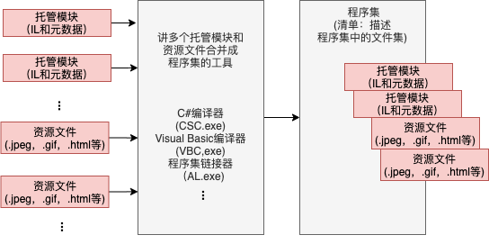
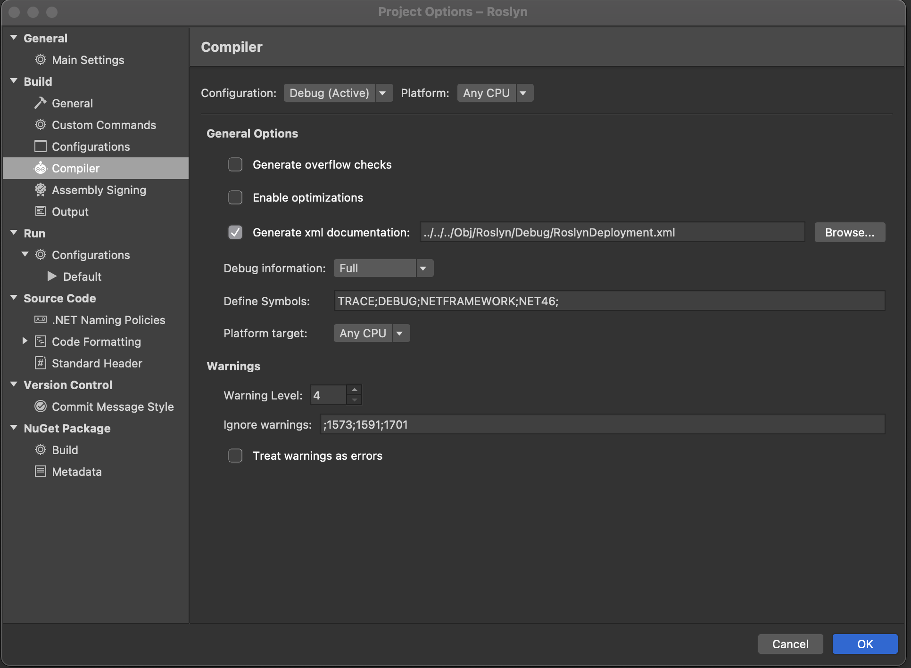
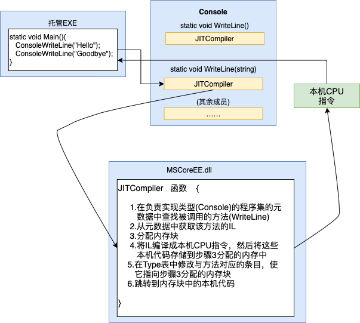
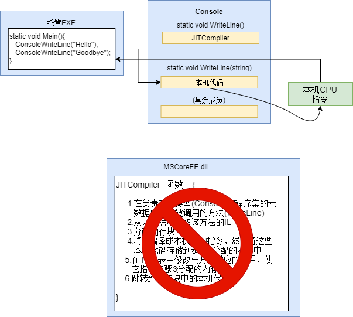
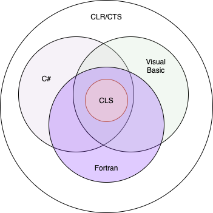
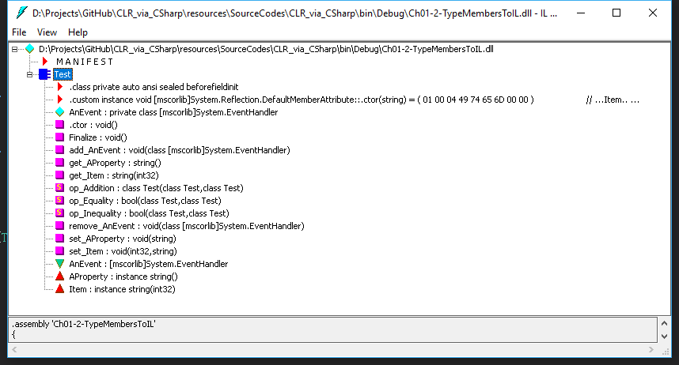

# 第一章 CLR的执行模型
本章内容：  
* <a href="#1_1">将源代码编译成托管模块</a>
* <a href=”#1_2“>将托管模块合并成程序集</a>
* <a href="#1_3">加载公共语言运行时</a>
* <a href="#1_4">执行程序集的代码</a>
* <a href="#1_5">本机代码生成器：NGen.exe</a>
* <a href="#1_6">Framework类库入门</a>
* <a href="#1_7">通用类型系统</a>
* <a href="#1_8">公共语言规范（CLS）</a>
* <a href="#1_9">与非托管代码的互操作性</a>

Microsoft .NET Framework引入许多新概念、技术和术语。本章概述了.NET Framework如何设计，介绍了Framework包含的一些新技术，并定义了今后要用到的许多术语。还要展示如何将源代码生成为一个应用程序，或者生成为一组可重新分发的组件(文件)——这些组件(文件)中包含类型(类和结构等)。最后，本章解释了应用程序如何执行。

## <a name="1_1">1.1 将源代码编译成托管模块</a>
决定将.NET Framework作为自己的开发平台之后，第一步便是决定要生成什么类型的应用程序或组件。假定你已完成了这个小细节；一切均已合计好，规范已经写好，可以着手开发了。

现在，必须决定要使用哪一种编程语言。这通常是一个艰难的抉择，因为不同的语言各有长处。例如，非托管C/C++可对系统进行低级控制。可完全按自己的想法管理内存，必要时能方便地创建线程。另一方面，使用Microsoft Visual Basic 6.0可以快速生成UI应用程序，并可以方便地控制COM对象和数据库。

顾名思义，**公共语言运行时(Common Language Runtime，CLR)**是一个可由多种编程语言使用的“运行时”。CLR的核心功能(比如内存管理、程序集加载、安全性、异常处理和线程同步)可由面向CLR的所有语言使用。例如，“运行时”使用异常来报告错误;因此，面向它的任何语言都能通过异常来报告错误。另外，“运行时”允许创建线程，所以面向它的任何语言都能创建线程。
> CLR 早期文档中翻译为“公共语言运行库”，但“库”一词很容易让人误解，所以本书翻译为“公共语言运行时”，或简称为“运行时”。为了和“程序运行的时候”区分，“运行时”在作为名词时会添加引号。 ——译注

事实上，在运行时，CLR根本不关心开发人员用哪一种语言写源代码。这意味着在选择编程语言时，应选择最容易表达自己意图的语言。可用任何编程语言开发代码，只要编译器是面向CLR的。

既然如此，不同编程语言的优势何在呢？事实上，可将编译器视为语法检查器和“正确代码”分析器。它们检测源代码，确定你写的一切都有意义，并输出对你的意图进行描述的代码。不同编程语言允许用不同的语法来开发。不要低估这个选择的价值。例如，对于数学和金融应用程序，使用[APL语法](https://baike.baidu.com/item/APL语言标准)来表达自己的意图，相较于使用[Perl](https://www.perl.org/)语法来表达同样的意图，可以节省许多开发时间。

Microsoft 创建好了几个面向“运行时”的语言编译器，其中包括：C++/[CLI](https://baike.baidu.com/item/%E5%91%BD%E4%BB%A4%E8%A1%8C%E7%95%8C%E9%9D%A2/9910197?fromtitle=CLI&fromid=2898851&fr=aladdin)、C#(发音是“C sharp”)、Visual Basic、F#(发音是“F sharp”)、[Iron Python](https://ironpython.net/)、[Iron Ruby](http://ironruby.net/)以及一个[“中间语言”(Intermediate Language,IL)](https://baike.baidu.com/item/%E4%B8%AD%E9%97%B4%E8%AF%AD%E8%A8%80/3784203?fromtitle=IL&fromid=2748286&fr=aladdin)汇编器。除了Microsoft，另一些公司、学院和大学也创建了自己的编译器，也能面向CLR生成代码。我所知道的有针对下列语言的编译器：[Ada](https://baike.baidu.com/item/Ada/5606819),APL,[Caml](http://caml.inria.fr/),[COBOL](https://baike.baidu.com/item/COBOL%E8%AF%AD%E8%A8%80/12789101?fromtitle=COBOL&fromid=1641359&fr=aladdin),[Eiffel](https://baike.baidu.com/item/Eiffel/10445704?fr=aladdin),[Forth](https://baike.baidu.com/item/Forth%E8%AF%AD%E8%A8%80/5598633?fr=aladdin),[Fortran](https://baike.baidu.com/item/FORTRAN%E8%AF%AD%E8%A8%80/295590?fr=aladdin),[Haskell](https://baike.baidu.com/item/Haskell/1152799?fr=aladdin),Lexico,[LISP](https://baike.baidu.com/item/lisp%E8%AF%AD%E8%A8%80/2840299?fr=aladdin),[LOGO](https://baike.baidu.com/item/LOGO%E8%AF%AD%E8%A8%80/5881905?fr=aladdin),[Lua](https://baike.baidu.com/item/lua/7570719?fr=aladdin),[Mercury](https://baike.baidu.com/item/mercury/19275312?fr=aladdin),[ML](https://baike.baidu.com/item/ML%E8%AF%AD%E8%A8%80/7526775?fr=aladdin),[Mondrian](https://baike.baidu.com/item/Mondrian/4892855?fr=aladdin),[Oberon](https://www.bbsmax.com/A/ZOJP1emK5v/),[Pascal](https://baike.baidu.com/item/Pascal/241171?fr=aladdin),[Perl](https://baike.baidu.com/item/Perl%E8%AF%AD%E8%A8%80/1346108?fr=aladdin),[PHP](https://baike.baidu.com/item/PHP/9337?fr=aladdin),[Prolog](https://baike.baidu.com/item/%E9%80%BB%E8%BE%91%E7%BC%96%E7%A8%8B%E8%AF%AD%E8%A8%80/20864034?fromtitle=Prolog&fromid=8379187&fr=aladdin),
[RPG](https://baike.baidu.com/item/RPG%E8%AF%AD%E8%A8%80/7524487?fr=aladdin),[Scheme](https://baike.baidu.com/item/Scheme/8379129?fr=aladdin),[Smalltalk](https://baike.baidu.com/item/Smalltalk%E8%AF%AD%E8%A8%80/22381841?fr=aladdin)和[Tcl/Tk](https://baike.baidu.com/item/Tcl%2FTk/3123738?fr=aladdin).

图1-1展示了编译源代码文件的过程。如图所示，可用支持CLR的任何语言创建源代码文件，然后用对应的编译器检查语法和分析源代码。无论选择哪个编译器，结果都是**托管模块(managed module)**。托管模块是标准的32位Microsoft Windows可移植执行体(PE32)文件，它们都需要CLR才能执行。顺便说一句，托管程序集总是利用Windows的数据执行保护(Data Execution Prevention,DEP)和地址空间布局随机化(Address Space Layout Randomization,ASLR),这两个功能旨在增强整个系统的安全性。
> PE 是Portable Executable(可移植执行体)的简称。

  
图1-1 将源代码编译成托管模块

表1-1总结了托管模块的各个组成部分。
表1-1 托管模块的各个部分  
| 组成部分 | 说明 |
|:-----:|:-------:|
|PE32或PE32+头|标准Windows PE文件头，类似于“公共对象文件格式”（Common Object File Format，COFF）头。如果这个头使用PE32格式，文件能在Windows的32位或64位版本上运行。如果这个头使用PE32+格式，文件只能在Windows的64位版本上运行。这个头还表示了文件类型，包括GUI，CUI或者DLL，并包含一个时间标记来指出文件的生成时间。对于只包含IL代码的模块，PE32(+)头的大多数信息会被忽视。如果是包含本机(native)CPU代码的模块，这个头包含与本机CPU代码有关的信息|
|CLR头|包含使这个模块成为托管模块的信息(可由CLR和一些实用程序进行解释)。头中包含要求的CLR版本，一些标志(flag)，托管模块入口方法(Main方法)的MethodDef元数据token以及模块的元数据、资源、强名称、一些标志及其他不太重要的数据项的位置/大小
|元数据|每个托管模块都包含元数据表。主要有两种表：一种表描述源代码中定义的类型和成员，另一种描述源代码引用的类型和成员|
|IL(中间语言)代码|编译器编译源代码时生成的代码。在运行时，CLR将IL编译成本机CPU指令|

本机代码编译器(native code compilers)生成的是面向特定CPU架构(比如x86，x64或ARM)的代码。相反，每个面向CLR的编译器生成的都是IL(中间语言)代码。(本章稍后会详细讨论IL代码。）IL代码有时称为**托管代码(managed code)**，因为CLR管理它的执行。

除了生成IL，面向CLR的每个编译器还要在每个托管模块中生成完整的元数据(metadata)。元数据简单地说就是一个数据表集合。一些数据表描述了模块中定义了什么(比如类型及其成员)，另一些描述了模块引用了什么(比如导入的类型及其成员)。**元数据是一些老技术的超集**。这些老技术包括COM的“数据库”(Type Library)和“接口定义语言”(Interface Definition Language，IDL)文件。但CLR元数据远比它们全面。另外，和类型库及IDL不同，元数据总是与包含IL代码的文件关联。事实上，元数据总是嵌入和代码相同的EXE/DLL文件中，这使两者密不可分。由于编译器同时生成元数据和代码，把它们绑定一起，并嵌入最终生成的托管模块，所以元数据和它描述的IL代码永远不会失去同步。

元数据有多种用途，下面仅列举一部分。  
* 元数据避免了编译时对原生C/C++头和库文件的需求，因为在实现类型/成员的IL代码文件中，已包含有关引用类型/成员的IL代码文件中，已包含有关引用类型/成员的全部信息。编译器直接从托管模块读取元数据。
* Microsoft Visual Studio用元数据帮助你写代码。“智能感知”(IntelliSense)技术会解析元数据，告诉你一个类型提供了那些方法、属性、事件和字段。对于方法，还能告诉你需要的参数。
* CLR的代码验证过程使用元数据确保代码只执行“类型安全”的操作。(稍后就会讲到验证。)
* 元数据允许将对象的字段序列化到内存块，将其发送给另一台机器，然后反序列化，在远程机器上重建对象状态。
* 元数据允许垃圾回收器跟踪对象生存期。垃圾回收器能判断任何对象的类型，并从元数据知道那个对象中的那些字段引用了其他对象。

第2章 “生成、打包、部署和管理应用程序及类型”将更详细地讲述元数据。

Microsoft 的C#，Visual Basic，F#和IL汇编器总是生成包含托管代码(IL)和托管数据(可进行垃圾回收的数据类型)的模块。为了执行包含托管代码以及/或者托管数据的模块，最终用户必须在自己的计算机上安装好CLR(目前作为.NET Framework的一部分提供)。这类似于为了运行MFC或者Visual Basic 6.0应用程序，用户必须安装Microsoft Foundation Class(MFC)库或者Visual Basic DLL。

Microsoft 的C++编译器默认生成包含非托管(native)代码的EXE/DLL模块，并在运行时操作非托管数据(native内存)。这些模块不需要CLR即可执行。然而，通过指定/**CLR**命令行开关，C++编译器就能生成包含托管代码的模块。当然，最终用户必须安装CLR才能执行这种代码。在前面提到的所有Microsoft编译器中，C++编译器是独一无二的，只有它才允许开发人员同时写托管和非托管代码，并生成到同一个模块中。它也是唯一允许开发人员在源代码中同时定义托管和非托管数据类型的Microsoft编译器。Microsoft C++编译器的灵活性是其他编译器无法比拟的，因为它允许开发人员在托管代码中使用原生 C/C++代码，时机成熟后再使用托管类型。

## <a name=”1_2“>1.2 将托管模块合并成程序集</a>
CLR实际不和模块工作。它和程序集工作。**程序集**(assembly)是抽象概念，初学者很难把握它的精髓。首先，程序集是一个或多个模块/资源问价的逻辑性分组。其次，程序集是重用、安全性以及版本控制的最小单元。取决于你选择的编译器或工具，既可生成单文件程序集，也可生成多文件程序集。在CLR的世界中，程序集相当于”组件“。

第2章会深入探讨程序集，这里不打算花费太多笔墨。只想提醒一句：利用”程序集“这种概念性的东西，一组文件可作为一个单独的实体来对待。

图 1-2 有助于你理解程序集。图中一些托管模块和资源(或数据)文件准备交由一个工具处理。工具生成代表文件逻辑分组的一个PE32(+)文件。实际发生的事情是，这个PE32(+)文件包含一个名为**清单**(manifest)的数据块。清单也是元数据表的集合。这些表描述了构成程序集的文件、程序集中的文件所实现的公开导出的类型【所谓公开导出的类型，就是程序集中定义的public类型，它们在程序集内部外部均可见
。】以及与程序集关联的资源或数据文件。   

  
图 1-2 将托管模块合并成程序集

编译器默认将生成的托管模块转换成程序集。也就是说，C#编译器生成的是含有清单的托管模块。清单指出程序集只由一个文件构成。所以，对于只有一个托管模块而且无资源(或数据)文件的项目，程序集就是托管模块，生成过程中无需执行任何额外的步骤。但是，如果希望将一组文件合并到程序集中，就必须掌握更多的工具(比如程序集链接器 AL.exe)及其命令行选项。第2章将解释这些工具和选项。

对于一个可重用的、可保护的、可版本控制的最贱，程序集把它的逻辑表示和物理表示区分开。具体如何用不同的文件划分代码和资源，这完全取决于个人。例如，可以将很少用到的类型或资源放到单独的文件中，并把这些文件作为程序集的一部分。取决于运行时的需要，可从网上下载这些单独的文件。如果文件永远用不上，则永远不会下载。这样不仅节省磁盘空间，还缩短了安装时间。利用程序集，可以在不同的地方部署文件，同时仍然将所有文件作为一个整体来对待。

在程序集的模块中，还包含与引用的程序集有关的信息(包括他们的版本号)。这些信息使程序集能够**自描述**(self-describing)。也就是说，CLR 能判断为了执行程序集中的代码，程序集的直接依赖对象(immediate dependency)是什么。不需要在注册表或 Active Directory Domain Services(ADDS)中保存额外的信息。由于无需额外信息，所以和非托管组件相比，程序集更容易部署。

## <a name="1_3">1.3 加载公共语言运行时</a>

生成的每个程序集既可以是可执行应用程序，也可以是DLL(其中含有一组由可执行程序使用的类型)。当然，最终是由 CLR 管理这些程序集中的代码的执行。这意味着目标机器必须安装好.NET Framework。Microsoft 创建了一个重分发包(redistribution package),允许将.Net Framework免费分发并安装到用户的计算机上。一些版本的Windows在发售时就已经打包好了.NET Framework。

要知道是否已安装.NET Framework， 只需检查%SystemRoot%\System32 目录中的MSCorEE.dll文件。存在该文件，表明.NET Framework 已安装。然而，一台机器可能同时安装好几个版本的.NET Framework。要了解安装了哪些版本的.NET Framework，请检查以下目录的子目录：

``` file
%SystemRoot%\Microsoft.NET\Framework
%SystemRoot%\Microsoft.NET\Framework64
```

.NET Framework SDK提供了名为CLRVer.exe的命令行实用程序，能列出机器上安装的所有CLR版本。还能列出机器中正在运行的进程使用的CLR版本号，方法是使用 **-all**命令行开关，或指定目标进程ID。

学习CLR具体如何加载之前，稍微花些时间了解Windows的32位和64位版本。如果程序集文件只包含类型安全的托管代码，代码在32位和64位Windows上都能正常工作。在这两种Windows上运行，源代码无需任何改动。事实上，编译器最终生成的EXE/DLL文件在 Windows的 x86和x64 版本上都能正常工作。此外，Windows Store应用或类库能在Windows RT机器(使用ARM CPU)上运行。也就是说，只要机器上安装了对应版本的.NET Framework，文件就能运行。

极少数情况下，开发人员希望代码只在一个特定版本的Windows上运行。例如，要使用不安全的代码，或者要和面向一种特定CPU架构的非托管代码进行互操作，就可能需要这样做。为了帮助这些开发人员，C#编译器提供了一个/**platform** 命令行开关选项。这个开关允许指定最终生成的程序集只能在运行32位 Windows 版本的 x86 机器上使用，只能在运行64位 Windows 的 x64机器上使用，或者只能在运行32位Windows RT 的ARM机器上使用。不指定具体平台的话，默认选项就是**anycpu**，表明最终生成的程序集能在任何版本的Windows 上运行。Visual Studio 用户要想设置目标平台，可以打开项目的属性页，从”生成“选项卡的”目标平台“列表中选择一个选项，如果1-3所示。
  
图1-3 使用 Visual Studio 设置目标平台  

取决于/**platform** 开关选项，C#编译器生成的程序集包含的要么是PE32头，要么是PE32+头。除此之外，编译器还会在头中指定要求什么CPU架构(如果使用默认值**anycpu**，则代表任意CPU架构)。Microsoft 发布了SDK 命令行实用程序 DumpBin.exe 和 CorFlags.exe，可用它们检查编译器生成的托管模块所嵌入的信息。

可执行文件运行时， Windows检查文件头，判断需要32位还是64位地址空间。PE32文件在32位或64位地址空间中均可运行，PE32+文件则需要64位地址空间。Windows 还会检查头中嵌入的CPU架构信息，确保当前计算机的CPU符合要求。最后，WIndows的64位版本通过WoW64(Windows on Windows64)技术运行32位Windows应用程序。

表1-2总结了两方面的信息。其一，为C#编译器指定不同/**platform**命令行开关将得到哪种托管模块。其二 ，应用程序在不同版本的Windows上如何运行。  
| /platform 开关| 生成的托管模块 | x86 Windows | x64 Windows | ARM Windows RT |
|:---:|:---:|:---:|:---:|:---:|
|anycpu(默认)|PE32/任意CPU架构|作为32位应用程序运行|作为64位应用程序运行|作为32位应用程序运行|
|anycpu32bitpreferred|PE32/任意CPU架构|作为32位应用程序运行|作为WoW64应用程序运行|作为32位应用程序运行|
|x86|PE32/x86|作为32位应用程序运行|作为WoW64应用程序运行|不运行|
|x64|PE32+/x64|不运行|作为64位应用程序运行|不运行|
|ARM|PE32/ARM|不运行|不运行|作为32位应用程序运行|  

Windows检查EXE文件头，决定是创建32位还是64位进程之后，会在进程地址空间加载MSCorEE.dll的 x86,x64或ARM版本。如果是Windows的x86或ARM版本，MSCorEE.dll的x86版本在`%SystemRoot%\System32` 目录中。如果是Windows的x64版本，MSCorEE.dll的x86版本在`%SystemRoot%\SysWow64` 目录中，64位版本则在`%SystemRoot%\System32` 目录中(为了向后兼容)。然后，进程的主线程调用MSCorEE.dll中定义的一个方法。这个方法初始化CLR，加载EXE程序集，再调用其入口方法(**Main**)。随机，托管应用程序启动并运行。【可在代码中查询**Environment** 的 **Is64BitOperatingSystem**属性，判断是否在64位 Windows 上运行。还可查询**Environment** 的 **Is64BitProcess** 属性，判断是否在64位地址空间中运行。】  

> 注意 Microsoft C#编译器 1.0 或 1.1 版本生成的程序集包含的是PE32头，而且未明确指定CPU架构，但在加载时，CLR认为这些程序集只用于x86。对于可执行文件，这增强了应用程序与64位系统的兼容能力，因为可执行文件将在WoW64中加载，为进程提供和Windows 的32位 x86版本非常相似的环境。  

## <a name="1_4">1.4 执行程序集的代码</a>
如前所述，托管程序集同时包含元数据和IL。IL 是与CPU无关的机器语言，是 Microsoft 在请教了外面的几个商业及学术性语言/编译器的作者之后，费尽心思开发出来的。IL 比大多数CPU机器语言都高级。IL 能访问和操作对象类型，并提供了指令来创建和初始化对象、调用对象上的虚方法以及直接操作数组元素。甚至提供了抛出和捕捉异常的指令来实现错误处理。可将IL 视为一种面向对象的机器语言。

开发人员一般用C#，Visual Basic 或F#等高级语言进行编程。它们的编译器将生成IL。然而，和其他任何机器语言一样，IL也能使用汇编语言编写，Microsoft 甚至专门提供了名为ILAsm.exe的IL 汇编器和名为ILDasm.exe的IL反编译器。  

注意，高级语言通常只公开了CLR全部功能的一个子集。然而，IL汇编语言允许开发人员访问CLR的全部功能。所以，如果你选择的编程语言隐藏了你迫切需要的一个CLR功能，可以换用IL 汇编语言或者提供了所需功能的另一种编程语言来写那部分代码。  

>重要提示 在我看来，允在在不同编程语言之间方便地切换，同时又保持紧密集成，这是CLR的一个很出众的特点。遗憾的是，许多开发人员都忽视了这一点。例如，C# 和 Visual Basic 等语言能很好地执行I/O操作，APL语言能很好地执行高级工程或金融计算。通过CLR，应用程序的I/O部分可用C#编写，工程计算部分则换用APL编写。CLR在这些语言之间提供了其他技术无法媲美的集成度，使”混合语言编程“成为许多开发项目一个值得慎重考虑的选择。  

要知道 CLR 具体提供了那些功能，唯一的办法就是阅读 CLR 文档。本书致力于讲解CLR的功能，以及C#语言如何公开这些功能。对于C#没有公开的CLR功能，本书也进行了说明。相比之下，其他大多数书籍和文章都是从一种语言的角度讲解CLR，造成大多数开发人员误以为CLR只提供了他们选用的那一种语言所公开的那一部分功能。不过，只要用一种语言就能达到目的，这种误解不一定是坏事。

为了执行方法，首先必须把方法的IL转换成本机(naive)CPU 指令。这是 CLR 的JIT(just-in-time或者”即时“)编译器的职责。

图1-4展示了一个方法首次调用时发生的事情。  

  
图1-4 方法的首次调用

就在 **Main**方法执行之前，CLR会检测出 **Main**的代码引用的所有类型。这导致CLR分配一个内部数据结构来管理对引用类型的访问。图1-4的**Main** 方法引用了一个 **Console**类型，导致CLR分配一个内部结构。在这个内部数据结构中，**Console** 类型定义的每个方法都有一个对应的记录项。【本书将entry翻译成”记录项“，其他译法还有条目、入口等等。虽然某些entry包含了一个地址，所以相当于一个指针，但并非所有entry都是这样的。在其他entry中，还可能包含了文件名、类型名、方法名和位标志等信息。 ——译注】。每个记录项都含有一个地址，根据此地址即可找到方法的实现。对这个结构初始化时，CLR将每个及录项都设置成(指向)包含在CLR内部的一个未编档函数。我将该函数称为**JITCompiler**。

**Main** 方法首次调用 **WriteLine**时，**JITCompiler**函数会被调用。**JITCompiler**函数负责将方法的IL 代码编译成本机CPU指令。由于IL 是”即时“(just in time)编译的，所以通常将CLR的这个组件称为JITter或者 **JIT编译器**。

> 注意 如果应用程序在Windows的x86版本或者WoW64中运行，JIT编译器将生成x86指令。作为64位应用程序在Windows的x64版本中运行，将生成x64指令。在Windows的ARM版本中运行，将生成ARM指令。

**JITCompiler** 函数被调用时，它知道要调用的是哪个方法，以及具体是什么类型定义了该方法。然后，**JITCompiler** 会在定义(该类型的)程序集的元数据中查找被调用方法的IL。接着，**JITCompiler** 验证IL代码，并将IL 代码编译成本机CPU指令。本机CPU指令保存到动态分配的内存块中。然后，**JITCompiler** 回到CLR 为**类型**创建的**内部数据结构**，找到与被调用方法对应的那条记录，修改最初对**JITCompiler** 的引用，使其指向内存块(其中包含了刚才编译好的本机CPU指令)的地址。最后，**JITCompiler** 函数跳转到内存块中的代码。这些代码正是**WriteLine** 方法(获取单个**String** 参数的那个版本)的具体实现。代码执行完毕并返回时，会回到**Main** 中的代码，并象往常一样继续执行。

现在， **Main** 要第二次调用 **WriteLine**。这一次，由于已对**WriteLine** 的代码进行了验证和编译，所以会直接执行内存块中的代码，完全跳过 **JITCompiler** 函数。 **WriteLine** 方法执行完毕后，会再次回到**Main**。图1-5展示了第二次调用**WriteLine**时发生的事情。
  
图 1-5 方法的第二次调用
方法仅在首次调用时才会有一些性能损失。以后对该方法的所有调用都以本机代码的形式全速运行，无需重新验证IL并把它编译成本机代码。

**JIT**编译器将本机CPU指令存储到动态内存中。这意味着一旦应用程序终止，编译好的代码也会被丢弃。所以，将来再次运行应用程序，或者同时启动应用程序的两个实例(使用两个不同的操作系统进程)，JIT编译器必须再次将IL编译成本机指令。对于某些应用程序，这可能显著增加内存耗用。相比之下，本机(native)应用程序的只读代码页可由应用程序正在运行的所有实例共享。

对于大多数应用程序，JIT编译造成的性能损失并不显著。大多数应用程序都反复调用相同的方法。应用程序运行期间，这些方法只会对性能造成一次性的影响。另外，在**方法内部**花费的时间很有可能比花在调用方法上的时间多得多。

还要注意，CLR 的JIT 编译器会对本机代码进行优化，这类似于非托管C++编译器的后端所做的事情。同样，可能花较多时间生成优化代码。但和没有优化时相比，代码优化后性能更佳。
|编译器开关设置|C#IL代码质量|JIT本机代码质量|
|:--:|:---:|:---:|
|/optimize-/debug-(默认)|未优化|有优化|
|/optimize-/debug(+/full/pdbonly)|未优化|有优化|
|/optimize+/debug(-/+/full/pdbonly)|有优化|有优化|  

两个C#编译器开关会影响代码优化：**/optimize** 和 **/debug**。下面总了这些开关对 C#编译器生成的IL 代码的质量的影响，以及对JIT编译器生成的本机代码的质量的影响。

使用 **/optimize-**，在C#编译器生成的未优化IL 代码中，将包含许多 NOP(no-operation，空操作)指令，还包含许多跳转到下一行代码的分支指令。Visual Studio利用这些指令在调试期间提供“编辑并继续”(edit-and-continue)功能。另外，利用这些额外的指令，还可在控制流程指令(比如 **for**, **while**, **do**, **if**, **else**, **try**, **catch** 和 **finally**语句块)上设置断点，使代码更容易调试。相反，如果生成优化的IL代码，C#编译器会删除多余的NOP和分支指令。而在控制流程被优化之后，代码就难以在调试器中进行单步调试了。另外，若在调试器中执行，一些函数求值可能无法进行。不过，优化的IL代码变得更小，结果 EXE/DLL文件也更小。另外，如果你像我一样喜欢检查IL来理解编译器生成的东西，这种IL更易读。

此外，只有指定 **/debug(+/full/pdbonly)**开关，编译器才会生成Program Database(PDB)文件。PDB文件帮助调试器查找局部变量并将IL指令映射到源代码。**/debug:full**开关，JIT编译器默认不记录IL与本机代码的联系，这使JIT编译器运行得稍快，用的内存也稍少。如果进程用 Visual Studio 调试器启动，会强迫JIT编译器记录IL与本机代码的联系(无论 **/debug**开关的设置是什么)——除非在Visual Studio中关闭了“在模块加载时取消JIT优化(仅限托管)”选项。

在 Visual Studio 中新建 C#项目时，项目的“调试”(Debug)配置指定的是 **/optimize-**和 **/debug:full**开关，而“发布”(Release)配置指定的是 **/optimize+** 和 **debug:pdbonly** 开关。

非托管C或C++的开发人员可能担心所有这些对于性能的影响。毕竟，非托管代码是针对一种具体CPU 平台编译的。一旦调用，代码直接就能执行。但在现在这种托管环境中，代码的编译是分两个阶段完成的。首先，编译器遍历源代码，做大量工作来生成IL代码。但真要想执行，这些IL 代码本身必须在运行时编译成本机 CPU 指令，这需要分配更多的非共享内存，并要花费额外的CPU时间。

事实上，我自己也是从C/C++的背景开始接触CLR的，当时也对此持怀疑态度并格外关心这种额外的开销。经过实践，我发现运行时的二次编译确实会影响性能，也确实会分配动态内存。但是，Microsoft 进行了大量性能优化工作，将这些额外的开销保持在最低限度之内。

如果仍不放心，就实际生成一些应用程序，亲自测试一下性能。此外，应该运行由Microsoft 或其他公司生成的一些比较正式的托管应用程序，并测试其性能。相信它们出色的性能表现会让你喜出望外。

虽然你可能很难相信，但许多人(包括我)都人为托管应用程序的性能实际上超越了非托管应用程序。有许多原因使我们相信。例如，当JIT编译器在运行时将IL代码编译成本机代码时，编译器对执行环境的认识比非托管编译器更深刻。下面列举了托管代码相较于非托管代码的优势。

* JIT编译器能判断应用程序是否运行在Intel Pentinum 4 CPU上，并生成相应的本机代码来利用 Pentium 4 支持的任何特殊指令。相反，非托管应用程序通常是针对具有最小功能集合的CPU编译的，不会使用能提升性能的特殊指令。

* JIT编译器能判断一个特定的测试在它运行的机器上是否总是失败。例如，假定一个方法包含以下代码：`if (numberOfCPUs > 1){ …… }` 如果主机只有一个CPU， JIT编译器不会为上述代码生成任何CPU指令。在这种情况下，本机代码将针对主机进行优化，最终代码变得更小，执行得更快。

* 应用程序运行时， CLR 可以评估代码的执行，并将 IL 重新编译成本机代码。重新编译的代码可以重新组织，根据刚才观察到的执行模式，减少不正确的分支预测。虽然目前版本的 CLR 还不能做到这一点，但将来的版本也许就可以了。

除了这些理由，还有另一些理由使我们相信未来的托管代码在执行效率上会比当前的非托管代码更优秀。大多数托管应用程序目前的性能已相当不错，将来还有望进一步提升。

如果试验表明，CLR 的 JIT编译器似乎没有使自己的应用程序达到应有的性能，那么为了进一步确认，还应该使用.NET Framework SDK 配套提供的 NGen.exe 工具。该工具将程序集的所有 IL 代码编译成本机代码，并将这些本机代码保存到一个磁盘文件中。在运行时加载程序集时，CLR 自动判断是否存在该程序集的预编译版本。如果是，CLR就加载预编译代码。这样一来，就避免了在运行时进行编译。注意， NGen.exe 对最终执行环境的预设是很保守的(不得不如此)。所以，NGen.exe 生成的代码不会像 JIT 编译器生成的代码那样进行高度优化。本章稍后将详细讨论 NGen.exe。

另外可以考虑使用 **System.Runtime.ProfileOptimization** 类。该类导致 CLR 检查程序运行时那些方法被 JIT 编译，结果被记录到一个文件。程序再次启动时，如果是在多 CPU 机器上运行，就用其他线程并发编译这些方法。这使应用程序运行得更快，因为多个方法并发编译，而且是在应用程序初始化时编译，而不是在用户和程序交互时才“即时”编译。

### 1.4.1 IL和验证

IL 基于栈。这意味着它的所有指令都要将操作数压入(push)一个执行栈，并从栈弹出(pop)结果。由于IL 没有提供操作寄存器的指令，所以人们可以很容易地创建新的语言的编译器，生成面向 CLR 的代码。

IL 指令还是“无类型”(typeless)的。例如,IL 提供了 **add**指令将压入栈的最后两个操作数加到一起。 **add** 指令不分 32 位和 64 位版本。**add** 指令执行时，它判断栈中的操作数的类型，并执行恰当的操作。

我个人认为，IL 最大的优势不是它对底层 CPU 的抽象，而是应用程序的*健壮性*和安全性。将IL 编译成本机CPU 指令时，CLR执行一个名为**验证(verification)**的过程。这个过程会检查高级IL 代码，确定代码所做的一切都会安全的。例如，会核实调用的每个方法都有正确数量的参数，传给每个方法的每个参数都有正确的类型，每个方法的返回值都得到了正确的使用，每个方法都有一个返回语句，等等。托管模块的元数据包含验证过程要用到的所有方法及类型信息。
> 这里有必要强调一下健壮性(鲁棒性)和可靠性的区别，两者对应的的英文单词分别是 robustness 和 reliability。健壮性主要描述系统对于参数变化的不敏感性，而可靠性主要描述系统的正确性，也就是在你固定提供一个参数时，它应该产生稳定的、能预测的输出。例如一个程序，它的设计目标是获取输入并输出值。假如它能正确完成这个设计目标，就说它是可靠的。但在这个程序执行完毕后，假如没有正确释放内存，或者说系统没有自动帮它释放占用的资源，就认为这个程序及其“运行时”不健壮。 ——译注

Windows 的每个进程都有自己的虚拟地址空间。独立地址空间之所以必要，是因为不能简单地信任一个应用程序的代码。应用程序完全可能读写无效的内存地址(令人遗憾的是，这种情况时有发生)。将每个Windows 进程都放到独立的地址空间，将获得健壮性与稳定性；一个进程干扰不到另一个进程。

然后，通过验证托管代码，可确保代码不会不正确地访问内存，不会干扰到另一个应用程序的代码。这样就可以放心地将多个托管应用程序放到同一个Windows 虚拟地址空间运行。

由于 Windows 进程需要大量操作系统资源，所以进程数量太多，会损害性能并制约可用的资源。用一个进程运行多个应用程序，可减少进程数，从而增强性能，减少所需的资源，健壮性也没有丝毫下降。这是托管代码相较于非托管代码的另一个优势。

事实上，CLR 确实提供了在一个操作系统进程中执行多个托管应用程序的能力。每个托管应用程序都在一个【*AppDomain*】中执行。每个托管EXE文件默认都在它自己的独立地址空间中运行，这个地址空间只有一个AppDomain。然而，CLR 的宿主进程(比如IIS 或者Microsoft SQL Server)可决定在一个进程中运行多个 AppDomain。第 22 章“CLR 寄宿和 AppDomain“会详细讨论AppDomain。
> 本书按照原书的风格保持了 AppDomain这样的写法，未将其翻译成”应用程序域“。需引用 **AppDomain**类的时候，会将其加粗显示。平时引用时，则采用普通字体。 ——译注

### 1.4.2 不安全的代码

Microsoft C#编译器默认生成安全(safe)代码，这种代码的安全性可以验证。然而，Microsoft C#编译器也允许开发人员写不安全的(unsafe)代码。不安全的代码允许直接操作内存地址，并可操作这些地址处的字节。这是非常强大的一个功能，通常只有在与非托管代码进行互操作，或者在提升对效率要求极高的一个算法的性能的时候，才需要这样做。

然而，使用不安全的代码存在重大风险：这种代码可能破坏数据结构，危害安全性，甚至造成新的安全漏洞。有鉴于此，C#编译器要求包含不安全代码的所有方法都用 **unsafe** 关键字标记。除此之外，C#编译器要求使用 **/unsafe** 编译器开关来编译源代码。

当 JIT 编译器编译一个 **unsafe** 方法时，会检查该方法所在的程序集是否被授予了 **System.Security.Permissions.SecurityPermission** 权限，而且 **System.Security.Permissions.SecurityPermissionFlag** 的 **SkipVerification** 标志是否设置。如果该标志已经设置，JIT 编译器会编译不安全的代码，并允许代码执行。CLR信任这些代码，并希望对地址及字节的直接操作不会造成损害。如果标志未设置，JIT编译器会抛出 **System.InvalidProgramException** 或 **System.Security.VerificationException** 异常，禁止方法执行。事实上，整个应用程序都有可能在这个时候终止，但这至少能防止造成损害。

> 注意 从本地计算机或“网络共享”加载的程序集默认被授予完全信任，这意味着它们能做任何事情，包括执行不安全代码。但通过Internet执行的程序集默认不会被授予执行不安全代码的权限。如果含有不安全的代码，就会抛出上述异常之一。管理员和最终用户可以修改这些默认设置；但在这种情况下，管理员要对代码的行为负全责。

Microsoft 提供了一个名为PEVerify.exe 的实用程序，它检测一个程序集的所有方法，并报告其中含有不安全代码的方法。对想要引用的程序集运行一下 PEVerify.exe，看看应用程序在通过内网或 Internet 运行时是否会出问题。

注意，验证要访问所有依赖的程序集中包含的元数据。所以，当PEVerify.exe 检查程序集时，它必须能够定位并加载引用的所有程序集。由于PEVerify.exe 使用CLR来定位依赖的程序集，所以会采用和平时执行程序集时一样的绑定(binding)和探测(probing)规则来定位程序集。这些绑定和探测规则将在第2章和第3章讨论。

|IL 和知识产权保护|
|:---:|
|有的人担心IL没有为他们的算法提供足够的知识产权保护。换言之，他们认为在生成托管模块后，别人可以使用工具(比如IL 反汇编器)来进行逆向工程，轻松还原应用程序的代码所做的事情。</br>我承认，IL代码确实比其他大多数汇编语言高级，而且对IL 代码进行逆向工程相对而言比较简单。不过，在实现服务器端代码(比如Web服务、Web窗体或者存储过程)的时候，程序集是放在服务器上的。由于没人能从公司外部拿到程序集，所以没人能从公司外部使用工具查看IL。所以，这个时候的知识产权是完全安全的。</br>如果担心分发出去的程序集，可从第三方厂商购买混淆器(obfuscator)实用程序。这种实用程序能打乱程序集元数据中的所有私有符号的名称，别人很难还原这些名称，从而很难理解每个方法的作用。但要注意，这些混淆器提供的保护是有限的，因为IL 必须在某个时候提供给 CLR 进行 JIT 编译。</br>如果觉得混淆器不能提供自己需要的知识产权保护等级，可考虑在非托管模块中实现你想保密的算法。这种模块讲包含本机CPU指令，而不是IL和元数据。然后，可利用CLR的互操作功能(假定有足够的权限)来实现应用程序的托管和非托管部分之间的通信。当然上述方案的前提是不担心别人对非托管代码中的本机CPU指令进行逆向工程。|

## <a name="1_5">1.5 本机代码生成器：NGen.exe</a>

使用.NET Framework 提供的NGen.exe 工具，可以在应用程序安装到用户的计算机上时，将 IL代码编译成本机代码。由于代码在安装时已经编译好，所以 CLR 的 JIT 编译器不需要运行时编译 IL 代码，这有助于提升应用程序的性能。NGen.exe 能在以下两种情况下发挥重要作用。

1. 提高应用程序的启动速度 </br>运行 NGen.exe 能提高启动速度，因为代码已编译成本机代码，运行时不需要再花时间编译。

2. 减小应用程序的*工作集* </br>如果一个程序集同时加载到多个进程中，对该程序集运行NGen.exe 可减小应用程序的工作集。NGen.exe 将 IL 编译成本机代码，并将这些代码保存到单独的文件中。该文件可以通过“内存映射”的方式，同时映射到多个进程地址空间中，使代码得到了共享，避免每个进程都需要一份单独的代码拷贝。

> 所谓工作集(working set)，是指在进程的所有内存中，已映射的物理内存那一部分(即这些内存块全在物理内存中，并且 CPU 可以直接访问)；进程还有一部分虚拟内存，它们可能在转换列表中(CPU 不能通过虚地址访问，需要 Windows 映射之后才能访问)；还有一部分内存在磁盘上的分页文件中。——译注

安装程序为应用程序或程序集调用 NGen.exe 时，应用程序的所有程序集(或者那个指定的程序集)的 IL 代码会编译成本机代码。 NGen.exe 新建一个程序集文件，其中只包含这种本机代码，不含任何 IL。新文件会放到 `%SystemRoot%\Assembly\NativeImages_v4.0.#####_64` 这样的一个目录下的文件夹中。目录名称除了包含CLR版本号，还会描述本机代码是为32位还是64位 Windows 编译的。

现在，每当 CLR 加载程序集文件，都会检查是否存在一个对应的、由 NGen 生成的本机文件。如果找不到本机文件， CLR 就和往常一样对 IL 代码进行 JIT 编译。如果有对应的本机文件， CLR 就直接使用本机文件中编译好的代码，文件中的方法不需要在运行时编译。

表面上很完美！一方面，获得了托管代码的所有好处(垃圾回收、验证、类型安全等等)；另一方面，没有托管代码(JIT 编译)的所有性能问题。但是，不要被表面所迷惑。NGen 生成的文件有以下问题。

* 没有知识产权保护 </br>
许多人以为发布 NGen 生成的文件(而不发布包含原始IL代码的文件)能保护知识产权。但遗憾的是，这是不可能的。在运行时， CLR 要求访问程序集的元数据(用于反射和序列化等功能)，这就要求发布包含 IL 和元数据的程序集。此外，如果 CLR 因为某些原因不能使用 NGen 生成的文件(如后文所述)，CLR 会自动对程序集的 IL 代码进行 JIT 编译，所以 IL 代码必须处于可用状态。

* NGen生成的文件可能失去同步</br>
CLR 加载 NGen 生成的文件时，会将预编译代码的许多特征与当前执行环境进行比较。任何特征不匹配， NGen 生成的文件就不能使用。此时要改为使用正常的JIT 编译器进程。下面列举了必须匹配的部分特征。
  + CLR版本：随补丁或 Service Pack 改变
  + CPU类型：升级处理器发生改变
  + Windows 操作系统版本： 安装新 Service Pack 后改变
  + 程序集的标识模板版本ID(Module Version ID， MVID)：重新编译后改变
  + 引用的程序集的版本ID：重新编译引用的程序集后改变
  + 安全性：吊销了之前授予的权限之后，安全性就会发生改变。这些权限包括*声明性继承(declarative inheritance)、声明性链接时(declarative link-time)*、 **SkipVerification** 或者 **UnmanagedCode** 权限。
  > 注意 可以用更新(update)模式运行 NGen.exe，为以前用 NGen 生成的所有程序集再次运行 NGen.exe。 用户一旦安装了.NET Framework 的新Service Pack，这个 Service Pack 的安装程序就会自动用更新模式运行 NGen.exe，使 NGen 生成的文件与新安装的 CLR 版本同步。

  > declarative inheritance 权限是派生出程序集的那个类所要求的；declarative link-time 权限是程序集调用的方法所要求的。另外，虽然文档将 declarative 翻译成“声明性”，但个人更喜欢“宣告式”。 —— 译注

* 较差的执行时性能</br>
  编译代码时， NGen 无法像 JIT 编译器那样对执行环境进行许多假定。这会造成 NGen.exe 生成较差的代码。例如，NGen 不能优化地使用特定 CPU 指令；静态字段只能间接访问，因为静态字段的实际地址只能在运行时确定。 NGen 到处插入代码来调用类构造器，因为它不知道代码的执行顺序，也不知道一个类构造器是否已经调用。(第 8 章 “方法”会详细讲述类构造器的问题)测试表明，相较于 JIT 编译的版本， NGen 生成的某些应用程序在执行时反而要慢 5% 左右。所以，假如考虑使用 NGen 版本不会变的更慢！对于某些应用程序，由于缩小工作集能提升性能，所以使用 NGen 仍有优势。
 
正是由于这些问题，所以使用 NGen.exe 时必须谨慎。对于服务器端应用程序， NGen.exe 的作用并不明显，有时甚至毫无用处，这是因为只有第一个客户端请求才会感受到性能下降，后续所有客户端请求都能以全速运行。此外，大多数服务器应用程序只需要代码的一个实例，所以缩小工作集不能带来任何好处。

对于客户端应用程序，使用 NGen.exe 也许能提高启动速度，或者能缩小工作集(如果程序集同时由多个应用程序使用)。即便程序集不由多个应用程序使用，用 NGen 来生成也可能会增强工作集。此外，用 NGen.exe 生成客户端应用程序的所有程序集， CLR 就不需要加载 JIT 编译器了，从而进一步缩小工作集。当然，只要有一个程序集不是用NGen 生成的，或者程序集的一个由 NGen 生成的文件无法使用，那么还是会加载 JIT 编译器，应用程序的工作集将随之增大。

对于启动很慢的大型客户端应用程序，Microsoft 提供了 Managed Profile Guided Optimization 工具(MPGO.exe)。该工具分析程序执行，检查它在启动时需要哪些东西。这些信息反馈给 NGen.exe 来更好地优化本机映像，这使应用程序启动得更快，工作集也缩小了。准备发布应用程序时，用 MPGO 工具启动它，走一遍程序的常规任务。与所执行代码有关的信息会写入一个 profile 并嵌入程序集文件中。NGen.exe 工具利用这些 profile 数据来更好地优化它生成的本机映像。

## <a name="1_6">1.6 Framework 类库</a>

.NET Framework 包含 Framework 类库(Framework Class Library, FCL)。FCL 是一组 DLL 程序集的统称,其中含有数千个类型定义,每个类型都公开了一些功能。Microsoft还发布了其他库，比如 Windows Azure SDK 和 DirectX SDK。这些库提供了更多类型，公开了更多功能。事实上，Microsoft 正在以惊人的速度发布各种这样的库，开发者使用各种 Microsoft 技术变得前所未有的简单。

下面列举了应用程序开发人员可以利用这些程序集创建的一部分应用程序。

* Web 服务(Web service)</br>
  利用 Microsoft 的 ASP.NET XML Web Service 技术或者 Microsoft 的 Windows Communication Foundation(WCF)技术，可以非常简单地处理通过 Internet 发送的消息。
* 基于 HTML 的 Web 窗体/MVC 应用程序(网站) </br>
  通常，ASP.NET 应用程序查询数据库并调用 Web 服务，合并和筛选返回的信息，然后使用基于 HTML 的“富”用户界面，在浏览器中显示那些信息。
* “富” Windows GUI 应用程序 </br>
  也可以不用网页创建UI，而是用 Windows Store、Windows Presentation Foundation(WPF)或者 Windows Forms 技术提供的更强大、性能更好的功能。 GUI 应用程序可以利用控件、菜单以及触摸/鼠标/手写笔/键盘事件，而且可以直接与底层操作系统交换信息。“富”Windows 应用程序同样可以查询数据库和使用 Web 服务。
* Windows 控制台应用程序 </br>
  如果对 UI 的要求很简单，那么控制台应用程序提供了一种快速、简单的方式来生成应用程序。编译器、实用程序和工具一般都是作为控制台应用程序实现的。
* Windows 服务 </br>
  是的，完全可以用.NET Framework 生成“服务”应用程序。通过“Windows服务控制管理器”(Service Control Manager，SCM)控制这些服务。
* 数据库存储过程 </br>
  Microsoft 的 SQLServer、IBM 的 DB2 以及 Oracle 的数据库服务器允许开发人员用.NET Framework 写存储过程。
* 组件库 </br>
  .NET Framework 允许生成独立程序集(组件)，其中包含的类型可以轻松集成到前面提到的任何一种类型的应用程序中。

> 重要提示 Visual Studio 允许创建“可移植类库”项目。这种项目创建的程序集能用于多种应用程序类型，包含.NET Framework ，Silverlight， Windows Phone， Windows Store 应用和 Xbox 360.

由于 FCL 包含的类型数量实在太多，所以有必要将相关的类型放到单独的命名空间。例如，**System**  命名空间(应当是你最熟悉的)包含 **Object** 基类型，其他所有类型最终都从这个基类型派生。此外， **System** 命名空间包含用于整数、字符、字符串、异常处理以及控制台 I/O 类型、生成随机数和执行各种数学运算。所有应用程序都要使用来自 **System** 命名空间的类型。

为了使用 Framework 的任何功能，必须知道这个功能由什么类型提供，以及该类型包含在哪个命名空间中。许多类型都允许自定义其行为，你只需从所需的 FCL 类型派生出自己的类型，再进行自定义即可。.NET Framework 平台本质上是面向对象的，这为软件开发人员提供了一致性的编程模式。此外，开发人员可轻松创建自己的命名空间来包含自己的类型。这些命名空间和类型无缝合并到变成模式中。相较与 Win32 编程模式，这种新方式极大地简化了软件开发。

FCL 的大多数命名空间都提供了各种应用程序通用的类型。表 1-3 总结了部分常规命名空间，并简要描述了其中的类型的用途。这里列出的只是全部可用命名空间的极小部分。请参考文档来熟悉 Microsoft 发布的命名空间(它们的数量正在变得越来越多)。

表 1-3 部分常规的 FCL 命名空间
|命名空间|内容说明|
|:---:|:----|
|System|包含每个应用程序都要用到的所有基本类型|
|System.Data|包含用于和数据库通信以及处理数据的类型|
|System.IO|包含用于执行流I/O 以及浏览目录/文件的类型|
|System.Net|包含进行低级网络通信，并与一些常用 Internet 协议协作的类型|
|System.Runtime.InteropServices|包含允许托管代码访问非托管操作系统平台功能(比如 COM 组件以及 Win32 或定制DLL 中的函数)的类型|
|System.Security|包含用于保护数据和资源的类型|
|System.Text|包含处理各种编码(比如 ASCII 和 Unicode)文本的类型|
|System.Threading|包含用于异步操作和同步资源访问的类型|
|System.Xml|包含用于处理XML架构(XML Scheme)和数据的类型|

本书重点在于 CLR 以及和 CLR 密切交互的常规类型。所以，任何开发人员只要开发的应用程序或组件是面向 CLR 的，就适合阅读本书。还有其他许多不错的参考书描述了具体应用程序类型，包括 Web Services、Web 窗体/MVC 和 Windows Presentation Foundation等。这些书能指导你快速开始构建自己的应用程序。我认为这些针对具体应用程序的参考书有助于进行“自上而下”的学习，因为它们将重点放在具体应用程序类型上，而非放在开发平台上。相反，本书提供的信息有助于你进行“自上而下”的学习。通过阅读本书以及一本针对具体应用程序的参考书，任何类型的应用程序的开发都难不倒你了。

## <a name="1_7">1.7 通用类型系统</a>

CLR 一切都围绕类型展开。到目前为止，这一点应该很清楚了。类型向应用程序和其他类型公开了功能。通过类型，用一种编程语言写的代码能与另一种编程语言写的代码沟通。由于类型是 CLR 的根本，所以 Microsoft 制定了一个正式的规范来描述类型的定义和行为，这就是“通用类型系统”(Common Type System, CTS)。

> 注意 Microsoft事实上已将CTS 和 .NET Framework 的其他组件——包括文件格式、元数据、中间语言以及对底层平台的访问(P/Invoke)——提交给 ECMA 以完成标准化工作。最后形成的标准称为“公共语言基础结构”( Common Language Infrastructrue, CLI)。除此之外，Microsoft 还提交了 Framework 类库的一部分、C#编程语言(ECMA-334)以及 C++/CLI 变成语言。要详细了解这些工业标准，请访问 ECMA 的 Technical Committee 39 专题网站：*[http://www.ecma-international.org](http://www.ecma-international.org)*。还可访问 Microsoft 自己的专题网站：*[http://msdn.microsoft.com/en-us/netframework/aa569285.aspx](https://docs.microsoft.com/en-us/dotnet/standard/clr)*。此外， Microsoft 还就 ECMA-334 和 ECMA-335 规范做出社区承诺(Community Promise)，详情请访问 *[http://www.microsoft.com/openspecifications/en/us/programs/community-promise/default.aspx](https://docs.microsoft.com/en-us/openspecs/dev_center/ms-devcentlp/8b8d1b7a-a10a-4667-9558-6d9c43adf60d)*

CTS 规范定义，一个类型可以包含零个或者多个成员。本书地 II 部分“设计类型”将更详细地讨论这些成员。目前只是简单地介绍一下它们。
* **字段(Field)**
  作为对象状态一部分的数据变量。字段根据**名称**和**类型**来区分。
* **方法(Method)**
  针对对象执行操作的函数，通常会改变对象状态。方法有一个名称、一个签名以及一个或多个修饰符。签名指定参数数量(及其顺序)；参数类型；方法是否有返回值；如果有返回值，还要指定返回值类型。
* **属性(Property)**
  对于调用者，属性看起来像是字段。但对于类型的实现者，属性看起来像是*一个方法(或者两个方法)*。属性允许在访问值之前校验输入参数和对象状态，以及/或者仅在必要时才计算某个值。属性还允许类型的用户采用简化的语法。最后，属性允许创建只读或只写的“字段”。
  > 称为 getter 和 setter，或者称为取值方法和赋值方法。 ——译注
* **事件(Event)**
  事件在对象以及其他相关对象之间实现了通知机制。例如，利用按钮提供的一个事件，可在按钮被单击之后通知其他对象。

CTS 还指定了类型可见性规则以及类型成员的访问规则。例如，如果将类型标记为 **public** (在C# 中使用 **public** 修饰符)，任何程序集都能看见并访问该类型。但是，如果标记为 **assembly** (在 C# 中使用 **internal** 修饰符)，只有同一个程序集中的代码才能看见并访问该类型。所以，利用 CTS 指定的规则，程序集为一个类型建立了可视边界，CLR 则强制(贯彻)了这些规则。

调用者虽然能“看见”一个类型，但并不是说就能随心所欲地访问它的成员。可利用一下选项进一步限制调用者对类型中成员的访问。
* **private**</br>
  成员只能由同一个类(class)类型中的其他成员访问。
* **faimly** </br>
  成员可由派生类型访问，不管那些类型是否在同一个程序集中。注意，许多语言(比如C++和C#)都用 **protected** 修饰符来标识 **family**。
* **family and assembly**</br>
  成员可由派生类型访问，但这些派生类型必须在同一个程序集中定义，许多语言(比如C# 和 Visual Basic)都没有提供这种访问控制。当然， IL 汇编语言不在此列。
* **assembly**</br>
  成员可由同一个程序集中的任何代码访问。许多语言都用 **internal** 修饰符来标识 **assembly**。
* **family or assembly**</br>
  成员可由任何程序集中的派生类型访问。成员也可由同一个程序集中的任何类型访问。C# 用 **protected internal** 修饰符标识 **family or assembly**。
* **public**</br>
  成员可由任何程序集中的任何代码访问。

除此之外，CTS 还为类型继承、虚方法、对象生存期等定义了相应的规则。这些规则在设计之初，便顺应了可以用现在编程语言来表示的语义。事实上，根本不需要专门学习 CTS 规则本身，因为你选择的语言会采用你熟悉的公式公开它自己的语言语法与类型规则，通过编译来生成程序集时，它会将语言特有的语法映射到IL ——也就是 CLR的“语言”。

接触 CLR 后不久，我便意识到最好区别对待”代码的语言“和”代码的行为“。使用C++/CLI可以定义自己的类型，并在其中添加相同的成员。使用的语言不同，用于定义类型的语法也不同。但是，无论使用哪一种语言，类型的行为都完全一致，因为最终是由 CLR 的 CTS 来定义类型的行为。

为了更形象地理解这一点，让他们来举一个例子。CTS 规定一个类型只能从一个基类派生(单继承)。因此，虽然C++ 语言允许一个类型继承自多个基类型(多继承)，但 CTS 既不能接收、也不能操作这样的类型。为了帮助开发人员，Microsoft 的 C++/CLI 编译器一旦检测到你试图创建的托管代码含有从多个基类型派生的类型，就会报错。

下面是另一条 CTS 规则：所有类型最终必须从预定义的 **System.Object** 类型继承。可以看出， **Object** 是 **System** 命名空间定义的一个类型的名称。**Object** 是其他所有类型的根，因而保证了每个类型实例都有一组最基本的行为。具体地讲， **System.Object** 类型允许做下面这些事情。
* 比较两个实例的相等性。
* 获取实例的哈希码。
* 查询一个实例的真正类型。
* 执行实例的浅(按位)拷贝。
* 获取实例对象当前状态的字符串表示。

## <a name="1_8">1.8 公共语言规范</a>

不同语言创建的对象可通过 COM 相互通信。 CLR 则集成了所有语言，用一种语言创建的对象在另一种语言中，和用后者创建的对象具有相同地位。之所以能实现这样的集成，是因为 CLR 使用了标准类型集、元数据(自描述的类型信息)以及公共执行环境。

语言集成是一个宏伟的目标，最棘手的问题是各种编程语言存在极大区别。例如，有的语言不区分大小写，有的不支持 **unsigned**(无符号)整数、操作符重载或者参数数量可变的方法。

要创建很容易从其他编程语言中访问的类型，只能从自己的语言中挑选其他所有的语言都支持的功能。为了在这个方面提供帮助，Microsoft 定义了“公共语言规范”(Common Language Specification， CLS)，它详细定义了一个最小功能集。任何编译器只有支持这个功能集，生成的类型才能兼容由其他符合 CLS、面向 CLR 的语言生成的组件。

CLR/CTS 支持的功能比 CLS 定义的多得多，CLS 定义的只是一个子集。所以，如果不关心语言之间的互操作性，可以开发一套功能很全的类型，它们仅受你选择的那种语言的功能集的限制。具体地说，在开发类型和方法时，如果希望它们对外“可见”，能从符合 CLS 的任何编程语言中访问，就必须遵守 CLS 定义的规则。注意，假如代码只是从定义(这些代码的)程序集的内部访问， CLS 规则就不适用了。图 1-6 形象地演示了这一段想要表达的意思。

如图 1-6 所示， CLR/CTS 提供了一个功能集。有的语言公开了 CLR/CTS 的一个较大的子集。如果开发人员用 IL 汇编语言写程序，可以使用 CLR/CTS提供的全部功能。但是，其他大多数语言(比如C#、Visual Basic 和 Fortran)只向开发人员公开了 CLR/CTS 的一个功能子集。CLS 定义了所有语言都必须支持的最小功能集。

用一种语言定义类型时，如果希望在另一种语言中使用该类型，就不要再该类型的 **public** 和 **protected** 成员中使用位于 CLS 外部的任何功能。否则，其他开发人员使用其他语言写代码时，就可能无法访问这个类型的成员。

  
图 1-6 每种语言都提供了 CLR/CTS 的一个子集以及CLS的一个超集(但不一定是同一个超集)

一下代码使用C#定义一个符合CLS的类型。然而，类型中含有几个不符合CLS的构造，造成C#编译器报错：
```C#
using System;
// 告诉编译器检查 CLS 相容性
[assembly: CLSCompliant(true)]

namespace SomeLibrary{
  // 因为是public类，所以会显示警告
  public sealed class SomeLibraryType{
    // 警告：SomeLibrary.SomeLibraryType.Abc() 的返回类型不符合 CLS
    public UInt32 Abc() { return 0; }
    
    // 警告：仅大小写不同的标识符 SomeLibrary.SomeLibraryType.abc()
    // 不符合CLS
    public void abc() { }
    // 不显示警告：该方法是私有的
    private UInt32 ABC() { return 0; }
  }
}
```

上述代码将 **`[assembly:CLSCompliant(true)]`** 这个*特性*应用于程序集，告诉编译器检查其中的任何公开类型，判断是否存在任何不合适的构造阻止了从其他编程语言中访问该类型。上述代码编译时，C#编译器会报告两条警告消息。第一个警告是因为 **Abc** 方法返回无符号整数，一些语言是不能操作无符号整数值的。第二个警告是因为该类型公开了两个 **public** 方法，这两个方法(**Abc** 和 **abc**)只是大小写和返回类型有别。 Visual Basic 和其他一些语言无法区分这两个方法。
> 本书按照文档将 attribute 翻译成 ”特性“。 ——译注  

有趣的是，删除 **`sealed class SomeLibraryType`** 之前的 **public** 字样，然后重新编译，两个警告都会消失。因为这样一来，**SomeLibraryType** 类型将默认为 **internal**(而不是**public**)，将不再向程序集的外部公开。要获得完整的 CLS 规则列表，请参考文档的”[跨语言互操作性](https://docs.microsoft.com/zh-cn/dotnet/csharp/programming-guide/interop/)“一节([http://msdn.microsoft.com/zh-cn/library/730flwy3.aspx](https://docs.microsoft.com/zh-cn/dotnet/csharp/programming-guide/interop/))。

现在提炼一下 CLS 的规则。在 CLR 中，类型的每个成员要么是字段(数据)，要么是方法(行为)。这意味着每一种编程语言都必须能访问字段和调用方法。字段和方法以特殊或通用的方式调用。为简化编程，语言往往提供了额外的抽象，从而对这些常见的编程模式进行简化。例如，语言会公开枚举、数组、属性、索引器、委托、事件、构造器、终结器、操作符重载、转换操作符等概念。编译器在源代码中遇到其中任何一样，都必须将其转换成字段和方法，使 CLR 和其他任何编程语言能够访问这些构造。

以下类型包含一个构造器、一个终结器、一些重载的操作符、一个属性、一个索引器和一个事件。注意，目的只是让代码能通过编译，不代表类型的正确实现方式。

```C#
using System;

internal sealed class Test{
  // 构造器
  public Test(){ }

  // 终结器 析构函数
  ~Test() { }

  // 操作符重载
  public static Boolean operator == (Test t1, Test t2){
    return true;
  }
  public static Boolean operator != (Test t1, Test t2){
    return false;
  }

  // 操作符重载
  public static Test operator + (Test t1, Test t2){ return null; }

  // 属性
  public String AProperty {
    get { return null; }
    set { }
  }
  // 索引器
  public String this[Int32 x]{
    get {return null; }
    set { }
  }
  
  // 事件
  event EventHandler AnEvent;
}
```

编译上述代码得到含有大量字段和方法的一个类型。可用 .NET Framework SDK 提供的 IL 反汇编器工具(ILDasm.exe)检查最终生成的托管代码，如图 1-7 所示。  
  
  图 1-7 ILDasm 显示了 Test 类型的字段和方法(从元数据中获取)

表 1-4 总结了编程语言的各种构造与 CLR 字段/方法的对应关系。

  表 1-4 Test 类型的字段和方法(从元数据中获取)
|类型的成员|成员的类型|对应的编程语言|
|:---:|:----:|:----:|
|**AnEvent**       |字段|事件：字段名是 **AnEvent**，类型是 **System.EventHandler**|
|**.ctor**         |方法|构造器|
|**Finalize**      |方法|终结器|
|**add_AnEvent**   |方法|事件的 add 访问器方法|
|**get_Aproperty** |方法|属性的 get 访问器方法|
|**get_Item**      |方法|索引器的 get 访问器方法|
|**op_Addition**   |方法|+操作符|
|**op_Equality**   |方法|==操作符|
|**op_Inequality** |方法|!=操作符|
|**remove_AnEvent**|方法|事件的 remove 访问器方法|
|**set_AProperty** |方法|属性的 set 访问器方法|
|**set_Item**      |方法|索引器的 set 访问器方法|

**Test** 类型还有另一些节点未在表 1-4 中列出，包括 **.class**，**.custom**，**AnEvent**，**AProperty**以及**Item** —— 它们标识了类型的其他元数据。这些节点不映射到字段或方法，只是提供了类型的一些额外信息，供 CLR 、编程语言或者工具访问。例如，工具可以检测到 **Test** 类型提供了一个名为 **AnEvent** 的事件，该事件借由两个方法(**add_AnEvent** 和 **remove_AnEvent**)公开。

## <a name="1_9">1.9 与非托管代码的互操作性</a>

.NET Framework 提供了其他开发平台没有的许多优势。但是，能下定决定重新设计和重新实现全部现有代码的公司并不多。Microsoft 也知道这个问题，并通过 CLR 来提供了一些机制，允许在应用程序中同时包含托管和非托管代码。具体地说，CLR 支持三种互操作情形。[C# 互操作性入门系列(四)：在C# 中调用COM组件](https://www.cnblogs.com/zhili/archive/2013/01/27/COMInterop.html)

* **托管代码能调用DLL 中的非托管函数**</br> 托管代码通过 P/Invoke(Platform Invoke)机制调用 DLL 中的函数。毕竟，FCL 中定义的许多类型都要在内部调用从 Kernel32.dll、User32.dll 等导出的函数。许多编程语言都提供了机制方便托管代码调用 DLL 中的非托管函数。例如，C# 应用程序可调用从 Kernel32.dll 导出的 **CreateSemaphore** 函数。

* **托管代码可以使用现有 COM 组件(服务器)**</br>  许多公司都已经实现了大量非托管 COM 组件。利用来自这些组件的类型库，可创建一个托管程序集来描述 COM 组件。托管代码可像访问其他任何托管类型一样访问托管程序集中的类型。这方面的详情可以参考 .NET Framework SDK 提供的 [TlbImp.exe](https://docs.microsoft.com/zh-cn/dotnet/framework/tools/tlbimp-exe-type-library-importer) 工具。有时可能没有类型库，或者想对 TlbImp.exe 生成的内容进行更多控制。这时可在源代码中手动构建一个类型，使 CLR 能用它实现正确的互操作性，例如可从 C# 应用程序中使用 DirectX COM 组件。

* **非托管代码可以使用托管类型(服务器)**</br>  许多现有的非托管代码要求提供 COM 组件来确保代码正确工作。使用托管代码可以更简单地实现这些组件，避免所有代码都不得不和引用计数以及接口打交道。例如，可用C# 创建 ActiveX 控件或 shell 扩展。这方面的详情可以参考 .NET Framework SDK 提供的 [TlbExp.exe](https://docs.microsoft.com/zh-cn/dotnet/framework/tools/tlbexp-exe-type-library-exporter) 和 [RegAsm.exe](https://docs.microsoft.com/zh-cn/dotnet/framework/tools/regasm-exe-assembly-registration-tool) 工具。

> 注意 为了方便需要与本机代码交互的开发人员。Microsoft 公开了 Type Library Importer 工具和 P/Invoke Interop Assistant 工具的源代码。访问[http://CLRInterop.CodePlex.com](http://CLRInterop.CodePlex.com) 下载这些工具及其源代码。

Microsoft 随同 Windows 8 引入了称为 Windows Runtime(WinRT) 的新 Windows API。该 API 内部通过 COM 组件来实现。但不是使用类型库文件，COM 组件是通过 .NET Framework 团队创建的元数据 ECMA 标准描述其 API。好处是用一种 .NET 语言写的代码(在很大程度上)能与 WinRT API 无缝对接。 CLR 在幕后执行需要的所有 COM 互操作性，不要求你使用任何额外的工具。第 25 章“与WinRT组件互操作”将进一步详细讲解。