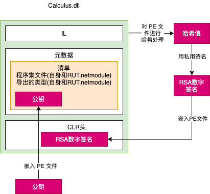
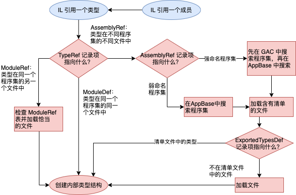

# 第 3 章 共享程序集和强命名程序集

本章内容：
* <a href="#3_1">两种程序集，两种部署</a>
* <a href="#3_2">为程序集分配强名称</a>
* <a href="#3_3">全局程序集缓存</a>
* <a href="#3_4">在生成的程序集中引用强命名程序集</a>
* <a href="#3_5">强命名程序集能防篡改</a>
* <a href="#3_6">延迟签名</a>
* <a href="#3_7">私有部署强命名程序集</a>
* <a href="#3_8">“运行时”如何解析类型引用</a>
* <a href="#3_9">高级管理控制(配置)</a>

第 2 章讲述了生成、打包和部署程序集的步骤。我将重点放在所谓的私有部署(private deployment)上。进行私有部署，程序集放在应用程序的基目录(或子目录)，由这个应用程序独享。以私有方式部署程序集，可以对程序集的命名、版本和行为进行最全面的控制。

本章重点是如何创建可由多个应用程序共享的程序集。 Microsoft .NET Framework 随带的程序集就是典型的全局部署程序集，因为所有托管应用程序都要使用 Microsoft 在 .NET Framework Class Library(FCL)中定义的类型。

第 2 章讲过， Windows 以前在稳定性上的口碑很差，主要原因是应用程序要用别人实现的代码进行生成和测试。(想想看，你开发的 Windows 应用程序是不是要调用由 Microsoft 开发人员写好的代码？)另外，许多公司都开发了供别人嵌入的控件。事实上， .NET Framework 鼓励这样做，以后的控件开发商会越来越多。

随着时间的推移， Microsoft 开发人员和控件开发人员会修改代码，这或许是为了修复bug、进行安全更新、添加功能等。最终，新代码会进入用户机器。以前安装好的、正常工作的应用程序突然要面对“陌生”的代码，不再是应用程序最初生成和测试时的代码。因此，应用程序的行为不再是可以预测的，这是造成 Windows 不稳定的根源。

文件的版本控制是个难题。取得其他代码文件正在使用的一个文件，即时只修改其中一位(将 0 变成 1，或者将 1 变成 0)，就无法保证使用该文件的代码还能正常工作。使用文件的新版本时，道理是一样的。之所以这样说，是因为许多应用程序都有意或无意地利用了 bug。如果文件的新版本修复了 bug，应用程序就不能像预期的那样运行了。

所以现在的问题是：如何在修复 bug 并添加新功能的同时，保证不会中断应用程序的正常运行？我对这个问题进行过大量思考，最后结论是完全不可能！但是，这个答案明显不够好。分发的文件总是有 bug，公司总是希望推陈出新。必须有一种方式在分发新文件的同时，尽量保证应用程序良好工作。如果应用程序不能良好工作，必须有一种简单的方式将应用程序恢复到上一次已知良好的状态。

本章将解释 .NET Framework 为了解决版本控制问题而建立的基础结构。事先说一句：要讲述的内容比较复杂。将讨论 CLR 集成的大量算法、规则和策略。还要提到应用程序开发人员必须熟练使用的大量工具和实用程序。之所以复杂，是因为如前所述，版本控制本来就是一个复杂的问题。

## <a name="3_1">3.1 两种程序集，两种部署</a>

CLR 支持两种程序集：**弱命名程序集**(weakly named assembly)和**强命名程序集**(strongly named assembly)。
> 重要提示 任何文档都找不到“弱命名程序集”这个术语，这是我自创的。事实上，文档中没有对应的术语来表示弱命名的程序集。通过自造术语，我在提到不同种类的程序集时可以避免歧义。

弱命名和强命名程序集结构完全相同。也就是说，它们都使用第 1 章和第 2 章讨论的 PE 文件格式、PE32(+)头、CLR头、元数据、清单表以及IL。生成工具也相同，都是C# 编译器或者 AL.exe。两者真正的区别在于，强命名程序集使用发布者的公钥/私钥进行了签名。这一对密钥允许对程序集进行唯一性的标识、保护和版本控制，并允许程序集部署到用户机器的任何地方，甚至可以部署到 Internet 上。由于程序集被唯一性地标识，所以当应用程序绑定到强命名程序集时，CLR 可以应用一些已知安全的策略。本章将解释什么是强命名程序集，以及 CLR 向其应用的策略。

程序集可采用两种方式部署：私有或全局。私有部署的程序集是指部署到应用程序基目录或者某个子目录的程序集。弱命名程序集只能以私有方式部署。第 2 章已讨论了私有部署的程序集。全局部署的程序集是指部署到一些公认位置的程序集。CLR 在查找程序集时，会检查这些位置。强命名程序集既可私有部署，也可全局部署。本章将解释如何创建和部署强命名程序集。表 3-1 总结了程序集的种类及其部署方式。

  表 3-1 弱命名和强命名程序集的部署方式
  |程序集种类|可以私有部署|可以全局部署|
  |:---:|:---:|:---:|
  |弱命名|是|否|
  |强命名|是|是|

## <a name="3_2">3.2 为程序集分配强名称</a>

要由多个应用程序访问的程序集必须放到公认的目录。另外，检测到对程序集的引用时，CLR 必须能自动检查该目录。但现在的问题是：两个(或更多)公司可能生成具有相同文件名的程序集。所以，假如两个程序集都复制到相同的公认目录，最后一个安装的就是“老大”，造成正在使用旧程序集的所有应用程序都无法正常工作(这正是 Windows “DLL hell”的由来，因为共享 DLL 全都复制到 System32 目录)。

只根据文件名来区分程序集明显不够。CLR 必须支持对程序集进行唯一性标识的机制。这就是所谓的“强命名程序集”。强命名程序集具有 4 个重要特性，它们共同对程序集进行唯一性标识：文件名(不计扩展名)、版本号、语言文化和公钥。由于公钥数字很大，所以经常使用从公钥派生的小哈希值，称为 **公钥标记**(public key token)。以下程序集标识字符串(有时称为**程序集显示名称**)标识了 4 个完全不同的程序集文件：

```sys
"MyTypes,Version=1.0.8123.0, Culture=neutral, PublicKeyToken=b77a5c561934e089"
"MyTypes,Version=1.0.8123.0, Culture="en-US", PublicKeyToken=b77a5c561934e089"
"MyTypes,Version=2.0.1234.0, Culture=neutral, PublicKeyToken=b77a5c561934e089"
"MyTypes,Version=1.0.8123.0, Culture=neutral, PublicKeyToken=b03f5f7f11d50a3a"
```

第一个标识的是程序集文件 MyTypes.exe 或 MyTypes.dll (无法根据“程序集标识字符串”判断文件扩展名)。生成该程序集的公司为其分配的版本号是 1.0.8123.0，而且程序集中没有任何内容与一种特定语言文化关联，因为 **Culture** 设为 **neutral** 。当然，任何公司都可以生成 MyTypes.dll(或 MyTypes.exe)程序集文件，为其分配相同的版本号 1.0.8123.0，并将语言文化设为中性。

所以，必须有一种方式区分恰好具有相同特性的两个公司的程序集。出于几方面的考虑，Microsoft 选择的是标准的公钥/私钥加密技术，而没有选择其他唯一性标识技术，如 GUID(Globally Unique Identifier，全局唯一标识符)、URL(Uniform Resource Locator，统一资源定位符)和URN(Uniform Resource Name，统一资源名称)。具体地说，使用加密技术，不仅能在程序集安装到一台机器上时检查其二进制数据的完整性，还允许每个发布者授予一套不同的权限。本章稍后会讨论这些技术。所以，一个公司要想唯一性地标识自己的程序集，必须创建一对公钥/私钥。然后，公钥可以和程序集关联。没有任何两家公司有相同的公钥/私钥对。这样一来，两家公司可以创建具有相同名称、版本和语言文化的程序集，同时不会产生任何冲突。  
> 注意 可以利用辅助类 `System.Reflection.AssemblyName` 轻松构造程序集名称，并获取程序集名称的各个组成部分。该类提供了几个公共实例属性，比如 **CultureInfo**，**FullName**，**KeyPair**，**Name** 和 **Version**，还提供了几个公共实例方法，比如 **GetPublicKey**，**GetPublicKeyToken**，**SetPublicKey** 和 **SetPublicKeyToken**。

第 2 章介绍了如何命名程序集文件，以及如何应用程序集版本号和语言文化。弱命名程序集可在清单元数据中嵌入程序集版本和语言文化；然而，CLR 通过探测子目录查找附属程序集(satellite assembly)时，会忽略版本号，只用语言文化信息。由于弱命名程序集总是私有部署，所以 CLR 在应用程序基目录或子目录(具体子目录由 XML 配置文件的 `probing` 元素的 `privatePath` 特性指定)中搜索程序集文件时只使用程序集名称(添加.dll 或 .exe扩展名)。

强命名程序集除了有文件名、程序集版本号和语言文化，还用发布者私钥进行了签名。

创建强命名程序集第一步是用 .NET Framework SDK 和 Microsoft Visual Studio 随带的  Strong Name 实用程序(SN.exe)获取密钥。SN.exe 允许通过多个命令行开关都区分大小写。为了生成公钥/私钥对，像下面这样运行 SN.exe：  
`SN -k MyCompany.snk`

这告诉 SN.exe 创建 MyCompany.snk 文件。文件中包含二进制形式的公钥和私钥。

公钥数字很大；如果愿意，创建 .snk 文件后可再次使用 SN.exe 查看实际公钥。这需要执行两次 SN.exe(C:\Program Files (x86)\Microsoft SDKs\Windows\v10.0A\bin\NETFX 4.8 Tools)。 第一次用 `-p` 开关创建只含公钥的文件 *(MyCompany.PublicKey)*:  
`SN –p MyCompany.snk MyCompany.PublicKey sha256`
> 本例使用 .NET Framework 4.5 引入的增强型强命名(Enhanced Strong Naming)。要生成和以前版本的 .NET Framework 兼容的程序集，还必须用 `AssemblySignatureKeyAttribute` 创建联署签名(counter-signature)。详情参见 *[http://msdn.microsoft.com/en-us/library/hh415055(v=vs.110).aspx](https://docs.microsoft.com/en-us/dotnet/standard/assembly/enhanced-strong-naming?redirectedfrom=MSDN)*

第二次用`-tp`开关执行，传递只含公钥的文件：  

`SN -tp MyCompany.PublicKey`  

执行上述命令，在我的机器上得到的输出如下：

```txt

Microsoft(R) .NET Framework 强名称实用工具 版本 4.0.30319.0
版权所有(C) Microsoft Corporation。保留所有权利。

公钥(哈希算法: sha256):
002400000c8000009400000006020000002400005253413100040000010001002d326e81541132
a1526fde64c6bd8ec89d7cc87e8c66513c6539b15de901995838f25360b35c4a0112521cd004e3
27498b439d3747026ad0cf5bb62ff3c031bbc8a21c28d4b282f20171e9387190dbb891e2d7186d
500ae7753b89e93790137d3c26e381a7120ea8459ef835ee11905447771dbc763017e3da297ac1
a9d843be

公钥标记为 10561fa1662d41b8
```

注意， SN.exe 实用程序未提供任何显示私钥的途径。

公钥太大，难以使用。为了简化开发人员的工作(也为了方便最终用户)，人们设计了 **公钥标记**(public key token)。公钥标记是公钥的 64 位哈希值。SN.exe 的 `-tp` 开关在输出结果的末尾显示了与完整公钥对应的公钥标记。

知道了如何创建公钥/私钥对，创建强命名程序集就简单了。编译程序集时使用 `/keyfile:<file>` 编译器开关：

`csc /keyfile:MyCompany.snk Program.cs`

C# 编译器看到这个开关会打开指定文件(MyCompany.snk)，用私钥对程序集进行签名，并将公钥嵌入清单。注意只能对含清单的程序集文件进行签名；程序集其他文件不能被显式签名。

要在 Visual Studio 中新建公钥/私钥文件，可显示项目属性，点击“签名”标签，勾选“为程序集签名”，然后从“选择强名称密钥文件”选择框中选择“<新建···>”。

“对文件进行签名”的准确含义是：生成强命名程序集时，程序集的 FileDef 清单元数据表列出构成程序集的所有文件。每将一个文件名添加到清单，都对文件内容进行哈希处理。哈希值和文件名一道存储到 FileDef 表中。要覆盖默认哈希算法，可使用 AL.exe 的 `/algid` 开关，或者在程序集的某个源代码文件中，在 assembly 这一级上应用定制特性 `System.Reflection.AssemblyAlgorithmIdAttribute`。默认使用 SHA-1 算法。

生成包含清单的 PE 文件后，会对 PE 文件的完整内容(除去 Authenticode Signature、程序集强名称数据以及 PE 头校验和)进行哈希处理，如图 3-1 所示。哈希值用发布者的私钥进行签名，得到的 RSA 数字签名存储到 PE 文件的一个保留区域(进行哈希处理时，会忽略这个区域)。PE 文件的 CLR 头进行更新，反映数字签名在文件中的嵌入位置。

  
图 3-1 对程序集进行签名  

发布者公钥也嵌入 PE 文件的 AssemblyDef 清单元数据表。文件名、程序集版本号、语言文化和公钥的组合为这个程序集赋予了一个强名称，它保证是唯一的。两家公司除非共享密钥对，否则即使都生成了名为 OurLibrary 的程序集，公钥/私钥也不能相同。

到此为此，程序集及其所有文件就可以打包和分发了。

如第 2 章所述，编译器在编译源代码时会检测引用的类型和成员。必须向编译器指定要引用的程序集——C#编译器是用`/reference` 编译器开关。编译器的一项工作是在最终的托管模块中生成 AssemblyRef 元数据表，其中每个记录项都指明被引用程序集的名称(无路径和扩展名)、版本号、语言文化和公钥信息。  
> 重要提示 由于公钥是很大的数字，而一个程序集可能引用其他大量程序集，所以在最终生成的文件中，相当大一部分会被公钥信息占据。为了节省存储空间， Microsoft 对公钥进行哈希处理，并获取哈希值的最后 8 个字节。 AssemblyRef 表实际存储的是这种简化的公钥值(称为“公钥标记”)。开发人员和最终用户一般看到的都是公钥标记，而不是完整公钥。    
> 但要注意，CLR 在做出安全或信任决策时，永远都不会使用公钥标记，因为几个公钥可能在哈希处理之后得到同一个公钥标记。

下面是一个简单类库 DLL 文件的 AssemblyRef 元数据信息(使用 ILDasm.exe 获得)：

```C#
AssemblyRef #1 (23000001)
-------------------------------------------------------
Token: 0x23000001
Public Key or Token: b7 7a 5c 56 19 34 e0 89 
Name: mscorlib
Version: 4.0.0.0
Major Version: 0x00000004
Minor Version: 0x00000000
Build Number: 0x00000000
Revision Number: 0x00000000
Locale: <null>
HashValue Blob:
Flags: [none] (00000000)
```

可以看出，这个 DLL 程序集引用了具有以下特性的一个程序集中的类型：  
`"MSCorLib, Version=4.0.0.0, Culture=neutral, PublicKeyToken=b77a5c561934e089"`  

遗憾的是， ILDasm.exe 在本该使用术语"Culture"的地方使用了“Locale”。检查 DLL 程序集的 AssemblyDef 元数据表看到以下内容：

```C#
Assembly
-------------------------------------------------------
Token: 0x20000001
Name : SomeClassLibrary
Public Key :
Hash Algorithm : 0x00008004
Version: 3.0.0.0
Major Version: 0x00000003
Minor Version: 0x00000000
Build Number: 0x00000000
Revision Number: 0x00000000
Locale: <null>
Flags : [none] (00000000)
```

它等价于：
`"SomeClassLibrary, Version=3.0.0.0, Culture=neutral, PublicKeyToken=null"`  

之所以没有公钥标记，是由于 DLL 程序集没有用公钥/私钥对进行签名，这使它成为弱命名程序集。如果用 SN.exe 创建密钥文件，再用`/keyfile` 编译器开关进行编译，最终的程序集就是经过签名的。使用 ILDasm.exe 查看新程序集的元数据， AssemblyDef 记录项就会在 Public Key 字段之后显示相应的字节，表明它是强命名程序集。顺便说一句，AssemblyDef 的记录项总是存储完整公钥，而不是公钥标记，这是为了保证文件没有被篡改。本章后面将解释强命名程序集如何防篡改。

## <a name="3_3">3.3 全局程序集缓存</a>

知道如何创建强命名程序集之后，接着学习如何部署它，以及 CLR 如何利用信息来定位并加载程序集。

由多个应用程序访问的程序集必须放到公认的目录，而且 CLR 检测到对程序集的引用时，必须知道检查该目录。这个公认位置就是**全局程序集缓存(Global Assembly Cache,GAC)**。GAC 的具体位置是一种实现细节，不同版本会有所变化。但是，一般能在以下目录发现它：
`%SystemRoot%\Microsoft.NET\Assembly`

GAC 目录是结构化的：其中包含许多子目录，子目录名称用算法生成。永远不要将程序集文件手动复制到 GAC 目录；相反，要用工具完成这项任务。工具知道 GAC 的内部结构，并知道如何生成正确的子目录名。

开发和测试时在 GAC 中安装强命名程序集最常用的工具是 [GACUtil.exe](https://docs.microsoft.com/zh-cn/dotnet/framework/tools/gacutil-exe-gac-tool)。`C:\Program Files (x86)\Microsoft SDKs\Windows\v10.0A\bin\NETFX 4.8 Tools`如果直接运行，不添加任何命令行参数，就会自动显示用法：

```C#
Microsoft (R) .NET Global Assembly Cache Utility.  Version 4.0.30319.0
Copyright (c) Microsoft Corporation.  All rights reserved.

Usage: Gacutil <command> [ <options> ]
Commands:
  /i <assembly_path> [ /r <...> ] [ /f ]
    Installs an assembly to the global assembly cache.  //将某个程序集安装到全局程序集缓存中

  /il <assembly_path_list_file> [ /r <...> ] [ /f ]
    Installs one or more assemblies to the global assembly cache. // 讲一个或多个程序集安装到全局程序集缓存中

  /u <assembly_display_name> [ /r <...> ]
    Uninstalls an assembly from the global assembly cache. // 将某个程序集从全局程序集缓存卸载

  /ul <assembly_display_name_list_file> [ /r <...> ]
    Uninstalls one or more assemblies from the global assembly cache. // 将一个或多个程序集从全局程序集缓存卸载

  /l [ <assembly_name> ]
    List the global assembly cache filtered by <assembly_name> // 列出通过 <assembly_name> 筛选出的全局程序集缓存

  /lr [ <assembly_name> ]
    List the global assembly cache with all traced references. // 列出全局程序集缓存以及所有跟踪引用

  /cdl
    Deletes the contents of the download cache  // 删除下载缓存的内容

  /ldl
    Lists the contents of the download cache   // 列出下载缓存的内容

  /?
    Displays a detailed help screen  // 显示详细帮助屏幕

 Options:
  /r <reference_scheme> <reference_id> <description>
    Specifies a traced reference to install (/i, /il) or uninstall (/u, /ul). // 指定要安装 (/i, /il) 或卸载(/u, /ul) 的跟踪引用

  /f
    Forces reinstall of an assembly.  // 强制重新安装程序集

  /nologo
    Suppresses display of the logo banner  // 取消显示徽标版权标志

  /silent
    Suppresses display of all output    // 取消显示所有输出
```

使用 GACUtil.exe 的`/i` 开关将程序集安装到 GAC，`/u`开关从 GAC 卸载程序集。注意不能将弱命名程序集放到 GAC 。向 GACUtil.exe 传递弱命名程序集的文件名会报错：**“将程序集添加到缓存失败：尝试安装没有强名称的程序集。”**  **Failure adding assembly to the cache: Attempt to install an assembly without a strong name.**
> 注意  GAC 默认只能由 Windows Administrator 用户组的成员操作。如果执行 GACUtil.exe 用户不是该组的成员， GACUtil.exe 将无法安装或卸载程序集。

GACUtil.exe 的 `/i` 开关方便开发人员在测试时使用。但如果是在生产环境中部署，建议安装或卸载程序集时除了制定 `/i` 或 `/u` 开关，还要置顶 `/r` 开关。 `/r` 开关将程序集与 Windows 的安装与卸载引擎集成。简单地说，它告诉系统那个应用程序需要程序集，并将应用程序与程序集绑定。
> 注意 如果将强命名程序集打包到.cab 文件中，或者以其他方式进行压缩，程序集的文件首先必须解压成临时文件，然后才能使用GACUtil.exe 将程序集文件安装到 GAC 中。安装好程序集的文件之后，临时文件可以删除。

.NET Framework 重分发包不随带提供 GACUtil.exe 工具。如果应用程序含有需要部署到 GAC 的程序集，应该使用 Windows Installer(MSI)，因为 MSI 使用户机器上肯定会安装，又能将程序集安装到 GAC 的工具。
> 重要提示 在GAC 中全局部署是对程序集进行注册的一种形式，虽然这个过程对 Windows 注册表没有半点影响。将程序集安装到 GAC 破坏了我们想要达到的一个基本目标，即：简单地安装、备份、还原、移动和卸载应用程序。所以，建议尽量进行私有而不是全局部署。

为什么要在 GAC 中“注册”程序集？假定两家公司都生成了名为 OurLibrary 的程序集，两个程序集都由一个 OurLibrary.dll 文件构成。这两个文件显然不能存储到同一个目录，否则最后一个安装的会覆盖第一个，造成应用程序被破坏。相反，将程序集安装到 GAC ，就会在 `%SystemRoot%\Microsoft.NET\Assembly` 目录下创建专门的子目录，程序集文件会复制到其中一个子目录。

一般没人去检查 GAC 的子目录，所以 GAC 的结构对你来说并不重要。只要使用的工具和 CLR 知道这个结构就可以了。

## <a name="3_4">3.4 在生成的程序集中引用强命名程序集</a>

你生成的任何程序集都包含对其他强命名程序集的引用，这是因为 `System.Object` 在 MSCorLib.dll 中定义，后者就是强命名程序集。此外，程序集中还可引用由 Microsoft、第三方厂商或者你自己公司发布的其他强命名程序集。第 2 章介绍了如何使用 CSC.exe 的 `/reference` 编译器开关指定想引用的程序集文件名。如果文件名是完整路径， CSC.exe 会加载指定文件，并根据它的元数据生成程序集。如第 2 章所述，如果指定不含路径的文件名，CSC.exe 会尝试在以下目录查找程序集(按所列顺序)。

1. 工作目录。
2. CSC.exe 所在的目录，目录中还包含 CLR 的各种 DLL 文件。
3. 使用 `/lib` 编译器开关指定的任何目录。
4. 使用 LIB 环境变量指定的任何目录。

所以，如果生成的程序集引用了 Microsoft 的 System.Drawing.dll，可在执行 CSC.exe 时使用 `/reference:System.Drawing.dll` 开关。编译器会依次检查上述目录，并在 CSC.exe 自己所在的目录找到 System.Drawing.dll 文件(该目录还存储了与编译器对应的那个版本的 CLR 的各种支持 DLL)。虽然编译时会在这里寻找程序集，但运行时不会从这里加载程序集。

安装 .NET Framework 时，实际会安装 Microsoft 的程序集文件的两套拷贝。一套安装到编译器 /CLR 目录，另一套安装到 GAC 的子目录。编译器 /CLR 目录中的文件方便你生成程序集，而 GAC 中的拷贝则方便在运行时加载。

CSC.exe 编译器之所以不在 GAC 中查找引用的程序集，是因为你必须知道程序集路径，而 GAC 的结构又没有正式公开。第二个方案是让 CSC.exe 允许你指定一个依然很长但相对比较容易阅读的字符串，比如“System.Drawing, Version=v4.0.0.0, Culture=neutral, PublicKeyToken=b03f5f7f11d50a3a”。但这两个方案都不如在用户硬盘上安装两套一样的程序集文件。

除此之外，编译器 /CLR 目录中的程序集不依赖机器。也就是说，这些程序集只包含元数据。由于编译时不需要 IL 代码，所以该目录不必同时包含程序集 x86， x64 和 ARM 版本。GAC 中的程序集才同时包含元数据和 IL 代码，因为仅在运行时才需要代码。另外，由于代码可针对特定 CPU 架构进行优化，所以 GAC 允许存在一个程序集的多个拷贝。每个 CPU 架构都有一个专门的子目录来容纳这些拷贝。

## <a name="3_5">3.5 强命名程序集能防篡改</a>

用私钥对程序集进行签名，并将公钥和签名嵌入程序集， CLR 就可验证程序集未被修改或破坏。程序集安装到 GAC 时，系统对包含清单的那个文件的内容进行哈希处理，将哈希值与 PE 文件中嵌入的 RSA 数字签名进行比较(在用公钥解除了签名之后)。如果两个值完全一致，表明文件内容未被篡改。此外，系统还对程序集的其他文件的内容进行哈希处理，并将哈希值与清单文件的 FileDef 表中存储的哈希值进行比较。任何一个哈希值匹配，表明程序集至少有一个文件被篡改，程序集将无法安装到 GAC。

应用程序需要绑定到程序集时，CLR 根据被引用程序集的属性(名称、版本、语言文化和公钥)在 GAC 中定位该程序集。找到被引用程序集，就返回包含它的子目录，并加载清单所在的文件。以这种方式查找程序集，可保证运行时加载的程序集和最初编译时生成的程序集来自同一个发布者，因为进行引用的程序集的 AssemblyRef 表中的公钥标记与被引用程序集的 AssemblyRef 表中的公钥匹配。如果被引用程序集不在 GAC 中，CLR 会查找应用程序的基目录，然后，如果应用程序由 MSI 安装， CLR 要求 MSI 定位程序集。如果在任何位置都找不到程序集，那么绑定失败，抛出 `System.IO.FileNotFoundException`异常。

如果强命名程序集文件从 GAC 之外的位置加载(通过应用程序的基目录，或者通过配置文件中的 `codeBase` 元素)，CLR 会在程序集加载后比较哈希值。也就是说，每次应用程序执行并加载程序集时，都会对文件进行哈希处理，以牺牲性能为代价，保证程序集文件内容没有被篡改。 CLR 在运行时检测到不匹配的哈希值会抛出 `System.IO.FileLoadException` 异常。
> 注意 将命名程序集安装到 GAC 时，系统会执行检查，确保包含清单的文件没有被篡改。这个检查仅在安装时执行一次。除此之外，为了增强性能，如果强命名程序集被完全信任，并加载到完全信任的 AppDomain 中，CLR 将不检查该程序集是否被篡改。相反，从非 GAC 的目录加载强命名程序集时， CLR 会校验程序集的清单文件，确保文件内容未被篡改，造成该文件每次加载都造成额外的性能开销。

## <a name="3_6">3.6 延迟签名</a>

本章前面讲过如何使用 SN.exe 工具生成公钥/私钥对。该工具生成密钥时会调用 Windows 提供的 Crypto API。 密钥可存储到文件或其他存储设备中。例如，大公司(比如 Microsoft)会将自己的私钥保存到一个硬件设备中，再将硬件锁进保险库。公司只有少数人才能访问私钥。这项措施可防止私钥泄露，并保证了密钥的完整性。当然，公钥是完全公开的，可以自由分发。

准备打包自己的强命名程序集时，必须使用受严密保护的私钥对它进行签名。然而，在开发和测试程序集时，访问这些受严密保护的私钥可能有点碍事儿。有鉴于此，.NET Framework 提供了对 **延迟签名**(delayed signing)的支持，该技术也称为**部分签名**(partial signing)。延迟签名允许只用公司的公钥生成程序集，暂时不用私钥。由于使用了公钥，引用了程序集的其他程序集会在它们的 AssemblyRef 元数据表的记录项中嵌入正确的公钥值。另外，它还使程序集能正确存储到 GAC 的内部结构中。当然，不用公司的私钥对文件进行签名，便无法实现防篡改保护。这是由于无法对程序集的文件进行哈希处理，无法在文件中嵌入数字签名。然而，失去这种保护不是一个大问题，因为只是在开发阶段才延迟签名。打包和部署程序集肯定会签名。

为了实现延迟签名，需要获取存储在文件中的公钥值，将文件名传给用于生成程序集的实用程序。(如本章前面所述，可用 SN.exe 的 `-p` 开关从包含公钥/私钥对的文件中提取公钥。)另外，还必须让工具知道你想延迟对程序集的签名，暂不提供私钥。如果是 C# 编译器，就指定 `/delaysign` 编译器开关。如果是 Visual Studio，就打开项目属性页，在“签名”选项卡中勾选“仅延迟签名”。如果使用 AL.exe，就指定 `/delay[sign]` 命令行开关。

编译器或 AL.exe 一旦检测到要对程序集进行延迟签名，就会生成程序集的 AssemblyDef 清单记录项，其中将包含程序集的公钥。公钥使程序集能正确存储到 GAC。另外，这也不妨碍引用了该程序集的其他程序集的正确生成。在进行引用的程序集的 AssemblyRef 元数据表记录项中，会包含(被引用程序集的)正确公钥。创建程序集时，会在生成的 PE 文件中为 RSA 数字签名预留空间(实用程序根据公钥大小判断需预留多大空间)。要注意的是，文件内容不会在这个时候进行哈希处理。

目前生成的程序集没有有效签名。安装到 GAC 会失败，因为尚未对文件内容执行哈希处理 —— 文件表面上已被篡改了。在需要安装到 GAC 的每台机器上，都必须禁止系统验证程序集文件的完整性。这要求使用 SN.exe 使用程序并指定 `-Vr` 命令行开关。用这个开关执行 SN.exe，程序集的任何文件在运行时加载时，CLR 都会跳过对其哈希值的检查。在内部，SN 的 `-Vr` 开关会将程序集的身份添加到一下注册表子项中：  
`HKEY_LOCAL_MACHINE\SOFTWARE\Microsoft\StrongName\Verification`  

> 重要提示 使用会修改注册表的任何实用程序时，请确保在 64 位操作系统中运行的是实用程序的 64 位版本。32 位 x86 实用程序默认安装到 `C:\Program Files (x86)\Microsoft SDKs\Windows\v8.0A\bin\NETFX 4.0 Tools` 目录，64 位 x64 实用程序安装到 `C:\Program Files(x86)\Microsoft SDKs\Windows\v8.0A\bin\NETFX 4.0 Tools\x64` 目录。

结束程序集的开发和测试之后，要正式对其进行签名，以便打包和部署它。为了对程序集进行签名，要再次使用 SN.exe 实用程序，但这次使用 `-R` 开关，并指定包含了私钥的文件的名称。 `-R` 开关指示 SN.exe 对文件内容进行哈希处理，用私钥对其进行签名，并将 RSA 数字签名嵌入文件中之前预留的空间。经过这一步之后，就可以部署完全签好名的程序集。在开发和测试机器上，不要忘记使用 SN.exe 的 `-Vu` 或 `-Vx` 命令行开关来重启用对这个程序集的验证。下面总结了使用延迟签名技术开发程序集的步骤。

1. 开发期间，获取只含公司公钥的文件，使用`/keyfile` 和 `/delaysign` 编译器开关编译程序集：  
   `csc /keyfile:MyCompany.PublicKey /delaysign MyAssembly.cs`  
2. 生成程序集后执行以下命令，使 CLR 暂时信任程序集的内容，不对它进行哈希处理，也不对哈希值进行比较。这使程序集能顺利安装到 GAC(如果有必要的话)。现在，可以生成引用了这个程序集的其他程序集，并可随意测试程序集。注意，在每台开发用的机器，以下命令行都只需执行一次，不必每次生成程序集都重复这一步：  
  `SN.exe -Vr MyAssembly.dll`  
3. 准备好打包和部署程序集时，获取公司的私钥并执行以下命令。如果愿意，可以将这个新版本安装到 GAC 中。但只有先完成步骤 4，才能把它安装到 GAC 中。  
  `SN.exe -Ra MyAssembly.dll MyCompany.PrivateKey`  
4. 为了在实际环境中测试，请执行以下命令行，重新启用对这个程序集的验证：  
  `SN -Vu MyAssembly.dll`

本节开头就指出，大公司会将自己的密钥存储到硬件设备(比如智能卡)中。为了确保密钥的安全性，密钥值绝对不能固定存储在磁盘文件中。“加密服务提供程序”(Cryptographic Service Provider, CSP)提供了对这些密钥的位置进行抽象的容器。以 Microsoft 使用的 CSP 为例，一旦访问它提供的容器，就自动从一个硬件设备获取私钥。

如果公钥/私钥对在 CSP 容器中，必须为 CSC.exe、AL.exe 和 SN.exe 程序指定不同的开关。编译时(CSC.exe)指定`/keycontainer` 开关而不是 `/keyfile` 开关；链接时(AL.exe)指定 `/keyname` 开关而不是 `/keyfile` 开关；使用强名称程序(SN.exe)对延迟签名的程序集进行重新签名时，指定`-Rc` 开关而不是 `-R` 开关。 SN.exe 提供了另外几个开关让开发人员与 CSP 互动。

> 重要提示 打包程序集前，如果想对它执行其他任何操作，延迟签名也非常有用。例如，可能想对程序集进行混淆器(obfuscator)程序。程序集完全签名后就不能运行混淆器了，否则哈希值就不正确了。所以，要混淆程序集文件，或者进行其他形式的“生成后”(post-build)操作，就利用延迟签名技术，先完成“生成后”操作，再用`-R` 或 `-Rc` 开关运行 SN.exe 对程序集进行完全签名。

## <a name="3_7">3.7 私有部署强命名程序集</a>

在 GAC 中安装程序集有几方面的优势。GAC 使程序集能被多个应用程序共享，减少了总体物理内存消耗。另外，很容易将程序集的新版本部署到 GAC， 让所有应用程序都通过发布者策略(本章稍后讲述)使用新版本。GAC 还实现了对程序集多个版本的并行管理。但 GAC 通常受到严密保护，只有管理员才能在其中安装程序集。另外，一旦安装到 GAC，就违反了“简单复制部署”这一基本目标。
> 本来，简单复制一下程序集的文件就可以完成部署。但安装到 GAC 之后，就没有这么简单了。 ——译注

虽然强命名程序集能安装到 GAC，但绝非必须。事实上，只有由多个应用程序共享的程序集才应部署到 GAC。不用共享的应该私有部署。私有部署达成了“简单复制部署”目标，而且能更好地隔离应用程序集。另外，不要将 GAC 想象成新的 `C:\Windows\System32` 垃圾堆积场。另外，不要将 GAC 想象成新的`C:\Windows\System32` 垃圾堆积场。这是因为新版本程序集不会相互覆盖，它们并行安装，每个安装都占用磁盘空间。

强命名程序集除了部署到 GAC 或者进行私有部署，这可部署到只有少数应用程序知道的目录。例如，假定强命名程序集由三个应用程序共享。安装时可创建三个目录，每个程序一个目录。再创建第四个目录，专门存储要共享的程序集。每个应用程序安装到自己的目录时都同时安装一个 XML 配置文件，用 `codeBase` 元素指出共享程序集路径。这样在运行时，CLR 就知道去哪里查找共享程序集。但要注意，这个技术很少使用，也不太推荐使用，因为所有应用程序都不能独立决定何时卸载程序集的文件。
> 注意 配置你文件的 `codeBase` 元素实际标记了一个URL。这个 URL 可引用用户机器上的任何目录，也可引用 Web 地址。如果引用 Web 地址，CLR 会自动下载文件，并把它存储到用户的下载缓存(`%UserProfile%\Local Settings\Application Data\Assembly` 下的子目录)。将来引用时，CLR 将下载文件的时间戳与 URL 处的文件的时间戳进行对比。如果 URL 处的文件具有较新的时间戳，CLR 下载新版本并加载。否则，CLR 加载现有文件，不重复下载(从而增强性能)。本章稍后会展示包含 `codeBase` 元素的示例配置文件。

## <a name="3_8">3.8 “运行时”如何解析类型引用</a>

第 2 章开头展示了以下代码：

```C#
public sealed class Program {
  public static void Main(){
   System.Console.WriteLine("Hi");
  }
}
```

编译这些代码并生成程序集(假定名为 Program.exe)。运行应用程序，CLR 会加载并初始化自身，读取程序集的 CLR 头，查找标识了应用程序入口方法(**Main**) 的 MethodDefToken，检索 MethodDef 元数据表找到方法的 IL 代码在文件中的偏移量，将 IL 代码 JIT 编译成本机代码(编译时会对代码进行验证以确保类型安全)，最后执行本机代码。下面就是 **Main** 方法的 IL 代码。要查看代码，请对程序集运行 ILDasm.exe 并选择“视图”|“显示字节”，双击树形视图的 **Main** 方法。

```IL
.method public hidebysig static void  Main() cil managed
// SIG: 00 00 01
{
  .entrypoint
  // Method begins at RVA 0x2050
  // Code size       13 (0xd)
  .maxstack  8
  IL_0000:  /* 00   |                  */ nop
  IL_0001:  /* 72   | (70)000001       */ ldstr      "Hi"
  IL_0006:  /* 28   | (0A)000005       */ call       void [mscorlib]System.Console::WriteLine(string)
  IL_000b:  /* 00   |                  */ nop
  IL_000c:  /* 2A   |                  */ ret
} // end of method Program::Main
```

对这些代码进行 JIT 编译，CLR 会检测所有类型和成员引用，加载它们的定义程序集(如果尚未加载)。上述 IL 代码包含对 `System.Console.WriteLine` 的引用。具体地说，IL `call` 指令引用了元数据 token 0A000003。该 token 标识 MemberRef 元数据表(表 0A)中的记录项3。CLR 检查该 MemberRef 记录项，发现它的字段引用了 TypeRef 表中的记录项(`System.Console` 类型)。按照 TypeRef 记录项， CLR 被引导至一个 AssemblyRef 记录项："mscorlib, Version=4.0.0.0, Culture=neutral, PublicKeyToken=b77a5c561934e089"。这时 CLR 就知道了它需要的是哪个程序集。接着， CLR 必须定位并加载该程序集。
> 元数据token的详情请参加 2.4 节。——译注

解析引用的类型时， CLR 可能在以下三个地方找到类型。

* **相同文件**
  编译时便能发现对相同文件中的类型的访问，这称为**早期绑定(early binding)**。类型直接从文件中加载，执行继续。
  > 对应地，在运行时通过反射机制绑定到类型并调用方法，就称为晚期绑定(late binding)。 ——译注

* **不同文件，相同程序集**  
  “运行时”确保被引用的文件在当前程序集元数据的 FileDef 表中，检查加载程序集清单文件的目录，加载被引用的文件，检查哈希值以确保文件完整性。发现类型的成员，执行继续。

* **不同文件，不同程序集**
  如果引用的类型在其他程序集的文件中，“运行时”会加载被引用程序集的清单文件。如果需要的类型不在该文件中，就继续加载包含了类型的文件。发现类型的成员，执行继续。

> 注意 ModuleDef，ModuleRef 和 FileDef 元数据表在引用文件时使用了文件名和扩展名名。但 AssemblyRef 元数据表只使用文件名，无扩展名。和程序集绑定时，系统通过探测目录来尝试定位文件，自动附加 .dll 和 exe 扩展名，详见 2.8 节“简单管理控制(配置)”。

解析类型引用时有任何错误(找不到文件、文件无法加载、哈希值不匹配等)都会抛出相应异常。
> 注意 可以向`System.AppDomain` 的 `AssemblyResolve`，`ReflectionOnlyAssemblyResolve`和`TypeResolve` 事件注册回调方法。在回调方法中执行解决绑定问题的代码，使应用程序不抛出异常而继续运行。

在上例中，CLR 发现 `System.Console` 在和调用者不同的程序集中实现。所以，CLR 必须查找那个程序集，加载包含程序集清单的 PE 文件。然后扫描清单，判断是哪个 PE 文件实现了类型。如果被引用的类型就在清单文件中，一切都很简单。如果类型在程序集的另一个文件中，CLR 必须加载那个文件，并扫描其元数据来定位类型。然后，CLR 创建它的内部数据结构来表示类型，JIT 编译器完成 `Main` 方法的编译。最后， `Main` 方法开始执行。图 3-2 演示了类型绑定过程。
> 重要提示 严格意义上，刚才的例子并非百分之百正确。如果引用的不是.NET Framework 程序集定义的类型和方法，刚才的讨论没有任何问题。但是，.NET Framework程序集(MSCorLib.dll就是其中之一)和当前运行的 CLR 版本紧密绑定。引用 .NET Framework 程序集的任何程序集总是绑定到与 CLR 版本对应的那个版本(的 .NET Framework 程序集)。这就是所谓的“统一”(Unification)。之所以要“统一”，是因为所有.NET Framework 程序集都是针对一个特定版本的 CLR 来完成测试的。因此，“统一”代码结构(code stack)可确保应用程序正确工作。
> 所以在前面的例子中，对 `System.Console`的`WriteLine` 方法的引用必然绑定到与当前 CLR 版本对应的 MSCorLib.dll 版本——无论程序集 AssemblyRef 元数据表引用哪个版本的 MSCorLib.dll。

  

图 3-2 对于引用了方法或类型的 IL 代码， CLR 怎样通过元数据来定位定义了类型的程序集文件  

还要注意，对于 CLR ，所有程序集都根据名称、版本、语言文化和公钥来识别。但 GAC 根据名称、版本、语言文化、公钥和 CPU 架构来识别。在 GAC 中搜索程序集时，CLR 判断应用程序当前在什么类型的进程中运行，是 32 位 x64(可能使用 WoW64技术)，64位 x64，还是 32 位 ARM 。然后，在 GAC 在中
搜索程序集时，CLR 首先搜索程序集的 CPU 架构专用版本。如果没有找到符合要求的，就搜索不区分 CPU 的版本。

本节描述的是 CLR 定位程序集的默认策略，但管理员或程序集发布者可能覆盖默认策略。接着两节将讨论如何更改 CLR 默认绑定策略。
> 注意 CLR 提供了将类型(类、结构、枚举、接口或委托)从一个程序集移动到另一个程序集的功能。例如，.NET 3.5 的 `System.TimeZoneInfo` 类在 System.Core.dll 程序集中定义。但在 .NET 4.0 中，Microsoft 将这个类移动到了 MSCorLib.dll 程序集。将类型从一个程序集移动到另一个程序集，一般情况下会造成应用程序集“中断”。但 CLR 提供了名为 `System.Runtime.CompilerServices.TypeForwardedToAttribute` 的特性，可将它应用于原始程序集(比如 System.Core.dll)。要向该特性的构造器传递一个 `System.Type` 类型的参数，指出应用程序要使用的新类型(现在是在 MSCorLib.dll 中定义)。CLR 的绑定器(binder)会利用到这个信息。由于 `TypeForwardedToAttribute` 的构造器获取的是 `Type`，所以包含该特性的程序集*要依赖于*现在定义类型的程序集。
> 为了使用这个功能，还要向新程序集中的类型应用名为 `System.Runtime.CompilerServices.TypeForwardedFromAttribute` 的特性，向该特性的构造传递一个字符串来指出定义类型的旧程序集的全名。该特性一般由工具、实用程序和序列化使用。由于 `TypeForwardedFromAttribute` 的构造器获取的是 `String`，所以包含该特性的程序集不依赖于过去定义类型的程序集。

## <a name="3_9">3.9 高级管理控制(配置)</a>

2.8 节“简单管理控制(配置)”简要讨论了管理员如何影响 CLR 搜索和绑定程序集的方式。那一节演示了如何将被引用程序集的文件移动到应用程序基目录下的一个子目录，以及 CLR 如何通过应用程序的 XML 配置文件来定位发生移动的文件。

第 2 章只讨论了 `probing` 元素的 `privatePath` 属性，本节要讨论 XML 配置文件的其他元素。以下是一个示例 XML 配置文件：

```xml
<?xml version="1.0"?> 
<configuration>
  <runtime>
    <assemblyBinding xmlns="urn:schemas-microsoft-com:asm.v1">
      <probing privatePath="AuxFiles;bin\subdir" /> 
      <dependentAssembly>
        <assemblyIdentity name="SomeClassLibrary" publicKeyToken="32ab4ba45e0a69a1" culture="neutral"/>
        <bindingRedirect oldVersion="1.0.0.0" newVersion="2.0.0.0" />
        <codeBase version="2.0.0.0" href="http://www.Wintellect.com/SomeClassLibrary.dll" />
      </dependentAssembly> 
      <dependentAssembly>
        <assemblyIdentity name="TypeLib" publicKeyToken="1f2e74e897abbcfe" culture="neutral"/>
        <bindingRedirect oldVersion="3.0.0.0-3.5.0.0" newVersion="4.0.0.0" />
        <publisherPolicy apply="no" /> 
      </dependentAssembly>
    </assemblyBinding>
  </runtime>
</configuration>
```

这个 XML 文件为 CLR 提供了丰富的信息。具体如下所示。

* probing 元素
  查找弱命名程序集时，检查应用程序基目录下的 AuxFiles 和 bin\subdir 子目录。对于强命名程序集， CLR 检查 GAC 或者由 `codeBase` 元素指定的 URL。只有在未指定 `codeBase` 元素时，CLR 才会在应用程序的私有路径中检查强命名程序集。
* 第一个 dependentAssembly，assemblyIdentity 和 bindingRedirect 元素
  查找由控制着公钥标记 32ab4ba45e0a69a1 的组织发布的、语言文化为中性的 SomeClassLibrary 程序集的 1.0.0.0 版本时，改为定位同一个程序集的 2.0.0.0 版本。
* codeBase 元素
  查找由控制着公钥标记 32ab4ba45e0a69a1 的组织发布的、语言文化为中性的 SomeClassLibrary 程序集的 2.0.0.0 版本时，尝试在以下 URL 处发现它：*www.Wintellect.com/SomeClassLibrary.dll*。虽然第 2 章没有特别指出，但 **codeBase** 元素也能用于弱命名程序集。如果是这样，程序集版本号会被忽略，而且根本就不应该在 XML **codeBase** 元素中写这个版本号。另外，**codeBase**定义的 URL 必须指向应用程序基目录下的一个子目录。
* 第二个 dependentAssembly， assemblyIdentity 和 bindingRedirect 元素  
  查找由控制着公钥标记 1f2e74e897abbcfe 的组织发布的、语言文化为中性的 TypeLib 程序集的 3.0.0.0 到 3.5.0.0 版本时(包含 3.0.0.0 和 3.5.0.0 在内)，改为定位同一程序集的 4.0.0.0 版本。
* publisherPolicy 元素
  如果生成 TypeLib 程序集的组织部署了发布者策略文件(详情在一节讲述)，CLR 应忽略该文件。

编译方法时，CLR 判断它引用了哪些类型和成员。根据这些信息，“运行时”检查进行引用的程序集的 AssemblyRef 表，判断程序集生成时引用了哪些程序集。然后，CLR 在应用程序配置文件中检查程序集/版本，进行指定的版本号重定向操作。随后，CLR 查找新的、重定向的程序集/版本。

如果 `publisherPolicy` 元素的 `apply` 特性设为 `yes`，或者该元素被省略，CLR 会在 GAC 中检查新的程序集/版本，并进行程序集发布者认为有必要的任何版本号重定向操作。随后，CLR 查找新的、重定向的程序集/版本。(下一节将更详细讨论发布者策略。) 最后，CLR 在机器的 Machine.config 文件中检查新的程序集/版本并进行指定的版本号重定向操作。

到此为止，CLR 已知道了它应加载的程序集版本，并尝试从 GAC 中加载。如果程序集不在 GAC 中，也没有 `codeBase` 元素， CLR 会像第 2 章描述的那样探测程序集。如果执行最后一次重定向操作的配置文件同时包含 `codeBase` 元素， CLR 会尝试从 `codeBase` 元素指定的 URL 处加载程序集。

利用这些配置文件，管理员可以实际地控制 CLR 加载的程序集。如果应用程序出现 bug，管理员可以和有问题的程序集的发布者取得联系。发布者将新程序集发送给管理员，让管理员安装。 CLR 默认不加载新程序集，因为已生成的程序集并没有引用新版本。不过，管理员可以修改应用程序的 XML 配置文件，指示 CLR 加载新程序集。

如果管理员希望机器上的所有应用程序都使用新程序集，可以修改机器的 Machine.config 文件。这样每当应用程序引用旧程序集时，CLR 都自动加载新程序集。

如果发现新程序集没有修复 bug，管理员可以从配置文件中删除 `bindingRedirect` 设置，应用程序会恢复如初。说了这么多，其实重点只有一个：系统允许使用和元数据所记录的不完全匹配的程序集版本。这种额外的灵活性非常有用。

### 发布者策略控制

在上一节的例子中，是由程序集发布者将程序集的新版本发送给管理员，后者安装程序集，并手动编辑应用程序或机器的 XML 配置文件。通常，发布者希望在修复了程序集的 bug 之后，采用一种容易的方式将新程序集打包并分发给所有用户。但是，发布者还需要一种方式告诉每个用户的 CLR 使用程序集新版本，而不是继续使用旧版本。当然，可以指示每个用户手动修改应用程序或机器的 XML 配置文件，但这相当不便，而且容易出错。因此，发布者需要一种方式创建策略信息。新程序集安装到用户机器上时，会安装这种策略信息。本节将描述程序集的发布者如何创建这种策略信息。

假定你是程序集的发布者，刚刚修复了几个 bug，创建了程序集的新版本。打包要发送给所有用户的新程序集时，应同时创建一个 XML 配置文件。这个配置文件和以前讨论过的配置文件差不多。下面是用于 SomeClassLibrary.dll 程序集的示例文件(名为 SomeClassLibrary.config)：

```xml
<configuration> 
  <runtime>
    <assemblyBinding xmlns="urn:schemas-microsoft-com:asm.v1"> 
      <dependentAssembly>
        <assemblyIdentity name="SomeClassLibrary" publicKeyToken="32ab4ba45e0a69a1" culture="neutral"/>
        <bindingRedirect oldVersion="1.0.0.0" newVersion="2.0.0.0" />
        <codeBase version="2.0.0.0" href="http://www.Wintellect.com/SomeClassLibrary.dll"/>
      </dependentAssembly> 
    </assemblyBinding>
  </runtime> 
</configuration>
```

当然，发布者只能为自己创建的程序集设置策略。另外，发布者策略配置文件只能使用列出的这些元素：例如, `probing` 或 `publisherPolicy` 元素是不能使用的。

该配置文件告诉 CLR 一旦发生对 SomeClassLibrary 程序集的 1.0.0.0 版本的引用，就自动加载 2.0.0.0 版本。现在，发布者就可以创建包含该发布者策略配置文件的程序集，像下面这样运行 AL.exe ：

```cmd
AL.exe /out:Policy.1.0.SomeClassLibrary.dll /version:1.0.0.0 
/keyfile:MyCompany.snk /linkresource:SomeClassLibrary.config
```

下面是对 AL.exe 的命令行开关的解释。

* `/out` 告诉 AL.exe 创建新 PE 文件，本例是 Policy.1.0.SomeClassLibrary.dll，其中除了一个清单什么都没有。程序集名称很重要。名称第一部分(Policy)告诉 CLR 这个发布者策略程序集适用于 major 和 minor 版本为 1.0 的任何版本的 SomeClassLibrary 程序集。发布者策略只能和程序集的 major 和 minor 版本号关联；不能和 build 或 revision 号关联。名称第四部分(SomeClassLibrary)指出与发布者策略对应的程序集名称。名称第五部分(dll)是现在要生成的发布者策略程序集文件的扩展名。

* `/version` 标识发布者策略程序集的版本；这个版本号与 SomeClassLibrary 程序集本身没有任何关系。看的出来，发布者策略程序集本身也有一套版本机制。例如，发布者今天创建一个发布者策略，将 SomeClassLibrary 的版本 1.0.0.0 重定向到版本 2.5.0.0。未来，发布者可能将 SomeClassLibrary 的版本 1.0.0.0 重定向到版本 2.5.0.0。CLR 根据 `/version` 开关指定的版本号来选择最新版本的发布者策略程序集。

* `/keyfile` 告诉 AL.exe 使用发布者的“公钥/私钥对”对发布者策略程序集进行签名。这一对密钥还必须匹配所有版本的 SomeClassLibrary 程序集使用的密钥对。毕竟，只有这样，CLR 才知道 SomeClassLibrary 程序集和发布者策略文件由同一个发布者创建。

* `/linkresource` 告诉 AL.exe 将 XML 配置文件作为程序集的一个单独的文件。最后的程序集由两个文件构成，两者必须随同新版本 SomeClassLibrary 程序集打包并部署到用户机器。顺便说一句，不能使用 AL.exe 的 `/embedresource` 开关将 XML 配置文件嵌入程序集文件，从而获得一个单文件程序集。因为 CLR 要求 XML 文件独立。

一旦生成这个发布者策略程序集，就可随同新的 SomeClassLibrary.dll 程序集文件打包并部署到用户机器。发布者策略程序集必须安装到 GAC。 虽然 SomeClassLibrary 程序集也能安装到 GAC ，但并不是必须的 —— 它可以部署到应用程序基目录，也可部署到由 `codeBase` URL 标识的其他目录。
> 重要提示 只有部署程序集更新或 Service Pack 时才应创建发布者策略程序集。执行应用程序的全新安装不应安装发布者策略程序集。

关于发布者策略最后注意一点。假定发布者推出发布者策略程序集时，因为某种原因，新程序集引入的 bug 比它能修复的 bug 还要多，那么管理员可指示 CLR 忽略发布者策略程序集。这要求编辑应用程序的配置文件并添加以下 `publisherPolicy` 元素：
`<publisherPolicy apply="no" />`

该元素可作为应用程序配置文件的 `<assemblyBinding>` 元素的子元素使用，使其应用于所有程序集；也可作为应用程序配置文件的 `<dependantAssembly>` 元素的子元素使用，使其应用于特定程序集。当 CLR 处理应用程序配置文件时，就知道自己不应在 GAC 中检查发布者策略程序集。CLR 会沿用旧版本程序集。但要注意，CLR 仍会检查并应用 Machine.config 文件指定的任何策略。
> 重要提示 创建发布者策略程序集，发布者相当于肯定了程序集不同版本的兼容性。如果新版本程序集不兼容某个老版本，就不应创建发布者策略程序集。通常，如果需要生成程序集的 bug 修复版本，就应该提供发布者策略程序集。作为发布者，应主动测试新版本程序集的向后兼容性。相反，如果要在程序集中增添新功能，就应该把它视为与之前版本没有关联的程序集，不要随带发布者策略程序集。另外，也不必测试这类程序集的向后兼容性。
